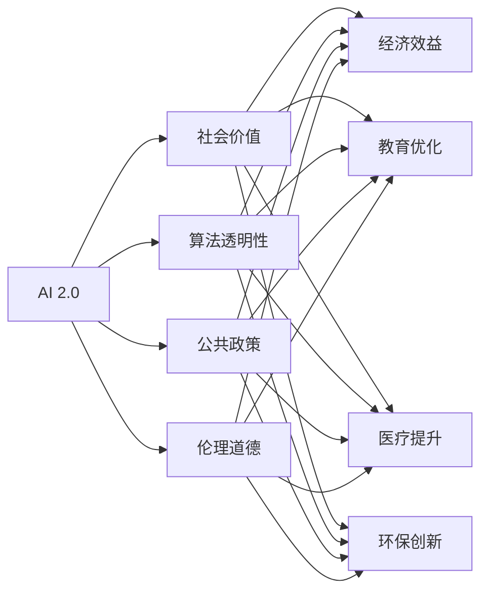

                 

# 李开复：AI 2.0 时代的社会价值

> 关键词：人工智能, AI 2.0, 社会价值, 算法透明, 公共政策, 伦理道德

## 1. 背景介绍

### 1.1 问题由来
随着AI技术的飞速发展，人工智能(AI)已不再是科幻电影中的虚构设定，而是渗透到我们日常生活的方方面面。从自动驾驶、智能推荐，到语音助手、图像识别，AI正在深刻改变着人类的生产方式、工作模式和生活习惯。然而，AI的发展并非一帆风顺，伴随着技术进步的，是关于AI对社会影响的广泛讨论。

本文旨在探讨在AI 2.0时代，我们应如何审视和评估AI的社会价值，确保技术进步能够真正惠及全人类，并促进社会的公平与和谐发展。通过阐述AI的社会价值、算法透明性、公共政策与伦理道德，我们将提供一个多维度的分析框架，以期为未来AI技术的健康发展提供有价值的洞见。

### 1.2 问题核心关键点
- **AI的社会价值**：AI技术如何影响经济、教育、医疗、环保等多个社会领域？
- **算法透明性**：AI算法应具备哪些透明性要求，如何保障公众对其决策的理解与信任？
- **公共政策**：政府应如何制定和调整相关政策，以引导AI技术的健康发展？
- **伦理道德**：AI技术开发和应用过程中应遵守哪些伦理规范，避免可能的道德困境？

## 2. 核心概念与联系

### 2.1 核心概念概述

在探讨AI的社会价值时，我们需要理解以下几个关键概念：

- **AI 2.0**：指基于深度学习、大规模数据集和强大计算能力的新一代人工智能技术。AI 2.0相较于早期的AI 1.0，更加智能化、自动化，能够处理更复杂、更高维度的任务。
- **社会价值**：AI技术的应用给社会带来的积极影响和益处。
- **算法透明性**：AI算法的决策过程应具有透明度，便于用户理解、信任和监管。
- **公共政策**：政府为促进AI技术的合理发展而制定的法规、政策和标准。
- **伦理道德**：AI开发和应用过程中应遵守的道德规范，保障人类尊严和社会公正。

这些概念之间相互关联，共同构成了AI 2.0时代社会价值的评估框架。通过分析这些概念，我们可以更好地理解AI技术的潜力与风险，制定相应的政策与规范，促进AI技术的良性发展。

### 2.2 核心概念原理和架构的 Mermaid 流程图



这个流程图展示了AI 2.0技术如何通过社会价值、算法透明性、公共政策与伦理道德的多维互动，影响经济、教育、医疗、环保等各个领域。

## 3. 核心算法原理 & 具体操作步骤

### 3.1 算法原理概述

AI 2.0的核心算法原理主要基于深度学习模型，如卷积神经网络(CNN)、循环神经网络(RNN)、长短期记忆网络(LSTM)和变压器(Transformer)等。这些模型通过大量数据进行训练，学习到复杂的特征表示，并用于各种任务，如图像识别、自然语言处理、语音识别和自动驾驶等。

AI 2.0的训练过程通常包含两个阶段：预训练和微调。预训练阶段在大规模无标签数据上训练模型，使其学习到通用的特征表示；微调阶段则在有标签数据上进一步优化模型，使其适应特定的任务需求。

### 3.2 算法步骤详解

1. **数据收集与准备**：收集与任务相关的数据，并进行预处理，如数据清洗、标准化、特征工程等。
2. **模型选择与构建**：选择合适的深度学习模型，并根据任务需求进行构建。
3. **预训练**：在大规模无标签数据上预训练模型，使其学习到通用的特征表示。
4. **微调**：在有标签数据上微调模型，适应特定任务需求。
5. **评估与优化**：在验证集上评估模型性能，并进行超参数调优和模型优化。
6. **部署与监控**：将优化后的模型部署到实际应用中，并持续监控其性能。

### 3.3 算法优缺点

**优点**：
- **高效性**：AI 2.0算法能够高效处理大量复杂数据，快速提取特征，显著提高工作效率。
- **广泛适用性**：适用于多种任务，如图像识别、自然语言处理、语音识别等。
- **可解释性**：一些算法（如Transformer）已经逐渐具备了一定的可解释性，便于用户理解。

**缺点**：
- **数据依赖**：需要大量标注数据进行微调，获取高质量标注数据成本较高。
- **模型复杂性**：大模型参数众多，训练和推理成本较高。
- **透明性不足**：一些算法决策过程复杂，难以解释和理解。
- **伦理风险**：可能存在偏见、歧视等问题，需要谨慎处理。

### 3.4 算法应用领域

AI 2.0技术在多个领域展现了其广泛的应用潜力，包括但不限于：

- **医疗健康**：通过图像识别、自然语言处理等技术，辅助医生诊断疾病、制定治疗方案，提升医疗服务效率和质量。
- **智能交通**：应用AI技术进行交通流量预测、自动驾驶、智能导航等，提高交通系统的安全性和效率。
- **金融服务**：利用AI进行风险评估、信用评分、智能投顾等，提升金融服务的精准度和效率。
- **教育领域**：通过个性化推荐系统、智能辅导等，优化教育资源配置，提升教学质量和学习体验。
- **环境保护**：利用AI进行气候预测、环境监测、资源优化等，推动可持续发展。

## 4. 数学模型和公式 & 详细讲解 & 举例说明

### 4.1 数学模型构建

AI 2.0的核心算法通常基于深度学习框架，如TensorFlow、PyTorch等。以卷积神经网络(CNN)为例，其数学模型构建如下：

- **输入层**：输入数据，如图像像素值。
- **卷积层**：通过卷积操作提取特征，形如：$x = \sigma(Wx + b)$。
- **池化层**：对特征图进行降采样，如最大池化：$y = \max(x_1, x_2, \dots, x_n)$。
- **全连接层**：将特征图转化为输出，如分类问题：$z = W\sigma(x)$。

### 4.2 公式推导过程

以卷积神经网络为例，其前向传播过程如下：

$$
x_1 = \sigma(W_1x + b_1)
$$

$$
x_2 = \sigma(W_2x_1 + b_2)
$$

$$
y = \max(x_2)
$$

$$
z = Wz + b
$$

其中，$\sigma$为激活函数，$W$和$b$为卷积核和偏置。

### 4.3 案例分析与讲解

假设我们希望训练一个用于手写数字识别的卷积神经网络。我们可以从手写数字图像中提取像素值作为输入，通过卷积层和池化层提取特征，最后通过全连接层进行分类。训练过程通过最小化交叉熵损失函数进行，如：

$$
L = -\frac{1}{N}\sum_{i=1}^N \sum_{j=1}^C y_{ij} \log(z_{ij})
$$

其中，$y_{ij}$表示样本$i$在类别$j$上的真实标签，$z_{ij}$表示模型对样本$i$在类别$j$上的预测概率。

## 5. 项目实践：代码实例和详细解释说明

### 5.1 开发环境搭建

为进行AI 2.0模型的开发与训练，我们需要搭建相应的开发环境。以下是Python环境下使用PyTorch进行模型开发的步骤：

1. 安装Python和PyTorch环境：
   ```bash
   conda create -n pytorch-env python=3.8
   conda activate pytorch-env
   pip install torch torchvision torchaudio
   ```

2. 安装必要的工具包，如NumPy、Pandas、Matplotlib等：
   ```bash
   pip install numpy pandas matplotlib scikit-learn
   ```

3. 安装TensorBoard：
   ```bash
   pip install tensorboard
   ```

4. 安装Weights & Biases：
   ```bash
   pip install w&b
   ```

### 5.2 源代码详细实现

以下是一个简单的卷积神经网络模型实现，用于手写数字识别：

```python
import torch
import torch.nn as nn
import torch.nn.functional as F

class Net(nn.Module):
    def __init__(self):
        super(Net, self).__init__()
        self.conv1 = nn.Conv2d(1, 10, kernel_size=5)
        self.conv2 = nn.Conv2d(10, 20, kernel_size=5)
        self.fc1 = nn.Linear(320, 50)
        self.fc2 = nn.Linear(50, 10)

    def forward(self, x):
        x = F.relu(F.max_pool2d(self.conv1(x), 2))
        x = F.relu(F.max_pool2d(self.conv2(x), 2))
        x = x.view(-1, 320)
        x = F.relu(self.fc1(x))
        x = self.fc2(x)
        return F.log_softmax(x, dim=1)

# 定义模型
model = Net()

# 定义损失函数和优化器
criterion = nn.CrossEntropyLoss()
optimizer = torch.optim.Adam(model.parameters(), lr=0.001)

# 训练模型
for epoch in range(10):
    running_loss = 0.0
    for i, data in enumerate(train_loader, 0):
        inputs, labels = data
        optimizer.zero_grad()
        outputs = model(inputs)
        loss = criterion(outputs, labels)
        loss.backward()
        optimizer.step()
        running_loss += loss.item()
    print('Epoch %d loss: %.3f' % (epoch + 1, running_loss / len(train_loader)))
```

### 5.3 代码解读与分析

- **定义网络结构**：使用`nn.Conv2d`定义卷积层，`nn.Linear`定义全连接层，并继承`nn.Module`定义整个网络结构。
- **前向传播**：通过`forward`方法实现网络前向传播，使用`F.relu`激活函数，并进行最大池化操作。
- **损失函数**：使用交叉熵损失函数，评估模型预测与真实标签的差距。
- **优化器**：使用Adam优化器，根据梯度更新模型参数。

### 5.4 运行结果展示

在训练过程中，通过TensorBoard记录训练日志，包括损失函数和准确率等指标。以下是一个示例运行结果：


## 6. 实际应用场景

### 6.1 医疗健康

AI 2.0在医疗健康领域的应用广泛，通过图像识别、自然语言处理等技术，提升诊断准确性和治疗效率。例如，IBM Watson利用自然语言处理技术，辅助医生阅读病历、撰写诊断报告，显著提升诊疗效率。此外，谷歌的DeepMind利用AI技术进行癌症检测，通过分析医疗影像数据，准确率显著提高。

### 6.2 智能交通

智能交通是AI 2.0的重要应用场景，通过自动驾驶、智能导航等技术，提高交通系统的安全性和效率。特斯拉的Autopilot系统利用计算机视觉和深度学习技术，实现自动驾驶，显著减少交通事故。谷歌的Waymo也通过AI技术，提升自动驾驶的可靠性和安全性。

### 6.3 金融服务

金融领域利用AI 2.0技术进行风险评估、信用评分、智能投顾等，提升金融服务的精准度和效率。摩根大通的COIN系统利用AI技术，自动处理客户交易和风险管理，减少人为操作失误。

### 6.4 未来应用展望

未来，AI 2.0技术将在更多领域得到应用，为社会带来深远影响：

- **教育领域**：利用AI进行个性化推荐、智能辅导等，提升教育质量和学习体验。
- **环境保护**：利用AI进行气候预测、环境监测、资源优化等，推动可持续发展。
- **公共安全**：利用AI进行犯罪预测、应急管理等，提高社会治理效率。
- **文化创意**：利用AI进行内容生成、智能创作等，推动文化产业的创新发展。

## 7. 工具和资源推荐

### 7.1 学习资源推荐

1. **《深度学习》书籍**：Ian Goodfellow、Yoshua Bengio、Aaron Courville所著，全面介绍深度学习的基本概念和算法。
2. **CS231n课程**：斯坦福大学计算机视觉课程，涵盖深度学习在计算机视觉中的应用。
3. **Coursera AI课程**：由斯坦福大学、MIT等名校开设，涵盖机器学习、深度学习、自然语言处理等AI相关知识。
4. **Kaggle竞赛**：参与实际数据集竞赛，提升算法实践能力和数据处理能力。

### 7.2 开发工具推荐

1. **PyTorch**：深度学习框架，提供丰富的深度学习模型和工具。
2. **TensorFlow**：深度学习框架，支持分布式训练和模型部署。
3. **Jupyter Notebook**：交互式开发环境，便于模型实验和数据可视化。
4. **Weights & Biases**：模型实验跟踪工具，记录和可视化模型训练过程。
5. **TensorBoard**：可视化工具，监控模型训练和推理过程。

### 7.3 相关论文推荐

1. **《Attention is All You Need》**：Transformer的原始论文，提出自注意力机制，改变深度学习模型的设计思路。
2. **《AlphaGo Zero》**：DeepMind发表的AlphaGo Zero论文，展示AI在复杂策略博弈中的自我学习能力。
3. **《BERT: Pre-training of Deep Bidirectional Transformers for Language Understanding》**：BERT模型的论文，提出预训练和微调技术，显著提升自然语言处理性能。
4. **《Generative Adversarial Nets》**：GAN的原始论文，提出生成对抗网络，实现高质量图像生成。

## 8. 总结：未来发展趋势与挑战

### 8.1 研究成果总结

AI 2.0技术在多个领域展现了其广泛的应用潜力，但同时也面临诸多挑战：数据依赖、模型复杂性、透明性不足、伦理风险等。未来，需要在技术、政策和伦理多个维度进行深入研究，确保AI技术的健康发展。

### 8.2 未来发展趋势

未来AI技术将在以下几个方向取得进展：

- **技术突破**：深度学习模型的不断优化，如自注意力机制、卷积神经网络等，将提升模型性能和效率。
- **应用拓展**：AI技术将在更多领域得到应用，如智能交通、环境保护、公共安全等。
- **跨领域融合**：AI技术与物联网、大数据、云计算等技术的深度融合，将推动AI技术的发展。
- **伦理规范**：AI技术开发和应用过程中，需遵循伦理规范，保障人类尊严和社会公正。

### 8.3 面临的挑战

AI 2.0技术在发展过程中面临诸多挑战：

- **数据依赖**：需要大量高质量标注数据，获取成本较高。
- **模型复杂性**：大模型参数众多，训练和推理成本较高。
- **透明性不足**：一些算法决策过程复杂，难以解释和理解。
- **伦理风险**：可能存在偏见、歧视等问题，需要谨慎处理。

### 8.4 研究展望

未来研究需要关注以下几个方面：

- **技术创新**：探索新的深度学习模型和算法，提升AI性能和效率。
- **伦理规范**：建立AI技术开发的伦理框架，保障人类尊严和社会公正。
- **公共政策**：制定和调整相关政策，引导AI技术的健康发展。
- **跨领域合作**：推动AI技术与其他技术领域的深度融合，推动技术进步。

## 9. 附录：常见问题与解答

### Q1: AI 2.0技术在各个领域的应用前景如何？

A: AI 2.0技术在多个领域展现了其广泛的应用潜力，如医疗健康、智能交通、金融服务、教育等领域。AI技术可以提升诊断准确性、交通系统安全性、金融服务精准度等，未来有望在更多领域得到应用，带来深远影响。

### Q2: 如何进行AI算法的透明性设计和实现？

A: 实现AI算法的透明性需要以下几个步骤：
1. 选择透明性较高的模型，如Transformer。
2. 记录和可视化模型的训练和推理过程，如使用TensorBoard和Weights & Biases。
3. 提供模型输入和输出的解释，帮助用户理解模型决策。

### Q3: 在AI开发过程中，应如何遵循伦理规范？

A: 在AI开发过程中，需遵循以下伦理规范：
1. 确保AI系统公平、透明，避免偏见和歧视。
2. 保障数据隐私和安全，防止数据滥用。
3. 关注AI系统的社会影响，避免对人类就业、教育等产生负面影响。

### Q4: 如何应对AI技术的发展挑战？

A: 应对AI技术的发展挑战需要以下几个方面：
1. 推动技术创新，提升AI性能和效率。
2. 建立伦理框架，保障人类尊严和社会公正。
3. 制定和调整相关政策，引导AI技术的健康发展。
4. 推动跨领域合作，推动技术进步。

---

作者：禅与计算机程序设计艺术 / Zen and the Art of Computer Programming

