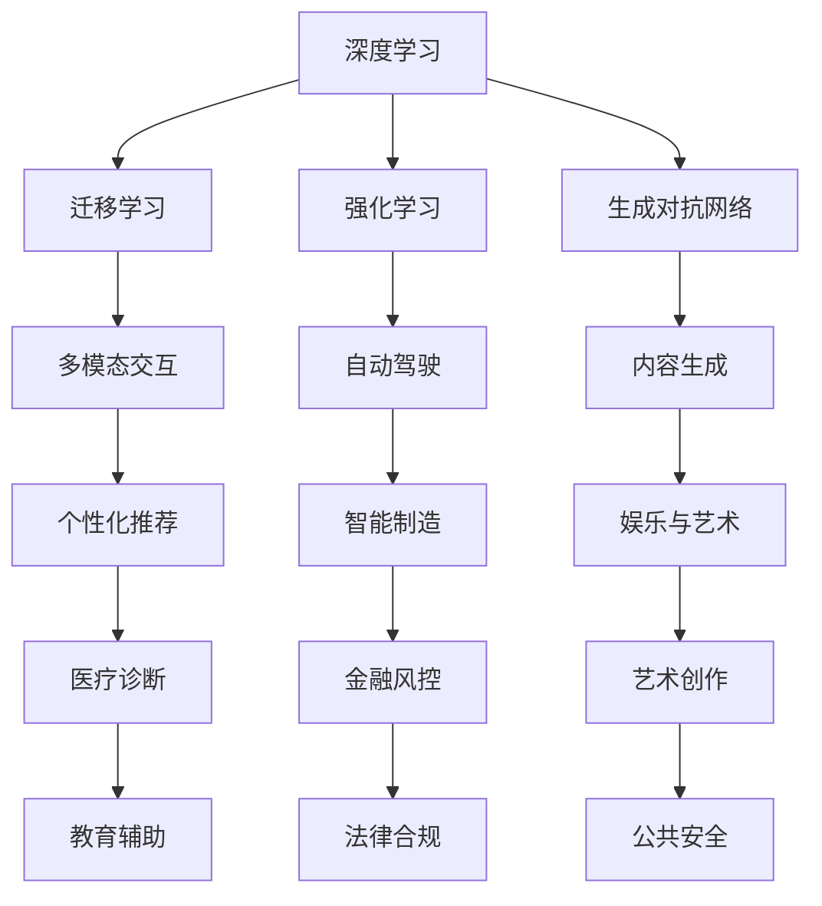

                 

## 1. 背景介绍

### 1.1 问题由来
随着人工智能（AI）技术的迅猛发展，我们正处于一个全新的AI 2.0时代。AI 2.0，即人工智能的下一代，旨在构建更加智能、自主、具备人类智慧的系统，不仅在技术上有了突破，更在应用上展现了前所未有的价值。

AI 2.0 的到来，让人们对AI的认识从单纯的计算和决策，转向了对人的理解、共情和创造性思维。AI 2.0 技术在医疗、教育、金融、艺术等诸多领域产生了深远影响，改变了人类社会的运行方式，并推动了科技价值的重塑。

### 1.2 问题核心关键点
本文将深入探讨AI 2.0 时代科技价值的核心概念与原理，分析AI 2.0 的实现机制和操作步骤，讨论其优缺点和应用领域，并对比AI 1.0 时代的差异与优势。同时，我们将结合具体案例和数学模型，详细讲解AI 2.0 的实际应用场景，以及未来在各个领域的前景和挑战。

## 2. 核心概念与联系

### 2.1 核心概念概述

在AI 2.0时代，几个核心概念显得尤为重要：

- **AI 2.0**：指下一代人工智能技术，区别于传统的AI 1.0，具有更加智能、自主和具备人类智慧的特点，不仅能处理结构化数据，还能理解和生成非结构化数据，并在多模态数据中实现无缝交互。

- **深度学习**：基于神经网络，特别是深度神经网络，通过大量数据训练出的模型，能够自动提取复杂数据特征，进行高效学习和推理。

- **迁移学习**：通过预训练模型，将一个领域学到的知识迁移到另一个领域，显著降低学习成本，提升模型效果。

- **强化学习**：通过与环境的交互，智能体通过试错不断调整策略，以最大化期望回报，应用广泛于游戏、机器人、自动化等领域。

- **生成对抗网络（GAN）**：通过两个神经网络（生成器和判别器）相互对抗，生成高质量的图像、视频、音频等生成式内容。

这些概念构成了AI 2.0 技术的基础，并通过相互作用，共同推动AI 2.0 时代科技价值的发展。

### 2.2 核心概念原理和架构的 Mermaid 流程图



这个图表展示了大语言模型与多个AI 2.0 核心技术的关系和应用场景，它们通过相互结合，不断拓展AI 2.0 技术的边界。

## 3. 核心算法原理 & 具体操作步骤
### 3.1 算法原理概述

AI 2.0 的核心算法原理包括深度学习、迁移学习、强化学习和生成对抗网络。这些技术通过各自的优势和特点，共同构建了AI 2.0 的强大能力。

### 3.2 算法步骤详解

AI 2.0 的实现过程主要包括以下几个关键步骤：

1. **数据收集与预处理**：从各种来源收集数据，并进行清洗、标注和预处理，以便于后续训练。

2. **模型构建与训练**：选择合适的模型结构，如卷积神经网络（CNN）、循环神经网络（RNN）或Transformer等，并利用深度学习算法进行训练，调整模型参数以最小化损失函数。

3. **迁移学习应用**：在特定领域的数据集上，对预训练模型进行微调，使得模型能够更好地适应具体任务。

4. **强化学习优化**：在模拟或真实环境中，通过强化学习算法不断调整模型策略，以最大化期望回报。

5. **生成对抗网络生成内容**：通过生成器和判别器的相互对抗，生成高质量的生成式内容，如图像、音频和视频等。

6. **模型部署与应用**：将训练好的模型部署到实际应用场景中，并进行调优和迭代，以提升性能和适应性。

### 3.3 算法优缺点

AI 2.0 技术的优点包括：

- **高泛化能力**：深度学习模型能够处理非结构化数据，具有较强的泛化能力。
- **高效的特征提取**：利用深度神经网络自动提取数据特征，减少特征工程的工作量。
- **适应性强**：通过迁移学习和强化学习，AI 2.0 模型能够快速适应新的任务和环境。
- **生成高质量内容**：生成对抗网络能够生成高质量的生成式内容，如自然语言、图像和音频等。

缺点包括：

- **计算资源要求高**：深度学习模型需要大量的计算资源进行训练和推理。
- **数据质量依赖性高**：模型的性能高度依赖于数据的质量和多样性。
- **黑盒性**：深度学习模型通常是黑盒模型，难以解释其内部工作机制。
- **鲁棒性不足**：AI 2.0 模型面对噪声和异常情况时，容易产生错误。

### 3.4 算法应用领域

AI 2.0 技术广泛应用于多个领域，包括：

- **医疗**：AI 2.0 技术在医疗影像分析、病理诊断、个性化治疗方案推荐等方面，具有广阔的应用前景。
- **教育**：通过智能辅导和个性化推荐，AI 2.0 能够提升学习效率和质量，适应不同学生的学习风格。
- **金融**：在风险评估、智能投顾、交易自动化等方面，AI 2.0 能够提高金融服务的精准度和效率。
- **艺术**：AI 2.0 在音乐、绘画、文学创作等领域，能够生成新颖、独特的艺术作品。
- **娱乐**：通过智能推荐和个性化内容生成，AI 2.0 能够提升用户体验和满意度。

## 4. 数学模型和公式 & 详细讲解 & 举例说明

### 4.1 数学模型构建

AI 2.0 技术主要依赖深度学习模型进行训练和推理。以卷积神经网络（CNN）为例，其数学模型构建过程如下：

1. **输入层**：将原始数据输入卷积层，提取特征。

2. **卷积层**：通过卷积操作提取特征图，并通过激活函数增加非线性。

3. **池化层**：通过池化操作降低特征图的维度，减少计算量。

4. **全连接层**：将池化层的输出输入全连接层，进行分类或回归等任务。

5. **输出层**：根据任务类型，选择合适的输出函数，如Softmax函数用于分类，线性函数用于回归。

### 4.2 公式推导过程

以一个简单的二分类问题为例，其数学模型推导如下：

$$
y = \sigma(w^T x + b)
$$

其中 $x$ 为输入样本，$w$ 和 $b$ 为模型的参数，$\sigma$ 为激活函数，$y$ 为输出。

对于多分类问题，可以采用Softmax函数：

$$
p(y_i|x) = \frac{\exp(z_i)}{\sum_{j=1}^k \exp(z_j)}
$$

其中 $z_i = w_i^T x + b_i$，$k$ 为类别数。

### 4.3 案例分析与讲解

以图像分类为例，CNN 的卷积层和池化层可以自动学习图像的局部特征，通过全连接层和激活函数完成分类。CNN 的参数共享和局部连接特性，使得其能够有效处理图像数据，具有较高的识别精度。

## 5. 项目实践：代码实例和详细解释说明

### 5.1 开发环境搭建

要在AI 2.0 项目中实践，我们需要一个高效的开发环境。以下是一个基本的开发环境搭建步骤：

1. **安装Python**：选择Python 3.6或更高版本，并确保路径添加至系统环境。

2. **安装必要的库**：使用pip安装TensorFlow、Keras、Pandas等库，并进行环境配置。

3. **使用Jupyter Notebook**：作为交互式开发环境，Jupyter Notebook能够实时展示代码执行结果，方便调试和验证。

### 5.2 源代码详细实现

以下是一个基于CNN的图像分类项目的实现示例：

```python
import tensorflow as tf
from tensorflow.keras import layers

# 定义模型结构
model = tf.keras.Sequential()
model.add(layers.Conv2D(32, (3, 3), activation='relu', input_shape=(28, 28, 1)))
model.add(layers.MaxPooling2D((2, 2)))
model.add(layers.Flatten())
model.add(layers.Dense(10, activation='softmax'))

# 编译模型
model.compile(optimizer='adam', loss='sparse_categorical_crossentropy', metrics=['accuracy'])

# 训练模型
model.fit(train_images, train_labels, epochs=10, validation_data=(test_images, test_labels))

# 评估模型
test_loss, test_acc = model.evaluate(test_images, test_labels)
print('Test accuracy:', test_acc)
```

### 5.3 代码解读与分析

- **输入层**：`layers.Conv2D`层定义了卷积层，输入图像大小为28x28，输出特征图大小为32，激活函数为ReLU。
- **卷积层**：通过卷积操作提取特征图，池化操作通过`layers.MaxPooling2D`层实现，降低特征图维度。
- **全连接层**：`layers.Flatten`层将特征图展平，并输入到全连接层`layers.Dense`中，输出10个类别的概率分布。
- **输出层**：通过`softmax`函数将输出转换为概率分布，用于多分类任务。

## 6. 实际应用场景

### 6.1 医疗影像分析

AI 2.0 在医疗影像分析中展现了巨大潜力。通过深度学习模型，AI 2.0 能够快速、准确地分析和诊断医学影像，如X光片、CT、MRI等，帮助医生提高诊断效率和准确性。

### 6.2 教育个性化推荐

AI 2.0 在教育领域可以用于个性化推荐，根据学生的学习行为和兴趣，推荐合适的学习资源和课程，提升学习效率和效果。

### 6.3 金融风险评估

AI 2.0 在金融领域可以用于风险评估和智能投顾，通过分析大量的交易数据，实时评估投资风险和收益，提供个性化的投资建议。

### 6.4 未来应用展望

AI 2.0 未来在各个领域的应用前景广阔，如自动驾驶、智能制造、智慧城市等。通过多模态数据融合和智能决策，AI 2.0 技术将进一步提升各行业的智能化水平。

## 7. 工具和资源推荐

### 7.1 学习资源推荐

1. **AI 2.0 课程**：如《深度学习》、《机器学习》等课程，通过系统的学习掌握AI 2.0 技术的理论基础和实践技能。
2. **AI 2.0 书籍**：如《Deep Learning》、《Hands-On Machine Learning with Scikit-Learn, Keras, and TensorFlow》等书籍，深入理解AI 2.0 的核心算法和技术。
3. **AI 2.0 论文**：通过阅读前沿论文，了解最新的AI 2.0 研究进展和技术突破。

### 7.2 开发工具推荐

1. **TensorFlow**：Google开源的深度学习框架，支持多种模型和算法，适合大规模工程应用。
2. **PyTorch**：Facebook开源的深度学习框架，灵活易用，适合研究型项目。
3. **Jupyter Notebook**：交互式开发环境，方便快速验证和调试代码。

### 7.3 相关论文推荐

1. **《Deep Residual Learning for Image Recognition》**：He等人提出的残差网络，大幅提升了深度学习模型的训练效率和性能。
2. **《Generative Adversarial Nets》**：Goodfellow等人提出的生成对抗网络，广泛应用于生成式内容和图像生成等任务。
3. **《On the Convergence of Gradient Descent Using Mini-Batch》**：Kingma等人提出的Adam优化算法，显著提升了深度学习模型的训练速度和效果。

## 8. 总结：未来发展趋势与挑战

### 8.1 研究成果总结

AI 2.0 技术的快速发展，为各个领域带来了巨大的变革和机遇。通过深度学习、迁移学习、强化学习、生成对抗网络等技术，AI 2.0 在医疗、教育、金融、娱乐等领域展现了广阔的应用前景。

### 8.2 未来发展趋势

1. **多模态数据融合**：未来的AI 2.0 技术将更加注重多模态数据的融合，如图像、语音、文本等多种数据类型的整合，提升模型的智能化水平。
2. **自监督学习**：通过自监督学习，AI 2.0 模型可以无需标注数据即可进行训练，进一步降低对标注数据的依赖。
3. **模型解释性增强**：通过可解释性模型和可视化工具，AI 2.0 技术将更具可解释性和可理解性。
4. **人机协同**：未来的AI 2.0 系统将更加注重人机协同，通过自然语言理解和生成技术，提升人机交互的流畅性和自然性。
5. **跨领域迁移**：AI 2.0 技术将更加注重跨领域的迁移能力，通过迁移学习，实现不同领域知识的共享和复用。

### 8.3 面临的挑战

1. **数据隐私和安全**：AI 2.0 模型需要大量的数据进行训练，如何在保障数据隐私和安全的前提下，获取高质量的训练数据，是一个重要挑战。
2. **伦理和道德**：AI 2.0 技术的应用需要考虑伦理和道德问题，如何避免偏见和歧视，确保技术应用的公平性和公正性，是重要的研究方向。
3. **资源消耗**：AI 2.0 模型的高计算需求和存储需求，使得在实际应用中面临资源消耗高的问题。
4. **模型鲁棒性**：如何在面对噪声和异常情况时，保持AI 2.0 模型的鲁棒性和稳定性，是一个重要的研究方向。
5. **技术普及和应用落地**：如何通过技术普及和应用落地的手段，使得AI 2.0 技术能够更好地服务于社会，是一个重要的课题。

### 8.4 研究展望

未来，AI 2.0 技术需要在数据隐私、伦理道德、资源消耗、模型鲁棒性、技术普及等方面不断突破，才能更好地推动人工智能技术的落地应用。

## 9. 附录：常见问题与解答

**Q1：AI 2.0 和AI 1.0 的区别是什么？**

A: AI 2.0 和AI 1.0 的主要区别在于智能化水平和应用场景。AI 1.0 主要是基于规则和知识库的专家系统，而AI 2.0 通过深度学习和生成对抗网络等技术，能够理解、生成和处理复杂的非结构化数据，具有更强的自主性和智能性。

**Q2：AI 2.0 模型如何避免过拟合？**

A: 避免过拟合的方法包括正则化、Dropout、早停等技术，以及数据增强和模型集成等方法。通过在训练过程中添加正则化项，可以减少模型复杂度，避免过拟合。Dropout技术可以在训练过程中随机丢弃一部分神经元，防止模型对某些特征过度依赖。早停技术可以在验证集上监控模型性能，避免过拟合。数据增强和模型集成也可以有效避免过拟合，提高模型的泛化能力。

**Q3：AI 2.0 在医疗领域有哪些应用？**

A: AI 2.0 在医疗领域的应用包括医学影像分析、病理诊断、个性化治疗方案推荐、智能导诊和病历管理等。通过深度学习和生成对抗网络等技术，AI 2.0 可以显著提升医疗诊断的精度和效率，帮助医生制定更加科学、个性化的治疗方案。

**Q4：AI 2.0 的计算资源需求高，如何降低资源消耗？**

A: 降低AI 2.0 模型的计算资源需求可以通过模型压缩、模型剪枝、分布式训练等方法实现。模型压缩可以减小模型参数量，提高模型推理速度。模型剪枝可以删除不重要或冗余的参数，进一步减少计算需求。分布式训练可以并行计算，加速模型训练过程。

---

作者：禅与计算机程序设计艺术 / Zen and the Art of Computer Programming

