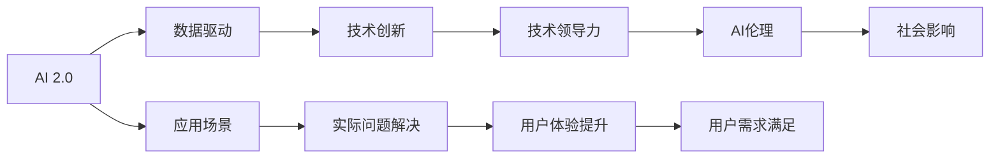

                 

# 李开复：AI 2.0 时代的行动者

> 关键词：AI 2.0, 人工智能, 李开复, 行动者, 技术领导力, 人工智能伦理

## 1. 背景介绍

### 1.1 问题由来
随着人工智能(AI)技术的迅猛发展，AI 2.0时代已经到来。这一时代的特点是AI技术的普及和应用范围的扩大，从科学研究、产业应用到社会治理，AI技术无处不在。然而，技术的快速发展也带来了新的挑战和问题。如何在AI 2.0时代，扮演好技术领袖的角色，推动AI技术的健康发展，成为摆在技术从业者面前的重要课题。

### 1.2 问题核心关键点
AI 2.0时代的行动者，不仅需要掌握先进的技术，还需要具备前瞻性的视野和深厚的行业知识。他们需要在推动技术进步的同时，关注伦理、社会影响和用户需求，确保AI技术的发展路径符合人类利益。李开复作为AI领域的杰出代表，他的行动和见解对AI 2.0时代的发展具有重要的指导意义。

### 1.3 问题研究意义
研究李开复在AI 2.0时代的行动和观点，对于理解AI技术的发展趋势、应对技术带来的挑战、推动AI技术的健康发展具有重要意义。本文将深入探讨李开复的AI思想和技术主张，分析其在AI 2.0时代扮演的角色和所面临的挑战，为读者提供全面而深刻的见解。

## 2. 核心概念与联系

### 2.1 核心概念概述

AI 2.0时代的核心概念包括：

- AI 2.0：指AI技术的成熟和普及，AI技术能够实现自动化的决策、推理和交互，解决复杂的实际问题。
- 技术领导力：指在AI领域中，技术领袖所具备的技术创新能力、前瞻性视野和行业影响力。
- AI伦理：指在AI技术发展过程中，需要关注的数据隐私、算法偏见、就业影响等伦理问题。
- 数据驱动：指在AI 2.0时代，数据成为AI技术发展的关键资源，数据的获取、处理和利用对AI技术的应用至关重要。

这些概念之间存在紧密联系：技术领导力是推动AI 2.0发展的核心驱动力，而AI伦理则是确保AI技术健康发展的重要保障。数据驱动则是实现技术创新的基础。通过理解这些核心概念及其联系，我们可以更好地把握AI 2.0时代的技术趋势和挑战。

### 2.2 核心概念原理和架构的 Mermaid 流程图



这个流程图展示了AI 2.0时代的关键要素及其相互作用：

1. AI 2.0技术通过数据驱动进行创新，产生技术领导力。
2. 技术领导力推动AI技术解决实际问题，提升用户体验。
3. AI伦理确保技术健康发展，避免负面社会影响。
4. 应用场景中的实际问题解决和用户体验提升，反馈到数据驱动环节，形成闭环。

## 3. 核心算法原理 & 具体操作步骤

### 3.1 算法原理概述

AI 2.0时代的核心算法原理主要包括以下几个方面：

- 深度学习：通过大规模神经网络进行模式识别和预测，是AI 2.0技术的基础。
- 自然语言处理(NLP)：利用AI技术处理和理解人类语言，实现机器翻译、语音识别、文本生成等应用。
- 计算机视觉：通过AI技术进行图像和视频数据的分析、识别和生成，应用于自动驾驶、医学影像分析等领域。
- 强化学习：通过AI技术实现智能体与环境的交互，应用于游戏、机器人控制等领域。

这些算法原理构成了AI 2.0时代的技术框架，推动了AI技术在各个领域的应用。

### 3.2 算法步骤详解

AI 2.0技术的应用过程大致包括以下几个步骤：

1. 数据收集：从各个领域和场景中获取数据，确保数据的多样性和代表性。
2. 数据预处理：对数据进行清洗、标注和归一化，提高数据质量。
3. 模型训练：利用深度学习、自然语言处理等算法，对数据进行训练，产生AI模型。
4. 模型优化：通过调整模型参数、增加正则化等方法，提高模型性能和泛化能力。
5. 模型部署：将训练好的模型部署到实际应用场景中，进行实时推理和决策。
6. 模型评估：对模型性能进行评估，根据评估结果进行迭代优化。

### 3.3 算法优缺点

AI 2.0技术的优点包括：

- 自动化和智能化：能够自动进行数据处理和决策，大幅提升工作效率。
- 泛化能力强：能够处理大规模、复杂的数据集，适应不同应用场景。
- 实时性和灵活性：可以实时响应变化，适应动态环境。

但AI 2.0技术也存在一些缺点：

- 高成本：需要大量数据和计算资源进行模型训练和优化。
- 数据隐私问题：大规模数据收集和处理可能引发隐私泄露和数据滥用问题。
- 算法偏见：AI模型可能会学习到数据中的偏见，导致决策不公。
- 技术风险：AI技术的不确定性和复杂性可能导致不可预测的风险。

### 3.4 算法应用领域

AI 2.0技术在各个领域都有广泛应用，包括但不限于：

- 自动驾驶：通过计算机视觉和深度学习技术，实现自动驾驶汽车。
- 智能医疗：利用自然语言处理和计算机视觉技术，提高医疗诊断和治疗效率。
- 金融科技：通过数据分析和机器学习，提供智能投顾和风险控制服务。
- 教育科技：通过自然语言处理和计算机视觉技术，提供个性化学习和智能辅导。
- 环境保护：通过数据分析和机器学习，监测和预测环境变化。

这些应用领域展示了AI 2.0技术的多样性和潜力，预示着AI技术在未来将发挥越来越重要的作用。

## 4. 数学模型和公式 & 详细讲解 & 举例说明

### 4.1 数学模型构建

AI 2.0技术的数学模型通常包括：

- 深度神经网络：通过多层非线性变换，实现复杂数据的建模和预测。
- 卷积神经网络(CNN)：利用卷积运算，提取图像中的特征。
- 循环神经网络(RNN)：通过时间序列的递归处理，处理时间相关的数据。
- 强化学习模型：通过奖励机制，实现智能体与环境的交互优化。

这些模型通过优化算法进行训练，提高模型的性能和泛化能力。

### 4.2 公式推导过程

以深度神经网络为例，其基本公式如下：

$$
\begin{aligned}
h_{l+1} &= g(\mathbf{W}_l \mathbf{h}_l + \mathbf{b}_l) \\
\mathbf{y} &= \mathbf{W}^{out} \mathbf{h}_L + \mathbf{b}^{out}
\end{aligned}
$$

其中，$h_l$ 表示第$l$层的隐藏状态，$g$ 表示激活函数，$\mathbf{W}_l$ 表示第$l$层的权重矩阵，$\mathbf{b}_l$ 表示第$l$层的偏置向量，$\mathbf{y}$ 表示输出结果。

### 4.3 案例分析与讲解

以计算机视觉中的目标检测为例，目标检测模型通过深度神经网络实现。其基本思路是先通过卷积层提取图像特征，然后利用ROI池化层提取感兴趣区域的特征，最后通过分类器和回归器预测目标的位置和类别。目标检测的公式如下：

$$
\begin{aligned}
\mathbf{F} &= \mathbf{F}_{conv} \\
\mathbf{R} &= \mathbf{R}_{ROI}(\mathbf{F}) \\
\mathbf{y} &= \mathbf{W}^{cls} \mathbf{r} + \mathbf{b}^{cls} \\
\mathbf{x} &= \mathbf{W}^{reg} \mathbf{r} + \mathbf{b}^{reg}
\end{aligned}
$$

其中，$\mathbf{F}$ 表示特征图，$\mathbf{R}$ 表示ROI特征图，$\mathbf{y}$ 表示分类结果，$\mathbf{x}$ 表示位置预测结果，$\mathbf{W}^{cls}$ 和 $\mathbf{W}^{reg}$ 表示分类器和回归器的权重矩阵，$\mathbf{b}^{cls}$ 和 $\mathbf{b}^{reg}$ 表示分类器和回归器的偏置向量。

## 5. 项目实践：代码实例和详细解释说明

### 5.1 开发环境搭建

开发AI 2.0技术需要以下工具和环境：

- Python：Python是AI 2.0技术开发的主流语言，拥有丰富的AI库和框架。
- PyTorch：PyTorch是Facebook开发的深度学习框架，支持动态图和GPU加速。
- TensorFlow：TensorFlow是Google开发的深度学习框架，支持静态图和分布式训练。
- Jupyter Notebook：Jupyter Notebook是Python开发的交互式开发环境，支持代码和数据可视化。

### 5.2 源代码详细实现

以下是一个简单的深度学习模型实现，以图像分类为例：

```python
import torch
import torch.nn as nn
import torch.optim as optim

# 定义模型结构
class Model(nn.Module):
    def __init__(self):
        super(Model, self).__init__()
        self.conv1 = nn.Conv2d(3, 6, 5)
        self.pool = nn.MaxPool2d(2, 2)
        self.conv2 = nn.Conv2d(6, 16, 5)
        self.fc1 = nn.Linear(16 * 5 * 5, 120)
        self.fc2 = nn.Linear(120, 84)
        self.fc3 = nn.Linear(84, 10)
    
    def forward(self, x):
        x = self.pool(F.relu(self.conv1(x)))
        x = self.pool(F.relu(self.conv2(x)))
        x = x.view(-1, 16 * 5 * 5)
        x = F.relu(self.fc1(x))
        x = F.relu(self.fc2(x))
        x = self.fc3(x)
        return x

# 定义损失函数和优化器
model = Model()
criterion = nn.CrossEntropyLoss()
optimizer = optim.SGD(model.parameters(), lr=0.001, momentum=0.9)

# 训练模型
for epoch in range(10):
    running_loss = 0.0
    for i, data in enumerate(train_loader, 0):
        inputs, labels = data
        optimizer.zero_grad()
        outputs = model(inputs)
        loss = criterion(outputs, labels)
        loss.backward()
        optimizer.step()
        running_loss += loss.item()
    print('Epoch %d loss: %.3f' % (epoch + 1, running_loss / len(train_loader)))

# 测试模型
correct = 0
total = 0
with torch.no_grad():
    for data in test_loader:
        images, labels = data
        outputs = model(images)
        _, predicted = torch.max(outputs.data, 1)
        total += labels.size(0)
        correct += (predicted == labels).sum().item()
print('Accuracy: %.2f%%' % (100 * correct / total))
```

### 5.3 代码解读与分析

上述代码实现了一个简单的卷积神经网络，用于图像分类任务。其中，模型结构包括两个卷积层和三个全连接层，使用交叉熵损失函数进行训练，采用随机梯度下降优化器进行优化。

代码的关键部分在于模型前向传播和损失计算：

1. 模型前向传播：通过卷积层和全连接层，将输入数据转化为分类结果。
2. 损失计算：使用交叉熵损失函数计算预测结果与真实标签之间的差距。
3. 反向传播：根据损失函数计算梯度，更新模型参数。

### 5.4 运行结果展示

运行上述代码后，可以得到模型在训练和测试集上的分类准确率。通常情况下，卷积神经网络可以在CIFAR-10等数据集上达到90%以上的分类准确率。

## 6. 实际应用场景

### 6.1 智能医疗

AI 2.0技术在智能医疗中的应用包括：

- 医学影像分析：通过深度学习模型对医学影像进行分类和分析，辅助医生进行诊断。
- 个性化医疗：通过自然语言处理技术分析患者的病历和症状，提供个性化的治疗方案。
- 智能问诊：通过自然语言处理技术实现智能问诊，提供24小时在线咨询服务。

这些应用场景展示了AI 2.0技术在医疗领域的重要性和潜力。

### 6.2 金融科技

AI 2.0技术在金融科技中的应用包括：

- 风险控制：通过深度学习模型分析金融数据，预测市场风险。
- 智能投顾：通过自然语言处理技术分析用户需求，提供智能投资建议。
- 反欺诈检测：通过强化学习模型进行欺诈检测，保护用户资金安全。

这些应用场景展示了AI 2.0技术在金融领域的广泛应用。

### 6.3 教育科技

AI 2.0技术在教育科技中的应用包括：

- 个性化学习：通过自然语言处理技术分析学生的学习习惯和需求，提供个性化的学习方案。
- 智能辅导：通过自然语言处理技术实现智能辅导，提高教学效果。
- 考试评估：通过自然语言处理技术自动评估学生的作业和考试，减轻教师负担。

这些应用场景展示了AI 2.0技术在教育领域的潜力。

## 7. 工具和资源推荐

### 7.1 学习资源推荐

为了帮助开发者掌握AI 2.0技术，以下是一些推荐的学习资源：

1. 《深度学习》（Ian Goodfellow）：深度学习领域的经典教材，涵盖深度学习的基础知识和算法。
2. 《Python深度学习》（Francois Chollet）：介绍如何使用Keras框架进行深度学习开发。
3. 《TensorFlow实战》（Vaibhav Sandeep）：介绍如何使用TensorFlow进行深度学习开发和模型训练。
4. 《PyTorch深度学习实战》（Yaroslav Halchenko）：介绍如何使用PyTorch进行深度学习开发和模型训练。
5. 《强化学习：原理、算法和应用》（Richard S. Sutton, Andrew G. Barto）：介绍强化学习的原理和算法。

### 7.2 开发工具推荐

以下是一些推荐的工具，用于AI 2.0技术的开发和部署：

1. Jupyter Notebook：交互式开发环境，支持代码和数据可视化。
2. PyTorch：深度学习框架，支持动态图和GPU加速。
3. TensorFlow：深度学习框架，支持静态图和分布式训练。
4. Keras：深度学习框架，支持快速原型设计和模型训练。
5. Scikit-learn：机器学习库，支持数据预处理和模型评估。

### 7.3 相关论文推荐

以下是一些推荐的相关论文，深入研究AI 2.0技术的原理和应用：

1. "ImageNet Classification with Deep Convolutional Neural Networks"（Alex Krizhevsky, Ilya Sutskever, and Geoffrey Hinton）：介绍深度卷积神经网络在图像分类任务上的应用。
2. "Speech and Language Processing"（Daniel Jurafsky and James H. Martin）：介绍自然语言处理技术的原理和应用。
3. "Playing Atari with Deep Reinforcement Learning"（Volodymyr Mnih et al.）：介绍强化学习在视频游戏中的应用。
4. "AI and the Dawn of Autonomous Vehicles"（Christopher Mole）：介绍AI在自动驾驶领域的应用和挑战。

## 8. 总结：未来发展趋势与挑战

### 8.1 研究成果总结

AI 2.0技术的快速发展带来了诸多新的应用场景和挑战。李开复在AI领域的行动和见解，为技术从业者提供了重要的参考。

### 8.2 未来发展趋势

未来，AI 2.0技术的发展趋势包括：

1. 自动化和智能化：AI技术将进一步实现自动化和智能化，提升生产效率和决策准确性。
2. 多模态融合：AI技术将进一步融合多种数据源和模态，实现更全面的信息理解和分析。
3. 边缘计算：AI技术将更多地在边缘设备上部署和应用，实现低延迟和高效率的计算。
4. 人机协作：AI技术将更多地与人类协作，实现人机混合智能系统。

### 8.3 面临的挑战

AI 2.0技术的发展也面临诸多挑战：

1. 数据隐私问题：大规模数据收集和处理可能引发隐私泄露和数据滥用问题。
2. 算法偏见问题：AI模型可能会学习到数据中的偏见，导致决策不公。
3. 技术风险问题：AI技术的不确定性和复杂性可能导致不可预测的风险。
4. 伦理问题：AI技术的广泛应用需要关注伦理和道德问题，确保技术健康发展。

### 8.4 研究展望

未来的AI研究需要从以下几个方向进行突破：

1. 数据隐私保护：开发新的隐私保护技术，确保数据安全和隐私。
2. 算法偏见消除：研究新的算法设计，消除数据中的偏见和歧视。
3. 技术风险控制：研究AI技术的可解释性和可控性，确保技术可靠性和安全性。
4. 伦理和道德研究：建立AI技术的伦理和道德规范，确保技术符合人类价值观。

总之，AI 2.0技术在未来的发展中将面临诸多挑战和机遇。通过技术创新和伦理研究，我们可以更好地应对这些挑战，推动AI技术的健康发展，为人类社会带来更多福祉。

## 9. 附录：常见问题与解答

**Q1: AI 2.0技术是否存在数据隐私问题？**

A: 是的，大规模数据收集和处理可能引发隐私泄露和数据滥用问题。因此，在AI 2.0技术的应用中，数据隐私保护是一个重要的问题。开发者需要采取数据脱敏、加密等措施，确保数据安全和隐私。

**Q2: AI 2.0技术是否存在算法偏见问题？**

A: 是的，AI模型可能会学习到数据中的偏见，导致决策不公。因此，在AI 2.0技术的应用中，算法偏见问题需要得到重视。开发者需要采用多样化的数据集，消除数据中的偏见，确保模型公平性。

**Q3: AI 2.0技术是否存在技术风险问题？**

A: 是的，AI技术的不确定性和复杂性可能导致不可预测的风险。因此，在AI 2.0技术的应用中，技术风险控制是一个重要的问题。开发者需要建立模型可解释性、可控性等技术规范，确保技术可靠性和安全性。

**Q4: AI 2.0技术是否存在伦理和道德问题？**

A: 是的，AI技术的广泛应用需要关注伦理和道德问题。在AI 2.0技术的应用中，开发者需要建立伦理和道德规范，确保技术符合人类价值观和伦理标准。开发者需要关注AI技术对社会、经济、环境等方面的影响，确保技术健康发展。

---

作者：禅与计算机程序设计艺术 / Zen and the Art of Computer Programming

