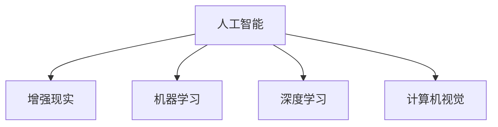

                 

# 李开复：苹果发布AI应用的商业价值

## 1. 背景介绍

近年来，人工智能(AI)技术的快速发展在全球范围内引起了广泛的关注和讨论。苹果公司作为全球领先的科技巨头，一直致力于将AI技术应用到各类产品和服务中，以提升用户体验，创造新的商业价值。本文将深入探讨苹果公司在AI应用领域的最新进展，分析其背后的商业价值，以及未来的发展趋势。

### 1.1 问题由来
随着科技的不断进步，AI技术已经广泛应用于医疗、金融、交通、零售等多个领域。苹果作为一家以创新著称的公司，自然不会错过这一技术浪潮。其通过将AI技术融入产品和服务中，成功吸引了大量用户，同时也显著提高了公司的市场竞争力。

然而，苹果在AI领域的应用不仅仅是技术层面的突破，更重要的是如何在商业上将AI技术转化为实际的利润。本文将通过分析苹果的最新AI应用案例，探讨其在商业上的价值。

### 1.2 问题核心关键点
苹果在AI应用领域的核心关键点包括：
- 如何通过AI技术提升产品性能和服务质量
- AI应用如何创造新的商业模式和业务增长点
- AI在苹果生态系统中的战略地位和作用
- 苹果在AI应用中的优势和挑战

本文将从这些关键点入手，全面分析苹果公司AI应用的商业价值。

## 2. 核心概念与联系

### 2.1 核心概念概述

要全面理解苹果的AI应用，首先需要了解以下几个核心概念：

- **人工智能(AI)**：指利用计算机模拟人类智能行为的技术，包括机器学习、深度学习、自然语言处理、计算机视觉等。
- **增强现实(AR)**：通过计算机生成信息增强用户对现实世界的感知，常见的应用包括苹果的ARKit。
- **机器学习(ML)**：指让计算机通过学习数据，自动改进算法以做出更好决策的过程。
- **深度学习(DL)**：指利用多层神经网络进行特征提取和模式识别。
- **计算机视觉(CV)**：指使计算机能够理解图像和视频中的视觉信息。

这些概念之间的联系可以通过以下Mermaid流程图来展示：



这个流程图展示了AI技术在各个方面的应用，其中增强现实、机器学习和深度学习是苹果公司特别重视的领域。

## 3. 核心算法原理 & 具体操作步骤

### 3.1 算法原理概述

苹果在AI应用中的算法原理主要基于深度学习，特别是卷积神经网络(CNN)和循环神经网络(RNN)。这些网络能够处理复杂的非线性关系，并通过大量数据进行自我优化。

在具体应用中，苹果通常采用迁移学习的方式，将在大规模数据上预训练的模型迁移到特定的应用场景中，通过微调或调整网络结构来适应新的任务。

### 3.2 算法步骤详解

苹果的AI应用开发一般包括以下几个步骤：

1. **数据准备**：收集和预处理大量数据，包括图像、视频、音频等。
2. **模型选择**：根据具体应用场景选择合适的深度学习模型。
3. **模型训练**：在大规模数据上对模型进行预训练，学习到通用的特征表示。
4. **迁移学习**：将预训练模型迁移到特定的应用场景中，进行微调或参数调整。
5. **模型部署**：将训练好的模型部署到苹果产品或服务中，进行实时推理和预测。

### 3.3 算法优缺点

苹果在AI应用中的算法具有以下优点：

- **高精度**：深度学习模型在处理复杂任务时具有很高的精度。
- **自适应性强**：通过迁移学习，模型能够快速适应新的任务和数据。
- **可扩展性好**：模型可以通过添加更多层或节点进行扩展，适应更复杂的任务。

同时，这些算法也存在一些缺点：

- **高计算成本**：深度学习模型的训练和推理需要大量的计算资源。
- **数据依赖**：模型的性能很大程度上依赖于训练数据的质量和数量。
- **过拟合风险**：模型在特定数据上可能出现过拟合现象。

### 3.4 算法应用领域

苹果的AI应用主要包括以下几个领域：

- **增强现实(AR)**：如Siri、ARKit等，通过计算机视觉和自然语言处理技术，提升用户体验。
- **健康医疗**：如健康应用、医疗影像分析等，通过机器学习提高疾病诊断和预防的准确性。
- **智能家居**：如HomeKit、家庭自动化系统等，通过智能设备和AI技术，提升生活便利性。
- **自动驾驶**：如Apple Car项目，通过计算机视觉和深度学习技术，提升驾驶安全性。
- **金融服务**：如Apple Pay、财务分析等，通过机器学习进行欺诈检测和信用评估。

## 4. 数学模型和公式 & 详细讲解

### 4.1 数学模型构建

苹果的AI应用主要基于深度学习模型，其中卷积神经网络(CNN)和循环神经网络(RNN)是核心。以卷积神经网络为例，其基本结构如下：


其中，卷积层用于提取特征，池化层用于降低特征维度，全连接层用于分类或回归任务。

### 4.2 公式推导过程

以卷积神经网络为例，其前向传播的过程如下：

$$
\text{conv}(\text{input}, \text{kernel}) = \text{bias} + \sum_{i,j} \text{input}_{i,j} * \text{kernel}_{i,j}
$$

其中，$\text{input}$ 为输入数据，$\text{kernel}$ 为卷积核，$\text{bias}$ 为偏置项。

### 4.3 案例分析与讲解

以Siri语音识别为例，其采用了深度学习模型进行语音转文本。模型的输入是音频信号，经过多层卷积和池化操作，输出文本序列。这一过程通过反向传播算法进行优化，最小化模型输出与真实标签之间的差异。

## 5. 项目实践：代码实例和详细解释说明

### 5.1 开发环境搭建

要搭建苹果AI应用的开发环境，需要以下步骤：

1. 安装Xcode和MacOS。
2. 安装所需的开发库，如Caffe2、TensorFlow等。
3. 配置iCloud和Apple Developer账户。

### 5.2 源代码详细实现

以下是一个简单的卷积神经网络实现示例：

```python
import tensorflow as tf

# 定义卷积层
def conv2d(inputs, filters, kernel_size, strides, padding='SAME', activation=tf.nn.relu):
    conv = tf.layers.conv2d(inputs, filters, kernel_size, strides, padding, activation)
    return conv

# 定义模型
def model(input_shape, num_classes):
    inputs = tf.keras.Input(shape=input_shape)
    conv1 = conv2d(inputs, 32, 3, 1, activation=tf.nn.relu)
    pool1 = tf.layers.max_pooling2d(conv1, pool_size=2, strides=2)

    conv2 = conv2d(pool1, 64, 3, 1, activation=tf.nn.relu)
    pool2 = tf.layers.max_pooling2d(conv2, pool_size=2, strides=2)

    flatten = tf.layers.flatten(pool2)
    dense = tf.layers.dense(flatten, num_classes)

    model = tf.keras.Model(inputs=inputs, outputs=dense)
    return model
```

### 5.3 代码解读与分析

以上代码定义了一个简单的卷积神经网络模型，包含两个卷积层、两个池化层和一个全连接层。其中，`conv2d`函数定义了卷积层，`model`函数则定义了整个模型结构。

## 6. 实际应用场景

### 6.1 智能家居

苹果的智能家居产品如HomeKit、家庭自动化系统等，广泛应用了AI技术。例如，通过计算机视觉技术，智能音箱可以识别用户的面部表情，自动调节音量和播放音乐。通过自然语言处理技术，智能音箱可以通过语音指令控制家中的其他设备，如灯光、电视等。

### 6.2 健康医疗

苹果的Health应用集成了大量的健康数据，通过机器学习技术进行分析和预测。例如，通过对用户的运动数据和健康数据进行学习，可以预测用户的健康状况，提供个性化的健康建议。

### 6.3 自动驾驶

苹果的自动驾驶项目采用了计算机视觉和深度学习技术，通过摄像头和雷达传感器获取环境信息，进行实时分析和决策。未来，苹果有望推出全自动驾驶的电动汽车。

### 6.4 未来应用展望

未来，苹果的AI应用将更加广泛和深入，涵盖更多领域和应用场景。例如，在医疗领域，通过AI技术进行个性化医疗和远程诊疗，提升医疗服务质量。在金融领域，通过AI技术进行风险评估和欺诈检测，提升金融安全性。

## 7. 工具和资源推荐

### 7.1 学习资源推荐

- **《深度学习》**：由斯坦福大学的Ian Goodfellow等作者所著，是深度学习的经典教材。
- **Coursera深度学习课程**：由斯坦福大学Andrew Ng教授主讲，适合初学者入门。
- **Kaggle竞赛**：通过参与Kaggle竞赛，可以学习最新的深度学习技术和模型。

### 7.2 开发工具推荐

- **TensorFlow**：由Google开发的深度学习框架，支持多种设备和平台。
- **PyTorch**：由Facebook开发的深度学习框架，以动态图为特点，适合研究和实验。
- **Keras**：一个高层次的深度学习框架，易于使用和快速原型设计。

### 7.3 相关论文推荐

- **《Deep Learning》**：Ian Goodfellow等著，深度学习的经典教材。
- **《Convolutional Neural Networks for Visual Recognition》**：Alex Krizhevsky等著，卷积神经网络的经典论文。

## 8. 总结：未来发展趋势与挑战

### 8.1 研究成果总结

苹果在AI应用领域的成功经验，主要源于以下几个方面：

- 高度集成的硬件和软件生态系统，为AI应用提供了良好的环境。
- 强大的数据收集和处理能力，支持大规模AI模型的训练和优化。
- 丰富的应用场景和用户需求，为AI应用提供了广阔的市场空间。

### 8.2 未来发展趋势

未来，苹果的AI应用将继续深化和扩展，主要趋势包括：

- **跨平台集成**：将AI技术无缝集成到更多的苹果设备和平台上。
- **垂直整合**：通过垂直整合上下游产业链，提升AI技术的商业价值。
- **数据驱动**：利用大规模数据进行AI模型的训练和优化，提升性能和效果。

### 8.3 面临的挑战

苹果在AI应用领域也面临一些挑战：

- **数据隐私和安全**：如何保护用户的隐私和数据安全，是一个重要问题。
- **算法透明度**：如何提高AI算法的透明度，让用户信任和理解。
- **计算成本**：大规模AI模型的训练和推理需要大量的计算资源，如何降低成本。

### 8.4 研究展望

未来，苹果需要在以下几个方面进行深入研究：

- **隐私保护技术**：开发更有效的隐私保护技术，保护用户数据安全。
- **算法透明性**：提高AI算法的透明性，让用户更信任和理解。
- **计算效率**：优化AI模型的计算效率，降低计算成本。

## 9. 附录：常见问题与解答

**Q1：苹果的AI应用主要基于哪些技术？**

A: 苹果的AI应用主要基于深度学习技术，特别是卷积神经网络(CNN)和循环神经网络(RNN)。这些网络能够处理复杂的非线性关系，并通过大量数据进行自我优化。

**Q2：苹果的AI应用有哪些实际应用场景？**

A: 苹果的AI应用主要包括以下几个领域：
- **增强现实(AR)**：如Siri、ARKit等，通过计算机视觉和自然语言处理技术，提升用户体验。
- **健康医疗**：如健康应用、医疗影像分析等，通过机器学习提高疾病诊断和预防的准确性。
- **智能家居**：如HomeKit、家庭自动化系统等，通过智能设备和AI技术，提升生活便利性。
- **自动驾驶**：如Apple Car项目，通过计算机视觉和深度学习技术，提升驾驶安全性。
- **金融服务**：如Apple Pay、财务分析等，通过机器学习进行欺诈检测和信用评估。

**Q3：苹果的AI应用有哪些商业价值？**

A: 苹果的AI应用主要带来了以下几个商业价值：
- **提升用户体验**：通过AI技术提升产品的功能和性能，增强用户的满意度和粘性。
- **创造新的业务增长点**：如智能家居、健康医疗等新兴业务，为苹果带来了新的收入来源。
- **强化市场竞争力**：通过技术创新和应用创新，苹果在市场上获得了新的竞争优势。

**Q4：苹果的AI应用面临哪些挑战？**

A: 苹果的AI应用面临以下挑战：
- **数据隐私和安全**：如何保护用户的隐私和数据安全，是一个重要问题。
- **算法透明度**：如何提高AI算法的透明性，让用户信任和理解。
- **计算成本**：大规模AI模型的训练和推理需要大量的计算资源，如何降低成本。

作者：禅与计算机程序设计艺术 / Zen and the Art of Computer Programming

