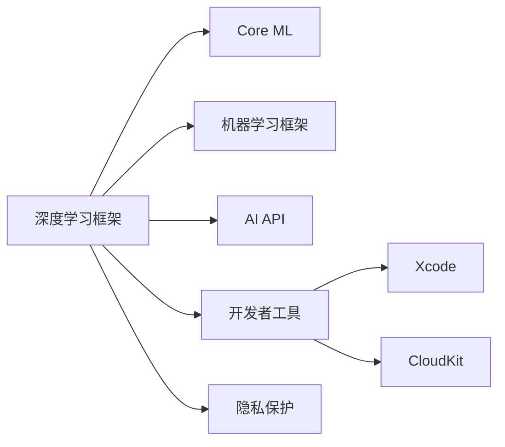

                 

## 1. 背景介绍

人工智能（AI）技术的迅速发展正在改变全球各行各业。苹果公司（Apple）作为全球领先的技术公司，一直致力于将AI技术融入其产品和服务中。随着苹果在AI领域的不断探索和创新，越来越多的开发者被吸引参与到苹果AI应用的开发中来。本文将探讨苹果在AI应用开发方面的策略，并分析开发者在这一领域中的角色和挑战。

## 2. 核心概念与联系

### 2.1 核心概念概述

苹果的AI应用开发主要围绕以下几个核心概念展开：

- **深度学习框架**：苹果采用其自主研发的深度学习框架Core ML，支持多种AI模型和应用场景。
- **机器学习框架**：苹果提供的机器学习框架包括Core ML Toolkit、Create ML和TensorFlow for iOS等，帮助开发者快速构建AI模型。
- **AI API**：苹果提供了一系列的AI API，如Core Image、FaceID、Anchors等，为开发者提供高性能的AI功能。
- **开发者工具**：苹果提供了Xcode、CloudKit、iCloud等开发者工具，简化AI应用开发流程。
- **隐私保护**：苹果强调用户隐私保护，要求所有AI应用遵守严格的隐私政策。

### 2.2 核心概念原理和架构的 Mermaid 流程图



此流程图展示了苹果AI应用开发的各个关键环节及其相互关系：

1. **深度学习框架**：作为AI开发的基础，深度学习框架提供高效的模型训练和推理支持。
2. **机器学习框架**：进一步封装和优化深度学习框架，提供更便捷的模型开发工具。
3. **AI API**：为开发者提供高性能的AI功能，如人脸识别、图像处理等。
4. **开发者工具**：如Xcode和CloudKit等，简化AI应用的开发和部署过程。
5. **隐私保护**：苹果强调用户隐私保护，所有AI应用都必须遵守严格的隐私政策。

## 3. 核心算法原理 & 具体操作步骤

### 3.1 算法原理概述

苹果AI应用的开发主要基于深度学习和机器学习算法。以下是几个关键算法原理的概述：

- **卷积神经网络（CNN）**：用于图像识别和处理，能够有效捕捉图像中的特征。
- **循环神经网络（RNN）**：适用于序列数据的处理，如自然语言处理和语音识别。
- **生成对抗网络（GAN）**：用于生成高质量的图像和音频数据。
- **强化学习**：通过模拟用户行为，优化AI应用的用户体验。

### 3.2 算法步骤详解

苹果AI应用的开发通常包括以下几个关键步骤：

1. **数据准备**：收集和标注训练数据，准备用于模型训练的数据集。
2. **模型选择和训练**：选择合适的模型架构，如CNN或RNN，使用苹果提供的机器学习框架进行模型训练。
3. **模型优化和调参**：使用苹果提供的优化算法，如Adam和SGD，调整模型参数以提高性能。
4. **模型部署和测试**：将训练好的模型部署到实际应用中，并在不同场景下进行测试和优化。
5. **隐私保护**：确保AI应用遵守苹果的隐私政策，如数据加密、用户数据最小化等。

### 3.3 算法优缺点

苹果AI应用开发的主要优点包括：

- **高性能**：苹果的深度学习框架和AI API提供了高效的模型训练和推理功能。
- **便捷性**：苹果提供了易用的开发工具和API，降低了AI应用开发的门槛。
- **隐私保护**：苹果对用户隐私保护严格要求，确保所有AI应用遵守隐私政策。

缺点则包括：

- **资源限制**：苹果的AI应用开发需要较高的计算资源和硬件配置。
- **模型限制**：苹果提供的AI模型和框架可能无法满足所有需求，需要开发者自行调整和优化。
- **隐私保护要求严格**：严格的隐私保护要求可能会增加开发难度。

### 3.4 算法应用领域

苹果的AI应用开发涵盖了多个领域，包括但不限于：

- **图像识别**：如FaceID、Siri等，使用CNN和RNN模型进行图像和语音处理。
- **自然语言处理**：如Siri的语音识别和自然语言理解，使用RNN和Transformer模型。
- **增强现实（AR）**：如ARKit，使用深度学习技术进行三维场景重建和交互。
- **机器视觉**：如相机增强、图像编辑等，使用卷积神经网络进行图像处理和分析。

## 4. 数学模型和公式 & 详细讲解 & 举例说明

### 4.1 数学模型构建

苹果AI应用的开发通常基于以下数学模型构建：

- **图像分类模型**：使用CNN模型，将输入图像映射为不同类别的概率分布。
- **序列模型**：使用RNN或Transformer模型，将输入序列映射为固定长度的向量。
- **生成模型**：使用GAN模型，生成高质量的图像和音频数据。

### 4.2 公式推导过程

以图像分类模型为例，其数学推导过程如下：

假设输入图像为 $x$，模型输出为 $y$，模型的损失函数为 $L$，则推导过程如下：

1. **前向传播**：将输入图像 $x$ 通过卷积层、池化层和全连接层，得到模型输出 $y$。
2. **计算损失**：将模型输出 $y$ 和真实标签 $y_{true}$ 进行对比，计算损失函数 $L$。
3. **反向传播**：根据损失函数 $L$ 的梯度，更新模型参数。

### 4.3 案例分析与讲解

以人脸识别应用为例，其具体实现步骤如下：

1. **数据准备**：收集人脸图像数据，并进行标注，准备用于模型训练。
2. **模型选择和训练**：使用苹果提供的Core ML框架，选择合适的人脸识别模型，并进行训练。
3. **模型部署和测试**：将训练好的模型部署到实际应用中，并在不同的测试场景下进行测试和优化。
4. **隐私保护**：确保人脸识别应用遵守苹果的隐私政策，如数据加密、用户数据最小化等。

## 5. 项目实践：代码实例和详细解释说明

### 5.1 开发环境搭建

苹果AI应用开发的开发环境通常包括：

1. **macOS**：苹果官方操作系统，提供了高性能的硬件和开发工具。
2. **Xcode**：苹果提供的IDE，支持多平台应用开发。
3. **Core ML Toolkit**：苹果提供的机器学习框架，支持深度学习和图像处理。
4. **TensorFlow for iOS**：苹果提供的TensorFlow框架的iOS版本，支持高效的模型训练和推理。

### 5.2 源代码详细实现

以下是一个简单的图像分类应用示例：

```python
import coremltools as ct

# 加载模型
model = ct.load_model('path/to/model.mlmodel')

# 预处理图像数据
image = ct.vision.coreml_image_processing.load_image('path/to/image.jpg')
input_data = ct.utils.common.data_from_image(image, input_name='image')

# 进行图像分类
output = model.predict(input_data)
```

### 5.3 代码解读与分析

以上代码展示了如何使用Core ML框架进行图像分类应用开发。其中，`load_model`方法用于加载预训练模型，`load_image`方法用于加载输入图像，`predict`方法用于进行图像分类预测。

## 6. 实际应用场景

苹果AI应用开发在多个领域得到了广泛应用，以下是几个典型场景：

### 6.1 图像识别

苹果的FaceID功能使用了深度学习技术进行人脸识别，可以用于解锁手机、支付等场景。

### 6.2 自然语言处理

苹果的Siri功能使用了自然语言处理技术，可以进行语音识别、语音合成、自然语言理解等操作。

### 6.3 增强现实

苹果的ARKit框架提供了增强现实功能，可以在iOS设备上实现高质量的AR应用。

### 6.4 未来应用展望

未来，苹果在AI应用开发方面的展望包括：

- **跨平台应用**：开发跨iOS和macOS的AI应用，提高应用灵活性和用户体验。
- **深度学习模型的优化**：改进深度学习模型的结构和算法，提高模型性能和效率。
- **隐私保护**：进一步加强用户数据保护，确保AI应用遵守隐私政策。
- **跨领域应用**：将AI技术应用于更多领域，如医疗、金融、教育等，推动技术创新和产业发展。

## 7. 工具和资源推荐

### 7.1 学习资源推荐

1. **《深度学习框架：苹果的核心ML》**：详细介绍苹果的深度学习框架Core ML的使用方法和实践技巧。
2. **《机器学习框架：苹果的Create ML和TensorFlow for iOS》**：介绍苹果的机器学习框架的使用方法和实践技巧。
3. **《AI API：苹果的核心Image和FaceID》**：介绍苹果的AI API的使用方法和实践技巧。

### 7.2 开发工具推荐

1. **Xcode**：苹果提供的IDE，支持多平台应用开发。
2. **CloudKit**：苹果提供的云服务，用于存储和管理用户数据。
3. **iCloud**：苹果提供的云服务，用于同步用户数据和应用状态。

### 7.3 相关论文推荐

1. **《苹果的深度学习框架Core ML》**：详细介绍苹果的深度学习框架Core ML的设计和实现。
2. **《苹果的机器学习框架Create ML和TensorFlow for iOS》**：详细介绍苹果的机器学习框架Create ML和TensorFlow for iOS的使用方法和实践技巧。
3. **《苹果的AI API核心Image和FaceID》**：详细介绍苹果的AI API的使用方法和实践技巧。

## 8. 总结：未来发展趋势与挑战

### 8.1 研究成果总结

苹果在AI应用开发方面取得了显著成果，主要体现在以下几个方面：

1. **高性能**：苹果的深度学习框架和AI API提供了高效的模型训练和推理功能。
2. **便捷性**：苹果提供了易用的开发工具和API，降低了AI应用开发的门槛。
3. **隐私保护**：苹果对用户隐私保护严格要求，确保所有AI应用遵守隐私政策。

### 8.2 未来发展趋势

苹果AI应用开发未来的发展趋势包括：

1. **跨平台应用**：开发跨iOS和macOS的AI应用，提高应用灵活性和用户体验。
2. **深度学习模型的优化**：改进深度学习模型的结构和算法，提高模型性能和效率。
3. **隐私保护**：进一步加强用户数据保护，确保AI应用遵守隐私政策。
4. **跨领域应用**：将AI技术应用于更多领域，如医疗、金融、教育等，推动技术创新和产业发展。

### 8.3 面临的挑战

苹果AI应用开发面临的主要挑战包括：

1. **资源限制**：苹果的AI应用开发需要较高的计算资源和硬件配置。
2. **模型限制**：苹果提供的AI模型和框架可能无法满足所有需求，需要开发者自行调整和优化。
3. **隐私保护要求严格**：严格的隐私保护要求可能会增加开发难度。

### 8.4 研究展望

未来，苹果AI应用开发的研究展望包括：

1. **跨平台应用**：开发跨iOS和macOS的AI应用，提高应用灵活性和用户体验。
2. **深度学习模型的优化**：改进深度学习模型的结构和算法，提高模型性能和效率。
3. **隐私保护**：进一步加强用户数据保护，确保AI应用遵守隐私政策。
4. **跨领域应用**：将AI技术应用于更多领域，如医疗、金融、教育等，推动技术创新和产业发展。

## 9. 附录：常见问题与解答

**Q1：苹果的AI应用开发需要哪些硬件配置？**

A: 苹果的AI应用开发需要高性能的硬件配置，如CPU、GPU、TPU等。

**Q2：苹果的AI应用开发对开发者有哪些要求？**

A: 苹果的AI应用开发对开发者要求较高，需要掌握深度学习、机器学习、图像处理等技术。

**Q3：苹果的AI应用开发如何进行数据隐私保护？**

A: 苹果的AI应用开发强调数据隐私保护，要求所有AI应用遵守严格的隐私政策，如数据加密、用户数据最小化等。

**Q4：苹果的AI应用开发如何进行模型优化？**

A: 苹果的AI应用开发可以进行模型优化，如模型裁剪、量化加速等，以提高模型性能和效率。

**Q5：苹果的AI应用开发有哪些工具和资源？**

A: 苹果的AI应用开发提供了多种工具和资源，如Xcode、CloudKit、TensorFlow for iOS等。

---

作者：禅与计算机程序设计艺术 / Zen and the Art of Computer Programming

