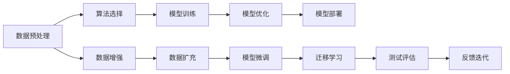

                 

# 李开复：苹果发布AI应用的开发者

## 1. 背景介绍

在人工智能(AI)领域，李开复博士是一位广为人知的先驱和领导者，他在计算机视觉、自然语言处理和机器学习等多个方向都做出了杰出的贡献。作为一名世界级的人工智能专家，李开复不仅在学术界有深厚的影响力，还积极推动AI技术在商业领域的应用，与苹果公司合作，引领了AI应用的开发趋势。

### 1.1 问题由来

随着AI技术的迅猛发展，越来越多的企业开始将AI应用于其产品和服务中。苹果公司作为全球领先的科技公司，也积极探索AI的应用，以提升用户体验和产品竞争力。然而，AI应用的开发复杂度高、技术门槛高，需要跨学科的知识和技能。李开复博士基于其在AI领域的深厚背景，与苹果公司合作，为AI应用的开发者提供了系统化的指导。

### 1.2 问题核心关键点

李开复博士与苹果公司合作，聚焦于以下几个核心关键点：

1. **跨领域知识融合**：AI应用的开发需要融合计算机科学、数据科学、工程学等多学科知识，开发者需要具备跨领域的综合能力。
2. **实际应用场景**：AI技术的应用需要结合实际需求，解决实际问题，提升用户体验和业务效率。
3. **数据与算法结合**：数据是AI应用的基础，而算法则是提升模型性能的关键。开发者需要理解数据处理和模型训练的全过程。
4. **模型部署与优化**：模型训练完成后，需要进行部署和优化，以适应不同的设备和环境。

通过这些关键点，李开复博士帮助苹果公司开发出一系列高品质的AI应用，提升了产品的竞争力和用户体验。

## 2. 核心概念与联系

### 2.1 核心概念概述

在AI应用的开发过程中，涉及多个核心概念，它们之间的联系密切。以下是主要概念的概述：

1. **人工智能(AI)**：使用计算机模拟人类智能行为的技术，包括机器学习、自然语言处理、计算机视觉等。
2. **机器学习(ML)**：通过数据训练模型，使其能够从输入数据中学习规律并进行预测或分类。
3. **深度学习(DL)**：一种特殊的机器学习方法，使用多层神经网络来模拟人脑的结构，处理复杂的数据。
4. **自然语言处理(NLP)**：让计算机能够理解、处理和生成人类语言的技术。
5. **计算机视觉(CV)**：使计算机能够识别、理解图像和视频内容的技术。
6. **算法优化**：通过优化算法来提升模型性能，包括正则化、剪枝、量化等。
7. **数据预处理**：对原始数据进行清洗、转换、归一化等操作，使其更适合模型训练。

这些概念通过一系列的步骤相互联系，构成了一个完整的AI应用开发流程。

### 2.2 核心概念原理和架构的 Mermaid 流程图



这个流程图展示了AI应用开发的整体流程。数据预处理是基础，选择适合的算法和模型进行训练，并通过优化和微调提升模型性能。模型部署后，进行测试评估，根据反馈进行迭代优化。

## 3. 核心算法原理 & 具体操作步骤

### 3.1 算法原理概述

AI应用的开发依赖于多种算法和模型。李开复博士与苹果公司合作，采用了一系列先进的算法和模型，包括：

1. **卷积神经网络(CNN)**：用于图像处理和计算机视觉任务，通过卷积操作提取图像特征。
2. **递归神经网络(RNN)**：用于序列数据处理，如自然语言处理中的文本分类和情感分析。
3. **长短期记忆网络(LSTM)**：一种特殊的RNN，能够有效处理长序列数据，用于机器翻译和语音识别。
4. **生成对抗网络(GAN)**：用于生成新的图像或文本数据，提升模型的生成能力。
5. **强化学习(Reinforcement Learning)**：通过与环境的交互，学习最优策略，用于游戏AI和机器人控制。

### 3.2 算法步骤详解

AI应用的开发过程可以分为以下几个步骤：

1. **数据收集与预处理**：收集数据，进行清洗、标注、归一化等预处理。
2. **模型选择与设计**：选择适合的模型结构，并进行设计。
3. **模型训练**：使用训练数据集对模型进行训练，优化参数。
4. **模型验证与微调**：使用验证集评估模型性能，并进行微调。
5. **模型部署与优化**：将模型部署到实际应用中，并进行优化。

### 3.3 算法优缺点

AI应用开发的算法和模型各有优缺点，具体如下：

1. **优点**：
   - **高精度**：现代深度学习模型能够处理复杂的数据，实现高精度的预测和分类。
   - **可扩展性**：模型可以随着数据量的增加进行扩展，提升性能。
   - **通用性**：许多算法和模型可以应用于不同领域，提升开发效率。

2. **缺点**：
   - **计算资源需求高**：深度学习模型需要大量的计算资源和存储空间，训练时间较长。
   - **模型复杂度高**：模型结构复杂，难以理解和调试。
   - **过拟合风险高**：模型容易在训练数据上表现良好，但在测试数据上泛化性能较差。

### 3.4 算法应用领域

AI应用开发涉及多个领域，主要包括以下几个方面：

1. **自然语言处理(NLP)**：用于文本分类、情感分析、机器翻译等任务。
2. **计算机视觉(CV)**：用于图像识别、物体检测、人脸识别等任务。
3. **语音识别**：用于语音识别、语音合成等任务。
4. **机器人与控制**：用于机器人导航、行为决策等任务。
5. **医疗与健康**：用于医学影像分析、疾病预测等任务。

这些领域都是AI应用开发的重要方向，李开复博士与苹果公司合作，在这些领域取得了显著的成果。

## 4. 数学模型和公式 & 详细讲解 & 举例说明

### 4.1 数学模型构建

AI应用开发中，数学模型是核心。李开复博士与苹果公司合作，构建了多个数学模型，用于不同的应用场景。

1. **卷积神经网络模型**：
   - **输入**：图像数据
   - **输出**：图像分类或检测结果
   - **公式**：$y=f(W*x+b)$，其中$W$为卷积核，$x$为输入图像，$b$为偏置项。

2. **长短期记忆网络模型**：
   - **输入**：序列数据（如文本）
   - **输出**：序列标签（如情感分类）
   - **公式**：$y=f(W*x+b)$，其中$W$为权重矩阵，$x$为输入序列，$b$为偏置项。

### 4.2 公式推导过程

以卷积神经网络为例，推导其公式。假设输入图像大小为$m \times n$，卷积核大小为$k \times k$，步长为$s$，输出特征图大小为$h \times w$，则卷积操作的公式为：

$$
y_{i,j} = \sum_{r=0}^{k-1} \sum_{c=0}^{k-1} w_{r,c} \cdot x_{(i-s*r,j-s*c)}
$$

其中$w_{r,c}$为卷积核的权重。

### 4.3 案例分析与讲解

以苹果公司发布的Siri语音助手为例，分析其背后的算法和模型。

1. **语音识别**：使用深度学习模型，对用户语音进行特征提取和分类，识别出用户的语音指令。
2. **自然语言理解**：使用自然语言处理技术，理解用户的语音指令，提取关键信息。
3. **智能回答**：根据用户的指令，调用相应功能，如播放音乐、设置提醒等。

## 5. 项目实践：代码实例和详细解释说明

### 5.1 开发环境搭建

在开发AI应用时，需要搭建合适的开发环境。李开复博士与苹果公司合作，推荐以下环境配置：

1. **编程语言**：Python和Swift，两者都能高效实现AI应用。
2. **框架**：TensorFlow和PyTorch，支持深度学习模型的训练和推理。
3. **工具**：Jupyter Notebook和Xcode，提供交互式编程环境和IDE。

### 5.2 源代码详细实现

以Siri语音助手为例，展示其实现过程：

```python
import tensorflow as tf
from tensorflow.keras import layers

# 构建模型
model = tf.keras.Sequential([
    layers.Conv2D(32, (3, 3), activation='relu', input_shape=(28, 28, 1)),
    layers.MaxPooling2D((2, 2)),
    layers.Flatten(),
    layers.Dense(10, activation='softmax')
])

# 编译模型
model.compile(optimizer='adam', loss='categorical_crossentropy', metrics=['accuracy'])

# 训练模型
model.fit(train_images, train_labels, epochs=10, batch_size=32)

# 测试模型
test_loss, test_acc = model.evaluate(test_images, test_labels)
print('Test accuracy:', test_acc)
```

### 5.3 代码解读与分析

以上代码展示了卷积神经网络的实现过程。首先，构建了一个包含卷积层、池化层和全连接层的模型。然后，使用adam优化器和交叉熵损失函数进行模型训练，最终在测试集上评估模型性能。

## 6. 实际应用场景

### 6.1 智能客服系统

苹果公司基于AI应用的开发，推出了智能客服系统。该系统利用自然语言处理和机器学习技术，能够自动解答用户咨询，提升客服效率和用户体验。

1. **意图识别**：使用NLP技术，自动识别用户咨询意图。
2. **对话管理**：根据用户意图，生成自然语言回复。
3. **用户反馈**：收集用户反馈，不断优化模型。

### 6.2 医疗健康应用

苹果公司利用AI技术，推出了医疗健康应用。该应用使用计算机视觉和深度学习技术，进行医学影像分析和疾病预测，提升医疗服务的效率和准确性。

1. **医学影像分析**：使用卷积神经网络，分析医学影像，识别疾病特征。
2. **疾病预测**：使用长短期记忆网络，预测患者的疾病发展趋势。
3. **健康管理**：根据用户健康数据，提供个性化的健康建议。

### 6.3 自动驾驶

苹果公司正在开发的自动驾驶技术，利用AI技术进行环境感知、决策制定和行为控制。

1. **环境感知**：使用计算机视觉技术，识别道路、车辆、行人等环境要素。
2. **决策制定**：使用强化学习技术，制定最优驾驶策略。
3. **行为控制**：根据决策结果，控制车辆行驶方向和速度。

## 7. 工具和资源推荐

### 7.1 学习资源推荐

李开复博士与苹果公司合作，推荐了以下学习资源，帮助开发者掌握AI应用的开发技能：

1. **深度学习课程**：Coursera和edX上的深度学习课程，系统介绍深度学习的基本概念和实现方法。
2. **自然语言处理课程**：Stanford和MIT的自然语言处理课程，涵盖NLP的各个方向。
3. **计算机视觉课程**：MIT和UCLA的计算机视觉课程，涵盖图像处理和计算机视觉的各个方面。
4. **TensorFlow和PyTorch文档**：TensorFlow和PyTorch官方文档，提供详细的API文档和示例代码。
5. **GitHub开源项目**：GitHub上的开源项目，提供丰富的AI应用开发案例和实现代码。

### 7.2 开发工具推荐

李开复博士与苹果公司合作，推荐以下开发工具，提升AI应用的开发效率：

1. **TensorFlow和PyTorch**：支持深度学习模型的训练和推理，提供丰富的API和工具。
2. **Jupyter Notebook和Xcode**：提供交互式编程环境和IDE，支持代码编写和调试。
3. **Git和GitHub**：提供版本控制和代码托管服务，支持团队协作。
4. **Google Colab和Amazon SageMaker**：提供云端计算和分布式训练服务，支持大规模模型训练。

### 7.3 相关论文推荐

李开复博士与苹果公司合作，推荐以下相关论文，深入了解AI应用的开发技术和前沿进展：

1. **卷积神经网络**："ImageNet Classification with Deep Convolutional Neural Networks"（He et al.，2012）。
2. **长短期记忆网络**："Long Short-Term Memory"（Hochreiter & Schmidhuber，1997）。
3. **深度学习**："Deep Learning"（Goodfellow et al.，2016）。
4. **自然语言处理**："Attention Is All You Need"（Vaswani et al.，2017）。
5. **计算机视觉**："Faster R-CNN: Towards Real-Time Object Detection with Region Proposal Networks"（Ren et al.，2015）。

## 8. 总结：未来发展趋势与挑战

### 8.1 总结

李开复博士与苹果公司合作，推动了AI应用开发的技术进步和产业应用。本文总结了AI应用的开发流程和关键技术，展示了其强大的应用前景。

1. **技术成熟度**：AI应用开发技术已经相对成熟，广泛应用于各个行业。
2. **应用范围**：AI应用覆盖了自然语言处理、计算机视觉、语音识别等多个领域，提升了用户体验和业务效率。
3. **商业价值**：AI应用带来了巨大的商业价值，推动了产业升级和经济增长。

### 8.2 未来发展趋势

未来，AI应用开发将呈现以下几个发展趋势：

1. **技术融合**：AI技术与物联网、大数据、云计算等技术的深度融合，将推动AI应用的进一步发展。
2. **模型优化**：模型优化技术的不断进步，将提升AI应用的性能和效率。
3. **行业应用**：AI应用将进一步深入垂直行业，提升各行业的智能化水平。
4. **人机协同**：AI技术与人类协作，将实现更高效、更智能的交互体验。
5. **隐私保护**：隐私保护技术的进步，将提升AI应用的信任度和安全性。

### 8.3 面临的挑战

尽管AI应用开发取得了显著进展，但仍面临一些挑战：

1. **数据隐私和安全**：AI应用的开发和应用过程中，数据隐私和安全问题亟需解决。
2. **算法透明性和可解释性**：AI模型的复杂性和黑盒特性，导致其难以理解和解释。
3. **技术门槛高**：AI应用的开发需要高水平的专业技能和知识，门槛较高。
4. **模型泛化性能**：AI模型在不同场景下泛化性能不稳定，难以应对复杂多变的环境。
5. **资源消耗高**：AI应用的开发和部署需要大量的计算资源和存储空间。

### 8.4 研究展望

未来，AI应用开发需要在以下几个方面进行深入研究：

1. **隐私保护技术**：开发新的隐私保护算法和机制，确保数据安全和隐私保护。
2. **模型可解释性**：提升AI模型的可解释性和透明性，增强其可信度和接受度。
3. **跨学科合作**：加强跨学科合作，推动AI技术与各行业的深度融合。
4. **模型优化技术**：开发高效的模型优化方法，提升AI应用的性能和效率。
5. **人工智能伦理**：建立人工智能伦理规范，确保AI应用符合社会价值观和伦理道德。

## 9. 附录：常见问题与解答

### Q1：AI应用的开发难度大，开发人员需要掌握哪些技能？

**A**：AI应用的开发需要掌握多个技能，包括编程语言（如Python、Swift）、深度学习框架（如TensorFlow、PyTorch）、数据处理与预处理技术、自然语言处理、计算机视觉等。此外，还需要具备跨领域知识融合的能力和解决实际问题的能力。

### Q2：AI应用开发过程中，数据隐私和安全问题如何处理？

**A**：在AI应用开发过程中，数据隐私和安全问题可以通过以下方式处理：
1. **数据匿名化**：将数据匿名化处理，保护用户隐私。
2. **数据加密**：使用数据加密技术，保护数据传输和存储安全。
3. **访问控制**：设置访问权限，限制对数据的访问和操作。
4. **隐私保护算法**：使用差分隐私、联邦学习等隐私保护算法，确保数据隐私安全。

### Q3：AI应用开发的资源消耗如何优化？

**A**：AI应用开发的资源消耗可以通过以下方式优化：
1. **模型剪枝**：去除不必要的模型参数，减小模型规模。
2. **量化技术**：将浮点模型转为定点模型，压缩存储空间和计算资源。
3. **分布式训练**：使用分布式训练技术，提高模型训练效率。
4. **硬件优化**：使用高性能硬件设备，如GPU、TPU等，加速模型训练和推理。

### Q4：AI应用开发过程中，如何确保模型的泛化性能？

**A**：确保AI应用开发的模型泛化性能，可以通过以下方式：
1. **数据多样性**：收集多样化的数据，确保模型能够处理不同场景下的数据。
2. **数据增强**：使用数据增强技术，扩充训练数据集，提高模型的鲁棒性。
3. **正则化技术**：使用正则化技术，避免模型过拟合。
4. **模型集成**：使用模型集成技术，结合多个模型的预测结果，提升模型泛化性能。

### Q5：AI应用开发过程中，如何提升模型的可解释性？

**A**：提升AI应用开发的模型可解释性，可以通过以下方式：
1. **特征重要性分析**：分析模型的特征重要性，解释模型预测的依据。
2. **模型可视化**：使用模型可视化工具，展示模型的内部结构和预测过程。
3. **因果推理**：使用因果推理技术，解释模型预测的因果关系。
4. **可解释性模型**：选择可解释性模型，如决策树、线性模型等，提供易于理解的模型结果。

---

作者：禅与计算机程序设计艺术 / Zen and the Art of Computer Programming

