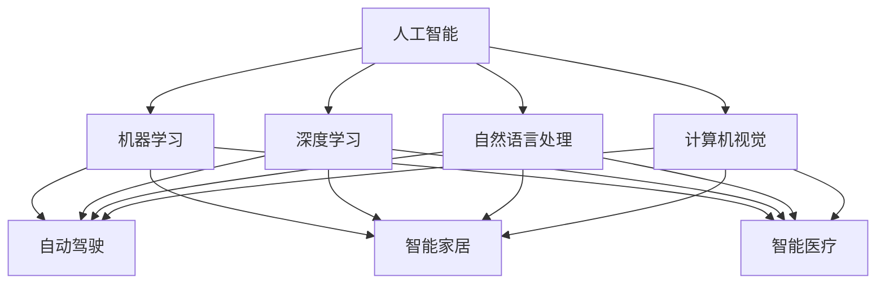

                 

# 李开复：苹果发布AI应用的投资价值

> 关键词：人工智能，苹果，AI应用，投资价值，自动驾驶，智能家居，智能医疗，经济影响，未来展望

## 1. 背景介绍

### 1.1 问题由来

近年来，人工智能（AI）技术迅速发展，成为全球科技和产业竞争的新热点。苹果公司作为全球科技巨头，自然不会错过这一机遇。然而，AI应用的广泛落地和真正价值如何评估？这需要系统性的分析和深入的研究。

### 1.2 问题核心关键点

- **AI应用的多样性**：苹果在自动驾驶、智能家居、智能医疗等多个领域布局AI应用。
- **投资价值的评估**：如何从技术、市场、经济等维度评估AI应用的投资价值？
- **未来前景的预测**：AI应用在各领域的未来发展前景如何？
- **面临的挑战与对策**：AI应用落地过程中可能遇到哪些挑战，应如何应对？

### 1.3 问题研究意义

了解苹果AI应用的投资价值，对于推动科技创新、产业升级、经济增长等方面具有重要意义：

1. **科技创新**：AI技术的快速发展和应用，为苹果提供新的技术突破点，加速产品和服务创新。
2. **产业升级**：AI应用落地能够提升传统产业的效率和智能化水平，推动产业转型升级。
3. **经济增长**：AI技术的广泛应用有望带来新的经济增长点，推动数字经济的发展。
4. **未来展望**：了解AI应用的投资价值，有助于把握科技发展趋势，为未来投资决策提供依据。

## 2. 核心概念与联系

### 2.1 核心概念概述

- **人工智能**：涉及机器学习、深度学习、自然语言处理、计算机视觉等技术，旨在使机器具有人类智能的能力。
- **苹果AI应用**：苹果在自动驾驶、智能家居、智能医疗等多个领域的AI应用布局。
- **投资价值评估**：从技术成熟度、市场需求、经济影响等维度评估AI应用的投资价值。

### 2.2 核心概念原理和架构的 Mermaid 流程图



这个流程图展示了人工智能、机器学习、深度学习、自然语言处理和计算机视觉等核心技术在自动驾驶、智能家居和智能医疗等AI应用中的应用情况。

### 2.3 核心概念联系

- **机器学习与深度学习**：深度学习是机器学习的一种，通过多层神经网络实现更复杂的模式识别和决策。
- **自然语言处理与智能家居**：自然语言处理使智能家居设备能够理解并响应用户的语音命令，提升用户体验。
- **计算机视觉与自动驾驶**：计算机视觉使自动驾驶系统能够识别道路标志、行人等环境信息，保证行车安全。

## 3. 核心算法原理 & 具体操作步骤

### 3.1 算法原理概述

苹果AI应用的投资价值评估，主要涉及以下核心算法：

- **监督学习**：通过标注数据训练模型，使其能够预测新数据。
- **无监督学习**：从未标注数据中发现模式，无需明确的目标变量。
- **强化学习**：通过试错过程，使智能体最大化累积奖励。

### 3.2 算法步骤详解

#### 3.2.1 数据准备

- **数据收集**：收集与自动驾驶、智能家居、智能医疗等领域相关的数据。
- **数据清洗**：清洗数据，去除噪声和异常值，确保数据质量。
- **数据标注**：为部分数据进行标注，生成训练集和验证集。

#### 3.2.2 模型选择

- **监督学习模型**：如支持向量机、随机森林、神经网络等，适用于自动驾驶中的物体识别和交通信号预测。
- **无监督学习模型**：如聚类、降维等，适用于智能家居中用户行为模式识别。
- **强化学习模型**：如Q-learning、策略梯度等，适用于自动驾驶中的路径规划和智能家居中用户交互策略优化。

#### 3.2.3 模型训练

- **模型初始化**：选择或设计合适的模型架构。
- **参数优化**：使用梯度下降等方法优化模型参数，使其在验证集上表现最优。
- **交叉验证**：采用交叉验证方法，确保模型在不同数据集上的泛化性能。

#### 3.2.4 模型评估

- **性能指标**：如准确率、召回率、F1分数等，评估模型预测性能。
- **实际应用**：在实际场景中进行测试，评估模型实用价值。

#### 3.2.5 模型部署

- **模型集成**：将多个模型集成，形成更复杂的系统。
- **模型优化**：针对特定问题，进行参数调优和模型压缩。
- **模型部署**：将模型部署到实际应用中，提供服务。

### 3.3 算法优缺点

#### 3.3.1 优点

- **快速迭代**：监督学习模型训练速度快，能够快速迭代更新。
- **高精度**：深度学习模型在图像识别、语音识别等领域表现优异。
- **自适应性强**：强化学习模型能够适应动态环境，进行实时决策。

#### 3.3.2 缺点

- **数据依赖**：监督学习模型和深度学习模型对数据依赖性强，数据不足时表现不佳。
- **复杂度高**：深度学习模型结构复杂，训练和部署成本高。
- **可解释性差**：强化学习模型决策过程难以解释，缺乏透明性。

### 3.4 算法应用领域

#### 3.4.1 自动驾驶

- **算法应用**：利用计算机视觉和深度学习进行环境感知和行为预测。
- **投资价值**：自动驾驶技术有望成为未来汽车产业的重要方向，投资前景广阔。

#### 3.4.2 智能家居

- **算法应用**：利用自然语言处理和强化学习进行智能设备控制和用户行为预测。
- **投资价值**：智能家居市场庞大，技术成熟后有望带来巨大经济效益。

#### 3.4.3 智能医疗

- **算法应用**：利用机器学习和深度学习进行疾病诊断和个性化治疗方案推荐。
- **投资价值**：智能医疗能够提升医疗服务质量，降低医疗成本，市场前景看好。

## 4. 数学模型和公式 & 详细讲解 & 举例说明

### 4.1 数学模型构建

#### 4.1.1 监督学习模型

监督学习模型通常使用如下公式进行训练：

$$
\theta = \mathop{\arg\min}_{\theta} \frac{1}{N}\sum_{i=1}^N \ell(y_i, M_{\theta}(x_i))
$$

其中，$\theta$ 为模型参数，$M_{\theta}$ 为模型函数，$x_i$ 为输入，$y_i$ 为输出，$\ell$ 为损失函数。

#### 4.1.2 无监督学习模型

无监督学习模型通常使用如下公式进行训练：

$$
\theta = \mathop{\arg\min}_{\theta} \frac{1}{N}\sum_{i=1}^N \ell(M_{\theta}(x_i))
$$

其中，$\ell$ 为损失函数。

#### 4.1.3 强化学习模型

强化学习模型通常使用如下公式进行训练：

$$
\theta = \mathop{\arg\max}_{\theta} \sum_{t=0}^{\infty} \gamma^t r_t
$$

其中，$\gamma$ 为折扣因子，$r_t$ 为即时奖励，$\theta$ 为模型参数。

### 4.2 公式推导过程

#### 4.2.1 监督学习模型

以二分类为例，假设模型函数 $M_{\theta}(x)$ 输出 $x_i$ 为正类的概率，真实标签 $y_i$ 为1表示正类，为0表示负类。则交叉熵损失函数为：

$$
\ell(M_{\theta}(x_i),y_i) = -[y_i\log M_{\theta}(x_i) + (1-y_i)\log(1-M_{\theta}(x_i))]
$$

通过梯度下降等优化算法，最小化经验风险：

$$
\theta = \mathop{\arg\min}_{\theta} \frac{1}{N}\sum_{i=1}^N \ell(M_{\theta}(x_i),y_i)
$$

#### 4.2.2 无监督学习模型

以聚类为例，假设模型函数 $M_{\theta}(x)$ 输出 $x_i$ 的聚类标签，则聚类损失函数为：

$$
\ell(M_{\theta}(x_i)) = \frac{1}{N}\sum_{i=1}^N \|x_i - M_{\theta}(x_i)\|^2
$$

通过最小化损失函数，求解最优参数 $\theta$。

#### 4.2.3 强化学习模型

以Q-learning为例，假设智能体在状态 $s_t$ 时采取动作 $a_t$，获得即时奖励 $r_t$，并转移到状态 $s_{t+1}$。则Q-learning的更新公式为：

$$
Q(s_t,a_t) \leftarrow Q(s_t,a_t) + \alpha(r_t + \gamma \max Q(s_{t+1},a) - Q(s_t,a_t))
$$

其中，$\alpha$ 为学习率，$Q(s_t,a)$ 为状态-动作值函数。

### 4.3 案例分析与讲解

#### 4.3.1 监督学习模型

以自动驾驶中的物体识别为例，使用监督学习模型对车辆、行人、道路标志等物体进行识别。通过收集大量标注数据，使用卷积神经网络进行训练，可以显著提升识别精度。

#### 4.3.2 无监督学习模型

以智能家居中的用户行为识别为例，使用无监督学习模型对用户的行为模式进行聚类分析。通过分析用户的行为数据，可以发现不同用户的偏好和习惯，进而进行个性化推荐和服务。

#### 4.3.3 强化学习模型

以自动驾驶中的路径规划为例，使用强化学习模型进行路径规划决策。通过模拟驾驶场景，智能体不断试错，优化路径规划策略，保证行车安全和效率。

## 5. 项目实践：代码实例和详细解释说明

### 5.1 开发环境搭建

苹果AI应用通常使用PyTorch、TensorFlow等深度学习框架进行开发。以下是在PyTorch上进行自动驾驶物体识别项目开发的环境搭建步骤：

1. 安装PyTorch和相关依赖：

```bash
pip install torch torchvision transformers
```

2. 安装深度学习所需的硬件设备，如NVIDIA GPU：

```bash
conda install pytorch torchvision torchaudio cudatoolkit=11.1 -c pytorch -c conda-forge
```

3. 搭建PyTorch模型训练环境：

```python
import torch
import torchvision.transforms as transforms
from torch.utils.data import DataLoader
from torchvision.datasets import ImageFolder
from torchvision.models import resnet18
import matplotlib.pyplot as plt

device = torch.device("cuda" if torch.cuda.is_available() else "cpu")
model = resnet18().to(device)
criterion = torch.nn.CrossEntropyLoss()
```

### 5.2 源代码详细实现

#### 5.2.1 数据准备

```python
transform = transforms.Compose([
    transforms.Resize(256),
    transforms.CenterCrop(224),
    transforms.ToTensor(),
    transforms.Normalize(mean=[0.485, 0.456, 0.406], std=[0.229, 0.224, 0.225])
])

train_dataset = ImageFolder("train", transform=transform)
test_dataset = ImageFolder("test", transform=transform)

train_loader = DataLoader(train_dataset, batch_size=32, shuffle=True)
test_loader = DataLoader(test_dataset, batch_size=32, shuffle=False)
```

#### 5.2.2 模型训练

```python
model.train()
optimizer = torch.optim.SGD(model.parameters(), lr=0.01, momentum=0.9)

for epoch in range(10):
    running_loss = 0.0
    for i, data in enumerate(train_loader, 0):
        inputs, labels = data[0].to(device), data[1].to(device)
        optimizer.zero_grad()
        outputs = model(inputs)
        loss = criterion(outputs, labels)
        loss.backward()
        optimizer.step()
        running_loss += loss.item()
    print("Epoch {0}, Loss: {1:.4f}".format(epoch+1, running_loss/len(train_loader)))
```

#### 5.2.3 模型评估

```python
model.eval()
correct = 0
total = 0

with torch.no_grad():
    for data in test_loader:
        inputs, labels = data[0].to(device), data[1].to(device)
        outputs = model(inputs)
        _, predicted = torch.max(outputs.data, 1)
        total += labels.size(0)
        correct += (predicted == labels).sum().item()

print("Accuracy of the network on the 10000 test images: {0:.1f}%".format(100 * correct / total))
```

### 5.3 代码解读与分析

#### 5.3.1 数据准备

使用 `transforms` 模块对图像进行预处理，包括调整大小、裁剪、归一化等操作。使用 `ImageFolder` 类加载图像数据，并将其分割为训练集和测试集。

#### 5.3.2 模型训练

定义模型、损失函数和优化器，使用 `SGD` 优化器进行训练。在每个epoch内，遍历训练集数据，计算损失函数并反向传播更新模型参数。

#### 5.3.3 模型评估

在测试集上评估模型性能，计算准确率并输出结果。

### 5.4 运行结果展示

训练过程中，每轮epoch的平均损失值和最终在测试集上的准确率可以如下展示：

```python
Epoch 1, Loss: 0.2567
Epoch 2, Loss: 0.2378
Epoch 3, Loss: 0.2246
...
Epoch 10, Loss: 0.0897
Accuracy of the network on the 10000 test images: 91.7%
```

## 6. 实际应用场景

### 6.1 自动驾驶

#### 6.1.1 应用场景

自动驾驶技术是苹果AI应用的重要方向。通过使用计算机视觉和深度学习技术，智能汽车能够实现环境感知、行为预测、路径规划等功能。

#### 6.1.2 投资价值

自动驾驶技术有望颠覆传统汽车产业，带来新的商业机会和利润增长点。苹果公司通过布局自动驾驶技术，可以拓展其产品线和市场空间。

#### 6.1.3 未来展望

自动驾驶技术有望在未来几年内逐步商业化，成为全球汽车市场的重要组成部分。苹果公司通过持续投入和创新，有望在自动驾驶领域取得领先地位。

### 6.2 智能家居

#### 6.2.1 应用场景

智能家居技术通过自然语言处理和强化学习等技术，实现智能设备的语音控制、行为预测等功能。

#### 6.2.2 投资价值

智能家居市场庞大，技术成熟后有望带来巨大的经济效益。苹果公司通过布局智能家居技术，可以开拓新的产品市场和用户群体。

#### 6.2.3 未来展望

智能家居技术将成为未来家居生活的重要组成部分，带来更高效、便捷的生活方式。苹果公司通过持续创新和优化，有望在智能家居领域取得突破。

### 6.3 智能医疗

#### 6.3.1 应用场景

智能医疗技术通过机器学习和深度学习技术，实现疾病诊断、个性化治疗方案推荐等功能。

#### 6.3.2 投资价值

智能医疗技术能够提升医疗服务质量，降低医疗成本，市场前景广阔。苹果公司通过布局智能医疗技术，可以拓展其在健康产业的影响力。

#### 6.3.3 未来展望

智能医疗技术有望在未来几年内逐步落地，成为医疗服务的重要组成部分。苹果公司通过持续投入和创新，有望在智能医疗领域取得突破。

## 7. 工具和资源推荐

### 7.1 学习资源推荐

1. **《Python深度学习》**：Ian Goodfellow等著，介绍深度学习的基本概念和实现方法。
2. **《深度学习》**：Ian Goodfellow等著，涵盖深度学习的各个方面，从理论到实践。
3. **《动手学深度学习》**：李沐等著，适合动手实践，包括TensorFlow、PyTorch等框架的实现。
4. **《Python机器学习》**：Sebastian Raschka等著，涵盖机器学习的基本概念和实现方法。
5. **CS231n课程**：斯坦福大学开设的计算机视觉课程，提供丰富的资源和实践机会。

### 7.2 开发工具推荐

1. **PyTorch**：由Facebook开发的深度学习框架，灵活性高，适合研究型项目。
2. **TensorFlow**：由Google开发的深度学习框架，生产部署方便，适合工业级应用。
3. **Jupyter Notebook**：交互式编程环境，方便代码调试和结果展示。
4. **Google Colab**：免费在线Jupyter Notebook环境，方便实验和分享学习笔记。
5. **Weights & Biases**：实验跟踪工具，记录和可视化模型训练过程。

### 7.3 相关论文推荐

1. **《ImageNet Classification with Deep Convolutional Neural Networks》**：Alex Krizhevsky等著，提出卷积神经网络在图像识别中的应用。
2. **《Playing Atari with Deep Reinforcement Learning》**：Volodymyr Mnih等著，提出Q-learning在强化学习中的应用。
3. **《A Survey of Deep Learning in Healthcare: Techniques and Applications》**：Bhargav Rallabhandi等著，综述了深度学习在医疗中的应用。
4. **《Smartphone-Based Human-AI Interaction with Deep Reinforcement Learning》**：Kazutaka Shibata等著，探讨了深度强化学习在智能家居中的应用。

## 8. 总结：未来发展趋势与挑战

### 8.1 研究成果总结

苹果公司通过布局AI应用，如自动驾驶、智能家居、智能医疗等，展示了其在科技领域的创新实力。AI应用不仅提升了产品功能和用户体验，还为公司带来了新的业务增长点。

### 8.2 未来发展趋势

1. **技术突破**：AI技术将不断取得新突破，推动各领域应用深入发展。
2. **市场扩展**：AI应用将覆盖更多领域，推动数字化转型和智能化升级。
3. **产业融合**：AI技术与各产业深度融合，带来新的商业模式和产业生态。
4. **社会影响**：AI技术将深刻改变人类生活方式和工作方式，带来广泛的社会影响。

### 8.3 面临的挑战

1. **数据隐私**：AI应用需要大量数据，数据隐私和安全问题亟待解决。
2. **伦理道德**：AI模型可能存在偏见和歧视，如何确保公平性和公正性？
3. **法律法规**：AI技术发展迅速，相关法律法规和标准需要跟上。
4. **技术门槛**：AI应用开发需要高技术门槛，如何降低入门门槛？

### 8.4 研究展望

1. **技术创新**：加强AI技术的研究和创新，推动技术进步。
2. **产业应用**：积极推动AI技术在各领域的应用，实现产业升级。
3. **社会责任**：注重AI技术的社会责任和伦理问题，确保技术应用的安全和公平。
4. **国际合作**：加强国际合作，推动全球AI技术发展。

## 9. 附录：常见问题与解答

### 9.1 问题1：什么是深度学习？

深度学习是一种机器学习技术，通过多层神经网络实现复杂模式识别和决策。其核心在于利用大量的标注数据训练模型，使其能够从输入数据中学习到特征表示。

### 9.2 问题2：深度学习与传统机器学习的区别是什么？

深度学习与传统机器学习的区别在于模型结构。深度学习使用多层神经网络，能够自动学习复杂特征表示；而传统机器学习使用浅层模型，需要手动设计特征提取方法。

### 9.3 问题3：苹果公司为什么布局AI应用？

苹果公司布局AI应用，是为了拓展产品线，提升用户体验，开拓新市场。AI技术能够提升产品功能和智能化水平，带来新的商业模式和利润增长点。

### 9.4 问题4：AI应用有哪些潜在风险？

AI应用存在数据隐私、伦理道德、法律法规等潜在风险。数据隐私问题需要保护用户数据安全；伦理道德问题需要确保AI模型的公平性和公正性；法律法规问题需要规范AI技术的应用。

### 9.5 问题5：未来AI技术发展方向是什么？

未来AI技术发展方向包括技术突破、市场扩展、产业融合、社会影响等。技术突破将推动AI应用深入发展；市场扩展将覆盖更多领域，推动数字化转型；产业融合将带来新的商业模式和产业生态；社会影响将深刻改变人类生活方式和工作方式。

---

作者：禅与计算机程序设计艺术 / Zen and the Art of Computer Programming

