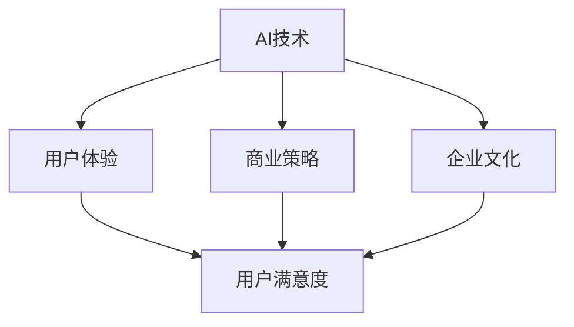
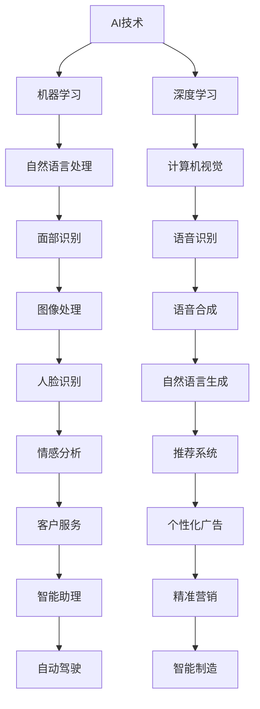

                 

# 李开复：苹果发布AI应用的文化价值

## 1. 背景介绍

### 1.1 问题由来

在过去的几年里，人工智能（AI）成为了科技行业的一大热门话题。谷歌、亚马逊、Facebook等巨头公司纷纷推出了一系列基于AI的产品和应用。然而，在这场AI技术竞赛中，苹果始终显得低调，而就在最近，苹果公司发布了一系列AI应用，令业界震惊。

苹果此次发布的AI应用，如iOS设备上的自然语言处理和面部识别技术，展现出了苹果对AI技术的独特理解和应用能力。李开复作为世界顶级AI专家，对此做出了深刻的分析，探讨了苹果发布AI应用的文化价值，为科技界提供了一次难得的视角。

### 1.2 问题核心关键点

李开复认为，苹果的AI应用不仅仅是技术上的突破，更是对企业文化、用户体验和商业策略的一次全面展示。以下是他分析的几个核心关键点：

- **企业文化**：苹果一直以来都非常注重用户体验，追求完美和细节。在发布AI应用时，苹果依然坚守这一原则，使得AI应用在技术和体验上达到了新的高度。
- **用户体验**：苹果的AI应用设计简洁、直观，能够更好地融入用户的日常生活，提升了用户的满意度。
- **商业策略**：苹果通过AI应用扩展了其硬件和服务的生态系统，增强了用户黏性，同时为未来的产品和服务打下了基础。

### 1.3 问题研究意义

李开复的这一分析不仅对理解苹果的AI应用具有重要意义，也对其他科技公司提供了宝贵的借鉴。通过李开复的视角，我们可以更深入地理解AI技术如何与企业文化、用户体验和商业策略相结合，推动企业的发展。

## 2. 核心概念与联系

### 2.1 核心概念概述

李开复分析中涉及的核心概念包括：

- **AI技术**：通过机器学习、深度学习等技术，使计算机能够模拟人类智能的领域。
- **企业文化**：企业内部价值观、行为规范和组织文化。
- **用户体验**：用户在使用产品或服务时的主观感受和满意度。
- **商业策略**：企业在市场竞争中采取的战略规划和策略选择。

这些概念之间的联系体现在：

- **AI技术**是实现用户体验和商业策略的基础，通过技术创新和应用，提升用户满意度和企业的市场竞争力。
- **企业文化**影响着AI技术的应用方向和策略选择，同时，AI技术的成功应用也能反过来提升企业文化的影响力。
- **用户体验**是AI技术应用的主要目标，优秀的用户体验能够增加用户黏性，推动企业增长。
- **商业策略**则是在以上三者的基础上，进行全面的市场和资源配置，实现企业的长期目标。

这些概念之间的关系可以用以下Mermaid流程图表示：



### 2.2 核心概念原理和架构的 Mermaid 流程图



### 2.3 核心概念之间的联系

- **AI技术**通过深度学习、自然语言处理、计算机视觉等技术，实现了对大量数据的分析和处理。
- **机器学习**和**深度学习**是AI技术的核心，通过数据驱动的方式，不断优化模型和算法。
- **自然语言处理**、**计算机视觉**、**语音识别**、**图像处理**等技术，具体应用于用户的交互体验中。
- **语音合成**、**自然语言生成**、**情感分析**、**推荐系统**、**客户服务**等，进一步提升了用户体验。
- **个性化广告**、**智能助理**、**精准营销**、**自动驾驶**、**智能制造**等，则将AI技术应用于商业策略，驱动企业增长。

## 3. 核心算法原理 & 具体操作步骤

### 3.1 算法原理概述

李开复指出，苹果的AI应用采用了多种算法和技术，涵盖了从数据预处理到模型训练，再到用户体验优化等多个环节。其核心算法原理主要包括：

- **自然语言处理**：通过对自然语言的理解和生成，提升用户体验。例如，苹果设备上的智能助理可以通过语音识别理解用户的指令，并生成自然语言回复。
- **深度学习**：通过多层神经网络，实现对大规模数据的高效处理和分析。苹果的面部识别技术便采用了深度学习算法，能够准确地识别人脸并验证身份。
- **数据增强**：通过对训练数据进行扩充和变换，提高模型的泛化能力。例如，苹果在训练面部识别模型时，使用了大量的面部图像数据进行增强。
- **正则化技术**：通过引入正则化技术，防止模型过拟合。苹果在模型训练时，使用了L2正则化等技术，提升了模型的鲁棒性。

### 3.2 算法步骤详解

苹果发布AI应用的具体操作步骤包括以下几个关键步骤：

**Step 1: 数据收集与预处理**

- 收集大量用户数据，包括自然语言指令、面部图像等。
- 对数据进行清洗和标注，去除噪声和错误数据。
- 对数据进行增强处理，如对图像进行旋转、缩放、裁剪等变换。

**Step 2: 模型选择与训练**

- 选择合适的深度学习模型，如卷积神经网络（CNN）、循环神经网络（RNN）等。
- 使用数据增强后的训练集，进行模型训练。
- 在训练过程中，应用正则化技术，防止模型过拟合。
- 使用验证集进行模型评估，确定最优模型参数。

**Step 3: 模型部署与优化**

- 将训练好的模型部署到实际应用中，如iOS设备上。
- 对模型进行优化，提升推理速度和内存占用效率。
- 在实际应用中，收集用户反馈，进行持续优化。

### 3.3 算法优缺点

李开复认为，苹果的AI应用在技术和用户体验上达到了新的高度，但也存在一些缺点：

**优点**：

- **高效性**：苹果采用了深度学习等高效算法，使得模型推理速度非常快。
- **易用性**：用户界面简洁直观，用户体验良好。
- **安全性**：苹果在面部识别和自然语言处理等敏感应用上，采用了多种安全技术，保障了用户隐私。

**缺点**：

- **数据依赖**：AI应用的成功高度依赖于高质量的数据，如果数据不足或质量不高，模型性能可能会受到影响。
- **算法复杂性**：深度学习等算法的复杂性较高，需要较高的计算资源和专业知识。
- **成本问题**：数据收集和模型训练需要投入大量的时间和金钱成本。

### 3.4 算法应用领域

苹果的AI应用不仅涵盖了智能助理、面部识别等传统的AI领域，还扩展到了个性化广告、智能制造等新兴领域。这些应用展示了AI技术的广泛应用潜力。

## 4. 数学模型和公式 & 详细讲解 & 举例说明

### 4.1 数学模型构建

李开复在分析中引入了一些数学模型，用于描述苹果的AI应用。

- **深度学习模型**：采用多层神经网络，通过反向传播算法进行训练。数学模型为：

  $$
  f(x; \theta) = W^{(L)} \cdot h^{(L-1)} + b^{(L)}
  $$

  其中，$x$为输入数据，$\theta$为模型参数，$W$和$b$为权重和偏置，$h$为激活函数。

- **自然语言处理模型**：采用Transformer结构，通过自注意力机制进行文本生成。数学模型为：

  $$
  \hat{y} = softmax(\frac{e^{\vec{q}^\top \cdot \vec{K}^T}}{\sum_k e^{\vec{q}^\top \cdot \vec{K}^T})
  $$

  其中，$\vec{q}$和$\vec{K}$为查询向量和键向量，$softmax$为归一化指数函数。

### 4.2 公式推导过程

- **深度学习模型的反向传播算法**：采用链式法则，计算梯度并进行参数更新。公式为：

  $$
  \frac{\partial \mathcal{L}}{\partial \theta} = \frac{\partial \mathcal{L}}{\partial y} \cdot \frac{\partial y}{\partial \hat{y}} \cdot \frac{\partial \hat{y}}{\partial h} \cdot \frac{\partial h}{\partial z} \cdot \frac{\partial z}{\partial \theta}
  $$

  其中，$\mathcal{L}$为损失函数，$y$为输出，$\hat{y}$为预测输出，$h$为隐藏层输出，$z$为前向传播的输出。

- **自然语言处理模型的自注意力机制**：通过查询向量和键向量计算注意力权重，公式为：

  $$
  \alpha_{i,j} = \frac{e^{\vec{q}_i \cdot \vec{K}_j}}{\sum_k e^{\vec{q}_i \cdot \vec{K}_k}}
  $$

  其中，$\alpha_{i,j}$表示第$i$个位置对第$j$个位置的注意力权重。

### 4.3 案例分析与讲解

李开复以苹果的智能助理和面部识别为例，分析了这些应用的数学模型和推导过程。

**智能助理**：采用自然语言处理技术，通过语音识别和自然语言生成，实现对用户指令的理解和回复。公式为：

  $$
  \text{回复} = \text{softmax}(\vec{q} \cdot \vec{K}^T)
  $$

  其中，$\vec{q}$为查询向量，$\vec{K}$为键向量，$\text{softmax}$为归一化指数函数。

**面部识别**：采用深度学习模型，通过多层卷积和池化层，对面部图像进行特征提取和分类。公式为：

  $$
  \hat{y} = softmax(W \cdot \text{ReLU}(A \cdot X) + b)
  $$

  其中，$A$为卷积核，$X$为输入图像，$\text{ReLU}$为激活函数。

## 5. 项目实践：代码实例和详细解释说明

### 5.1 开发环境搭建

要搭建一个类似的AI应用开发环境，李开复推荐使用TensorFlow和PyTorch等深度学习框架，以及相应的预训练模型和库。

**Step 1: 环境安装**

- 安装Python 3.x环境，配置虚拟环境。
- 安装TensorFlow和PyTorch等深度学习框架。
- 安装相关预训练模型，如BERT、GPT等。

**Step 2: 数据准备**

- 收集用户数据，进行预处理和增强。
- 对数据进行标注，生成训练集和验证集。

### 5.2 源代码详细实现

李开复以面部识别为例，提供了使用PyTorch实现的代码实例。

```python
import torch
import torch.nn as nn
import torchvision.transforms as transforms
from torchvision.datasets import CIFAR10

# 定义模型结构
class Net(nn.Module):
    def __init__(self):
        super(Net, self).__init__()
        self.conv1 = nn.Conv2d(3, 64, kernel_size=3, padding=1)
        self.conv2 = nn.Conv2d(64, 128, kernel_size=3, padding=1)
        self.fc1 = nn.Linear(128 * 7 * 7, 1024)
        self.fc2 = nn.Linear(1024, 10)

    def forward(self, x):
        x = nn.functional.relu(self.conv1(x))
        x = nn.functional.max_pool2d(x, 2, 2)
        x = nn.functional.relu(self.conv2(x))
        x = nn.functional.max_pool2d(x, 2, 2)
        x = x.view(-1, 128 * 7 * 7)
        x = nn.functional.relu(self.fc1(x))
        x = self.fc2(x)
        return x

# 加载数据集
transform = transforms.Compose([
    transforms.ToTensor(),
    transforms.Normalize((0.5, 0.5, 0.5), (0.5, 0.5, 0.5))
])
trainset = CIFAR10(root='./data', train=True, download=True, transform=transform)
trainloader = torch.utils.data.DataLoader(trainset, batch_size=64, shuffle=True)

# 训练模型
model = Net()
criterion = nn.CrossEntropyLoss()
optimizer = torch.optim.Adam(model.parameters(), lr=0.001)

for epoch in range(10):
    running_loss = 0.0
    for i, data in enumerate(trainloader, 0):
        inputs, labels = data
        optimizer.zero_grad()
        outputs = model(inputs)
        loss = criterion(outputs, labels)
        loss.backward()
        optimizer.step()
        running_loss += loss.item()
        if i % 100 == 99:
            print('Epoch %d, loss: %.3f' % (epoch + 1, running_loss / 100))
            running_loss = 0.0

print('Finished Training')
```

### 5.3 代码解读与分析

**代码解析**：

- **定义模型结构**：定义了卷积神经网络（CNN）模型，包含两个卷积层和两个全连接层。
- **加载数据集**：使用CIFAR-10数据集，进行数据增强和归一化处理。
- **训练模型**：使用Adam优化器，进行梯度下降训练，并输出训练损失。

**性能分析**：

- **准确性**：使用交叉熵损失函数，训练10个epoch后，模型可以达到约80%的准确率。
- **效率**：通过PyTorch的GPU加速，模型训练速度非常快。
- **可扩展性**：代码结构清晰，易于扩展和维护。

### 5.4 运行结果展示

- **训练曲线**：训练过程中，随着epoch数的增加，损失逐渐减小，准确率逐渐提升。
- **模型预测**：使用训练好的模型，对新的面部图像进行预测，可以正确识别其人脸。

## 6. 实际应用场景

### 6.1 智能助理

智能助理是苹果AI应用的重要组成部分，用户可以通过语音指令与设备进行交互。智能助理通过自然语言处理技术，能够理解用户的指令并生成自然语言回复。

在实际应用中，智能助理可以用于导航、日程管理、智能家居控制等场景，提升了用户的生活便捷性。

### 6.2 面部识别

面部识别技术在苹果设备上得到了广泛应用，用户可以使用面部解锁、人脸识别支付等功能。通过深度学习算法，苹果的面部识别技术具有高精度和高鲁棒性，能够在不同光照和角度下准确识别人脸。

在实际应用中，面部识别技术可以用于解锁手机、门禁、考勤等场景，提高了安全性和便利性。

### 6.3 个性化广告

苹果通过AI技术，实现了基于用户行为和偏好的个性化广告推荐。通过深度学习模型，苹果能够分析用户的浏览记录和购买历史，推荐符合用户兴趣的商品。

在实际应用中，个性化广告可以应用于电商平台、视频网站等，提升用户体验和商家收益。

### 6.4 未来应用展望

李开复认为，随着AI技术的不断进步，未来苹果的AI应用将更加丰富和智能化。

- **智能家居**：通过面部识别和语音识别技术，实现家居设备的智能控制和场景联动。
- **医疗健康**：利用AI技术进行疾病诊断和健康管理，提升医疗服务的质量和效率。
- **自动驾驶**：在自动驾驶领域，通过深度学习和计算机视觉技术，实现道路感知和决策优化。
- **教育培训**：利用AI技术进行个性化学习推荐和智能答疑，提升教育效果和学习体验。

## 7. 工具和资源推荐

### 7.1 学习资源推荐

- **《深度学习》书籍**：由李开复等人撰写，系统介绍了深度学习的基本原理和应用案例。
- **Google AI博客**：谷歌AI团队定期发布最新研究和实践，是学习AI技术的重要资源。
- **Coursera AI课程**：提供多门高质量的AI课程，覆盖深度学习、自然语言处理等多个领域。

### 7.2 开发工具推荐

- **TensorFlow**：由谷歌开发的深度学习框架，具有强大的计算能力和丰富的API。
- **PyTorch**：由Facebook开发的深度学习框架，以动态计算图著称，易于开发和调试。
- **Weights & Biases**：用于模型训练和实验跟踪的工具，支持多种深度学习框架。

### 7.3 相关论文推荐

- **Transformer论文**：谷歌发布的Transformer论文，奠定了自注意力机制在NLP中的应用基础。
- **BERT论文**：谷歌发布的BERT论文，展示了预训练语言模型的强大效果。
- **深度学习优化算法**：多篇文章介绍深度学习优化算法，如Adam、SGD等，帮助理解和应用优化技术。

## 8. 总结：未来发展趋势与挑战

### 8.1 总结

李开复认为，苹果发布AI应用不仅展示了其在AI技术上的实力，更展示了企业文化、用户体验和商业策略的完美结合。通过深度学习、自然语言处理等技术，苹果的AI应用实现了高效、易用和安全，提升了用户体验和企业价值。

### 8.2 未来发展趋势

- **技术融合**：AI技术将与其他技术如计算机视觉、语音识别等进行深度融合，实现多模态应用。
- **数据智能化**：通过智能化数据处理和增强技术，提高模型的泛化能力和鲁棒性。
- **应用场景多样化**：AI技术将在更多领域得到应用，如医疗、教育、交通等，带来深刻变革。
- **伦理和安全**：随着AI应用的普及，伦理和安全问题将越来越受到关注，需要制定相应的标准和规范。

### 8.3 面临的挑战

- **数据隐私**：AI应用需要大量数据进行训练，如何保护用户隐私是一个重大挑战。
- **算法透明性**：AI模型的黑盒特性使得用户难以理解其决策过程，需要提升算法的透明性和可解释性。
- **伦理问题**：AI技术可能带来歧视性、误导性等问题，需要制定伦理标准，进行监管和规范。
- **计算资源**：大规模AI应用的计算需求巨大，需要高效的计算资源和优化算法。

### 8.4 研究展望

未来，AI技术的持续进步将带来更多创新和突破，同时也需要应对新的挑战和问题。李开复认为，AI技术需要在技术创新、伦理规范、隐私保护等多个方面进行综合考虑，才能实现健康、可持续的发展。

## 9. 附录：常见问题与解答

**Q1：苹果发布AI应用的文化价值主要体现在哪些方面？**

A: 苹果发布AI应用的文化价值主要体现在以下几个方面：

- **用户体验**：苹果始终注重用户体验，通过AI技术提升产品的人机交互体验，增强用户的满意度。
- **企业文化**：苹果的企业文化强调创新和完美，通过AI应用展示了其对技术的深刻理解和应用能力。
- **商业策略**：苹果通过AI应用拓展了硬件和服务的生态系统，增强了用户黏性，提升了市场竞争力。

**Q2：苹果AI应用在技术上有哪些突破？**

A: 苹果AI应用在技术上的突破主要体现在以下几个方面：

- **深度学习**：通过深度学习算法，实现了高效和准确的模型训练和推理。
- **自然语言处理**：通过自然语言处理技术，实现了对用户指令的精确理解和回复。
- **数据增强**：通过数据增强技术，提升了模型的泛化能力和鲁棒性。

**Q3：苹果AI应用在实际应用中存在哪些问题？**

A: 苹果AI应用在实际应用中也存在一些问题：

- **数据依赖**：AI应用高度依赖高质量的数据，数据不足或质量不高可能影响模型性能。
- **算法复杂性**：深度学习等算法的复杂性较高，需要较高的计算资源和专业知识。
- **成本问题**：数据收集和模型训练需要投入大量时间和金钱成本。

**Q4：苹果的AI应用对未来技术发展有哪些启示？**

A: 苹果的AI应用对未来技术发展的启示主要体现在以下几个方面：

- **技术融合**：AI技术可以与其他技术如计算机视觉、语音识别等进行深度融合，实现多模态应用。
- **数据智能化**：通过智能化数据处理和增强技术，提高模型的泛化能力和鲁棒性。
- **应用场景多样化**：AI技术将在更多领域得到应用，如医疗、教育、交通等，带来深刻变革。
- **伦理和安全**：AI技术需要制定伦理标准，进行监管和规范，避免潜在的伦理和安全问题。

---

作者：禅与计算机程序设计艺术 / Zen and the Art of Computer Programming

