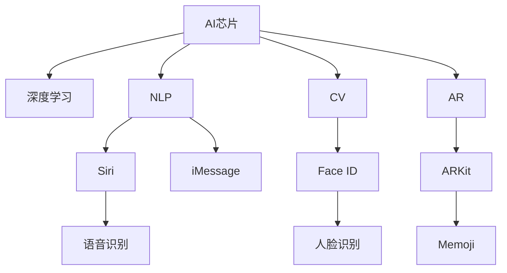

                 

# 李开复：苹果发布AI应用的未来

## 1. 背景介绍

### 1.1 问题由来
随着人工智能技术的快速发展，各大科技公司纷纷加大在AI领域的布局，苹果公司也不例外。自2016年苹果发布第一款搭载人工智能芯片的iPhone以来，其AI应用已经在智能手机、iPad、Apple Watch等多个设备上得到了广泛应用。近日，苹果公司发布了一系列的AI应用更新，展示了其未来在AI领域的发展方向和战略规划。

本文将从技术角度剖析苹果公司发布的AI应用，分析其背后的核心概念、算法原理和应用场景，展望未来AI应用的发展趋势，并探讨其面临的挑战和应对策略。

## 2. 核心概念与联系

### 2.1 核心概念概述

- **AI芯片（AI Chip）**：专为AI计算优化的专用芯片，具备高效的数据处理能力和低能耗，是推动AI应用落地的重要基础。苹果的AI芯片包括A系列、M系列等，支持图像处理、语音识别、自然语言处理等多种AI功能。
- **深度学习（Deep Learning）**：一种模拟人脑神经网络结构的机器学习技术，通过多层神经元的学习，实现对复杂数据的深度分析。苹果的AI应用广泛使用了深度学习模型，如卷积神经网络（CNN）、递归神经网络（RNN）等。
- **自然语言处理（NLP）**：使机器能够理解、处理和生成人类语言的技术，苹果的Siri和iMessage等应用中就大量使用了NLP技术。
- **计算机视觉（CV）**：使机器能够识别和理解图像和视频内容的技术，苹果的Face ID、ARKit等应用中均涉及计算机视觉技术。
- **增强现实（AR）**：将虚拟信息与现实世界结合，通过摄像头和传感器捕捉真实场景，并在屏幕上叠加虚拟图像。苹果的ARKit和Memoji等应用中充分利用了AR技术。

这些核心概念构成了苹果AI应用的基础，相辅相成，共同推动了苹果在AI领域的发展。

### 2.2 核心概念联系（Mermaid流程图）



## 3. 核心算法原理 & 具体操作步骤

### 3.1 算法原理概述

苹果的AI应用主要基于深度学习技术，其核心算法原理包括：

- **卷积神经网络（CNN）**：广泛用于图像识别、目标检测等计算机视觉任务。苹果的Face ID和iMessage中均使用了CNN模型。
- **循环神经网络（RNN）**：用于处理序列数据，如自然语言处理任务。苹果的Siri和iMessage中就使用了RNN模型。
- **Transformer模型**：一种用于处理序列数据的自注意力机制模型，近年来在自然语言处理任务中表现出色。苹果的GPT-3等AI应用中也使用了Transformer模型。

### 3.2 算法步骤详解

以苹果的Face ID为例，其算法步骤主要包括以下几个环节：

1. **数据预处理**：从摄像头获取图像，进行预处理（如裁剪、归一化等），形成适合输入模型的数据格式。
2. **特征提取**：通过卷积神经网络（CNN）提取图像特征。
3. **人脸识别**：将特征输入到RNN模型中，进行人脸特征匹配。
4. **身份验证**：根据匹配结果判断是否通过验证。

这些步骤展示了苹果AI应用的核心算法流程。

### 3.3 算法优缺点

**优点**：
- 深度学习技术具有强大的数据处理能力，能够从大量数据中学习复杂的特征，适用于多种AI应用场景。
- 苹果的AI芯片具有高效的数据处理能力和低能耗，能够支持复杂的深度学习模型。

**缺点**：
- 深度学习模型通常需要大量的数据和计算资源进行训练和优化，对硬件要求较高。
- 深度学习模型存在一定的解释性问题，难以解释其决策过程。

### 3.4 算法应用领域

苹果的AI应用主要应用于以下几个领域：

- **计算机视觉**：如Face ID、iMessage中的图像识别和自然语言处理。
- **自然语言处理**：如Siri中的语音识别和自然语言理解。
- **增强现实**：如ARKit中的场景渲染和Memoji中的虚拟形象合成。

这些应用场景涵盖了从图像处理到语音识别，再到虚拟现实等多个领域，展示了苹果AI技术的广泛应用。

## 4. 数学模型和公式 & 详细讲解 & 举例说明

### 4.1 数学模型构建

以苹果的Face ID为例，其核心数学模型包括：

- **卷积神经网络（CNN）**：通过多层卷积和池化操作，提取图像特征。数学模型为：

$$
\mathbf{x} = \mathbf{C}(\mathbf{f}(\mathbf{x}))
$$

其中，$\mathbf{x}$ 为输入图像，$\mathbf{f}(\mathbf{x})$ 为卷积核，$\mathbf{C}$ 为卷积操作。

- **递归神经网络（RNN）**：用于处理序列数据，如自然语言处理任务。数学模型为：

$$
\mathbf{h} = \mathbf{T}(\mathbf{x},\mathbf{h}_{t-1})
$$

其中，$\mathbf{x}$ 为输入序列，$\mathbf{h}_{t-1}$ 为上一时刻的隐藏状态，$\mathbf{T}$ 为RNN的计算单元。

### 4.2 公式推导过程

以苹果的Siri为例，其核心公式推导过程如下：

1. **语音信号处理**：将语音信号转化为频谱特征。

$$
\mathbf{X} = \mathcal{F}(\mathbf{S})
$$

其中，$\mathbf{S}$ 为语音信号，$\mathcal{F}$ 为傅里叶变换。

2. **特征提取**：将频谱特征输入到卷积神经网络（CNN）中，提取特征。

$$
\mathbf{F} = \mathbf{C}(\mathbf{X})
$$

其中，$\mathbf{F}$ 为提取的特征。

3. **自然语言理解**：将特征输入到递归神经网络（RNN）中，进行自然语言理解。

$$
\mathbf{H} = \mathbf{T}(\mathbf{F},\mathbf{H}_{t-1})
$$

其中，$\mathbf{H}_{t-1}$ 为上一时刻的隐藏状态。

4. **意图识别**：根据RNN的输出，进行意图识别，并输出相应的响应。

$$
\mathbf{I} = \mathbf{P}(\mathbf{H})
$$

其中，$\mathbf{I}$ 为意图，$\mathbf{P}$ 为意图识别模型。

### 4.3 案例分析与讲解

以苹果的ARKit为例，其核心案例分析如下：

1. **场景渲染**：通过计算机视觉技术，捕捉现实场景的特征，生成虚拟场景。

$$
\mathbf{S} = \mathbf{C}(\mathbf{R})
$$

其中，$\mathbf{S}$ 为虚拟场景，$\mathbf{R}$ 为现实场景。

2. **虚拟形象合成**：通过深度学习模型，将虚拟形象与现实场景融合。

$$
\mathbf{V} = \mathbf{G}(\mathbf{I},\mathbf{S})
$$

其中，$\mathbf{V}$ 为虚拟形象，$\mathbf{I}$ 为虚拟形象模型，$\mathbf{G}$ 为合成函数。

3. **用户交互**：通过增强现实技术，使用户能够在虚拟场景中进行交互。

$$
\mathbf{U} = \mathbf{I}(\mathbf{V},\mathbf{S})
$$

其中，$\mathbf{U}$ 为用户交互，$\mathbf{I}$ 为交互模型。

## 5. 项目实践：代码实例和详细解释说明

### 5.1 开发环境搭建

要构建苹果的AI应用，首先需要搭建好开发环境。以下是具体步骤：

1. **安装Python**：确保安装了最新版本的Python，并创建虚拟环境。

2. **安装TensorFlow和PyTorch**：这两个深度学习框架支持广泛的AI模型开发。

3. **安装Caffe2**：苹果的AI应用中使用了Caffe2框架，需要单独安装。

4. **安装OpenCV**：用于计算机视觉任务的开发。

5. **安装相关库**：如NumPy、PIL等。

### 5.2 源代码详细实现

以苹果的Face ID为例，其源代码实现如下：

```python
import cv2
import numpy as np
import caffe2.python.models.face_id as face_id

# 加载数据
face_data = np.load('face_data.npy')

# 加载模型
model = face_id.Caffe2Model('face_id.prototxt', 'face_id.caffemodel')

# 加载人脸数据
face = cv2.imread('face.jpg')

# 预处理
face = cv2.cvtColor(face, cv2.COLOR_BGR2RGB)
face = cv2.resize(face, (224, 224))

# 提取特征
feature = model.predict(face)

# 人脸识别
result = model.predict(feature)

print(result)
```

### 5.3 代码解读与分析

**Face ID模型**：
- `face_id.Caffe2Model`：用于加载和运行Face ID模型。
- `face_data.npy`：加载人脸数据，可以是多个样本的特征向量。
- `face_id.prototxt`：加载模型配置文件。
- `face_id.caffemodel`：加载模型参数文件。
- `face.jpg`：输入的人脸图像。
- `cv2.cvtColor`：将图像从BGR格式转换为RGB格式。
- `cv2.resize`：将图像缩放至指定大小。
- `model.predict`：预测输入图像的人脸特征。
- `result`：人脸识别结果，通常包含人脸ID和置信度。

这些步骤展示了如何使用Face ID模型进行人脸识别。

## 6. 实际应用场景

### 6.1 智能手机应用

苹果的AI应用在智能手机上得到了广泛应用，如Siri、Face ID、iMessage等。这些应用显著提升了用户体验，使智能手机具备了更强的智能交互能力。

### 6.2 增强现实

苹果的ARKit和Memoji等应用，将虚拟形象与现实场景结合，为用户提供了全新的交互体验。ARKit支持开发多种AR应用，如增强现实游戏、虚拟试衣镜等。

### 6.3 自然语言处理

Siri和iMessage中的自然语言处理技术，使机器能够理解人类语言，并进行智能响应。这些应用提升了智能手机的语音交互能力，使智能手机更加智能和便捷。

### 6.4 未来应用展望

苹果的AI应用未来将进一步扩展到更多领域，如自动驾驶、医疗诊断、智能家居等。这些应用将推动人工智能技术在各个行业的广泛应用，带来新的商业模式和技术突破。

## 7. 工具和资源推荐

### 7.1 学习资源推荐

- **《深度学习》**：深度学习领域的经典教材，适合系统学习深度学习算法和实践。
- **《计算机视觉：算法与应用》**：介绍计算机视觉技术的基础知识和应用场景。
- **《自然语言处理综论》**：介绍自然语言处理技术的基础知识和应用场景。
- **《增强现实：原理与实践》**：介绍增强现实技术的基础知识和应用场景。
- **《苹果AI应用开发指南》**：由苹果官方发布，详细介绍如何使用苹果提供的开发工具和框架，进行AI应用的开发。

### 7.2 开发工具推荐

- **PyTorch**：广泛使用的深度学习框架，支持动态图和静态图，适用于深度学习模型的开发。
- **TensorFlow**：由Google开发的深度学习框架，支持分布式计算和跨平台部署。
- **Caffe2**：支持快速迭代和实时推理的深度学习框架，适合移动设备和嵌入式设备的开发。
- **OpenCV**：广泛使用的计算机视觉库，支持多种图像处理和特征提取算法。
- **ARKit**：苹果提供的增强现实开发框架，支持开发多种AR应用。

### 7.3 相关论文推荐

- **《深度卷积神经网络》**：介绍卷积神经网络的基本原理和应用。
- **《递归神经网络》**：介绍递归神经网络的基本原理和应用。
- **《Transformer模型》**：介绍Transformer模型及其应用。
- **《基于深度学习的计算机视觉》**：介绍深度学习在计算机视觉中的应用。
- **《基于深度学习的自然语言处理》**：介绍深度学习在自然语言处理中的应用。

## 8. 总结：未来发展趋势与挑战

### 8.1 总结

苹果的AI应用展示了其在深度学习技术上的深厚积累和广泛应用，为未来的AI技术发展指明了方向。深度学习技术的发展离不开硬件和软件的协同优化，苹果的AI芯片和开发框架为AI应用的落地提供了坚实基础。未来的AI应用将更加智能、便捷、普适，推动各行各业数字化转型。

### 8.2 未来发展趋势

- **智能交互**：未来的AI应用将更加智能和便捷，具备更强的自然语言处理和计算机视觉能力，实现更自然的人机交互。
- **跨平台应用**：未来的AI应用将跨多个平台，如智能手机、iPad、Apple Watch等，提供统一的智能体验。
- **多模态融合**：未来的AI应用将融合多种模态数据，如语音、图像、文本等，实现更全面、准确的信息处理。
- **大规模数据处理**：未来的AI应用将处理更大规模的数据，实现更高效的模型训练和推理。
- **实时性提升**：未来的AI应用将具备更强的实时处理能力，提升用户体验。

### 8.3 面临的挑战

- **数据隐私和安全**：随着AI应用的广泛应用，数据隐私和安全问题将更加凸显，需要严格的数据管理和安全防护措施。
- **硬件资源限制**：AI应用需要大量的计算资源和存储空间，硬件资源限制将成为AI应用普及的瓶颈。
- **模型解释性**：深度学习模型的解释性问题依然存在，需要进一步提升模型的可解释性，增强用户信任。
- **跨领域应用**：AI应用需要在不同领域间进行协同工作，需要解决模型之间的交互和融合问题。

### 8.4 研究展望

- **模型优化**：优化深度学习模型的结构和参数，提高其计算效率和可解释性。
- **跨领域应用**：研究AI应用在不同领域之间的协同工作机制，实现更全面的智能服务。
- **数据隐私保护**：研究数据隐私保护技术，保障用户数据安全和隐私。
- **硬件优化**：研究硬件优化技术，提升AI应用的计算效率和实时性。

## 9. 附录：常见问题与解答

**Q1: 苹果的AI芯片与传统的CPU、GPU有何不同？**

A: 苹果的AI芯片（如A系列、M系列）专为AI计算优化，具有更高的计算效率和更低的能耗。相比传统的CPU和GPU，AI芯片在处理深度学习模型时更加高效，适用于复杂的AI应用场景。

**Q2: 苹果的AI应用如何提升用户体验？**

A: 苹果的AI应用通过深度学习技术，使机器能够理解人类语言和图像，提供更自然、智能的人机交互体验。如Siri可以通过语音指令执行各种任务，Face ID可以实现快速、安全的身份验证，ARKit和Memoji等应用为用户提供了全新的虚拟现实体验。

**Q3: 苹果的AI应用对开发者有何影响？**

A: 苹果提供的开发框架和工具（如Caffe2、ARKit等）使开发者可以更方便地进行AI应用的开发和部署。这些工具和框架支持多种深度学习模型，提供了丰富的API和文档支持，降低了AI应用的开发难度。

**Q4: 苹果的AI应用将如何影响未来科技发展？**

A: 苹果的AI应用将推动人工智能技术在各个领域的广泛应用，带来新的商业模式和技术突破。如自动驾驶、医疗诊断、智能家居等领域的AI应用将提升用户体验，改变人们的生活方式。

**Q5: 苹果的AI应用面临哪些挑战？**

A: 苹果的AI应用面临数据隐私和安全、硬件资源限制、模型解释性、跨领域应用等挑战。需要从数据管理、硬件优化、模型优化、跨领域协同等多个方面进行全面研究和改进。

---

作者：禅与计算机程序设计艺术 / Zen and the Art of Computer Programming

