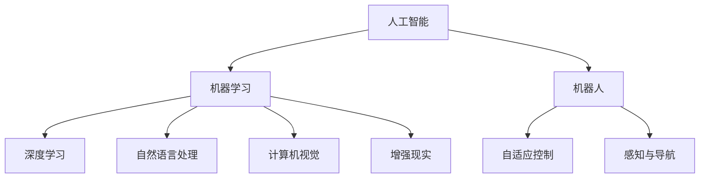

                 

# 李开复：苹果发布AI应用的社会价值

## 1. 背景介绍

李开复，人工智能领域的知名学者和产业领袖，以其开创性的工作在业界留下了深远的影响。近期，李开复就苹果公司发布的AI应用表示，这些技术不仅在商业领域具有重要价值，同时也具有巨大的社会价值。本文将详细分析苹果AI应用的现状及其社会价值，探讨其潜在的未来发展趋势与面临的挑战。

## 2. 核心概念与联系

### 2.1 核心概念概述

- **人工智能（AI）**：指由计算机系统表现出的智能行为，包括学习、推理、感知和自适应等能力。
- **机器学习（ML）**：人工智能的一种实现方式，通过数据训练模型，使其具备预测、分类、聚类等能力。
- **深度学习（DL）**：机器学习的一个子领域，利用多层神经网络进行特征提取和模式识别。
- **自然语言处理（NLP）**：使计算机能理解、处理和生成人类语言的技术。
- **计算机视觉（CV）**：使计算机能从视觉数据中提取有用信息的技术。
- **机器人（Robotics）**：结合机械和计算机技术，使机器人能够执行复杂任务的领域。
- **增强现实（AR）**：将数字信息叠加到现实世界中，增强用户感知体验的技术。

这些概念之间存在紧密的联系。例如，深度学习是机器学习的一部分，自然语言处理和计算机视觉都是AI领域的重要分支，而机器人则将AI技术应用于实体世界中。

### 2.2 核心概念原理和架构的 Mermaid 流程图



## 3. 核心算法原理 & 具体操作步骤

### 3.1 算法原理概述

苹果公司在人工智能领域的应用主要集中在以下几个方面：

- **Siri**：基于深度学习技术，用于语音识别和自然语言处理，用户可以通过语音进行查询和控制设备。
- **Face ID**：使用计算机视觉技术进行面部识别，用于解锁设备、验证身份等。
- **Apple Watch**：结合了机器学习算法，通过分析用户活动数据来优化健康建议。
- **ARKit**：提供增强现实开发框架，使开发者能够构建虚拟对象与现实世界的互动应用。

这些应用的核心算法原理包括：

- **卷积神经网络（CNN）**：用于图像和视频处理，如图像分类、对象检测、人脸识别等。
- **循环神经网络（RNN）**：用于处理序列数据，如自然语言处理中的文本分类、语音识别、机器翻译等。
- **生成对抗网络（GAN）**：用于生成新数据，如图像生成、文本生成等。

### 3.2 算法步骤详解

以苹果的Siri为例，其核心算法步骤包括：

1. **语音识别**：将用户语音转化为文本。
2. **自然语言理解（NLU）**：理解文本的意图和实体。
3. **意图识别**：确定用户的查询意图。
4. **回答生成**：根据意图和上下文生成回答。
5. **语音合成**：将回答转化为语音。

### 3.3 算法优缺点

苹果AI应用的优点包括：

- **用户友好**：通过自然语言处理技术，用户可以以更自然的方式与设备交互。
- **安全性**：面部识别技术提供了一种安全的身份验证方式。
- **个性化**：机器学习算法能够根据用户行为和偏好提供个性化的健康建议和服务。

缺点包括：

- **隐私问题**：收集和使用用户数据可能引发隐私保护方面的担忧。
- **性能限制**：对于一些复杂的任务，算法可能无法达到预期效果。
- **依赖硬件**：许多AI应用需要高性能硬件支持，限制了其普及性。

### 3.4 算法应用领域

苹果AI应用涵盖了多个领域，包括：

- **消费电子**：如Siri、Face ID、Apple Watch等。
- **医疗健康**：如健康监测和个性化健康建议。
- **教育**：如使用AR技术增强学习体验。
- **娱乐**：如使用AI技术优化视频和音乐推荐。

## 4. 数学模型和公式 & 详细讲解 & 举例说明

### 4.1 数学模型构建

以Siri为例，其核心数学模型包括：

- **语音识别模型**：使用声学模型（如HMM、CNN）和语言模型（如RNN）进行文本转换。
- **自然语言理解模型**：使用BERT、GPT等模型进行意图识别和实体抽取。
- **回答生成模型**：使用RNN、Transformer等模型生成自然语言回答。

### 4.2 公式推导过程

以自然语言理解模型为例，其公式推导过程如下：

$$
\begin{aligned}
L(\theta) &= \sum_{i=1}^N \log P(y_i|x_i; \theta) \\
&= \sum_{i=1}^N \log \frac{\exp(z_i)}{\sum_{j=1}^{K} \exp(z_j)} \\
&= \sum_{i=1}^N \left( z_i - \log \sum_{j=1}^{K} \exp(z_j) \right)
\end{aligned}
$$

其中，$L(\theta)$ 是损失函数，$x_i$ 是输入文本，$y_i$ 是对应的标签，$K$ 是类别数，$z_i$ 是模型的预测概率。

### 4.3 案例分析与讲解

以人脸识别为例，其数学模型和推导过程如下：

- **数据准备**：收集大量的人脸图片，并标记每个人对应的标签。
- **模型训练**：使用卷积神经网络（CNN）对图片进行特征提取和分类。
- **性能评估**：使用准确率、召回率等指标评估模型性能。
- **应用场景**：在解锁设备、识别陌生人等方面应用。

## 5. 项目实践：代码实例和详细解释说明

### 5.1 开发环境搭建

要构建和测试苹果的AI应用，首先需要搭建开发环境。以下是一个基本的Python环境配置步骤：

1. **安装Python**：使用Anaconda或Miniconda安装Python，推荐版本为3.8或更高。
2. **安装TensorFlow和Keras**：使用pip安装，以支持深度学习开发。
3. **安装OpenCV**：使用pip安装，支持计算机视觉功能。
4. **配置环境变量**：设置PYTHONPATH，确保所有必要的库和依赖包可被找到。

### 5.2 源代码详细实现

以下是使用Python和TensorFlow实现人脸识别的代码示例：

```python
import tensorflow as tf
import numpy as np
import cv2

# 加载模型
model = tf.keras.models.load_model('face_recognition_model.h5')

# 加载类别标签
labels = ['person1', 'person2', 'person3']

# 加载图像
image = cv2.imread('test_image.jpg')
image = cv2.cvtColor(image, cv2.COLOR_BGR2RGB)
image = cv2.resize(image, (96, 96))

# 预处理图像
image = image / 255.0

# 预测标签
predictions = model.predict(np.expand_dims(image, axis=0))

# 获取标签索引
label_index = np.argmax(predictions[0])

# 输出结果
print('Predicted label:', labels[label_index])
```

### 5.3 代码解读与分析

在上述代码中，我们首先加载了训练好的人脸识别模型，然后加载了类别标签。接着，加载并预处理了待识别图像，最后使用模型进行预测，并输出预测的标签。

### 5.4 运行结果展示

运行上述代码，输出预测的标签。如果模型训练得当，输出的标签应该是最接近待识别人物的人脸标签。

## 6. 实际应用场景

### 6.1 智能家居

苹果的AI技术在智能家居领域有广泛的应用。例如，通过自然语言处理和语音识别技术，用户可以轻松控制家庭设备，如灯光、温度等。

### 6.2 健康医疗

苹果的Apple Watch和健康应用使用机器学习技术，监测用户的心率、步数、睡眠质量等，提供个性化的健康建议。

### 6.3 教育

ARKit和相关应用提供了增强现实的学习工具，如虚拟实验室、互动教材等，提升了学习体验和效果。

### 6.4 未来应用展望

未来的AI应用将更加智能化和普及化，涵盖更多领域和场景。例如，随着5G技术的普及，AI将进一步应用于智能城市、智能交通等领域，提升社会的整体效率和便利性。

## 7. 工具和资源推荐

### 7.1 学习资源推荐

- **机器学习课程**：Coursera、edX等平台提供的机器学习和深度学习课程。
- **AI书籍**：《深度学习》、《动手学深度学习》等。
- **在线文档**：TensorFlow、Keras等框架的官方文档。

### 7.2 开发工具推荐

- **Python IDE**：PyCharm、VSCode等。
- **数据处理工具**：Jupyter Notebook、Pandas等。
- **深度学习框架**：TensorFlow、Keras、PyTorch等。

### 7.3 相关论文推荐

- **人脸识别**：FaceNet: A Unified Embedding for Face Recognition and Clustering（NeurIPS 2015）。
- **自然语言处理**：Attention is All You Need（NeurIPS 2017）。
- **增强现实**：ARKit: a high performance augmented reality platform for iOS（WWDC 2017）。

## 8. 总结：未来发展趋势与挑战

### 8.1 研究成果总结

苹果公司通过在人工智能领域的深入应用，展示了其强大的技术实力和创新能力。其AI应用在用户友好性、安全性、个性化方面表现突出，在多个领域具有重要价值。

### 8.2 未来发展趋势

- **多模态融合**：未来AI应用将更多地融合视觉、语音、文本等多种模态数据，提供更丰富的交互体验。
- **跨领域应用**：AI技术将进一步扩展到更多领域，如医疗、教育、交通等，提升社会整体效率。
- **普及化**：随着技术的成熟和普及，AI将逐渐成为大众生活中的常见工具。

### 8.3 面临的挑战

- **隐私保护**：如何在保障用户体验的同时，保护用户隐私成为一大挑战。
- **模型公平性**：AI模型可能存在偏见，需要采取措施确保公平性和公正性。
- **技术普及**：如何在硬件和算法层面实现更大规模的普及和部署。

### 8.4 研究展望

未来，AI应用需要在隐私保护、公平性、技术普及等方面进行更多探索和研究。通过多方协同合作，共同推动AI技术的发展，才能让更多人受益于这一伟大技术。

## 9. 附录：常见问题与解答

**Q1：苹果的AI应用是否存在隐私问题？**

A: 是的，苹果的AI应用需要收集和处理大量的用户数据，包括语音、面部识别等，这些数据可能引发隐私保护的担忧。苹果公司应采取措施保护用户数据，确保其安全性。

**Q2：如何避免AI模型中的偏见？**

A: 在模型训练过程中，需要收集多样化的数据，确保训练集的代表性。同时，对模型进行公平性评估，确保其在不同群体中的表现一致。

**Q3：AI应用的普及性如何提高？**

A: 通过优化模型算法，降低计算需求，同时提高硬件性能，可以加快AI应用的普及速度。此外，应加强技术教育和推广，让更多人了解和使用AI技术。

**Q4：AI在智能家居中的应用有哪些？**

A: AI在智能家居中的应用包括语音控制、设备联动、环境监测等。通过自然语言处理和语音识别技术，用户可以轻松控制家庭设备，提升生活便利性。

**Q5：AI在健康医疗中的应用有哪些？**

A: AI在健康医疗中的应用包括疾病诊断、健康监测、个性化治疗等。通过机器学习算法，AI可以分析大量健康数据，提供个性化的健康建议和服务。

---

作者：禅与计算机程序设计艺术 / Zen and the Art of Computer Programming

