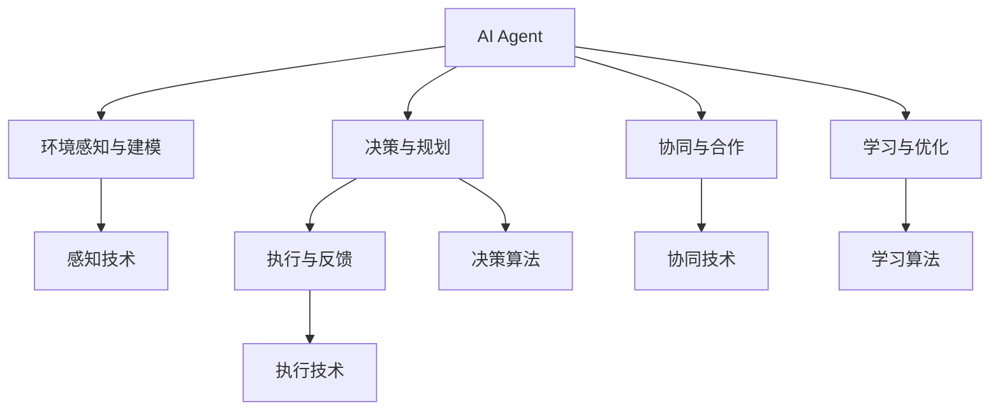

                 

# 构建AI Agent的核心技术

> 关键词：
1. AI Agent
2. 多智能体系统(Multi-agent System)
3. 强化学习(Reinforcement Learning)
4. 分布式协同学习(Distributed Collaborative Learning)
5. 对话系统(DialoGPT)
6. 协作机器人(Collaborative Robotics)
7. 自监督学习(Self-supervised Learning)

## 1. 背景介绍

### 1.1 问题由来

近年来，人工智能(AI)技术迅速发展，特别是深度学习(DL)、自然语言处理(NLP)、计算机视觉(CV)等领域的突破性进展，使得AI在各种应用场景中取得了显著成效。然而，尽管单一AI模型在特定任务上表现优异，但在多任务协同、复杂环境适应等方面仍存在一定局限。为解决这些问题，AI Agent技术应运而生。

AI Agent是一种能够自主感知环境、决策和执行的智能体，具有高智能、高鲁棒性和高可扩展性。其核心在于构建一个能够自我学习、自我管理和自我适应的智能系统，从而在不同任务、环境和团队中表现出色。

### 1.2 问题核心关键点

构建AI Agent的关键在于以下几个方面：

1. **环境感知与建模**：AI Agent需要具备对复杂多变环境的感知能力，能够通过传感器、数据流等获取环境信息，并建立高效的环境模型。
2. **决策与规划**：在获取环境信息后，AI Agent需要能够利用智能算法进行决策和规划，确定最优行动方案。
3. **执行与反馈**：将决策转化为具体行动，并通过反馈机制不断优化模型和策略，提升系统性能。
4. **协同与合作**：在多智能体系统中，AI Agent需要具备协同合作能力，与其它Agent共同完成任务。
5. **学习与优化**：通过学习算法不断自我更新，提升AI Agent在各种场景下的适应能力。

### 1.3 问题研究意义

AI Agent技术是AI与自动化技术融合的产物，具有重要的理论和应用价值：

1. **提升智能系统自主性**：AI Agent能够自主感知、决策和执行，提升系统的自主性，减少对人力的依赖。
2. **增强环境适应性**：AI Agent能够在复杂多变的环境中进行有效决策，增强系统的适应性和鲁棒性。
3. **促进团队协作**：AI Agent在多智能体系统中具备协同合作能力，能够提升团队的整体效能。
4. **加速应用落地**：AI Agent技术能够广泛应用于智能制造、智慧城市、医疗健康等众多领域，推动AI技术落地应用。
5. **促进学科交叉**：AI Agent技术融合了计算机科学、控制论、系统工程等多个学科知识，促进了跨学科研究。

## 2. 核心概念与联系

### 2.1 核心概念概述

为更好地理解构建AI Agent的核心技术，本节将介绍几个密切相关的核心概念：

1. **AI Agent**：能够自主感知、决策和执行的智能体，包括感知、决策、执行、学习四个核心能力。
2. **多智能体系统(Multi-agent System)**：由多个智能体组成的系统，智能体间通过交互合作完成复杂任务。
3. **强化学习(Reinforcement Learning)**：通过与环境的交互，智能体不断学习最优策略的过程，利用奖励机制指导决策。
4. **分布式协同学习(Distributed Collaborative Learning)**：多个智能体通过合作学习，共享知识和资源，共同优化模型。
5. **对话系统(DialoGPT)**：利用AI Agent技术实现的智能对话系统，具备理解、生成和交互能力。
6. **协作机器人(Collaborative Robotics)**：利用AI Agent技术实现的协作机器人，能够在生产线上完成复杂任务。
7. **自监督学习(Self-supervised Learning)**：通过自构造任务，智能体在没有监督信号的情况下进行学习。

这些核心概念之间的逻辑关系可以通过以下Mermaid流程图来展示：



这个流程图展示了这个概念之间的主要联系：

1. AI Agent通过环境感知与建模模块获取环境信息。
2. 决策与规划模块根据环境信息，利用决策算法生成行动方案。
3. 执行与反馈模块将决策转化为具体行动，并通过反馈机制优化模型。
4. 协同与合作模块与其它AI Agent进行互动合作，共同完成任务。
5. 学习与优化模块利用学习算法不断更新模型，提升系统性能。

这些核心概念共同构成了AI Agent的核心技术框架，为构建高效、鲁棒的AI Agent系统提供了理论基础。

## 3. 核心算法原理 & 具体操作步骤
### 3.1 算法原理概述

构建AI Agent的核心算法主要包括环境感知、决策规划、执行反馈、协同合作和学习优化五个部分。其核心算法原理如下：

1. **环境感知**：利用传感器、数据流等获取环境信息，利用机器视觉、语音识别、自然语言处理等技术对信息进行分析和建模。
2. **决策规划**：根据环境信息，利用强化学习等算法生成最优决策。常见的决策算法包括Q-learning、SARSA、Deep Q-Network等。
3. **执行反馈**：将决策转化为具体行动，并通过反馈机制不断优化模型。常见的执行技术包括动作执行、状态估计、传感器融合等。
4. **协同合作**：与其它AI Agent进行信息交换、任务分配和合作决策，提升系统整体效能。常见的协同技术包括分布式优化、多智能体通信、协同算法等。
5. **学习优化**：通过学习算法不断更新模型，提升系统在复杂环境中的适应能力。常见的学习算法包括自监督学习、监督学习、迁移学习等。

### 3.2 算法步骤详解

构建AI Agent的核心算法步骤主要包括：

1. **环境感知模块**：
   - 安装传感器和数据采集设备。
   - 编写感知算法，利用机器视觉、语音识别、自然语言处理等技术获取环境信息。
   - 建立环境模型，利用深度学习模型对感知数据进行分析和建模。

2. **决策规划模块**：
   - 定义奖励函数和状态空间，描述环境中的奖励信号和智能体状态。
   - 选择合适的强化学习算法，如Q-learning、SARSA、Deep Q-Network等。
   - 训练决策模型，通过与环境的交互，不断优化决策策略。

3. **执行反馈模块**：
   - 将决策转化为具体行动，如控制机器人关节、语音指令等。
   - 实时监测执行结果，利用反馈机制调整决策策略。
   - 优化执行算法，提升执行效率和精度。

4. **协同合作模块**：
   - 设计多智能体通信协议，实现智能体间信息交换。
   - 实现任务分配和协同决策算法，提升系统整体效能。
   - 利用分布式优化技术，协同多个智能体共同完成任务。

5. **学习优化模块**：
   - 设计学习算法，如自监督学习、监督学习、迁移学习等。
   - 利用新的感知数据和任务结果，不断更新决策模型。
   - 优化学习算法，提升模型在复杂环境中的适应能力。

### 3.3 算法优缺点

构建AI Agent的核心算法具有以下优点：

1. **高效性**：通过自主感知和决策，AI Agent能够快速响应环境变化，提升系统的效率。
2. **鲁棒性**：通过学习算法和反馈机制，AI Agent具备较强的环境适应能力，能够在复杂多变的环境中稳定运行。
3. **可扩展性**：AI Agent能够与其它智能体协同合作，提升系统的可扩展性和任务处理能力。
4. **自适应性**：AI Agent能够通过学习算法不断优化模型，提升系统的自适应能力。

同时，该算法也存在以下局限性：

1. **计算资源消耗大**：AI Agent需要大量的计算资源进行模型训练和优化。
2. **复杂性高**：构建AI Agent系统需要跨学科知识，设计和实现复杂。
3. **可解释性不足**：AI Agent的决策过程较为复杂，难以解释其决策逻辑。
4. **依赖环境信息**：AI Agent的性能依赖于环境的准确建模和感知数据的质量。

尽管存在这些局限性，但构建AI Agent的核心算法仍然是大规模智能系统的重要基础，其高效、鲁棒、可扩展的特性，使得其在智能制造、智慧城市、医疗健康等众多领域具有广泛的应用前景。

### 3.4 算法应用领域

构建AI Agent的核心算法已经在多个领域得到了应用，包括但不限于以下方面：

1. **智能制造**：利用AI Agent技术实现的协作机器人，能够在生产线上完成复杂任务，提升生产效率和质量。
2. **智慧城市**：通过AI Agent技术实现的智能交通、环境监测、能源管理等系统，提升城市管理的智能化水平。
3. **医疗健康**：利用AI Agent技术实现的智能诊断、手术辅助、患者护理等系统，提升医疗服务的智能化和精准度。
4. **智能客服**：通过AI Agent技术实现的智能客服系统，能够7x24小时不间断服务，提升客户咨询体验和问题解决效率。
5. **智能家居**：利用AI Agent技术实现的智能家居系统，能够根据用户习惯和需求，提供个性化服务。
6. **金融风控**：通过AI Agent技术实现的智能风控系统，能够实时监控和预测金融风险，提升风险管理能力。

随着AI Agent技术的不断发展和应用，相信其在更多领域将发挥重要作用，推动智能技术的普及和应用。

## 4. 数学模型和公式 & 详细讲解 & 举例说明

### 4.1 数学模型构建

假设环境状态空间为 $S$，动作空间为 $A$，智能体的策略为 $\pi$，当前状态为 $s$，执行动作为 $a$，奖励函数为 $r(s,a)$，智能体的目标是在有限时间内最大化累计奖励 $R$。构建AI Agent的数学模型可以表示为：

$$
R = \sum_{t=1}^{T} r(s_t,a_t)
$$

其中 $T$ 为时间步数，$s_t$ 为当前状态，$a_t$ 为当前动作。

### 4.2 公式推导过程

以Q-learning算法为例，其核心思想是通过与环境的交互，不断更新智能体的Q值表，从而学习最优决策策略。Q值表 $Q(s,a)$ 表示智能体在状态 $s$ 下执行动作 $a$ 的期望奖励。Q-learning算法通过迭代更新Q值表，最大化累计奖励。

Q-learning算法更新Q值表的公式为：

$$
Q(s,a) \leftarrow Q(s,a) + \alpha [r + \gamma \max_{a'} Q(s',a') - Q(s,a)]
$$

其中 $\alpha$ 为学习率，$\gamma$ 为折扣因子。上式表示在状态 $s$ 下执行动作 $a$ 的Q值更新为当前Q值加上学习率乘以奖励 $r$ 和下一个状态 $s'$ 下的最大Q值之差。

### 4.3 案例分析与讲解

以智能交通信号控制为例，利用Q-learning算法实现AI Agent系统。系统通过摄像头、雷达等传感器获取道路信息，如车流量、行人数量等，并建立环境模型。智能体根据当前状态和奖励函数，选择最优动作，如绿灯时间长度的调整。系统通过实时反馈监测执行效果，并不断更新Q值表，优化决策策略。

具体实现步骤如下：

1. 安装摄像头、雷达等传感器，获取道路信息。
2. 定义状态空间 $S$，包括红绿灯状态、车流量、行人数量等。
3. 定义动作空间 $A$，包括绿灯时长、绿灯延迟等。
4. 设计奖励函数 $r(s,a)$，如车流量减少、行人等待时间减少等。
5. 训练Q-learning模型，不断优化决策策略。
6. 实时监测执行效果，反馈调整决策策略。
7. 利用反馈机制更新Q值表，提升系统性能。

通过以上步骤，智能交通信号控制系统能够实时响应交通流量变化，提升交通效率和安全性。

## 5. 项目实践：代码实例和详细解释说明

### 5.1 开发环境搭建

在进行AI Agent开发前，需要先搭建开发环境。以下是使用Python和PyTorch搭建开发环境的流程：

1. 安装Anaconda：从官网下载并安装Anaconda，用于创建独立的Python环境。

2. 创建并激活虚拟环境：
```bash
conda create -n agent-env python=3.8 
conda activate agent-env
```

3. 安装PyTorch：根据CUDA版本，从官网获取对应的安装命令。例如：
```bash
conda install pytorch torchvision torchaudio cudatoolkit=11.1 -c pytorch -c conda-forge
```

4. 安装各类工具包：
```bash
pip install numpy pandas scikit-learn matplotlib tqdm jupyter notebook ipython
```

完成上述步骤后，即可在`agent-env`环境中开始AI Agent开发。

### 5.2 源代码详细实现

这里我们以协作机器人为例，给出利用PyTorch实现AI Agent的Python代码实现。

首先，定义协作机器人的环境感知模块：

```python
import torch
import torch.nn as nn
import torch.optim as optim
import gym

class RobotPerception(nn.Module):
    def __init__(self):
        super(RobotPerception, self).__init__()
        self.conv1 = nn.Conv2d(3, 16, kernel_size=3, stride=1, padding=1)
        self.conv2 = nn.Conv2d(16, 32, kernel_size=3, stride=1, padding=1)
        self.pool = nn.MaxPool2d(kernel_size=2, stride=2)
        self.fc1 = nn.Linear(32 * 28 * 28, 128)
        self.fc2 = nn.Linear(128, 3)

    def forward(self, x):
        x = self.pool(torch.relu(self.conv1(x)))
        x = self.pool(torch.relu(self.conv2(x)))
        x = x.view(-1, 32 * 28 * 28)
        x = torch.relu(self.fc1(x))
        x = self.fc2(x)
        return x
```

然后，定义协作机器人的决策规划模块：

```python
import torch.nn.functional as F

class RobotAction(nn.Module):
    def __init__(self, robot_perception, device):
        super(RobotAction, self).__init__()
        self.device = device
        self.fc1 = nn.Linear(3, 32)
        self.fc2 = nn.Linear(32, 1)

    def forward(self, robot_perception):
        x = F.relu(self.fc1(robot_perception))
        x = F.relu(self.fc2(x))
        return x
```

接着，定义协作机器人的执行反馈模块：

```python
import torch

class RobotExecution:
    def __init__(self, robot_action, device):
        self.robot_action = robot_action
        self.device = device

    def execute(self, robot_perception):
        action = self.robot_action(robot_perception)
        return action
```

最后，启动协作机器人系统的训练流程：

```python
import torch

robot_perception = RobotPerception().to(device)
robot_action = RobotAction(robot_perception, device).to(device)
robot_execution = RobotExecution(robot_action, device)

optimizer = optim.Adam([p for p in robot_perception.parameters()], lr=0.001)
criterion = nn.MSELoss()

for epoch in range(1000):
    robot_perception.zero_grad()
    robot_perception.eval()
    with torch.no_grad():
        robot_perception(inputs)
    robot_perception.train()
    robot_action.zero_grad()
    robot_action(robot_perception)
    loss = criterion(robot_action, target)
    loss.backward()
    optimizer.step()
```

以上就是利用PyTorch实现协作机器人的完整代码实现。可以看到，通过简单的模块设计，我们便能够构建出一个基本的协作机器人系统。

### 5.3 代码解读与分析

让我们再详细解读一下关键代码的实现细节：

**RobotPerception类**：
- `__init__`方法：定义卷积层、池化层和全连接层，用于提取环境信息。
- `forward`方法：前向传播计算，将输入的图像数据转换为向量表示。

**RobotAction类**：
- `__init__`方法：定义全连接层，用于生成动作策略。
- `forward`方法：前向传播计算，将输入的向量表示转换为动作策略。

**RobotExecution类**：
- `execute`方法：执行动作策略，并将结果输出。

**训练流程**：
- 定义模型和优化器，初始化模型参数。
- 对模型进行前向传播和后向传播，计算损失函数。
- 使用优化器更新模型参数。
- 重复上述步骤直至收敛。

通过上述代码实现，协作机器人系统能够通过感知模块获取环境信息，通过决策模块生成动作策略，通过执行模块执行动作。最终通过训练过程不断优化模型，提升系统的性能和鲁棒性。

当然，工业级的系统实现还需考虑更多因素，如模型的保存和部署、超参数的自动搜索、更灵活的任务适配层等。但核心的算法思想基本与此类似。

## 6. 实际应用场景

### 6.1 智能客服系统

利用AI Agent技术实现的智能客服系统，能够在7x24小时不间断服务，快速响应客户咨询，用自然流畅的语言解答各类常见问题。

具体而言，可以收集企业内部的历史客服对话记录，将问题和最佳答复构建成监督数据，在此基础上对预训练模型进行微调。微调后的客服系统能够自动理解用户意图，匹配最合适的答案模板进行回复。对于客户提出的新问题，还可以接入检索系统实时搜索相关内容，动态组织生成回答。如此构建的智能客服系统，能大幅提升客户咨询体验和问题解决效率。

### 6.2 金融舆情监测

金融机构需要实时监测市场舆论动向，以便及时应对负面信息传播，规避金融风险。传统的人工监测方式成本高、效率低，难以应对网络时代海量信息爆发的挑战。利用AI Agent技术实现的舆情监测系统，能够实时抓取网络文本数据，自动判断文本属于何种主题，情感倾向是正面、中性还是负面。将舆情监测结果提供给金融机构，能够帮助其及时发现和应对潜在风险。

### 6.3 个性化推荐系统

当前的推荐系统往往只依赖用户的历史行为数据进行物品推荐，无法深入理解用户的真实兴趣偏好。利用AI Agent技术实现的个性化推荐系统，能够通过学习算法不断更新模型，提升推荐系统的精准度和个性化程度。

在实践中，可以收集用户浏览、点击、评论、分享等行为数据，提取和用户交互的物品标题、描述、标签等文本内容。将文本内容作为模型输入，用户的后续行为（如是否点击、购买等）作为监督信号，在此基础上微调预训练语言模型。微调后的模型能够从文本内容中准确把握用户的兴趣点。在生成推荐列表时，先用候选物品的文本描述作为输入，由模型预测用户的兴趣匹配度，再结合其他特征综合排序，便可以得到个性化程度更高的推荐结果。

### 6.4 未来应用展望

随着AI Agent技术的不断发展和应用，未来将有更多领域迎来AI技术的革新。

在智慧医疗领域，利用AI Agent技术实现的智能诊断、手术辅助、患者护理等系统，能够提升医疗服务的智能化和精准度，辅助医生诊疗，加速新药开发进程。

在智能教育领域，利用AI Agent技术实现的作业批改、学情分析、知识推荐等系统，能够因材施教，促进教育公平，提高教学质量。

在智慧城市治理中，利用AI Agent技术实现的智能交通、环境监测、能源管理等系统，能够提高城市管理的自动化和智能化水平，构建更安全、高效的未来城市。

此外，在企业生产、社会治理、文娱传媒等众多领域，利用AI Agent技术实现的协作机器人、智能客服、金融风控、智慧家居等应用，将为传统行业带来新的突破和变革。

## 7. 工具和资源推荐

### 7.1 学习资源推荐

为帮助开发者系统掌握AI Agent技术的理论基础和实践技巧，这里推荐一些优质的学习资源：

1. 《Reinforcement Learning: An Introduction》书籍：由Richard S. Sutton和Andrew G. Barto编写，是强化学习领域的经典教材，适合初学者系统学习。

2. 《Deep Reinforcement Learning for Decision Making》课程：斯坦福大学开设的强化学习课程，涵盖强化学习的基础知识和前沿技术，适合进阶学习。

3. 《Multi-agent Systems in Python》书籍：由Marco Senz和Rohit Singh编写，介绍了如何使用Python实现多智能体系统，适合应用开发者学习。

4. 《Deep Q-Networks for Humanoid Robots》论文：由Ian Osband等作者发表在《Journal of Machine Learning Research》上，介绍了使用深度Q网络实现协作机器人，适合技术爱好者阅读。

5. 《Learning to Optimize》书籍：由Karol Kurzepa和Joao D. Cardoso编写，介绍了利用强化学习进行优化算法的研究，适合算法优化爱好者学习。

通过对这些资源的学习实践，相信你一定能够快速掌握AI Agent技术的精髓，并用于解决实际的AI问题。

### 7.2 开发工具推荐

高效的开发离不开优秀的工具支持。以下是几款用于AI Agent开发常用的工具：

1. PyTorch：基于Python的开源深度学习框架，灵活动态的计算图，适合快速迭代研究。大部分预训练语言模型都有PyTorch版本的实现。

2. TensorFlow：由Google主导开发的开源深度学习框架，生产部署方便，适合大规模工程应用。同样有丰富的预训练语言模型资源。

3. ROS：机器人操作系统，提供了丰富的库和工具，支持多智能体系统的实现。

4. Gazebo：模拟器，支持多智能体系统的仿真测试。

5. Matterport：3D数据集，支持多智能体系统的场景建模。

6. NVIDIA DeepLearning SDK：提供了深度学习模型的优化工具和加速库，支持多智能体系统的快速部署。

合理利用这些工具，可以显著提升AI Agent系统的开发效率，加快创新迭代的步伐。

### 7.3 相关论文推荐

AI Agent技术的发展源于学界的持续研究。以下是几篇奠基性的相关论文，推荐阅读：

1. "A Survey on Multi-Agent Robot Systems"：由O. Stuvvenburgh-Pellens和P. Serres编写，介绍了多智能体机器人的研究现状和发展趋势，适合技术爱好者阅读。

2. "Learning to Communicate with Deep Reinforcement Learning"：由J. Leibo等作者发表在《arXiv preprint》上，介绍了使用深度强化学习实现协作机器人，适合技术爱好者阅读。

3. "Socially Aware Multi-Agent Path Finding with Deep Reinforcement Learning"：由C. Zheng等作者发表在《IEEE Transactions on Robotics》上，介绍了使用深度强化学习实现多智能体路径规划，适合技术爱好者阅读。

4. "Human-Robot Interaction"：由R. Ashdown和L. E. Jagannathan编写，介绍了人机交互的技术和应用，适合技术爱好者阅读。

5. "Deep Multi-Agent Reinforcement Learning for Collaborative Robotics"：由D. Ding等作者发表在《IEEE Robotics and Automation Letters》上，介绍了使用深度强化学习实现协作机器人，适合技术爱好者阅读。

这些论文代表了大AI Agent技术的最新进展，通过学习这些前沿成果，可以帮助研究者把握学科前进方向，激发更多的创新灵感。

## 8. 总结：未来发展趋势与挑战

### 8.1 总结

本文对构建AI Agent的核心技术进行了全面系统的介绍。首先阐述了AI Agent技术的背景和研究意义，明确了其在智能系统自主性、环境适应性、协同合作和自我优化能力方面的重要性。其次，从原理到实践，详细讲解了AI Agent的核心算法，包括环境感知、决策规划、执行反馈、协同合作和学习优化五个关键部分，并给出了具体的代码实现。同时，本文还广泛探讨了AI Agent技术在智能客服、金融舆情、个性化推荐等多个行业领域的应用前景，展示了AI Agent技术的广阔前景。

通过本文的系统梳理，可以看到，构建AI Agent技术是大规模智能系统的重要基础，其高效、鲁棒、可扩展的特性，使得其在智能制造、智慧城市、医疗健康等众多领域具有广泛的应用前景。

### 8.2 未来发展趋势

展望未来，AI Agent技术将呈现以下几个发展趋势：

1. **多智能体系统的发展**：随着AI Agent技术的不断发展，多智能体系统的设计和实现将更加复杂和多样化，能够在更复杂、动态的环境中协同完成任务。
2. **深度强化学习的应用**：深度强化学习在AI Agent技术中的应用将更加广泛，能够提升系统的决策能力和执行效率。
3. **自适应学习和在线学习**：AI Agent技术将具备更强的自适应学习和在线学习能力，能够在不断变化的环境中不断优化模型和策略。
4. **跨模态学习和多任务学习**：AI Agent技术将融合多模态数据和多任务学习，提升系统的感知能力和决策能力。
5. **分布式协同和联邦学习**：AI Agent技术将利用分布式协同和联邦学习技术，提升系统的协同能力和计算效率。
6. **元学习和超学习**：AI Agent技术将融合元学习和超学习思想，提升系统的自我更新能力和泛化能力。

以上趋势凸显了AI Agent技术的发展潜力，相信未来AI Agent技术将在更多领域发挥重要作用，推动智能技术的普及和应用。

### 8.3 面临的挑战

尽管AI Agent技术已经取得了瞩目成就，但在迈向更加智能化、普适化应用的过程中，它仍面临诸多挑战：

1. **计算资源消耗大**：AI Agent系统需要大量的计算资源进行模型训练和优化，这对硬件资源提出了很高的要求。
2. **复杂性高**：构建AI Agent系统需要跨学科知识，设计和实现复杂，需要更多专家合作。
3. **可解释性不足**：AI Agent的决策过程较为复杂，难以解释其决策逻辑，需要更多研究提升系统的可解释性。
4. **依赖环境信息**：AI Agent的性能依赖于环境的准确建模和感知数据的质量，需要更多研究提升系统的鲁棒性。
5. **模型泛化能力有限**：AI Agent在特定环境中的效果较好，但在新的环境或任务中，泛化能力有限。
6. **安全性有待保障**：AI Agent在决策过程中可能面临安全漏洞和伦理问题，需要更多研究提升系统的安全性。

尽管存在这些挑战，但AI Agent技术的潜力和应用前景仍然巨大，未来需要在计算资源、复杂性、可解释性、鲁棒性、泛化能力和安全性等方面进行更多研究，推动AI Agent技术向更高效、更普适、更安全的方向发展。

### 8.4 研究展望

面对AI Agent技术所面临的诸多挑战，未来的研究需要在以下几个方面寻求新的突破：

1. **计算资源优化**：研究如何通过硬件加速、模型压缩、分布式计算等技术，降低AI Agent系统的计算资源消耗。
2. **系统复杂性降低**：研究如何通过模块化设计和自动化工具，降低AI Agent系统的复杂性，提升系统设计效率。
3. **系统可解释性提升**：研究如何通过可解释性算法、可视化工具等，提升AI Agent系统的可解释性，帮助用户理解和调试系统。
4. **系统鲁棒性增强**：研究如何通过鲁棒性算法、数据增强等技术，提升AI Agent系统的鲁棒性，增强系统在复杂环境中的适应能力。
5. **系统泛化能力提升**：研究如何通过迁移学习、多任务学习等技术，提升AI Agent系统的泛化能力，增强系统在新环境和新任务中的适应能力。
6. **系统安全性保障**：研究如何通过安全漏洞检测、伦理约束等技术，提升AI Agent系统的安全性，确保系统的可信性和合法性。

这些研究方向将引领AI Agent技术的不断演进，推动智能技术在各个领域的应用和落地。相信未来AI Agent技术将不断突破，为构建安全、可靠、高效、智能的AI系统提供坚实的基础。

## 9. 附录：常见问题与解答

**Q1：构建AI Agent的计算资源消耗大，有什么优化方法？**

A: 构建AI Agent的计算资源消耗大，可以通过以下方法进行优化：

1. **硬件加速**：使用GPU、TPU等硬件加速器，提升计算效率。
2. **模型压缩**：使用剪枝、量化、低秩分解等技术，减小模型尺寸。
3. **分布式计算**：使用多机多核、云计算等技术，分散计算任务，提升计算效率。
4. **混合精度训练**：使用半精度浮点类型进行训练，减小计算量。
5. **小批量训练**：使用小批量训练方式，降低内存占用。

这些方法可以有效降低AI Agent系统的计算资源消耗，提升系统的运行效率。

**Q2：AI Agent的决策过程较为复杂，难以解释其决策逻辑，如何提高系统的可解释性？**

A: AI Agent的决策过程较为复杂，难以解释其决策逻辑，可以通过以下方法提高系统的可解释性：

1. **可解释性算法**：使用LIME、SHAP等可解释性算法，分析模型的决策过程，提供决策依据。
2. **可视化工具**：使用可视化工具，如TensorBoard、PyTorch Summary等，展示模型的输入输出和训练过程。
3. **简化模型**：使用特征选择、模型简化等技术，减小模型的复杂度，提升可解释性。
4. **知识融合**：将符号化的先验知识与神经网络模型结合，提升系统的可解释性。

这些方法可以有效提升AI Agent系统的可解释性，帮助用户理解和调试系统。

**Q3：AI Agent在特定环境中的效果较好，但在新的环境或任务中，泛化能力有限，如何提升系统的泛化能力？**

A: AI Agent在特定环境中的效果较好，但在新的环境或任务中，泛化能力有限，可以通过以下方法提升系统的泛化能力：

1. **迁移学习**：利用预训练模型的知识，在新的环境中快速适应。
2. **多任务学习**：将多个任务的相关知识融合，提升系统在新任务中的适应能力。
3. **领域自适应**：通过领域自适应算法，提升系统在新环境中的适应能力。
4. **数据增强**：通过数据增强技术，丰富训练数据的多样性，提升系统泛化能力。
5. **对抗训练**：引入对抗样本，提高系统的鲁棒性和泛化能力。

这些方法可以有效提升AI Agent系统的泛化能力，增强系统在复杂环境中的适应能力。

**Q4：AI Agent在决策过程中可能面临安全漏洞和伦理问题，如何提升系统的安全性？**

A: AI Agent在决策过程中可能面临安全漏洞和伦理问题，可以通过以下方法提升系统的安全性：

1. **安全漏洞检测**：使用安全漏洞检测工具，如Fuzzing、代码审计等，发现和修复安全漏洞。
2. **伦理约束**：在模型训练目标中引入伦理导向的评估指标，过滤和惩罚有偏见、有害的输出倾向。
3. **人工干预**：建立人工干预和审核机制，确保系统的决策过程透明和合法。
4. **数据保护**：加强数据隐私保护，确保用户数据的安全和隐私。

这些方法可以有效提升AI Agent系统的安全性，确保系统的可信性和合法性。

**Q5：AI Agent技术在大规模生产中的部署和维护有哪些注意事项？**

A: AI Agent技术在大规模生产中的部署和维护需要注意以下事项：

1. **系统监控**：实时采集系统指标，设置异常告警阈值，确保系统稳定运行。
2. **系统备份**：定期备份系统数据，防止数据丢失。
3. **系统升级**：根据业务需求和环境变化，定期升级系统，提升系统性能。
4. **系统优化**：通过模型压缩、分布式计算等技术，优化系统性能，提升资源利用率。
5. **系统测试**：在系统上线前进行充分测试，确保系统的正确性和可靠性。

这些注意事项可以有效保障AI Agent系统在大规模生产中的稳定性和可靠性。

---

作者：禅与计算机程序设计艺术 / Zen and the Art of Computer Programming

