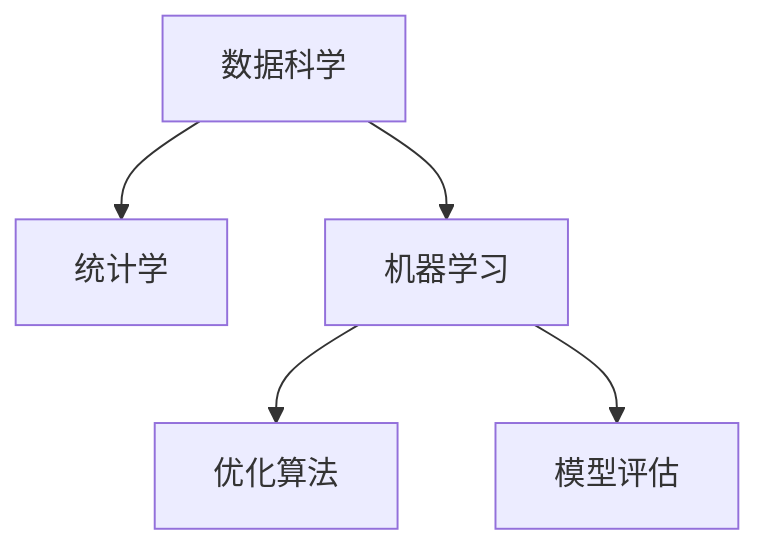

                 

## 1. 背景介绍

### 1.1 问题由来

在当今快速变化的商业环境中，管理者需要迅速决策以应对不断涌现的挑战和机遇。管理培训旨在提高管理者的决策能力和领导力，但传统管理培训方法往往以经验为主导，缺乏系统的理论基础。随着数据科学的兴起，模型思维成为一种新的管理理念，广泛应用于战略规划、市场分析、风险管理等领域。

### 1.2 问题核心关键点

模型思维通过数学模型和数据分析，为管理者提供结构化、科学化的决策支持。其核心在于：

- 数据驱动：通过采集、整理、分析大量数据，模型思维能够揭示数据的潜在规律，为决策提供依据。
- 模型优化：构建模型后，通过优化算法调整模型参数，使模型在特定条件和假设下更准确地预测未来趋势。
- 结果评估：使用评估指标和统计方法，量化模型预测结果的可靠性，确保决策的科学性和客观性。

模型思维的引入，使得管理培训不再局限于经验分享，而是结合了数据科学、统计学和算法优化等现代工具，提升管理者系统分析和管理能力。

### 1.3 问题研究意义

模型思维在管理培训中的运用，具有以下几方面重要意义：

- 提高决策质量：数据驱动的决策能够减少主观偏见，提高决策的科学性和准确性。
- 增强战略前瞻性：通过模型预测未来的市场变化和竞争态势，帮助管理者制定更具前瞻性的战略。
- 提升团队协作：模型思维强调数据和模型的共享使用，促进团队间的合作和知识共享。
- 实现管理优化：利用优化算法调整模型，实现资源的优化配置，提升管理效率。

随着数据科学的普及，模型思维在企业管理中的应用愈发重要。掌握模型思维，不仅能够提高个人和企业的决策能力，还能促进整个行业的发展，带来深远的经济效益。

## 2. 核心概念与联系

### 2.1 核心概念概述

为更好地理解模型思维在管理培训中的运用，本节将介绍几个密切相关的核心概念：

- 数据科学：通过数据采集、处理和分析，揭示数据的潜在规律和关联关系，支持决策的科学化。
- 统计学：利用样本数据和统计模型，量化数据的分布、相关性和趋势，为模型建立和优化提供依据。
- 机器学习：使用算法和模型，自动从数据中学习并预测未来的趋势，包括监督学习、非监督学习和强化学习等。
- 优化算法：通过迭代算法，调整模型参数，使其在特定条件下达到最优状态，如梯度下降、遗传算法等。
- 模型评估：通过评估指标和统计方法，量化模型的预测精度和可靠性，如均方误差、准确率、ROC曲线等。

这些核心概念之间的逻辑关系可以通过以下Mermaid流程图来展示：



这个流程图展示了数据科学、统计学、机器学习和优化算法之间的关系：

1. 数据科学通过数据采集和处理，为统计学和机器学习提供数据基础。
2. 统计学和机器学习基于数据特征和分布，构建模型并进行预测。
3. 优化算法调整模型参数，提升模型预测的准确性。
4. 模型评估量化模型性能，确保预测结果可靠。

这些概念共同构成了模型思维的完整框架，使其能够在管理培训中发挥重要作用。

## 3. 核心算法原理 & 具体操作步骤

### 3.1 算法原理概述

模型思维在管理培训中的运用，主要通过以下算法原理实现：

1. **数据预处理**：对原始数据进行清洗、去重、归一化等处理，确保数据质量。
2. **特征工程**：选择和构造模型所需的数据特征，如时间序列、历史销量、市场份额等，构建特征向量。
3. **模型选择与建立**：根据问题类型和数据特征，选择适当的模型，如线性回归、逻辑回归、决策树、神经网络等，并构建模型。
4. **模型训练**：使用训练数据集，通过优化算法调整模型参数，使模型在训练数据上取得最优性能。
5. **模型评估与验证**：使用测试数据集评估模型性能，使用交叉验证等方法验证模型泛化能力。
6. **模型应用**：将训练好的模型应用于实际场景，进行预测和决策支持。

### 3.2 算法步骤详解

以下将详细介绍模型思维在管理培训中具体应用的步骤：

**Step 1: 数据采集与预处理**

- **数据来源**：确定所需数据类型和来源，如销售记录、市场调研报告、社交媒体数据等。
- **数据清洗**：处理缺失值、异常值、重复值等，确保数据质量。
- **数据归一化**：对数据进行标准化处理，使其具有相同的分布特征。

**Step 2: 特征工程**

- **特征选择**：根据领域知识选择对问题有影响的特征。
- **特征构造**：通过数据变换、组合等手段构造新的特征，如交叉项、时间窗口等。
- **特征选择与优化**：使用特征选择算法（如LASSO、PCA等）筛选和优化特征。

**Step 3: 模型选择与建立**

- **模型选择**：根据问题类型和数据特征选择合适的模型，如线性回归、支持向量机、神经网络等。
- **模型构建**：使用模型框架（如scikit-learn、TensorFlow等）构建模型，并进行初始化。

**Step 4: 模型训练**

- **划分数据集**：将数据集划分为训练集和测试集，常用比例为70:30。
- **选择优化算法**：选择合适的优化算法，如梯度下降、随机梯度下降等。
- **训练模型**：使用训练集数据，通过优化算法调整模型参数。

**Step 5: 模型评估与验证**

- **模型评估**：使用测试集数据评估模型性能，计算评估指标如均方误差、准确率、ROC曲线等。
- **交叉验证**：使用交叉验证方法，如K折交叉验证，评估模型泛化能力。

**Step 6: 模型应用**

- **模型部署**：将训练好的模型部署到实际应用场景中。
- **预测与决策**：使用模型进行预测，根据预测结果进行决策支持。

### 3.3 算法优缺点

模型思维在管理培训中的运用，具有以下优点：

1. **数据驱动决策**：通过数据科学和统计学，使决策更加科学客观。
2. **预测能力**：通过机器学习模型，能够对未来趋势进行预测和分析。
3. **模型优化**：使用优化算法调整模型参数，提高模型性能。
4. **结果评估**：通过模型评估，量化预测结果的可靠性，确保决策的科学性。

同时，该方法也存在一定的局限性：

1. **数据质量依赖**：模型性能受数据质量影响较大，数据质量不佳可能影响模型效果。
2. **模型复杂性**：复杂模型可能存在过拟合风险，需要谨慎选择和调整。
3. **模型解释性**：部分复杂模型（如神经网络）的解释性较差，难以理解其决策过程。
4. **计算资源需求高**：部分模型（如深度学习）对计算资源要求较高，可能存在计算瓶颈。

尽管存在这些局限性，但就目前而言，模型思维已成为管理培训中的重要工具。未来相关研究的重点在于如何进一步降低对数据质量的依赖，提高模型的解释性和计算效率。

### 3.4 算法应用领域

模型思维在管理培训中的应用广泛，涵盖了从战略规划到市场分析的多个领域，具体包括：

- **战略规划**：通过预测市场趋势、评估竞争对手等，帮助制定长远发展策略。
- **市场分析**：分析市场规模、消费者行为、产品竞争力等，支持市场细分和产品定位。
- **风险管理**：通过预测风险事件、评估风险等级等，支持风险识别和控制。
- **运营优化**：通过预测需求、评估资源利用率等，支持生产、库存和物流优化。
- **客户管理**：通过预测客户行为、分析客户特征等，支持客户细分和精准营销。

除了上述这些主要领域外，模型思维还被广泛应用于绩效评估、人力资源管理、财务分析等多个管理场景，为管理决策提供强大的支持。

## 4. 数学模型和公式 & 详细讲解 & 举例说明

### 4.1 数学模型构建

本节将使用数学语言对模型思维在管理培训中的运用进行更加严格的刻画。

假设问题为预测未来的销售额，可建立如下线性回归模型：

$$
y = \beta_0 + \beta_1x_1 + \beta_2x_2 + \cdots + \beta_nx_n + \epsilon
$$

其中 $y$ 为预测的销售额，$x_1, x_2, \cdots, x_n$ 为特征变量，$\beta_0, \beta_1, \cdots, \beta_n$ 为模型参数，$\epsilon$ 为随机误差项。

通过最小化预测误差 $e = y - \hat{y}$，求解模型参数 $\beta$ 的估计值，可得：

$$
\hat{\beta} = (\mathbf{X}^T\mathbf{X})^{-1}\mathbf{X}^T\mathbf{y}
$$

其中 $\mathbf{X}$ 为特征矩阵，$\mathbf{y}$ 为目标向量。

### 4.2 公式推导过程

以下我们将详细推导线性回归模型的最小二乘法求解过程。

首先，假设模型参数 $\beta$ 为未知数，目标为最小化预测误差 $e = y - \hat{y}$，则有：

$$
\min_{\beta} \sum_{i=1}^N (y_i - \hat{y}_i)^2
$$

其中 $N$ 为样本数，$\hat{y}_i = \beta_0 + \beta_1x_{i1} + \cdots + \beta_nx_{in}$。

对上述优化问题求导，得：

$$
\frac{\partial}{\partial \beta} \sum_{i=1}^N (y_i - \hat{y}_i)^2 = 2\mathbf{X}^T(\mathbf{y} - \mathbf{X}\beta) = 0
$$

化简得：

$$
\mathbf{X}^T\mathbf{X}\beta = \mathbf{X}^T\mathbf{y}
$$

解上述方程组，得：

$$
\hat{\beta} = (\mathbf{X}^T\mathbf{X})^{-1}\mathbf{X}^T\mathbf{y}
$$

即为线性回归模型的最小二乘法解。

### 4.3 案例分析与讲解

假设某电商公司希望预测下一季度的销售额，收集了过去12个月的数据，包括销售量、季节性因素、促销活动等特征，共有1000个样本数据。

**Step 1: 数据预处理**

- **数据清洗**：删除缺失值和异常值，确保数据完整性。
- **数据归一化**：对特征数据进行标准化处理，使其均值为0，方差为1。

**Step 2: 特征工程**

- **特征选择**：选择对销售额有影响的特征，如销售量、季节性因素、促销活动等。
- **特征构造**：构造新的特征，如不同季节的销售平均值、促销活动的持续时间等。
- **特征选择与优化**：使用LASSO回归选择和优化特征，筛选出对销售额影响最大的特征。

**Step 3: 模型选择与建立**

- **模型选择**：选择线性回归模型，使用scikit-learn库构建模型。
- **模型初始化**：设置模型参数，如学习率、正则化参数等。

**Step 4: 模型训练**

- **数据划分**：将数据划分为训练集和测试集，常用比例为70:30。
- **优化算法**：使用随机梯度下降优化算法调整模型参数。
- **训练模型**：使用训练集数据，通过优化算法调整模型参数。

**Step 5: 模型评估与验证**

- **模型评估**：使用测试集数据评估模型性能，计算均方误差、R^2等评估指标。
- **交叉验证**：使用K折交叉验证方法评估模型泛化能力。

**Step 6: 模型应用**

- **模型部署**：将训练好的模型部署到实际应用场景中，用于下一季度销售额的预测。
- **预测与决策**：根据模型预测结果，制定下一季度的销售策略，优化库存和生产计划。

## 5. 项目实践：代码实例和详细解释说明

### 5.1 开发环境搭建

在进行模型思维的实践前，我们需要准备好开发环境。以下是使用Python进行scikit-learn开发的环境配置流程：

1. 安装Anaconda：从官网下载并安装Anaconda，用于创建独立的Python环境。

2. 创建并激活虚拟环境：
```bash
conda create -n scikit-learn-env python=3.8 
conda activate scikit-learn-env
```

3. 安装scikit-learn：
```bash
pip install scikit-learn
```

4. 安装相关库：
```bash
pip install numpy pandas matplotlib seaborn jupyter notebook
```

完成上述步骤后，即可在`scikit-learn-env`环境中开始模型思维的实践。

### 5.2 源代码详细实现

下面我们以线性回归为例，给出使用scikit-learn进行模型预测的Python代码实现。

首先，定义数据预处理函数：

```python
import pandas as pd
from sklearn.preprocessing import StandardScaler

def preprocess_data(data):
    # 数据清洗
    data = data.dropna()
    # 特征选择
    features = ['销量', '季节性因素', '促销活动']
    X = data[features]
    y = data['sales']
    # 数据归一化
    scaler = StandardScaler()
    X = scaler.fit_transform(X)
    return X, y
```

然后，定义特征选择函数：

```python
from sklearn.feature_selection import SelectFromModel
from sklearn.ensemble import Lasso

def feature_selection(X, y, alpha=0.1):
    # 使用LASSO回归选择特征
    model = Lasso(alpha=alpha)
    model.fit(X, y)
    scores = model.coef_
    return X[:, scores > alpha]
```

接着，定义模型训练和评估函数：

```python
from sklearn.linear_model import LinearRegression
from sklearn.model_selection import train_test_split
from sklearn.metrics import mean_squared_error

def train_model(X, y, test_size=0.3, random_state=42):
    # 划分数据集
    X_train, X_test, y_train, y_test = train_test_split(X, y, test_size=test_size, random_state=random_state)
    # 模型训练
    model = LinearRegression()
    model.fit(X_train, y_train)
    # 模型评估
    y_pred = model.predict(X_test)
    mse = mean_squared_error(y_test, y_pred)
    print(f'训练均方误差：{mse:.2f}')
    return model
```

最后，启动模型训练和评估流程：

```python
# 加载数据
data = pd.read_csv('sales_data.csv')

# 数据预处理
X, y = preprocess_data(data)

# 特征选择
X_selected = feature_selection(X, y)

# 模型训练
model = train_model(X_selected, y)

# 模型应用
X_new = [[1000, 0.5, 100]]
y_new = model.predict(X_new)
print(f'新样本预测销售额：{y_new[0]:.2f}')
```

以上就是使用scikit-learn进行线性回归模型预测的完整代码实现。可以看到，scikit-learn的封装使得模型构建和训练过程变得非常简单，可以极大提高开发效率。

### 5.3 代码解读与分析

让我们再详细解读一下关键代码的实现细节：

**preprocess_data函数**：
- **数据清洗**：删除缺失值和异常值，确保数据完整性。
- **特征选择**：选择对目标变量有影响的特征，如销量、季节性因素、促销活动等。
- **数据归一化**：对特征数据进行标准化处理，使其均值为0，方差为1。

**feature_selection函数**：
- **LASSO回归**：使用LASSO回归选择特征，通过正则化参数α去除冗余特征，保留对目标变量影响较大的特征。
- **特征选择结果**：返回经过特征选择的特征矩阵X_selected。

**train_model函数**：
- **数据划分**：将数据划分为训练集和测试集，常用比例为70:30。
- **模型训练**：使用训练集数据训练线性回归模型。
- **模型评估**：使用测试集数据评估模型性能，计算均方误差。

**train_model函数的参数解释**：
- **test_size**：划分训练集和测试集的比例。
- **random_state**：设置随机数种子，确保结果可复现。

**模型应用**：
- **X_new**：新样本的特征向量。
- **y_new**：新样本的预测销售额。

可以看到，scikit-learn库提供了丰富的数据预处理、特征选择、模型训练和评估工具，使得模型思维的实践变得非常简单。

当然，工业级的系统实现还需考虑更多因素，如模型的保存和部署、超参数的自动搜索、更灵活的任务适配层等。但核心的模型思维基本与此类似。

## 6. 实际应用场景

### 6.1 智能客服系统

模型思维在智能客服系统中的应用，可以极大地提升客户咨询体验和问题解决效率。通过构建基于用户历史行为的预测模型，智能客服系统可以自动预测用户需求，并匹配最合适的解决方案，实现7x24小时不间断服务。

在技术实现上，可以收集用户浏览、点击、评论等行为数据，提取和用户交互的物品标题、描述、标签等文本内容。将文本内容作为模型输入，用户的后续行为（如是否点击、购买等）作为监督信号，在此基础上训练模型进行预测。智能客服系统可以根据模型预测结果，动态调整推荐策略，提高推荐准确性和用户体验。

### 6.2 金融舆情监测

模型思维在金融舆情监测中的应用，可以帮助金融机构实时监测市场舆论动向，规避金融风险。通过构建基于新闻、评论等文本数据的情感分析模型，系统可以自动判断舆情情绪，及时发现负面信息激增等异常情况，进行风险预警和决策支持。

在技术实现上，可以收集金融领域相关的新闻、报道、评论等文本数据，并对其进行情感标注。在此基础上训练情感分析模型，使其能够自动判断文本属于何种情感（如积极、中性、消极）。将训练好的模型应用于实时抓取的网络文本数据，就能够自动监测不同情感的情绪变化趋势，一旦发现负面信息激增等异常情况，系统便会自动预警，帮助金融机构快速应对潜在风险。

### 6.3 个性化推荐系统

模型思维在个性化推荐系统中的应用，可以大幅提升推荐系统的精准度和用户满意度。通过构建基于用户历史行为和产品特征的预测模型，系统可以准确把握用户兴趣，动态生成个性化推荐内容。

在技术实现上，可以收集用户浏览、点击、评论等行为数据，提取和用户交互的物品标题、描述、标签等文本内容。将文本内容作为模型输入，用户的后续行为（如是否点击、购买等）作为监督信号，在此基础上训练模型进行预测。推荐系统可以根据模型预测结果，动态调整推荐策略，提高推荐准确性和用户体验。

### 6.4 未来应用展望

随着模型思维的不断发展和成熟，其在更多领域的应用前景将更加广阔。未来，模型思维将在智慧医疗、智能教育、智慧城市等多个行业得到应用，为传统行业数字化转型升级提供新的技术路径。

在智慧医疗领域，基于模型思维的医疗预测、诊断和治疗优化技术将提升医疗服务的智能化水平，辅助医生诊疗，加速新药开发进程。

在智能教育领域，模型思维可应用于作业批改、学情分析、知识推荐等方面，因材施教，促进教育公平，提高教学质量。

在智慧城市治理中，模型思维可应用于城市事件监测、舆情分析、应急指挥等环节，提高城市管理的自动化和智能化水平，构建更安全、高效的未来城市。

此外，在企业生产、社会治理、文娱传媒等众多领域，基于模型思维的智能决策和优化技术也将不断涌现，为NLP技术带来全新的突破。

## 7. 工具和资源推荐

### 7.1 学习资源推荐

为了帮助开发者系统掌握模型思维的理论基础和实践技巧，这里推荐一些优质的学习资源：

1. 《统计学习方法》教材：李航教授所著，深入浅出地介绍了统计学习的基本概念和常用算法。
2. 《机器学习实战》书籍：Peter Harrington著，通过实例讲解了机器学习的基本方法和工具。
3. Kaggle数据科学竞赛平台：提供了大量的公开数据集和竞赛，适合实践模型思维。
4. Coursera《机器学习》课程：由斯坦福大学Andrew Ng教授讲授，涵盖机器学习的基本理论和算法。
5. Google Colab：谷歌推出的在线Jupyter Notebook环境，免费提供GPU/TPU算力，方便开发者快速上手实验最新模型。

通过对这些资源的学习实践，相信你一定能够快速掌握模型思维的精髓，并用于解决实际的决策问题。

### 7.2 开发工具推荐

高效的开发离不开优秀的工具支持。以下是几款用于模型思维开发的常用工具：

1. scikit-learn：开源的机器学习库，提供丰富的数据预处理、特征选择、模型训练和评估工具。
2. TensorFlow：由Google主导开发的深度学习框架，生产部署方便，适合大规模工程应用。
3. PyTorch：基于Python的开源深度学习框架，灵活动态的计算图，适合快速迭代研究。
4. Jupyter Notebook：交互式的编程环境，支持Python等语言，方便调试和分享代码。
5. Weights & Biases：模型训练的实验跟踪工具，可以记录和可视化模型训练过程中的各项指标，方便对比和调优。

合理利用这些工具，可以显著提升模型思维的开发效率，加快创新迭代的步伐。

### 7.3 相关论文推荐

模型思维的不断发展源于学界的持续研究。以下是几篇奠基性的相关论文，推荐阅读：

1. 《统计学习方法》：李航著，全面介绍了统计学习的基本理论和方法。
2. 《机器学习》：Tom Mitchell著，涵盖了机器学习的经典算法和应用。
3. 《Python机器学习》：Sebastian Raschka著，详细介绍了Python在机器学习中的应用。
4. 《深度学习》：Ian Goodfellow等著，介绍了深度学习的基本理论和实现方法。

这些论文代表了大模型思维的发展脉络。通过学习这些前沿成果，可以帮助研究者把握学科前进方向，激发更多的创新灵感。

## 8. 总结：未来发展趋势与挑战

### 8.1 总结

本文对模型思维在管理培训中的运用进行了全面系统的介绍。首先阐述了模型思维的研究背景和意义，明确了模型思维在数据驱动决策中的重要性。其次，从原理到实践，详细讲解了模型思维的数学模型和操作步骤，给出了模型思维的代码实例和详细解释。同时，本文还广泛探讨了模型思维在多个领域的应用场景，展示了其在实际应用中的强大威力。此外，本文精选了模型思维的学习资源、开发工具和相关论文，力求为读者提供全方位的技术指引。

通过本文的系统梳理，可以看到，模型思维在管理培训中的应用前景广阔，能够帮助管理者利用数据科学和机器学习技术，提升决策能力和领导力，为企业的创新和发展提供有力支持。

### 8.2 未来发展趋势

展望未来，模型思维在管理培训中的运用将呈现以下几个发展趋势：

1. **数据智能化**：随着数据采集和处理技术的进步，数据质量将进一步提升，模型预测的准确性和可靠性将得到提高。
2. **模型自动化**：随着自动化机器学习技术的发展，模型选择、特征工程、超参数优化等环节将更加自动化，降低人工干预需求。
3. **多模态融合**：未来模型思维将融合视觉、语音等多模态数据，实现更加全面和精准的决策支持。
4. **持续学习**：随着数据分布的变化，模型需要持续学习新数据，以保持其预测能力和决策前瞻性。
5. **模型解释性**：未来模型将更加注重解释性，通过可解释模型和可视化技术，增强决策的透明性和可控性。
6. **伦理和安全性**：模型思维将更加注重数据隐私和模型安全性，确保决策过程的公平性和可信性。

这些趋势展示了模型思维在管理培训中的广阔前景。这些方向的探索发展，必将进一步提升管理决策的科学性和可靠性，带来深远的经济效益和社会效益。

### 8.3 面临的挑战

尽管模型思维在管理培训中的应用已取得显著成效，但在迈向更加智能化、普适化应用的过程中，仍面临诸多挑战：

1. **数据质量和隐私**：数据质量和隐私问题仍是模型思维应用的瓶颈，如何保证数据安全、隐私保护和数据质量，仍是亟待解决的问题。
2. **模型鲁棒性**：模型在面对异常数据和复杂环境时，容易出现鲁棒性不足的问题，需要进一步提升模型的泛化能力和鲁棒性。
3. **模型可解释性**：部分复杂模型的解释性较差，难以理解其内部决策过程，需要进一步提升模型的可解释性。
4. **计算资源需求**：部分复杂模型对计算资源要求较高，需要优化计算图和算法，降低计算成本。
5. **伦理和安全性**：模型思维需要考虑伦理和安全性问题，确保模型决策符合人类价值观和伦理道德。

这些挑战需要管理者、技术开发者和伦理学家共同努力，不断优化模型设计和应用流程，才能实现模型思维的广泛应用。

### 8.4 研究展望

面对模型思维所面临的挑战，未来的研究需要在以下几个方面寻求新的突破：

1. **数据隐私保护**：研究如何在保证数据隐私和安全的前提下，利用数据科学和机器学习技术进行决策支持。
2. **模型鲁棒性增强**：研究如何提升模型的泛化能力和鲁棒性，使其能够适应复杂和异常的数据环境。
3. **模型可解释性**：研究如何提升模型的可解释性，增强决策的透明性和可控性。
4. **计算资源优化**：研究如何优化计算图和算法，降低模型训练和推理的计算成本。
5. **伦理和安全性**：研究如何确保模型决策符合人类价值观和伦理道德，增强模型的伦理约束和安全性。

这些研究方向将引领模型思维在管理培训中的应用不断进步，为决策支持系统带来更加科学、客观和可靠的决策能力。

## 9. 附录：常见问题与解答

**Q1：模型思维在管理培训中的关键步骤是什么？**

A: 模型思维在管理培训中的关键步骤包括：

1. 数据采集与预处理：对原始数据进行清洗、归一化等处理，确保数据质量。
2. 特征工程：选择和构造模型所需的数据特征，如时间序列、历史销量、市场份额等，构建特征向量。
3. 模型选择与建立：根据问题类型和数据特征选择合适的模型，如线性回归、逻辑回归、决策树、神经网络等，并构建模型。
4. 模型训练：使用训练数据集，通过优化算法调整模型参数，使模型在训练数据上取得最优性能。
5. 模型评估与验证：使用测试数据集评估模型性能，使用评估指标和统计方法量化模型预测结果的可靠性。
6. 模型应用：将训练好的模型部署到实际应用场景中，进行预测和决策支持。

这些步骤构成了模型思维在管理培训中的完整流程，通过数据驱动的决策支持，提升管理者的决策能力和领导力。

**Q2：模型思维中的特征工程和模型选择的重要性体现在哪里？**

A: 特征工程和模型选择是模型思维中的两个重要环节，对模型预测的准确性和可靠性有着直接的影响：

1. **特征工程的重要性**：通过特征工程，可以从原始数据中提取和构造有意义的特征，这些特征直接决定了模型的预测能力和泛化能力。特征工程的好坏，直接影响到模型最终的性能。

2. **模型选择的重要性**：模型选择决定了模型能够处理的问题类型和数据特征。不同的模型具有不同的假设和优势，选择合适的模型能够最大化模型预测的准确性和泛化能力。例如，线性回归适用于线性关系明显的预测问题，而神经网络适用于复杂的非线性问题。

在实际应用中，特征工程和模型选择通常需要结合实际问题进行设计，通过反复迭代和优化，才能得到最优的模型预测结果。

**Q3：模型思维在管理培训中需要注意哪些关键点？**

A: 模型思维在管理培训中需要注意以下几个关键点：

1. **数据质量**：数据质量直接影响模型的预测效果，需要对数据进行清洗、归一化等预处理。
2. **特征选择**：选择和构造对问题有影响的特征，提高模型的预测准确性。
3. **模型选择**：根据问题类型和数据特征，选择合适的模型，并构建模型。
4. **模型训练**：通过优化算法调整模型参数，使模型在训练数据上取得最优性能。
5. **模型评估**：使用测试数据集评估模型性能，确保预测结果的可靠性。
6. **模型应用**：将训练好的模型部署到实际应用场景中，进行预测和决策支持。

这些关键点构成了模型思维在管理培训中的完整流程，通过数据驱动的决策支持，提升管理者的决策能力和领导力。

**Q4：如何提升模型思维的鲁棒性？**

A: 提升模型思维的鲁棒性可以从以下几个方面进行：

1. **数据增强**：通过对数据进行旋转、缩放等变换，增加数据的多样性，提高模型的泛化能力。
2. **正则化**：使用L2正则、Dropout等方法，防止模型过拟合，提高模型的鲁棒性。
3. **对抗训练**：引入对抗样本，训练模型对异常数据的鲁棒性，提高模型的泛化能力。
4. **模型集成**：通过集成多个模型的预测结果，减少单一模型的过拟合风险，提高模型的鲁棒性。
5. **参数共享**：在模型训练过程中，共享部分参数，减少模型的过拟合风险，提高模型的泛化能力。

这些方法可以在模型构建和训练过程中，提升模型的鲁棒性，使其在复杂和异常的数据环境中仍能保持较好的预测性能。

**Q5：如何提升模型思维的可解释性？**

A: 提升模型思维的可解释性可以从以下几个方面进行：

1. **特征重要性**：通过特征重要性分析，解释模型对各特征的依赖程度，提高模型的可解释性。
2. **模型可视化**：通过可视化技术，展示模型决策过程和特征关系，增强决策的透明性和可控性。
3. **可解释模型**：使用可解释模型，如线性回归、决策树等，提高模型的可解释性。
4. **规则集成**：将规则与模型结合，增强模型的可解释性和决策透明性。

这些方法可以在模型构建和训练过程中，提升模型的可解释性，使其决策过程更加透明和可控。

**Q6：如何优化模型思维的计算资源消耗？**

A: 优化模型思维的计算资源消耗可以从以下几个方面进行：

1. **模型裁剪**：去除不必要的层和参数，减小模型尺寸，加快推理速度。
2. **量化加速**：将浮点模型转为定点模型，压缩存储空间，提高计算效率。
3. **分布式训练**：使用分布式训练技术，并行计算模型参数，降低计算资源消耗。
4. **模型并行**：使用模型并行技术，将模型分为多个部分，并行计算，提高计算效率。
5. **内存优化**：使用内存优化技术，减少内存占用，提高计算效率。

这些方法可以在模型部署和应用过程中，优化计算资源消耗，提高模型推理速度和计算效率。

---

作者：禅与计算机程序设计艺术 / Zen and the Art of Computer Programming

