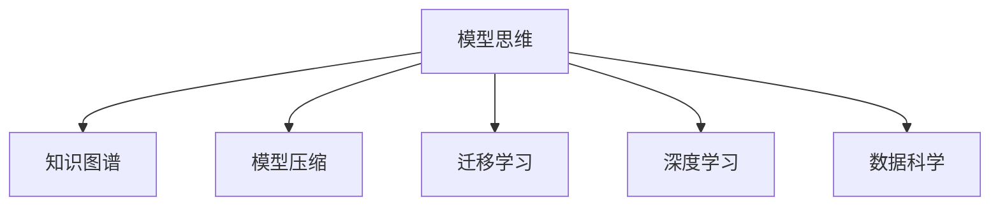

                 

# 模型思维的应用:快速掌握新知识

> 关键词：模型思维,知识图谱,模型压缩,迁移学习,深度学习,人工智能,数据科学

## 1. 背景介绍

### 1.1 问题由来

在现代信息技术迅猛发展的背景下，模型思维作为一种重要的创新思维方法，已经在各行业各领域得到广泛应用。模型思维，即基于模型的思考方式，指通过构建抽象的数学模型或数据模型，以逻辑推理和计算分析的方式，对复杂问题进行建模和解决。模型思维在科学研究、工程设计、社会管理等领域发挥了重要作用，成为推动人类进步的重要驱动力。

然而，尽管模型思维具有广泛的应用价值，但其复杂性和技术门槛却成为人们快速掌握新知识、应用新模型的一大障碍。特别是对于非专业背景的读者，如何在有限的时间内，高效、准确地理解和应用模型思维，仍是一个值得深入探讨的问题。

### 1.2 问题核心关键点

模型思维的核心关键点主要包括以下几个方面：

- **模型构建**：选择和设计合适的数学模型或数据模型，进行问题建模。
- **模型求解**：通过数学计算或数据分析，求解模型参数或状态，实现模型优化。
- **模型应用**：将模型应用于实际问题，通过仿真实验或预测分析，获得决策支持。
- **模型评估**：评估模型效果和精度，进行模型优化和迭代改进。

本文将从模型构建、模型求解、模型应用和模型评估等角度，深入探讨模型思维的原理和应用，帮助读者快速掌握新知识，提升模型思维能力。

## 2. 核心概念与联系

### 2.1 核心概念概述

为更好地理解模型思维的应用，本节将介绍几个密切相关的核心概念：

- **模型思维**：基于数学模型或数据模型，通过逻辑推理和计算分析，解决实际问题的思维方式。
- **知识图谱**：一种以图为形式的知识表达方式，通过节点和边，描述实体、属性、关系等知识元素及其关联关系。
- **模型压缩**：通过剪枝、量化、蒸馏等方法，减小模型规模，提升模型效率和可部署性。
- **迁移学习**：指将一个领域学习到的知识，迁移应用到另一个不同但相关的领域，以提高在新领域上的学习效率和性能。
- **深度学习**：一种基于多层神经网络的机器学习范式，通过逐层抽象提取特征，实现复杂非线性关系的建模。
- **数据科学**：通过数据收集、处理、分析和建模，从数据中提取知识，解决实际问题的科学。

这些核心概念之间的逻辑关系可以通过以下Mermaid流程图来展示：



这个流程图展示了几大核心概念之间的关联关系：

1. 模型思维是构建和应用知识图谱、进行模型压缩、迁移学习、深度学习和数据科学的基础。
2. 知识图谱提供模型思维所需的实体、属性、关系等知识表示。
3. 模型压缩、迁移学习和深度学习，都是模型思维在具体技术实现层面的体现。
4. 数据科学则提供了模型思维所需的数据处理和建模工具。

## 3. 核心算法原理 & 具体操作步骤
### 3.1 算法原理概述

模型思维的实现，通常分为模型构建、模型求解、模型应用和模型评估等步骤。其核心思想是通过抽象的数学模型或数据模型，描述和解决实际问题。

在实际应用中，常见的模型思维方法包括：

- **统计模型**：通过统计数据，建立概率分布模型，进行预测和决策。
- **优化模型**：通过求解最优化问题，优化系统性能或资源配置。
- **仿真模型**：通过建立物理或数学仿真模型，进行实验分析和性能评估。
- **深度学习模型**：通过多层神经网络，对复杂非线性关系进行建模和预测。
- **知识图谱模型**：通过构建知识图谱，描述和推理实体之间的关系，进行智能决策。

模型思维的核心算法原理，主要包括以下几个方面：

- **数学建模**：通过数学符号和公式，抽象描述现实问题，建立数学模型。
- **算法求解**：通过优化算法、迭代算法、统计算法等，求解数学模型中的参数或状态。
- **仿真实验**：通过仿真实例和虚拟实验，验证和测试数学模型的效果。
- **数据分析**：通过数据收集和处理，提取和分析模型所需的数据特征。

### 3.2 算法步骤详解

模型思维的实现过程，通常包括以下几个关键步骤：

**Step 1: 问题建模**
- 定义问题：明确问题描述和需求，确定需要解决的关键目标。
- 选择模型：根据问题的特点，选择合适的数学模型或数据模型，如线性回归、决策树、深度神经网络等。
- 构建模型：通过数学符号和公式，详细描述模型结构和参数。

**Step 2: 模型求解**
- 设置目标函数：明确模型求解的目标，如最小化误差、最大化效益等。
- 求解参数：通过优化算法，求解模型参数或状态，如梯度下降、遗传算法、模拟退火等。
- 验证模型：通过仿真实验或实际数据，验证模型效果，确保模型的准确性和鲁棒性。

**Step 3: 模型应用**
- 数据预处理：对原始数据进行清洗、归一化、特征工程等预处理操作。
- 模型部署：将模型封装为API或服务接口，方便集成调用。
- 模型应用：通过API或服务接口，将模型应用于实际问题，进行预测、推理、决策等操作。

**Step 4: 模型评估**
- 评估指标：选择和设定模型评估的指标，如均方误差、准确率、召回率等。
- 数据集划分：将数据集划分为训练集、验证集和测试集，进行模型训练和测试。
- 模型优化：根据评估结果，进行模型优化和迭代改进，如调整超参数、引入新特征等。

以上是模型思维实现的一般流程。在实际应用中，还需要根据具体问题进行优化设计，如改进模型求解算法、优化数据预处理流程、引入高级特征工程等，以进一步提升模型效果。

### 3.3 算法优缺点

模型思维作为一种问题解决方法，具有以下优点：

- 系统性：通过建立数学模型，系统地描述和解决问题，逻辑清晰、有条理。
- 可验证性：模型求解过程可以通过算法验证和仿真实验，确保结果的准确性和可靠性。
- 灵活性：模型思维可以应用于多种问题领域，如统计、优化、仿真、深度学习等。

同时，模型思维也存在一些局限性：

- 技术门槛高：建模和求解过程涉及较多数学和算法知识，对专业背景要求较高。
- 模型复杂度高：复杂模型可能存在过拟合、泛化能力差等问题，需要精心设计和优化。
- 数据依赖强：模型效果依赖于高质量的数据输入，数据收集和处理成本较高。
- 实时性差：模型求解和推理过程通常需要较长的计算时间，实时性较弱。

尽管存在这些局限性，但就目前而言，模型思维仍然是解决复杂问题的重要工具，在科学研究、工程设计、社会管理等领域发挥了重要作用。

### 3.4 算法应用领域

模型思维作为一种通用的问题解决方法，广泛应用于以下领域：

- **科学研究**：通过统计模型、优化模型、仿真模型等，研究自然规律和现象，进行预测和决策。
- **工程设计**：通过优化模型、仿真模型等，优化系统性能和资源配置，进行设计和验证。
- **社会管理**：通过统计模型、仿真模型等，进行社会治理和政策评估，优化社会管理策略。
- **医疗卫生**：通过数据模型、深度学习模型等，进行疾病诊断和治疗方案优化，提高医疗服务质量。
- **金融投资**：通过统计模型、优化模型等，进行市场分析和风险预测，优化投资决策。
- **城市规划**：通过仿真模型、优化模型等，进行城市设计和资源配置，提升城市管理水平。

除了上述这些经典应用外，模型思维还被创新性地应用到更多场景中，如智能推荐、智能客服、智能制造等，为各行各业带来新的突破。随着模型思维的不断演进，相信将在更广阔的应用领域发挥更大的作用。

## 4. 数学模型和公式 & 详细讲解  
### 4.1 数学模型构建

本节将使用数学语言对模型思维的建模过程进行更加严格的刻画。

设问题描述为 $P$，包含 $n$ 个变量 $x_1, x_2, ..., x_n$。假设 $f(x_1, x_2, ..., x_n)$ 为问题 $P$ 对应的数学模型，其中 $f$ 为连续可导函数。模型的目标函数为 $L(f)$，如均方误差、最大似然等。模型求解过程可以通过求解目标函数的最小值来实现。

对于线性回归模型，目标函数为：

$$
L(f) = \frac{1}{2N} \sum_{i=1}^N (y_i - f(x_i))^2
$$

其中 $y_i$ 为实际观测值，$f(x_i)$ 为模型预测值，$N$ 为样本数量。

### 4.2 公式推导过程

以下我们以线性回归为例，推导目标函数的梯度计算公式。

设 $f(x_i)$ 为线性回归模型的预测值，$f(x_i) = \sum_{k=1}^p \theta_k x_i^k$。其中 $\theta_k$ 为模型参数。

目标函数 $L(f)$ 对 $\theta_k$ 的梯度计算公式为：

$$
\frac{\partial L(f)}{\partial \theta_k} = -\frac{1}{N} \sum_{i=1}^N (y_i - f(x_i)) x_i^k
$$

通过反向传播算法，可以高效计算出梯度向量 $\frac{\partial L(f)}{\partial \theta}$，从而使用梯度下降等优化算法，更新模型参数，最小化目标函数 $L(f)$。

在得到目标函数的梯度后，即可带入优化算法，完成模型的迭代优化。重复上述过程直至收敛，最终得到适应问题的最优模型参数 $\theta^*$。

## 5. 项目实践：代码实例和详细解释说明
### 5.1 开发环境搭建

在进行模型思维项目实践前，我们需要准备好开发环境。以下是使用Python进行Scikit-learn开发的环境配置流程：

1. 安装Anaconda：从官网下载并安装Anaconda，用于创建独立的Python环境。

2. 创建并激活虚拟环境：
```bash
conda create -n model-env python=3.8 
conda activate model-env
```

3. 安装Scikit-learn：
```bash
pip install scikit-learn
```

4. 安装其他相关工具包：
```bash
pip install numpy pandas matplotlib seaborn scikit-image
```

完成上述步骤后，即可在`model-env`环境中开始模型思维实践。

### 5.2 源代码详细实现

下面我们以线性回归为例，给出使用Scikit-learn库进行模型思维的Python代码实现。

```python
from sklearn.linear_model import LinearRegression
from sklearn.datasets import load_boston
from sklearn.model_selection import train_test_split
import numpy as np
import matplotlib.pyplot as plt

# 加载波士顿房价数据集
boston = load_boston()
X = boston.data
y = boston.target

# 划分训练集和测试集
X_train, X_test, y_train, y_test = train_test_split(X, y, test_size=0.2, random_state=42)

# 创建线性回归模型
model = LinearRegression()

# 训练模型
model.fit(X_train, y_train)

# 预测测试集
y_pred = model.predict(X_test)

# 计算R^2
r2 = model.score(X_test, y_test)

# 绘制回归线
plt.scatter(X_test, y_test)
plt.plot(X_test, y_pred, color='red')
plt.xlabel('X')
plt.ylabel('y')
plt.show()
```

以上就是使用Scikit-learn库进行线性回归建模的完整代码实现。可以看到，Scikit-learn库的封装使得模型构建和求解过程变得简洁高效。开发者可以将更多精力放在数据处理、模型验证等高层逻辑上，而不必过多关注底层的实现细节。

### 5.3 代码解读与分析

让我们再详细解读一下关键代码的实现细节：

**数据加载与划分**：
- 使用Scikit-learn的`load_boston`函数加载波士顿房价数据集，并将其划分为训练集和测试集。

**模型构建与训练**：
- 创建`LinearRegression`模型，使用`fit`方法对训练集进行模型训练。

**模型应用与评估**：
- 使用训练好的模型对测试集进行预测，并使用`score`方法计算R^2值，评估模型效果。
- 绘制回归线，直观展示模型预测与实际值的关系。

可以看到，Scikit-learn库为模型构建和求解提供了高度的封装和抽象，使得模型思维的应用变得简单便捷。

## 6. 实际应用场景
### 6.1 科学研究

模型思维在科学研究中具有重要应用，例如：

- **物理学**：通过建立牛顿力学模型，描述物体运动规律，进行动力学分析。
- **天文学**：通过建立天体物理模型，研究宇宙结构和演化过程，进行预测和模拟。
- **化学**：通过建立分子结构模型，研究化学反应机理，进行分子设计和药物发现。

### 6.2 工程设计

模型思维在工程设计中同样不可或缺，例如：

- **机械设计**：通过建立应力分布模型，优化机械结构设计，提升机械性能和寿命。
- **电气工程**：通过建立电路模型，进行电气系统分析和优化，提高电气设备效率。
- **结构工程**：通过建立建筑结构模型，进行结构分析和优化，提升建筑安全性和稳定性。

### 6.3 社会管理

模型思维在社会管理中也得到了广泛应用，例如：

- **交通管理**：通过建立交通流模型，优化交通信号灯和路口设计，减少交通拥堵。
- **城市规划**：通过建立城市经济模型，进行城市发展和资源配置优化，提升城市管理效率。
- **公共卫生**：通过建立疾病传播模型，进行疫情预测和防控策略优化，提升公共卫生水平。

### 6.4 未来应用展望

随着模型思维的不断发展，其在未来将展现出更加广阔的应用前景：

- **智能制造**：通过建立生产过程模型，进行生产调度优化，提升制造业自动化和智能化水平。
- **智慧农业**：通过建立农作物生长模型，进行农业生产管理优化，提升农业生产效率。
- **个性化推荐**：通过建立用户行为模型，进行个性化推荐系统优化，提升用户体验。
- **智能交通**：通过建立交通系统模型，进行智能交通系统优化，提高交通系统效率。

未来，模型思维将在更多领域发挥重要作用，推动各行各业向智能化、高效化方向发展。

## 7. 工具和资源推荐
### 7.1 学习资源推荐

为了帮助开发者系统掌握模型思维的理论基础和实践技巧，这里推荐一些优质的学习资源：

1. 《模型思维导论》系列博文：由模型思维专家撰写，深入浅出地介绍了模型思维的基本原理、常用模型和技术。

2. 《机器学习》课程：斯坦福大学开设的经典机器学习课程，系统介绍了机器学习的基本概念和常用算法。

3. 《深度学习》书籍：Ian Goodfellow等著，全面介绍了深度学习的基本理论和常用模型，是深度学习领域的经典教材。

4. 《统计学基础》书籍：Richard A. Fisher著，介绍了统计学的基础理论和常用方法，为模型构建和求解提供了坚实的基础。

5. Coursera和edX等在线平台上的机器学习、统计学、深度学习课程：这些平台提供了大量优质课程，适合不同背景的读者系统学习。

通过对这些资源的学习实践，相信你一定能够快速掌握模型思维的精髓，并用于解决实际的工程问题。

### 7.2 开发工具推荐

高效的开发离不开优秀的工具支持。以下是几款用于模型思维开发的常用工具：

1. Scikit-learn：基于Python的科学计算库，提供了丰富的模型构建和求解工具，适合快速迭代研究。

2. TensorFlow和PyTorch：深度学习框架，支持多种模型构建和求解算法，适合复杂模型和大规模数据集。

3. MATLAB：数学计算软件，支持各种数学模型构建和求解，适合科学研究和技术开发。

4. Gurobi和CPLEX：优化工具，支持线性规划、整数规划等优化模型的求解，适合工程设计和资源优化。

5. Weights & Biases：模型训练的实验跟踪工具，可以记录和可视化模型训练过程中的各项指标，方便对比和调优。

6. Jupyter Notebook：交互式开发环境，支持代码块执行、结果展示和版本管理，适合快速原型开发和协作开发。

合理利用这些工具，可以显著提升模型思维的开发效率，加快创新迭代的步伐。

### 7.3 相关论文推荐

模型思维的发展源于学界的持续研究。以下是几篇奠基性的相关论文，推荐阅读：

1. 《模型选择与评价》：提出模型选择和评价的基本方法，为模型构建和求解提供了理论依据。

2. 《机器学习：模型与算法》：李航著，全面介绍了机器学习的基本概念和常用算法，是机器学习领域的经典教材。

3. 《深度学习》：Ian Goodfellow等著，全面介绍了深度学习的基本理论和常用模型，是深度学习领域的经典教材。

4. 《统计学》：W. John Conover著，介绍了统计学的基础理论和常用方法，为模型构建和求解提供了坚实的基础。

这些论文代表了大模型思维的发展脉络。通过学习这些前沿成果，可以帮助研究者把握学科前进方向，激发更多的创新灵感。

## 8. 总结：未来发展趋势与挑战
### 8.1 总结

本文对模型思维的构建、求解、应用和评估等过程进行了全面系统的介绍。首先阐述了模型思维的应用背景和意义，明确了模型思维在科学研究、工程设计、社会管理等领域的重要作用。其次，从模型构建、模型求解、模型应用和模型评估等角度，详细讲解了模型思维的原理和应用，给出了模型思维的完整代码实例。同时，本文还广泛探讨了模型思维在科学研究、工程设计、社会管理等众多领域的应用前景，展示了模型思维的巨大潜力。此外，本文精选了模型思维的技术资源，力求为读者提供全方位的技术指引。

通过本文的系统梳理，可以看到，模型思维作为一种通用的问题解决方法，不仅具有广泛的适用性，还具备强大的可扩展性和灵活性。模型思维的应用，为解决复杂问题提供了系统性和逻辑性的解决方案，为各个领域带来了新的突破和发展。未来，随着模型思维的不断演进和普及，必将在更多领域发挥更大的作用。

### 8.2 未来发展趋势

展望未来，模型思维将呈现以下几个发展趋势：

1. **智能化发展**：随着人工智能技术的不断进步，模型思维将与AI技术深度融合，实现更加智能化的问题解决。
2. **数据驱动化**：模型思维将更加依赖于大数据和高质量的数据集，通过数据驱动的方式，提升模型效果和决策可靠性。
3. **跨学科化**：模型思维将跨越学科界限，应用于更多领域，如生命科学、社会科学、工程科学等，推动跨学科的创新和发展。
4. **持续学习化**：模型思维将结合持续学习和自适应算法，实现模型的持续更新和优化，适应动态变化的环境。
5. **可视化化**：模型思维将引入可视化技术，通过图形界面和交互式展示，提升模型的可理解和可用性。
6. **开放共享化**：模型思维将更多地采用开放共享的模型和算法，促进知识的共享和传播，推动科学和技术的发展。

这些趋势展示了模型思维未来发展的广阔前景，为解决更加复杂和多样化的问题提供了新的方法和工具。

### 8.3 面临的挑战

尽管模型思维在多个领域取得了显著成就，但在其应用和发展过程中，仍面临诸多挑战：

1. **数据获取难度大**：高质量数据的获取和处理成本较高，限制了模型思维的应用范围。
2. **模型复杂度高**：复杂模型容易过拟合，泛化能力较差，需要精心设计和优化。
3. **计算资源需求高**：模型求解和应用过程需要大量的计算资源，需要高效的算法和设备支持。
4. **模型鲁棒性差**：模型面对噪声和异常数据时，容易出现波动和失真，需要进一步提升模型的鲁棒性。
5. **模型可解释性低**：模型黑盒性质较强，难以理解和解释其内部机制，需要引入可解释性和透明性技术。
6. **模型安全性低**：模型可能存在偏见和歧视，需要引入伦理和道德约束，确保模型的公平性和安全性。

这些挑战需要学界和业界共同努力，通过技术创新和规范制定，推动模型思维的进一步发展和应用。

### 8.4 研究展望

未来，模型思维的研究方向主要包括以下几个方面：

1. **模型压缩与优化**：通过模型剪枝、量化、蒸馏等技术，提升模型的可部署性和效率。
2. **跨领域迁移学习**：通过迁移学习，将一个领域学到的知识迁移到另一个领域，提升模型在多个领域的适用性。
3. **多模态融合**：将多种模态数据融合到模型中，提升模型的感知能力和表现力。
4. **多尺度建模**：通过多尺度建模，从微观到宏观不同层次进行建模，提升模型的系统性和复杂性。
5. **模型融合与集成**：通过模型融合与集成，构建更加强大的复合模型，提升模型效果和泛化能力。
6. **模型解释性与透明性**：通过可解释性和透明性技术，提升模型的可理解性和可信度。

这些研究方向将推动模型思维技术的不断进步，为解决更复杂、更多样化的问题提供新的方法和工具。

## 9. 附录：常见问题与解答
----------------------------------------------------------------
**Q1：如何选择合适的模型进行问题建模？**

A: 选择合适的模型进行问题建模，需要考虑以下几个因素：

- **问题类型**：根据问题类型（如回归、分类、聚类等），选择相应的模型（如线性回归、逻辑回归、K-means等）。
- **数据特点**：根据数据的分布、特征、数量等特点，选择适合的模型（如线性模型、非线性模型、深度模型等）。
- **模型复杂度**：根据问题的复杂度和数据量，选择模型复杂度合适的模型（如简单线性模型、复杂深度模型等）。

**Q2：模型求解过程需要注意哪些关键点？**

A: 模型求解过程是模型思维的核心步骤，需要注意以下几个关键点：

- **优化算法选择**：选择合适的优化算法（如梯度下降、牛顿法、遗传算法等），确保求解过程的效率和收敛性。
- **参数初始化**：选择合适的参数初始化方法，避免模型陷入局部最优解。
- **迭代次数控制**：设置合适的迭代次数，避免过度拟合和欠拟合。
- **正则化技术**：引入正则化技术（如L1、L2正则、Dropout等），避免过拟合和泛化能力不足。

**Q3：模型应用过程中需要注意哪些问题？**

A: 模型应用是模型思维的重要环节，需要注意以下几个问题：

- **数据预处理**：对原始数据进行清洗、归一化、特征工程等预处理操作，提升模型效果。
- **模型调优**：根据模型效果和反馈，进行超参数调整和模型优化，提升模型性能。
- **模型评估**：选择合适的评估指标，进行模型评估和对比，选择最优模型。
- **模型应用部署**：将模型封装为标准化服务接口，方便集成调用，提升模型部署效率。

**Q4：如何提高模型的泛化能力？**

A: 提高模型的泛化能力，可以通过以下几个方法：

- **增加数据量**：收集更多的数据，提升模型的泛化能力。
- **引入正则化**：通过L1、L2正则等方法，控制模型的复杂度，防止过拟合。
- **模型集成**：通过模型融合与集成，构建更加强大的复合模型，提升模型效果。
- **数据增强**：通过数据增强技术，扩充数据集，提升模型的泛化能力。

**Q5：如何确保模型的安全性？**

A: 确保模型的安全性，需要从数据、算法、应用等多个维度进行全面考虑：

- **数据隐私保护**：保护数据隐私，避免敏感信息泄露。
- **算法透明性**：增强模型的透明性和可解释性，避免算法偏见和歧视。
- **模型监控**：实时监控模型的运行状态和输出结果，及时发现和纠正异常情况。
- **伦理道德约束**：引入伦理和道德约束，确保模型的公平性和安全性。

通过以上讨论，我们可以看到，模型思维的应用不仅涉及数学模型和算法，还涵盖数据处理、模型优化、模型应用等多个环节。通过系统学习和实践，相信你一定能够掌握模型思维的精髓，并应用于解决实际的工程问题。

