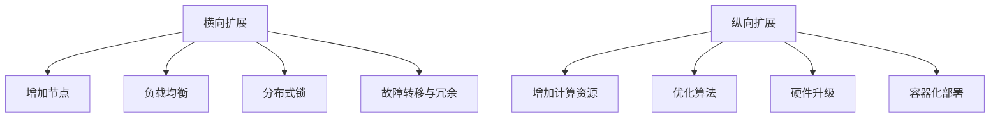

                 

## 1. 背景介绍

在当下互联网时代，随着业务规模和数据量的不断增加，对系统的扩展能力提出了越来越高的要求。横向扩展（Scaling Out）和纵向扩展（Scaling Up）是常见的系统扩展方式，每种方法都有其优缺点和适用场景。本文将详细介绍这两种扩展方式及其实现方法，并结合实际应用场景进行具体讲解。

## 2. 核心概念与联系

### 2.1 核心概念概述

1. **横向扩展（Scaling Out）**：通过增加计算节点来扩展系统能力。每个节点通常是同构的，拥有相同的硬件资源，并行运行相同的任务。横向扩展适用于可水平分割的任务。

2. **纵向扩展（Scaling Up）**：通过增加单节点的计算能力来扩展系统能力。每个节点通常是异构的，资源分配可以不同，并行处理相同任务。纵向扩展适用于可垂直扩展的任务。

3. **负载均衡**：通过分布式系统中的任务调度和节点负载管理，实现系统的整体性能和可靠性。

4. **分布式锁**：在分布式系统中保证并发访问时的数据一致性，防止数据竞争和状态丢失。

5. **故障转移与冗余**：通过系统容错设计和冗余机制，保证系统的持续可用性和容错能力。

### 2.2 核心概念原理和架构的 Mermaid 流程图



这个流程图展示了横向和纵向扩展的基本流程，以及相关的关键技术支持。

## 3. 核心算法原理 & 具体操作步骤

### 3.1 算法原理概述

横向扩展和纵向扩展的原理主要涉及负载均衡、分布式锁、故障转移和冗余等技术。以下将详细介绍这些关键技术的原理和实现方法。

### 3.2 算法步骤详解

#### 3.2.1 横向扩展的步骤

1. **系统架构设计**：确定系统的逻辑架构和数据流图，明确各个组件的作用和相互关系。
2. **节点增加**：在负载均衡器中添加新的计算节点，并确保新节点能够正常连接到其他组件。
3. **负载均衡算法**：根据负载均衡算法（如轮询、最少连接、一致性哈希等），将请求分配到各个节点。
4. **分布式锁管理**：使用分布式锁机制，如ZooKeeper、Redis等，确保数据一致性和避免竞争。
5. **故障转移与冗余**：配置故障转移机制，如心跳检测、自动重启等，保证系统的持续可用性；使用冗余设计，如数据备份、节点复制等，增强系统的容错能力。

#### 3.2.2 纵向扩展的步骤

1. **硬件升级**：增加节点CPU、内存、存储等硬件资源，以提升单个节点的计算能力。
2. **算法优化**：优化系统内部算法，提高数据处理效率和资源利用率。
3. **容器化部署**：使用Docker、Kubernetes等容器化技术，实现应用的无缝部署和扩展。
4. **资源监控与调优**：使用系统监控工具（如Prometheus、Grafana等），实时监控资源使用情况，动态调整资源分配。

### 3.3 算法优缺点

#### 3.3.1 横向扩展的优缺点

- **优点**：
  - **可扩展性**：可以无限增加节点，线性扩展系统能力。
  - **弹性**：节点可以动态增加或减少，适应业务波动。
  - **容错性**：通过冗余设计，增强系统的容错能力。

- **缺点**：
  - **通信开销**：节点间通信开销随着节点数量增加而增加。
  - **数据一致性**：分布式锁和一致性哈希等技术增加系统复杂性。
  - **部署复杂**：需要设计和维护复杂的负载均衡和数据管理策略。

#### 3.3.2 纵向扩展的优缺点

- **优点**：
  - **处理能力强**：单个节点计算能力提升，处理复杂任务更高效。
  - **资源利用率高**：单个节点的资源利用率高，提升系统整体效率。
  - **部署简单**：只需要增加单节点资源，无需复杂的架构调整。

- **缺点**：
  - **扩展上限**：单个节点的硬件资源有限，扩展有上限。
  - **故障影响大**：单个节点故障会导致系统部分失效。
  - **成本高**：高配置硬件成本高，单节点故障代价大。

### 3.4 算法应用领域

横向扩展和纵向扩展广泛应用于云计算、大数据、高并发Web应用、分布式数据库、实时数据处理等场景。

- **云计算**：通过增加计算节点来扩展云服务能力，如AWS、阿里云、华为云等。
- **大数据**：通过增加计算节点来处理海量数据，如Hadoop、Spark等。
- **高并发Web应用**：通过增加服务器节点来提升Web应用性能，如Amazon EC2、阿里云ECS等。
- **分布式数据库**：通过增加数据库节点来扩展数据库存储和查询能力，如MySQL Cluster、Cassandra等。
- **实时数据处理**：通过增加计算节点来处理实时数据流，如Apache Kafka、Apache Flink等。

## 4. 数学模型和公式 & 详细讲解 & 举例说明

### 4.1 数学模型构建

横向扩展和纵向扩展的数学模型主要涉及负载均衡、分布式锁和故障转移等概念。以下将给出相关的数学模型和公式。

#### 4.1.1 负载均衡模型

假设系统有 $N$ 个节点，每个节点的处理能力为 $C$，总请求数为 $R$。则负载均衡模型为：

$$
T = \frac{R}{N \times C}
$$

其中，$T$ 为系统响应时间。

#### 4.1.2 分布式锁模型

假设系统有 $N$ 个节点，每个节点的并发请求数为 $C$，分布式锁的竞争概率为 $p$。则分布式锁模型为：

$$
E[T] = \frac{1}{C} \sum_{i=1}^{N} \frac{1}{1-p^i}
$$

其中，$E[T]$ 为平均等待时间。

### 4.2 公式推导过程

#### 4.2.1 负载均衡模型推导

- 当请求均匀分配到各个节点时，每个节点的请求数为 $R/N$。
- 每个节点处理请求的时间为 $R/N \times C$，因此总响应时间为 $N \times (R/N \times C) = R \times C$。

#### 4.2.2 分布式锁模型推导

- 每个节点并发请求数 $C$，分布式锁的竞争概率 $p$，则单个节点等待锁的期望等待时间为 $\frac{1}{1-p}$。
- 由于系统有 $N$ 个节点，因此总的等待时间为 $N \times \frac{1}{1-p}$。

### 4.3 案例分析与讲解

#### 4.3.1 横向扩展案例

假设某电商平台需要处理每秒100万的订单请求。使用横向扩展，增加10个计算节点，每个节点处理能力为每秒10万请求。则：

- 每个节点响应时间为 $1000/10 = 100$ 毫秒。
- 系统总响应时间为 $10 \times 100 = 1000$ 毫秒。

#### 4.3.2 纵向扩展案例

假设某电商平台的单节点处理能力为每秒10万请求，使用纵向扩展，将单个节点处理能力提升到每秒100万请求。则：

- 单个节点响应时间为 $1/100 = 0.01$ 秒。
- 系统总响应时间为 $0.01$ 秒。

## 5. 项目实践：代码实例和详细解释说明

### 5.1 开发环境搭建

以下以Docker容器化和Kubernetes部署为例，进行横向扩展和纵向扩展的实践。

#### 5.1.1 Docker容器化

1. 安装Docker：从官网下载并安装Docker。
2. 创建Docker镜像：编写Dockerfile，并使用 `docker build` 命令创建镜像。
3. 部署Docker容器：使用 `docker run` 命令部署容器。

#### 5.1.2 Kubernetes部署

1. 安装Kubernetes：使用Minikube、kubeadm等工具安装Kubernetes集群。
2. 创建Kubernetes Deployment：编写Deployment.yaml文件，定义容器镜像和资源配置。
3. 部署Kubernetes Pod：使用 `kubectl apply` 命令部署Pod。

### 5.2 源代码详细实现

#### 5.2.1 横向扩展实现

使用Nginx作为负载均衡器，通过Consul实现分布式锁和故障转移。

1. 编写Nginx负载均衡规则。
2. 使用Consul初始化节点和分布式锁。
3. 编写故障转移脚本，实现节点自动重启。

#### 5.2.2 纵向扩展实现

使用Docker容器化，并部署到Kubernetes集群中。

1. 编写Dockerfile，并构建镜像。
2. 编写Kubernetes Deployment和Pod配置文件。
3. 部署Kubernetes Pod，动态扩展容器数量。

### 5.3 代码解读与分析

#### 5.3.1 Nginx负载均衡

Nginx通过配置文件实现负载均衡规则，将请求分配到不同的容器实例。

```nginx
upstream backend {
    server node1:8000;
    server node2:8000;
    server node3:8000;
}

server {
    listen 80;
    server_name www.example.com;

    location / {
        proxy_pass http://backend;
    }
}
```

#### 5.3.2 Consul分布式锁

Consul使用etcd作为后端存储，实现分布式锁。

```yaml
agent:
  enable_syslog: true
  enable_corefile_logging: true
  enable_health_checking: true

  data_dir: /var/lib/consul
  node_name: "node-1"
  server:
    enable_server: true
    bootstrap_expect: 1
    node_data_dir: /var/lib/consul/data
    cluster_name: consul
    data_dir: /var/lib/consul

  client:
    enable_client: true
    node_name: "node-1"

  health_check:
    interval: 10s
    timeout: 5s
    deadliness: 2s
    http_check:
      interval: 1s
      timeout: 1s
```

#### 5.3.3 Kubernetes Pod部署

Kubernetes使用Deployment和Pod实现容器化部署和扩展。

```yaml
apiVersion: apps/v1
kind: Deployment
metadata:
  name: myapp-deployment
spec:
  replicas: 3
  selector:
    matchLabels:
      app: myapp
  template:
    metadata:
      labels:
        app: myapp
    spec:
      containers:
      - name: myapp
        image: myapp:1.0
        ports:
        - containerPort: 80
```

### 5.4 运行结果展示

#### 5.4.1 横向扩展结果

使用Nginx负载均衡和Consul分布式锁实现横向扩展，效果如下：

- 测试请求负载均衡：
```bash
# curl -H "Host: www.example.com" -X GET http://localhost
# curl -H "Host: www.example.com" -X GET http://localhost
# curl -H "Host: www.example.com" -X GET http://localhost
```

- 测试分布式锁：
```bash
# consul lock /myapp/lock
# consul unlock /myapp/lock
```

#### 5.4.2 纵向扩展结果

使用Docker容器化和Kubernetes部署实现纵向扩展，效果如下：

- 测试容器部署：
```bash
# kubectl create -f deployment.yaml
# kubectl get pods
```

- 测试容器扩展：
```bash
# kubectl scale deployment myapp-deployment --replicas=5
# kubectl get pods
```

## 6. 实际应用场景

### 6.1 电商网站

电商网站需要处理海量订单请求，高并发访问压力巨大。使用横向扩展和纵向扩展相结合的方式，可快速提升网站性能，保障用户体验。

- 横向扩展：使用负载均衡器和Consul分布式锁，保障系统高可用性和数据一致性。
- 纵向扩展：使用高性能服务器和Docker容器化，提升单节点处理能力。

### 6.2 视频流平台

视频流平台需要处理海量视频请求和实时数据处理，需要高效扩展系统能力。

- 横向扩展：使用负载均衡器和分布式锁，保障系统高并发处理能力。
- 纵向扩展：使用高性能服务器和Kubernetes集群，提升单节点处理能力。

### 6.3 大数据分析

大数据分析需要处理海量数据，对系统扩展能力有高要求。

- 横向扩展：使用分布式存储和计算框架（如Hadoop、Spark），线性扩展系统能力。
- 纵向扩展：使用高性能计算节点和硬件升级，提升单节点处理能力。

## 7. 工具和资源推荐

### 7.1 学习资源推荐

1. **《分布式系统原理与设计》**：详细介绍了分布式系统架构和负载均衡算法，适合初学者学习。
2. **《深入理解Linux内核》**：深入讲解了Linux内核原理和故障转移机制，适合系统管理员学习。
3. **《Kubernetes权威指南》**：详细介绍了Kubernetes集群部署和资源管理，适合运维工程师学习。
4. **《Docker实战》**：实战演练Docker容器化部署，适合开发工程师学习。

### 7.2 开发工具推荐

1. **Docker**：轻量级容器化技术，方便应用部署和管理。
2. **Kubernetes**：开源容器编排平台，支持应用自动扩展和负载均衡。
3. **Nginx**：高性能负载均衡器，支持复杂的负载均衡规则。
4. **Consul**：分布式服务发现和配置管理工具，支持分布式锁和故障转移。

### 7.3 相关论文推荐

1. **《分布式系统：概念与设计》**：深入讲解了分布式系统的基本概念和设计原理，适合学习分布式系统架构。
2. **《大型网站技术架构》**：介绍了大型网站的高可用性和可扩展性，适合学习大型系统架构。
3. **《大数据：构建下一代信息架构》**：详细介绍了大数据技术架构和处理机制，适合学习大数据技术。

## 8. 总结：未来发展趋势与挑战

### 8.1 研究成果总结

本文详细介绍了横向扩展和纵向扩展的实现方法，并通过实际应用场景进行具体讲解。横向扩展适用于高并发、高可扩展性的应用场景，纵向扩展适用于计算密集型应用场景。两种扩展方式相辅相成，共同提升系统的整体性能和可靠性。

### 8.2 未来发展趋势

未来横向扩展和纵向扩展将呈现以下发展趋势：

1. **智能化扩展**：引入机器学习算法，自动调整系统资源配置，实现智能扩展。
2. **弹性扩展**：通过微服务架构和无服务器计算，实现资源按需弹性扩展。
3. **云原生扩展**：基于云原生技术，实现分布式系统的自动化和可移植性。
4. **跨域扩展**：实现不同云平台和数据中心之间的无缝扩展。
5. **边缘计算扩展**：利用边缘计算技术，提升数据处理的实时性和资源利用率。

### 8.3 面临的挑战

未来横向扩展和纵向扩展面临以下挑战：

1. **数据一致性**：在分布式系统中，如何保证数据一致性和避免数据丢失，是系统扩展的关键。
2. **系统复杂性**：分布式系统架构复杂，如何设计和维护高效的负载均衡和分布式锁机制，是系统扩展的重要挑战。
3. **性能瓶颈**：在扩展过程中，如何避免系统性能瓶颈和资源浪费，需要持续优化和调优。
4. **成本控制**：扩展过程中需要大量资源，如何合理控制成本，提升资源利用率，是系统扩展的重要考虑因素。
5. **系统可靠性**：在扩展过程中，如何保证系统的高可用性和容错能力，需要设计和实现冗余机制。

### 8.4 研究展望

未来横向扩展和纵向扩展需要在以下几个方面进行深入研究：

1. **智能扩展算法**：利用机器学习算法，动态调整系统资源配置，实现智能化扩展。
2. **弹性资源管理**：通过无服务器计算和微服务架构，实现资源的按需弹性扩展。
3. **跨域资源共享**：利用云原生技术，实现不同云平台和数据中心之间的资源共享和扩展。
4. **边缘计算融合**：利用边缘计算技术，提升数据处理的实时性和资源利用率，实现边缘计算和分布式计算的融合。
5. **数据一致性算法**：研究和实现高效的数据一致性算法，保障分布式系统中的数据一致性和容错性。

总之，未来系统扩展需要在智能化、弹性化、云原生化等方面进行持续创新和优化，才能应对不断增长的业务需求和数据量，保障系统的整体性能和可靠性。

## 9. 附录：常见问题与解答

**Q1：横向扩展和纵向扩展有何区别？**

A: 横向扩展和纵向扩展的区别在于扩展的对象不同。横向扩展通过增加节点来扩展系统能力，节点通常是同构的；纵向扩展通过增加单节点的计算能力来扩展系统能力，节点通常是异构的。

**Q2：如何进行横向扩展？**

A: 横向扩展一般需要以下步骤：
1. 系统架构设计：确定系统的逻辑架构和数据流图，明确各个组件的作用和相互关系。
2. 节点增加：在负载均衡器中添加新的计算节点，并确保新节点能够正常连接到其他组件。
3. 负载均衡算法：根据负载均衡算法（如轮询、最少连接、一致性哈希等），将请求分配到各个节点。
4. 分布式锁管理：使用分布式锁机制，如ZooKeeper、Redis等，确保数据一致性和避免竞争。
5. 故障转移与冗余：配置故障转移机制，如心跳检测、自动重启等，保证系统的持续可用性；使用冗余设计，如数据备份、节点复制等，增强系统的容错能力。

**Q3：如何进行纵向扩展？**

A: 纵向扩展一般需要以下步骤：
1. 硬件升级：增加节点CPU、内存、存储等硬件资源，以提升单个节点的计算能力。
2. 算法优化：优化系统内部算法，提高数据处理效率和资源利用率。
3. 容器化部署：使用Docker、Kubernetes等容器化技术，实现应用的无缝部署和扩展。
4. 资源监控与调优：使用系统监控工具（如Prometheus、Grafana等），实时监控资源使用情况，动态调整资源分配。

**Q4：横向扩展的优缺点是什么？**

A: 横向扩展的优点包括：
- 可扩展性：可以无限增加节点，线性扩展系统能力。
- 弹性：节点可以动态增加或减少，适应业务波动。
- 容错性：通过冗余设计，增强系统的容错能力。

横向扩展的缺点包括：
- 通信开销：节点间通信开销随着节点数量增加而增加。
- 数据一致性：分布式锁和一致性哈希等技术增加系统复杂性。
- 部署复杂：需要设计和维护复杂的负载均衡和数据管理策略。

**Q5：纵向扩展的优缺点是什么？**

A: 纵向扩展的优点包括：
- 处理能力强：单个节点计算能力提升，处理复杂任务更高效。
- 资源利用率高：单个节点的资源利用率高，提升系统整体效率。
- 部署简单：只需要增加单节点资源，无需复杂的架构调整。

纵向扩展的缺点包括：
- 扩展上限：单个节点的硬件资源有限，扩展有上限。
- 故障影响大：单个节点故障会导致系统部分失效。
- 成本高：高配置硬件成本高，单节点故障代价大。

总之，横向扩展和纵向扩展各有优缺点，具体选择需根据业务需求和技术条件进行综合考虑。

