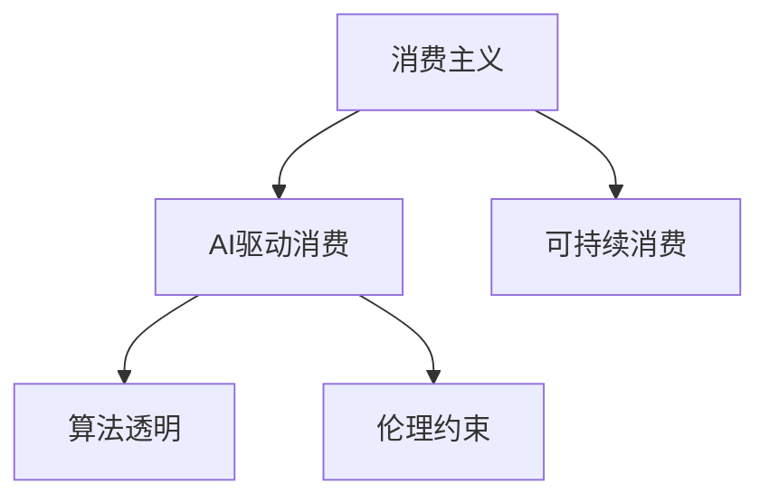

                 

# 欲望的可持续性：AI时代的消费伦理

> 关键词：欲望, 可持续性, AI, 消费伦理, 技术驱动, 算法透明

## 1. 背景介绍

### 1.1 问题由来

随着人工智能技术的不断进步，AI正逐步渗透到生活的各个方面，从智能家居到自动驾驶，从在线教育到医疗诊断，AI正逐渐成为人们生活中不可或缺的一部分。然而，伴随AI应用的普及，一个不可忽视的问题也逐渐凸显：AI驱动的消费行为引发了人们日益膨胀的欲望，而这些欲望往往无法与现实资源的有限性相匹配。

现代社会，消费主义已成为一种文化现象，从广告到社交媒体，从电商到物流，种种技术手段都在刺激消费者的购物欲望，让他们陷入“无限消费”的循环。这种消费模式的背后，是AI技术的深度参与和驱动。而过度消费不仅对环境和社会产生负面影响，也引发了对AI技术伦理性的深度反思。

### 1.2 问题核心关键点

AI驱动的消费行为引发的问题主要体现在以下几个方面：

1. **资源浪费**：过度消费导致资源浪费，对环境造成严重破坏。
2. **社会不平等**：消费主义加剧了贫富差距，对经济公平构成挑战。
3. **心理健康**：过度消费带来心理压力，影响消费者心理健康。
4. **技术滥用**：AI技术被滥用以操纵消费者，如虚假广告、价格歧视等。
5. **道德伦理**：AI技术介入消费行为，引发了关于隐私、数据安全等伦理问题。

解决这些问题，需要从技术、伦理、政策等多个维度入手，构建可持续的消费模式。

### 1.3 问题研究意义

研究AI时代的消费伦理，对于推动AI技术向善、促进社会可持续发展具有重要意义：

1. **提升AI道德水平**：确保AI技术在消费领域的应用符合伦理标准，避免技术滥用。
2. **促进绿色发展**：通过技术手段减少资源浪费，推动可持续发展。
3. **平衡经济公平**：防止消费主义加剧贫富差距，促进社会公平。
4. **保障消费者权益**：保护消费者隐私，防止数据滥用，提升消费体验。

## 2. 核心概念与联系

### 2.1 核心概念概述

为了更好地理解AI技术在消费领域的伦理问题，本节将介绍几个密切相关的核心概念：

1. **消费主义**：一种以消费和物质占有为核心的价值观，追求最大化的物质享受和消费满足。
2. **可持续消费**：一种符合经济、社会、环境利益的消费模式，强调资源节约和循环利用。
3. **AI驱动消费**：指AI技术在广告、推荐、个性化服务等领域的应用，对消费者的购买行为产生直接影响。
4. **算法透明**：指AI系统在决策过程中的可解释性和可追溯性，确保系统透明，防止黑箱操作。
5. **伦理约束**：指AI系统在设计和应用过程中应遵守的道德规范和法律要求，确保技术的善用。

这些概念之间的逻辑关系可以通过以下Mermaid流程图来展示：



这个流程图展示了一系列核心概念及其之间的关系：

1. 消费主义与AI驱动消费：消费主义的价值观通过AI技术放大，形成更强烈的消费欲望。
2. 可持续消费与AI驱动消费：消费主义的反面是可持续消费，AI技术应助力实现这一目标。
3. 算法透明与AI驱动消费：算法的透明性是实现AI系统可控、可解释的基础。
4. 伦理约束与AI驱动消费：伦理约束是AI技术在消费领域应用的指导原则。

## 3. 核心算法原理 & 具体操作步骤
### 3.1 算法原理概述

AI驱动的消费行为主要基于两个核心算法：

1. **推荐算法**：通过分析用户的消费历史、兴趣和行为模式，推荐个性化的商品和服务，刺激用户的消费欲望。
2. **广告算法**：通过精准投放广告，利用用户的点击、浏览行为数据，引导用户进行购买。

这些算法原理基于机器学习和数据挖掘技术，能够高效地从大量数据中提取有价值的信息，从而实现精准推荐和定向广告。然而，这些算法的应用也带来了新的伦理问题，如数据隐私、广告欺诈等。

### 3.2 算法步骤详解

AI驱动的消费行为主要包括以下几个步骤：

1. **数据收集**：通过传感器、社交媒体、电商平台等渠道，收集用户的消费行为数据。
2. **模型训练**：使用机器学习算法，如协同过滤、深度学习等，训练推荐和广告模型。
3. **决策生成**：根据用户的个性化需求，生成推荐列表或广告投放策略。
4. **行为跟踪**：记录用户的行为反馈，不断优化模型，提高推荐效果。

### 3.3 算法优缺点

AI驱动的消费行为有以下优点：

1. **效率高**：能够快速精准地推荐商品，提高用户购买率。
2. **个性化**：根据用户的个人偏好，提供定制化服务。
3. **成本低**：减少实体店和广告成本，提高经济效益。

然而，这些算法也存在一定的局限性：

1. **隐私风险**：用户数据被收集和分析，存在隐私泄露的风险。
2. **过度消费**：算法可能过度刺激用户的购买欲望，导致过度消费。
3. **公平性问题**：算法可能加剧用户之间的消费不平等，形成数据鸿沟。
4. **道德风险**：算法可能被滥用，进行价格歧视、广告欺诈等行为。

### 3.4 算法应用领域

AI驱动的消费行为在以下领域得到了广泛应用：

1. **电商**：利用推荐算法提高销售量，利用广告算法增加用户转化率。
2. **社交媒体**：通过内容推荐算法，增加用户粘性，提高平台活跃度。
3. **金融**：利用用户行为数据进行风险评估，精准推荐理财产品。
4. **媒体**：通过精准广告投放，增加点击率和观看量。
5. **物流**：利用路径优化算法，提高配送效率，减少用户等待时间。

这些领域的应用展示了AI技术在消费领域的重要性和广泛性，但也暴露了其潜在的伦理问题。

## 4. 数学模型和公式 & 详细讲解 & 举例说明

### 4.1 数学模型构建

为了更好地理解AI驱动消费行为，我们可以建立一个简化的数学模型。假设有一个基本的推荐算法，该算法基于用户历史行为 $H$ 和商品属性 $I$ 的相似度，计算推荐结果 $R$。模型如下：

$$ R = f(H, I) $$

其中 $f$ 是一个函数，用来计算用户和商品的相似度。在实际应用中，该函数通常基于协同过滤、深度学习等算法实现。

### 4.2 公式推导过程

在推荐算法的构建中，常见的推荐模型包括协同过滤和矩阵分解。以协同过滤为例，其基本原理是通过用户和商品的历史评分数据，构建用户-商品评分矩阵 $S$，并使用矩阵分解方法，如奇异值分解(SVD)，求解低维矩阵 $U$ 和 $V$，从而得到用户的潜在评分 $P$：

$$ P = U \cdot V^T $$

其中 $U$ 和 $V$ 为低维矩阵，$P$ 为用户的潜在评分矩阵。最终的推荐结果 $R$ 可以通过 $P$ 计算得出。

### 4.3 案例分析与讲解

以电商平台为例，推荐算法可以基于用户的历史浏览记录、购买记录、评分等数据，计算用户对各类商品的评分概率，并推荐评分较高的商品。例如，假设用户 A 历史浏览了商品 $B$ 和 $C$，且对 $B$ 评分较高，那么算法可能推荐 $C$ 给用户 A。

## 5. 项目实践：代码实例和详细解释说明
### 5.1 开发环境搭建

在进行AI驱动消费行为的实践时，我们需要准备好开发环境。以下是使用Python进行PyTorch开发的环境配置流程：

1. 安装Anaconda：从官网下载并安装Anaconda，用于创建独立的Python环境。

2. 创建并激活虚拟环境：
```bash
conda create -n pytorch-env python=3.8 
conda activate pytorch-env
```

3. 安装PyTorch：根据CUDA版本，从官网获取对应的安装命令。例如：
```bash
conda install pytorch torchvision torchaudio cudatoolkit=11.1 -c pytorch -c conda-forge
```

4. 安装TensorFlow：根据CUDA版本，从官网获取对应的安装命令。例如：
```bash
pip install tensorflow==2.6
```

5. 安装各类工具包：
```bash
pip install numpy pandas scikit-learn matplotlib tqdm jupyter notebook ipython
```

完成上述步骤后，即可在`pytorch-env`环境中开始AI驱动消费行为的实践。

### 5.2 源代码详细实现

以下是使用TensorFlow实现推荐算法的代码示例：

```python
import tensorflow as tf
import numpy as np

# 定义评分矩阵
S = np.array([[5, 3, 2],
              [3, 5, 1],
              [4, 2, 5]])

# 奇异值分解
U, SVD, V = np.linalg.svd(S)

# 计算用户潜在评分
P = np.dot(U, V.T)

# 推荐商品
R = np.dot(P, SVD.T)

print(R)
```

在这个示例中，我们使用TensorFlow和numpy实现了一个简单的协同过滤推荐算法。通过奇异值分解，我们计算出用户的潜在评分，并根据潜在评分矩阵推荐商品。

### 5.3 代码解读与分析

让我们再详细解读一下关键代码的实现细节：

**奇异值分解**：
- 通过numpy的svd函数实现奇异值分解，得到低维矩阵U和V。

**用户潜在评分**：
- 通过计算U和V的乘积，得到用户的潜在评分矩阵P。

**推荐商品**：
- 通过计算P和V的乘积，得到推荐结果R。

可以看到，通过简单的矩阵运算，我们实现了基本的协同过滤推荐算法。在实际应用中，还需要根据具体数据和业务需求，不断优化模型和参数，以提升推荐效果。

## 6. 实际应用场景
### 6.1 智能推荐系统

智能推荐系统是AI驱动消费行为的重要应用。通过推荐算法，电商网站能够根据用户的浏览历史和购买记录，推荐用户可能感兴趣的商品，增加用户的购买率和平台粘性。例如，Amazon、淘宝等电商平台的推荐系统，就是基于协同过滤和深度学习算法实现的。

### 6.2 个性化广告

个性化广告是通过广告算法，精准投放广告，实现高效营销的一种手段。例如，Google AdWords、Facebook Ads等平台，通过分析用户的浏览行为和点击数据，向用户推荐相关的广告。这种基于用户行为数据的广告投放方式，能够显著提高广告的点击率和转化率，但也需要关注用户隐私和广告伦理问题。

### 6.3 精准营销

精准营销是通过大数据和AI技术，对用户进行细分，实施精准投放的一种营销策略。例如，通过用户行为数据和社交网络分析，为不同用户群体定制化推荐商品和服务，提高营销效果。这种策略需要高度依赖数据和算法，但也可能引发数据滥用和隐私问题。

### 6.4 未来应用展望

随着AI技术的不断进步，未来的AI驱动消费行为将呈现以下趋势：

1. **深度学习广泛应用**：深度学习算法在推荐和广告领域的应用将更加广泛，提高推荐效果和广告转化率。
2. **个性化增强**：基于用户行为数据的个性化推荐将更加精准，提升用户体验。
3. **跨模态融合**：结合图像、语音、视频等多模态数据，提供更加全面的推荐服务。
4. **联邦学习**：通过分布式学习，保护用户隐私，实现数据安全共享。
5. **可解释性增强**：提高算法的透明性和可解释性，让用户理解推荐依据。
6. **伦理和法律合规**：加强对AI驱动消费行为的伦理和法律监管，确保技术的公平性和透明度。

这些趋势展示了AI驱动消费行为的未来发展方向，但也带来了新的挑战和风险。

## 7. 工具和资源推荐
### 7.1 学习资源推荐

为了帮助开发者系统掌握AI驱动消费行为的技术和伦理问题，这里推荐一些优质的学习资源：

1. **《机器学习》课程**：由斯坦福大学Andrew Ng教授开设的机器学习课程，系统介绍了机器学习的基本概念和算法，是入门机器学习的经典教材。
2. **《深度学习》课程**：由吴恩达教授和Jeff Dean等人合著的深度学习教材，详细介绍了深度学习理论和实践。
3. **《Python深度学习》书籍**：由Francois Chollet撰写的深度学习入门书籍，深入浅出地介绍了TensorFlow和Keras的使用方法。
4. **《AI伦理》课程**：由MIT OpenCourseWare提供的AI伦理课程，探讨了AI技术的伦理和社会影响。
5. **《大数据与人工智能》书籍**：由Lars Buitinck撰写的开源数据科学书籍，介绍了大数据和AI技术的实践应用。

通过对这些资源的学习实践，相信你一定能够全面掌握AI驱动消费行为的技术和伦理问题，并用于解决实际的消费问题。

### 7.2 开发工具推荐

高效的开发离不开优秀的工具支持。以下是几款用于AI驱动消费行为开发的常用工具：

1. **PyTorch**：基于Python的开源深度学习框架，灵活性强，适合快速迭代研究。
2. **TensorFlow**：由Google主导开发的开源深度学习框架，生产部署方便，适合大规模工程应用。
3. **Keras**：基于TensorFlow和Theano等框架的高级API，提供了简洁高效的开发接口。
4. **Scikit-learn**：Python的机器学习库，包含多种经典算法和工具函数。
5. **Jupyter Notebook**：交互式开发环境，支持代码和文本混合编辑，方便调试和分享。

合理利用这些工具，可以显著提升AI驱动消费行为的开发效率，加快创新迭代的步伐。

### 7.3 相关论文推荐

AI驱动消费行为的研究涉及多个领域，以下是几篇奠基性的相关论文，推荐阅读：

1. **《推荐系统》论文**：由Bollen和Yeung撰写的推荐系统经典论文，详细介绍了协同过滤、矩阵分解等推荐算法。
2. **《深度推荐系统》论文**：由He等人撰写的深度推荐系统论文，介绍了深度神经网络在推荐中的应用。
3. **《个性化广告》论文**：由Rendel等人撰写的个性化广告论文，介绍了基于用户行为数据的广告推荐算法。
4. **《联邦学习》论文**：由McMahan等人撰写的联邦学习论文，探讨了分布式学习的方法和应用。
5. **《AI伦理》论文**：由Barry L.Moore撰写的AI伦理论文，讨论了AI技术的伦理和社会影响。

这些论文代表了大数据和AI技术在消费领域的应用现状和前沿发展，通过学习这些前沿成果，可以帮助研究者把握学科前进方向，激发更多的创新灵感。

## 8. 总结：未来发展趋势与挑战

### 8.1 总结

本文对AI驱动消费行为的技术和伦理问题进行了全面系统的介绍。首先阐述了AI技术在消费领域的广泛应用，指出了过度消费和伦理问题带来的挑战。其次，从原理到实践，详细讲解了推荐算法和广告算法的构建过程，给出了AI驱动消费行为的完整代码实例。同时，本文还广泛探讨了AI驱动消费行为在电商、社交媒体、金融等多个领域的应用前景，展示了其潜在的巨大价值。此外，本文精选了AI驱动消费行为的学习资源和开发工具，力求为读者提供全方位的技术指引。

通过本文的系统梳理，可以看到，AI驱动消费行为正成为驱动经济和社会发展的重要力量，但也带来了新的伦理和技术挑战。面对这些挑战，需要在技术、伦理、政策等多个层面进行综合思考和应对。

### 8.2 未来发展趋势

展望未来，AI驱动消费行为将呈现以下几个发展趋势：

1. **技术融合**：AI技术将与更多领域融合，实现跨领域的应用创新。
2. **个性化增强**：基于用户行为数据的个性化推荐将更加精准，提升用户体验。
3. **数据安全**：联邦学习等技术将提高数据安全性和隐私保护水平。
4. **伦理约束**：AI伦理研究将更加深入，确保技术应用的公平性和透明性。
5. **社会治理**：政府和行业将加强对AI驱动消费行为的监管，构建健康可持续的消费环境。

这些趋势展示了AI驱动消费行为的发展方向，但也带来了新的伦理和技术挑战。

### 8.3 面临的挑战

尽管AI驱动消费行为带来了巨大的经济效益，但也面临着诸多挑战：

1. **隐私保护**：用户数据的收集和分析可能引发隐私泄露和数据滥用。
2. **公平性问题**：算法可能加剧用户之间的消费不平等，形成数据鸿沟。
3. **技术滥用**：AI技术可能被滥用，进行价格歧视、广告欺诈等行为。
4. **伦理问题**：AI驱动消费行为引发了关于隐私、数据安全等伦理问题。
5. **社会影响**：过度消费和消费主义可能对社会和环境造成负面影响。

这些挑战需要在技术、伦理、法律等多个层面进行综合应对，确保AI驱动消费行为的可持续发展。

### 8.4 研究展望

未来，需要在以下几个方面进行深入研究：

1. **算法透明性**：提高算法的透明性和可解释性，确保系统的公平性和透明性。
2. **隐私保护**：采用联邦学习等技术，保护用户隐私，实现数据安全共享。
3. **公平性研究**：加强对算法公平性的研究，减少用户之间的消费不平等。
4. **伦理监管**：构建AI伦理监管机制，确保技术应用的公平性和透明性。
5. **社会影响**：加强对AI驱动消费行为的社会影响研究，推动可持续消费模式的构建。

这些研究方向将引领AI驱动消费行为技术的发展，推动AI技术向善，实现经济效益和社会效益的双赢。

## 9. 附录：常见问题与解答

**Q1：AI驱动消费行为是否适用于所有消费场景？**

A: AI驱动消费行为适用于大多数消费场景，特别是电商、社交媒体、金融等领域。但对于一些需要高度个性化和情感化服务的场景，如旅游、餐饮等，仍需结合人工服务和专家系统，以提升用户体验。

**Q2：推荐算法是否会引发用户的过度消费？**

A: 推荐算法本身不会引发过度消费，但可能通过放大用户的购物欲望，间接影响用户的消费行为。因此，需要合理设计推荐算法，避免过度刺激用户购买欲望，同时提供多样化的推荐内容，让用户做出更理性的消费决策。

**Q3：如何保障推荐算法的公平性？**

A: 保障推荐算法的公平性，需要从数据收集、模型训练、结果输出等多个环节进行设计和优化。例如，可以使用多样性损失函数，增加推荐结果的多样性，防止过度推荐特定商品。同时，可以通过用户反馈和行为数据，不断优化推荐算法，减少偏见和歧视。

**Q4：如何防止AI技术在广告领域的滥用？**

A: 防止AI技术在广告领域的滥用，需要制定严格的法律法规和技术标准。例如，禁止基于用户的隐私数据进行广告定向，防止价格歧视和虚假广告。同时，加强对广告算法的监管，确保广告的透明度和可追溯性。

**Q5：AI驱动消费行为如何与可持续发展目标相结合？**

A: AI驱动消费行为可以与可持续发展目标相结合，通过优化资源利用和减少浪费，实现绿色发展。例如，通过智能物流优化配送路线，减少碳排放；通过精准推荐减少库存积压，提高资源利用效率。同时，需要关注AI技术的社会影响，推动可持续消费模式的构建。

这些问题的回答，展示了AI驱动消费行为在实际应用中的复杂性和挑战性，也提供了一些解决思路和方向。

---

作者：禅与计算机程序设计艺术 / Zen and the Art of Computer Programming

