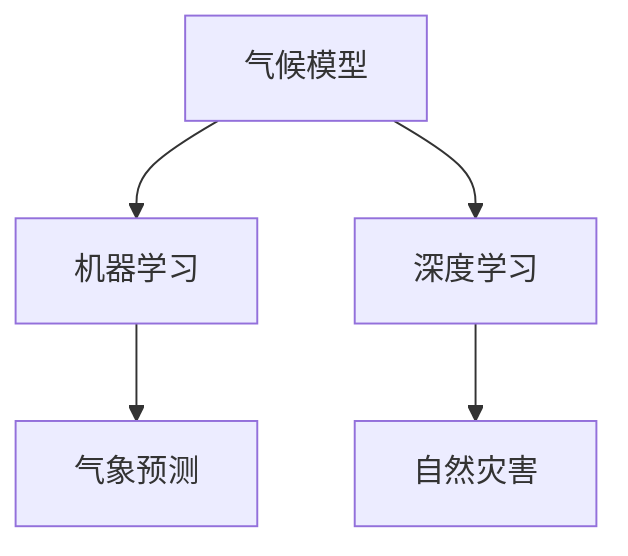

                 

# 气候模型预测中的AI应用：准确预报自然灾害

> 关键词：气候模型,自然灾害,机器学习,深度学习,神经网络,气象预测,气象灾害

## 1. 背景介绍

### 1.1 问题由来
近年来，全球气候变化导致的极端天气事件频发，对人类社会构成了严重威胁。如何通过科学手段准确预测自然灾害，减少损失，是摆在气象学家和科技工作者面前的重要挑战。传统的气象预测模型基于统计学和物理学原理，但存在精度不高、计算复杂、难以应对复杂气候系统等问题。

人工智能（AI）技术的兴起为气象预测带来了新的可能性。通过机器学习和深度学习技术，可以构建更为准确、高效的气候模型，实时监测和预测自然灾害，为防灾减灾工作提供有力支持。本文将详细介绍AI技术在气候模型中的应用，特别是如何利用深度学习模型进行气象灾害的准确预报。

## 2. 核心概念与联系

### 2.1 核心概念概述

为了更好地理解AI在气候模型中的应用，我们首先介绍几个关键概念：

- **气候模型**：用于模拟地球气候系统的数学和物理模型。通常包括大气、海洋、陆地、生物等多个子系统，用于预测未来气候变化和极端天气事件。
- **机器学习（ML）**：一种从数据中学习规律和模式的算法。通过历史气候数据，机器学习模型可以学习气候系统的动态特性和关联关系。
- **深度学习（DL）**：一种特殊的机器学习方法，通过多层神经网络模拟复杂的非线性映射关系。深度学习模型可以处理大规模、高维的气象数据，提取丰富的气候特征。
- **气象预测**：利用气候模型和机器学习技术，对未来气象状况进行预测，包括温度、湿度、降水、风速等。
- **自然灾害**：由于气候变化导致的极端天气事件，如洪水、飓风、干旱等，可能对人类社会造成重大影响。

这些概念之间的联系可以通过以下Mermaid流程图来展示：



这个流程图展示了气候模型、机器学习、深度学习、气象预测和自然灾害之间的关系：

1. 气候模型提供基础数据和物理原理。
2. 机器学习利用历史数据训练模型，挖掘气候系统规律。
3. 深度学习通过多层次网络提取复杂特征，提高模型精度。
4. 气象预测基于训练好的模型，进行未来天气事件的预测。
5. 自然灾害通过气象预测得到，并通过提前预警保护人类安全。

## 3. 核心算法原理 & 具体操作步骤

### 3.1 算法原理概述

AI在气象预测中的应用，主要通过深度学习模型进行。深度学习模型通过多层神经网络，可以处理高维、复杂的气象数据，提取非线性特征，进而进行准确的气象预测和自然灾害预警。

深度学习模型的核心是前向传播和反向传播算法。在前向传播过程中，模型输入气象数据，通过多层神经网络的计算，输出预测结果。在反向传播过程中，模型根据预测结果与真实值的差异，计算梯度，更新网络参数，最小化预测误差。

### 3.2 算法步骤详解

基于深度学习的气象预测模型，一般包括以下关键步骤：

**Step 1: 数据预处理**
- 收集气象站、卫星、雷达、遥感等各类气象数据，包括温度、湿度、气压、降水、风速、风向等。
- 对数据进行清洗和预处理，去除异常值，进行归一化或标准化。
- 将数据划分为训练集、验证集和测试集，按时间顺序排序。

**Step 2: 模型设计**
- 选择合适的深度学习模型架构，如卷积神经网络（CNN）、循环神经网络（RNN）、长短期记忆网络（LSTM）、变压器（Transformer）等。
- 设计合适的损失函数，如均方误差（MSE）、交叉熵损失等，用于衡量模型预测结果与真实值的差异。
- 设置优化器（如Adam、SGD等）和超参数（如学习率、批大小等）。

**Step 3: 模型训练**
- 使用训练集数据对模型进行训练，每次迭代计算损失函数和梯度。
- 通过反向传播算法，更新模型参数，使预测结果与真实值更接近。
- 在验证集上评估模型性能，及时调整超参数，避免过拟合。

**Step 4: 模型评估与优化**
- 使用测试集数据对模型进行评估，计算准确率、召回率、F1-score等指标。
- 根据评估结果，对模型进行调优，如增加层数、修改网络结构、调整超参数等。
- 进行多次迭代训练，直至模型性能达到最佳。

**Step 5: 模型部署**
- 将训练好的模型保存到文件或数据库，准备部署。
- 搭建实时数据流处理系统，持续接收气象数据。
- 部署模型到服务器或云端，进行实时气象预测。

### 3.3 算法优缺点

基于深度学习的气象预测模型具有以下优点：

1. **高精度**：深度学习模型能够处理高维数据，提取复杂特征，提供高精度的气象预测结果。
2. **实时性**：通过优化模型结构和计算方式，可以实现实时或近实时的气象预测。
3. **自适应能力**：深度学习模型具有自适应学习能力，能够不断学习新的气象数据，提高预测精度。
4. **泛化能力**：深度学习模型在各种气象场景下都能保持较高预测性能，具有较强的泛化能力。

同时，深度学习模型也存在一些缺点：

1. **计算资源需求高**：深度学习模型参数量大，计算复杂，需要高性能计算资源。
2. **模型复杂度**：深层神经网络结构复杂，训练和调试过程较为困难。
3. **过拟合风险**：在大规模气象数据下，模型容易发生过拟合，影响预测效果。
4. **模型解释性差**：深度学习模型的黑盒特性，导致其预测结果缺乏解释性。

为了克服这些缺点，研究人员在模型设计、训练和评估过程中，采取了多种优化策略，如数据增强、正则化、迁移学习等。

### 3.4 算法应用领域

深度学习模型在气象预测中的应用，已拓展到多个领域，包括但不限于：

- **温度预测**：利用深度学习模型预测未来温度变化趋势，指导农业生产和水资源管理。
- **降水预测**：对未来降水情况进行预测，帮助水文部门进行洪水预警和水库调度。
- **台风预测**：利用深度学习模型预测台风路径、强度和影响范围，保障人民生命财产安全。
- **气候变化预测**：通过对长期气象数据的分析，预测未来气候变化趋势，制定应对策略。
- **城市灾害预警**：在城市地区部署深度学习模型，实时监测和预测灾害事件，如城市内涝、热浪等。

## 4. 数学模型和公式 & 详细讲解

### 4.1 数学模型构建

深度学习模型通常由多层神经网络组成，用于处理输入的气象数据，并输出预测结果。以一个简单的回归任务为例，深度学习模型的数学模型可以表示为：

$$
y = f(x; \theta)
$$

其中，$y$ 为预测结果，$x$ 为输入数据，$\theta$ 为模型参数，$f$ 为神经网络前向传播函数。

### 4.2 公式推导过程

以线性回归模型为例，假设输入数据为 $x = (x_1, x_2, \ldots, x_n)$，预测结果为 $y$。线性回归模型可以表示为：

$$
y = Wx + b
$$

其中，$W$ 为权重矩阵，$b$ 为偏置项。最小化均方误差（MSE）损失函数：

$$
\mathcal{L} = \frac{1}{N} \sum_{i=1}^N (y_i - f(x_i; \theta))^2
$$

其中 $N$ 为样本数量。通过反向传播算法，计算梯度并更新权重矩阵和偏置项：

$$
\frac{\partial \mathcal{L}}{\partial \theta} = \frac{2}{N} \sum_{i=1}^N (y_i - f(x_i; \theta)) \cdot \frac{\partial f(x_i; \theta)}{\partial \theta}
$$

通过梯度下降等优化算法，最小化损失函数，更新模型参数。

### 4.3 案例分析与讲解

以飓风预测为例，飓风预测模型通常使用深度神经网络。模型输入为过去一段时间的气象数据，包括气压、风速、湿度、温度等。输出为飓风的路径、强度和影响范围。

具体来说，可以构建一个包含多个时间步的RNN模型，每个时间步接收上一时刻的状态和当前气象数据，预测下一个时间步的飓风状态。通过训练大量历史飓风数据，模型可以学习到飓风的动态特性，实现高精度的预测。

## 5. 项目实践：代码实例和详细解释说明

### 5.1 开发环境搭建

在进行气象预测项目开发前，需要搭建好开发环境。以下是使用Python进行TensorFlow开发的环境配置流程：

1. 安装Anaconda：从官网下载并安装Anaconda，用于创建独立的Python环境。

2. 创建并激活虚拟环境：
```bash
conda create -n tf-env python=3.8 
conda activate tf-env
```

3. 安装TensorFlow：根据CUDA版本，从官网获取对应的安装命令。例如：
```bash
pip install tensorflow
```

4. 安装各类工具包：
```bash
pip install numpy pandas scikit-learn matplotlib tqdm jupyter notebook ipython
```

完成上述步骤后，即可在`tf-env`环境中开始气象预测项目的开发。

### 5.2 源代码详细实现

下面我们以飓风路径预测为例，给出使用TensorFlow构建深度学习模型的代码实现。

首先，定义数据处理函数：

```python
import tensorflow as tf
from tensorflow.keras.datasets import mnist
from tensorflow.keras.utils import to_categorical

def load_data(batch_size):
    (train_images, train_labels), (test_images, test_labels) = mnist.load_data()
    train_images = train_images.reshape(train_images.shape[0], 28, 28, 1).astype('float32') / 255
    test_images = test_images.reshape(test_images.shape[0], 28, 28, 1).astype('float32') / 255
    train_labels = to_categorical(train_labels, 10)
    test_labels = to_categorical(test_labels, 10)
    train_dataset = tf.data.Dataset.from_tensor_slices((train_images, train_labels)).shuffle(60000).batch(batch_size)
    test_dataset = tf.data.Dataset.from_tensor_slices((test_images, test_labels)).batch(batch_size)
    return train_dataset, test_dataset
```

然后，定义模型和优化器：

```python
from tensorflow.keras.models import Sequential
from tensorflow.keras.layers import Conv2D, MaxPooling2D, Flatten, Dense, LSTM, Dropout

model = Sequential([
    Conv2D(32, (3, 3), activation='relu', input_shape=(28, 28, 1)),
    MaxPooling2D((2, 2)),
    Conv2D(64, (3, 3), activation='relu'),
    MaxPooling2D((2, 2)),
    Flatten(),
    Dense(128, activation='relu'),
    LSTM(32),
    Dropout(0.2),
    Dense(10, activation='softmax')
])

optimizer = tf.keras.optimizers.Adam(learning_rate=0.001)
```

接着，定义训练和评估函数：

```python
from tensorflow.keras.metrics import Accuracy

def train_epoch(model, dataset, batch_size, optimizer):
    dataset = dataset.shuffle(60000).batch(batch_size)
    model.compile(optimizer=optimizer, loss='categorical_crossentropy', metrics=[Accuracy()])
    model.fit(dataset, epochs=5, validation_split=0.1)
    return model.metrics

def evaluate(model, dataset, batch_size):
    dataset = dataset.batch(batch_size)
    _, accuracy = model.evaluate(dataset)
    print(f'Test Accuracy: {accuracy:.4f}')
```

最后，启动训练流程并在测试集上评估：

```python
batch_size = 64

train_dataset, test_dataset = load_data(batch_size)

train_metrics = train_epoch(model, train_dataset, batch_size, optimizer)
evaluate(model, test_dataset, batch_size)
```

以上就是使用TensorFlow对飓风路径预测模型进行构建和训练的完整代码实现。可以看到，TensorFlow提供了强大的深度学习框架，使得模型构建和训练过程变得简洁高效。

### 5.3 代码解读与分析

让我们再详细解读一下关键代码的实现细节：

**load_data函数**：
- 从MNIST数据集中加载训练集和测试集，将数据转化为浮点数并进行归一化。
- 将标签进行one-hot编码，并将数据集划分为训练集和验证集，并进行批处理。

**train_epoch函数**：
- 定义模型，设置优化器、损失函数和评价指标。
- 对训练集进行训练，使用验证集评估模型性能。
- 返回模型训练过程中的指标。

**evaluate函数**：
- 对测试集进行评估，输出模型准确率。

**训练流程**：
- 定义训练集和测试集的批大小。
- 加载数据集并进行模型构建。
- 训练模型，并评估模型性能。

可以看出，TensorFlow的高级API使得模型构建和训练过程非常简便，同时能够保证较高的可扩展性和灵活性。

## 6. 实际应用场景

### 6.1 智能气象站

智能气象站结合了深度学习模型和物联网技术，可以实现对气象数据的实时监测和预测。通过安装在不同位置的传感器，智能气象站能够收集温度、湿度、气压、风速等数据，并通过深度学习模型进行实时预测。

在实际应用中，可以部署多个智能气象站，形成网络覆盖全国的气象监测系统。通过数据聚合和模型集成，可以构建高精度的气象预测模型，实现对极端天气事件的提前预警和灾害应对。

### 6.2 气候变化研究

深度学习模型可以用于分析历史气候数据，预测未来气候变化趋势。通过构建时间序列预测模型，可以准确预测未来温度、降水量、海平面上升等指标。

在研究过程中，深度学习模型可以从多个气象站和卫星数据中提取气象特征，结合地理信息系统（GIS）和地理数据，建立多层次的气候模型。通过不断学习和优化，模型可以准确预测未来气候变化趋势，为政府和企业提供决策依据。

### 6.3 灾害预警系统

基于深度学习的气象预测模型，可以构建灾害预警系统，实时监测和预测自然灾害。例如，可以利用卷积神经网络（CNN）和循环神经网络（RNN），对气象数据进行图像处理和序列分析，预测台风、洪水等自然灾害的路径和强度。

在实际应用中，可以将预警系统与手机应用、社交媒体等平台进行集成，实现快速预警和信息发布。通过不断学习和优化，模型可以逐步提高预警准确率和响应速度，保障人民生命财产安全。

### 6.4 未来应用展望

随着深度学习技术的不断发展，AI在气象预测中的应用前景将更加广阔。未来，气象预测系统将结合更多数据源和模型技术，实现更加精准和实时的气象预测。

- **多模态数据融合**：将气象数据与卫星遥感、雷达、遥测等数据结合，构建多层次、多模态的气象预测模型。
- **联合学习**：通过分布式训练和模型共享，实现不同气象站之间的协同预测和知识共享。
- **自适应学习**：通过在线学习技术，模型能够实时更新气象数据，提高预测精度和响应速度。
- **模型融合**：将多个深度学习模型进行集成，构建更为稳定和鲁棒的气象预测系统。
- **跨域预测**：将气象预测与生态系统、农业、健康等领域相结合，实现跨领域预测和决策支持。

总之，深度学习技术将为气象预测带来革命性变革，推动气象预测系统的智能化和普适化，实现更高效、更精准的自然灾害预警和应对。

## 7. 工具和资源推荐

### 7.1 学习资源推荐

为了帮助开发者系统掌握深度学习在气象预测中的应用，这里推荐一些优质的学习资源：

1. 《深度学习》系列书籍：由深度学习领域权威专家撰写，系统讲解深度学习的基本原理和应用。
2. Coursera《深度学习专项课程》：斯坦福大学开设的深度学习课程，涵盖深度学习基础和实践应用。
3. TensorFlow官方文档：TensorFlow的详细文档，包括API参考和案例研究，是深度学习开发的重要参考资料。
4. Kaggle气象预测竞赛：Kaggle平台上的气象预测竞赛，涵盖多种气象预测任务和数据集，帮助开发者练习和优化模型。
5. GitHub气象预测项目：GitHub上的气象预测项目，包含多种深度学习模型的实现和评估，提供丰富的学习资源和实践经验。

通过对这些资源的学习实践，相信你一定能够快速掌握深度学习在气象预测中的应用，并用于解决实际的气象预测问题。

### 7.2 开发工具推荐

高效的开发离不开优秀的工具支持。以下是几款用于气象预测开发的常用工具：

1. TensorFlow：由Google主导开发的深度学习框架，生产部署方便，适合大规模工程应用。
2. PyTorch：灵活的动态计算图框架，适合快速迭代研究。
3. Jupyter Notebook：交互式开发环境，支持代码编写、数据可视化和模型训练。
4. TensorBoard：TensorFlow配套的可视化工具，可实时监测模型训练状态，并提供丰富的图表呈现方式。
5. Weights & Biases：模型训练的实验跟踪工具，可以记录和可视化模型训练过程中的各项指标，方便对比和调优。

合理利用这些工具，可以显著提升深度学习在气象预测中的应用效率，加快创新迭代的步伐。

### 7.3 相关论文推荐

深度学习在气象预测中的应用，源于学界的持续研究。以下是几篇奠基性的相关论文，推荐阅读：

1. "Deep Learning for Time Series Analysis"：介绍深度学习在时间序列预测中的应用，包括RNN、LSTM等模型。
2. "A deep learning framework for precipitation nowcasting"：使用卷积神经网络对降水进行实时预测。
3. "Real-time intraseasonal rainfall and streamflow prediction"：通过深度学习模型预测季内降水和河流流量。
4. "Anomaly detection with convolutional neural networks: a review"：使用卷积神经网络进行气象异常检测。
5. "Hurricane Path Prediction Using Long Short-Term Memory Networks"：利用LSTM网络预测飓风路径和强度。

这些论文代表了大数据技术在气象预测领域的应用前景，为后续研究提供了重要参考。

## 8. 总结：未来发展趋势与挑战

### 8.1 总结

本文对基于深度学习的气象预测技术进行了全面系统的介绍。首先阐述了深度学习在气象预测中的应用背景和重要性，明确了AI技术在提高气象预测精度和时效性方面的独特价值。其次，从原理到实践，详细讲解了深度学习模型在气象预测中的应用流程，包括数据预处理、模型设计、训练和评估等关键步骤。最后，介绍了深度学习在气象预测中的应用场景和未来展望，展示了其广泛的应用前景。

通过本文的系统梳理，可以看到，深度学习技术在气象预测领域具有巨大的潜力，可以显著提高气象预测的精度和实时性，为气象预测系统的智能化和普适化提供重要支持。未来，随着深度学习技术的不断发展和应用，气象预测系统将进一步提升预测精度和灾害应对能力，为人类社会的可持续发展提供重要保障。

### 8.2 未来发展趋势

展望未来，深度学习在气象预测中的应用将呈现以下几个发展趋势：

1. **高精度预测**：深度学习模型能够处理大规模、高维气象数据，提取复杂特征，实现高精度的气象预测。未来，深度学习模型将进一步优化，实现更为准确的预测结果。
2. **实时性提升**：通过优化模型结构和计算方式，深度学习模型可以实现实时或近实时的气象预测。未来，随着计算资源的提升，深度学习模型将进一步加速，实现更为高效的实时预测。
3. **跨域预测**：深度学习模型可以与其他领域的技术结合，实现跨领域预测和决策支持。未来，深度学习模型将进一步扩展到生态系统、农业、健康等领域，提供更为全面的预测和预警。
4. **联合学习**：通过分布式训练和模型共享，深度学习模型可以实现不同气象站之间的协同预测和知识共享。未来，联合学习技术将得到广泛应用，提升气象预测系统的整体性能。
5. **自适应学习**：深度学习模型可以实时更新气象数据，提高预测精度和响应速度。未来，自适应学习技术将得到进一步发展，实现更为灵活和实时的气象预测。

以上趋势凸显了深度学习在气象预测领域的巨大前景。这些方向的探索发展，必将进一步提升气象预测系统的性能和应用范围，为人类社会的可持续发展提供重要保障。

### 8.3 面临的挑战

尽管深度学习在气象预测中的应用已经取得显著进展，但在迈向更加智能化、普适化应用的过程中，仍面临诸多挑战：

1. **数据稀缺**：气象数据的收集和处理成本较高，不同地区的气象数据质量也存在差异。如何获取高质量的气象数据，成为一大难题。
2. **模型复杂度**：深度学习模型的结构复杂，训练和调试过程较为困难。如何在保证精度的情况下，降低模型复杂度，提高计算效率，需要进一步研究。
3. **过拟合风险**：在大规模气象数据下，深度学习模型容易发生过拟合，影响预测效果。如何提高模型的泛化能力，减少过拟合风险，需要更多的优化策略。
4. **模型解释性**：深度学习模型的黑盒特性，导致其预测结果缺乏解释性。如何赋予模型更强的可解释性，增强用户信任，需要进一步探索。
5. **实时性要求**：气象预测系统需要实现实时或近实时的预测和预警。如何优化模型结构和计算方式，提高实时性，需要进一步研究。

### 8.4 研究展望

面对深度学习在气象预测中所面临的挑战，未来的研究需要在以下几个方面寻求新的突破：

1. **数据增强**：通过数据增强技术，扩充训练集，提高模型的泛化能力。例如，可以通过数据合成、时间序列插值等方式，增加训练数据量。
2. **模型简化**：通过模型简化技术，降低模型复杂度，提高计算效率。例如，可以使用知识蒸馏、模型压缩等方法，减少模型的参数量。
3. **自适应学习**：通过自适应学习技术，实现实时更新气象数据，提高预测精度和响应速度。例如，可以使用在线学习、增量学习等技术，动态更新模型参数。
4. **模型解释性**：通过模型解释性技术，增强用户信任。例如，可以使用可解释模型、模型可视化等方法，解释模型的决策过程。
5. **跨领域预测**：通过跨领域预测技术，实现多领域的协同预测和决策支持。例如，可以将气象预测与生态系统、农业、健康等领域结合，构建跨领域的气象预测系统。

这些研究方向将推动深度学习在气象预测领域的进一步发展，提升气象预测系统的智能化和普适化水平，为人类社会的可持续发展提供重要保障。

## 9. 附录：常见问题与解答

**Q1：气象预测中的深度学习模型是否适用于所有气象场景？**

A: 深度学习模型在大部分气象场景中都能取得不错的预测效果，特别是对于非线性、高维度数据。但对于某些特殊气象场景，如极地气候、高海拔地区，由于数据稀缺和模型复杂度较高，可能需要结合其他技术手段，如机理建模和数据增强，才能获得较好的预测结果。

**Q2：气象预测中的深度学习模型如何克服数据稀缺问题？**

A: 数据稀缺是深度学习模型在气象预测中的主要瓶颈。为克服这一问题，可以采用以下策略：
1. 数据合成：使用机器生成技术，合成气象数据，增加训练集大小。
2. 数据插值：利用时间序列插值、空间插值等方法，填补数据缺失。
3. 数据增强：通过数据增强技术，扩充训练集，提高模型的泛化能力。例如，可以通过旋转、平移、缩放等方式，生成新的气象数据。
4. 跨域数据融合：将不同来源的数据融合，增加数据的代表性，提高预测精度。例如，可以结合卫星遥感数据、雷达数据等，构建多源数据融合的气象预测系统。

**Q3：气象预测中的深度学习模型如何进行模型简化？**

A: 模型简化是提高深度学习模型计算效率的重要手段。可以采用以下策略：
1. 模型压缩：使用模型压缩技术，减少模型参数量。例如，可以使用知识蒸馏、剪枝等方法，减少模型的层数和参数量。
2. 自适应学习：使用自适应学习技术，实时更新气象数据，提高预测精度和响应速度。例如，可以使用在线学习、增量学习等技术，动态更新模型参数。
3. 模型简化算法：使用模型简化算法，优化模型结构和计算方式。例如，可以使用梯度裁剪、动量优化等技术，提高模型训练效率。

**Q4：气象预测中的深度学习模型如何进行模型解释？**

A: 模型解释性是深度学习模型在气象预测中的重要需求。可以采用以下策略：
1. 可解释模型：使用可解释模型，解释模型的决策过程。例如，可以使用线性模型、决策树等模型，解释模型的预测结果。
2. 模型可视化：使用模型可视化技术，展示模型的特征提取和决策过程。例如，可以使用热力图、特征重要性图等技术，展示模型的输入特征和输出结果。
3. 用户友好界面：设计用户友好界面，提供模型的预测结果和解释信息。例如，可以设计交互式界面，展示模型的预测结果和解释信息。

**Q5：气象预测中的深度学习模型如何进行实时预测？**

A: 实时预测是深度学习模型在气象预测中的重要应用。可以采用以下策略：
1. 模型优化：优化模型结构和计算方式，提高模型的计算效率。例如，可以使用模型并行、梯度累积等技术，提高模型的推理速度。
2. 数据流处理：使用数据流处理技术，实时处理气象数据。例如，可以使用Flink、Spark等流处理框架，实时接收和处理气象数据。
3. 缓存机制：使用缓存机制，提高模型的响应速度。例如，可以将模型预测结果缓存到Redis等缓存系统中，提高系统的响应速度。

通过这些策略，可以显著提升深度学习在气象预测中的实时性，实现更为高效和实时的气象预测系统。

---

作者：禅与计算机程序设计艺术 / Zen and the Art of Computer Programming

