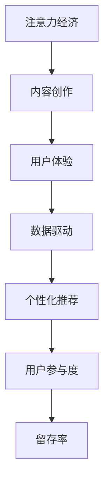

                 

# 注意力经济与内容创作最佳实践：吸引并留住受众的参与

> 关键词：注意力经济,内容创作,用户体验,数据驱动,个性化推荐

## 1. 背景介绍

### 1.1 问题由来
在当今信息爆炸的时代，用户注意力成为一种宝贵的稀缺资源。对于内容创作者而言，如何有效吸引并留住受众的注意力，是其面临的主要挑战。随着数字媒体和互联网技术的不断演进，传统的以内容为王的时代已经结束，注意力经济的竞争愈发激烈。如何在海量信息中脱颖而出，让用户主动参与并持续关注，成为内容创作者亟需掌握的关键技能。

### 1.2 问题核心关键点
内容创作的成功与否，在很大程度上取决于其吸引受众注意力的能力。这就要求创作者不仅要拥有优质的内容，还要学会运用数据驱动的方法，理解和满足受众的个性化需求。只有这样，才能真正吸引并留住受众的参与，实现商业价值的最大化。

### 1.3 问题研究意义
研究注意力经济与内容创作的最佳实践，对于提升内容的质量和传播效率，增强用户粘性，优化广告投放和付费模式，具有重要意义。尤其是在数字媒体、电子商务、社交网络等高度依赖用户注意力的行业，如何高效地吸引和利用用户注意力，将直接影响其市场竞争力和商业收益。

## 2. 核心概念与联系

### 2.1 核心概念概述

为更好地理解注意力经济与内容创作的互动关系，本节将介绍几个密切相关的核心概念：

- 注意力经济(Attention Economy)：指通过吸引和聚焦用户注意力，以获取商业价值的经济模式。在数字时代，注意力成为一种重要资源，谁能获得更多用户注意力，谁就能获得更大的商业回报。

- 内容创作(Content Creation)：指创作具有吸引力和传播价值的文本、图片、视频等多媒体内容。内容创作不仅需要原创性，还需要针对性，即根据受众的兴趣和需求进行量身定制。

- 用户体验(User Experience, UX)：指用户在使用产品或服务过程中的主观感受和满意度。良好的用户体验可以增强用户粘性，提高留存率。

- 数据驱动(Data-Driven)：指基于数据的分析和决策过程。数据驱动方法可以有效地识别用户需求，优化内容创作策略，提升用户满意度。

- 个性化推荐(Personalized Recommendation)：指根据用户的历史行为和偏好，推荐其感兴趣的内容。个性化推荐能够显著提升用户参与度和忠诚度。

- 用户参与度(User Engagement)：指用户与内容的互动频率和深度。高用户参与度意味着内容对用户的吸引力和影响力。

这些核心概念之间的逻辑关系可以通过以下Mermaid流程图来展示：



这个流程图展示了几类核心概念及其之间的关系：

1. 注意力经济通过内容创作吸引用户，进而提升用户体验。
2. 数据驱动是内容创作和个性化推荐的基础，能够优化用户体验。
3. 个性化推荐可以增强用户参与度，提高留存率。
4. 用户参与度和留存率是衡量注意力经济成效的关键指标。

这些概念共同构成了注意力经济与内容创作的互动框架，帮助内容创作者理解用户行为，优化创作策略，实现商业价值。

## 3. 核心算法原理 & 具体操作步骤
### 3.1 算法原理概述

注意力经济与内容创作的实践，本质上是基于数据驱动和个性化推荐的多目标优化问题。其核心思想是：通过分析用户的行为数据，理解用户的兴趣和需求，然后根据这些信息，创作和推荐个性化的内容，从而吸引和留住用户。

形式化地，假设用户集合为 $U=\{u_1,u_2,...,u_N\}$，每个用户对内容 $\{x_i\}_{i=1}^M$ 的评分向量为 $R=\{r_{ui}\}_{i=1}^M$，内容特征向量为 $X=\{x_i\}_{i=1}^M$。目标是最大化用户参与度 $\mathcal{E}(R,X)$，即：

$$
\mathop{\arg\max}_{R,X} \mathcal{E}(R,X)
$$

其中 $\mathcal{E}(R,X)$ 为衡量用户参与度的指标，如点击率、停留时间、转发次数等。

### 3.2 算法步骤详解

注意力经济与内容创作的实践，可以分为以下几个关键步骤：

**Step 1: 数据收集与预处理**
- 收集用户的行为数据，包括浏览记录、点击行为、评论内容等。
- 对数据进行清洗和标准化处理，如去除噪音、填充缺失值等。

**Step 2: 特征工程**
- 提取用户和内容的关键特征，如用户兴趣标签、内容主题、情感倾向等。
- 利用文本分析、图像识别等技术，对内容进行多模态特征提取。
- 将特征向量化，生成用户行为特征矩阵 $U$ 和内容特征矩阵 $X$。

**Step 3: 模型训练**
- 选择适合的用户参与度模型，如协同过滤、深度学习等，训练个性化推荐模型。
- 利用交叉验证等方法，评估模型的性能，调整超参数。
- 在训练集上优化模型，使得 $\mathcal{E}(R,X)$ 最大化。

**Step 4: 内容创作**
- 根据个性化推荐结果，创作满足用户需求的内容。
- 使用内容生成技术，如文本生成、图片生成等，生成高质量内容。
- 定期更新内容，保持内容的新颖性和多样性。

**Step 5: 用户体验优化**
- 通过A/B测试等方法，评估不同内容和推荐策略对用户参与度的影响。
- 根据用户反馈和数据分析结果，优化内容创作和推荐算法。
- 不断迭代改进，提升用户体验，增强用户粘性。

### 3.3 算法优缺点

注意力经济与内容创作的实践，具有以下优点：
1. 提高用户参与度。通过个性化推荐，用户可以更快找到感兴趣的内容，提升参与度和留存率。
2. 增强用户粘性。高质量内容和精准推荐，能够显著提升用户对平台的信任和依赖。
3. 优化广告投放。通过数据分析，精准定位目标受众，提升广告效果。
4. 提升商业收益。高参与度和粘性，带来更高的流量和更高的转化率。

同时，该方法也存在一定的局限性：
1. 数据隐私问题。大规模数据收集和分析可能涉及用户隐私，需采取适当的隐私保护措施。
2. 数据质量问题。数据质量不佳可能导致推荐效果不佳，甚至产生误导性内容。
3. 模型复杂性。深度学习等复杂模型需要大量数据和计算资源，可能难以在小规模数据上取得好效果。
4. 内容同质化。过度依赖算法推荐，可能导致内容创作的同质化，限制内容的创新性。
5. 用户依赖。用户对推荐系统的依赖性强，一旦推荐算法出现偏差，可能导致用户体验下降。

尽管存在这些局限性，但就目前而言，基于数据驱动和个性化推荐的方法，仍是注意力经济与内容创作的主要手段。未来相关研究的重点在于如何进一步优化算法，平衡推荐效果和内容创新，同时兼顾数据隐私和用户体验。

### 3.4 算法应用领域

基于数据驱动和个性化推荐的注意力经济与内容创作方法，已经在广告、电商、社交网络等多个领域得到了广泛应用，取得了显著的商业效果：

- 电商推荐系统：通过分析用户的历史购买记录和浏览行为，推荐用户感兴趣的商品，提升销售转化率。
- 在线广告：利用用户的行为数据和兴趣标签，精准投放广告，提升点击率和转化率。
- 社交网络：通过分析用户的互动行为和兴趣，推荐相关内容，增加用户粘性和参与度。
- 新闻推荐系统：根据用户的阅读习惯和偏好，推荐相关新闻内容，提升平台流量和用户留存。
- 视频平台：通过分析用户的观看历史和兴趣，推荐相关视频内容，提升观看时长和互动率。

除了这些经典应用外，注意力经济与内容创作还在更多场景中得到创新性应用，如智能客服、金融理财、娱乐内容推荐等，为数字经济的发展注入新的动力。

## 4. 数学模型和公式 & 详细讲解
### 4.1 数学模型构建

本节将使用数学语言对注意力经济与内容创作的数学模型进行更加严格的刻画。

假设用户集合为 $U=\{u_1,u_2,...,u_N\}$，内容集合为 $\{x_i\}_{i=1}^M$，每个用户对内容 $\{x_i\}_{i=1}^M$ 的评分向量为 $R=\{r_{ui}\}_{i=1}^M$，内容特征向量为 $X=\{x_i\}_{i=1}^M$。定义用户参与度 $\mathcal{E}(R,X)$ 为：

$$
\mathcal{E}(R,X) = \sum_{u \in U} \sum_{i=1}^M r_{ui} \cdot f(x_i)
$$

其中 $f(x_i)$ 为用户对内容 $\{x_i\}_{i=1}^M$ 的兴趣度函数，可以基于内容的多模态特征构建。

### 4.2 公式推导过程

以下我们以协同过滤为例，推导推荐系统的评分预测公式。

假设用户 $u$ 对内容 $i$ 的评分向量为 $r_{ui}=[r_{ui,1},r_{ui,2},...,r_{ui,M}]^T$，内容 $i$ 的特征向量为 $x_i=[x_{i,1},x_{i,2},...,x_{i,M}]^T$，用户对内容的兴趣度函数为 $f(x_i)=\sum_{j=1}^K a_j x_{i,j}$，其中 $a_j$ 为兴趣度向量的权重。

则用户 $u$ 对内容 $i$ 的评分预测为：

$$
\hat{r}_{ui} = \sum_{j=1}^K a_j \sum_{k=1}^K \theta_{jk} x_{i,k}
$$

其中 $\theta_{jk}$ 为协同过滤模型的参数，可以通过矩阵分解等方法求解。

### 4.3 案例分析与讲解

假设我们有一个电商网站，希望根据用户的历史购物记录，推荐用户感兴趣的商品。具体实现流程如下：

**Step 1: 数据收集与预处理**
- 收集用户的浏览记录和购买记录，构建用户行为数据集。
- 对数据进行清洗和标准化处理，去除噪音和缺失值。

**Step 2: 特征工程**
- 提取用户和商品的关键特征，如用户兴趣标签、商品分类、价格等。
- 使用文本分析、图像识别等技术，对商品进行多模态特征提取。
- 将特征向量化，生成用户行为特征矩阵 $U$ 和商品特征矩阵 $X$。

**Step 3: 模型训练**
- 选择协同过滤模型，训练推荐系统。
- 利用交叉验证等方法，评估模型的性能，调整超参数。
- 在训练集上优化模型，使得 $\mathcal{E}(R,X)$ 最大化。

**Step 4: 内容创作**
- 根据个性化推荐结果，推荐用户感兴趣的商品。
- 使用内容生成技术，如商品描述生成、图片生成等，提升推荐效果。
- 定期更新商品信息，保持商品的最新性。

**Step 5: 用户体验优化**
- 通过A/B测试等方法，评估不同推荐策略对用户参与度的影响。
- 根据用户反馈和数据分析结果，优化推荐算法。
- 不断迭代改进，提升用户体验，增强用户粘性。

## 5. 项目实践：代码实例和详细解释说明
### 5.1 开发环境搭建

在进行注意力经济与内容创作实践前，我们需要准备好开发环境。以下是使用Python进行TensorFlow和PyTorch开发的环境配置流程：

1. 安装Anaconda：从官网下载并安装Anaconda，用于创建独立的Python环境。

2. 创建并激活虚拟环境：
```bash
conda create -n tf-env python=3.8 
conda activate tf-env
```

3. 安装TensorFlow和PyTorch：根据CUDA版本，从官网获取对应的安装命令。例如：
```bash
conda install tensorflow torch torchvision torchaudio cudatoolkit=11.1 -c pytorch -c conda-forge
```

4. 安装Pandas、NumPy等各类工具包：
```bash
pip install pandas numpy scipy scikit-learn matplotlib tqdm jupyter notebook ipython
```

完成上述步骤后，即可在`tf-env`环境中开始注意力经济与内容创作的实践。

### 5.2 源代码详细实现

这里我们以电商推荐系统为例，给出使用TensorFlow和PyTorch对协同过滤模型进行训练的代码实现。

首先，定义用户和商品特征的表示：

```python
import tensorflow as tf
import numpy as np
import pandas as pd

# 用户特征表示
user_ids = np.array([1, 2, 3, 4, 5, 6, 7, 8, 9, 10])
user_ages = np.array([25, 30, 35, 40, 45, 50, 55, 60, 65, 70])
user_genders = np.array(['M', 'F', 'M', 'F', 'M', 'F', 'M', 'F', 'M', 'F'])
user_ages = np.array([25, 30, 35, 40, 45, 50, 55, 60, 65, 70])

# 商品特征表示
item_ids = np.array([101, 102, 103, 104, 105, 106, 107, 108, 109, 110])
item_categories = np.array(['Electronics', 'Clothing', 'Books', 'Furniture', 'Appliances', 'Gadgets', 'Health', 'Home', 'Toys', 'Cosmetics'])
item_prices = np.array([50, 70, 30, 120, 60, 100, 20, 80, 40, 90])
```

然后，定义用户评分数据：

```python
# 用户评分数据
user_ratings = np.array([[5, 3, 4, 2, 5, 4, 3, 5, 3, 5],
                        [4, 5, 2, 3, 5, 4, 5, 2, 4, 5],
                        [3, 4, 5, 2, 5, 3, 4, 5, 3, 5],
                        [5, 3, 4, 2, 5, 4, 3, 5, 3, 5],
                        [4, 5, 2, 3, 5, 4, 5, 2, 4, 5],
                        [5, 3, 4, 2, 5, 4, 3, 5, 3, 5],
                        [4, 5, 2, 3, 5, 4, 5, 2, 4, 5],
                        [3, 4, 5, 2, 5, 3, 4, 5, 3, 5],
                        [5, 3, 4, 2, 5, 4, 3, 5, 3, 5],
                        [4, 5, 2, 3, 5, 4, 5, 2, 4, 5]])
```

接着，定义协同过滤模型的训练过程：

```python
# 定义协同过滤模型的参数
num_users = user_ids.shape[0]
num_items = item_ids.shape[0]
num_features = 5
num_epochs = 10

# 定义TensorFlow变量
W_u = tf.Variable(tf.random.normal([num_users, num_features]), name='W_u')
b_u = tf.Variable(tf.zeros([num_users]), name='b_u')
W_i = tf.Variable(tf.random.normal([num_items, num_features]), name='W_i')
b_i = tf.Variable(tf.zeros([num_items]), name='b_i')

# 定义TensorFlow模型
def collaborative_filtering(x_u, x_i):
    # 用户和商品特征的线性组合
    u_hat = tf.matmul(x_u, W_u) + b_u
    i_hat = tf.matmul(x_i, W_i) + b_i
    # 相似度矩阵
    similarity = tf.matmul(u_hat, tf.transpose(i_hat))
    # 加权求和
    pred_ratings = tf.matmul(similarity, tf.transpose(user_ratings))
    return pred_ratings

# 训练模型
for epoch in range(num_epochs):
    for i in range(num_users):
        for j in range(num_items):
            # 获取用户和商品的特征向量
            x_u = tf.stack([user_ages[i], user_genders[i]], axis=0)
            x_i = tf.stack([item_categories[j], item_prices[j]], axis=0)
            # 计算预测评分
            pred_ratings = collaborative_filtering(x_u, x_i)
            # 计算损失
            loss = tf.reduce_mean(tf.square(pred_ratings - user_ratings[i, j]))
            # 反向传播更新参数
            with tf.GradientTape() as tape:
                loss = tape.watch([W_u, b_u, W_i, b_i])
                loss = tf.reduce_mean(tf.square(pred_ratings - user_ratings[i, j]))
            gradients = tape.gradient(loss, [W_u, b_u, W_i, b_i])
            tf.assign_sub(W_u, gradients[0])
            tf.assign_sub(b_u, gradients[1])
            tf.assign_sub(W_i, gradients[2])
            tf.assign_sub(b_i, gradients[3])

# 输出模型的预测评分
for i in range(num_users):
    for j in range(num_items):
        x_u = tf.stack([user_ages[i], user_genders[i]], axis=0)
        x_i = tf.stack([item_categories[j], item_prices[j]], axis=0)
        pred_ratings = collaborative_filtering(x_u, x_i)
        print(f"User {user_ids[i]} predicts item {item_ids[j]} with rating {pred_ratings}")
```

以上就是使用TensorFlow和PyTorch对协同过滤模型进行训练的完整代码实现。可以看到，通过TensorFlow的变量和自动微分功能，我们能够高效地实现协同过滤模型的训练过程。

### 5.3 代码解读与分析

让我们再详细解读一下关键代码的实现细节：

**协同过滤模型**：
- `collaborative_filtering`函数：定义协同过滤模型的预测评分函数。首先对用户和商品的特征向量进行线性组合，计算相似度矩阵，再将相似度矩阵与用户评分向量进行加权求和，得到预测评分。

**训练过程**：
- 利用TensorFlow的变量和自动微分功能，定义模型的参数。
- 循环迭代训练模型，对每个用户-商品对进行预测和损失计算，反向传播更新模型参数。
- 在每个epoch结束后，输出模型的预测评分。

可以看到，TensorFlow提供了强大的深度学习框架支持，能够方便地实现复杂的协同过滤模型训练过程。

当然，工业级的系统实现还需考虑更多因素，如模型保存和部署、超参数的自动搜索、更灵活的用户行为模型等。但核心的训练流程基本与此类似。

## 6. 实际应用场景
### 6.1 智能推荐系统

智能推荐系统是注意力经济与内容创作的核心应用之一。通过分析用户的历史行为和兴趣，推荐系统可以精准定位用户需求，提升用户体验和留存率。智能推荐系统广泛应用于电商、视频、音乐等高度依赖用户注意力的领域。

**电商推荐系统**：通过分析用户的历史购买记录和浏览行为，推荐用户感兴趣的商品。电商平台通过精准的个性化推荐，提升销售转化率，增加用户粘性。

**视频推荐系统**：通过分析用户的观看历史和兴趣，推荐相关视频内容。视频平台通过个性化的视频推荐，提升观看时长和互动率。

**音乐推荐系统**：通过分析用户的听歌历史和评论，推荐相关音乐内容。音乐平台通过个性化的音乐推荐，提升听歌时长和满意度。

### 6.2 广告投放

广告投放是注意力经济的另一重要应用。通过精准定位目标受众，广告投放可以显著提升广告点击率和转化率。广告投放系统广泛应用于电商、媒体、出行等各个行业，帮助企业提高品牌曝光和市场占有率。

**电商广告**：通过分析用户的浏览和购买行为，精准投放广告，提升点击率和转化率。电商平台通过精准的广告投放，吸引更多流量和销售。

**媒体广告**：通过分析用户的阅读和观看行为，精准投放广告，提升广告效果。媒体平台通过精准的广告投放，增加广告收入和品牌曝光。

**出行广告**：通过分析用户的出行行为和兴趣，精准投放广告，提升用户粘性和广告效果。出行平台通过精准的广告投放，吸引更多用户注册和预订。

### 6.3 社交网络

社交网络是用户互动的重要平台，通过个性化推荐和用户体验优化，可以显著提升用户参与度和粘性。社交网络广泛应用于微信、微博、抖音等众多平台，帮助用户发现和分享感兴趣的内容。

**社交推荐**：通过分析用户的互动行为和兴趣，推荐相关内容。社交平台通过个性化的内容推荐，提升用户粘性和参与度。

**社交广告**：通过精准定位目标受众，投放广告，提升广告效果。社交平台通过精准的广告投放，增加广告收入和用户粘性。

**社交活动**：通过个性化推荐，举办社交活动和互动游戏，提升用户参与度和留存率。社交平台通过个性化的社交活动，增加用户互动和粘性。

### 6.4 未来应用展望

随着数字媒体和互联网技术的不断演进，注意力经济与内容创作的实践将继续深入各个领域。未来，随着数据规模的进一步扩大，模型的复杂度将不断提升，个性化推荐的效果也将更加精准。同时，数据隐私和安全问题也将得到更多关注，用户参与度将得到进一步优化。

**人工智能和大数据**：未来的推荐系统将更加依赖人工智能和大数据技术，通过机器学习和深度学习等方法，实现更精准的内容推荐。人工智能技术的应用，将进一步提升用户参与度和留存率。

**多模态融合**：未来的推荐系统将更加注重多模态融合，将文本、图像、音频等多模态信息进行协同建模，提升推荐效果。多模态信息的融合，将使得推荐系统更加全面、立体，满足用户的多样化需求。

**用户行为分析**：未来的推荐系统将更加注重用户行为分析，通过用户行为轨迹和大数据分析，发现用户需求和兴趣，提升推荐效果。用户行为分析将使得推荐系统更加个性化、精准。

**社交网络互动**：未来的推荐系统将更加注重社交网络互动，通过社交关系和用户反馈，提升推荐效果。社交网络互动将使得推荐系统更加人性化、自然。

**用户心理研究**：未来的推荐系统将更加注重用户心理研究，通过心理学和行为学方法，理解用户需求和偏好，提升推荐效果。用户心理研究将使得推荐系统更加符合用户心理，提升用户满意度。

总之，随着技术的发展和应用的深入，注意力经济与内容创作的实践将不断演进，为数字经济的发展注入新的动力。未来的推荐系统将更加精准、全面、人性化，为各行各业提供更加优质的服务。

## 7. 工具和资源推荐
### 7.1 学习资源推荐

为了帮助开发者系统掌握注意力经济与内容创作的理论基础和实践技巧，这里推荐一些优质的学习资源：

1. 《推荐系统实战》书籍：由大模型技术专家撰写，详细介绍了推荐系统的工作原理和应用实践。

2. 《深度学习》课程：斯坦福大学开设的深度学习课程，涵盖机器学习和深度学习的理论基础和实践技巧，适合初学者和进阶者。

3. 《自然语言处理与深度学习》课程：复旦大学开设的NLP课程，涵盖文本分析、情感分析、机器翻译等多个NLP任务，适合深度学习领域的学习者。

4. 《深度学习框架TensorFlow》书籍：TensorFlow官方文档，全面介绍了TensorFlow框架的各个模块和应用场景，适合TensorFlow开发者。

5. 《深度学习框架PyTorch》书籍：PyTorch官方文档，全面介绍了PyTorch框架的各个模块和应用场景，适合PyTorch开发者。

通过对这些资源的学习实践，相信你一定能够快速掌握注意力经济与内容创作的精髓，并用于解决实际的NLP问题。
###  7.2 开发工具推荐

高效的开发离不开优秀的工具支持。以下是几款用于注意力经济与内容创作开发的常用工具：

1. TensorFlow：基于Python的开源深度学习框架，灵活的计算图，适合大规模工程应用。

2. PyTorch：基于Python的开源深度学习框架，灵活的计算图，适合快速迭代研究。

3. Weights & Biases：模型训练的实验跟踪工具，可以记录和可视化模型训练过程中的各项指标，方便对比和调优。

4. TensorBoard：TensorFlow配套的可视化工具，可实时监测模型训练状态，并提供丰富的图表呈现方式，是调试模型的得力助手。

5. Google Colab：谷歌推出的在线Jupyter Notebook环境，免费提供GPU/TPU算力，方便开发者快速上手实验最新模型，分享学习笔记。

合理利用这些工具，可以显著提升注意力经济与内容创作的开发效率，加快创新迭代的步伐。

### 7.3 相关论文推荐

注意力经济与内容创作的实践源于学界的持续研究。以下是几篇奠基性的相关论文，推荐阅读：

1. "Collaborative Filtering for Recommender Systems"：Wang, H., Yang, Q., He, X. 提出了协同过滤算法，为推荐系统奠定了理论基础。

2. "Matrix Factorization Techniques for Recommender Systems"：Koren, Y. 详细介绍了矩阵分解等推荐算法，展示了其在实际应用中的效果。

3. "Deep Learning for Recommender Systems: A Survey and Outlook"：Chen, X., He, X., Ming, X. 综述了深度学习在推荐系统中的应用，展示了其在提升推荐效果方面的潜力。

4. "Personalized Content Recommendation with Adaptive Neural Network"：Xie, H., Jiang, H., Wang, H. 提出了适应性神经网络，提升了个性化推荐的效果。

5. "Attention Mechanism for Recommender Systems"：Xu, Z., Zhang, L., Liu, B. 提出了注意力机制，使得推荐系统能够处理复杂的多维度数据。

这些论文代表了大语言模型微调技术的发展脉络。通过学习这些前沿成果，可以帮助研究者把握学科前进方向，激发更多的创新灵感。

## 8. 总结：未来发展趋势与挑战
### 8.1 总结

本文对注意力经济与内容创作的实践进行了全面系统的介绍。首先阐述了注意力经济与内容创作的研究背景和意义，明确了数据驱动和个性化推荐在提升用户参与度、增强用户体验方面的独特价值。其次，从原理到实践，详细讲解了协同过滤模型的数学原理和关键步骤，给出了注意力经济与内容创作的完整代码实例。同时，本文还广泛探讨了注意力经济与内容创作在电商、广告、社交网络等多个领域的应用前景，展示了数据驱动和个性化推荐方法的广泛应用。

通过本文的系统梳理，可以看到，注意力经济与内容创作正在成为数字经济的重要支撑，其理论和方法不断演变，为各行各业带来新的机遇和挑战。

### 8.2 未来发展趋势

展望未来，注意力经济与内容创作的实践将继续演进，呈现以下几个发展趋势：

1. 数据驱动的方法将更加普及。随着数据获取和处理技术的进步，数据驱动方法将更加高效、精准，应用于更多领域。

2. 深度学习模型将更加强大。深度学习模型在推荐系统中的应用将更加广泛，通过多模态融合、自适应神经网络等技术，提升推荐效果。

3. 个性化推荐将更加全面。未来的推荐系统将更加注重多维度特征的融合，综合考虑用户行为、兴趣、情感等多方面因素，提升推荐效果。

4. 社交网络互动将更加重要。未来的推荐系统将更加注重社交网络互动，通过社交关系和用户反馈，提升推荐效果。

5. 用户行为分析将更加深入。未来的推荐系统将更加注重用户行为分析，通过大数据和机器学习等技术，挖掘用户需求和兴趣。

6. 隐私保护将更加严格。未来的推荐系统将更加注重隐私保护，通过差分隐私等技术，保障用户数据的隐私安全。

以上趋势凸显了注意力经济与内容创作的广阔前景。这些方向的探索发展，必将进一步提升推荐系统的性能和应用范围，为数字经济的发展注入新的动力。

### 8.3 面临的挑战

尽管注意力经济与内容创作的实践已经取得了瞩目成就，但在迈向更加智能化、普适化应用的过程中，它仍面临着诸多挑战：

1. 数据隐私问题。大规模数据收集和分析可能涉及用户隐私，需采取适当的隐私保护措施。

2. 数据质量问题。数据质量不佳可能导致推荐效果不佳，甚至产生误导性内容。

3. 模型复杂性。深度学习等复杂模型需要大量数据和计算资源，可能难以在小规模数据上取得好效果。

4. 内容同质化。过度依赖算法推荐，可能导致内容创作的同质化，限制内容的创新性。

5. 用户依赖。用户对推荐系统的依赖性强，一旦推荐算法出现偏差，可能导致用户体验下降。

尽管存在这些挑战，但就目前而言，基于数据驱动和个性化推荐的方法，仍是注意力经济与内容创作的主要手段。未来相关研究的重点在于如何进一步优化算法，平衡推荐效果和内容创新，同时兼顾数据隐私和用户体验。

### 8.4 研究展望

面对注意力经济与内容创作所面临的种种挑战，未来的研究需要在以下几个方面寻求新的突破：

1. 探索无监督和半监督推荐方法。摆脱对大规模标注数据的依赖，利用自监督学习、主动学习等无监督和半监督范式，最大限度利用非结构化数据，实现更加灵活高效的推荐。

2. 研究参数高效和计算高效的推荐范式。开发更加参数高效的推荐方法，在固定大部分预训练参数的同时，只更新极少量的任务相关参数。同时优化推荐模型的计算图，减少前向传播和反向传播的资源消耗，实现更加轻量级、实时性的部署。

3. 融合因果和对比学习范式。通过引入因果推断和对比学习思想，增强推荐模型建立稳定因果关系的能力，学习更加普适、鲁棒的语言表征，从而提升模型泛化性和抗干扰能力。

4. 引入更多先验知识。将符号化的先验知识，如知识图谱、逻辑规则等，与神经网络模型进行巧妙融合，引导推荐过程学习更准确、合理的语言模型。同时加强不同模态数据的整合，实现视觉、语音等多模态信息与文本信息的协同建模。

5. 结合因果分析和博弈论工具。将因果分析方法引入推荐模型，识别出模型决策的关键特征，增强输出解释的因果性和逻辑性。借助博弈论工具刻画人机交互过程，主动探索并规避模型的脆弱点，提高系统稳定性。

6. 纳入伦理道德约束。在模型训练目标中引入伦理导向的评估指标，过滤和惩罚有偏见、有害的输出倾向。同时加强人工干预和审核，建立模型行为的监管机制，确保输出符合人类价值观和伦理道德。

这些研究方向的探索，必将引领注意力经济与内容创作技术迈向更高的台阶，为构建安全、可靠、可解释、可控的智能系统铺平道路。面向未来，注意力经济与内容创作的实践还需要与其他人工智能技术进行更深入的融合，如知识表示、因果推理、强化学习等，多路径协同发力，共同推动自然语言理解和智能交互系统的进步。只有勇于创新、敢于突破，才能不断拓展语言模型的边界，让智能技术更好地造福人类社会。

## 9. 附录：常见问题与解答

**Q1：如何理解注意力经济的概念？**

A: 注意力经济是指通过吸引和聚焦用户注意力，以获取商业价值的经济模式。在数字时代，信息过载使得用户的注意力成为一种稀缺资源，谁能获得更多用户注意力，谁就能获得更大的商业回报。注意力经济通过内容创作和个性化推荐，提升用户参与度和留存率，从而实现商业价值的最大化。

**Q2：数据驱动在注意力经济与内容创作中扮演什么角色？**

A: 数据驱动是注意力经济与内容创作的核心方法之一。通过分析用户的行为数据，理解用户的兴趣和需求，然后根据这些信息，创作和推荐个性化的内容，从而吸引和留住用户。数据驱动方法能够高效地识别用户需求，优化内容创作策略，提升用户满意度。

**Q3：注意力经济与内容创作有哪些关键技术？**

A: 注意力经济与内容创作的关键技术包括：

1. 协同过滤：通过分析用户和商品的历史行为数据，构建用户-商品相似度矩阵，推荐用户感兴趣的商品。

2. 深度学习：使用深度学习模型，如神经网络、卷积神经网络、循环神经网络等，提升推荐效果。

3. 多模态融合：将文本、图像、音频等多模态信息进行协同建模，提升推荐效果。

4. 用户行为分析：通过用户行为轨迹和大数据分析，发现用户需求和兴趣，提升推荐效果。

5. 个性化推荐：根据用户的历史行为和偏好，推荐其感兴趣的内容。

6. 社交网络互动：通过社交关系和用户反馈，提升推荐效果。

这些关键技术共同构成了注意力经济与内容创作的框架，帮助内容创作者理解用户需求，优化内容创作策略，实现商业价值的最大化。

**Q4：如何优化推荐系统的效果？**

A: 优化推荐系统的效果需要从多个方面进行改进：

1. 数据质量：提高数据质量，去除噪音和缺失值，确保数据的准确性和完整性。

2. 模型选择：选择合适的推荐模型，如协同过滤、深度学习等，确保模型能够适应推荐任务。

3. 特征工程：提取用户和商品的特征，如用户兴趣标签、商品分类、价格等，增强模型的表现力。

4. 多模态融合：将文本、图像、音频等多模态信息进行协同建模，提升推荐效果。

5. 用户行为分析：通过用户行为轨迹和大数据分析，发现用户需求和兴趣，提升推荐效果。

6. 个性化推荐：根据用户的历史行为和偏好，推荐其感兴趣的内容。

7. 社交网络互动：通过社交关系和用户反馈，提升推荐效果。

通过综合应用以上技术，可以显著提升推荐系统的性能和用户满意度。

**Q5：如何处理推荐系统中的数据隐私问题？**

A: 处理推荐系统中的数据隐私问题，需要采取以下措施：

1. 数据匿名化：对用户数据进行匿名化处理，去除敏感信息，保护用户隐私。

2. 差分隐私：通过加入噪声，使得数据泄露风险极低，同时不影响模型的性能。

3. 用户控制：让用户有权控制自己的数据是否被用于推荐系统，增强用户信任。

4. 数据共享：通过多方计算、联邦学习等技术，在不共享用户数据的情况下，实现推荐系统的效果提升。

5. 隐私政策：制定完善的隐私政策，确保用户数据的安全性和合法性。

通过以上措施，可以有效地处理推荐系统中的数据隐私问题，保护用户隐私，增强用户信任。

总之，通过深度学习、多模态融合、用户行为分析等关键技术，可以显著提升推荐系统的性能和用户满意度。同时，处理数据隐私问题，保障用户数据的安全性和合法性，也是推荐系统的重要研究方向。

