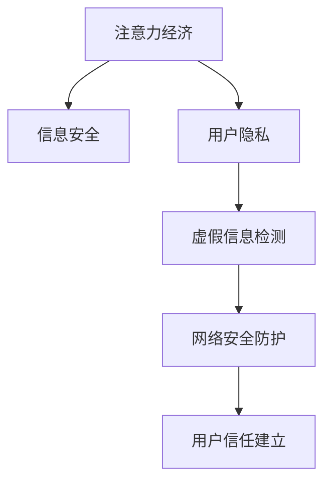

                 

# 注意力经济中的信息安全问题

随着数字经济的蓬勃发展，以用户注意力为核心资源的"注意力经济"成为新的产业增长点。注意力经济通过吸引用户注意力，实现产品价值和商业利益的最大化。在这一过程中，信息安全问题也随之凸显，信息泄露、数据滥用等风险不断加剧，亟需有效应对。

## 1. 背景介绍

### 1.1 问题由来

随着移动互联网和互联网的普及，用户注意力成为稀缺资源，越来越多的企业开始通过各种方式争夺用户眼球。在广告、内容推荐、社交网络等领域，注意力经济的应用已十分广泛。然而，信息安全问题在这些应用中也愈发凸显。

信息安全问题的严重性在于：
- 用户隐私泄露。用户的个人信息、浏览历史等数据被滥用，可能造成严重经济损失。
- 虚假信息传播。广告欺诈、假新闻等通过吸引用户注意力进行传播，对社会秩序和用户信任带来威胁。
- 网络攻击。通过窃取用户注意力，网络攻击者可能对系统进行攻击或勒索。

因此，如何在注意力经济中保护用户信息安全，成为当下重要的研究课题。

### 1.2 问题核心关键点

注意力经济中的信息安全问题涉及多个核心关键点：

- 用户注意力与数据隐私：如何平衡用户关注度和数据隐私，在用户画像生成、推荐系统构建等场景中合理利用注意力数据。
- 虚假信息检测：如何自动识别和拦截虚假信息，提升网络空间的健康程度。
- 网络安全防护：如何防止网络攻击者通过注意力盗取获取系统控制权，保障网络安全。
- 用户信任建立：如何通过技术手段增强用户对系统的信任，提高用户粘性。

本节将从用户注意力与数据隐私、虚假信息检测、网络安全防护和用户信任建立四个方面，系统介绍注意力经济中的信息安全问题。

## 2. 核心概念与联系

### 2.1 核心概念概述

为更好地理解注意力经济中的信息安全问题，本节将介绍几个密切相关的核心概念：

- 注意力经济(Attention Economy)：通过吸引和利用用户注意力，实现商业价值最大化的新兴经济模式。
- 信息安全(Information Security)：通过保护数据机密性、完整性和可用性，防止信息泄露、滥用和网络攻击。
- 用户隐私(User Privacy)：用户个人信息的收集、存储和处理过程中，保障用户知情权、选择权和控制权。
- 虚假信息(Fake Information)：通过误导、欺骗等手段传播的未经证实的信息。
- 网络攻击(Cyber Attack)：黑客利用技术手段对计算机系统或网络进行攻击，旨在获取非法利益或破坏系统功能。
- 用户信任(User Trust)：用户对企业、产品或服务可靠性、安全性、透明度的综合评价和认可。

这些概念之间的逻辑关系可以通过以下Mermaid流程图来展示：



这个流程图展示了几大核心概念之间的联系：

1. 注意力经济通过吸引用户注意力，在产品价值和商业利益上取得突破。
2. 信息安全是保障注意力经济健康运行的基础，防止信息泄露、虚假信息传播和网络攻击。
3. 用户隐私是注意力经济中的敏感数据，需在数据收集和使用过程中加以保护。
4. 虚假信息检测是应对信息安全问题的关键手段，需识别并拦截虚假信息。
5. 网络安全防护需防范网络攻击，保护系统稳定运行。
6. 用户信任建立需通过安全措施和技术手段，增强用户对系统的认可。

## 3. 核心算法原理 & 具体操作步骤
### 3.1 算法原理概述

注意力经济中的信息安全问题，本质上是通过信息安全技术，保护用户注意力数据，防止信息泄露、虚假信息传播和网络攻击。

本节将从用户注意力与数据隐私、虚假信息检测、网络安全防护和用户信任建立四个方面，详细介绍相应的核心算法原理。

### 3.2 算法步骤详解

#### 3.2.1 用户注意力与数据隐私

1. 数据收集与存储：
   - 收集用户使用产品时产生的注意力数据，如点击、浏览、互动等。
   - 在数据存储过程中，采用加密技术、访问控制等措施保护数据安全。

2. 隐私保护算法：
   - 匿名化：通过数据匿名化技术，隐藏用户个人特征，保护用户隐私。
   - 差分隐私：在数据分析时加入噪声，使得单个用户数据难以被逆推出。
   - 联邦学习：通过分布式训练，实现数据在本地处理，无需集中存储。

3. 隐私保护措施：
   - 合规性检查：确保数据处理符合GDPR等隐私法规，保护用户权益。
   - 透明化：通过数据使用说明和隐私政策，增强用户对数据处理的知情权和控制权。

#### 3.2.2 虚假信息检测

1. 数据获取与处理：
   - 从互联网获取大量的文本、图像、视频等数据。
   - 对数据进行清洗和预处理，去除噪声和无用信息。

2. 特征提取与模型训练：
   - 提取数据的语义、上下文、情感等特征。
   - 使用分类模型或深度学习模型对数据进行训练，构建虚假信息检测系统。

3. 检测与拦截：
   - 通过检测模型判断信息的真实性，对虚假信息进行拦截或标记。
   - 配合网络流量监控、行为分析等手段，提高虚假信息检测的准确率。

#### 3.2.3 网络安全防护

1. 入侵检测系统(IDS)：
   - 实时监控网络流量，识别可疑活动。
   - 根据可疑行为触发告警，并自动封锁或限制。

2. 防火墙与入侵防御系统(IPS)：
   - 在网络边界处，使用防火墙限制访问权限。
   - 使用IPS检测并阻止攻击流量，提升网络安全性。

3. 加密与身份验证：
   - 在传输过程中使用SSL/TLS加密保护数据安全。
   - 使用双因素认证、生物识别等手段验证用户身份，防止账号被盗。

4. 应急响应与恢复：
   - 制定应急响应计划，及时处理安全事件。
   - 对系统进行备份和恢复，减少数据丢失风险。

#### 3.2.4 用户信任建立

1. 透明化与信任激励：
   - 通过隐私政策、使用说明等公开数据使用方式，增强用户信任。
   - 实施信任激励机制，如优惠券、积分奖励等，鼓励用户参与。

2. 隐私管理与监督：
   - 建立隐私管理团队，制定隐私保护策略，定期审计。
   - 使用区块链技术，记录和溯源数据处理过程，增强数据透明度。

3. 用户反馈与改进：
   - 通过用户反馈系统，收集用户意见和建议。
   - 根据反馈进行产品改进和优化，提升用户满意度。

### 3.3 算法优缺点

#### 3.3.1 用户注意力与数据隐私

优点：
- 匿名化和差分隐私等技术可以保护用户隐私，避免数据泄露。
- 联邦学习等分布式算法，减少了数据集中存储的风险。

缺点：
- 匿名化处理可能导致数据失真，影响模型效果。
- 差分隐私的噪声会降低数据精度，影响分析结果。

#### 3.3.2 虚假信息检测

优点：
- 深度学习模型可以自动提取数据特征，提高检测准确率。
- 集成多源数据，可以有效降低误报和漏报率。

缺点：
- 深度学习模型训练复杂，对计算资源要求较高。
- 检测模型的泛化能力依赖于数据多样性，难以应对新型虚假信息。

#### 3.3.3 网络安全防护

优点：
- IDS、IPS、加密等技术可以有效防止网络攻击。
- 应急响应和备份恢复机制，保障系统稳定性。

缺点：
- 复杂的安全系统可能导致性能损失。
- 网络攻击技术不断发展，防护策略需要持续更新。

#### 3.3.4 用户信任建立

优点：
- 透明化与信任激励机制，增强用户信任和粘性。
- 区块链和隐私管理，提高数据透明度和可信度。

缺点：
- 隐私政策透明度和用户教育成本较高。
- 用户信任的建立和维护需要长期投入。

### 3.4 算法应用领域

基于信息安全技术的算法，在以下几个领域有广泛应用：

- 广告行业：通过虚假信息检测和网络安全防护，防止广告欺诈，保护用户隐私。
- 社交网络：通过隐私保护和用户信任管理，提升用户粘性和平台安全性。
- 金融行业：通过网络安全防护和隐私管理，保护用户账户安全，防范金融欺诈。
- 电商行业：通过网络安全防护和用户信任建立，提升交易安全，保障用户权益。
- 医疗行业：通过数据隐私保护和用户信任管理，确保患者隐私安全，增强医疗信任。

以上领域涵盖了注意力经济中常见的应用场景，借助信息安全技术，可以有效提升平台的安全性和用户信任度，推动产业健康发展。

## 4. 数学模型和公式 & 详细讲解 & 举例说明

### 4.1 数学模型构建

#### 4.1.1 用户注意力与数据隐私

设用户注意力数据集为 $D=\{(x_i, y_i)\}_{i=1}^N, x_i \in \mathcal{X}, y_i \in \{0,1\}$，其中 $x_i$ 为注意力特征，$y_i$ 为隐私标签（是否暴露）。定义隐私保护的目标为最小化隐私泄露风险，即：

$$
\min_{\theta} \mathbb{E}_{(x,y)\sim D} [\ell(x,y;\theta)]
$$

其中 $\theta$ 为隐私保护算法的参数，$\ell$ 为隐私损失函数，如K-L散度。

#### 4.1.2 虚假信息检测

设虚假信息数据集为 $D=\{(x_i, y_i)\}_{i=1}^N, x_i \in \mathcal{X}, y_i \in \{0,1\}$，其中 $x_i$ 为信息特征，$y_i$ 为虚假标签。定义虚假信息检测的目标为最大化检测准确率，即：

$$
\max_{\theta} \mathbb{E}_{(x,y)\sim D} [P(\hat{y}=y|x;\theta)]
$$

其中 $\theta$ 为检测模型的参数，$P$ 为检测概率函数，$\hat{y}$ 为检测结果。

#### 4.1.3 网络安全防护

设网络攻击数据集为 $D=\{(x_i, y_i)\}_{i=1}^N, x_i \in \mathcal{X}, y_i \in \{0,1\}$，其中 $x_i$ 为攻击特征，$y_i$ 为攻击标签。定义网络安全防护的目标为最大化防护成功率，即：

$$
\max_{\theta} \mathbb{E}_{(x,y)\sim D} [P(\hat{y}=y|x;\theta)]
$$

其中 $\theta$ 为防护模型的参数，$P$ 为防护概率函数，$\hat{y}$ 为防护结果。

#### 4.1.4 用户信任建立

设用户信任数据集为 $D=\{(x_i, y_i)\}_{i=1}^N, x_i \in \mathcal{X}, y_i \in \{0,1\}$，其中 $x_i$ 为信任特征，$y_i$ 为信任标签。定义用户信任建立的目标为最大化信任度，即：

$$
\max_{\theta} \mathbb{E}_{(x,y)\sim D} [P(\hat{y}=y|x;\theta)]
$$

其中 $\theta$ 为信任模型参数，$P$ 为信任概率函数，$\hat{y}$ 为信任度量。

### 4.2 公式推导过程

#### 4.2.1 用户注意力与数据隐私

设隐私保护算法为 $F_{\theta}(x)$，其中 $x$ 为注意力特征。隐私保护的目标是最小化隐私泄露风险，即：

$$
\min_{\theta} \mathbb{E}_{(x,y)\sim D} [\ell(y, F_{\theta}(x))]
$$

其中 $\ell$ 为隐私损失函数，如K-L散度。通过引入差分隐私技术，隐私保护算法可以表示为：

$$
F_{\theta}(x) = x + \epsilon N(\mathbf{0},\sigma^2I)
$$

其中 $N(\mathbf{0},\sigma^2I)$ 为均值为0、方差为 $\sigma^2$ 的噪声向量。

#### 4.2.2 虚假信息检测

设虚假信息检测模型为 $M_{\theta}(x)$，其中 $x$ 为信息特征。虚假信息检测的目标是最大化检测准确率，即：

$$
\max_{\theta} \mathbb{E}_{(x,y)\sim D} [P(y, M_{\theta}(x))]
$$

其中 $P$ 为检测概率函数。通过使用深度学习模型，如CNN、RNN等，可以表示为：

$$
M_{\theta}(x) = f_{\theta}(x)
$$

其中 $f_{\theta}$ 为深度学习模型的前向传播函数。

#### 4.2.3 网络安全防护

设网络安全防护模型为 $N_{\theta}(x)$，其中 $x$ 为攻击特征。网络安全防护的目标是最大化防护成功率，即：

$$
\max_{\theta} \mathbb{E}_{(x,y)\sim D} [P(y, N_{\theta}(x))]
$$

其中 $P$ 为防护概率函数。通过使用IDS、IPS等技术，可以表示为：

$$
N_{\theta}(x) = f_{\theta}(x)
$$

其中 $f_{\theta}$ 为安全防护模型的前向传播函数。

#### 4.2.4 用户信任建立

设用户信任模型为 $T_{\theta}(x)$，其中 $x$ 为信任特征。用户信任建立的目标是最大化信任度，即：

$$
\max_{\theta} \mathbb{E}_{(x,y)\sim D} [P(y, T_{\theta}(x))]
$$

其中 $P$ 为信任概率函数。通过使用区块链技术，可以表示为：

$$
T_{\theta}(x) = f_{\theta}(x)
$$

其中 $f_{\theta}$ 为信任模型的前向传播函数。

### 4.3 案例分析与讲解

#### 4.3.1 用户注意力与数据隐私

以电商平台的推荐系统为例，平台通过收集用户的点击、浏览、购买等数据，生成用户画像，用于个性化推荐。为保护用户隐私，平台采用了差分隐私技术。具体实现如下：

1. 数据收集：
   - 通过网站和APP收集用户行为数据，包含点击量、停留时间、浏览路径等。

2. 隐私保护：
   - 在数据预处理阶段，对用户ID进行匿名化处理，生成伪匿名标识符。
   - 在模型训练阶段，在每个用户特征上加入噪声，使得单个用户数据难以被逆推出。

3. 隐私政策：
   - 制定隐私政策，公开数据使用方式和隐私保护措施，增强用户知情权和控制权。

通过差分隐私技术，平台可以在保护用户隐私的前提下，利用用户数据进行推荐系统构建，提升用户体验。

#### 4.3.2 虚假信息检测

以社交媒体平台为例，平台通过虚假信息检测系统，防范虚假信息的传播。具体实现如下：

1. 数据获取：
   - 从社交网络中收集文本、图片、视频等数据，进行预处理和清洗。

2. 特征提取：
   - 提取数据中的语义、情感、来源等特征，生成文本向量。
   - 使用BERT等深度学习模型，训练虚假信息检测系统。

3. 检测与拦截：
   - 在用户发布信息时，检测系统自动判断其真实性。
   - 对于虚假信息，系统自动拦截或打上标签，避免传播。

通过虚假信息检测系统，平台可以有效识别并拦截虚假信息，维护网络空间的健康程度。

#### 4.3.3 网络安全防护

以金融机构为例，平台通过网络安全防护系统，防止网络攻击。具体实现如下：

1. IDS与IPS：
   - 部署IDS和IPS系统，实时监控网络流量。
   - 一旦检测到可疑活动，系统自动触发告警，并封锁相关流量。

2. 加密与身份验证：
   - 在用户登录时，使用SSL/TLS加密传输数据。
   - 使用双因素认证，增强用户账户的安全性。

3. 应急响应与恢复：
   - 制定应急响应计划，及时处理安全事件。
   - 定期进行系统备份，确保数据可恢复性。

通过网络安全防护系统，平台可以有效防范网络攻击，保障用户账户和数据的安全。

#### 4.3.4 用户信任建立

以医疗平台为例，平台通过用户信任管理，增强患者信任。具体实现如下：

1. 透明化与信任激励：
   - 公开隐私政策，告知患者数据使用方式。
   - 实施信任激励机制，如分享治疗案例，发放优惠券等。

2. 隐私管理与监督：
   - 建立隐私管理团队，定期审计数据处理过程。
   - 使用区块链技术，记录和溯源数据处理记录，增强透明度。

3. 用户反馈与改进：
   - 建立用户反馈系统，收集患者意见和建议。
   - 根据反馈进行产品改进和优化，提升用户满意度。

通过用户信任管理，平台可以有效增强患者信任，提升医疗服务的可靠性和安全性。

## 5. 项目实践：代码实例和详细解释说明

### 5.1 开发环境搭建

在进行信息安全技术项目实践前，我们需要准备好开发环境。以下是使用Python进行PyTorch开发的环境配置流程：

1. 安装Anaconda：从官网下载并安装Anaconda，用于创建独立的Python环境。

2. 创建并激活虚拟环境：
```bash
conda create -n pytorch-env python=3.8 
conda activate pytorch-env
```

3. 安装PyTorch：根据CUDA版本，从官网获取对应的安装命令。例如：
```bash
conda install pytorch torchvision torchaudio cudatoolkit=11.1 -c pytorch -c conda-forge
```

4. 安装各类工具包：
```bash
pip install numpy pandas scikit-learn matplotlib tqdm jupyter notebook ipython
```

完成上述步骤后，即可在`pytorch-env`环境中开始信息安全技术项目实践。

### 5.2 源代码详细实现

这里我们以虚假信息检测系统为例，给出使用PyTorch实现虚假信息检测的代码实现。

首先，定义虚假信息检测数据集和模型：

```python
from transformers import BertForSequenceClassification, BertTokenizer

# 定义数据集
class FakeNewsDataset(Dataset):
    def __init__(self, texts, labels, tokenizer, max_len=128):
        self.texts = texts
        self.labels = labels
        self.tokenizer = tokenizer
        self.max_len = max_len
        
    def __len__(self):
        return len(self.texts)
    
    def __getitem__(self, item):
        text = self.texts[item]
        label = self.labels[item]
        
        encoding = self.tokenizer(text, return_tensors='pt', max_length=self.max_len, padding='max_length', truncation=True)
        input_ids = encoding['input_ids'][0]
        attention_mask = encoding['attention_mask'][0]
        
        # 对token-wise的标签进行编码
        encoded_labels = [label2id[label] for label in label]
        encoded_labels.extend([label2id['O']] * (self.max_len - len(encoded_labels)))
        labels = torch.tensor(encoded_labels, dtype=torch.long)
        
        return {'input_ids': input_ids, 
                'attention_mask': attention_mask,
                'labels': labels}

# 标签与id的映射
label2id = {'Fake': 0, 'Real': 1}
id2label = {v: k for k, v in label2id.items()}

# 创建dataset
tokenizer = BertTokenizer.from_pretrained('bert-base-uncased')

train_dataset = FakeNewsDataset(train_texts, train_labels, tokenizer)
dev_dataset = FakeNewsDataset(dev_texts, dev_labels, tokenizer)
test_dataset = FakeNewsDataset(test_texts, test_labels, tokenizer)
```

然后，定义模型和优化器：

```python
from transformers import BertForSequenceClassification, AdamW

model = BertForSequenceClassification.from_pretrained('bert-base-uncased', num_labels=len(label2id))

optimizer = AdamW(model.parameters(), lr=2e-5)
```

接着，定义训练和评估函数：

```python
from torch.utils.data import DataLoader
from tqdm import tqdm
from sklearn.metrics import classification_report

device = torch.device('cuda') if torch.cuda.is_available() else torch.device('cpu')
model.to(device)

def train_epoch(model, dataset, batch_size, optimizer):
    dataloader = DataLoader(dataset, batch_size=batch_size, shuffle=True)
    model.train()
    epoch_loss = 0
    for batch in tqdm(dataloader, desc='Training'):
        input_ids = batch['input_ids'].to(device)
        attention_mask = batch['attention_mask'].to(device)
        labels = batch['labels'].to(device)
        model.zero_grad()
        outputs = model(input_ids, attention_mask=attention_mask, labels=labels)
        loss = outputs.loss
        epoch_loss += loss.item()
        loss.backward()
        optimizer.step()
    return epoch_loss / len(dataloader)

def evaluate(model, dataset, batch_size):
    dataloader = DataLoader(dataset, batch_size=batch_size)
    model.eval()
    preds, labels = [], []
    with torch.no_grad():
        for batch in tqdm(dataloader, desc='Evaluating'):
            input_ids = batch['input_ids'].to(device)
            attention_mask = batch['attention_mask'].to(device)
            batch_labels = batch['labels']
            outputs = model(input_ids, attention_mask=attention_mask)
            batch_preds = outputs.logits.argmax(dim=2).to('cpu').tolist()
            batch_labels = batch_labels.to('cpu').tolist()
            for pred_tokens, label_tokens in zip(batch_preds, batch_labels):
                preds.append(pred_tokens[:len(label_tokens)])
                labels.append(label_tokens)
                
    print(classification_report(labels, preds))
```

最后，启动训练流程并在测试集上评估：

```python
epochs = 5
batch_size = 16

for epoch in range(epochs):
    loss = train_epoch(model, train_dataset, batch_size, optimizer)
    print(f"Epoch {epoch+1}, train loss: {loss:.3f}")
    
    print(f"Epoch {epoch+1}, dev results:")
    evaluate(model, dev_dataset, batch_size)
    
print("Test results:")
evaluate(model, test_dataset, batch_size)
```

以上就是使用PyTorch对BERT进行虚假信息检测的完整代码实现。可以看到，得益于Transformers库的强大封装，我们可以用相对简洁的代码完成虚假信息检测任务的开发。

### 5.3 代码解读与分析

让我们再详细解读一下关键代码的实现细节：

**FakeNewsDataset类**：
- `__init__`方法：初始化文本、标签、分词器等关键组件。
- `__len__`方法：返回数据集的样本数量。
- `__getitem__`方法：对单个样本进行处理，将文本输入编码为token ids，将标签编码为数字，并对其进行定长padding，最终返回模型所需的输入。

**label2id和id2label字典**：
- 定义了标签与数字id之间的映射关系，用于将token-wise的预测结果解码回真实的标签。

**训练和评估函数**：
- 使用PyTorch的DataLoader对数据集进行批次化加载，供模型训练和推理使用。
- 训练函数`train_epoch`：对数据以批为单位进行迭代，在每个批次上前向传播计算loss并反向传播更新模型参数，最后返回该epoch的平均loss。
- 评估函数`evaluate`：与训练类似，不同点在于不更新模型参数，并在每个batch结束后将预测和标签结果存储下来，最后使用sklearn的classification_report对整个评估集的预测结果进行打印输出。

**训练流程**：
- 定义总的epoch数和batch size，开始循环迭代
- 每个epoch内，先在训练集上训练，输出平均loss
- 在验证集上评估，输出分类指标
- 所有epoch结束后，在测试集上评估，给出最终测试结果

可以看到，PyTorch配合Transformers库使得虚假信息检测任务的开发变得简洁高效。开发者可以将更多精力放在数据处理、模型改进等高层逻辑上，而不必过多关注底层的实现细节。

当然，工业级的系统实现还需考虑更多因素，如模型的保存和部署、超参数的自动搜索、更灵活的任务适配层等。但核心的微调范式基本与此类似。

## 6. 实际应用场景

### 6.1 智能广告平台

智能广告平台通过虚假信息检测技术，识别并拦截广告欺诈行为，保护用户权益。具体实现如下：

1. 数据收集：
   - 从广告主和第三方数据源收集广告数据，包含广告素材、点击率、展示率等。

2. 特征提取与模型训练：
   - 提取广告数据中的文本、图像、行为等特征，生成广告向量。
   - 使用深度学习模型，如BERT、CNN等，训练广告欺诈检测系统。

3. 检测与拦截：
   - 在广告投放时，检测系统自动判断广告的真实性。
   - 对于欺诈广告，系统自动拦截或打上标签，避免投放。

通过虚假信息检测系统，平台可以有效识别并拦截欺诈广告，提高广告投放的准确性和效益。

### 6.2 社交媒体平台

社交媒体平台通过虚假信息检测技术，防范虚假信息的传播，维护网络空间的健康程度。具体实现如下：

1. 数据获取：
   - 从社交网络中收集文本、图片、视频等数据，进行预处理和清洗。

2. 特征提取与模型训练：
   - 提取数据中的语义、情感、来源等特征，生成文本向量。
   - 使用深度学习模型，如BERT、RNN等，训练虚假信息检测系统。

3. 检测与拦截：
   - 在用户发布信息时，检测系统自动判断其真实性。
   - 对于虚假信息，系统自动拦截或打上标签，避免传播。

通过虚假信息检测系统，平台可以有效识别并拦截虚假信息，维护网络空间的健康程度。

### 6.3 在线支付平台

在线支付平台通过网络安全防护系统，防止网络攻击，保障用户账户和支付安全。具体实现如下：

1. IDS与IPS：
   - 部署IDS和IPS系统，实时监控网络流量。
   - 一旦检测到可疑活动，系统自动触发告警，并封锁相关流量。

2. 加密与身份验证：
   - 在用户登录时，使用SSL/TLS加密传输数据。
   - 使用双因素认证，增强用户账户的安全性。

3. 应急响应与恢复：
   - 制定应急响应计划，及时处理安全事件。
   - 定期进行系统备份，确保数据可恢复性。

通过网络安全防护系统，平台可以有效防范网络攻击，保障用户账户和支付安全。

### 6.4 医疗服务平台

医疗服务平台通过用户信任管理，增强患者信任，提升医疗服务的可靠性和安全性。具体实现如下：

1. 透明化与信任激励：
   - 公开隐私政策，告知患者数据使用方式。
   - 实施信任激励机制，如分享治疗案例，发放优惠券等。

2. 隐私管理与监督：
   - 建立隐私管理团队，定期审计数据处理过程。
   - 使用区块链技术，记录和溯源数据处理记录，增强透明度。

3. 用户反馈与改进：
   - 建立用户反馈系统，收集患者意见和建议。
   - 根据反馈进行产品改进和优化，提升用户满意度。

通过用户信任管理，平台可以有效增强患者信任，提升医疗服务的可靠性和安全性。

## 7. 工具和资源推荐

### 7.1 学习资源推荐

为了帮助开发者系统掌握信息安全技术的理论基础和实践技巧，这里推荐一些优质的学习资源：

1. 《信息安全原理与技术》：详细介绍了信息安全的各种技术和应用，涵盖密码学、网络安全、隐私保护等领域。
2. 《深度学习在网络安全中的应用》：介绍了深度学习在网络安全领域的应用，如入侵检测、异常检测、恶意软件检测等。
3. 《数据隐私保护理论与实践》：介绍了数据隐私保护的基本概念、技术方法和案例分析，有助于理解隐私保护算法。
4. 《虚假信息检测与治理》：介绍了虚假信息检测的方法和工具，涵盖文本、图像、视频等多模态数据的检测技术。
5. 《区块链技术与信息安全》：介绍了区块链技术在信息安全中的应用，如数字身份、智能合约等。

通过对这些资源的学习实践，相信你一定能够快速掌握信息安全技术的精髓，并用于解决实际的信息安全问题。

### 7.2 开发工具推荐

高效的开发离不开优秀的工具支持。以下是几款用于信息安全技术开发的常用工具：

1. Python：由于其强大的数据处理和模型训练能力，Python是信息安全技术开发的首选语言。
2. PyTorch：基于Python的开源深度学习框架，适合快速迭代研究。
3. TensorFlow：由Google主导开发的开源深度学习框架，适合大规模工程应用。
4. Scikit-learn：Python的机器学习库，提供了丰富的算法实现和评估工具。
5. Scrapy：Python的网络爬虫库，方便数据的收集和处理。
6. ELK Stack：Elasticsearch、Logstash和Kibana的组合，用于实时监控和日志分析。

合理利用这些工具，可以显著提升信息安全技术开发的速度和质量，加快创新迭代的步伐。

### 7.3 相关论文推荐

信息安全技术的研究源于学界的持续研究。以下是几篇奠基性的相关论文，推荐阅读：

1. "A Survey of Deep Learning Techniques for Intrusion Detection"：介绍了深度学习在网络入侵检测中的应用。
2. "Adversarial Examples in Deep Learning"：分析了深度学习模型中的对抗攻击，提出了一些防御方法。
3. "Data Privacy: Foundations, Challenges, and Tools"：介绍了数据隐私保护的基本概念和技术方法。
4. "Fabrication of the Next-Generation Privacy-Preserving Machine Learning Algorithms"：综述了隐私保护算法的最新进展。
5. "Blockchain-Based Secure Computing for Privacy-Preserving Data Mining"：介绍了区块链技术在隐私保护中的应用。

这些论文代表了大语言模型微调技术的发展脉络。通过学习这些前沿成果，可以帮助研究者把握学科前进方向，激发更多的创新灵感。

## 8. 总结：未来发展趋势与挑战

### 8.1 总结

本文对信息安全技术在注意力经济中的应用进行了系统介绍。首先阐述了信息安全问题在注意力经济中的重要性，明确了虚假信息检测、网络安全防护和用户信任建立等关键技术方向。其次，从用户注意力与数据隐私、虚假信息检测、网络安全防护和用户信任建立四个方面，详细讲解了相应的核心算法原理。最后，通过虚假信息检测系统的代码实现，展示了信息安全技术在实际应用中的落地实践。

通过本文的系统梳理，可以看到，信息安全技术是注意力经济中的关键保障，通过各种技术手段，可以有效保护用户隐私、防范虚假信息和网络攻击，增强用户信任，推动注意力经济的健康发展。未来，伴随技术的不断进步，信息安全技术还将不断进化，助力注意力经济迈向更高层次。

### 8.2 未来发展趋势

展望未来，信息安全技术将在注意力经济中持续演进，呈现出以下几个发展趋势：

1. 隐私保护技术将更加先进。基于差分隐私、联邦学习等技术的隐私保护算法将得到更广泛应用，提升用户数据的安全性。

2. 深度学习模型的应用将更加深入。深度学习技术在虚假信息检测、网络安全防护等领域的性能将进一步提升，解决更多实际问题。

3. 区块链技术将广泛应用。区块链的分布式、不可篡改特性将增强数据透明性和可信度，提升用户信任。

4. 跨模态信息融合将更加普遍。通过融合文本、图像、语音等多模态信息，构建更全面的信息安全防护体系。

5. 自动化和智能化将更加普及。利用AI技术自动化进行威胁检测、漏洞扫描、应急响应，提升信息安全管理的效率和智能化水平。

以上趋势凸显了信息安全技术的广阔前景。这些方向的探索发展，必将进一步提升信息安全技术的能力，保障注意力经济的健康运行。

### 8.3 面临的挑战

尽管信息安全技术在注意力经济中已取得显著成效，但在其发展的过程中，仍面临诸多挑战：

1. 隐私保护技术复杂度高。差分隐私、联邦学习等技术需要复杂的算法实现，对开发者和用户的技术要求较高。

2. 深度学习模型的泛化能力不足。虚假信息检测、网络安全防护等应用中，模型的泛化能力依赖于数据多样性，难以应对新型威胁。

3. 区块链技术的可扩展性问题。区块链的分布式特性使得系统扩展性受到限制，难以支持大规模应用。

4. 跨模态信息融合的技术瓶颈。不同模态数据的融合处理复杂度较高，需要解决数据格式、表示方式等方面的差异性问题。

5. 自动化和智能化技术的不完善。自动化安全检测和应急响应的技术尚不成熟，需要更多的研究和实践积累。

6. 法律和道德的挑战。信息安全技术的发展需要法律和道德的规范，防止滥用和侵犯用户权益。

正视信息安全技术面临的这些挑战，积极应对并寻求突破，将是大语言模型微调走向成熟的必由之路。相信随着学界和产业界的共同努力，这些挑战终将一一被克服，信息安全技术必将在构建安全、可靠、可控的智能系统中扮演越来越重要的角色。

### 8.4 研究展望

面对信息安全技术所面临的挑战，未来的研究需要在以下几个方面寻求新的突破：

1. 隐私保护技术的简化与优化。开发更加易用、高效的隐私保护算法，降低技术门槛，提升用户接受度。

2. 深度学习模型的泛化能力提升。引入更先进的深度学习架构和训练方法，提高模型的泛化性能和鲁棒性。

3. 区块链技术的扩展与优化。探索更高效、灵活的区块链实现方式，提升系统的可扩展性和易用性。

4. 跨模态信息融合的突破。研究更高效、通用的跨模态融合方法，提升不同模态数据的协同能力。

5. 自动化和智能化技术的完善。开发更加智能、自动化的安全检测和应急响应系统，提升系统响应速度和决策精度。

6. 法律与道德的保障。制定相关法律法规和道德规范，防止技术滥用，保障用户权益。

这些研究方向的探索，必将引领信息安全技术迈向更高的台阶，为构建安全、可靠、可控的智能系统铺平道路。面向未来，信息安全技术还需要与其他人工智能技术进行更深入的融合，如知识表示、因果推理、强化学习等，多路径协同发力，共同推动智能技术的安全发展。只有勇于创新、敢于突破，才能不断拓展信息安全技术的边界，让智能技术更好地造福人类社会。

## 9. 附录：常见问题与解答

**Q1：信息安全技术在注意力经济中的作用是什么？**

A: 信息安全技术在注意力经济中主要起到以下几个作用：

1. 保护用户隐私：通过差分隐私、匿名化等技术，保护用户个人信息不被泄露或滥用。

2. 防范虚假信息：通过深度学习模型，识别和拦截虚假信息，维护网络空间的健康程度。

3. 防范网络攻击：通过IDS、IPS、加密等技术，防止网络攻击，保障系统稳定运行。

4. 增强用户信任：通过区块链、透明化等手段，增强用户对系统的信任和认可。

**Q2：虚假信息检测系统如何进行特征提取？**

A: 虚假信息检测系统通常采用深度学习模型进行特征提取，常用的特征包括：

1. 文本特征：通过自然语言处理技术，提取文本中的语义、情感、上下文等特征。

2. 图像特征：通过图像处理技术，提取图像的纹理、形状、颜色等特征。

3. 行为特征：通过行为分析技术，提取用户的操作路径、停留时间等行为特征。

4. 多模态特征：通过融合文本、图像、语音等多模态数据，构建更全面的特征表示。

**Q3：虚假信息检测系统如何进行模型训练？**

A: 虚假信息检测系统的模型训练通常采用监督学习方法，具体步骤如下：

1. 数据获取与预处理：收集虚假信息和真实信息的样本数据，并进行预处理和清洗。

2. 特征提取：通过自然语言处理、图像处理等技术，提取数据中的特征。

3. 模型训练：使用深度学习模型（如CNN、RNN、BERT等），训练虚假信息检测模型。

4. 模型评估与优化：在测试集上评估模型性能，根据评估结果调整模型参数，优化模型性能。

**Q4：虚假信息检测系统如何进行信息拦截？**

A: 虚假信息检测系统通常采用以下步骤进行信息拦截：

1. 信息获取：从社交媒体、新闻网站等渠道获取用户发布的信息。

2. 特征提取：提取信息中的文本、图像、音频等特征。

3. 模型预测：使用虚假信息检测模型对信息进行预测，判断其真实性。

4. 信息拦截：对于虚假信息，系统自动拦截或打上标签，避免传播。

**Q5：网络安全防护系统如何进行入侵检测？**

A: 网络安全防护系统通常采用以下步骤进行入侵检测：

1. 数据获取：从网络流量中获取各种攻击特征，如IP地址、端口号、协议等。

2. 特征提取：提取攻击特征中的关键信息，生成特征向量。

3. 模型训练：使用IDS、IPS等技术，训练入侵检测模型。

4. 检测与响应：在网络流量中实时检测可疑行为，并根据检测结果触发告警或封锁。

**Q6：隐私保护技术有哪些常用方法？**

A: 隐私保护技术常用的方法包括：

1. 差分隐私：在数据分析时加入噪声，使得单个用户数据难以被逆推出。

2. 匿名化：通过数据匿名化技术，隐藏用户个人特征，保护用户隐私。

3. 联邦学习：通过分布式训练，实现数据在本地处理，无需集中存储。

4. 同态加密：在数据处理过程中，保证数据在加密状态下进行计算。

5. 多方安全计算：多个参与方在不泄露数据的情况下，共同计算出一个结果。

通过这些隐私保护技术，可以有效保护用户隐私，防止数据泄露和滥用。

---

作者：禅与计算机程序设计艺术 / Zen and the Art of Computer Programming

