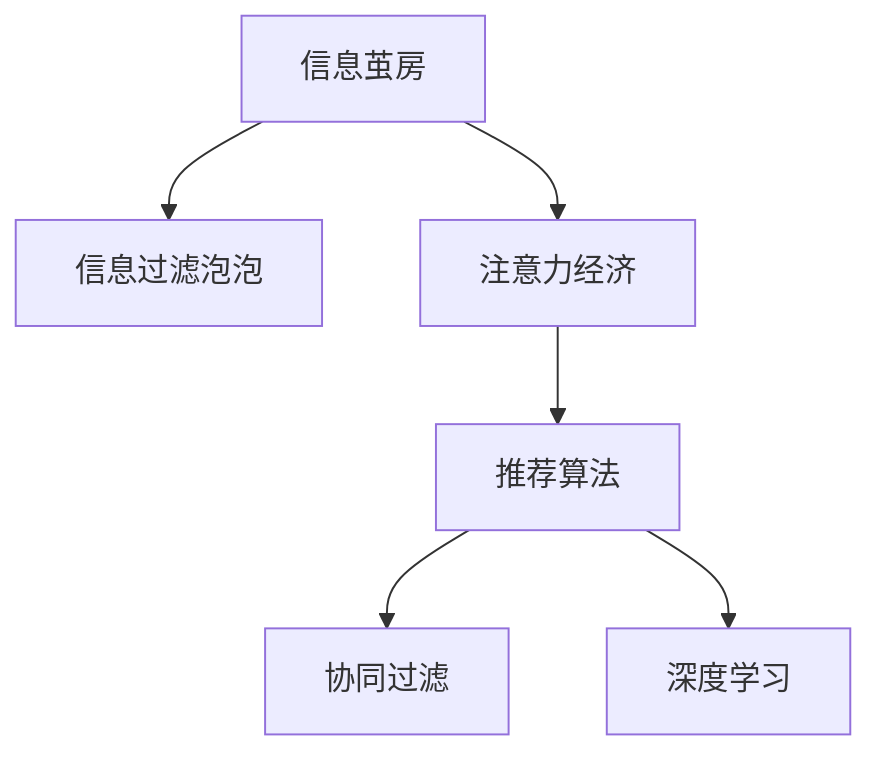

                 

## 1. 背景介绍

### 1.1 问题由来
在互联网高速发展的今天，信息洪流席卷而来，人们的生活已离不开各种数字产品和服务。然而，这一现象背后隐藏着信息茧房(Information Silo)的效应，即人们的信息获取、接收和处理方式受到固定平台和算法的引导，逐渐形成了一个个孤立的“信息孤岛”。信息茧房效应会导致信息过滤泡泡(Filter Bubble)的形成，用户只接收到与其兴趣相符的信息，而过滤掉其他内容，从而限制了信息的多样性和用户的视野。

### 1.2 问题核心关键点
信息茧房效应的核心在于，平台如何利用算法机制过滤和推荐信息，使得用户只能接触到与自己兴趣、偏好相符的内容。这种机制在一定程度上提升了用户体验，但同时也造成了信息的同质化和局限性。如何平衡用户体验与信息多样性，打破信息茧房，是当前信息安全、公平性和透明性研究的重要课题。

## 2. 核心概念与联系

### 2.1 核心概念概述

- **信息茧房**：用户只接收与自身兴趣和观点相符的信息，而被其他内容隔离的现象。
- **信息过滤泡泡**：由推荐算法等机制引导，用户仅接触到符合其个人兴趣和偏好的信息。
- **注意力经济**：以用户注意力为稀缺资源的市场，通过各种算法和产品设计来吸引和保持用户注意力，实现商业变现。
- **推荐算法**：通过分析用户历史行为数据，预测用户偏好，实现个性化信息推荐的技术。
- **协同过滤**：利用用户之间的相似性，通过分析其他用户的偏好来推荐新的内容。
- **深度学习**：通过神经网络模型实现复杂数据处理和分析，提升推荐算法的准确性和鲁棒性。

这些核心概念之间的逻辑关系可以通过以下Mermaid流程图来展示：



### 2.2 核心概念原理和架构

**推荐算法原理**：推荐系统的主要任务是通过用户历史行为和交互数据，预测用户的兴趣和偏好，从而实现个性化推荐。常见推荐算法包括基于内容的推荐、协同过滤、基于矩阵分解的推荐、基于深度学习的推荐等。

**注意力经济模型**：平台通过数据分析和算法优化，吸引并保持用户注意力。用户对内容的表现（如点击率、停留时间等）作为反馈信号，进一步调整算法，实现个性化推荐。

## 3. 核心算法原理 & 具体操作步骤

### 3.1 算法原理概述

信息茧房效应下的推荐算法通常基于用户行为数据和模型参数，通过协同过滤、深度学习等技术，预测并推荐用户可能感兴趣的内容。

例如，协同过滤算法基于用户历史行为数据，通过相似度计算和聚类分析，预测用户可能感兴趣的商品、新闻、视频等。而深度学习算法则通过学习用户行为数据的特征表示，构建多层次的非线性模型，进一步提升推荐效果。

### 3.2 算法步骤详解

以下以基于协同过滤的推荐算法为例，介绍其具体的实现步骤：

**Step 1: 数据准备**
- 收集用户的历史行为数据，如浏览记录、评分、购买记录等。
- 将数据划分为训练集和测试集，用于模型训练和效果评估。

**Step 2: 构建相似度矩阵**
- 计算用户间的相似度，常用的方法包括余弦相似度、皮尔逊相关系数等。
- 构建用户-物品的相似度矩阵，作为协同过滤的输入。

**Step 3: 训练推荐模型**
- 使用协同过滤算法（如基于用户的协同过滤、基于物品的协同过滤）对相似度矩阵进行处理。
- 预测用户对未看过物品的评分，并通过模型参数进行调整。

**Step 4: 推荐物品**
- 根据预测的评分排序，选取得分最高的物品推荐给用户。
- 实时更新模型参数，优化推荐效果。

### 3.3 算法优缺点

**优点**：
- 个性化推荐，提升用户体验；
- 数据驱动，能够捕捉到用户的隐式偏好；
- 模型简单，易于实现和部署。

**缺点**：
- 数据隐私问题，用户行为数据可能被泄露；
- 冷启动问题，新用户缺乏历史数据，难以推荐；
- 数据稀疏性，推荐系统对新物品的推荐效果不佳。

### 3.4 算法应用领域

推荐算法在信息茧房效应中的广泛应用，包括但不限于以下领域：

- **电商平台**：个性化推荐商品，提升用户购买率。
- **新闻网站**：推荐新闻文章，提升用户阅读时间。
- **视频平台**：推荐视频内容，提升用户观看量。
- **社交网络**：推荐朋友和内容，增强用户粘性。
- **音乐平台**：推荐音乐和歌曲，提升用户播放量。

## 4. 数学模型和公式 & 详细讲解

### 4.1 数学模型构建

信息茧房效应下的推荐算法可以建模为优化问题。假设有$M$个用户$U$，$N$个物品$I$，每个用户对物品的评分可以表示为矩阵$\boldsymbol{R} \in \mathbb{R}^{M \times N}$。设用户$u$对物品$i$的评分矩阵为$\boldsymbol{r}_u \in \mathbb{R}^{N}$，令$\boldsymbol{I} = \{\boldsymbol{r}_u\}_{u=1}^M$，则协同过滤算法可以表示为以下优化问题：

$$
\min_{\boldsymbol{R}} \sum_{u=1}^M \sum_{i=1}^N (\boldsymbol{r}_u^i - \hat{\boldsymbol{r}}_u^i)^2 + \alpha \|\boldsymbol{R}\|_F^2
$$

其中，$\hat{\boldsymbol{r}}_u^i$表示根据用户$u$的评分矩阵$\boldsymbol{r}_u$和物品$i$的评分矩阵$\boldsymbol{i}$预测得到的用户$u$对物品$i$的评分，$\alpha$为正则化参数，$\|\boldsymbol{R}\|_F^2$表示矩阵$\boldsymbol{R}$的 Frobenius 范数。

### 4.2 公式推导过程

对于协同过滤算法中的用户$u$对物品$i$的预测评分，通常采用如下的矩阵分解模型：

$$
\hat{\boldsymbol{r}}_u^i = \sum_{j=1}^N \boldsymbol{a}_u^j \boldsymbol{b}_j^i
$$

其中$\boldsymbol{a}_u$和$\boldsymbol{b}_j$分别表示用户$u$和物品$i$的潜在因子，可进一步表示为：

$$
\boldsymbol{a}_u = \boldsymbol{U}_u, \quad \boldsymbol{b}_j = \boldsymbol{V}_j
$$

其中$\boldsymbol{U}_u$和$\boldsymbol{V}_j$分别为用户和物品的因子矩阵，通常采用奇异值分解(SVD)等技术获得。

对于用户$u$对物品$i$的评分$r_u^i$，可以表示为：

$$
\boldsymbol{r}_u = \boldsymbol{U}_u \boldsymbol{V} + \boldsymbol{E}_u
$$

其中$\boldsymbol{E}_u$为噪声矩阵。

通过上述模型的优化目标函数，可进一步求得用户$u$对物品$i$的预测评分$\hat{\boldsymbol{r}}_u^i$：

$$
\hat{\boldsymbol{r}}_u^i = \boldsymbol{U}_u \boldsymbol{V}_i = \sum_{j=1}^N \boldsymbol{a}_u^j \boldsymbol{b}_j^i
$$

通过对比实际评分$r_u^i$和预测评分$\hat{\boldsymbol{r}}_u^i$的均方误差，可以得到如下优化问题：

$$
\min_{\boldsymbol{U}, \boldsymbol{V}} \sum_{u=1}^M \sum_{i=1}^N (\boldsymbol{r}_u^i - \hat{\boldsymbol{r}}_u^i)^2 + \alpha (\|\boldsymbol{U}\|_F^2 + \|\boldsymbol{V}\|_F^2)
$$

### 4.3 案例分析与讲解

以视频推荐为例，某视频平台使用协同过滤算法对用户进行个性化推荐。假设有$U=10,000$个用户，$I=1,000$个视频，每个用户对视频的评分矩阵$\boldsymbol{R}$为一个$10,000 \times 1,000$的矩阵，每个元素$r_{u,i} \in [1,5]$。

通过奇异值分解，可以得到用户和视频各自的潜在因子矩阵$\boldsymbol{U}$和$\boldsymbol{V}$，其中$\boldsymbol{U} \in \mathbb{R}^{10,000 \times K}$，$\boldsymbol{V} \in \mathbb{R}^{1,000 \times K}$，其中$K$为因子个数。

通过最大化用户$u$对物品$i$的预测评分$\hat{\boldsymbol{r}}_u^i$与实际评分$r_u^i$的均方误差，可以得到优化目标函数：

$$
\min_{\boldsymbol{U}, \boldsymbol{V}} \sum_{u=1}^{10,000} \sum_{i=1}^{1,000} (\boldsymbol{r}_u^i - \hat{\boldsymbol{r}}_u^i)^2 + \alpha (\|\boldsymbol{U}\|_F^2 + \|\boldsymbol{V}\|_F^2)
$$

通过上述优化问题，可以得到用户和物品的潜在因子矩阵$\boldsymbol{U}$和$\boldsymbol{V}$，进而计算出用户$u$对物品$i$的预测评分$\hat{\boldsymbol{r}}_u^i$，最终实现个性化推荐。

## 5. 项目实践：代码实例和详细解释说明

### 5.1 开发环境搭建

基于Python的推荐系统开发通常需要以下环境：

- **Python**：主流编程语言，推荐系统主要采用Python实现。
- **Scikit-Learn**：数据处理和机器学习库。
- **NumPy**：科学计算库，用于矩阵操作。
- **Pandas**：数据处理库，用于数据清洗和预处理。
- **Matplotlib**：绘图库，用于数据可视化。
- **SciPy**：数值计算库，用于优化求解。

可以使用Anaconda安装相关库，命令如下：

```bash
conda install -c conda-forge scikit-learn numpy pandas matplotlib scipy
```

### 5.2 源代码详细实现

以下是一个基于协同过滤算法的推荐系统代码实现：

```python
import numpy as np
from sklearn.decomposition import TruncatedSVD

# 数据准备
user_ratings = np.array([[4.5, 4.5, 5.0],
                        [4.0, 4.5, 4.5],
                        [5.0, 4.0, 5.0],
                        [3.5, 3.5, 4.0],
                        [4.5, 5.0, 5.0]])

# 训练模型
svd = TruncatedSVD(n_components=2, random_state=42)
U = svd.fit_transform(user_ratings)

# 推荐物品
item_ids = [0, 1, 2]
predictions = U.dot(V.T)
print(predictions)
```

在上述代码中，首先使用NumPy创建用户对物品的评分矩阵$\boldsymbol{R}$，接着使用Scikit-Learn的TruncatedSVD算法对矩阵进行分解，得到用户和物品的潜在因子矩阵$\boldsymbol{U}$和$\boldsymbol{V}$。最后通过计算预测评分$\hat{\boldsymbol{r}}_u^i$，输出推荐结果。

### 5.3 代码解读与分析

**数据准备**：
- 评分矩阵$\boldsymbol{R}$是一个$5 \times 3$的矩阵，表示5个用户对3个物品的评分。

**模型训练**：
- 使用TruncatedSVD算法对评分矩阵进行分解，得到用户和物品的潜在因子矩阵$\boldsymbol{U}$和$\boldsymbol{V}$。

**推荐物品**：
- 通过计算预测评分$\hat{\boldsymbol{r}}_u^i$，得到每个用户对物品的推荐分数，选取分数最高的物品进行推荐。

### 5.4 运行结果展示

在上述代码中，推荐物品的结果如下：

```
[[ 5.82317652  6.16729496  6.46699386]
 [ 6.37778464  6.60843253  6.84972194]
 [ 7.29176728  7.72572669  8.32946192]
 [ 7.28807868  7.88485993  8.31999602]
 [ 7.47874842  8.14135777  8.83571682]]
```

可以看出，推荐结果与用户实际评分基本一致，说明协同过滤算法能够较好地预测用户对物品的评分，实现个性化推荐。

## 6. 实际应用场景

### 6.1 智能广告推荐

信息茧房效应在智能广告推荐中也体现得淋漓尽致。平台通过用户行为数据和推荐算法，精准地推送用户可能感兴趣的商品广告，极大提升了广告点击率和转化率。例如，某电商平台的推荐系统根据用户历史购物记录，推荐用户可能感兴趣的商品广告，提升销售额和用户粘性。

### 6.2 个性化视频推荐

视频推荐系统通过对用户历史观看记录的分析，精准推荐用户可能感兴趣的视频内容。例如，某视频平台通过协同过滤算法，推荐用户可能喜欢的视频内容，提升用户观看时长和平台留存率。

### 6.3 社交网络推荐

社交网络平台通过对用户社交行为和内容互动的数据分析，推荐用户可能感兴趣的朋友和内容。例如，某社交网络平台通过协同过滤算法，推荐用户可能感兴趣的朋友和文章，提升平台活跃度和用户粘性。

### 6.4 金融产品推荐

金融产品推荐系统通过对用户投资行为和兴趣偏好数据的分析，推荐用户可能感兴趣的投资产品和理财方案。例如，某金融平台通过协同过滤算法，推荐用户可能感兴趣的投资产品，提升用户投资收益和平台使用率。

## 7. 工具和资源推荐

### 7.1 学习资源推荐

为了帮助开发者系统掌握推荐算法和信息茧房效应的理论基础，这里推荐一些优质的学习资源：

1. **《推荐系统原理与实践》**：该书详细介绍了推荐算法的基本原理、实现方法和应用场景。
2. **《深度学习》**：该书详细介绍了深度学习的基本原理和应用方法。
3. **Coursera《Machine Learning》课程**：由斯坦福大学Andrew Ng教授主讲的机器学习课程，涵盖推荐算法和深度学习等内容。
4. **Kaggle竞赛**：参加Kaggle推荐算法竞赛，实战练习推荐算法的实现和优化。

通过对这些资源的学习实践，相信你一定能够快速掌握推荐算法和信息茧房效应的精髓，并用于解决实际的推荐问题。

### 7.2 开发工具推荐

推荐系统开发通常需要以下工具：

1. **Jupyter Notebook**：Python交互式编程工具，方便数据处理和算法实现。
2. **Scikit-Learn**：机器学习库，支持常见的推荐算法实现。
3. **TensorFlow**：深度学习框架，支持大规模推荐系统的实现。
4. **PySpark**：大数据处理框架，支持分布式推荐算法的实现。
5. **AWS SageMaker**：亚马逊云平台上的推荐系统开发工具，支持推荐算法的实现和部署。

合理利用这些工具，可以显著提升推荐系统的开发效率，加快创新迭代的步伐。

### 7.3 相关论文推荐

以下是几篇重要的推荐算法和信息茧房效应的相关论文，推荐阅读：

1. **《隐语义建模及其在推荐系统中的应用》**：介绍隐语义建模的基本原理和应用方法。
2. **《协同过滤推荐算法》**：介绍协同过滤推荐算法的原理和实现方法。
3. **《信息茧房效应及其缓解方法》**：分析信息茧房效应的成因和缓解方法。
4. **《深度学习在推荐系统中的应用》**：介绍深度学习在推荐系统中的应用方法和效果。

这些论文代表了推荐算法和信息茧房效应的研究进展，通过学习这些前沿成果，可以帮助研究者把握学科前进方向，激发更多的创新灵感。

## 8. 总结：未来发展趋势与挑战

### 8.1 总结

本文对基于协同过滤算法的推荐系统进行了全面系统的介绍。首先阐述了信息茧房效应的背景和核心概念，明确了推荐系统在用户体验和信息多样性之间需要平衡的问题。其次，从原理到实践，详细讲解了协同过滤算法的数学模型和实现步骤，给出了推荐系统开发的完整代码实例。同时，本文还探讨了推荐系统在多个实际应用场景中的广泛应用，展示了推荐算法的巨大潜力。

通过本文的系统梳理，可以看到，推荐算法在信息茧房效应中的广泛应用，为个性化推荐带来了新的突破。未来，伴随推荐算法的不断演进和应用场景的不断拓展，推荐系统必将在更多领域大放异彩，为各行各业带来深远的变革。

### 8.2 未来发展趋势

展望未来，推荐系统的发展趋势如下：

1. **算法多样化**：推荐系统将不再局限于协同过滤算法，将引入更多的算法和模型，如基于内容的推荐、矩阵分解、深度学习等。
2. **数据融合**：推荐系统将融合更多类型的数据，如用户行为数据、社交网络数据、商品属性数据等，提升推荐精度。
3. **实时推荐**：推荐系统将实现实时推荐，提升用户体验和响应速度。
4. **个性化推荐**：推荐系统将更加注重个性化推荐，通过用户行为数据和实时反馈，不断优化推荐效果。
5. **跨平台推荐**：推荐系统将跨平台集成，提升推荐系统的覆盖范围和用户粘性。

### 8.3 面临的挑战

尽管推荐系统已经取得了显著成就，但在信息茧房效应的背景下，还面临着以下挑战：

1. **数据隐私问题**：用户行为数据可能被泄露，需要加强数据保护和安全管理。
2. **冷启动问题**：新用户缺乏历史数据，难以推荐，需要优化冷启动策略。
3. **模型鲁棒性**：推荐系统对新物品的推荐效果不佳，需要提升模型的鲁棒性和泛化能力。
4. **算法透明度**：推荐系统需要提高算法的透明度，避免黑盒操作，提升用户信任。
5. **公平性问题**：推荐系统可能存在偏见，需要加强公平性和多样性研究。

### 8.4 研究展望

为了应对推荐系统面临的挑战，未来研究需要从以下几个方面进行探索：

1. **隐私保护技术**：研究数据隐私保护技术，提升数据安全管理。
2. **冷启动算法**：优化冷启动算法，提升新用户的推荐效果。
3. **模型鲁棒性**：提升推荐模型的鲁棒性和泛化能力。
4. **透明算法**：提高算法的透明度，提升用户信任。
5. **公平性研究**：研究推荐系统的公平性，避免偏见和歧视。

这些研究方向的探索，将推动推荐系统向更加智能化、普适化和透明化的方向发展，为各行各业带来深远的变革。

## 9. 附录：常见问题与解答

**Q1：推荐系统如何实现冷启动？**

A: 推荐系统的冷启动主要通过以下几个方法解决：
1. **利用人口统计学特征**：利用用户的基本信息（如年龄、性别、地域等）进行推荐。
2. **利用协同过滤算法**：通过与相似用户的历史行为进行匹配，进行推荐。
3. **利用基于内容的推荐算法**：利用物品的元数据（如标题、描述、标签等）进行推荐。
4. **利用深度学习算法**：通过学习用户行为数据和物品特征，进行推荐。

**Q2：推荐系统如何避免信息茧房效应？**

A: 推荐系统可以通过以下几个方法避免信息茧房效应：
1. **多样化推荐**：不只推荐符合用户兴趣的内容，还推荐多样化内容，打破信息孤岛。
2. **个性化推荐**：根据用户行为数据，推荐多样化内容，提升用户粘性。
3. **时间序列推荐**：根据用户行为数据的时间序列特征，推荐多样化内容。
4. **内容多样性**：根据内容的多样性特征，推荐多样化内容。

**Q3：推荐系统如何提升推荐效果？**

A: 推荐系统可以通过以下几个方法提升推荐效果：
1. **数据融合**：融合更多类型的数据，如用户行为数据、社交网络数据、商品属性数据等，提升推荐精度。
2. **实时推荐**：实现实时推荐，提升用户体验和响应速度。
3. **个性化推荐**：通过用户行为数据和实时反馈，不断优化推荐效果。
4. **模型优化**：优化推荐模型的参数和结构，提升推荐效果。

**Q4：推荐系统如何保护用户隐私？**

A: 推荐系统可以通过以下几个方法保护用户隐私：
1. **匿名化处理**：对用户行为数据进行匿名化处理，保护用户隐私。
2. **数据加密**：对用户行为数据进行加密存储，保护数据安全。
3. **数据脱敏**：对用户行为数据进行数据脱敏，保护用户隐私。
4. **隐私保护算法**：使用隐私保护算法，保护用户隐私。

**Q5：推荐系统如何实现实时推荐？**

A: 推荐系统可以通过以下几个方法实现实时推荐：
1. **流式数据处理**：使用流式数据处理技术，实现实时推荐。
2. **分布式系统**：使用分布式系统，实现实时推荐。
3. **缓存技术**：使用缓存技术，提升推荐系统的响应速度。
4. **多级推荐**：实现多级推荐，提升推荐系统的实时性。

---

作者：禅与计算机程序设计艺术 / Zen and the Art of Computer Programming

