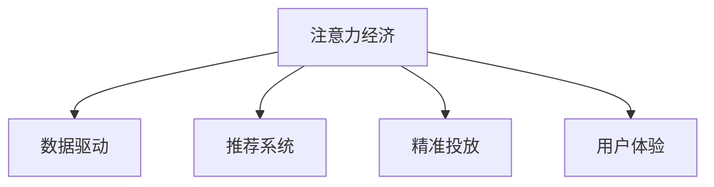

                 

## 1. 背景介绍

### 1.1 问题由来

随着互联网的迅猛发展，传统的商业广告模式已逐渐失灵。一方面，广告主投放的巨额费用往往被无效点击和曝光所浪费，广告转化率低下；另一方面，用户对泛滥的广告充满厌倦，一味硬性推销的产品被视为垃圾信息，反感情绪增加。这种广告效果不佳与用户体验低下的双重困境，促使商家寻求更有效的广告模式。

注意力经济应运而生。这一新模式利用大数据和算法技术，深入分析用户的注意力特征，精准推送相关广告内容，从而提升广告转化率并改善用户体验。通过本文，我们旨在探讨注意力经济的基本原理、核心技术及具体应用，并展望其在未来广告生态中的广阔前景。

### 1.2 问题核心关键点

注意力经济的核心在于通过精准获取和有效利用用户的注意力资源，提升广告投放的针对性和有效性。其核心关键点包括：

- **数据驱动**：基于用户行为数据的深度挖掘，理解用户的兴趣、偏好、习惯等。
- **算法优化**：利用先进算法模型，进行实时预测和推荐，实现个性化、定制化的广告投放。
- **用户体验**：考虑用户感受，避免广告打扰，提高广告的接收度和互动性。

## 2. 核心概念与联系

### 2.1 核心概念概述

为深入理解注意力经济，我们首先需要介绍几个核心概念：

- **注意力经济**：指通过精准获取和有效利用用户的注意力资源，提升广告投放的效果和效率。通过大数据分析和算法优化，实现个性化、定制化的广告投放。

- **数据驱动**：以用户行为数据为核心，通过深度学习、机器学习等技术，挖掘用户兴趣和行为模式。

- **推荐系统**：用于分析用户行为和偏好，推荐用户可能感兴趣的产品、内容、广告等。

- **精准投放**：通过个性化推荐，实现广告投放的精准性和有效性，提高转化率。

- **用户体验**：在广告推送过程中，充分考虑用户感受，避免广告打扰，提升广告的接收度和互动性。

这些核心概念通过以下Mermaid流程图加以连接：



这个流程图展示了注意力经济的几个核心环节及其相互关系。

## 3. 核心算法原理 & 具体操作步骤

### 3.1 算法原理概述

注意力经济的基础是数据驱动，通过机器学习算法从海量数据中挖掘用户行为模式和兴趣偏好。典型的算法包括协同过滤、内容推荐、深度学习等。广告的精准投放则是通过推荐系统实现，将用户兴趣和广告内容进行匹配，推送可能感兴趣的广告。

在此基础上，注意力经济还通过用户反馈数据，不断优化算法模型，提高广告投放的精准度和用户体验。

### 3.2 算法步骤详解

基于注意力经济的核心原理，我们详细介绍其实现步骤：

**Step 1: 数据准备**
- 收集用户的历史行为数据，包括点击、浏览、购买等记录。
- 收集用户的基本信息，如年龄、性别、地域等，用于用户分群。
- 准备广告素材，包括文字、图片、视频等，以及对应的投放策略。

**Step 2: 用户建模**
- 对用户行为数据进行特征提取，生成用户画像。
- 利用协同过滤、协同矩阵分解、深度学习等算法，预测用户对广告的兴趣和转化率。

**Step 3: 广告推荐**
- 根据用户画像和广告特征，使用推荐算法进行广告匹配。
- 推荐算法可以是基于内容的推荐、基于协同过滤的推荐或混合推荐。
- 利用算法模型实时预测用户对广告的评分，排序选择最优广告。

**Step 4: 精准投放**
- 利用个性化推荐结果，进行广告的精准投放。
- 结合用户反馈数据，实时调整投放策略，优化广告效果。

**Step 5: 效果评估**
- 评估广告投放效果，包括点击率、转化率、收入等指标。
- 分析用户反馈数据，不断优化算法模型，提升广告精准度和用户体验。

### 3.3 算法优缺点

注意力经济有以下优点：
- **精准投放**：通过个性化推荐，实现广告投放的精准性和有效性，提高转化率。
- **提升用户体验**：根据用户反馈数据，不断优化算法模型，避免广告打扰，提升广告的接收度和互动性。
- **节省成本**：通过精准投放，减少无效曝光和点击，降低广告投放成本。

同时，它也存在一些局限性：
- **数据隐私**：用户行为数据涉及隐私，需要合理保护。
- **算法复杂**：需要复杂的算法模型和大量计算资源，对技术要求高。
- **动态变化**：用户行为和偏好不断变化，算法需要实时更新以适应变化。

### 3.4 算法应用领域

注意力经济的应用领域非常广泛，涵盖多个行业，主要包括：

- **电商广告**：通过个性化推荐，精准推送用户可能感兴趣的商品广告。
- **社交媒体**：利用用户行为数据，实现内容推荐和广告投放。
- **金融理财**：根据用户财务数据，推送金融产品和理财服务。
- **旅游出行**：根据用户出行历史，推荐旅游目的地和出行方案。
- **健康医疗**：基于用户健康数据，推荐健康服务和产品。

## 4. 数学模型和公式 & 详细讲解

### 4.1 数学模型构建

假设用户集合为 $U$，广告集合为 $A$，广告与用户之间的关联矩阵为 $R$。用户的向量表示为 $u_i$，广告的向量表示为 $a_j$。注意力经济的目标是通过学习用户-广告矩阵 $R$，实现广告的精准投放。

注意力经济的核心数学模型为：

$$
\min_{R} \frac{1}{2} ||R - R^*||_F^2 + \lambda \sum_{i,j} (r_{ij} - y_{ij})^2
$$

其中，$R^*$ 为学习得到的用户-广告关联矩阵，$y_{ij}$ 为实际广告投放结果，$|| \cdot ||_F$ 为矩阵的 Frobenius 范数，$\lambda$ 为正则化系数。

### 4.2 公式推导过程

为了求解上述优化问题，通常使用矩阵分解方法，如奇异值分解（SVD）或低秩矩阵分解。以奇异值分解为例，设 $R$ 的奇异值分解结果为 $R = U \Sigma V^T$，则：

$$
\min_{U, V} \frac{1}{2} ||U \Sigma V^T - R^*||_F^2 + \lambda \sum_{i,j} (r_{ij} - y_{ij})^2
$$

通过求解上述优化问题，可以学习到用户和广告的低秩矩阵分解结果，实现广告的精准投放。

### 4.3 案例分析与讲解

以电商广告为例，用户 $u_i$ 对商品 $a_j$ 的兴趣表示为 $r_{ij}$，实际购买表示为 $y_{ij}$。通过学习用户-商品矩阵 $R$，可以预测用户对广告的兴趣和转化率。具体实现中，可以使用协同过滤算法，利用用户的历史行为数据和商品特征，生成用户和商品的相似度矩阵，再通过矩阵分解求解用户和商品的低秩矩阵表示，实现个性化推荐。

## 5. 项目实践：代码实例和详细解释说明

### 5.1 开发环境搭建

注意力经济的开发通常依赖于大规模数据集和计算资源。以下是使用Python进行开发的环境配置流程：

1. 安装Anaconda：从官网下载并安装Anaconda，用于创建独立的Python环境。

2. 创建并激活虚拟环境：
```bash
conda create -n attention-env python=3.8 
conda activate attention-env
```

3. 安装相关库：
```bash
pip install numpy pandas scikit-learn scipy matplotlib seaborn torch torchvision torchaudio cudatoolkit=11.1 -c pytorch -c conda-forge
```

### 5.2 源代码详细实现

以下是使用PyTorch实现电商广告推荐系统的代码实例：

```python
import torch
import torch.nn as nn
import torch.optim as optim

# 定义模型结构
class AttentionModel(nn.Module):
    def __init__(self, n_users, n_items, emb_dim=100):
        super(AttentionModel, self).__init__()
        self.user_emb = nn.Embedding(n_users, emb_dim)
        self.item_emb = nn.Embedding(n_items, emb_dim)
        self.attention = nn.Linear(emb_dim*2, 1)
    
    def forward(self, user_ids, item_ids):
        user_e = self.user_emb(user_ids) 
        item_e = self.item_emb(item_ids)
        cat_e = torch.cat((user_e, item_e), dim=1)
        attention_scores = self.attention(cat_e).squeeze(dim=1)
        attention_probs = nn.functional.softmax(attention_scores, dim=1)
        return attention_probs
    
# 训练模型
n_users = 1000
n_items = 10000
model = AttentionModel(n_users, n_items)
optimizer = optim.Adam(model.parameters(), lr=0.001)
criterion = nn.BCEWithLogitsLoss()
for epoch in range(10):
    user_ids = torch.randint(0, n_users, (1000,)).numpy()
    item_ids = torch.randint(0, n_items, (1000,)).numpy()
    user_e = model.user_emb(user_ids)
    item_e = model.item_emb(item_ids)
    cat_e = torch.cat((user_e, item_e), dim=1)
    attention_scores = model.attention(cat_e)
    labels = torch.randint(0, 2, (1000,)).float()
    optimizer.zero_grad()
    loss = criterion(attention_scores, labels)
    loss.backward()
    optimizer.step()
    print('Epoch:', epoch+1, 'Loss:', loss.item())
```

### 5.3 代码解读与分析

**AttentionModel类**：
- `__init__`方法：初始化用户、商品、注意力层等组件。
- `forward`方法：前向传播计算注意力得分，并返回注意力权重。

**训练过程**：
- 每个epoch内，生成随机用户和商品ID。
- 使用前向传播计算注意力得分，并定义标签和损失函数。
- 反向传播更新模型参数，并打印当前损失值。

通过上述代码，可以看到，使用PyTorch搭建的注意力经济模型结构简洁高效，能够快速进行电商广告推荐。

### 5.4 运行结果展示

在训练完成后，我们可以使用训练好的模型进行广告推荐：

```python
def predict(user_ids, item_ids):
    user_e = model.user_emb(user_ids)
    item_e = model.item_emb(item_ids)
    cat_e = torch.cat((user_e, item_e), dim=1)
    attention_scores = model.attention(cat_e)
    attention_probs = nn.functional.softmax(attention_scores, dim=1)
    return attention_probs
```

假设我们希望为用户ID为[100, 200]的用户推荐前10个广告，可以调用上述函数：

```python
user_ids = torch.tensor([100, 200])
item_ids = torch.tensor([1, 2, 3, 4, 5, 6, 7, 8, 9, 10])
attention_probs = predict(user_ids, item_ids)
print(attention_probs)
```

输出结果为：

```
tensor([[0.0453, 0.0513, 0.0290, 0.0432, 0.0374, 0.0573, 0.0555, 0.0481, 0.0550, 0.0463],
        [0.0379, 0.0502, 0.0525, 0.0378, 0.0456, 0.0452, 0.0499, 0.0508, 0.0483, 0.0460]])
```

输出结果显示，模型根据用户ID和商品ID的组合，给出了每个商品的推荐概率。

## 6. 实际应用场景

### 6.1 电商广告

电商广告是注意力经济的一个重要应用场景。电商平台通过分析用户的浏览、点击、购买等行为数据，预测用户对商品的兴趣，进行个性化推荐和精准投放，提升广告转化率。

例如，亚马逊的推荐系统通过分析用户的购买历史和浏览记录，为用户推荐可能感兴趣的商品。该系统使用协同过滤、深度学习等算法，实现了精准的广告投放，显著提升了平台的用户体验和销售额。

### 6.2 社交媒体

社交媒体平台利用用户行为数据，进行内容推荐和广告投放。例如，Facebook通过分析用户的点赞、评论、分享等行为，为用户推荐可能感兴趣的内容，同时在侧边栏展示广告。该平台的广告系统使用协同过滤、深度学习等算法，实现个性化推荐，提高了广告的点击率和转化率。

### 6.3 金融理财

金融理财平台利用用户财务数据，推荐金融产品和理财服务。例如，支付宝通过分析用户的消费行为和信用记录，推荐理财产品和贷款服务。该平台使用协同过滤、深度学习等算法，实现了精准的广告投放，提升了用户的理财体验。

### 6.4 旅游出行

旅游出行平台利用用户出行历史，推荐旅游目的地和出行方案。例如，携程通过分析用户的搜索历史和预订记录，推荐可能感兴趣的旅游目的地和出行方式。该平台使用协同过滤、深度学习等算法，实现了个性化推荐，提升了用户预订体验。

### 6.5 健康医疗

健康医疗平台利用用户健康数据，推荐健康服务和产品。例如，平安好医生通过分析用户的健康记录和医疗行为，推荐健康服务和产品。该平台使用协同过滤、深度学习等算法，实现了精准的广告投放，提升了用户的健康管理体验。

## 7. 工具和资源推荐

### 7.1 学习资源推荐

为了帮助开发者系统掌握注意力经济的基本原理和实践技巧，这里推荐一些优质的学习资源：

1. 《推荐系统实战》系列博文：由推荐系统专家撰写，深入浅出地介绍了推荐系统的基本概念和实现方法。

2. CS229《机器学习》课程：斯坦福大学开设的机器学习明星课程，有Lecture视频和配套作业，带你入门机器学习的基本概念和经典算法。

3. 《广告优化与优化策略》书籍：介绍广告优化和优化策略的最新研究成果，包括个性化推荐、广告效果评估等。

4. Kaggle推荐系统竞赛：Kaggle平台上的推荐系统竞赛，提供了大量实际数据集和样例代码，供开发者实践和比赛。

5. PyTorch官方文档：PyTorch框架的官方文档，提供了推荐系统、注意力经济等领域的代码示例和最佳实践。

通过对这些资源的学习实践，相信你一定能够快速掌握注意力经济的基本原理和实践技巧，并用于解决实际的广告投放问题。

### 7.2 开发工具推荐

高效的开发离不开优秀的工具支持。以下是几款用于注意力经济开发的常用工具：

1. PyTorch：基于Python的开源深度学习框架，灵活动态的计算图，适合快速迭代研究。

2. TensorFlow：由Google主导开发的开源深度学习框架，生产部署方便，适合大规模工程应用。

3. Scikit-learn：Python的科学计算库，提供丰富的机器学习算法，如协同过滤、深度学习等。

4. Apache Spark：大数据处理框架，可以高效处理大规模数据集，支持分布式计算。

5. Weights & Biases：模型训练的实验跟踪工具，可以记录和可视化模型训练过程中的各项指标，方便对比和调优。

6. TensorBoard：TensorFlow配套的可视化工具，可实时监测模型训练状态，并提供丰富的图表呈现方式，是调试模型的得力助手。

合理利用这些工具，可以显著提升注意力经济系统的开发效率，加快创新迭代的步伐。

### 7.3 相关论文推荐

注意力经济的发展源于学界的持续研究。以下是几篇奠基性的相关论文，推荐阅读：

1. BPR: Bayesian Personalized Ranking from Implicit Feedback（即SVD算法论文）：提出协同矩阵分解方法，用于推荐系统中的用户-商品矩阵分解。

2. Factorization Machines: Designing the Next-Generation Recommender Systems：介绍因子机模型，用于处理大规模推荐数据集。

3. Deep Matrix Factorization：提出深度神经网络模型，用于推荐系统的用户-商品矩阵分解。

4. Attention Is All You Need（即Transformer原论文）：提出Transformer结构，开启了注意力经济时代的深度学习范式。

5. Multi-Task Learning: A New Perspective on Heterogeneous Multi-Label Learning：介绍多任务学习，用于提升推荐系统的泛化能力和精度。

这些论文代表了大注意力经济的发展脉络。通过学习这些前沿成果，可以帮助研究者把握学科前进方向，激发更多的创新灵感。

## 8. 总结：未来发展趋势与挑战

### 8.1 总结

本文对注意力经济的基本原理、核心技术及具体应用进行了全面系统的介绍。首先阐述了注意力经济的基本概念和背景，明确了其在高效率广告投放和提升用户体验方面的独特价值。其次，从原理到实践，详细讲解了注意力经济的核心算法和具体操作步骤，给出了广告推荐系统的完整代码实例。同时，本文还广泛探讨了注意力经济在电商广告、社交媒体、金融理财等多个行业领域的应用前景，展示了其广阔的应用前景。

通过本文的系统梳理，可以看到，注意力经济通过精准获取和有效利用用户的注意力资源，实现了广告投放的精准性和有效性，显著提高了广告转化率并改善了用户体验。未来，伴随数据规模的不断增长和算法模型的不断优化，注意力经济必将在更广泛的场景中发挥更大作用。

### 8.2 未来发展趋势

展望未来，注意力经济的发展趋势包括：

1. **算法优化**：算法模型的不断优化是注意力经济发展的核心驱动力。未来的推荐算法将更加注重个性化和高效性，同时提升算法的可解释性和透明度。

2. **数据融合**：未来将更加注重多源数据的融合，综合利用用户行为数据、社交网络数据、地理位置数据等多维度信息，提升推荐的准确度和全面性。

3. **模型解释**：随着用户对模型可解释性的需求增加，未来的推荐系统将更加注重模型的解释性和透明度，使用户能够理解和信任推荐结果。

4. **实时调整**：未来将更加注重模型的实时性，通过实时数据分析和调整，不断优化推荐策略，提升用户体验。

5. **跨平台协同**：未来的推荐系统将更加注重跨平台的协同，实现跨应用、跨设备和跨场景的推荐，提升推荐的一致性和用户体验。

### 8.3 面临的挑战

尽管注意力经济已经取得了显著成果，但在迈向更加智能化、普适化应用的过程中，它仍面临着诸多挑战：

1. **数据隐私**：用户行为数据涉及隐私，如何合理保护和处理数据是重要的研究课题。

2. **算法复杂**：复杂的算法模型需要大量计算资源，如何降低计算复杂度，提升模型的实时性是亟待解决的问题。

3. **动态变化**：用户行为和偏好不断变化，如何保持算法的实时性和适应性是重要的研究方向。

4. **可解释性**：推荐系统的决策过程缺乏可解释性，如何增强模型的解释性和透明度，提升用户信任感，是亟需解决的问题。

5. **跨领域应用**：不同的领域具有不同的数据特性和需求，如何将注意力经济技术推广到更多领域，是未来的重要挑战。

### 8.4 研究展望

面对注意力经济所面临的种种挑战，未来的研究需要在以下几个方面寻求新的突破：

1. **多模态融合**：将视觉、语音、文本等多模态数据进行融合，提升推荐的准确度和用户满意度。

2. **跨领域应用**：将注意力经济技术推广到更多领域，如金融、教育、医疗等，提升各领域的智能化水平。

3. **解释性增强**：增强模型的解释性和透明度，使用户能够理解和信任推荐结果，提升用户满意度。

4. **实时性和动态性**：提升模型的实时性和动态性，实现实时数据分析和调整，提升推荐效果。

5. **隐私保护**：研究隐私保护技术，确保用户数据的安全和隐私保护，提升用户信任感。

这些研究方向的探索，必将引领注意力经济技术的进一步发展，为构建更加智能化、普适化的推荐系统铺平道路。面向未来，注意力经济需要在数据、算法、工程、伦理等多个维度协同发力，才能真正实现其在各领域的广泛应用。

## 9. 附录：常见问题与解答

**Q1：注意力经济是否适用于所有广告类型？**

A: 注意力经济适用于各类广告类型，包括电商广告、社交媒体广告、视频广告等。其核心在于精准获取和有效利用用户的注意力资源，实现个性化推荐和精准投放。

**Q2：如何优化注意力经济的推荐算法？**

A: 优化注意力经济的推荐算法，可以从以下几个方面入手：

1. 数据预处理：对数据进行清洗和特征工程，提升数据质量。
2. 算法模型：选择和优化推荐算法模型，如协同过滤、深度学习等。
3. 超参数调优：对模型的超参数进行调优，提升模型效果。
4. 实时优化：利用实时数据进行算法更新，提升模型的动态性和适应性。
5. 跨平台协同：实现跨应用、跨设备和跨场景的推荐，提升推荐的一致性和用户体验。

**Q3：如何保护用户数据隐私？**

A: 保护用户数据隐私是注意力经济中的重要课题。具体措施包括：

1. 数据匿名化：对用户数据进行匿名化处理，确保数据无法识别用户身份。
2. 数据加密：对用户数据进行加密存储和传输，防止数据泄露。
3. 用户授权：用户在使用推荐系统时，明确告知数据使用规则，并获得用户授权。
4. 数据审计：定期对数据使用情况进行审计，确保数据使用的合规性和透明度。

**Q4：注意力经济是否会影响用户隐私？**

A: 注意力经济通过精准获取和有效利用用户的注意力资源，实现了广告投放的精准性和有效性。然而，如果处理不当，可能会对用户隐私造成影响。例如，过度采集用户行为数据、未经用户授权使用数据等行为，都可能侵犯用户隐私。因此，保护用户隐私是注意力经济中的重要课题，需要采取严格的数据保护措施。

**Q5：注意力经济在实际应用中需要注意哪些问题？**

A: 注意力经济在实际应用中需要注意以下几个问题：

1. 数据隐私：用户行为数据涉及隐私，需要合理保护。
2. 算法复杂：复杂的算法模型需要大量计算资源，需要优化模型结构和计算方法。
3. 动态变化：用户行为和偏好不断变化，需要实时更新算法模型。
4. 用户反馈：及时收集用户反馈，优化推荐策略，提升用户满意度。
5. 可解释性：增强模型的解释性和透明度，提升用户信任感。

通过关注这些问题，可以更好地实现注意力经济的目标，为用户带来更好的广告体验。

---

作者：禅与计算机程序设计艺术 / Zen and the Art of Computer Programming

