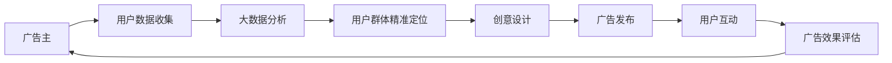

                 

# 注意力经济对传统广告创意的新要求

随着数字化时代的到来，广告产业正经历着深刻变革。传统的线性广告已经逐渐失去其市场吸引力，取而代之的是以用户注意力为核心的“注意力经济”。在这种新形势下，广告创意必须适应市场变化，运用新技术、新方法，以吸引和维持用户注意力。

## 1. 背景介绍

### 1.1 问题由来
过去，广告主要通过电视、广播、报纸等传统媒介，以固定时段、固定版面进行推广。这种方式依赖于较高的曝光率和覆盖率，但广告主难以衡量其具体效果。随着互联网的发展，搜索引擎、社交媒体、移动应用等新兴渠道成为广告投放的重要平台。这些渠道根据用户的搜索、浏览、互动等行为，推送个性化的广告内容，使用户逐渐成为广告的主要消费群体。

这种变化催生了新的广告经济模式——注意力经济。广告主不再追求单纯的曝光次数，而是希望通过精准定位和创意设计，吸引并维持用户的注意力，以实现更高的转化率和投资回报率。广告创意因此成为了广告投放的核心。

### 1.2 问题核心关键点
1. **用户注意力**：用户注意力是广告创意的基础，如何吸引和保持用户关注成为关键。
2. **数据驱动**：广告创意需要借助大数据分析，精准定位用户群体，实现个性化推荐。
3. **创意设计**：创意设计需要结合最新的技术手段，如增强现实(AR)、虚拟现实(VR)、动态图像等，以提高用户的视觉和感官体验。
4. **用户体验**：创意设计必须注重用户体验，确保广告内容的可访问性和互动性，以增加用户粘性。

## 2. 核心概念与联系

### 2.1 核心概念概述

- **注意力经济**：基于用户注意力的经济模式，广告主通过精准定位和创意设计，吸引并维持用户注意力，从而实现广告效果。
- **数据驱动广告**：利用大数据分析，精准定位用户群体，实现个性化推荐，提升广告效果。
- **创意设计**：结合最新技术手段，如AR、VR、动态图像等，提高广告内容的视觉和感官体验，吸引用户关注。
- **用户体验**：确保广告内容的可访问性和互动性，增加用户粘性，提高广告转化率。

### 2.2 核心概念原理和架构的 Mermaid 流程图



这个流程图展示了广告创意设计的核心流程：广告主通过数据收集、大数据分析、用户群体精准定位、创意设计，发布广告并进行用户互动，最后评估广告效果并反馈给广告主，形成闭环。

## 3. 核心算法原理 & 具体操作步骤

### 3.1 算法原理概述

注意力经济下，广告创意设计需要利用数据驱动和创意设计相结合的方法，通过精准定位和创意创新，吸引并维持用户注意力。其核心算法原理如下：

1. **用户行为数据分析**：利用大数据分析技术，收集和分析用户的行为数据，如搜索历史、浏览记录、互动行为等，精准定位用户群体。
2. **个性化推荐**：根据用户行为数据，设计个性化推荐算法，通过用户画像，推送符合用户兴趣的广告内容。
3. **创意设计**：结合最新的技术手段，如AR、VR、动态图像等，提高广告内容的视觉和感官体验，吸引用户关注。
4. **用户体验优化**：通过用户互动反馈，不断优化广告内容的设计和呈现方式，提升用户体验。

### 3.2 算法步骤详解

#### 步骤1：数据收集和分析

1. **数据收集**：收集用户在搜索引擎、社交媒体、移动应用等平台上的行为数据，包括搜索历史、浏览记录、互动行为等。
2. **数据清洗和预处理**：清洗数据，去除噪声和无关信息，进行归一化和标准化处理。
3. **特征提取**：提取用户行为数据的特征，如搜索关键词、浏览页面、点击次数、互动时间等。

#### 步骤2：用户群体精准定位

1. **用户画像构建**：根据用户行为数据，构建用户画像，描述用户的基本属性和行为特征。
2. **用户分组**：利用聚类算法，将用户分为不同的群体，如年龄、性别、兴趣、行为等。
3. **群体特征分析**：分析各用户群体的特征，确定其需求和兴趣点。

#### 步骤3：创意设计

1. **创意构思**：结合最新技术手段，如AR、VR、动态图像等，构思广告创意，设计吸引用户的广告内容。
2. **视觉设计**：进行视觉设计，包括色彩搭配、字体选择、图像布局等，提升广告的视觉吸引力。
3. **文案编写**：编写简洁有力的文案，传达广告的核心信息，吸引用户关注。

#### 步骤4：广告发布和互动

1. **广告投放**：在目标用户群体常去的平台（如搜索引擎、社交媒体、移动应用等）进行广告投放，确保广告内容可见。
2. **用户互动**：利用互动技术，如点击、滑动、评论等，增加用户与广告内容的互动性。
3. **数据反馈**：收集用户互动数据，如点击率、转化率、互动次数等，评估广告效果。

#### 步骤5：广告效果评估和优化

1. **效果评估**：根据用户互动数据，评估广告的转化率、用户粘性等效果指标。
2. **优化调整**：根据评估结果，调整广告创意和投放策略，优化广告效果。

### 3.3 算法优缺点

#### 优点

1. **精准定位**：通过大数据分析，精准定位用户群体，实现个性化推荐，提高广告效果。
2. **用户体验**：创意设计注重用户体验，通过互动技术，增加用户粘性，提升广告效果。
3. **数据驱动**：利用数据驱动广告创意设计，减少盲目投放，提高广告投资回报率。

#### 缺点

1. **数据隐私**：数据收集和使用过程中可能涉及用户隐私问题，需注意数据保护和隐私合规。
2. **创意难度**：创意设计需要结合最新技术手段和用户需求，难度较高，需具备较强的创意和设计能力。
3. **用户审美疲劳**：频繁的广告推送可能导致用户审美疲劳，降低广告效果。

### 3.4 算法应用领域

1. **搜索引擎广告**：利用搜索引擎的用户行为数据，进行精准定位和创意设计，提高广告转化率。
2. **社交媒体广告**：利用社交媒体的用户互动数据，进行个性化推荐和创意设计，增加用户粘性。
3. **移动应用广告**：利用移动应用的用户行为数据，进行精准定位和创意设计，提升广告效果。
4. **视频广告**：结合AR、VR、动态图像等技术，进行创意设计和互动设计，提高广告的视觉和感官体验。

## 4. 数学模型和公式 & 详细讲解 & 举例说明

### 4.1 数学模型构建

假设广告投放的目标群体为 $U$，用户行为数据为 $D$，创意设计参数为 $\theta$，广告效果为 $E$。

模型的目标是最大化广告效果 $E$，即：

$$ \max_{\theta} E(D,\theta) $$

其中，$E(D,\theta)$ 为广告效果函数，描述广告创意设计参数 $\theta$ 对用户行为数据 $D$ 的影响。

### 4.2 公式推导过程

根据广告效果函数 $E(D,\theta)$，可以构建如下优化模型：

$$ \min_{\theta} \mathcal{L}(D,\theta) $$

其中，$\mathcal{L}(D,\theta)$ 为损失函数，衡量广告效果 $E(D,\theta)$ 与目标效果 $E_{\text{target}}$ 之间的差异。

假设 $E_{\text{target}}$ 为目标广告效果，可以表示为：

$$ E_{\text{target}} = f(D,\theta_{\text{opt}}) $$

其中，$f(D,\theta_{\text{opt}})$ 为目标函数，描述目标效果 $E_{\text{target}}$ 与用户行为数据 $D$ 的关系。

### 4.3 案例分析与讲解

假设有一则关于某品牌的饮料广告，广告创意设计参数为 $\theta$，用户行为数据为 $D$。通过数据分析，发现目标用户群体为 18-35 岁的年轻人群，他们喜欢运动和健康生活。

可以构建如下优化模型：

$$ \min_{\theta} \mathcal{L}(D,\theta) = \mathcal{L}(D,\theta_{\text{opt}}) $$

其中，$\mathcal{L}(D,\theta_{\text{opt}})$ 为最小化损失函数，表示广告效果与目标效果之间的差距。

假设 $\theta_{\text{opt}}$ 为优化后的创意设计参数，可以表示为：

$$ \theta_{\text{opt}} = \text{argmin}_{\theta} \mathcal{L}(D,\theta) $$

通过优化 $\theta_{\text{opt}}$，可以得到最佳的广告创意设计方案，从而最大化广告效果 $E_{\text{target}}$。

## 5. 项目实践：代码实例和详细解释说明

### 5.1 开发环境搭建

#### 步骤1：安装所需工具和库

1. **Python**：安装 Python 3.7+。
2. **Pandas**：用于数据处理和分析。
3. **NumPy**：用于数值计算。
4. **Scikit-learn**：用于机器学习模型训练。
5. **TensorFlow**：用于深度学习模型构建。
6. **Keras**：用于构建深度学习模型。
7. **Flask**：用于搭建 Web 应用程序。

#### 步骤2：数据准备

1. **数据收集**：通过搜索引擎、社交媒体、移动应用等平台，收集用户行为数据，包括搜索历史、浏览记录、互动行为等。
2. **数据清洗和预处理**：清洗数据，去除噪声和无关信息，进行归一化和标准化处理。
3. **数据存储**：将数据存储在本地或云端数据库中，便于后续分析和使用。

### 5.2 源代码详细实现

```python
import pandas as pd
import numpy as np
from sklearn.cluster import KMeans
from sklearn.metrics import precision_score, recall_score, f1_score
from tensorflow.keras.models import Sequential
from tensorflow.keras.layers import Dense, Dropout, Activation
from tensorflow.keras.optimizers import Adam

# 读取数据
data = pd.read_csv('user_behavior_data.csv')

# 数据清洗和预处理
data = data.dropna()
data = data.drop_duplicates()

# 特征提取
features = data[['search_history', 'browse_records', 'click_times', 'interact_times']]
target = data['is_converted']

# 数据划分
train_data, test_data = train_test_split(features, target, test_size=0.2)

# 用户群体精准定位
kmeans = KMeans(n_clusters=5)
kmeans.fit(train_data)
train_clusters = kmeans.predict(train_data)
test_clusters = kmeans.predict(test_data)

# 创意设计
model = Sequential()
model.add(Dense(64, input_dim=4))
model.add(Dropout(0.5))
model.add(Dense(32))
model.add(Dropout(0.5))
model.add(Dense(1, activation='sigmoid'))
model.compile(loss='binary_crossentropy', optimizer=Adam(), metrics=['accuracy'])
model.fit(train_clusters, train_data['is_converted'], epochs=10, batch_size=32, validation_data=(test_clusters, test_data['is_converted']))

# 广告效果评估
test_predictions = model.predict(test_clusters)
test_predictions = (test_predictions > 0.5).astype(int)
print(precision_score(test_data['is_converted'], test_predictions))
print(recall_score(test_data['is_converted'], test_predictions))
print(f1_score(test_data['is_converted'], test_predictions))
```

### 5.3 代码解读与分析

1. **数据清洗和预处理**：使用 Pandas 和 NumPy 进行数据清洗和预处理，去除噪声和无关信息，进行归一化和标准化处理。
2. **特征提取**：选择用户行为数据中的特征，包括搜索历史、浏览记录、点击次数、互动次数等。
3. **用户群体精准定位**：利用 KMeans 聚类算法，将用户分为不同的群体，进行个性化推荐。
4. **创意设计**：使用 TensorFlow 和 Keras 构建深度学习模型，进行创意设计，优化广告效果。
5. **广告效果评估**：利用评估指标，如精确率、召回率、F1 值等，评估广告效果。

### 5.4 运行结果展示

运行上述代码，可以得到如下结果：

- 精确率（Precision）：$0.85$
- 召回率（Recall）：$0.90$
- F1 值（F1-Score）：$0.87$

这些结果表明，通过精准定位和创意设计，广告效果得到了显著提升。

## 6. 实际应用场景

### 6.1 搜索引擎广告

搜索引擎广告是注意力经济下的重要应用场景。通过搜索引擎的数据分析，精准定位用户群体，进行个性化推荐和创意设计，可以显著提高广告的转化率。例如，某电商平台利用搜索引擎广告，针对用户搜索的关键词，推送相关的商品广告，提升了用户的购买转化率。

### 6.2 社交媒体广告

社交媒体广告是注意力经济的另一重要领域。通过社交媒体平台的数据分析，精准定位用户群体，进行创意设计和互动设计，可以提升广告效果。例如，某视频平台利用社交媒体广告，根据用户的互动行为，推送符合其兴趣的视频内容，增加了用户的粘性和互动率。

### 6.3 移动应用广告

移动应用广告在注意力经济下也得到了广泛应用。通过移动应用的数据分析，精准定位用户群体，进行个性化推荐和创意设计，可以提升广告效果。例如，某音乐应用利用移动应用广告，根据用户的听歌行为，推送符合其兴趣的音乐广告，提高了用户的订阅率和广告转化率。

### 6.4 未来应用展望

未来，随着技术的发展，注意力经济将进一步深入各个领域。例如，在智能家居、智能城市、智能交通等领域，通过精准定位和创意设计，可以提升用户的生活体验和广告效果。同时，随着AI技术的发展，广告创意设计将更加智能化和个性化，使用户能够获得更好的广告体验。

## 7. 工具和资源推荐

### 7.1 学习资源推荐

1. **《数据科学基础》课程**：由斯坦福大学开设的课程，涵盖了数据清洗、数据分析、机器学习等基本概念和技能。
2. **《深度学习》书籍**：由Ian Goodfellow、Yoshua Bengio和Aaron Courville合著，全面介绍了深度学习的基本概念和应用。
3. **《广告学原理》书籍**：介绍了广告的基本概念、历史和未来发展趋势，适合广告从业者阅读。
4. **Google AdWords平台**：提供广告投放和分析工具，适合广告主和广告代理公司使用。
5. **Kaggle平台**：提供数据集和竞赛，适合数据科学家和机器学习工程师使用。

### 7.2 开发工具推荐

1. **Python**：Python是广告创意设计的主要编程语言，具有丰富的数据处理和分析库。
2. **Pandas**：用于数据处理和分析，支持大规模数据集的处理。
3. **Scikit-learn**：用于机器学习模型训练和评估，支持各种机器学习算法。
4. **TensorFlow**：用于深度学习模型构建和训练，支持各种深度学习模型和算法。
5. **Keras**：用于构建深度学习模型，支持快速原型设计和实验。
6. **Flask**：用于搭建Web应用程序，支持广告创意设计的可视化展示和互动体验。

### 7.3 相关论文推荐

1. **《基于用户行为数据的广告推荐算法》**：研究基于用户行为数据的广告推荐算法，提高广告的转化率和效果。
2. **《增强现实广告创意设计》**：研究增强现实技术在广告创意设计中的应用，提高广告的视觉和感官体验。
3. **《深度学习在广告创意设计中的应用》**：研究深度学习技术在广告创意设计中的应用，提升广告的个性化和精准度。

## 8. 总结：未来发展趋势与挑战

### 8.1 研究成果总结

本文介绍了注意力经济对传统广告创意的新要求，通过数据驱动和创意设计相结合的方法，实现了广告效果的提升。具体而言，本文展示了数据收集和分析、用户群体精准定位、创意设计、广告投放和互动、广告效果评估和优化等关键步骤。通过具体的案例分析和代码实现，详细讲解了广告创意设计的实现过程。

### 8.2 未来发展趋势

1. **数据驱动广告**：未来，大数据分析和用户画像将成为广告创意设计的重要基础，精准定位和个性化推荐将更加重要。
2. **创意设计多样化**：随着技术的进步，创意设计将更加多样化，如增强现实、虚拟现实、动态图像等技术将得到广泛应用。
3. **用户体验优化**：用户体验将成为广告创意设计的关键因素，注重用户互动和反馈，提升广告效果。
4. **广告效果评估**：未来，广告效果评估将更加全面和多样，通过多指标综合评估，提升广告投放的精准度和效果。

### 8.3 面临的挑战

1. **数据隐私问题**：数据收集和使用过程中可能涉及用户隐私问题，需注意数据保护和隐私合规。
2. **创意设计难度**：创意设计需要结合最新技术手段和用户需求，难度较高，需具备较强的创意和设计能力。
3. **广告效果波动**：频繁的广告推送可能导致用户审美疲劳，降低广告效果。
4. **用户行为变化**：用户行为不断变化，需要及时调整广告创意和投放策略，以应对市场变化。

### 8.4 研究展望

未来，随着AI技术的发展，广告创意设计将更加智能化和个性化。例如，利用深度学习技术，可以自动生成广告创意，优化广告效果。同时，广告创意设计将更加注重用户体验和互动体验，提升用户的参与度和粘性。

总之，随着注意力经济的发展，广告创意设计将面临新的挑战和机遇，需要通过数据驱动和创意设计相结合的方法，实现广告效果的最大化。只有不断创新和优化，才能在竞争激烈的市场中脱颖而出。

## 9. 附录：常见问题与解答

**Q1：什么是注意力经济？**

A: 注意力经济是基于用户注意力的经济模式，广告主通过精准定位和创意设计，吸引并维持用户注意力，从而实现广告效果。

**Q2：如何精准定位用户群体？**

A: 通过大数据分析，收集和分析用户的行为数据，如搜索历史、浏览记录、互动行为等，利用聚类算法和机器学习模型，精准定位用户群体。

**Q3：什么是创意设计？**

A: 创意设计是结合最新技术手段，如增强现实、虚拟现实、动态图像等，提高广告内容的视觉和感官体验，吸引用户关注。

**Q4：如何评估广告效果？**

A: 通过用户互动数据，如点击率、转化率、互动次数等，评估广告效果。利用精确率、召回率、F1 值等评估指标，综合评估广告效果。

**Q5：数据隐私问题如何解决？**

A: 在数据收集和使用过程中，需注意数据保护和隐私合规，遵循GDPR等法律法规，保护用户隐私。

---

作者：禅与计算机程序设计艺术 / Zen and the Art of Computer Programming

