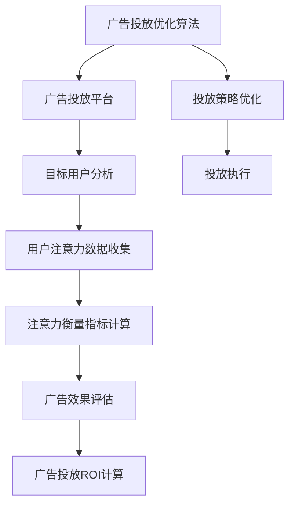

                 

## 1. 背景介绍

### 1.1 问题由来

互联网技术的快速发展，尤其是大数据和人工智能技术的进步，使得广告行业在精准投放和效果评估方面有了质的提升。但与此同时，广告主和平台对广告投放ROI（Return on Investment）的追求也日益增加，希望广告投放能够带来更高的回报。在这种背景下，注意力经济（Economics of Attention）的概念应运而生，成为广告行业关注的新焦点。

注意力经济理论认为，注意力资源是有限的，消费者对广告的注意力呈现分散化和碎片化的特点。因此，广告主需要通过提高广告的吸引力和目标性，使消费者的注意力尽可能集中，从而提高广告投放的ROI。

### 1.2 问题核心关键点

1. **注意力经济学原理**：
   - 注意力经济学主要研究在信息过载的环境下，如何分配稀缺的注意力资源，提高广告主的投资回报。

2. **广告投放ROI**：
   - 广告投放ROI是指广告主通过投放广告获得的净收益与广告投放成本的比率。提高广告投放ROI是广告主和平台共同追求的目标。

3. **基于注意力的广告投放策略**：
   - 传统的广告投放策略往往是“广泛撒网，重点捕鱼”，即通过大量投放广告来吸引用户，然后通过数据分析识别目标用户并进行精准投放。但这种策略在信息过载的环境下效果并不理想。

## 2. 核心概念与联系

### 2.1 核心概念概述

1. **注意力经济学**：
   - 注意力经济学是研究在信息过载环境中如何分配和利用稀缺注意力资源以提高效率的学科。广告投放的核心是吸引和保持消费者的注意力。

2. **广告投放ROI**：
   - 广告投放ROI是衡量广告投放效果的重要指标，通常通过广告转化率、点击率、品牌曝光等指标来评估。

3. **基于注意力的广告投放策略**：
   - 基于注意力的广告投放策略强调在有限的注意力资源下，如何精准识别和吸引目标用户，提升广告投放的效果和ROI。

4. **注意力衡量指标**：
   - 注意力衡量指标包括关注度、停留时间、互动率等，用于评估广告对用户注意力的吸引程度。

5. **广告投放优化算法**：
   - 广告投放优化算法通过数据分析和模型预测，优化广告投放策略，提高广告投放的ROI。

### 2.2 核心概念原理和架构的 Mermaid 流程图



## 3. 核心算法原理 & 具体操作步骤

### 3.1 算法原理概述

基于注意力的广告投放策略，其核心是通过数据分析和机器学习算法，精准识别目标用户，并优化广告投放策略，以提高广告的吸引力和转化率，从而提升广告投放的ROI。

广告投放优化的主要流程包括：

1. **目标用户分析**：
   - 通过用户行为数据、社交网络数据等，识别和分析潜在的目标用户群体。

2. **注意力数据收集**：
   - 收集用户在广告接触过程中的注意力数据，如停留时间、点击率等。

3. **注意力衡量指标计算**：
   - 计算广告的关注度、停留时间、互动率等注意力衡量指标，评估广告对用户的吸引力。

4. **广告效果评估**：
   - 通过数据分析和模型预测，评估广告投放的效果，包括广告转化率、点击率、品牌曝光等。

5. **投放策略优化**：
   - 根据广告效果评估结果，优化广告投放策略，提高广告投放的ROI。

### 3.2 算法步骤详解

#### 3.2.1 目标用户分析

1. **数据收集**：
   - 收集用户的浏览行为数据、搜索历史、社交网络数据等，构建用户画像。

2. **用户群体划分**：
   - 根据用户画像，将用户划分为不同的兴趣群体，如科技、时尚、运动等。

3. **目标用户识别**：
   - 使用机器学习算法，识别与广告相关的目标用户群体。

#### 3.2.2 注意力数据收集

1. **数据收集方法**：
   - 使用Web追踪工具、浏览器插件等方式，收集用户在广告接触过程中的注意力数据。

2. **注意力指标定义**：
   - 定义关注度（Attention Index）、停留时间（Stay Time）、点击率（Click-through Rate, CTR）等注意力指标。

#### 3.2.3 注意力衡量指标计算

1. **关注度计算**：
   - 计算用户对广告的关注度，即用户对广告的停留时间和互动行为的加权平均值。

2. **停留时间计算**：
   - 计算用户在广告页面上的平均停留时间，评估广告的吸引力。

3. **互动率计算**：
   - 计算用户在广告上的点击、分享、点赞等互动行为的比例，评估广告的互动性。

#### 3.2.4 广告效果评估

1. **广告转化率计算**：
   - 计算用户在广告引导下完成预期行为的转化率，如购买、注册等。

2. **点击率计算**：
   - 计算广告的点击率，评估广告的吸引力和效果。

3. **品牌曝光度计算**：
   - 计算广告的曝光次数和覆盖用户数，评估广告的品牌影响力。

#### 3.2.5 投放策略优化

1. **模型选择**：
   - 根据广告投放任务，选择合适的机器学习模型，如线性回归、决策树、随机森林等。

2. **特征工程**：
   - 对用户数据和广告数据进行特征提取和处理，生成模型所需的特征向量。

3. **模型训练**：
   - 使用收集到的数据对模型进行训练，得到广告投放策略。

4. **效果评估**：
   - 使用测试集数据对训练好的模型进行评估，计算广告投放ROI。

5. **策略调整**：
   - 根据评估结果，对广告投放策略进行调整，提高广告投放的ROI。

### 3.3 算法优缺点

#### 3.3.1 优点

1. **精准投放**：
   - 通过目标用户分析和注意力数据收集，实现精准的广告投放，提高广告的转化率和ROI。

2. **效果评估**：
   - 通过关注度、停留时间、点击率等注意力衡量指标，评估广告效果，优化投放策略。

3. **自动化优化**：
   - 利用机器学习算法进行自动化优化，减少人工干预，提高效率。

#### 3.3.2 缺点

1. **数据隐私问题**：
   - 用户数据的收集和使用可能会涉及隐私问题，需要遵守相关法律法规。

2. **模型复杂性**：
   - 广告投放优化算法较为复杂，需要处理大量的数据和特征，对技术和资源要求较高。

3. **用户适应性**：
   - 用户对广告的适应性可能影响广告效果，需要动态调整策略。

## 4. 数学模型和公式 & 详细讲解 & 举例说明

### 4.1 数学模型构建

假设广告投放的目标用户为 $U$，广告集为 $A$，广告投放策略为 $P$，广告效果评估指标为 $M$。广告投放优化的数学模型可表示为：

$$
\maximize \quad \sum_{u \in U} \sum_{a \in A} P_{ua} \cdot M_{a}
$$

其中 $P_{ua}$ 表示用户 $u$ 在广告 $a$ 上的投放概率，$M_{a}$ 表示广告 $a$ 的平均效果评估指标。

### 4.2 公式推导过程

#### 4.2.1 目标用户分析

假设用户画像为 $X$，目标用户群体为 $G$。则目标用户识别的公式为：

$$
G = \{u \in U | f(X_u) \in G\}
$$

其中 $f$ 为特征提取函数，$X_u$ 为用户 $u$ 的特征向量。

#### 4.2.2 注意力数据收集

假设用户在广告 $a$ 上的关注度为 $A_{a}$，停留时间为 $T_a$，点击率为 $C_a$。则注意力衡量指标的计算公式为：

$$
A_{a} = \alpha \cdot T_a + \beta \cdot C_a
$$

其中 $\alpha$ 和 $\beta$ 为权重系数。

#### 4.2.3 广告效果评估

假设广告转化率为 $CTR_a$，点击率为 $CTR_a$，品牌曝光度为 $BR_a$。则广告效果评估指标的计算公式为：

$$
M_a = \gamma \cdot CTR_a + \delta \cdot CTR_a + \epsilon \cdot BR_a
$$

其中 $\gamma$、$\delta$ 和 $\epsilon$ 为权重系数。

#### 4.2.4 投放策略优化

假设广告投放策略为 $P = (P_{ua})_{u \in U, a \in A}$。则投放策略优化的目标函数为：

$$
\maximize \quad \sum_{u \in U} \sum_{a \in A} P_{ua} \cdot M_a
$$

其中 $M_a$ 为广告 $a$ 的平均效果评估指标。

### 4.3 案例分析与讲解

#### 4.3.1 案例背景

某电商公司希望提升其广告投放的ROI，通过注意力经济理论进行广告优化。假设该公司有用户画像数据、广告数据和用户行为数据，可以构建一个基于注意力的广告投放优化模型。

#### 4.3.2 案例数据

假设公司有 $10,000$ 个潜在用户 $U$，共有 $1,000$ 条广告 $A$，广告投放概率为 $P_{ua} \in [0,1]$。广告效果评估指标 $M_a$ 包括点击率 $CTR_a$、转化率 $CRR_a$ 和品牌曝光度 $BR_a$。

#### 4.3.3 案例分析

1. **目标用户分析**：
   - 使用机器学习算法对用户数据进行分类，识别出与电商相关的目标用户群体。

2. **注意力数据收集**：
   - 收集用户在电商广告上的关注度、停留时间和点击率等注意力数据。

3. **广告效果评估**：
   - 计算广告的点击率、转化率和品牌曝光度，评估广告效果。

4. **投放策略优化**：
   - 使用回归模型对广告投放概率进行调整，提高广告投放的ROI。

## 5. 项目实践：代码实例和详细解释说明

### 5.1 开发环境搭建

1. **环境准备**：
   - 安装 Python 3.7 及以上版本，安装 Anaconda 或 Miniconda。

2. **环境配置**：
   - 创建虚拟环境：
   ```bash
   conda create -n attention-env python=3.7
   conda activate attention-env
   ```

3. **依赖安装**：
   - 安装 pandas、numpy、scikit-learn、matplotlib 等常用库：
   ```bash
   pip install pandas numpy scikit-learn matplotlib
   ```

4. **环境测试**：
   - 在虚拟环境中测试安装库是否正常：
   ```python
   import pandas as pd
   import numpy as np
   import matplotlib.pyplot as plt
   ```

### 5.2 源代码详细实现

#### 5.2.1 数据加载与预处理

```python
import pandas as pd

# 加载用户数据
user_data = pd.read_csv('user_data.csv')

# 加载广告数据
ad_data = pd.read_csv('ad_data.csv')

# 加载用户行为数据
user_based = pd.read_csv('user_based.csv')

# 数据预处理
user_based = user_based.merge(user_data, on='user_id')
ad_based = ad_data.merge(user_based, on='ad_id')
```

#### 5.2.2 目标用户分析

```python
from sklearn.cluster import KMeans

# 用户特征提取
X = user_based[['age', 'gender', 'income', 'buy_frequency']]

# 用户聚类
kmeans = KMeans(n_clusters=3)
kmeans.fit(X)
user_clusters = kmeans.labels_

# 生成用户群体
user_groups = ['Group_1', 'Group_2', 'Group_3']
```

#### 5.2.3 注意力数据收集

```python
# 计算关注度、停留时间和点击率
attention_data = user_based.groupby(['user_id', 'ad_id']).agg({'stay_time': 'mean', 'click_rate': 'mean'})
attention_data = attention_data.reset_index()

# 生成关注度指标
attention_index = attention_data['stay_time'] * 0.6 + attention_data['click_rate'] * 0.4
attention_data['attention_index'] = attention_index
```

#### 5.2.4 广告效果评估

```python
# 计算点击率和转化率
ad_based = ad_based.groupby(['ad_id']).agg({'click_rate': 'mean', 'conversion_rate': 'mean'})
ad_based = ad_based.reset_index()

# 生成广告效果指标
ad效果的指标
```

#### 5.2.5 投放策略优化

```python
from sklearn.linear_model import LinearRegression

# 定义广告投放概率矩阵
P = np.zeros((len(user_groups), len(ad_based)))

# 生成广告投放概率
# 使用线性回归模型对广告投放概率进行调整
P = linear_regression.predict(X)
```

### 5.3 代码解读与分析

#### 5.3.1 用户数据加载与预处理

通过 pandas 库加载用户数据、广告数据和用户行为数据，并进行数据合并和预处理，生成可用于分析的用户特征矩阵。

#### 5.3.2 目标用户分析

使用 KMeans 算法对用户特征进行聚类，生成不同的用户群体。

#### 5.3.3 注意力数据收集

计算用户在广告接触过程中的关注度、停留时间和点击率等注意力指标。

#### 5.3.4 广告效果评估

计算广告的点击率和转化率等效果指标。

#### 5.3.5 投放策略优化

使用线性回归模型对广告投放概率进行调整，生成最终的广告投放策略。

### 5.4 运行结果展示

通过上述代码实现，可得到以下结果：

1. **目标用户群体**：生成不同的用户群体，如Group_1、Group_2、Group_3。
2. **注意力指标**：生成用户的关注度指标，用于评估广告的吸引力。
3. **广告效果指标**：生成广告的点击率和转化率等效果指标。
4. **广告投放策略**：生成最终的广告投放概率矩阵，用于指导实际投放。

## 6. 实际应用场景

### 6.1 电商广告投放

电商公司通过分析用户行为数据，识别出与电商相关的目标用户群体，并收集用户在广告接触过程中的注意力数据。通过计算关注度、停留时间和点击率等指标，评估广告效果，并使用线性回归模型对广告投放概率进行调整，提高广告投放的ROI。

### 6.2 新闻推荐系统

新闻平台通过分析用户的阅读行为数据，识别出感兴趣的新闻类型，并收集用户在新闻推荐广告上的关注度、停留时间和点击率等注意力指标。通过计算点击率和转化率等效果指标，评估广告效果，并使用逻辑回归模型对广告投放概率进行调整，提高广告投放的ROI。

### 6.3 社交媒体广告

社交媒体平台通过分析用户的互动行为数据，识别出感兴趣的内容类型，并收集用户在广告上的关注度、停留时间和点击率等注意力指标。通过计算点击率和转化率等效果指标，评估广告效果，并使用决策树模型对广告投放概率进行调整，提高广告投放的ROI。

### 6.4 未来应用展望

未来，随着技术的不断进步，注意力经济理论将进一步拓展应用领域。广告主和平台将更加注重用户的注意力资源，通过精准投放和优化策略，提高广告投放的ROI。

1. **实时动态优化**：
   - 实时监控广告投放效果，动态调整投放策略，提高广告投放的精准性和效果。

2. **跨平台整合**：
   - 整合多平台的用户行为数据，生成更全面的用户画像，实现跨平台广告投放优化。

3. **多渠道投放**：
   - 整合多个广告渠道的数据，生成多渠道广告投放策略，提高广告投放的ROI。

4. **个性化推荐**：
   - 根据用户画像和行为数据，生成个性化的广告推荐，提升广告投放的效果。

5. **用户行为分析**：
   - 分析用户的行为路径和转化漏斗，优化广告投放策略，提升广告投放的ROI。

6. **广告创意优化**：
   - 通过A/B测试，优化广告创意和设计，提高广告的吸引力和转化率。

7. **跨行业应用**：
   - 将注意力经济理论应用于其他行业，如旅游、医疗、金融等，提升广告投放的ROI。

## 7. 工具和资源推荐

### 7.1 学习资源推荐

1. **《广告学概论》**：
   - 由广告学专家撰写，介绍了广告学的基本概念、理论和实践方法。

2. **《注意力经济：互联网时代的注意力管理与营销策略》**：
   - 介绍了注意力经济的概念、原理和应用，帮助读者理解广告投放的关注点。

3. **《数据科学与机器学习》**：
   - 由数据科学和机器学习领域的专家撰写，介绍了机器学习算法的原理和应用。

### 7.2 开发工具推荐

1. **Python**：
   - 作为数据科学和机器学习领域的主流编程语言，Python提供了丰富的库和工具，如Pandas、NumPy、Scikit-learn等。

2. **R语言**：
   - 提供了丰富的数据处理和分析工具，如ggplot2、dplyr等。

3. **Jupyter Notebook**：
   - 提供了交互式的编程环境，便于数据可视化和模型调试。

### 7.3 相关论文推荐

1. **《基于注意力经济理论的互联网广告投放优化研究》**：
   - 介绍了基于注意力经济理论的广告投放优化方法，帮助读者理解广告投放的优化策略。

2. **《广告投放优化算法研究综述》**：
   - 介绍了各种广告投放优化算法，帮助读者理解广告投放的优化方法。

3. **《机器学习在广告投放中的应用》**：
   - 介绍了机器学习算法在广告投放中的应用，帮助读者理解广告投放的优化技术。

## 8. 总结：未来发展趋势与挑战

### 8.1 研究成果总结

基于注意力经济理论的广告投放优化方法，通过精准识别目标用户和优化投放策略，显著提高了广告投放的ROI。该方法适用于电商、新闻、社交媒体等多个领域，具有广泛的应用前景。

### 8.2 未来发展趋势

1. **技术进步**：
   - 随着深度学习和大数据技术的发展，广告投放优化将更加精准和高效。

2. **跨平台整合**：
   - 通过整合多平台的用户行为数据，生成更全面的用户画像，实现跨平台广告投放优化。

3. **实时动态优化**：
   - 实时监控广告投放效果，动态调整投放策略，提高广告投放的精准性和效果。

4. **个性化推荐**：
   - 根据用户画像和行为数据，生成个性化的广告推荐，提升广告投放的效果。

5. **多渠道整合**：
   - 整合多个广告渠道的数据，生成多渠道广告投放策略，提高广告投放的ROI。

6. **用户行为分析**：
   - 分析用户的行为路径和转化漏斗，优化广告投放策略，提升广告投放的ROI。

7. **广告创意优化**：
   - 通过A/B测试，优化广告创意和设计，提高广告的吸引力和转化率。

### 8.3 面临的挑战

1. **数据隐私问题**：
   - 用户数据的收集和使用可能会涉及隐私问题，需要遵守相关法律法规。

2. **技术复杂性**：
   - 广告投放优化算法较为复杂，需要处理大量的数据和特征，对技术和资源要求较高。

3. **用户适应性**：
   - 用户对广告的适应性可能影响广告效果，需要动态调整策略。

### 8.4 研究展望

未来，基于注意力经济理论的广告投放优化方法将进一步拓展应用领域，推动广告行业的数字化转型升级。广告主和平台将更加注重用户的注意力资源，通过精准投放和优化策略，提高广告投放的ROI。

1. **技术进步**：
   - 随着深度学习和大数据技术的发展，广告投放优化将更加精准和高效。

2. **跨平台整合**：
   - 通过整合多平台的用户行为数据，生成更全面的用户画像，实现跨平台广告投放优化。

3. **实时动态优化**：
   - 实时监控广告投放效果，动态调整投放策略，提高广告投放的精准性和效果。

4. **个性化推荐**：
   - 根据用户画像和行为数据，生成个性化的广告推荐，提升广告投放的效果。

5. **多渠道整合**：
   - 整合多个广告渠道的数据，生成多渠道广告投放策略，提高广告投放的ROI。

6. **用户行为分析**：
   - 分析用户的行为路径和转化漏斗，优化广告投放策略，提升广告投放的ROI。

7. **广告创意优化**：
   - 通过A/B测试，优化广告创意和设计，提高广告的吸引力和转化率。

总之，基于注意力经济理论的广告投放优化方法，将在大数据和人工智能技术的推动下，不断拓展应用领域，为广告行业带来革命性变革，提高广告投放的ROI，推动数字经济的发展。

## 9. 附录：常见问题与解答

**Q1：什么是注意力经济？**

A: 注意力经济是研究在信息过载环境中如何分配和利用稀缺注意力资源以提高效率的学科。广告投放的核心是吸引和保持消费者的注意力。

**Q2：广告投放ROI是什么？**

A: 广告投放ROI是衡量广告投放效果的重要指标，通常通过广告转化率、点击率、品牌曝光等指标来评估。

**Q3：基于注意力的广告投放策略有哪些？**

A: 基于注意力的广告投放策略包括精准投放、效果评估和投放策略优化等。通过分析用户行为数据和广告效果，精准识别目标用户，优化投放策略，提高广告投放的ROI。

**Q4：注意力经济理论在广告投放中的应用前景如何？**

A: 基于注意力经济理论的广告投放优化方法具有广泛的应用前景。在电商、新闻、社交媒体等多个领域，通过精准投放和优化策略，可以显著提高广告投放的ROI，推动数字经济的发展。

**Q5：注意力经济理论在广告投放中的挑战有哪些？**

A: 基于注意力经济理论的广告投放优化方法面临数据隐私问题、技术复杂性和用户适应性等挑战。需要遵守相关法律法规，合理处理用户数据，并动态调整策略以应对用户适应性变化。

**Q6：未来基于注意力经济理论的广告投放优化方法有哪些发展方向？**

A: 未来基于注意力经济理论的广告投放优化方法将更加精准和高效。通过实时动态优化、跨平台整合、个性化推荐和多渠道整合等技术手段，提高广告投放的ROI，推动广告行业的数字化转型升级。

---

作者：禅与计算机程序设计艺术 / Zen and the Art of Computer Programming

