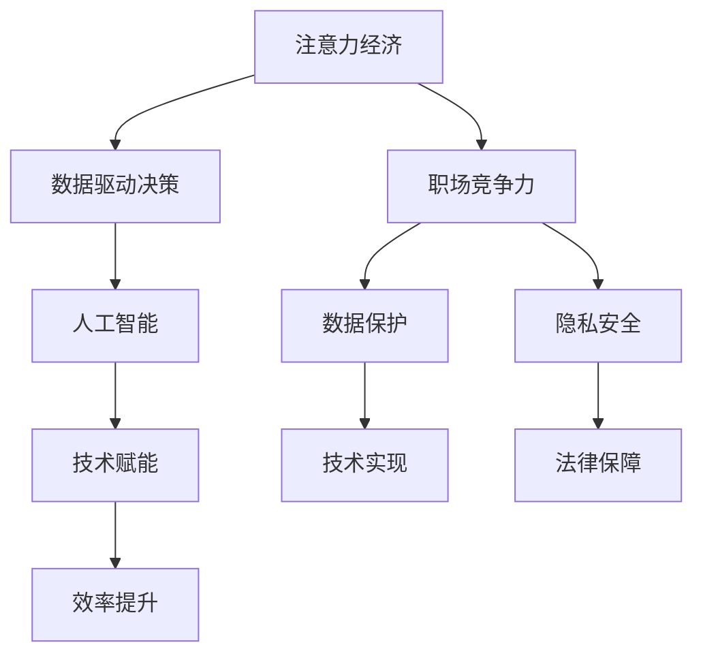

                 

# 注意力经济对职场竞争力的影响

> 关键词：注意力经济, 职场竞争力, 数据驱动决策, 人工智能, 技术赋能, 效率提升, 数据保护, 隐私安全

## 1. 背景介绍

### 1.1 问题由来

在数字化、信息化时代，人们获取信息的方式和渠道发生了根本性的变化。传统的媒体和广告模式逐渐被基于算法推荐的新型信息流平台所取代，如社交媒体、搜索引擎、视频网站等。这些平台通过收集用户的行为数据和偏好信息，利用算法模型对用户进行深度分析，从而提供个性化的内容推荐和广告投放，实现了高效的注意力捕获和转换。

### 1.2 问题核心关键点

这种以用户注意力为核心资源的经济形态，被称为"注意力经济"。在职场竞争中，企业、个人以及组织机构都在追求通过吸引、转化和保持用户注意力来提升自身价值。但注意力经济带来了新的挑战和机遇，如何有效利用注意力资源，在竞争中保持领先地位，成为了当前亟待解决的问题。

### 1.3 问题研究意义

研究注意力经济对职场竞争力的影响，对于理解数字化时代职场发展的趋势、优化资源配置、提升企业竞争力、保护用户隐私安全等具有重要意义。通过对注意力经济的研究，可以指导企业制定更加科学的决策策略，制定合理的用户数据治理政策，从而实现可持续发展。

## 2. 核心概念与联系

### 2.1 核心概念概述

为更好地理解注意力经济对职场竞争力的影响，本节将介绍几个密切相关的核心概念：

- 注意力经济（Attention Economy）：指通过吸引、转化和保持用户注意力来获取经济价值的一种新型经济模式。以互联网为基础，借助算法推荐、个性化服务等技术手段，实现高效的用户注意力捕获和转换。

- 职场竞争力（Workplace Competitiveness）：指个人或组织在职场环境中的综合实力和影响力，包括但不限于专业技能、创新能力、人际交往能力、资源整合能力等。

- 数据驱动决策（Data-Driven Decision Making）：指基于大量数据和分析结果来进行决策的过程，尤其适用于需要处理复杂、动态系统的情况。

- 人工智能（Artificial Intelligence, AI）：指利用算法、模型和计算能力，模拟、扩展和延伸人类智能的技术。

- 技术赋能（Technology Empowerment）：指通过先进技术手段提升个人、企业或组织的能力和效率。

- 效率提升（Efficiency Improvement）：指通过优化流程、引入新技术等手段，提升生产、服务、管理等各方面的效率。

- 数据保护（Data Protection）：指对个人或组织数据的收集、使用、存储、处理等行为进行规范和保护，避免数据滥用和安全风险。

- 隐私安全（Privacy and Security）：指在数据处理过程中，保护个人隐私和数据安全，防止数据泄露和滥用。

这些核心概念之间的逻辑关系可以通过以下Mermaid流程图来展示：



这个流程图展示了大语言模型的核心概念及其之间的关系：

1. 注意力经济通过对用户注意力的捕获和转换，驱动数据驱动决策的形成。
2. 职场竞争力受数据驱动决策的影响，影响员工的技能提升和企业的发展方向。
3. 数据驱动决策的核心是人工智能技术，通过算法和模型实现精准决策。
4. 人工智能技术需要技术赋能，提升模型效率和准确性。
5. 技术赋能可以提升效率，通过优化流程和引入新技术，实现效率的全面提升。
6. 职场竞争力的提升离不开数据保护和隐私安全，保证数据使用的规范和合法性。

这些概念共同构成了职场竞争力的关键因素，为我们理解注意力经济对职场的影响提供了理论框架。

## 3. 核心算法原理 & 具体操作步骤
### 3.1 算法原理概述

注意力经济与职场竞争力的关系，主要体现在数据驱动决策过程中。以数据为核心的算法模型，通过分析用户行为、偏好、位置等信息，预测用户需求，优化资源配置，提升决策效率和效果。

在实际操作中，基于注意力经济的数据驱动决策流程大致包括以下几个步骤：

1. 数据收集：通过各种手段（如用户注册、点击、搜索、购买等行为）收集用户数据。
2. 数据清洗与预处理：对收集到的数据进行去重、清洗、格式化等处理，确保数据质量。
3. 数据建模与分析：利用机器学习、深度学习等技术，对数据进行建模和分析，构建用户画像、行为轨迹等，理解用户需求和行为模式。
4. 策略制定与实施：根据数据分析结果，制定个性化的内容推荐、广告投放、产品优化等策略，并实施到实际业务中。
5. 效果评估与反馈：通过A/B测试、用户反馈、行为跟踪等手段，评估策略效果，并根据反馈进行调整和优化。

### 3.2 算法步骤详解

在具体实施过程中，通常需要构建一个以用户注意力为核心的决策系统，包括以下几个关键组件：

- **用户画像构建（User Profiling）**：通过分析用户历史行为、社交网络信息、设备信息等，构建用户的综合画像，理解用户的兴趣和需求。
- **行为预测（Behavior Prediction）**：利用算法模型对用户未来的行为进行预测，如点击、购买、搜索等，作为决策的依据。
- **内容推荐（Content Recommendation）**：根据用户的画像和行为预测结果，推荐合适的广告、内容或产品，实现用户注意力的最大化利用。
- **策略调整（Strategy Adjustment）**：根据实时数据反馈和用户行为，动态调整推荐策略，提升用户体验和转化率。

在每个组件中，均涉及到了复杂的算法模型和数据分析技术，以下将以用户画像构建为例，展示具体的算法步骤：

1. **数据收集**：收集用户的基本信息、行为数据、社交网络数据等，形成用户数据集。
2. **特征提取**：对用户数据进行特征提取，如年龄、性别、职业、兴趣标签、浏览记录、购买记录等。
3. **模型训练**：选择合适的机器学习或深度学习模型（如线性回归、决策树、神经网络等），对用户数据进行建模，训练出用户画像。
4. **画像融合**：将不同来源的用户数据进行融合，形成更加全面和准确的画像。
5. **实时更新**：根据用户新行为数据，实时更新用户画像，确保数据的实时性和准确性。

### 3.3 算法优缺点

基于注意力经济的数据驱动决策具有以下优点：

1. **个性化推荐**：通过分析用户行为数据，提供个性化推荐，提升用户体验和满意度。
2. **数据驱动决策**：基于数据建模和分析，可以更加科学、客观地制定决策策略，减少人为偏见。
3. **实时调整**：数据驱动决策系统可以快速响应市场变化和用户需求，实现动态调整和优化。

但同时也存在一些缺点：

1. **数据隐私问题**：收集和分析用户数据的过程中，可能涉及个人隐私问题，需要严格的数据保护和隐私管理。
2. **数据质量问题**：数据收集和处理过程中可能存在噪音、缺失等问题，影响决策的准确性。
3. **算法复杂度**：构建和维护数据驱动决策系统需要高水平的算法和数据处理能力，可能带来较高的技术门槛。
4. **过度依赖算法**：过度依赖算法可能忽视了人性化的设计，导致用户体验问题。

### 3.4 算法应用领域

基于注意力经济的数据驱动决策方法，已经在多个领域得到了广泛应用，包括但不限于：

- 电子商务：通过分析用户行为和历史交易数据，提供个性化推荐和广告，提升用户购买率。
- 在线广告：根据用户画像和行为预测，精准投放广告，实现广告投放效果的最大化。
- 内容分发：优化内容推荐算法，提升用户对平台内容的黏性，增加用户停留时间和互动率。
- 金融服务：利用用户行为数据，进行风险评估和信用评分，优化贷款审批流程。
- 健康医疗：分析用户健康数据，提供个性化的健康建议和治疗方案，提升用户健康管理水平。

除了上述这些经典应用外，注意力经济还将在更多领域得到创新性的应用，如智能家居、智能城市、智慧交通等，为各行各业带来新的增长点和价值提升。

## 4. 数学模型和公式 & 详细讲解  
### 4.1 数学模型构建

本节将使用数学语言对基于注意力经济的数据驱动决策过程进行更加严格的刻画。

记用户数据集为 $D=\{(x_i,y_i)\}_{i=1}^N$，其中 $x_i$ 为用户行为特征，$y_i$ 为标签。假设我们利用机器学习模型 $f(x_i;\theta)$ 对用户进行建模，其中 $\theta$ 为模型参数。数据驱动决策的目标是找到最优参数 $\theta^*$，使得模型在测试集上的预测效果最好。

常用的模型包括线性回归、决策树、随机森林、深度神经网络等。以线性回归模型为例，损失函数为均方误差损失：

$$
\mathcal{L}(\theta) = \frac{1}{2N}\sum_{i=1}^N (y_i - f(x_i;\theta))^2
$$

通过最小化损失函数，可以求解出最优参数 $\theta^*$。

### 4.2 公式推导过程

在具体推导过程中，以线性回归模型为例。假设我们有 $N$ 个用户行为数据 $(x_i,y_i)$，其中 $x_i=(x_i^{(1)},x_i^{(2)},\cdots,x_i^{(n)})$ 为用户的行为特征，$y_i$ 为用户的标签。利用最小二乘法，求解线性回归模型参数 $\theta^*$：

$$
\theta^* = \mathop{\arg\min}_{\theta} \frac{1}{2N}\sum_{i=1}^N (y_i - f(x_i;\theta))^2
$$

其中 $f(x_i;\theta) = \theta^T x_i$，$\theta$ 为模型参数，$x_i$ 为特征向量。

求解上述最优化问题，可以通过求导的方式求解：

$$
\frac{\partial \mathcal{L}(\theta)}{\partial \theta} = -\frac{1}{N}\sum_{i=1}^N (y_i - f(x_i;\theta)) x_i
$$

令导数为零，求解得到：

$$
\theta^* = (\frac{1}{N}\sum_{i=1}^N x_i x_i^T)^{-1} \frac{1}{N}\sum_{i=1}^N y_i x_i
$$

上述公式展示了线性回归模型的参数求解过程，通过对损失函数的优化，得到最优参数 $\theta^*$。

### 4.3 案例分析与讲解

以电商平台的个性化推荐系统为例，展示数据驱动决策的具体应用。

假设有一个电商网站，用户浏览了多个商品，我们可以利用用户浏览历史数据构建用户画像，并基于该画像进行个性化推荐。具体步骤如下：

1. **数据收集**：收集用户浏览历史、购买历史、评分历史等数据。
2. **数据预处理**：对数据进行清洗、去重、标准化等处理。
3. **用户画像构建**：利用机器学习模型，构建用户画像，如用户的兴趣标签、购物偏好等。
4. **行为预测**：基于用户画像，利用回归模型或分类模型，预测用户是否会购买某个商品。
5. **推荐生成**：根据预测结果，生成个性化推荐列表，推荐给用户。
6. **效果评估**：通过A/B测试等手段，评估推荐效果，优化模型和算法。

以下是一个简单的推荐系统的示例代码：

```python
from sklearn.linear_model import LinearRegression
from sklearn.metrics import mean_squared_error

# 数据集
X_train = [[1, 1], [2, 2], [3, 3], [4, 4]]
y_train = [2, 4, 6, 8]
X_test = [[5, 5], [6, 6]]

# 线性回归模型
model = LinearRegression()
model.fit(X_train, y_train)

# 预测
y_pred = model.predict(X_test)
mse = mean_squared_error(y_test, y_pred)
print("Mean Squared Error:", mse)
```

## 5. 项目实践：代码实例和详细解释说明
### 5.1 开发环境搭建

在进行项目实践前，我们需要准备好开发环境。以下是使用Python进行Scikit-Learn开发的环境配置流程：

1. 安装Anaconda：从官网下载并安装Anaconda，用于创建独立的Python环境。

2. 创建并激活虚拟环境：
```bash
conda create -n sklearn-env python=3.8 
conda activate sklearn-env
```

3. 安装Scikit-Learn：
```bash
pip install scikit-learn
```

4. 安装各类工具包：
```bash
pip install numpy pandas scikit-learn matplotlib tqdm jupyter notebook ipython
```

完成上述步骤后，即可在`sklearn-env`环境中开始项目实践。

### 5.2 源代码详细实现

下面我们以线性回归为例，展示Scikit-Learn库的推荐系统开发过程。

首先，定义数据集：

```python
from sklearn.datasets import make_regression
from sklearn.model_selection import train_test_split

# 生成数据集
X, y = make_regression(n_samples=100, n_features=2, noise=10)

# 划分训练集和测试集
X_train, X_test, y_train, y_test = train_test_split(X, y, test_size=0.2, random_state=42)
```

然后，构建线性回归模型：

```python
from sklearn.linear_model import LinearRegression

# 训练模型
model = LinearRegression()
model.fit(X_train, y_train)

# 预测
y_pred = model.predict(X_test)
```

最后，评估模型效果：

```python
from sklearn.metrics import mean_squared_error

# 计算评估指标
mse = mean_squared_error(y_test, y_pred)
print("Mean Squared Error:", mse)
```

以上就是使用Scikit-Learn库进行线性回归推荐系统的完整代码实现。可以看到，Scikit-Learn提供了便捷的数据处理和模型构建工具，使得推荐系统的开发变得简洁高效。

### 5.3 代码解读与分析

让我们再详细解读一下关键代码的实现细节：

**make_regression函数**：
- 生成一个模拟的数据集，其中包含100个样本，每个样本有2个特征，加入随机噪声。

**train_test_split函数**：
- 将数据集划分为训练集和测试集，测试集占总数据集的20%，随机种子为42，保证结果的可重复性。

**LinearRegression类**：
- 构建线性回归模型，并使用训练集数据进行拟合。

**predict方法**：
- 使用训练好的模型对测试集数据进行预测，返回预测结果。

**mean_squared_error函数**：
- 计算预测结果与真实值之间的均方误差，评估模型性能。

通过对这些关键代码的解读，我们可以更加深入地理解数据驱动决策的实现过程，以及推荐系统的工作原理。

## 6. 实际应用场景
### 6.1 智能客服系统

基于数据驱动决策的智能客服系统，可以实现高效的用户交互和问题解答。通过分析用户的历史咨询记录、搜索记录和点击行为，构建用户画像，智能客服系统可以自动识别用户的意图，快速提供精准的解决方案。

在技术实现上，可以收集用户的历史数据，构建用户画像，并利用机器学习模型进行行为预测。系统根据预测结果，自动匹配合适的回答模板，或者引导用户进行下一步操作，从而提升用户满意度和问题解决效率。

### 6.2 金融风险管理

在金融领域，数据驱动决策可以用于风险评估、信用评分、投资组合优化等。通过分析用户的历史交易数据、信用记录等，构建用户画像，金融系统可以实时监控用户的风险水平，预测违约概率，优化贷款审批流程。

在具体实现中，可以利用信用评分模型对用户进行评分，利用机器学习模型预测用户未来的还款能力，从而评估其信用风险。系统根据风险评估结果，动态调整贷款利率和审批条件，提升贷款决策的科学性和准确性。

### 6.3 健康医疗服务

在健康医疗领域，数据驱动决策可以用于个性化健康管理、智能诊断和疾病预防等。通过分析用户的健康数据、生活习惯等，构建用户画像，医疗系统可以提供个性化的健康建议和治疗方案，提升用户的健康管理水平。

在具体实现中，可以构建健康管理模型，根据用户的健康数据和行为数据，预测其未来的健康状况，提供个性化的健康建议。系统还可以利用机器学习模型进行疾病预测和预防，提前预警用户可能出现的健康问题，避免疾病的进一步恶化。

### 6.4 未来应用展望

随着数据驱动决策技术的不断进步，基于注意力经济的数据驱动决策方法将在更多领域得到应用，为各行各业带来新的价值提升。

在智慧城市治理中，数据驱动决策可以用于城市事件监测、交通管理、环境监控等，提升城市管理的自动化和智能化水平，构建更安全、高效的未来城市。

在农业领域，数据驱动决策可以用于精准农业、智能农机管理等，提升农业生产效率和资源利用率，促进农业的可持续发展。

在教育领域，数据驱动决策可以用于个性化教学、学习行为分析等，提升教育质量和学习效果，推动教育公平和创新。

## 7. 工具和资源推荐
### 7.1 学习资源推荐

为了帮助开发者系统掌握数据驱动决策的理论基础和实践技巧，这里推荐一些优质的学习资源：

1. 《数据驱动决策：理论与实践》系列博文：由数据科学专家撰写，深入浅出地介绍了数据驱动决策的基本概念和核心方法。

2. Coursera《数据科学导论》课程：斯坦福大学开设的在线课程，涵盖数据收集、数据清洗、数据建模和评估等基本流程。

3. 《Python数据分析与可视化》书籍：详细介绍了如何使用Python进行数据处理和可视化，包括Pandas、Matplotlib、Seaborn等工具的使用。

4. Scikit-Learn官方文档：Scikit-Learn库的官方文档，提供了丰富的机器学习算法和实例代码，是学习数据驱动决策的重要资源。

5. Kaggle竞赛：参加Kaggle数据科学竞赛，实战练习数据驱动决策的应用，提升数据处理和模型构建的能力。

通过对这些资源的学习实践，相信你一定能够快速掌握数据驱动决策的精髓，并用于解决实际的业务问题。

### 7.2 开发工具推荐

高效的开发离不开优秀的工具支持。以下是几款用于数据驱动决策开发的常用工具：

1. Jupyter Notebook：一款开源的Jupyter notebook客户端，支持Python、R等语言的交互式编程和代码执行。

2. Scikit-Learn：一个基于Python的机器学习库，提供了丰富的机器学习算法和工具，适合快速原型开发和数据探索。

3. TensorFlow：由Google主导开发的深度学习框架，生产部署方便，适合大规模工程应用。

4. Weights & Biases：模型训练的实验跟踪工具，可以记录和可视化模型训练过程中的各项指标，方便对比和调优。

5. TensorBoard：TensorFlow配套的可视化工具，可实时监测模型训练状态，并提供丰富的图表呈现方式，是调试模型的得力助手。

6. Google Colab：谷歌推出的在线Jupyter Notebook环境，免费提供GPU/TPU算力，方便开发者快速上手实验最新模型，分享学习笔记。

合理利用这些工具，可以显著提升数据驱动决策的开发效率，加快创新迭代的步伐。

### 7.3 相关论文推荐

数据驱动决策的发展源于学界的持续研究。以下是几篇奠基性的相关论文，推荐阅读：

1. "A Survey of Machine Learning in Healthcare: Algorithms, Challenges, and Future Directions"：综述了机器学习在健康医疗领域的应用，展示了数据驱动决策的巨大潜力。

2. "Data Mining for Health Sciences and Medicine"：介绍了数据挖掘在健康科学和医学领域的应用，展示了数据驱动决策在疾病预防和治疗中的应用。

3. "Evolving Machines: Trends, Potential and Future Challenges in Artificial Intelligence"：探讨了人工智能领域的发展趋势，强调了数据驱动决策在智能决策系统中的重要性。

4. "Machine Learning in Finance: A Survey"：综述了机器学习在金融领域的应用，展示了数据驱动决策在风险管理、投资优化等方面的应用。

5. "A Survey on Data-Driven Decision Making in Healthcare"：综述了数据驱动决策在健康医疗领域的应用，展示了数据驱动决策在个性化医疗、智能诊断等方面的应用。

这些论文代表了大数据驱动决策的发展脉络。通过学习这些前沿成果，可以帮助研究者把握学科前进方向，激发更多的创新灵感。

## 8. 总结：未来发展趋势与挑战

### 8.1 总结

本文对基于注意力经济的数据驱动决策方法进行了全面系统的介绍。首先阐述了注意力经济对职场竞争力的影响，明确了数据驱动决策在提升企业、个人和组织竞争力的重要意义。其次，从原理到实践，详细讲解了数据驱动决策的数学模型和关键步骤，给出了数据驱动决策任务开发的完整代码实例。同时，本文还广泛探讨了数据驱动决策在多个行业领域的应用前景，展示了数据驱动决策的广泛应用潜力。

通过本文的系统梳理，可以看到，数据驱动决策技术在数字化时代的重要性，以及其在提升企业、个人和组织竞争力的巨大潜力。未来，伴随数据驱动决策技术的不断发展，基于注意力经济的数据驱动决策方法必将在更多领域得到应用，为各行各业带来新的增长点和价值提升。

### 8.2 未来发展趋势

展望未来，数据驱动决策技术将呈现以下几个发展趋势：

1. **自动化与智能化**：随着算法和模型的不断进步，数据驱动决策系统将越来越智能化，能够自动完成数据处理、特征提取、模型训练和结果评估等任务。

2. **跨领域融合**：数据驱动决策将与其他新兴技术（如区块链、物联网、量子计算等）进行深度融合，实现跨领域、跨行业的智能决策。

3. **实时性提升**：数据驱动决策系统将实现实时数据处理和决策，提升决策的响应速度和时效性。

4. **数据隐私保护**：在数据驱动决策过程中，将更加重视用户隐私和数据安全，开发和使用隐私保护技术，确保数据使用的合法性和安全性。

5. **因果推断与因果学习**：数据驱动决策将引入因果推断和因果学习方法，提升决策结果的因果性和逻辑性，增强决策的可解释性。

6. **元学习与迁移学习**：通过元学习和迁移学习技术，数据驱动决策系统将具备更好的泛化能力和适应性，提升决策系统的鲁棒性和稳定性。

这些趋势凸显了数据驱动决策技术的广阔前景，为数字化时代的企业和组织提供了新的技术手段，以提升决策科学性和效率。

### 8.3 面临的挑战

尽管数据驱动决策技术已经取得了显著成果，但在迈向更加智能化、普适化应用的过程中，它仍面临诸多挑战：

1. **数据质量和治理**：高质量数据的获取和治理是数据驱动决策的基础，但实际应用中存在数据缺失、噪音等问题，影响决策的准确性和可靠性。

2. **算法复杂性**：构建高效、准确的数据驱动决策模型需要高水平的算法和数据处理能力，需要大量的数据和计算资源。

3. **模型解释性**：数据驱动决策模型通常被视为"黑盒"系统，难以解释其内部工作机制和决策逻辑，缺乏透明度和可信度。

4. **隐私和安全风险**：在数据驱动决策过程中，需要收集和处理大量的用户数据，涉及隐私和安全问题，需要严格的数据保护和隐私管理。

5. **技术门槛**：数据驱动决策需要跨学科的知识和技能，技术门槛较高，需要大量的专业培训和实践经验。

6. **动态环境适应性**：数据驱动决策系统需要适应动态、复杂的环境，实时应对市场变化和用户需求，需要持续优化和调整。

这些挑战需要研究者、开发者和政策制定者共同努力，采取合适的技术手段和管理措施，确保数据驱动决策技术的安全、可靠和有效。

### 8.4 研究展望

未来，数据驱动决策技术需要在以下几个方面寻求新的突破：

1. **自动化和智能化决策**：开发更智能、更高效的自动化决策系统，提升决策的效率和质量。

2. **跨领域和跨行业融合**：探索数据驱动决策在跨领域、跨行业的应用，推动跨学科、跨行业的协同创新。

3. **隐私保护与数据安全**：开发隐私保护和数据安全技术，确保数据驱动决策过程中的隐私和数据安全。

4. **因果推断与因果学习**：引入因果推断和因果学习思想，提升决策的因果性和逻辑性，增强决策的可解释性和可信度。

5. **元学习和迁移学习**：通过元学习和迁移学习技术，提升决策系统的泛化能力和适应性，增强决策系统的鲁棒性和稳定性。

6. **模型可解释性**：开发可解释性的决策模型，增强决策的透明度和可信度，帮助用户理解和信任决策结果。

这些研究方向将引领数据驱动决策技术迈向更高的台阶，为构建安全、可靠、可解释、可控的智能决策系统铺平道路。面向未来，数据驱动决策技术需要与其他新兴技术进行更深入的融合，共同推动智能决策系统的进步。只有勇于创新、敢于突破，才能不断拓展数据驱动决策技术的边界，让智能决策系统更好地服务于人类社会。

## 9. 附录：常见问题与解答

**Q1：数据驱动决策是否适用于所有业务场景？**

A: 数据驱动决策在许多业务场景中具有广泛的应用前景，但并不适用于所有场景。例如，一些需要高精度和高可靠性的场景（如医疗、金融等），需要结合领域知识和专家经验进行决策，数据驱动决策无法完全替代人工决策。此外，一些需要高度人机交互的场景（如客户服务、创意设计等），数据驱动决策也难以完全取代人工决策。

**Q2：如何选择合适的数据驱动决策模型？**

A: 选择合适的数据驱动决策模型需要考虑多个因素，包括但不限于：

1. 数据类型：不同类型的数据（如结构化数据、非结构化数据、时序数据等）需要不同的模型。例如，结构化数据适合使用统计模型，非结构化数据适合使用机器学习模型，时序数据适合使用时间序列模型。

2. 数据规模：大数据集适合使用深度学习模型，小数据集适合使用统计模型或传统机器学习模型。

3. 业务需求：不同业务需求需要不同的模型。例如，预测业务适合使用回归模型，分类业务适合使用分类模型，聚类业务适合使用聚类模型。

4. 模型性能：根据业务需求和数据特点，选择合适的模型，并通过实验评估其性能。

5. 模型复杂度：模型的复杂度和计算资源消耗需要平衡，需要根据实际情况选择。

**Q3：数据驱动决策在实施过程中需要注意哪些问题？**

A: 数据驱动决策在实施过程中需要注意以下问题：

1. 数据质量：数据质量是数据驱动决策的基础，需要确保数据的准确性、完整性和一致性。

2. 数据隐私：在收集和处理用户数据时，需要遵守相关法律法规，保护用户隐私。

3. 模型透明性：数据驱动决策模型通常被视为"黑盒"系统，需要提高模型的透明性，帮助用户理解和信任决策结果。

4. 模型可解释性：数据驱动决策模型需要具有可解释性，能够帮助用户理解决策过程和决策结果。

5. 动态环境适应性：数据驱动决策模型需要适应动态、复杂的环境，实时应对市场变化和用户需求。

6. 模型更新：数据驱动决策模型需要根据数据和环境的变化进行持续更新和优化，保持其有效性和准确性。

通过对这些问题的关注和解决，可以确保数据驱动决策系统的高效、可靠和可解释性。

**Q4：如何提高数据驱动决策的效率和效果？**

A: 提高数据驱动决策的效率和效果需要从多个方面入手：

1. 数据预处理：对数据进行清洗、去重、归一化等预处理，提高数据质量。

2. 特征工程：根据业务需求和数据特点，选择合适的特征，并进行特征提取和处理，提高模型性能。

3. 模型选择：根据业务需求和数据特点，选择合适的模型，并通过实验评估其性能。

4. 模型优化：通过超参数调优、模型融合等手段，优化模型的性能和效率。

5. 实时数据处理：实现实时数据处理和决策，提升决策的时效性。

6. 持续学习：通过在线学习、增量学习等技术，使模型能够持续学习新数据，保持其有效性和准确性。

通过这些措施，可以显著提升数据驱动决策的效率和效果，使其更好地服务于实际业务。

**Q5：如何平衡数据驱动决策与人工决策的关系？**

A: 在实际业务中，数据驱动决策和人工决策往往需要相互结合，以充分发挥各自的优势。以下是一些平衡二者的建议：

1. 明确决策边界：根据业务需求和场景特点，明确数据驱动决策和人工决策的边界，避免过度依赖。

2. 数据与知识结合：将数据驱动决策与领域知识和专家经验相结合，提升决策的科学性和合理性。

3. 透明与可解释：提高数据驱动决策模型的透明性和可解释性，帮助用户理解和信任决策结果。

4. 多重验证：对数据驱动决策结果进行多重验证和评估，确保其准确性和可靠性。

5. 持续优化：根据实际业务反馈和环境变化，持续优化数据驱动决策模型，提升其效果和效率。

通过对这些措施的实施，可以更好地平衡数据驱动决策与人工决策的关系，实现二者的协同创新。

**Q6：如何确保数据驱动决策系统的安全性？**

A: 数据驱动决策系统的安全性需要从多个方面进行保障：

1. 数据安全：确保数据传输和存储的安全性，防止数据泄露和滥用。

2. 访问控制：通过身份验证、权限控制等手段，确保只有授权用户才能访问数据和系统。

3. 数据匿名化：对敏感数据进行匿名化处理，防止数据被恶意利用。

4. 模型鲁棒性：确保数据驱动决策模型具备鲁棒性，能够抵御攻击和异常数据。

5. 持续监测：对系统进行持续监测和审计，及时发现和应对安全问题。

通过对这些措施的实施，可以确保数据驱动决策系统的安全性，保护用户隐私和数据安全。

---

作者：禅与计算机程序设计艺术 / Zen and the Art of Computer Programming

