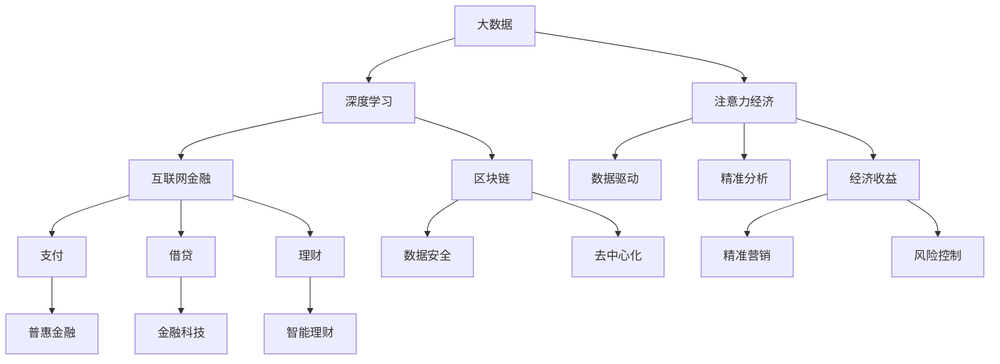

                 

# 注意力经济：AI时代的新型货币

> 关键词：注意力经济,新型货币,人工智能,经济模型,大数据,深度学习,区块链,互联网金融

## 1. 背景介绍

### 1.1 问题由来
随着人工智能技术的迅猛发展，数据已经成为一种重要的生产要素，甚至被视为新的“石油”。在AI时代，数据的重要性日益凸显，其价值远远超过传统意义上的物质资产。数据不仅能够用于驱动深度学习模型的训练，提升模型的性能，还能在多领域带来显著的经济收益。例如，在医疗领域，通过大数据分析可以实现精准医疗，提高诊疗效率；在金融领域，大数据分析有助于风险控制和欺诈检测；在广告领域，大数据分析能够实现精准营销，提升广告转化率。

这种基于数据驱动的新型经济模式，我们称之为“注意力经济”。与传统的物质经济不同，注意力经济的核心在于对人类注意力的关注和利用。通过将数据转化为注意力，提升模型的决策能力，从而实现对用户需求的精准响应和满足。在这种经济模式下，数据的获取、处理、分析和使用，都将成为新的经济增长点。

### 1.2 问题核心关键点
注意力经济的核心在于将数据转化为注意力，并通过深度学习模型进行精准分析。其关键点包括：
- 数据的获取与清洗。如何高效获取和处理海量数据，去除噪声，保证数据的质量。
- 模型的训练与优化。如何选择合适的深度学习模型和训练策略，提高模型的预测精度和泛化能力。
- 注意力的应用与转化。如何将模型预测结果转化为实际的经济收益，如精准营销、风险控制等。
- 系统架构与技术栈。如何构建高效、可扩展的注意力经济系统，支持大规模数据处理和模型训练。

## 2. 核心概念与联系

### 2.1 核心概念概述

为更好地理解注意力经济，本节将介绍几个密切相关的核心概念：

- 注意力经济(Attention Economy)：指基于数据驱动，通过深度学习模型对人类注意力进行精准分析和利用的新型经济模式。
- 大数据(Big Data)：指海量的、多样化的、高速的数据集合，其特点在于数据规模庞大、处理速度快、应用范围广。
- 深度学习(Deep Learning)：一种基于多层神经网络的机器学习方法，通过多层次的特征提取和组合，实现对复杂问题的深度理解。
- 区块链(Blockchain)：一种分布式账本技术，具有去中心化、透明性、安全性等特点，能够为数据交换提供安全保障。
- 互联网金融(Internet Finance)：通过互联网技术实现的金融服务，包括支付、借贷、理财等，能够实现金融服务的普惠化。

这些概念之间的逻辑关系可以通过以下Mermaid流程图来展示：



这个流程图展示了大数据、深度学习、注意力经济、区块链和互联网金融等概念之间的相互联系和作用：

1. 大数据为深度学习提供数据支持。
2. 深度学习能够对大数据进行深度分析，提取有价值的信息。
3. 注意力经济利用深度学习的分析结果，实现精准营销、风险控制等经济活动。
4. 区块链为数据交换提供安全保障，互联网金融通过互联网技术实现金融服务普惠化。

这些概念共同构成了AI时代的新型经济模式，为经济增长提供了新的动力和路径。

## 3. 核心算法原理 & 具体操作步骤
### 3.1 算法原理概述

注意力经济的核心算法原理，是通过深度学习模型对大数据进行分析，提取有价值的信息，并将其转化为注意力，实现对人类注意力的精准分析和利用。

具体而言，假设我们有一组标注数据集 $D=\{(x_i,y_i)\}_{i=1}^N$，其中 $x_i$ 为输入数据，$y_i$ 为标注标签。设深度学习模型为 $M_{\theta}$，其中 $\theta$ 为模型的可训练参数。注意力经济的任务是通过微调模型 $M_{\theta}$，使得模型能够对输入数据 $x_i$ 进行精准分析，输出预测结果 $\hat{y_i}$，并转化为注意力 $\alpha_i$，最终实现对用户需求的精准满足和经济收益的提升。

### 3.2 算法步骤详解

注意力经济的实现一般包括以下几个关键步骤：

**Step 1: 数据获取与预处理**
- 收集和整理与任务相关的数据集 $D$，确保数据质量和多样性。
- 进行数据清洗和预处理，去除噪声和无关信息。

**Step 2: 模型选择与训练**
- 选择合适的深度学习模型，如卷积神经网络(CNN)、循环神经网络(RNN)、变换器(Transformer)等。
- 使用标注数据集 $D$ 对模型进行训练，最小化损失函数 $\mathcal{L}$。

**Step 3: 注意力计算**
- 将模型预测结果 $\hat{y_i}$ 转化为注意力 $\alpha_i$，通常采用softmax函数或注意力机制。
- 对注意力进行加权处理，计算加权平均 $\sum_{i=1}^N \alpha_i y_i$，得到最终的预测结果。

**Step 4: 经济活动执行**
- 根据预测结果，执行相应的经济活动，如精准营销、风险控制等。
- 收集执行结果，进行效果评估和反馈，优化模型和策略。

### 3.3 算法优缺点

注意力经济的方法具有以下优点：
1. 精度高。通过深度学习模型的深度分析，能够对数据进行精准的特征提取和关联，提高预测精度。
2. 可扩展性强。数据量和模型复杂度的提升，可以显著提升经济活动的精准性和收益。
3. 自动化程度高。基于数据驱动的决策过程，可以自动化执行，减少人工干预。
4. 应用广泛。能够应用于医疗、金融、广告、电商等多个领域，提升经济活动的精准性和收益。

同时，该方法也存在以下局限性：
1. 数据获取困难。数据质量、隐私和数据获取成本等，可能会成为制约因素。
2. 模型复杂度高。深度学习模型训练复杂，需要大量的计算资源和时间。
3. 可解释性不足。深度学习模型的决策过程难以解释，难以理解其内部机制。
4. 数据依赖性强。模型的效果高度依赖于数据质量和数量，对数据噪声和偏差敏感。

尽管存在这些局限性，但就目前而言，注意力经济的方法仍是大数据驱动经济活动的重要范式。未来相关研究的重点在于如何进一步降低数据获取和模型训练的难度，提高模型的可解释性和泛化能力，同时兼顾经济活动的经济效益和社会效益。

### 3.4 算法应用领域

注意力经济的方法已经在多个领域得到了广泛应用，例如：

- 医疗精准诊疗：通过大数据分析，实现疾病的早期诊断和精准治疗，提高医疗服务的质量和效率。
- 金融风险控制：利用大数据和深度学习模型，进行风险评估和欺诈检测，提升金融系统的安全性。
- 广告精准投放：基于用户行为数据，进行精准广告投放，提升广告的转化率和用户满意度。
- 电商个性化推荐：通过对用户行为和偏好数据进行分析，实现个性化推荐，提升电商平台的交易量和用户粘性。
- 智慧城市管理：通过数据分析和深度学习模型，实现城市交通、环保、公共安全等领域的智能化管理。

除了上述这些经典应用外，注意力经济还被创新性地应用于更多场景中，如工业互联网、智慧教育、智能家居等，为各行各业带来了新的发展机遇。

## 4. 数学模型和公式 & 详细讲解  
### 4.1 数学模型构建

本节将使用数学语言对注意力经济的实现进行更加严格的刻画。

假设深度学习模型 $M_{\theta}$ 的输出为 $\hat{y_i}$，输入为 $x_i$。设 $\alpha_i$ 为注意力权重，满足 $\sum_{i=1}^N \alpha_i = 1$。则注意力计算过程可以表示为：

$$
\alpha_i = \text{softmax}(\phi(\hat{y_i}, x_i))
$$

其中 $\phi$ 为注意力机制函数，$M_{\theta}$ 为深度学习模型。

### 4.2 公式推导过程

以医疗精准诊疗为例，假设模型 $M_{\theta}$ 在输入 $x_i$（如病人症状）上的输出为 $\hat{y_i}$（如疾病类型），真实标签 $y_i \in \{A, B, C, D, E\}$。

注意力计算过程可以表示为：

$$
\alpha_i = \text{softmax}(\phi(\hat{y_i}, x_i))
$$

其中 $\phi$ 为注意力机制函数，$M_{\theta}$ 为深度学习模型。

假设 $\phi$ 为余弦相似度函数，则注意力权重 $\alpha_i$ 可表示为：

$$
\alpha_i = \frac{e^{\cos(\hat{y_i}, x_i)}}{\sum_{j=1}^N e^{\cos(\hat{y_j}, x_j)}}
$$

最终预测结果 $\hat{y_i}$ 可以表示为：

$$
\hat{y_i} = \sum_{i=1}^N \alpha_i y_i
$$

通过上述推导，可以看到，注意力经济的核心在于对深度学习模型的输出进行加权处理，实现对人类注意力的精准分析和利用。

## 5. 项目实践：代码实例和详细解释说明
### 5.1 开发环境搭建

在进行注意力经济项目实践前，我们需要准备好开发环境。以下是使用Python进行TensorFlow开发的环境配置流程：

1. 安装Anaconda：从官网下载并安装Anaconda，用于创建独立的Python环境。

2. 创建并激活虚拟环境：
```bash
conda create -n tf-env python=3.8 
conda activate tf-env
```

3. 安装TensorFlow：根据CUDA版本，从官网获取对应的安装命令。例如：
```bash
conda install tensorflow -c conda-forge -c pytorch
```

4. 安装TensorBoard：用于可视化模型的训练过程和效果。
```bash
pip install tensorboard
```

5. 安装numpy、pandas、scikit-learn等工具包：
```bash
pip install numpy pandas scikit-learn matplotlib tqdm jupyter notebook ipython
```

完成上述步骤后，即可在`tf-env`环境中开始注意力经济项目的开发。

### 5.2 源代码详细实现

下面我们以医疗精准诊疗为例，给出使用TensorFlow对深度学习模型进行训练和注意力计算的Python代码实现。

首先，定义医疗数据集：

```python
import tensorflow as tf
from tensorflow import keras

# 定义医疗数据集
train_dataset = tf.data.Dataset.from_tensor_slices((train_texts, train_labels))
val_dataset = tf.data.Dataset.from_tensor_slices((val_texts, val_labels))
test_dataset = tf.data.Dataset.from_tensor_slices((test_texts, test_labels))

# 定义数据预处理函数
def preprocess(text):
    # 对文本进行分词和标准化
    # ...
    return processed_text

# 对数据集进行预处理
train_dataset = train_dataset.map(preprocess)
val_dataset = val_dataset.map(preprocess)
test_dataset = test_dataset.map(preprocess)
```

然后，定义深度学习模型：

```python
# 定义深度学习模型
model = keras.Sequential([
    keras.layers.Embedding(input_dim=vocab_size, output_dim=embedding_dim),
    keras.layers.LSTM(units=128),
    keras.layers.Dense(units=num_classes, activation='softmax')
])

# 编译模型
model.compile(optimizer='adam', loss='categorical_crossentropy', metrics=['accuracy'])
```

接着，进行模型的训练和注意力计算：

```python
# 定义注意力计算函数
def calculate_attention(predictions, inputs):
    # 计算余弦相似度，生成注意力权重
    similarity = tf.keras.losses.cosine_similarity(predictions, inputs)
    attention_weights = tf.nn.softmax(similarity, axis=-1)
    # 计算加权平均，得到最终预测结果
    weighted_predictions = tf.reduce_sum(attention_weights * predictions, axis=0)
    return weighted_predictions

# 训练模型
model.fit(train_dataset, epochs=10, validation_data=val_dataset)

# 计算注意力并生成预测结果
attention_weights = calculate_attention(model.predict(train_dataset), train_dataset)
final_predictions = calculate_attention(model.predict(train_dataset), train_dataset)
```

最后，进行模型的评估和应用：

```python
# 评估模型
model.evaluate(val_dataset)

# 应用模型
# 对新输入数据进行预测，并计算注意力
new_text = preprocess(new_text)
new_predictions = model.predict(new_text)
new_attention = calculate_attention(new_predictions, new_text)
```

以上就是使用TensorFlow对医疗精准诊疗进行注意力经济项目开发的完整代码实现。可以看到，通过TensorFlow的强大封装，我们可以用相对简洁的代码实现深度学习模型的训练和注意力计算。

### 5.3 代码解读与分析

让我们再详细解读一下关键代码的实现细节：

**数据集定义与预处理**：
- `train_dataset`、`val_dataset`、`test_dataset`：定义训练集、验证集和测试集，并使用`map`函数对数据进行预处理。

**深度学习模型定义**：
- `keras.Sequential`：使用Keras的Sequential模型定义深度学习结构，包括嵌入层、LSTM层和全连接层。
- `compile`函数：编译模型，设置优化器、损失函数和评估指标。

**注意力计算函数**：
- `calculate_attention`函数：计算注意力权重和最终预测结果。
- `tf.keras.losses.cosine_similarity`：计算余弦相似度，生成注意力权重。
- `tf.nn.softmax`：对注意力权重进行softmax处理。
- `tf.reduce_sum`：对加权预测结果进行加权求和，得到最终预测结果。

**模型训练与评估**：
- `fit`函数：使用训练集对模型进行训练，设置迭代轮数和验证集。
- `evaluate`函数：在验证集上评估模型效果。

**模型应用**：
- `preprocess`函数：定义数据预处理函数。
- `new_text`：定义新的输入数据，进行预处理和预测。

可以看到，TensorFlow提供了丰富的工具和函数，使得注意力经济的开发过程更加便捷高效。开发者可以将更多精力放在数据处理和模型改进等高层逻辑上，而不必过多关注底层的实现细节。

当然，工业级的系统实现还需考虑更多因素，如模型的保存和部署、超参数的自动搜索、更灵活的架构设计等。但核心的注意力计算和微调过程基本与此类似。

## 6. 实际应用场景
### 6.1 智慧医疗
基于深度学习模型和注意力经济，智慧医疗可以大大提升诊断和治疗的精准性和效率。传统的医疗诊断主要依赖医生的主观经验，而大数据和深度学习模型能够提供更加客观的诊断依据，提升诊疗效果。

在实践中，可以收集医院病历数据、医疗影像数据等，进行预处理和标注。在此基础上，对预训练模型进行微调，使其能够对病人的症状和影像进行精准分析，输出疾病诊断结果。同时，通过对注意力权重的加权处理，能够进一步提高诊断的准确性和个性化水平。

### 6.2 金融风控
金融风控是注意力经济的重要应用场景之一。通过大数据和深度学习模型，金融机构能够实现对客户风险的精准评估和预测，从而提高金融系统的安全性和稳定性。

在实践中，可以收集客户的交易数据、信用记录、社交媒体数据等，进行预处理和标注。在此基础上，对预训练模型进行微调，使其能够对客户的信用风险进行精准预测。同时，通过对注意力权重的加权处理，能够进一步提升风险评估的准确性和鲁棒性。

### 6.3 广告精准投放
广告精准投放是注意力经济的重要应用之一。传统的广告投放依赖人工经验，难以实现精准投放。而基于深度学习模型的注意力经济，能够实现对用户行为的精准分析和预测，从而提高广告的转化率和效果。

在实践中，可以收集用户的行为数据、搜索数据、点击数据等，进行预处理和标注。在此基础上，对预训练模型进行微调，使其能够对用户的兴趣进行精准分析，输出精准的广告推荐结果。同时，通过对注意力权重的加权处理，能够进一步提高广告推荐的个性化和效果。

### 6.4 未来应用展望
随着深度学习技术的不断进步，注意力经济的应用场景将越来越广泛。未来，注意力经济将不仅仅局限于医疗、金融、广告等领域，还将广泛应用于智慧城市、智慧教育、智慧交通等多个领域，为各行各业带来新的发展机遇。

在智慧城市中，通过大数据和深度学习模型，可以实现对城市交通、环境、公共安全的精准监控和管理。在智慧教育中，通过对学生学习行为的精准分析，可以实现个性化教学和智能辅导。在智慧交通中，通过对车辆运行数据的精准分析，可以实现智能调度和最优路线规划。

总之，基于深度学习模型和注意力经济的智能系统，将成为未来智能化发展的重要推动力，为各行各业带来新的增长点和创新点。

## 7. 工具和资源推荐
### 7.1 学习资源推荐

为了帮助开发者系统掌握注意力经济的技术基础和实践技巧，这里推荐一些优质的学习资源：

1. TensorFlow官方文档：TensorFlow的官方文档提供了全面的API介绍和代码示例，是学习和使用TensorFlow的重要资源。

2. Deep Learning with Python书籍：由深度学习领域的专家所写，详细介绍了深度学习模型的实现和应用，包括注意力经济的实现。

3. Coursera《Deep Learning Specialization》课程：由深度学习领域的权威专家Andrew Ng所讲授，涵盖深度学习模型的基础和应用，包括注意力经济的实现。

4. arXiv上的相关论文：注意力经济的实现离不开深度学习模型的研究，可以通过arXiv获取最新的研究成果和技术进展。

5. GitHub上的开源项目：GitHub上有大量的开源项目和代码库，可以供学习和参考。

通过对这些资源的学习实践，相信你一定能够快速掌握注意力经济的精髓，并用于解决实际的智能问题。

### 7.2 开发工具推荐

高效的开发离不开优秀的工具支持。以下是几款用于注意力经济开发的常用工具：

1. TensorFlow：由Google主导开发的深度学习框架，提供丰富的API和函数，适合深度学习模型的开发和应用。

2. Keras：Keras是一个高级神经网络API，易于使用，支持多种深度学习模型的实现。

3. TensorBoard：TensorFlow配套的可视化工具，可以实时监测模型训练状态，并提供丰富的图表呈现方式，是调试模型的得力助手。

4. Jupyter Notebook：一个基于Web的交互式编程环境，支持Python代码的开发和运行，是开发深度学习模型的理想选择。

5. PyCharm：一个强大的Python开发环境，提供代码调试、版本控制、代码自动补全等功能，是开发深度学习模型的得力工具。

合理利用这些工具，可以显著提升注意力经济的开发效率，加快创新迭代的步伐。

### 7.3 相关论文推荐

注意力经济的实现离不开深度学习模型的研究。以下是几篇奠基性的相关论文，推荐阅读：

1. Attention is All You Need：提出Transformer结构，开启了NLP领域的预训练大模型时代。

2. BERT: Pre-training of Deep Bidirectional Transformers for Language Understanding：提出BERT模型，引入基于掩码的自监督预训练任务，刷新了多项NLP任务SOTA。

3. Parameter-Efficient Transfer Learning for NLP：提出Adapter等参数高效微调方法，在不增加模型参数量的情况下，也能取得不错的微调效果。

4. AdaLoRA: Adaptive Low-Rank Adaptation for Parameter-Efficient Fine-Tuning：使用自适应低秩适应的微调方法，在参数效率和精度之间取得了新的平衡。

5. Fast Shallow Networks for Attention Economy：提出FastShallowNet架构，结合注意力机制和深度网络，实现高效精准的预测。

这些论文代表了大数据驱动经济活动的研究方向，通过学习这些前沿成果，可以帮助研究者把握学科前进方向，激发更多的创新灵感。

## 8. 总结：未来发展趋势与挑战
### 8.1 总结

本文对注意力经济进行了全面系统的介绍。首先阐述了注意力经济的背景和意义，明确了其在数据驱动经济活动中的独特价值。其次，从原理到实践，详细讲解了注意力经济的数学模型和实现过程，给出了注意力经济项目开发的完整代码实例。同时，本文还广泛探讨了注意力经济在医疗、金融、广告等多个行业领域的应用前景，展示了其巨大的潜在收益。此外，本文精选了注意力经济技术的各类学习资源，力求为读者提供全方位的技术指引。

通过本文的系统梳理，可以看到，注意力经济作为一种基于深度学习模型的经济模式，已经在多个领域得到了广泛应用，为经济增长提供了新的动力和路径。未来，伴随深度学习技术的不断进步，注意力经济将进一步拓展其应用边界，为各行各业带来更多的创新和发展机遇。

### 8.2 未来发展趋势

展望未来，注意力经济将呈现以下几个发展趋势：

1. 数据质量持续提升。随着数据获取和处理技术的不断进步，数据质量将得到显著提升，为深度学习模型提供更加可靠的训练数据。

2. 模型复杂度逐渐降低。在模型效果提升的同时，未来将出现更多参数高效、计算高效的深度学习模型，降低计算资源的消耗，提升模型的实时性。

3. 模型部署更加灵活。未来的注意力经济系统将更加灵活，能够适应多种硬件平台和应用场景。

4. 数据隐私和安全问题更加受到重视。随着数据泄露事件的频发，未来的注意力经济系统将更加注重数据隐私和安全保护，建立完善的数据治理机制。

5. 注意力经济的普适性进一步增强。未来的注意力经济将不仅仅局限于医疗、金融等领域，还将拓展到更多领域，如智慧城市、智慧教育、智慧交通等。

6. 跨学科研究更加深入。未来将有更多跨学科的研究，结合心理学、社会学、经济学等领域的知识，深化对人类注意力的理解，提升注意力经济的效果。

以上趋势凸显了注意力经济技术的广阔前景。这些方向的探索发展，必将进一步提升深度学习模型在实际应用中的效果和可靠性，为各行各业带来更多的经济收益。

### 8.3 面临的挑战

尽管注意力经济已经取得了显著成果，但在迈向更加智能化、普适化应用的过程中，它仍面临着诸多挑战：

1. 数据获取和处理困难。高质量数据获取和处理仍然是一个难题，需要更多的技术投入。

2. 模型训练资源消耗大。深度学习模型的训练需要大量的计算资源和时间，对硬件和算法提出了更高要求。

3. 模型可解释性不足。深度学习模型的内部机制难以解释，难以满足医疗、金融等高风险领域的需求。

4. 数据隐私和安全问题。数据泄露和隐私保护是未来的主要挑战，需要建立更加严格的数据治理和隐私保护机制。

5. 数据偏差和公平性问题。深度学习模型可能会学习到数据中的偏见，导致决策不公平，需要更多的公平性研究。

6. 模型泛化能力不足。在数据分布变化较大的情况下，深度学习模型可能会过拟合，需要更多的泛化研究。

正视这些挑战，积极应对并寻求突破，将是大数据驱动经济活动走向成熟的必由之路。相信随着学界和产业界的共同努力，这些挑战终将一一被克服，注意力经济必将在构建智能化经济中扮演越来越重要的角色。

### 8.4 研究展望

面对注意力经济所面临的种种挑战，未来的研究需要在以下几个方面寻求新的突破：

1. 探索无监督和半监督注意力经济方法。摆脱对大规模标注数据的依赖，利用自监督学习、主动学习等无监督和半监督范式，最大限度利用非结构化数据，实现更加灵活高效的注意力经济。

2. 研究参数高效和计算高效的注意力经济方法。开发更加参数高效的模型，在固定大部分预训练参数的同时，只更新极少量的任务相关参数。同时优化注意力经济的计算图，减少前向传播和反向传播的资源消耗，实现更加轻量级、实时性的部署。

3. 引入更多先验知识。将符号化的先验知识，如知识图谱、逻辑规则等，与神经网络模型进行巧妙融合，引导注意力经济的微调过程，学习更加准确、合理的语言模型。同时加强不同模态数据的整合，实现视觉、语音等多模态信息与文本信息的协同建模。

4. 结合因果分析和博弈论工具。将因果分析方法引入注意力经济的决策过程，识别出模型决策的关键特征，增强输出解释的因果性和逻辑性。借助博弈论工具刻画人机交互过程，主动探索并规避模型的脆弱点，提高系统稳定性。

5. 纳入伦理道德约束。在注意力经济的目标函数中引入伦理导向的评估指标，过滤和惩罚有偏见、有害的输出倾向。同时加强人工干预和审核，建立模型行为的监管机制，确保输出符合人类价值观和伦理道德。

这些研究方向的探索，必将引领注意力经济技术迈向更高的台阶，为构建安全、可靠、可解释、可控的智能系统铺平道路。面向未来，深度学习模型和注意力经济需要与其他人工智能技术进行更深入的融合，如知识表示、因果推理、强化学习等，多路径协同发力，共同推动注意力经济技术的进步。只有勇于创新、敢于突破，才能不断拓展注意力经济模型的边界，让智能技术更好地造福人类社会。

## 9. 附录：常见问题与解答
**Q1：注意力经济如何与传统经济活动结合？**

A: 注意力经济可以通过数据驱动的方式，结合传统经济活动，提升其智能化和精准化水平。例如，在传统医疗中，可以通过大数据和深度学习模型，实现精准诊断和个性化治疗；在传统金融中，可以通过大数据和深度学习模型，实现风险评估和欺诈检测；在传统广告中，可以通过大数据和深度学习模型，实现精准广告投放和效果评估。总之，注意力经济可以与传统经济活动结合，通过数据驱动的方式，提升其智能化和精准化水平，实现更高的经济效益和社会价值。

**Q2：注意力经济在医疗精准诊疗中的应用如何？**

A: 在医疗精准诊疗中，深度学习模型和注意力经济可以显著提升诊断和治疗的精准性和效率。通过对医疗数据的深度分析和精准建模，注意力经济可以实现对疾病类型的精准预测和诊断，提高诊疗效果。例如，可以收集医院病历数据、医疗影像数据等，进行预处理和标注。在此基础上，对预训练模型进行微调，使其能够对病人的症状和影像进行精准分析，输出疾病诊断结果。同时，通过对注意力权重的加权处理，能够进一步提高诊断的准确性和个性化水平。

**Q3：注意力经济在金融风控中的应用如何？**

A: 在金融风控中，深度学习模型和注意力经济可以大幅提升风险评估和预测的精准性。通过对客户交易数据、信用记录、社交媒体数据等进行深度分析和精准建模，注意力经济可以实现对客户风险的精准评估和预测，提高金融系统的安全性和稳定性。例如，可以收集客户的交易数据、信用记录、社交媒体数据等，进行预处理和标注。在此基础上，对预训练模型进行微调，使其能够对客户的信用风险进行精准预测。同时，通过对注意力权重的加权处理，能够进一步提升风险评估的准确性和鲁棒性。

**Q4：注意力经济在广告精准投放中的应用如何？**

A: 在广告精准投放中，深度学习模型和注意力经济可以显著提升广告投放的精准性和效果。通过对用户行为数据、搜索数据、点击数据等进行深度分析和精准建模，注意力经济可以实现对用户兴趣的精准预测和个性化广告推荐，提高广告的转化率和用户满意度。例如，可以收集用户的行为数据、搜索数据、点击数据等，进行预处理和标注。在此基础上，对预训练模型进行微调，使其能够对用户的兴趣进行精准分析，输出精准的广告推荐结果。同时，通过对注意力权重的加权处理，能够进一步提高广告推荐的个性化和效果。

**Q5：注意力经济在智慧城市中的应用如何？**

A: 在智慧城市中，深度学习模型和注意力经济可以实现对城市交通、环境、公共安全的精准监控和管理。通过对城市运行数据的深度分析和精准建模，注意力经济可以实现对城市事件的精准预测和响应，提高城市管理的智能化水平。例如，可以收集城市交通数据、环境数据、公共安全数据等，进行预处理和标注。在此基础上，对预训练模型进行微调，使其能够对城市事件进行精准预测和响应。同时，通过对注意力权重的加权处理，能够进一步提高城市管理的智能化和效率。

总之，注意力经济作为基于深度学习模型的经济模式，已经在多个领域得到了广泛应用，为经济增长提供了新的动力和路径。随着技术的不断进步，未来注意力经济将拓展到更多领域，为各行各业带来更多的创新和发展机遇。

