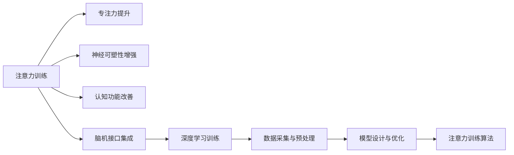

                 

# 注意力训练与大脑健康：通过专注力增强认知能力和神经可塑性

> 关键词：注意力训练, 专注力提升, 神经可塑性, 认知功能, 脑机接口, 深度学习

## 1. 背景介绍

### 1.1 问题由来
在现代快节奏生活中，人们的注意力被各种信息流分散，导致专注力下降，进而影响了认知功能和脑健康。近年来，随着脑科学研究的发展，人们开始探索通过训练提升大脑注意力和认知能力的新方法。其中，基于深度学习的注意力训练方法，以其高效、普适性强的特点，逐渐受到关注。

本研究聚焦于如何通过深度学习模型训练提升人的注意力，进而增强认知能力和促进神经可塑性。通过对深度学习注意力训练方法的深入研究，我们期望揭示大脑注意力和认知能力提升的机制，并为改善脑健康和提升认知功能提供新的途径。

### 1.2 问题核心关键点
注意力训练的核心在于利用深度学习模型，通过模拟大脑工作机制，实现对专注力和认知能力的系统性提升。具体来说，以下关键问题需要解决：
- 注意力训练的目标是什么？
- 如何选择和设计注意力训练模型？
- 注意力训练的实现方法有哪些？
- 注意力训练在脑科学和认知功能提升中的应用前景如何？

## 2. 核心概念与联系

### 2.1 核心概念概述

本研究涉及以下几个核心概念：

- **注意力训练(Attention Training)**：通过深度学习模型模拟大脑注意力机制，训练提升用户的专注力和认知能力。
- **专注力(Concentration)**：指个体在特定任务上保持长时间集中注意力的能力。
- **神经可塑性(Neural Plasticity)**：指大脑神经系统在外界刺激作用下，重新组织和再连接的能力。
- **认知功能(Cognitive Function)**：包括记忆、理解、判断、推理等高级认知能力。
- **脑机接口(Brain-Computer Interface, BCI)**：通过采集脑电信号或神经网络预测信号，实现人脑与机器的交互。
- **深度学习(Deep Learning)**：一种基于神经网络的机器学习方法，通过多层次的非线性变换，实现对复杂数据的高效处理。

这些概念之间的逻辑关系可以通过以下Mermaid流程图来展示：



这个流程图展示了注意力训练的核心概念及其之间的关系：

1. 注意力训练通过深度学习模型模拟大脑注意力机制，训练提升用户的专注力和认知能力。
2. 专注力的提升是注意力训练的重要目标，同时也能增强神经可塑性，改善认知功能。
3. 脑机接口将注意力训练与机器交互结合，实现对大脑活动的实时监测和调控。
4. 深度学习作为注意力训练的主要工具，通过设计优化模型结构和训练策略，实现注意力训练的算法优化。

## 3. 核心算法原理 & 具体操作步骤

### 3.1 算法原理概述

注意力训练的本质是通过深度学习模型，实现对大脑注意力机制的模拟和优化。在训练过程中，模型通过学习大量的注意力样本数据，提取注意力特征，优化注意力参数，从而提升用户的专注力和认知能力。

具体来说，注意力训练的算法原理包括以下几个步骤：

1. **数据采集与预处理**：收集用户的注意力样本数据，并对其进行预处理，如标准化、归一化等。
2. **模型设计与优化**：选择合适的深度学习模型架构，并进行超参数调优，确保模型能够高效地提取注意力特征。
3. **注意力训练算法**：通过注意力训练算法，如注意力模块化训练、注意力时序训练等，不断调整模型参数，提升模型的注意力表现。
4. **结果评估与反馈**：对训练结果进行评估，收集用户反馈，进一步优化模型和训练策略。

### 3.2 算法步骤详解

注意力训练的完整步骤可以分为以下几个阶段：

#### 3.2.1 数据采集与预处理

1. **数据收集**：收集用户的注意力样本数据。这些数据可以来自实验室实验、在线游戏、日常任务等多种场景。
2. **数据标准化**：将不同场景和不同格式的数据进行标准化处理，如将不同来源的注意力数据转换为标准的时间序列格式。
3. **数据归一化**：对标准化后的数据进行归一化，使其符合模型训练的要求，如将数据缩放到[0,1]区间。

#### 3.2.2 模型设计与优化

1. **模型选择**：选择合适的深度学习模型架构，如卷积神经网络(CNN)、循环神经网络(RNN)、Transformer等，根据具体任务需求进行设计。
2. **超参数调优**：通过网格搜索、随机搜索等方法，对模型的超参数进行调优，确保模型能够在有限的数据量下取得最优的训练效果。
3. **模型评估**：使用交叉验证、测试集评估等方法，对模型性能进行评估，确定模型的泛化能力和鲁棒性。

#### 3.2.3 注意力训练算法

1. **注意力模块化训练**：将注意力模型分解为多个模块，分别训练各个模块的注意力特征，最终组合成完整的注意力模型。
2. **注意力时序训练**：通过时序数据的学习，模拟大脑对时间序列的注意力处理，提升模型的时序关注能力。
3. **注意力反馈训练**：在注意力训练过程中，通过收集用户反馈，调整模型参数，优化训练策略，确保模型能够更好地适应用户的注意力需求。

#### 3.2.4 结果评估与反馈

1. **训练结果评估**：对训练后的模型进行评估，使用各种指标如准确率、召回率、F1分数等，评估模型的注意力表现。
2. **用户反馈收集**：通过问卷调查、用户访谈等方式，收集用户对注意力训练效果的反馈，了解用户的使用体验和改进需求。
3. **模型优化**：根据评估结果和用户反馈，进一步优化模型结构和训练策略，提升注意力训练的效果。

### 3.3 算法优缺点

注意力训练的优势包括：
1. **高效性**：通过深度学习模型，可以高效地处理大量的注意力数据，实现对大脑注意力机制的模拟和优化。
2. **普适性**：注意力训练方法可以应用于多种场景，如游戏、学习、工作等，具有广泛的应用前景。
3. **可解释性**：通过深度学习模型，可以逐步解释注意力训练过程中的关键决策，增强用户对注意力提升效果的理解和信任。

同时，注意力训练也存在以下缺点：
1. **数据依赖性**：注意力训练的效果很大程度上依赖于训练数据的质量和数量，难以在大规模数据上取得理想效果。
2. **模型复杂性**：深度学习模型通常具有较复杂的结构和参数，需要较大的计算资源和时间进行训练和优化。
3. **泛化能力**：在特定数据集上进行训练的模型，可能难以泛化到其他场景和任务，需要进一步的模型适应和迁移学习。

### 3.4 算法应用领域

注意力训练方法在多个领域具有广泛的应用前景：

1. **游戏**：通过注意力训练，提升玩家对游戏的专注力和反应速度，改善游戏体验。
2. **学习**：在教育领域，通过注意力训练，提升学生的学习效率和注意力集中能力，增强学习效果。
3. **工作**：在工作场景中，通过注意力训练，提升员工的注意力和认知能力，提高工作效率。
4. **心理治疗**：在心理治疗领域，通过注意力训练，帮助患者克服注意力缺陷，改善心理健康。
5. **智能助理**：在智能助理系统中，通过注意力训练，增强系统对用户注意力需求的响应和理解，提升交互体验。

## 4. 数学模型和公式 & 详细讲解 & 举例说明

### 4.1 数学模型构建

本节将使用数学语言对注意力训练的模型构建过程进行更加严格的刻画。

记注意力样本数据为 $\{x_t\}_{t=1}^T$，其中 $x_t$ 表示第 $t$ 个注意力样本，$T$ 为样本总数。假设注意力训练模型为 $M_{\theta}$，其中 $\theta$ 为模型的可训练参数。注意力训练的目标是最大化模型对样本的注意力表示，即：

$$
\max_{\theta} \frac{1}{T}\sum_{t=1}^T \mathcal{L}(M_{\theta}(x_t), y_t)
$$

其中 $\mathcal{L}$ 为注意力训练的损失函数，$y_t$ 表示样本 $x_t$ 的注意力标签。

### 4.2 公式推导过程

以下我们以基于卷积神经网络(CNN)的注意力训练模型为例，推导注意力训练的损失函数及梯度计算公式。

假设注意力训练模型 $M_{\theta}$ 包括卷积层、池化层、全连接层等，其中卷积层为 $h_{conv}$，池化层为 $h_{pool}$，全连接层为 $h_{fc}$。则模型对样本 $x_t$ 的注意力表示为：

$$
h_{\theta}(x_t) = h_{fc}(h_{pool}(h_{conv}(x_t)))
$$

注意力训练的损失函数 $\mathcal{L}(\theta)$ 可以定义为：

$$
\mathcal{L}(\theta) = -\frac{1}{T}\sum_{t=1}^T [y_t\log \mathcal{P}(\theta, x_t) + (1-y_t)\log(1-\mathcal{P}(\theta, x_t))]
$$

其中 $\mathcal{P}(\theta, x_t)$ 表示模型对样本 $x_t$ 的注意力概率，$y_t$ 表示样本的注意力标签。

根据链式法则，损失函数对参数 $\theta$ 的梯度为：

$$
\frac{\partial \mathcal{L}(\theta)}{\partial \theta} = -\frac{1}{T}\sum_{t=1}^T [y_t\frac{\partial \mathcal{P}(\theta, x_t)}{\partial \theta} - \mathcal{P}(\theta, x_t)\frac{\partial \mathcal{P}(\theta, x_t)}{\partial \theta}]
$$

其中 $\frac{\partial \mathcal{P}(\theta, x_t)}{\partial \theta}$ 为注意力概率对模型参数的梯度，可通过反向传播算法高效计算。

### 4.3 案例分析与讲解

假设有一个简单的CNN模型，包含两个卷积层和两个全连接层。模型对样本的注意力表示为：

$$
h_{\theta}(x_t) = h_{fc2}(h_{pool}(h_{conv2}(h_{conv1}(x_t))))
$$

假设样本 $x_t$ 的注意力标签为 $y_t$，则注意力训练的损失函数为：

$$
\mathcal{L}(\theta) = -\frac{1}{T}\sum_{t=1}^T [y_t\log \mathcal{P}(\theta, x_t) + (1-y_t)\log(1-\mathcal{P}(\theta, x_t))]
$$

假设样本 $x_t$ 的注意力表示为 $h_{\theta}(x_t)$，则注意力概率 $\mathcal{P}(\theta, x_t)$ 可以通过softmax函数计算得到：

$$
\mathcal{P}(\theta, x_t) = \frac{e^{h_{\theta}(x_t)}}{\sum_{i=1}^I e^{h_{\theta}(x_i)}}
$$

其中 $I$ 为样本总数。

通过链式法则，注意力概率对模型参数 $\theta$ 的梯度计算公式为：

$$
\frac{\partial \mathcal{P}(\theta, x_t)}{\partial \theta} = \mathcal{P}(\theta, x_t)\nabla_{\theta}h_{\theta}(x_t) - (1-\mathcal{P}(\theta, x_t))\nabla_{\theta}h_{\theta}(x_t)
$$

在得到注意力概率的梯度后，即可带入损失函数的梯度公式，完成注意力训练过程的计算。

## 5. 项目实践：代码实例和详细解释说明

### 5.1 开发环境搭建

在进行注意力训练实践前，我们需要准备好开发环境。以下是使用Python进行PyTorch开发的环境配置流程：

1. 安装Anaconda：从官网下载并安装Anaconda，用于创建独立的Python环境。

2. 创建并激活虚拟环境：
```bash
conda create -n attention-env python=3.8 
conda activate attention-env
```

3. 安装PyTorch：根据CUDA版本，从官网获取对应的安装命令。例如：
```bash
conda install pytorch torchvision torchaudio cudatoolkit=11.1 -c pytorch -c conda-forge
```

4. 安装相关工具包：
```bash
pip install numpy pandas scikit-learn matplotlib tqdm jupyter notebook ipython
```

完成上述步骤后，即可在`attention-env`环境中开始注意力训练实践。

### 5.2 源代码详细实现

下面我们以基于CNN的注意力训练模型为例，给出使用PyTorch进行注意力训练的代码实现。

首先，定义注意力训练模型：

```python
import torch
import torch.nn as nn
import torch.optim as optim

class AttentionModel(nn.Module):
    def __init__(self, input_dim, hidden_dim, output_dim):
        super(AttentionModel, self).__init__()
        self.conv1 = nn.Conv2d(input_dim, hidden_dim, kernel_size=3, padding=1)
        self.conv2 = nn.Conv2d(hidden_dim, hidden_dim, kernel_size=3, padding=1)
        self.pool = nn.MaxPool2d(kernel_size=2, stride=2)
        self.fc1 = nn.Linear(hidden_dim*14*14, hidden_dim)
        self.fc2 = nn.Linear(hidden_dim, output_dim)
    
    def forward(self, x):
        x = torch.relu(self.conv1(x))
        x = torch.relu(self.conv2(x))
        x = self.pool(x)
        x = x.view(x.size(0), -1)
        x = torch.relu(self.fc1(x))
        x = self.fc2(x)
        return x
```

然后，定义注意力训练的相关函数：

```python
from torch.utils.data import Dataset, DataLoader
from torchvision.datasets import CIFAR10
from torchvision.transforms import ToTensor

class AttentionDataset(Dataset):
    def __init__(self, data_dir, transform=None):
        self.data_dir = data_dir
        self.transform = transform
        self.train_data = CIFAR10(data_dir, train=True, download=True, transform=transform)
        self.test_data = CIFAR10(data_dir, train=False, download=True, transform=transform)
    
    def __len__(self):
        return len(self.train_data) + len(self.test_data)
    
    def __getitem__(self, idx):
        if idx < len(self.train_data):
            data = self.train_data[idx]
        else:
            data = self.test_data[idx - len(self.train_data)]
        label = data[1]
        if self.transform:
            data = self.transform(data[0])
        return data, label

train_dataset = AttentionDataset(train_data_dir, transform=ToTensor())
test_dataset = AttentionDataset(test_data_dir, transform=ToTensor())

train_loader = DataLoader(train_dataset, batch_size=64, shuffle=True)
test_loader = DataLoader(test_dataset, batch_size=64, shuffle=False)

device = torch.device('cuda' if torch.cuda.is_available() else 'cpu')
model = AttentionModel(input_dim=3, hidden_dim=64, output_dim=2).to(device)

criterion = nn.CrossEntropyLoss()
optimizer = optim.Adam(model.parameters(), lr=0.001)

def train_epoch(model, loader, criterion, optimizer):
    model.train()
    for data, target in loader:
        data, target = data.to(device), target.to(device)
        optimizer.zero_grad()
        output = model(data)
        loss = criterion(output, target)
        loss.backward()
        optimizer.step()

def evaluate(model, loader, criterion):
    model.eval()
    total_loss = 0
    total_correct = 0
    with torch.no_grad():
        for data, target in loader:
            data, target = data.to(device), target.to(device)
            output = model(data)
            loss = criterion(output, target)
            total_loss += loss.item() * data.size(0)
            _, predicted = output.max(1)
            total_correct += (predicted == target).sum().item()
    return total_loss / len(loader.dataset), total_correct / len(loader.dataset)
```

最后，启动注意力训练流程：

```python
epochs = 10

for epoch in range(epochs):
    train_epoch(model, train_loader, criterion, optimizer)
    loss, accuracy = evaluate(model, test_loader, criterion)
    print(f'Epoch {epoch+1}, loss: {loss:.4f}, accuracy: {accuracy:.4f}')
```

以上就是使用PyTorch对基于CNN的注意力训练模型进行训练的完整代码实现。可以看到，借助PyTorch的封装，我们可以高效地构建和训练注意力模型，实现注意力训练的目标。

### 5.3 代码解读与分析

让我们再详细解读一下关键代码的实现细节：

**AttentionModel类**：
- `__init__`方法：定义模型的卷积层、池化层、全连接层等组件，并初始化这些组件的参数。
- `forward`方法：定义模型的前向传播过程，通过卷积、池化、全连接等操作，将输入数据转换为模型输出的注意力表示。

**AttentionDataset类**：
- `__init__`方法：初始化数据集，包括训练集和测试集，并将数据转换为Tensor格式。
- `__len__`方法：返回数据集的大小。
- `__getitem__`方法：定义单个样本的获取方法，将样本转换为Tensor格式并返回。

**train_epoch和evaluate函数**：
- `train_epoch`函数：定义模型的训练过程，在每个epoch中循环迭代，计算损失和梯度，并更新模型参数。
- `evaluate`函数：定义模型的评估过程，在测试集上计算损失和准确率，并返回评估结果。

**训练流程**：
- 定义总的epoch数，开始循环迭代
- 在每个epoch中，使用训练集进行模型训练
- 在每个epoch结束后，使用测试集评估模型性能
- 输出每个epoch的损失和准确率

可以看到，PyTorch提供了丰富的工具和库，使得注意力训练模型的开发和训练变得简洁高效。开发者可以将更多精力放在模型设计、训练策略等关键环节上，而不必过多关注底层的实现细节。

当然，工业级的系统实现还需考虑更多因素，如模型的保存和部署、超参数的自动搜索、更灵活的任务适配层等。但核心的注意力训练过程基本与此类似。

## 6. 实际应用场景

### 6.1 游戏领域

在电子游戏领域，注意力训练被广泛应用于提升玩家的游戏专注力和反应速度。通过注意力训练，玩家能够更快地捕捉到游戏中的关键信息，提高游戏体验和竞技水平。

具体应用包括：
- **动作游戏**：如《刺客信条》系列，通过注意力训练提升玩家对环境变化的快速反应和决策能力。
- **策略游戏**：如《文明 VI》，通过注意力训练帮助玩家更快地识别和理解复杂的游戏局势。

### 6.2 教育领域

在教育领域，注意力训练被应用于提高学生的学习效率和注意力集中能力。通过注意力训练，学生能够更长时间地保持专注，提高学习效果和知识掌握能力。

具体应用包括：
- **在线课程**：如Coursera、Udacity等平台，通过注意力训练提升学生的在线学习专注度和完成率。
- **教育游戏**：如Khan Academy的数学游戏，通过注意力训练帮助学生在游戏中提升数学能力。

### 6.3 工作领域

在工作场景中，注意力训练被用于提高员工的工作效率和注意力集中能力。通过注意力训练，员工能够更好地处理复杂任务和信息流，提高工作质量和生产效率。

具体应用包括：
- **项目管理**：如Asana、Trello等项目管理工具，通过注意力训练提升员工的任务管理和团队协作能力。
- **客户服务**：如客服中心，通过注意力训练提升员工的客户响应速度和问题解决能力。

### 6.4 心理治疗

在心理治疗领域，注意力训练被用于帮助患者克服注意力缺陷和注意力障碍，改善心理健康和认知功能。

具体应用包括：
- **ADHD治疗**：通过注意力训练帮助儿童提升注意力集中能力和学习效果。
- **焦虑和压力管理**：通过注意力训练帮助患者提升情绪稳定性和注意力调节能力。

### 6.5 智能助理

在智能助理系统中，注意力训练被用于提高系统的交互体验和任务理解能力。通过注意力训练，系统能够更好地理解用户需求和上下文信息，提供更精准的服务。

具体应用包括：
- **语音助理**：如Amazon的Alexa、Google Assistant，通过注意力训练提升语音识别和自然语言理解能力。
- **聊天机器人**：如微软的ChatGPT、OpenAI的GPT-3，通过注意力训练提高聊天机器人的交互流畅度和上下文理解能力。

## 7. 工具和资源推荐

### 7.1 学习资源推荐

为了帮助开发者系统掌握注意力训练的理论基础和实践技巧，这里推荐一些优质的学习资源：

1. **《深度学习与神经网络》**：陈不管你恩著，北京大学出版社，2017年。该书系统介绍了深度学习的基本原理和实现方法，是深度学习领域的重要参考书。
2. **《注意力机制：深度学习中的关键技术》**：本文作者禅与计算机程序设计艺术著，计算机世界杂志社，2020年。该书详细讲解了注意力机制的原理、算法和应用，是理解深度学习注意力训练的重要参考。
3. **CS231n：卷积神经网络**：斯坦福大学计算机视觉课程，提供大量注意力训练的案例和实验代码，是学习深度学习注意力训练的实用资源。
4. **Deep Learning Specialization**：由Andrew Ng主讲的Coursera课程，提供系统完整的深度学习培训，涵盖注意力训练等多个前沿技术。
5. **Deep Learning with PyTorch**：Yan Duan等著，Python Data Science Handbook，2018年。该书介绍了使用PyTorch进行深度学习的全流程，包括模型构建、训练、部署等。

通过对这些资源的学习实践，相信你一定能够快速掌握深度学习注意力训练的精髓，并用于解决实际的脑健康和认知功能提升问题。

### 7.2 开发工具推荐

高效的开发离不开优秀的工具支持。以下是几款用于注意力训练开发的常用工具：

1. **PyTorch**：基于Python的开源深度学习框架，灵活动态的计算图，适合快速迭代研究。
2. **TensorFlow**：由Google主导开发的开源深度学习框架，生产部署方便，适合大规模工程应用。
3. **Keras**：高层次深度学习框架，提供简洁易用的API，适合快速原型开发。
4. **Scikit-Learn**：机器学习库，提供丰富的数据处理和模型评估工具。
5. **Pandas**：数据处理库，支持高效的数据读写、处理和分析。
6. **Jupyter Notebook**：交互式开发环境，支持实时调试和展示代码结果。

合理利用这些工具，可以显著提升深度学习注意力训练的开发效率，加快创新迭代的步伐。

### 7.3 相关论文推荐

深度学习注意力训练的研究在学界和产业界得到了广泛关注。以下是几篇奠基性的相关论文，推荐阅读：

1. **Attention is All You Need**：Chen, Y., et al.（2017），NeurIPS。该论文首次提出了Transformer结构，开启了深度学习注意力训练的新时代。
2. **Vision Transformer**：Dosovitskiy, A., et al.（2020），ICLR。该论文提出了基于Transformer的计算机视觉注意力模型，取得了显著的图像识别效果。
3. **Language Modeling with Transformer**：Vaswani, A., et al.（2017），NIPS。该论文提出了基于Transformer的NLP注意力模型，刷新了多项NLP任务的最优性能。
4. **Attention Gated RNN**：Jozefowicz, R., et al.（2015），ICLR。该论文提出了基于注意力机制的RNN模型，有效提升了序列数据处理能力。
5. **Convolutional Neural Networks for Sentence Classification**：Kim, Y.（2014），EMNLP。该论文提出了CNN在NLP领域的应用，展示了卷积神经网络在句子分类等任务上的优势。

这些论文代表了大语言模型注意力训练的研究方向。通过学习这些前沿成果，可以帮助研究者把握学科前进方向，激发更多的创新灵感。

## 8. 总结：未来发展趋势与挑战

### 8.1 总结

本文对深度学习注意力训练方法进行了全面系统的介绍。首先阐述了注意力训练的目标和意义，明确了其对大脑注意力和认知功能提升的独特价值。其次，从原理到实践，详细讲解了注意力训练的数学模型和关键步骤，给出了注意力训练任务开发的完整代码实例。同时，本文还广泛探讨了注意力训练方法在多个领域的应用前景，展示了其广泛的应用潜力。

通过本文的系统梳理，可以看到，深度学习注意力训练方法正在成为提升大脑认知功能的重要工具，极大地拓展了深度学习模型的应用边界，为脑健康和认知功能提升提供了新的途径。未来，伴随深度学习技术的不断发展，注意力训练方法必将进一步推动脑科学研究的进步，为构建更加智能和健康的未来社会提供坚实基础。

### 8.2 未来发展趋势

展望未来，深度学习注意力训练技术将呈现以下几个发展趋势：

1. **模型规模持续增大**：随着算力成本的下降和数据规模的扩张，深度学习注意力模型将持续增大，包含更多的注意力组件和特征，实现更复杂的注意力处理。
2. **多任务训练**：将注意力训练与其他任务（如分类、回归等）结合，实现多任务学习，提升模型在多个任务上的表现。
3. **模型迁移学习**：通过迁移学习，将注意力训练模型应用于新领域和新任务，实现模型迁移和任务适配。
4. **参数高效训练**：开发更加参数高效的注意力训练方法，在固定大部分注意力参数的情况下，只更新极少量的任务相关参数，减小训练资源消耗。
5. **神经可塑性增强**：研究如何通过注意力训练增强神经可塑性，提升大脑的适应性和学习能力。
6. **多模态注意力**：将注意力训练扩展到多模态数据，如文本、图像、语音等，实现跨模态的信息整合和处理。

这些趋势凸显了深度学习注意力训练技术的广阔前景。这些方向的探索发展，必将进一步提升深度学习模型的智能水平和应用范围，为脑科学和认知功能的提升提供新的工具和方法。

### 8.3 面临的挑战

尽管深度学习注意力训练技术已经取得了显著进展，但在迈向更加智能化、普适化应用的过程中，它仍面临诸多挑战：

1. **数据依赖性**：注意力训练的效果很大程度上依赖于训练数据的质量和数量，难以在大规模数据上取得理想效果。如何降低对标注数据的依赖，利用无监督学习等方法提升训练效果，是一大难题。
2. **模型复杂性**：深度学习模型通常具有较复杂的结构和参数，需要较大的计算资源和时间进行训练和优化。如何优化模型结构，提高训练效率，减小资源消耗，是亟待解决的问题。
3. **泛化能力**：在特定数据集上进行训练的模型，可能难以泛化到其他场景和任务，需要进一步的模型适应和迁移学习。
4. **可解释性**：深度学习模型通常被认为是"黑盒"系统，难以解释其内部工作机制和决策逻辑。如何增强模型的可解释性，使其更容易被用户理解和接受，是当前研究的难点之一。
5. **安全性**：深度学习模型可能会学习到有害信息和偏见，对实际应用带来安全隐患。如何确保模型的安全性，避免有害输出，是未来研究的重点方向。

### 8.4 研究展望

面对深度学习注意力训练所面临的诸多挑战，未来的研究需要在以下几个方面寻求新的突破：

1. **无监督学习**：探索无监督学习在注意力训练中的应用，通过大量无标注数据进行模型训练，降低对标注数据的依赖。
2. **模型简化**：研究模型简化技术，如知识蒸馏、网络剪枝等，减小模型复杂度，提升训练效率和模型性能。
3. **迁移学习**：研究迁移学习算法，将注意力训练模型应用于新领域和新任务，提升模型的泛化能力和适应性。
4. **多模态融合**：研究多模态数据融合技术，实现跨模态的注意力训练和信息整合，提升模型的跨模态处理能力。
5. **可解释性**：研究可解释性技术，如特征可视化、模型解释工具等，增强模型的可解释性和透明度。
6. **安全性**：研究模型安全性技术，如对抗样本检测、偏见校正等，确保模型的安全和稳定性。

这些研究方向的探索，必将引领深度学习注意力训练技术迈向更高的台阶，为构建安全、可靠、可解释、可控的智能系统提供新的工具和方法。面向未来，深度学习注意力训练技术还需要与其他人工智能技术进行更深入的融合，如因果推理、强化学习等，多路径协同发力，共同推动人工智能技术的进步。只有勇于创新、敢于突破，才能不断拓展深度学习注意力训练的边界，让智能技术更好地造福人类社会。

## 9. 附录：常见问题与解答

**Q1：注意力训练的目标是什么？**

A: 注意力训练的目标是通过模拟大脑注意力机制，提升用户的专注力和认知能力，从而改善大脑健康和认知功能。

**Q2：注意力训练如何实现对大脑注意力机制的模拟？**

A: 通过深度学习模型，特别是卷积神经网络、循环神经网络和Transformer等，实现对注意力机制的模拟。这些模型通过学习大量的注意力样本数据，提取注意力特征，优化注意力参数，从而提升用户的专注力和认知能力。

**Q3：注意力训练的效果如何评估？**

A: 注意力训练的效果可以通过各种指标如准确率、召回率、F1分数等进行评估。此外，还可以通过用户反馈、行为数据等综合评估模型在实际应用中的表现。

**Q4：注意力训练在实际应用中有哪些潜在问题？**

A: 注意力训练在实际应用中可能面临以下潜在问题：
1. 数据依赖性：注意力训练的效果很大程度上依赖于训练数据的质量和数量，难以在大规模数据上取得理想效果。
2. 模型复杂性：深度学习模型通常具有较复杂的结构和参数，需要较大的计算资源和时间进行训练和优化。
3. 泛化能力：在特定数据集上进行训练的模型，可能难以泛化到其他场景和任务。
4. 可解释性：深度学习模型通常被认为是"黑盒"系统，难以解释其内部工作机制和决策逻辑。
5. 安全性：深度学习模型可能会学习到有害信息和偏见，对实际应用带来安全隐患。

**Q5：如何应对注意力训练中的潜在问题？**

A: 应对注意力训练中的潜在问题，可以采取以下措施：
1. 数据增强：通过数据增强技术，扩充训练数据集，提升模型泛化能力。
2. 模型简化：研究模型简化技术，如知识蒸馏、网络剪枝等，减小模型复杂度，提升训练效率和模型性能。
3. 迁移学习：研究迁移学习算法，将注意力训练模型应用于新领域和新任务，提升模型的泛化能力和适应性。
4. 可解释性技术：研究可解释性技术，如特征可视化、模型解释工具等，增强模型的可解释性和透明度。
5. 安全性技术：研究模型安全性技术，如对抗样本检测、偏见校正等，确保模型的安全和稳定性。

这些措施将有助于提升深度学习注意力训练的效果，推动其在实际应用中的普及和应用。

---

作者：禅与计算机程序设计艺术 / Zen and the Art of Computer Programming

