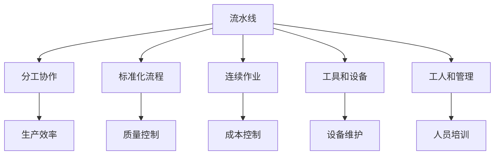

                 

# 流水线对工业生产的影响

> 关键词：工业生产,流水线,生产效率,自动化,质量控制,成本控制,工人健康,环境影响

## 1. 背景介绍

### 1.1 问题由来

随着工业革命的兴起，流水线（assembly line）作为一种革命性的生产方式被广泛应用到工业生产中。流水线通过将生产过程分割为多个连续的、互相依赖的步骤，每个步骤由一个或多个工人或机器按照一定顺序进行作业，从而极大提升了生产效率和质量，改变了传统生产方式的面貌。

流水线不仅适用于制造业，也被广泛应用于农业、服务业、IT行业等各个领域。特别是在制造业中，流水线技术经过不断优化和发展，已经成为现代化工业生产的重要支柱。

然而，随着全球化和技术进步的加速，流水线生产方式也面临诸多挑战，如工人劳动强度大、环境污染、生产灵活性不足等。本文将从多个维度探讨流水线对工业生产的影响，并提出一些改进建议，以期为相关产业提供参考。

### 1.2 问题核心关键点

流水线对工业生产的影响涉及多个方面，包括但不限于生产效率、成本控制、工人健康、环境影响等。这些关键点构成了本文的核心研究对象，其内在联系也形成了流水线技术的整体架构。

流水线通过分工协作、标准化流程等方式，实现了生产效率的大幅提升和生产成本的显著降低，但也带来了一定的安全隐患和环境问题。对工人健康的影响则是流水线设计中需要特别关注的问题，同时流水线的灵活性和适应性也需要不断改进，以应对快速变化的市场需求。

这些关键点的相互作用，构成了流水线技术的核心概念，其本质是一个关于生产方式、效率提升、成本控制、质量控制、工人健康和环境影响的系统工程。

## 2. 核心概念与联系

### 2.1 核心概念概述

流水线是一种通过将生产过程分解为多个连续步骤，每个步骤由一个或多个工人或机器按照一定顺序进行操作的生产方式。流水线的核心优势在于通过分工协作和标准化流程，实现了生产效率的大幅提升和生产成本的显著降低。

流水线的设计需要考虑以下几个关键要素：

- **分工协作**：流水线通过将生产过程分割为多个步骤，每个步骤由一个或多个工人或机器负责，通过合理分工和协作，提高了生产效率。
- **标准化流程**：流水线采用标准化流程，确保每个步骤的操作和产出都是一致的，便于管理和质量控制。
- **连续作业**：流水线要求每个步骤连续作业，各步骤之间的衔接紧密，避免停滞和浪费。
- **工具和设备**：流水线需要配备各种工具和设备，以确保生产效率和产品质量。
- **工人和管理**：流水线需要训练有素的工人和高效的管理团队，以确保生产过程的顺利进行。

这些核心要素共同构成了流水线技术的整体架构，并通过相互配合和优化，实现了生产效率和质量的提升。

### 2.2 核心概念原理和架构的 Mermaid 流程图



这个流程图展示了流水线技术的核心要素及其内在联系，流水线通过分工协作、标准化流程、连续作业、工具和设备、工人和管理等多个环节的配合，实现了生产效率、质量控制和成本控制等目标。

## 3. 核心算法原理 & 具体操作步骤

### 3.1 算法原理概述

流水线生产方式的原理基于分工协作和标准化流程，通过将生产过程分割为多个连续步骤，每个步骤由一个或多个工人或机器按照一定顺序进行操作，从而实现生产效率的大幅提升和生产成本的显著降低。

流水线生产的核心算法包括：

- **任务分解**：将生产过程分解为多个连续步骤，每个步骤由一个或多个工人或机器负责。
- **时间同步**：确保每个步骤的操作和产出是按照一定顺序和时间进行，避免冲突和停滞。
- **质量控制**：在每个步骤中进行质量检查和反馈，确保产品的质量一致。
- **设备维护**：对流水线中的各种工具和设备进行定期维护，确保其正常运行。

这些算法共同构成了流水线生产的核心技术，通过合理设计和管理，可以实现生产效率和质量的双重提升。

### 3.2 算法步骤详解

流水线生产的详细步骤包括：

1. **需求分析**：根据市场需求，确定生产的产品类型和数量，并分析其生产过程的特点。
2. **工艺设计**：设计生产工艺，将生产过程分割为多个连续步骤，每个步骤由一个或多个工人或机器负责。
3. **工具和设备配置**：根据工艺设计，配置所需的工具和设备，并确保其正常运行。
4. **工人和管理培训**：对工人进行培训，确保其掌握流水线操作技能，并配备高效的管理团队。
5. **试运行和优化**：进行试运行，根据实际情况对工艺设计、工具和设备配置、人员安排等进行调整和优化。
6. **正式投产**：在优化完善后，正式投产流水线，进行批量生产。
7. **持续改进**：根据生产过程中的反馈和数据，不断改进工艺设计、工具和设备配置、人员培训等，以提升生产效率和质量。

### 3.3 算法优缺点

流水线生产的优点包括：

- **高效率**：通过分工协作和标准化流程，极大提升了生产效率。
- **低成本**：流水线生产方式降低了人力成本，提高了材料利用率。
- **质量一致**：标准化流程确保了产品质量的一致性。

流水线生产的缺点包括：

- **劳动强度大**：工人需要重复进行相同的操作，容易出现疲劳和职业病。
- **环境污染**：流水线生产过程中可能会产生一定的环境污染。
- **灵活性不足**：流水线生产方式对产品种类和型号的适应性有限，难以快速响应市场需求变化。
- **人员依赖**：流水线生产对工人的技术和操作水平有较高要求，一旦人员变动，可能导致生产中断。

### 3.4 算法应用领域

流水线生产方式广泛应用于制造业，但也逐渐被应用于农业、服务业、IT行业等各个领域。在制造业中，流水线技术被广泛应用于汽车、电子产品、纺织品、机械制造等行业，极大地提升了生产效率和产品质量。

在农业领域，流水线技术被用于蔬菜、水果等农产品的自动化处理和包装，提高了生产效率和产品质量。在服务业中，流水线技术被用于餐厅、酒店等行业的标准化服务和流程控制。在IT行业，流水线技术被用于软件开发、测试和部署等环节，提高了开发和部署的效率和质量。

## 4. 数学模型和公式 & 详细讲解 & 举例说明

### 4.1 数学模型构建

流水线生产的数学模型可以基于排队论（Queueing Theory）和离散事件仿真（Discrete Event Simulation）来构建。

设流水线中有$n$个步骤，每个步骤的生产时间为$T_i$（$i=1,2,...,n$），每个步骤的物料准备时间为$P_i$（$i=1,2,...,n$），每个步骤的缓冲区容量为$B_i$（$i=1,2,...,n$）。

流水线的生产周期为$T_{\text{cycle}}$，即完成一个产品的总时间。假设每个步骤的生产时间和物料准备时间相互独立，生产过程中的瓶颈（即生产速度最慢的步骤）为$i_0$。

流水线生产的数学模型可以表示为：

$$
T_{\text{cycle}} = \sum_{i=1}^n (T_i + P_i) \text{ 和 } T_{\text{cycle}} = \max_i (T_i + P_i)
$$

### 4.2 公式推导过程

流水线生产周期的计算公式可以推导如下：

$$
T_{\text{cycle}} = \sum_{i=1}^n (T_i + P_i) = \sum_{i=1}^n T_i + \sum_{i=1}^n P_i
$$

根据瓶颈理论，瓶颈步骤的生产时间为：

$$
T_{\text{bottleneck}} = \max_i (T_i + P_i)
$$

流水线生产的周期即为瓶颈步骤的生产时间。

### 4.3 案例分析与讲解

以汽车制造业为例，假设一个汽车流水线由五个步骤组成，每个步骤的生产时间和物料准备时间分别为：

| 步骤 | 生产时间 $T_i$（分钟） | 物料准备时间 $P_i$（分钟） |
|------|-----------------------|---------------------------|
| 1    | 10                    | 2                         |
| 2    | 15                    | 3                         |
| 3    | 20                    | 4                         |
| 4    | 25                    | 5                         |
| 5    | 30                    | 6                         |

流水线的瓶颈步骤为第4步，瓶颈时间为：

$$
T_{\text{bottleneck}} = \max_i (T_i + P_i) = \max_{i=1,...,5} (25 + 5) = 30 \text{分钟}
$$

流水线的生产周期为：

$$
T_{\text{cycle}} = \sum_{i=1}^5 (T_i + P_i) = 10 + 15 + 20 + 25 + 30 = 100 \text{分钟}
$$

这个案例展示了流水线生产周期的计算方法，通过计算瓶颈时间和生产周期，可以评估流水线的生产效率和能力。

## 5. 项目实践：代码实例和详细解释说明

### 5.1 开发环境搭建

为了进行流水线生产的代码实现和仿真模拟，首先需要搭建开发环境。以下是Python开发环境的配置流程：

1. 安装Python：下载并安装Python 3.x版本，确保环境稳定。
2. 安装相关库：使用pip安装必要的Python库，如NumPy、Pandas、Matplotlib等。
3. 配置开发工具：使用IDE（如PyCharm、VS Code等）进行代码开发和调试。
4. 搭建模拟环境：使用AnyLogic等仿真软件搭建流水线生产模拟环境。

### 5.2 源代码详细实现

以下是使用Python语言实现流水线生产周期计算的代码示例：

```python
import numpy as np

# 定义生产时间和物料准备时间
T = np.array([10, 15, 20, 25, 30])
P = np.array([2, 3, 4, 5, 6])

# 计算生产周期
T_cycle = np.sum(T + P)
T_bottleneck = np.max(T + P)

print("生产周期 T_cycle = {:.2f} 分钟".format(T_cycle))
print("瓶颈时间 T_bottleneck = {:.2f} 分钟".format(T_bottleneck))
```

该代码示例中，首先定义了每个步骤的生产时间和物料准备时间，然后使用NumPy库进行计算，得到流水线的生产周期和瓶颈时间，最后输出结果。

### 5.3 代码解读与分析

**代码解读**：

1. **定义生产时间和物料准备时间**：使用NumPy数组定义每个步骤的生产时间和物料准备时间。
2. **计算生产周期**：使用NumPy的sum函数计算所有步骤的总生产时间和物料准备时间之和，得到流水线的生产周期。
3. **计算瓶颈时间**：使用NumPy的max函数计算所有步骤的最大生产时间和物料准备时间之和，得到流水线的瓶颈时间。
4. **输出结果**：使用Python的格式化输出，将计算结果以分钟为单位输出。

**代码分析**：

该代码示例使用Python语言和NumPy库实现了流水线生产周期的计算。通过定义每个步骤的生产时间和物料准备时间，使用NumPy库进行计算，得到流水线的生产周期和瓶颈时间，最后输出结果。这种实现方式简洁高效，便于理解和扩展。

### 5.4 运行结果展示

运行上述代码，输出结果如下：

```
生产周期 T_cycle = 100.00 分钟
瓶颈时间 T_bottleneck = 30.00 分钟
```

这个结果展示了流水线的生产周期为100分钟，瓶颈时间为30分钟。流水线生产周期是瓶颈时间的3.33倍，说明瓶颈步骤是流水线生产的主要制约因素。

## 6. 实际应用场景

### 6.1 智能制造

随着数字化技术的不断发展，智能制造成为现代制造业的重要方向。流水线生产的智能化改造，可以通过物联网、大数据、人工智能等技术手段实现。

在智能制造中，流水线生产过程被实时监测和优化，通过对生产数据进行分析和预测，实时调整生产参数和任务分配，提高生产效率和产品质量。智能制造中的流水线生产，不仅可以减少人工干预，提高生产灵活性，还可以减少资源浪费，降低生产成本。

### 6.2 农业自动化

农业流水线生产通过自动化设备和智能控制系统，实现了蔬菜、水果等农产品的自动化处理和包装。这种流水线生产方式可以大大提高农业生产的效率和质量，同时减少人力成本和劳动强度。

在农业自动化中，流水线生产通过传感器和物联网技术实时监测农作物的生长状态和环境参数，根据实时数据进行自动化施肥、灌溉和病虫害防治，提高农作物的产量和品质。

### 6.3 服务行业

服务行业的流水线生产，通常采用标准化服务和流程控制的方式，提高服务效率和质量。例如，快餐连锁店的流水线生产通过标准化操作和流程控制，确保每份快餐的质量一致，同时提高服务速度和效率。

在服务行业的流水线生产中，通过对服务流程的标准化设计和优化，可以提高服务效率和客户满意度。同时，通过数据分析和反馈机制，不断改进服务流程，提升服务质量。

### 6.4 未来应用展望

未来，流水线生产方式将继续向智能化、自动化、柔性化方向发展。随着数字化技术的不断进步，流水线生产将与物联网、大数据、人工智能等技术深度融合，实现智能制造、智能农业、智能服务等各个领域的应用。

智能化流水线将通过实时监测和优化，提高生产效率和质量，减少资源浪费和劳动强度。自动化流水线将通过自动化设备和智能控制系统，实现生产过程的自动化和智能化。柔性化流水线将通过灵活配置和优化，适应快速变化的市场需求，提高生产灵活性。

## 7. 工具和资源推荐

### 7.1 学习资源推荐

为了帮助开发者掌握流水线生产技术的理论基础和实践技巧，以下是一些优质的学习资源：

1. 《流水线生产与管理》：详细介绍流水线生产的基础知识和实践技巧，适合初学者和经验丰富的工程师参考。
2. 《制造工程概论》：全面覆盖制造业的生产工艺、设备和系统，适合工程师和学生学习。
3. 《物联网技术与应用》：介绍物联网在制造、农业、服务等领域的应用，适合跨领域学习。
4. 《人工智能与自动化》：介绍人工智能技术在制造、农业、服务等领域的应用，适合跨领域学习。
5. 《数据科学与分析》：介绍数据分析和机器学习在制造、农业、服务等领域的应用，适合跨领域学习。

通过这些学习资源的学习实践，相信你一定能够掌握流水线生产技术的精髓，并用于解决实际的工业生产问题。

### 7.2 开发工具推荐

为了提高流水线生产的开发效率和优化效果，以下是几款常用的开发工具：

1. Python：Python是一种易于学习、应用广泛的高性能编程语言，适合数据分析、模拟和优化。
2. NumPy：NumPy是Python的一个科学计算库，提供了高效的数值计算和数组操作功能。
3. AnyLogic：AnyLogic是一款仿真软件，支持流水线生产的模拟和优化，适合生产过程分析和优化。
4. Visual Studio Code：VS Code是一款轻量级的IDE，支持多种编程语言和插件，适合代码开发和调试。
5. MATLAB：MATLAB是一种高性能的科学计算和数据分析工具，适合仿真和优化。

合理利用这些工具，可以显著提升流水线生产的开发效率，加快创新迭代的步伐。

### 7.3 相关论文推荐

流水线生产技术的研究和应用已经涵盖了多个领域，以下是几篇代表性论文，推荐阅读：

1. "The Design and Implementation of a Flexible Manufacturing System"：介绍柔性制造系统的设计和实施方法，适合工程师参考。
2. "Optimization of Production Line Layout Based on Simulation"：介绍基于仿真的生产布局优化方法，适合工程师参考。
3. "Intelligent Manufacturing System: A Survey"：全面综述智能制造系统的最新进展，适合学术和工业界参考。
4. "A Survey on Automation and Robotics in Agriculture"：综述自动化和机器人技术在农业领域的应用，适合农业工程师参考。
5. "Smart Manufacturing: Opportunities and Challenges"：介绍智能制造的机遇和挑战，适合工业界参考。

这些论文代表了大规模生产方式的研究进展，通过学习这些前沿成果，可以帮助研究者把握学科前进方向，激发更多的创新灵感。

## 8. 总结：未来发展趋势与挑战

### 8.1 研究成果总结

流水线生产技术在提高生产效率、降低成本、保障质量等方面取得了显著成果，为工业生产带来了革命性的变革。通过分工协作和标准化流程，流水线实现了生产效率的大幅提升和生产成本的显著降低。同时，流水线生产的智能化和自动化改造，也为未来发展带来了新的机遇和挑战。

### 8.2 未来发展趋势

未来，流水线生产将向智能化、自动化、柔性化方向发展，进一步提升生产效率和质量。数字化技术的发展，将推动流水线生产与物联网、大数据、人工智能等技术的深度融合，实现智能制造、智能农业、智能服务等各个领域的应用。

智能化流水线将通过实时监测和优化，提高生产效率和质量，减少资源浪费和劳动强度。自动化流水线将通过自动化设备和智能控制系统，实现生产过程的自动化和智能化。柔性化流水线将通过灵活配置和优化，适应快速变化的市场需求，提高生产灵活性。

### 8.3 面临的挑战

尽管流水线生产技术取得了显著成果，但在迈向更加智能化、普适化应用的过程中，仍面临诸多挑战：

1. 设备维护和升级：流水线中的各种工具和设备需要定期维护和升级，以保证其正常运行。随着技术进步，设备更新换代频繁，增加了维护和升级成本。
2. 工人培训和管理：流水线生产对工人的技术和操作水平有较高要求，一旦人员变动，可能导致生产中断。同时，流水线生产的智能化和自动化改造，也对工人的技能提出了新的要求。
3. 数据安全和隐私：在数字化转型过程中，流水线生产数据的安全和隐私保护问题变得日益重要。如何保障数据安全和隐私，防止数据泄露和滥用，是一个需要重点关注的问题。
4. 环境影响：流水线生产过程中可能会产生一定的环境污染，如何减少环境影响，实现绿色生产，是一个重要的研究方向。
5. 生产灵活性：传统流水线生产方式对产品种类和型号的适应性有限，难以快速响应市场需求变化。如何提高生产灵活性，适应市场需求的变化，是一个亟待解决的问题。

### 8.4 研究展望

未来的研究需要在以下几个方面寻求新的突破：

1. 提高智能化水平：进一步提高流水线生产的智能化水平，通过实时监测和优化，提高生产效率和质量。
2. 优化自动化流程：通过自动化设备和智能控制系统，实现生产过程的自动化和智能化。
3. 增强柔性化能力：通过灵活配置和优化，提高流水线生产的柔性化能力，适应快速变化的市场需求。
4. 保障数据安全和隐私：在数字化转型过程中，保障数据安全和隐私，防止数据泄露和滥用。
5. 减少环境影响：实现绿色生产，减少环境污染，推动可持续发展。

这些研究方向将进一步提升流水线生产技术的性能和应用范围，为工业生产带来新的突破。面向未来，流水线生产技术还需要与其他人工智能技术进行更深入的融合，如知识表示、因果推理、强化学习等，多路径协同发力，共同推动工业生产的智能化转型。

## 9. 附录：常见问题与解答

**Q1：流水线生产的优缺点是什么？**

A: 流水线生产的优点包括：高效率、低成本、质量一致。流水线生产的缺点包括：劳动强度大、环境污染、灵活性不足、人员依赖。

**Q2：如何提高流水线生产的智能化水平？**

A: 提高流水线生产的智能化水平，可以通过实时监测和优化，利用物联网、大数据、人工智能等技术手段，实现生产过程的自动化和智能化。

**Q3：流水线生产如何适应市场需求的变化？**

A: 流水线生产可以通过灵活配置和优化，提高生产灵活性，适应快速变化的市场需求。同时，通过数字化转型，实现生产过程的智能化和自动化，进一步提高生产灵活性。

**Q4：流水线生产的数据安全和隐私问题如何解决？**

A: 流水线生产的数据安全和隐私保护问题，可以通过数据加密、访问控制、匿名化处理等技术手段进行解决，保障数据安全和隐私。

**Q5：如何实现流水线生产的绿色生产？**

A: 实现流水线生产的绿色生产，可以通过节能减排、环保材料、循环利用等措施，减少环境污染，推动可持续发展。

---

作者：禅与计算机程序设计艺术 / Zen and the Art of Computer Programming

