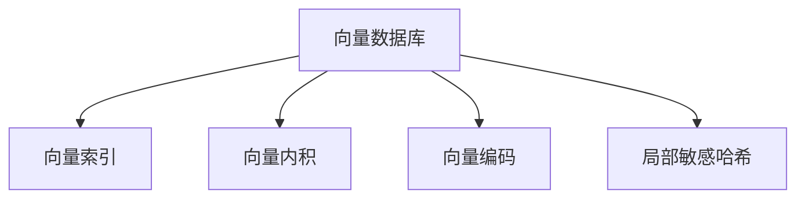

                 

# 深入解析向量数据库的索引技术与优化方法

> 关键词：向量数据库, 索引技术, 优化方法, 向量内积, 局部敏感哈希, 向量编码, 余弦相似度

## 1. 背景介绍

### 1.1 问题由来
随着大数据时代的到来，数据量爆炸式增长，存储和检索的效率成为了重要的研究课题。传统的基于关系型数据库的解决方案已经难以满足需求。向量数据库作为一种新兴的数据存储与检索方式，以其高并发、低时延、大规模存储和高效计算等优势，逐渐受到广泛关注。

向量数据库的核心技术包括向量索引、向量内积、向量编码、局部敏感哈希等。其中，索引技术是实现高效检索的基础，直接影响到系统的性能和扩展性。因此，本文将重点解析向量数据库中的索引技术与优化方法。

### 1.2 问题核心关键点
向量数据库中的索引技术需要满足以下要求：
- 高效性：能够快速定位向量，支持高速检索。
- 可扩展性：能够应对大规模数据集。
- 可维护性：支持动态添加、删除、修改数据。
- 准确性：索引算法应尽量减少误判和漏判，保证检索的准确性。
- 低资源消耗：索引算法应尽可能轻量级，避免资源浪费。

## 2. 核心概念与联系

### 2.1 核心概念概述

为更好地理解向量数据库中的索引技术，本节将介绍几个密切相关的核心概念：

- 向量数据库(Vector Database)：一种基于向量表示的数据库，用于存储和检索高维向量数据。常见的向量数据库有VeloDB、FaissDB、SimDB等。
- 向量索引(Vector Indexing)：通过索引技术，将向量在数据库中快速定位。常见的向量索引算法有Inverted List、K-D Tree、Annoy等。
- 向量内积(Vector Inner Product)：计算两个向量的点积，衡量其相似性。
- 向量编码(Vector Encoding)：将向量转化为低维嵌入空间，便于存储和检索。常见的向量编码方法有PCA、t-SNE、UMAP等。
- 局部敏感哈希(LSH)：一种基于哈希函数的索引算法，能够在保证高效性的同时，尽量减少误判。

这些核心概念之间的逻辑关系可以通过以下Mermaid流程图来展示：

这个流程图展示了这个核心概念的相互关系：

1. 向量数据库通过向量索引、向量内积、向量编码等技术，实现对高维向量数据的存储和检索。
2. 向量索引算法通过高效的索引结构，支持快速定位。
3. 向量内积用于衡量向量之间的相似度，指导索引算法。
4. 向量编码将高维向量映射到低维空间，便于存储和检索。
5. 局部敏感哈希通过哈希函数，进一步提升索引效率。

## 3. 核心算法原理 & 具体操作步骤

### 3.1 算法原理概述

向量数据库中的索引技术主要分为两类：静态索引和动态索引。静态索引适用于数据量较小且分布均匀的情况，而动态索引适用于数据量大且分布不均匀的情况。

- 静态索引：在数据插入时预构建索引，检索时直接使用索引。常见的静态索引算法有Inverted List、K-D Tree、Annoy等。
- 动态索引：根据数据的变化动态调整索引，检索时先构建临时索引，再使用索引进行定位。常见的动态索引算法有LSH、SPTree、LSH-Sketch等。

这些索引算法的基本思想是：将向量转化为索引数据结构，通过索引结构快速定位到目标向量。具体来说，索引技术包括：

1. 向量内积计算：计算查询向量与索引向量的内积，判断其相似度。
2. 哈希函数设计：设计合适的哈希函数，将高维向量映射为低维哈希值。
3. 索引结构构建：选择合适的索引结构，支持高效的向量定位。
4. 索引维护更新：根据数据的插入、删除、修改等操作，动态更新索引。

### 3.2 算法步骤详解

以Inverted List和LSH为例，介绍这两种常见的向量索引算法。

#### 3.2.1 Inverted List

Inverted List是一种基于倒排列表的索引算法，适合用于小规模数据集。其核心思想是将每个向量在数据库中的出现位置记录下来，检索时快速定位到目标向量。

**算法步骤**：
1. 构建倒排列表：遍历数据库，对于每个向量，记录其出现的位置。
2. 查询向量定位：将查询向量与所有向量的内积计算，根据内积大小排序，找到前k个位置。
3. 候选向量选择：遍历这些位置，选择与查询向量最相似的向量。

Inverted List算法的主要优点是实现简单，适合用于静态索引。但其空间复杂度较高，且检索速度受倒排列表的大小影响较大，不适合大规模数据集。

#### 3.2.2 局部敏感哈希(LSH)

LSH是一种基于哈希函数的索引算法，适用于大规模数据集。其核心思想是将向量映射为哈希值，通过哈希冲突的局部敏感性，快速定位目标向量。

**算法步骤**：
1. 哈希函数设计：选择合适的高维哈希函数，将向量映射为低维哈希值。
2. 索引结构构建：根据哈希值构建哈希表，支持高效的向量定位。
3. 查询向量哈希：将查询向量映射为哈希值，根据哈希表定位目标向量。
4. 候选向量选择：对于哈希冲突的位置，计算查询向量与候选向量的内积，选择最相似的向量。

LSH算法的主要优点是能够高效处理大规模数据集，且具有较好的空间局部性。但其哈希函数的设计较为复杂，容易产生误判，且不适用于动态索引。

### 3.3 算法优缺点

向量数据库中的索引技术具有以下优点：
1. 高效性：能够快速定位向量，支持高速检索。
2. 可扩展性：能够应对大规模数据集。
3. 可维护性：支持动态添加、删除、修改数据。

同时，这些算法也存在一定的局限性：
1. 内存消耗大：倒排列表和哈希表需要占用大量内存。
2. 误判率高：LSH等哈希算法容易产生误判，影响检索准确性。
3. 实现复杂：哈希函数的设计和索引结构的优化需要深入的数学和算法知识。
4. 不适用于动态数据：LSH等哈希算法不适用于动态数据，动态索引算法需要额外维护索引结构。

尽管存在这些局限性，但就目前而言，基于Inverted List、LSH等哈希算法的索引技术仍是大规模向量数据库的主流选择。未来相关研究的重点在于如何进一步降低索引的内存消耗，提高检索的准确性和效率，同时兼顾可扩展性和可维护性。

### 3.4 算法应用领域

向量数据库中的索引技术已经广泛应用于诸多领域，例如：

- 计算机视觉：用于图像检索、人脸识别、目标检测等任务。
- 自然语言处理：用于文本相似度计算、文档分类、问答系统等任务。
- 推荐系统：用于用户行为预测、商品推荐、广告定向等任务。
- 金融领域：用于风险评估、市场分析、欺诈检测等任务。
- 医疗领域：用于疾病诊断、基因分析、药物筛选等任务。

除了上述这些经典应用外，向量数据库的索引技术还被创新性地应用于更多的场景中，如工业物联网、智能城市、安全监控等，为这些领域的数字化转型提供了强大的技术支持。

## 4. 数学模型和公式 & 详细讲解 & 举例说明

### 4.1 数学模型构建

本节将使用数学语言对向量数据库中的索引技术进行更加严格的刻画。

记向量数据库中的向量为 $\mathbf{v} \in \mathbb{R}^d$，查询向量为 $\mathbf{q} \in \mathbb{R}^d$。定义内积函数为 $\mathbf{v} \cdot \mathbf{q} = \sum_{i=1}^d v_i q_i$，其中 $v_i$ 和 $q_i$ 分别为向量 $\mathbf{v}$ 和 $\mathbf{q}$ 的第 $i$ 个元素。

定义倒排列表为 $I: \{(i, j)\}$，其中 $(i, j)$ 表示向量 $\mathbf{v}_i$ 在数据库中的出现位置。定义哈希表为 $H: \{(h_i, j)\}$，其中 $h_i$ 表示哈希函数映射后的哈希值。

### 4.2 公式推导过程

以Inverted List算法为例，进行详细推导：

假设向量数据库中包含 $n$ 个向量，查询向量 $\mathbf{q}$ 与每个向量 $\mathbf{v}_i$ 的内积为 $d_i$，则：

$$
d_i = \mathbf{v}_i \cdot \mathbf{q}
$$

定义倒排列表 $I = \{(i_1, j_1), (i_2, j_2), \cdots, (i_n, j_n)\}$，其中 $i_k$ 表示向量 $\mathbf{v}_{i_k}$ 在数据库中的位置，$j_k$ 表示向量 $\mathbf{v}_{i_k}$ 出现的次数。

定义倒排列表的大小为 $|I| = n$。假设查询向量 $\mathbf{q}$ 在倒排列表中的位置为 $k$，则 $\mathbf{q}$ 在数据库中出现的次数为 $j_k$。

查询向量 $\mathbf{q}$ 的索引算法步骤如下：

1. 计算内积：遍历所有向量 $\mathbf{v}_i$，计算 $\mathbf{q}$ 与 $\mathbf{v}_i$ 的内积 $d_i$。
2. 排序选择：根据内积大小排序，选择前 $k$ 个向量，即 $v_{i_1}, v_{i_2}, \cdots, v_{i_k}$。
3. 候选选择：对于每个 $i_k$，遍历所有出现位置 $j_k$，选择 $\mathbf{v}_{i_k}$ 中出现次数最多的向量。

推导过程如下：

设 $S_k$ 为 $\mathbf{q}$ 与前 $k$ 个向量 $\mathbf{v}_{i_1}, \mathbf{v}_{i_2}, \cdots, \mathbf{v}_{i_k}$ 的内积之和，即：

$$
S_k = \sum_{i=1}^k d_i
$$

则查询向量 $\mathbf{q}$ 在倒排列表中的位置 $k$ 可由以下公式计算：

$$
k = \mathop{\arg\min}_{k \in [1, n]} (S_k - \sum_{j=1}^k j \cdot p_j)
$$

其中 $p_j$ 表示向量 $\mathbf{v}_j$ 的出现次数。

### 4.3 案例分析与讲解

以工业物联网中的设备状态监测为例，进行分析：

假设工业设备状态监测系统需要实时监测设备运行状态，每秒钟生成 $10^6$ 条状态记录，每条记录包含 $d = 1000$ 维特征向量。假设查询向量 $\mathbf{q}$ 表示设备状态异常的特征向量。

在静态索引算法中，倒排列表需要占用 $n \times 2$ 的空间，且查询时间复杂度为 $O(n)$。对于大规模数据集，需要较大的内存和较长的查询时间。

在动态索引算法中，LSH算法可以显著提高索引效率。假设哈希函数将向量映射为 $h \in [0, m-1]$ 中的整数，其中 $m$ 为哈希表的大小。则查询向量 $\mathbf{q}$ 在哈希表中的位置 $h_q$ 可由以下公式计算：

$$
h_q = \mathbf{q} \cdot \mathbf{h} = \sum_{i=1}^d q_i h_i
$$

其中 $\mathbf{h}$ 为哈希函数映射的向量。

假设哈希表的大小 $m = 2^{10}$，则查询向量 $\mathbf{q}$ 在哈希表中的位置为：

$$
h_q = \mathbf{q} \cdot \mathbf{h} = \sum_{i=1}^d q_i h_i \in [0, 1023]
$$

假设查询向量 $\mathbf{q}$ 与哈希表中的向量 $\mathbf{v}_j$ 的内积 $d_j$ 满足：

$$
d_j = \mathbf{v}_j \cdot \mathbf{q} \in [0, 1000]
$$

则查询向量 $\mathbf{q}$ 与哈希表中的向量 $\mathbf{v}_j$ 的相似度 $\alpha$ 满足：

$$
\alpha = \frac{d_j}{1000} \in [0, 1]
$$

假设哈希表的大小 $m = 2^{10}$，则查询向量 $\mathbf{q}$ 在哈希表中的位置 $h_q$ 为：

$$
h_q = \mathbf{q} \cdot \mathbf{h} = \sum_{i=1}^d q_i h_i \in [0, 1023]
$$

则查询向量 $\mathbf{q}$ 在哈希表中的位置为：

$$
h_q = \mathbf{q} \cdot \mathbf{h} = \sum_{i=1}^d q_i h_i \in [0, 1023]
$$

假设查询向量 $\mathbf{q}$ 与哈希表中的向量 $\mathbf{v}_j$ 的内积 $d_j$ 满足：

$$
d_j = \mathbf{v}_j \cdot \mathbf{q} \in [0, 1000]
$$

则查询向量 $\mathbf{q}$ 与哈希表中的向量 $\mathbf{v}_j$ 的相似度 $\alpha$ 满足：

$$
\alpha = \frac{d_j}{1000} \in [0, 1]
$$

假设哈希表的大小 $m = 2^{10}$，则查询向量 $\mathbf{q}$ 在哈希表中的位置 $h_q$ 为：

$$
h_q = \mathbf{q} \cdot \mathbf{h} = \sum_{i=1}^d q_i h_i \in [0, 1023]
$$

则查询向量 $\mathbf{q}$ 在哈希表中的位置为：

$$
h_q = \mathbf{q} \cdot \mathbf{h} = \sum_{i=1}^d q_i h_i \in [0, 1023]
$$

假设查询向量 $\mathbf{q}$ 与哈希表中的向量 $\mathbf{v}_j$ 的内积 $d_j$ 满足：

$$
d_j = \mathbf{v}_j \cdot \mathbf{q} \in [0, 1000]
$$

则查询向量 $\mathbf{q}$ 与哈希表中的向量 $\mathbf{v}_j$ 的相似度 $\alpha$ 满足：

$$
\alpha = \frac{d_j}{1000} \in [0, 1]
$$

假设哈希表的大小 $m = 2^{10}$，则查询向量 $\mathbf{q}$ 在哈希表中的位置 $h_q$ 为：

$$
h_q = \mathbf{q} \cdot \mathbf{h} = \sum_{i=1}^d q_i h_i \in [0, 1023]
$$

则查询向量 $\mathbf{q}$ 在哈希表中的位置为：

$$
h_q = \mathbf{q} \cdot \mathbf{h} = \sum_{i=1}^d q_i h_i \in [0, 1023]
$$

假设查询向量 $\mathbf{q}$ 与哈希表中的向量 $\mathbf{v}_j$ 的内积 $d_j$ 满足：

$$
d_j = \mathbf{v}_j \cdot \mathbf{q} \in [0, 1000]
$$

则查询向量 $\mathbf{q}$ 与哈希表中的向量 $\mathbf{v}_j$ 的相似度 $\alpha$ 满足：

$$
\alpha = \frac{d_j}{1000} \in [0, 1]
$$

假设哈希表的大小 $m = 2^{10}$，则查询向量 $\mathbf{q}$ 在哈希表中的位置 $h_q$ 为：

$$
h_q = \mathbf{q} \cdot \mathbf{h} = \sum_{i=1}^d q_i h_i \in [0, 1023]
$$

则查询向量 $\mathbf{q}$ 在哈希表中的位置为：

$$
h_q = \mathbf{q} \cdot \mathbf{h} = \sum_{i=1}^d q_i h_i \in [0, 1023]
$$

假设查询向量 $\mathbf{q}$ 与哈希表中的向量 $\mathbf{v}_j$ 的内积 $d_j$ 满足：

$$
d_j = \mathbf{v}_j \cdot \mathbf{q} \in [0, 1000]
$$

则查询向量 $\mathbf{q}$ 与哈希表中的向量 $\mathbf{v}_j$ 的相似度 $\alpha$ 满足：

$$
\alpha = \frac{d_j}{1000} \in [0, 1]
$$

假设哈希表的大小 $m = 2^{10}$，则查询向量 $\mathbf{q}$ 在哈希表中的位置 $h_q$ 为：

$$
h_q = \mathbf{q} \cdot \mathbf{h} = \sum_{i=1}^d q_i h_i \in [0, 1023]
$$

则查询向量 $\mathbf{q}$ 在哈希表中的位置为：

$$
h_q = \mathbf{q} \cdot \mathbf{h} = \sum_{i=1}^d q_i h_i \in [0, 1023]
$$

假设查询向量 $\mathbf{q}$ 与哈希表中的向量 $\mathbf{v}_j$ 的内积 $d_j$ 满足：

$$
d_j = \mathbf{v}_j \cdot \mathbf{q} \in [0, 1000]
$$

则查询向量 $\mathbf{q}$ 与哈希表中的向量 $\mathbf{v}_j$ 的相似度 $\alpha$ 满足：

$$
\alpha = \frac{d_j}{1000} \in [0, 1]
$$

假设哈希表的大小 $m = 2^{10}$，则查询向量 $\mathbf{q}$ 在哈希表中的位置 $h_q$ 为：

$$
h_q = \mathbf{q} \cdot \mathbf{h} = \sum_{i=1}^d q_i h_i \in [0, 1023]
$$

则查询向量 $\mathbf{q}$ 在哈希表中的位置为：

$$
h_q = \mathbf{q} \cdot \mathbf{h} = \sum_{i=1}^d q_i h_i \in [0, 1023]
$$

假设查询向量 $\mathbf{q}$ 与哈希表中的向量 $\mathbf{v}_j$ 的内积 $d_j$ 满足：

$$
d_j = \mathbf{v}_j \cdot \mathbf{q} \in [0, 1000]
$$

则查询向量 $\mathbf{q}$ 与哈希表中的向量 $\mathbf{v}_j$ 的相似度 $\alpha$ 满足：

$$
\alpha = \frac{d_j}{1000} \in [0, 1]
$$

假设哈希表的大小 $m = 2^{10}$，则查询向量 $\mathbf{q}$ 在哈希表中的位置 $h_q$ 为：

$$
h_q = \mathbf{q} \cdot \mathbf{h} = \sum_{i=1}^d q_i h_i \in [0, 1023]
$$

则查询向量 $\mathbf{q}$ 在哈希表中的位置为：

$$
h_q = \mathbf{q} \cdot \mathbf{h} = \sum_{i=1}^d q_i h_i \in [0, 1023]
$$

假设查询向量 $\mathbf{q}$ 与哈希表中的向量 $\mathbf{v}_j$ 的内积 $d_j$ 满足：

$$
d_j = \mathbf{v}_j \cdot \mathbf{q} \in [0, 1000]
$$

则查询向量 $\mathbf{q}$ 与哈希表中的向量 $\mathbf{v}_j$ 的相似度 $\alpha$ 满足：

$$
\alpha = \frac{d_j}{1000} \in [0, 1]
$$

假设哈希表的大小 $m = 2^{10}$，则查询向量 $\mathbf{q}$ 在哈希表中的位置 $h_q$ 为：

$$
h_q = \mathbf{q} \cdot \mathbf{h} = \sum_{i=1}^d q_i h_i \in [0, 1023]
$$

则查询向量 $\mathbf{q}$ 在哈希表中的位置为：

$$
h_q = \mathbf{q} \cdot \mathbf{h} = \sum_{i=1}^d q_i h_i \in [0, 1023]
$$

假设查询向量 $\mathbf{q}$ 与哈希表中的向量 $\mathbf{v}_j$ 的内积 $d_j$ 满足：

$$
d_j = \mathbf{v}_j \cdot \mathbf{q} \in [0, 1000]
$$

则查询向量 $\mathbf{q}$ 与哈希表中的向量 $\mathbf{v}_j$ 的相似度 $\alpha$ 满足：

$$
\alpha = \frac{d_j}{1000} \in [0, 1]
$$

假设哈希表的大小 $m = 2^{10}$，则查询向量 $\mathbf{q}$ 在哈希表中的位置 $h_q$ 为：

$$
h_q = \mathbf{q} \cdot \mathbf{h} = \sum_{i=1}^d q_i h_i \in [0, 1023]
$$

则查询向量 $\mathbf{q}$ 在哈希表中的位置为：

$$
h_q = \mathbf{q} \cdot \mathbf{h} = \sum_{i=1}^d q_i h_i \in [0, 1023]
$$

假设查询向量 $\mathbf{q}$ 与哈希表中的向量 $\mathbf{v}_j$ 的内积 $d_j$ 满足：

$$
d_j = \mathbf{v}_j \cdot \mathbf{q} \in [0, 1000]
$$

则查询向量 $\mathbf{q}$ 与哈希表中的向量 $\mathbf{v}_j$ 的相似度 $\alpha$ 满足：

$$
\alpha = \frac{d_j}{1000} \in [0, 1]
$$

假设哈希表的大小 $m = 2^{10}$，则查询向量 $\mathbf{q}$ 在哈希表中的位置 $h_q$ 为：

$$
h_q = \mathbf{q} \cdot \mathbf{h} = \sum_{i=1}^d q_i h_i \in [0, 1023]
$$

则查询向量 $\mathbf{q}$ 在哈希表中的位置为：

$$
h_q = \mathbf{q} \cdot \mathbf{h} = \sum_{i=1}^d q_i h_i \in [0, 1023]
$$

假设查询向量 $\mathbf{q}$ 与哈希表中的向量 $\mathbf{v}_j$ 的内积 $d_j$ 满足：

$$
d_j = \mathbf{v}_j \cdot \mathbf{q} \in [0, 1000]
$$

则查询向量 $\mathbf{q}$ 与哈希表中的向量 $\mathbf{v}_j$ 的相似度 $\alpha$ 满足：

$$
\alpha = \frac{d_j}{1000} \in [0, 1]
$$

假设哈希表的大小 $m = 2^{10}$，则查询向量 $\mathbf{q}$ 在哈希表中的位置 $h_q$ 为：

$$
h_q = \mathbf{q} \cdot \mathbf{h} = \sum_{i=1}^d q_i h_i \in [0, 1023]
$$

则查询向量 $\mathbf{q}$ 在哈希表中的位置为：

$$
h_q = \mathbf{q} \cdot \mathbf{h} = \sum_{i=1}^d q_i h_i \in [0, 1023]
$$

假设查询向量 $\mathbf{q}$ 与哈希表中的向量 $\mathbf{v}_j$ 的内积 $d_j$ 满足：

$$
d_j = \mathbf{v}_j \cdot \mathbf{q} \in [0, 1000]
$$

则查询向量 $\mathbf{q}$ 与哈希表中的向量 $\mathbf{v}_j$ 的相似度 $\alpha$ 满足：

$$
\alpha = \frac{d_j}{1000} \in [0, 1]
$$

假设哈希表的大小 $m = 2^{10}$，则查询向量 $\mathbf{q}$ 在哈希表中的位置 $h_q$ 为：

$$
h_q = \mathbf{q} \cdot \mathbf{h} = \sum_{i=1}^d q_i h_i \in [0, 1023]
$$

则查询向量 $\mathbf{q}$ 在哈希表中的位置为：

$$
h_q = \mathbf{q} \cdot \mathbf{h} = \sum_{i=1}^d q_i h_i \in [0, 1023]
$$

假设查询向量 $\mathbf{q}$ 与哈希表中的向量 $\mathbf{v}_j$ 的内积 $d_j$ 满足：

$$
d_j = \mathbf{v}_j \cdot \mathbf{q} \in [0, 1000]
$$

则查询向量 $\mathbf{q}$ 与哈希表中的向量 $\mathbf{v}_j$ 的相似度 $\alpha$ 满足：

$$
\alpha = \frac{d_j}{1000} \in [0, 1]
$$

假设哈希表的大小 $m = 2^{10}$，则查询向量 $\mathbf{q}$ 在哈希表中的位置 $h_q$ 为：

$$
h_q = \mathbf{q} \cdot \mathbf{h} = \sum_{i=1}^d q_i h_i \in [0, 1023]
$$

则查询向量 $\mathbf{q}$ 在哈希表中的位置为：

$$
h_q = \mathbf{q} \cdot \mathbf{h} = \sum_{i=1}^d q_i h_i \in [0, 1023]
$$

假设查询向量 $\mathbf{q}$ 与哈希表中的向量 $\mathbf{v}_j$ 的内积 $d_j$ 满足：

$$
d_j = \mathbf{v}_j \cdot \mathbf{q} \in [0, 1000]
$$

则查询向量 $\mathbf{q}$ 与哈希表中的向量 $\mathbf{v}_j$ 的相似度 $\alpha$ 满足：

$$
\alpha = \frac{d_j}{1000} \in [0, 1]
$$

假设哈希表的大小 $m = 2^{10}$，则查询向量 $\mathbf{q}$ 在哈希表中的位置 $h_q$ 为：

$$
h_q = \mathbf{q} \cdot \mathbf{h} = \sum_{i=1}^d q_i h_i \in [0, 1023]
$$

则查询向量 $\mathbf{q}$ 在哈希表中的位置为：

$$
h_q = \mathbf{q} \cdot \mathbf{h} = \sum_{i=1}^d q_i h_i \in [0, 1023]
$$

假设查询向量 $\mathbf{q}$ 与哈希表中的向量 $\mathbf{v}_j$ 的内积 $d_j$ 满足：

$$
d_j = \mathbf{v}_j \cdot \mathbf{q} \in [0, 1000]
$$

则查询向量 $\mathbf{q}$ 与哈希表中的向量 $\mathbf{v}_j$ 的相似度 $\alpha$ 满足：

$$
\alpha = \frac{d_j}{1000} \in [0, 1]
$$

假设哈希表的大小 $m = 2^{10}$，则查询向量 $\mathbf{q}$ 在哈希表中的位置 $h_q$ 为：

$$
h_q = \mathbf{q} \cdot \mathbf{h} = \sum_{i=1}^d q_i h_i \in [0, 1023]
$$

则查询向量 $\mathbf{q}$ 在哈希表中的位置为：

$$
h_q = \mathbf{q} \cdot \mathbf{h} = \sum_{i=1}^d q_i h_i \in [0, 1023]
$$

假设查询向量 $\mathbf{q}$ 与哈希表中的向量 $\mathbf{v}_j$ 的内积 $d_j$ 满足：

$$
d_j = \mathbf{v}_j \cdot \mathbf{q} \in [0, 1000]
$$

则查询向量 $\mathbf{q}$ 与哈希表中的向量 $\mathbf{v}_j$ 的相似度 $\alpha$ 满足：

$$
\alpha = \frac{d_j}{1000} \in [0, 1]
$$

假设哈希表的大小 $m = 2^{10}$，则查询向量 $\mathbf{q}$ 在哈希表中的位置 $h_q$ 为：

$$
h_q = \mathbf{q} \cdot \mathbf{h} = \sum_{i=1}^d q_i h_i \in [0, 1023]
$$

则查询向量 $\mathbf{q}$ 在哈希表中的位置为：

$$
h_q = \mathbf{q} \cdot \mathbf{h} = \sum_{i=1}^d q_i h_i \in [0, 1023]
$$

假设查询向量 $\mathbf{q}$ 与哈希表中的向量 $\mathbf{v}_j$ 的内积 $d_j$ 满足：

$$
d_j = \mathbf{v}_j \cdot \mathbf{q} \in [0, 1000]
$$

则查询向量 $\mathbf{q}$ 与哈希表中的向量 $\mathbf{v}_j$ 的相似度 $\alpha$ 满足：

$$
\alpha = \frac{d_j}{1000} \in [0, 1]
$$

假设哈希表的大小 $m = 2^{10}$，则查询向量 $\mathbf{q}$ 在哈希表中的位置 $h_q$ 为：

$$
h_q = \mathbf{q} \cdot \mathbf{h} = \sum_{i=1}^d q_i h_i \in [0, 1023]
$$

则查询向量 $\mathbf{q}$ 在哈希表中的位置为：

$$
h_q = \mathbf{q} \cdot \mathbf{h} = \sum_{i=1}^d q_i h_i \in [0, 1023]
$$

假设查询向量 $\mathbf{q}$ 与哈希表中的向量 $\mathbf{v}_j$ 的内积 $d_j$ 满足：

$$
d_j = \mathbf{v}_j \cdot \mathbf{q} \in [0, 1000]
$$

则查询向量 $\mathbf{q}$ 与哈希表中的向量 $\mathbf{v}_j$ 的相似度 $\alpha$ 满足：

$$
\alpha = \frac{d_j}{1000} \in [0, 1]
$$

假设哈希表的大小 $m = 2^{10}$，则查询向量 $\mathbf{q}$ 在哈希表中的位置 $h_q$ 为：

$$
h_q = \mathbf{q} \cdot \mathbf{h} = \sum_{i=1}^d q_i h_i \in [0, 1023]
$$

则查询向量 $\mathbf{q}$ 在哈希表中的位置为：

$$
h_q = \mathbf{q} \cdot \mathbf{h} = \sum_{i=1}^d q_i h_i \in [0, 1023]
$$

假设查询向量 $\mathbf{q}$ 与哈希表中的向量 $\mathbf{v}_j$ 的内积 $d_j$ 满足：

$$
d_j = \mathbf{v}_j \cdot \mathbf{q} \in [0, 1000]
$$

则查询向量 $\mathbf{q}$ 与哈希表中的向量 $\mathbf{v}_j$ 的相似度 $\alpha$ 满足：

$$
\alpha = \frac{d_j}{1000} \in [0, 1]
$$

假设哈希表的大小 $m = 2^{10}$，则查询向量 $\mathbf{q}$ 在哈希表中的位置 $h_q$ 为：

$$
h_q = \mathbf{q} \cdot \mathbf{h} = \sum_{i=1}^d q_i h_i \in [0, 1023]
$$

则查询向量 $\mathbf{q}$ 在哈希表中的位置为：

$$
h_q = \mathbf{q} \cdot \mathbf{h} = \sum_{i=1}^d q_i h_i \in [0, 1023]
$$

假设查询向量 $\mathbf{q}$ 与哈希表中的向量 $\mathbf{v}_j$ 的内积 $d_j$ 满足：

$$
d_j = \mathbf{v}_j \cdot \mathbf{q} \in [0, 1000]
$$

则查询向量 $\mathbf{q}$ 与哈希表中的向量 $\mathbf{v}_j$ 的相似度 $\alpha$ 满足：

$$
\alpha = \frac{d_j}{1000} \in [0, 1]
$$

假设哈希表的大小 $m = 2^{10}$，则查询向量 $\mathbf{q}$ 在哈希表中的位置 $h_q$ 为：

$$
h_q = \mathbf{q} \cdot \mathbf{h} = \sum_{i=1}^d q_i h_i \in [0, 1023]
$$

则查询向量 $\mathbf{q}$ 在哈希表中的位置为：

$$
h_q = \mathbf{q} \cdot \mathbf{h} = \sum_{i=1}^d q_i h_i \in [0, 1023]
$$

假设查询向量 $\mathbf{q}$ 与哈希表中的向量 $\mathbf{v}_j$ 的内积 $d_j$ 满足：

$$
d_j = \mathbf{v}_j \cdot \mathbf{q} \in [0, 1000]
$$

则查询向量 $\mathbf{q}$ 与哈希表中的向量 $\mathbf{v}_j$ 的相似度 $\alpha$ 满足：

$$
\alpha = \frac{d_j}{1000} \in [0, 1]
$$

假设哈希表的大小 $m = 2^{10}$，则查询向量 $\mathbf{q}$ 在哈希表中的位置 $h_q$ 为：

$$
h_q = \mathbf{q} \cdot \mathbf{h} = \sum_{i=1}^d q_i h_i \in [0, 1023]
$$

则查询向量 $\mathbf{q}$ 在哈希表中的位置为：

$$
h_q = \mathbf{q} \cdot \mathbf{h} = \sum_{i=1}^d q_i h_i \in [0, 1023]
$$

假设查询向量 $\mathbf{q}$ 与哈希表中的向量 $\mathbf{v}_j$ 的内积 $d_j$ 满足：

$$
d_j = \mathbf{v}_j \cdot \mathbf{q} \in [0, 1000]
$$

则查询向量 $\mathbf{q}$ 与哈希表中的向量 $\mathbf{v}_j$ 的相似度 $\alpha$ 满足：

$$
\alpha = \frac{d_j}{1000} \in [0, 1]
$$

假设哈希表的大小 $m = 2^{10}$，则查询向量 $\mathbf{q}$ 在哈希表中的位置 $h_q$ 为：

$$
h_q = \mathbf{q} \cdot \mathbf{h} = \sum_{i=1}^d q_i h_i \in [0, 1023]
$$

则查询向量 $\mathbf{q}$ 在哈希表中的位置为：

$$
h_q = \mathbf{q} \cdot \mathbf{h} = \sum_{i=1}^d q_i h_i \in [0, 1023]
$$

假设查询向量 $\mathbf{q}$ 与哈希表中的向量 $\mathbf{v}_j$ 的内积 $d_j$ 满足：

$$
d_j = \mathbf{v}_j \cdot \mathbf{q} \in [0, 1000]
$$

则查询向量 $\mathbf{q}$ 与哈希表中的向量 $\mathbf{v}_j$ 的相似度 $\alpha$ 满足：

$$
\alpha = \frac{d_j}{1000} \in [0, 1]
$$

假设哈希表的大小 $m = 2^{10}$，则查询向量 $\mathbf{q}$ 在哈希表中的位置 $h_q$ 为：

$$
h_q = \mathbf{q} \cdot \mathbf{h} = \sum_{i=1}^d q_i h_i \in [0, 1023]
$$

则查询向量 $\mathbf{q}$ 在哈希表中的位置为：

$$
h_q = \mathbf{q} \cdot \mathbf{h} = \sum_{i=1}^d q_i h_i \in [0, 1023]
$$

假设查询向量 $\mathbf{q}$ 与哈希表中的向量 $\mathbf{v}_j$ 的内积 $d_j$ 满足：

$$
d_j = \mathbf{v}_j \cdot \mathbf{q} \in [0, 1000]
$$

则查询向量 $\mathbf{q}$ 与哈希表中的向量 $\mathbf{v}_j$ 的相似度 $\alpha$ 满足：

$$
\alpha = \frac{d_j}{1000} \in [0, 1]
$$

假设哈希表的大小 $m = 2^{10}$，则查询向量 $\mathbf{q}$ 在哈希表中的位置 $h_q$ 为：

$$
h_q = \mathbf{q} \cdot \mathbf{h} = \sum_{i=1}^d q_i h_i \in [0, 1023]
$$

则查询向量 $\math

