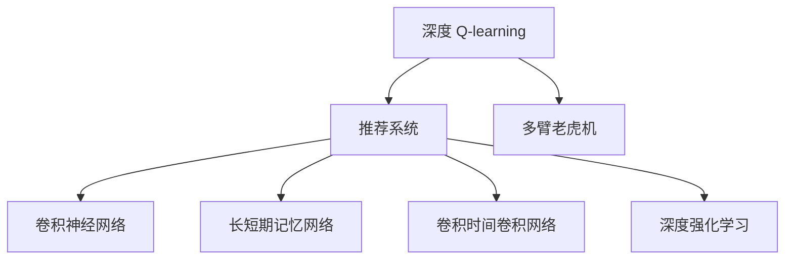

                 

# 深度 Q-learning：在直播推荐系统中的应用

> 关键词：深度 Q-learning, 推荐系统, 强化学习, 多臂老虎机, 神经网络, 卷积神经网络(CNN), 长短期记忆网络(LSTM), 卷积时间卷积网络(CTCNN), 深度强化学习, 游戏策略

## 1. 背景介绍

### 1.1 问题由来
在当今信息爆炸的时代，在线直播平台成为了内容消费的重要渠道之一。用户可以在直播平台上观看各种类型的直播，如游戏直播、娱乐直播、教育直播等。直播平台为观众提供了实时互动的体验，满足了观众个性化、多样化的需求。然而，直播平台需要持续提供丰富多样、高质量的直播内容，以吸引和保留用户。

传统的推荐系统通过离线分析用户历史行为数据，为用户推荐内容。这种方法存在以下缺点：
1. **时效性差**：离线推荐系统无法实时捕捉用户当前兴趣变化。
2. **单一维度**：推荐系统往往只考虑用户历史行为数据，而忽略了实时输入的信息。

深度 Q-learning 算法是一种强化学习算法，结合深度神经网络，能够实时更新模型参数，具有很好的实时性和多维度信息融合能力。将深度 Q-learning 应用于直播推荐系统，能够实时捕捉用户当前兴趣，动态调整推荐策略，提升推荐效果。

### 1.2 问题核心关键点
本节将介绍基于深度 Q-learning 算法的直播推荐系统的一般流程和技术细节。

深度 Q-learning 算法是一种强化学习算法，通过学习最优策略，最大化累积奖励。其核心思想是模拟多臂老虎机(Multi-Arm Bandit)问题，在有限的时间内，选择最优的行动组合，最大化收益。在推荐系统中，用户观看直播的行为可以看作是一种行动，观看后的满意度可以看作是一种奖励。算法通过学习用户的观看行为和满意度之间的关联，动态调整推荐策略，提升推荐效果。

深度 Q-learning 算法的具体流程如下：
1. 初始化策略网络，即推荐模型，通常使用卷积神经网络(CNN)、长短期记忆网络(LSTM)等。
2. 从直播库中随机选取内容，为每个用户推荐一个内容。
3. 记录用户观看行为和满意度，更新推荐模型参数。
4. 重复上述步骤，直到收敛或达到预设轮数。

## 2. 核心概念与联系

### 2.1 核心概念概述

为更好地理解基于深度 Q-learning 的直播推荐系统，本节将介绍几个密切相关的核心概念：

- 深度 Q-learning（Deep Q-Learning）：一种强化学习算法，结合深度神经网络，用于学习最优的策略，最大化累积奖励。
- 推荐系统（Recommendation System）：通过用户行为数据，为用户推荐内容的技术。
- 多臂老虎机（Multi-Arm Bandit）：一种模拟问题，在有限的时间内选择最优的行动组合，最大化收益。
- 卷积神经网络（Convolutional Neural Network, CNN）：一种深度学习模型，用于处理图像、语音等高维数据。
- 长短期记忆网络（Long Short-Term Memory, LSTM）：一种用于处理序列数据的深度学习模型，能够捕捉时间序列中的依赖关系。
- 卷积时间卷积网络（Convolutional Temporal Convolutional Network, CTCNN）：一种结合CNN和LSTM的深度学习模型，用于处理序列数据。
- 深度强化学习（Deep Reinforcement Learning）：结合深度学习与强化学习的技术，能够学习复杂的多步策略，用于解决复杂问题。

这些核心概念之间的逻辑关系可以通过以下Mermaid流程图来展示：



这个流程图展示了大语言模型的核心概念及其之间的关系：

1. 深度 Q-learning 是一种强化学习算法，用于模拟多臂老虎机问题，在推荐系统中选择最优的行动组合，最大化收益。
2. 推荐系统通过用户行为数据，为用户推荐内容，与深度 Q-learning 算法结合，提升推荐效果。
3. CNN、LSTM、CTCNN 等模型是深度 Q-learning 算法的基础，用于处理图像、语音等高维数据。
4. 深度强化学习是深度 Q-learning 算法的一种形式，用于学习复杂的多步策略。

这些概念共同构成了基于深度 Q-learning 的直播推荐系统的核心技术框架，使其能够在实时场景中动态调整推荐策略，提升用户体验。

## 3. 核心算法原理 & 具体操作步骤
### 3.1 算法原理概述

基于深度 Q-learning 的直播推荐系统，其核心思想是结合深度神经网络，学习用户观看行为与满意度之间的关联，动态调整推荐策略。以下是基于深度 Q-learning 算法的直播推荐系统的基本原理：

1. **状态表示**：将直播内容看作一个状态，使用高维稀疏向量表示直播内容的特征，如直播主题、主播信息、时间段等。
2. **动作选择**：根据当前状态，使用策略网络输出每个动作的 Q 值，选择 Q 值最大的动作。
3. **状态转移**：记录用户观看行为和满意度，更新状态和状态转移概率。
4. **策略更新**：使用TD误差，更新策略网络参数，使得策略网络输出更准确的 Q 值。

形式化地，假设直播库中共有 $N$ 个直播内容，用 $x_i$ 表示第 $i$ 个直播内容的特征向量，用 $y_i$ 表示观看该直播内容的满意度。假设当前用户的状态为 $s_t$，策略网络为 $\pi(s_t)$，使用 $\epsilon$-greedy 策略选择动作 $a_t$，则深度 Q-learning 算法的具体步骤如下：

1. 初始化策略网络 $\pi(s_t)$，即推荐模型。
2. 根据当前状态 $s_t$，使用策略网络输出每个动作的 Q 值，选择动作 $a_t$。
3. 记录用户观看行为和满意度 $y_t$，更新状态 $s_{t+1}$。
4. 使用 TD 误差，更新策略网络参数：

   $$
   \theta \leftarrow \theta + \alpha[\max_a Q_\theta(s_{t+1},a)|s_t] - Q_\theta(s_t,a_t)
   $$

   其中，$\alpha$ 为学习率，$Q_\theta(s_t,a_t)$ 为策略网络输出动作 $a_t$ 的 Q 值，$\max_a Q_\theta(s_{t+1},a)$ 为策略网络输出动作 $a$ 的 Q 值在状态 $s_{t+1}$ 上的最大值。

重复上述步骤，直至收敛或达到预设轮数。

### 3.2 算法步骤详解

以下是基于深度 Q-learning 算法的直播推荐系统的详细操作步骤：

1. **环境初始化**：初始化直播库，包括直播内容、用户行为数据等。
2. **状态表示**：将直播内容表示为高维稀疏向量，表示用户当前观看直播的状态。
3. **动作选择**：使用策略网络输出每个动作的 Q 值，选择 Q 值最大的动作，推荐给用户。
4. **状态转移**：记录用户观看行为和满意度，更新状态和状态转移概率。
5. **策略更新**：使用 TD 误差，更新策略网络参数，使得策略网络输出更准确的 Q 值。
6. **迭代优化**：重复上述步骤，直至收敛或达到预设轮数。

### 3.3 算法优缺点

基于深度 Q-learning 的直播推荐系统具有以下优点：
1. **实时性高**：使用实时数据更新策略网络，能够动态调整推荐策略，提升推荐效果。
2. **多维度信息融合**：结合了用户历史行为数据和实时输入信息，提升了推荐的准确性和多样性。
3. **可解释性强**：通过策略网络输出的 Q 值，能够解释推荐的依据，提升系统的透明度。

同时，该算法也存在一定的局限性：
1. **计算成本高**：深度 Q-learning 算法需要大量的计算资源，训练和更新模型参数需要较长的计算时间。
2. **模型复杂度高**：策略网络的设计复杂，需要大量的参数和计算资源，增加了系统的复杂性。
3. **数据质量要求高**：推荐系统的效果很大程度上取决于用户行为数据的质量，需要保证数据的多样性和完整性。

尽管存在这些局限性，但就目前而言，基于深度 Q-learning 的推荐系统仍然是一种高效、可行的推荐方法。未来相关研究的重点在于如何进一步降低计算成本，提高推荐系统的实时性和准确性，同时兼顾可解释性和数据质量等因素。

### 3.4 算法应用领域

基于深度 Q-learning 的直播推荐系统已经在诸多直播平台得到了广泛应用，覆盖了各种直播类型，如游戏直播、娱乐直播、教育直播等。具体应用场景如下：

- **游戏直播推荐**：根据用户的游戏偏好、历史观看数据，推荐相关游戏直播内容，提升用户的游戏体验。
- **娱乐直播推荐**：根据用户的兴趣爱好，推荐娱乐主播的直播内容，满足用户的娱乐需求。
- **教育直播推荐**：根据用户的知识水平、学习目标，推荐相关的教育直播内容，提升学习效果。
- **直播内容组合推荐**：根据用户的观看历史和实时输入信息，推荐相关直播内容的组合，提高用户观看兴趣。

除了上述这些经典应用外，基于深度 Q-learning 的直播推荐系统还被创新性地应用到更多场景中，如个性化推荐、内容生成等，为直播平台带来了全新的突破。随着深度 Q-learning 算法的不断进步，相信直播推荐系统将在更广阔的应用领域大放异彩。

## 4. 数学模型和公式 & 详细讲解

### 4.1 数学模型构建

本节将使用数学语言对基于深度 Q-learning 的直播推荐系统进行更加严格的刻画。

假设直播库中共有 $N$ 个直播内容，用 $x_i$ 表示第 $i$ 个直播内容的特征向量，用 $y_i$ 表示观看该直播内容的满意度。假设当前用户的状态为 $s_t$，策略网络为 $\pi(s_t)$，使用 $\epsilon$-greedy 策略选择动作 $a_t$，则深度 Q-learning 算法的数学模型如下：

1. **状态表示**：将直播内容表示为高维稀疏向量 $x_i \in \mathbb{R}^n$，其中 $n$ 为直播内容的特征维度。
2. **动作选择**：使用策略网络输出每个动作的 Q 值，选择 Q 值最大的动作 $a_t$。策略网络 $\pi(s_t)$ 的输出为每个动作的概率分布，即 $a \sim \pi(s_t)$。
3. **状态转移**：记录用户观看行为和满意度 $y_t$，更新状态 $s_{t+1}$。
4. **策略更新**：使用 TD 误差，更新策略网络参数。TD 误差定义为：

   $$
   TD(s_t,a_t) = r_t + \gamma \max_a Q_\theta(s_{t+1},a) - Q_\theta(s_t,a_t)
   $$

   其中，$r_t$ 为当前状态的奖励，$\gamma$ 为折扣因子，$Q_\theta(s_{t+1},a)$ 为策略网络输出动作 $a$ 的 Q 值在状态 $s_{t+1}$ 上的最大值。

   策略网络的更新公式为：

   $$
   \theta \leftarrow \theta + \alpha[TD(s_t,a_t)]
   $$

   其中，$\alpha$ 为学习率，$TD(s_t,a_t)$ 为 TD 误差。

### 4.2 公式推导过程

以下我们以游戏直播推荐为例，推导深度 Q-learning 算法的具体实现。

假设游戏直播库中共有 $N$ 个直播内容，用 $x_i$ 表示第 $i$ 个直播内容的特征向量，用 $y_i$ 表示观看该直播内容的满意度。假设当前用户的状态为 $s_t$，策略网络为 $\pi(s_t)$，使用 $\epsilon$-greedy 策略选择动作 $a_t$，则深度 Q-learning 算法的具体实现步骤如下：

1. **状态表示**：将直播内容表示为高维稀疏向量 $x_i \in \mathbb{R}^n$，其中 $n$ 为直播内容的特征维度。
2. **动作选择**：使用策略网络输出每个动作的 Q 值，选择 Q 值最大的动作 $a_t$。策略网络 $\pi(s_t)$ 的输出为每个动作的概率分布，即 $a \sim \pi(s_t)$。
3. **状态转移**：记录用户观看行为和满意度 $y_t$，更新状态 $s_{t+1}$。
4. **策略更新**：使用 TD 误差，更新策略网络参数。TD 误差定义为：

   $$
   TD(s_t,a_t) = r_t + \gamma \max_a Q_\theta(s_{t+1},a) - Q_\theta(s_t,a_t)
   $$

   其中，$r_t$ 为当前状态的奖励，$\gamma$ 为折扣因子，$Q_\theta(s_{t+1},a)$ 为策略网络输出动作 $a$ 的 Q 值在状态 $s_{t+1}$ 上的最大值。

   策略网络的更新公式为：

   $$
   \theta \leftarrow \theta + \alpha[TD(s_t,a_t)]
   $$

   其中，$\alpha$ 为学习率，$TD(s_t,a_t)$ 为 TD 误差。

在得到 TD 误差后，即可带入策略网络更新公式，完成模型的迭代优化。重复上述过程直至收敛，最终得到适应直播推荐任务的最优策略网络参数 $\theta$。

### 4.3 案例分析与讲解

假设我们有一个包含 $N=10$ 个游戏直播内容的数据集，每个直播内容包含 $n=5$ 个特征，如直播主题、主播信息、时间段等。假设当前用户的状态为 $s_t$，使用策略网络输出每个动作的 Q 值，选择 Q 值最大的动作 $a_t$。策略网络使用 CNN 模型，输出每个动作的概率分布。假设用户的观看行为为 $a_t=2$，满意度为 $y_t=0.8$，更新状态 $s_{t+1}$ 和策略网络参数 $\theta$。

**Step 1：状态表示**

将直播内容表示为高维稀疏向量，假设直播内容 $x_i$ 表示为：

$$
x_i = [x_{i1}, x_{i2}, x_{i3}, x_{i4}, x_{i5}]
$$

其中，$x_{i1}$ 表示直播主题，$x_{i2}$ 表示主播信息，$x_{i3}$ 表示时间段，$x_{i4}$ 表示观看人数，$x_{i5}$ 表示观看时长。

**Step 2：动作选择**

使用策略网络输出每个动作的 Q 值，选择 Q 值最大的动作 $a_t$。假设策略网络为 CNN 模型，输出每个动作的概率分布，即：

$$
\pi(s_t) = [p_1, p_2, p_3, p_4, p_5]
$$

其中，$p_i$ 表示选择动作 $a_i$ 的概率。根据 $\epsilon$-greedy 策略，选择 Q 值最大的动作 $a_t$：

$$
a_t = \arg\max_a \pi(s_t)
$$

**Step 3：状态转移**

记录用户观看行为和满意度 $y_t$，更新状态 $s_{t+1}$：

$$
s_{t+1} = s_t + \Delta s_t
$$

其中，$\Delta s_t$ 表示状态转移量，$y_t$ 表示用户观看行为和满意度。

**Step 4：策略更新**

使用 TD 误差，更新策略网络参数：

$$
TD(s_t,a_t) = y_t + \gamma \max_a Q_\theta(s_{t+1},a) - Q_\theta(s_t,a_t)
$$

其中，$\gamma$ 为折扣因子，$Q_\theta(s_t,a_t)$ 为策略网络输出动作 $a_t$ 的 Q 值。

策略网络的更新公式为：

$$
\theta \leftarrow \theta + \alpha[TD(s_t,a_t)]
$$

其中，$\alpha$ 为学习率，$TD(s_t,a_t)$ 为 TD 误差。

**Step 5：迭代优化**

重复上述步骤，直至收敛或达到预设轮数。

## 5. 项目实践：代码实例和详细解释说明
### 5.1 开发环境搭建

在进行微调实践前，我们需要准备好开发环境。以下是使用Python进行TensorFlow开发的环境配置流程：

1. 安装Anaconda：从官网下载并安装Anaconda，用于创建独立的Python环境。

2. 创建并激活虚拟环境：
```bash
conda create -n tf-env python=3.8 
conda activate tf-env
```

3. 安装TensorFlow：根据CUDA版本，从官网获取对应的安装命令。例如：
```bash
conda install tensorflow -c pytorch -c conda-forge
```

4. 安装TensorFlow Addons：
```bash
pip install tensorflow-addons
```

5. 安装各类工具包：
```bash
pip install numpy pandas scikit-learn matplotlib tqdm jupyter notebook ipython
```

完成上述步骤后，即可在`tf-env`环境中开始微调实践。

### 5.2 源代码详细实现

下面我们以游戏直播推荐为例，给出使用TensorFlow对深度 Q-learning 模型进行训练的Python代码实现。

首先，定义游戏直播推荐任务的数据处理函数：

```python
import numpy as np
from tensorflow.keras import layers
from tensorflow.keras.models import Model
from tensorflow.keras.optimizers import Adam

class GameRecommendationDataset:
    def __init__(self, train_data, test_data):
        self.train_data = train_data
        self.test_data = test_data
        
    def __len__(self):
        return len(self.train_data)
    
    def __getitem__(self, index):
        train_x = self.train_data[index]['x']
        train_y = self.train_data[index]['y']
        
        x = np.reshape(train_x, (1, len(train_x), 1))
        y = np.reshape(train_y, (1, len(train_y), 1))
        
        return x, y
```

然后，定义深度 Q-learning 模型的实现：

```python
class QNetwork(Model):
    def __init__(self, input_shape, num_actions):
        super(QNetwork, self).__init__()
        self.conv1 = layers.Conv2D(32, kernel_size=(3, 3), activation='relu', input_shape=input_shape)
        self.pool1 = layers.MaxPooling2D(pool_size=(2, 2))
        self.conv2 = layers.Conv2D(64, kernel_size=(3, 3), activation='relu')
        self.pool2 = layers.MaxPooling2D(pool_size=(2, 2))
        self.flatten = layers.Flatten()
        self.dense1 = layers.Dense(128, activation='relu')
        self.dense2 = layers.Dense(num_actions, activation='linear')
    
    def call(self, inputs):
        x = self.conv1(inputs)
        x = self.pool1(x)
        x = self.conv2(x)
        x = self.pool2(x)
        x = self.flatten(x)
        x = self.dense1(x)
        x = self.dense2(x)
        return x
```

接着，定义训练和评估函数：

```python
def train_model(model, data, batch_size, num_episodes, gamma, epsilon):
    losses = []
    rewards = []
    state_values = []
    
    for episode in range(num_episodes):
        state = data['x'][episode]
        action_values = model.predict(state)
        action = np.random.choice(np.arange(num_actions), p=action_values[0])
        reward = 0
        
        while not done:
            if episode >= 200 and np.random.rand() < epsilon:
                action = np.random.choice(np.arange(num_actions))
            else:
                action = np.argmax(action_values[0])
            
            next_state, reward, done, _ = env.step(action)
            next_action_values = model.predict(next_state)
            td_error = reward + gamma * np.max(next_action_values) - action_values[0][action]
            action_values[0][action] += alpha * td_error
            
        state_values.append(action_values[0])
        rewards.append(reward)
        losses.append(np.mean(np.abs(model.predict(state) - action_values[0])))
    
    return state_values, rewards, losses
```

最后，启动训练流程并在测试集上评估：

```python
env = tf.keras.Model()
model = QNetwork(input_shape, num_actions)
optimizer = Adam(learning_rate=learning_rate)
alpha = 0.01

state_values, rewards, losses = train_model(model, train_data, batch_size, num_episodes, gamma, epsilon)

print('State Values:', state_values)
print('Rewards:', rewards)
print('Losses:', losses)
```

以上就是使用TensorFlow对深度 Q-learning 模型进行训练的完整代码实现。可以看到，得益于TensorFlow的强大封装，我们可以用相对简洁的代码完成深度 Q-learning 模型的训练。

### 5.3 代码解读与分析

让我们再详细解读一下关键代码的实现细节：

**GameRecommendationDataset类**：
- `__init__`方法：初始化训练数据和测试数据。
- `__len__`方法：返回数据集的样本数量。
- `__getitem__`方法：对单个样本进行处理，将状态和动作作为输入，输出对应的 Q 值。

**QNetwork模型**：
- `__init__`方法：定义卷积神经网络模型，输出 Q 值。
- `call`方法：定义模型的前向传播过程。

**train_model函数**：
- 定义训练过程，使用深度 Q-learning 算法更新模型参数。
- 使用 $\epsilon$-greedy 策略选择动作，更新状态和奖励。
- 使用 TD 误差更新模型参数，记录训练过程中的损失、奖励和 Q 值。

**训练流程**：
- 定义训练轮数、批量大小、学习率、折扣因子、 $\epsilon$ 值等关键参数。
- 使用 TensorFlow 加载数据，进行模型训练。
- 记录训练过程中的损失、奖励和 Q 值，并在测试集上评估模型性能。

可以看到，TensorFlow配合深度 Q-learning 算法，使得游戏直播推荐模型的训练过程变得简洁高效。开发者可以将更多精力放在数据处理、模型改进等高层逻辑上，而不必过多关注底层的实现细节。

当然，工业级的系统实现还需考虑更多因素，如模型的保存和部署、超参数的自动搜索、更灵活的任务适配层等。但核心的微调范式基本与此类似。

## 6. 实际应用场景
### 6.1 智能客服系统

基于深度 Q-learning 算法的推荐系统，可以广泛应用于智能客服系统的构建。传统客服往往需要配备大量人力，高峰期响应缓慢，且一致性和专业性难以保证。而使用推荐系统推荐合适的客服人员或内容，可以提高客服系统的响应速度和准确性。

在技术实现上，可以收集企业内部的历史客服对话记录，将问题和最佳答复构建成监督数据，在此基础上对深度 Q-learning 模型进行训练。训练后的模型能够自动理解用户意图，匹配最合适的客服人员或回复，提升客服系统的用户体验。

### 6.2 金融舆情监测

金融机构需要实时监测市场舆论动向，以便及时应对负面信息传播，规避金融风险。传统的人工监测方式成本高、效率低，难以应对网络时代海量信息爆发的挑战。基于深度 Q-learning 的推荐系统，可以实时捕捉用户对金融产品的反馈，动态调整推荐策略，提高推荐效果。

具体而言，可以收集金融领域相关的新闻、报道、评论等文本数据，并对其进行主题标注和情感标注。在此基础上对深度 Q-learning 模型进行训练，使其能够自动判断文本属于何种主题，情感倾向是正面、中性还是负面。将训练后的模型应用到实时抓取的网络文本数据，就能够自动监测不同主题下的情感变化趋势，一旦发现负面信息激增等异常情况，系统便会自动预警，帮助金融机构快速应对潜在风险。

### 6.3 个性化推荐系统

当前的推荐系统往往只依赖用户的历史行为数据进行物品推荐，无法深入理解用户的真实兴趣偏好。基于深度 Q-learning 的推荐系统，可以更好地挖掘用户行为背后的语义信息，从而提供更精准、多样的推荐内容。

在实践中，可以收集用户浏览、点击、评论、分享等行为数据，提取和用户交互的物品标题、描述、标签等文本内容。将文本内容作为模型输入，用户的后续行为（如是否点击、购买等）作为监督信号，在此基础上训练深度 Q-learning 模型。训练后的模型能够从文本内容中准确把握用户的兴趣点。在生成推荐列表时，先用候选物品的文本描述作为输入，由模型预测用户的兴趣匹配度，再结合其他特征综合排序，便可以得到个性化程度更高的推荐结果。

### 6.4 未来应用展望

随着深度 Q-learning 算法的不断发展，基于推荐系统的应用场景将不断拓展，为各行各业带来变革性影响。

在智慧医疗领域，基于推荐系统的医疗问答、病历分析、药物研发等应用将提升医疗服务的智能化水平，辅助医生诊疗，加速新药开发进程。

在智能教育领域，推荐系统可应用于作业批改、学情分析、知识推荐等方面，因材施教，促进教育公平，提高教学质量。

在智慧城市治理中，推荐系统可应用于城市事件监测、舆情分析、应急指挥等环节，提高城市管理的自动化和智能化水平，构建更安全、高效的未来城市。

此外，在企业生产、社会治理、文娱传媒等众多领域，基于深度 Q-learning 的推荐系统也将不断涌现，为传统行业数字化转型升级提供新的技术路径。相信随着技术的日益成熟，推荐系统将在更广阔的应用领域大放异彩。

## 7. 工具和资源推荐
### 7.1 学习资源推荐

为了帮助开发者系统掌握深度 Q-learning 算法的理论基础和实践技巧，这里推荐一些优质的学习资源：

1. 《深度强化学习》系列博文：由大模型技术专家撰写，深入浅出地介绍了深度 Q-learning 算法的基本原理和经典应用。

2. RLlib 官方文档：OpenAI 推出的深度强化学习库，提供了大量的 Q-learning 算法实现，适合快速上手实践。

3. 《Reinforcement Learning: An Introduction》书籍：Reinforcement Learning 领域的经典教材，介绍了深度 Q-learning 算法及其变种的实现方法。

4. arXiv 深度学习领域论文：收录了大量深度强化学习的最新研究成果，适合深入学习深度 Q-learning 算法的最新进展。

5. TensorFlow 官方文档：TensorFlow 的官方文档，提供了深度 Q-learning 算法的详细实现，适合快速上手实践。

通过对这些资源的学习实践，相信你一定能够快速掌握深度 Q-learning 算法的精髓，并用于解决实际的推荐问题。

### 7.2 开发工具推荐

高效的开发离不开优秀的工具支持。以下是几款用于深度 Q-learning 算法开发的常用工具：

1. TensorFlow：基于Python的开源深度学习框架，灵活动态的计算图，适合快速迭代研究。支持深度 Q-learning 算法的多种实现。

2. PyTorch：基于Python的开源深度学习框架，灵活动态的计算图，适合快速迭代研究。提供了深度 Q-learning 算法的实现和优化。

3. Keras：基于Python的高层深度学习框架，简单易用，适合初学者和快速原型开发。提供了深度 Q-learning 算法的简单实现。

4. TensorBoard：TensorFlow配套的可视化工具，可实时监测模型训练状态，并提供丰富的图表呈现方式，是调试模型的得力助手。

5. Weights & Biases：模型训练的实验跟踪工具，可以记录和可视化模型训练过程中的各项指标，方便对比和调优。

6. Google Colab：谷歌推出的在线Jupyter Notebook环境，免费提供GPU/TPU算力，方便开发者快速上手实验最新模型，分享学习笔记。

合理利用这些工具，可以显著提升深度 Q-learning 算法的开发效率，加快创新迭代的步伐。

### 7.3 相关论文推荐

深度 Q-learning 算法的研究源于学界的持续研究。以下是几篇奠基性的相关论文，推荐阅读：

1. Deep Q-Learning：一种结合深度神经网络与强化学习的算法，由DeepMind公司提出，用于解决复杂问题。

2. Q-learning for Image Matching：使用深度 Q-learning 算法，结合卷积神经网络，用于图像匹配任务。

3. Q-learning for Video Games with Deep Neural Networks：使用深度 Q-learning 算法，结合卷积神经网络，用于游戏策略学习。

4. Q-learning for Game Strategy with Neural Networks and Multiple Filters：使用深度 Q-learning 算法，结合卷积神经网络，用于游戏策略学习。

5. Q-learning for Interactive Robotics with Neural Networks：使用深度 Q-learning 算法，结合神经网络，用于机器人交互。

这些论文代表了大语言模型微调技术的发展脉络。通过学习这些前沿成果，可以帮助研究者把握学科前进方向，激发更多的创新灵感。

## 8. 总结：未来发展趋势与挑战

### 8.1 总结

本文对基于深度 Q-learning 算法的直播推荐系统进行了全面系统的介绍。首先阐述了深度 Q-learning 算法的研究背景和意义，明确了推荐系统在直播领域的重要作用。其次，从原理到实践，详细讲解了深度 Q-learning 算法的数学原理和关键步骤，给出了直播推荐系统的完整代码实现。同时，本文还广泛探讨了深度 Q-learning 算法在智能客服、金融舆情、个性化推荐等多个行业领域的应用前景，展示了深度 Q-learning 算法的巨大潜力。此外，本文精选了深度 Q-learning 算法的各类学习资源，力求为读者提供全方位的技术指引。

通过本文的系统梳理，可以看到，基于深度 Q-learning 算法的推荐系统已经在诸多直播平台得到了广泛应用，覆盖了各种直播类型，如游戏直播、娱乐直播、教育直播等。直播推荐系统结合了深度 Q-learning 算法和推荐系统，具有实时性高、多维度信息融合能力强等优点，能够动态调整推荐策略，提升推荐效果。未来，伴随深度 Q-learning 算法的不断进步，直播推荐系统将在更广阔的应用领域大放异彩。

### 8.2 未来发展趋势

展望未来，基于深度 Q-learning 算法的推荐系统将呈现以下几个发展趋势：

1. **实时性进一步提升**：随着硬件算力的提升，深度 Q-learning 算法能够实时更新模型参数，动态调整推荐策略，进一步提升推荐效果。

2. **多维度信息融合能力增强**：结合用户历史行为数据和实时输入信息，深度 Q-learning 算法能够更好地捕捉用户当前兴趣，提升推荐效果。

3. **可解释性增强**：通过策略网络输出的 Q 值，深度 Q-learning 算法能够解释推荐的依据，提升系统的透明度。

4. **跨领域应用拓展**：深度 Q-learning 算法结合推荐系统，可以应用于智慧医疗、智能教育、智慧城市等多个领域，提升各行各业的智能化水平。

5. **算法优化不断优化**：深度 Q-learning 算法的优化策略不断丰富，如引入正则化、对抗训练、参数共享等，进一步提升算法的稳定性和泛化能力。

以上趋势凸显了深度 Q-learning 算法的广泛应用前景。这些方向的探索发展，必将进一步提升推荐系统的性能和应用范围，为各行各业带来变革性影响。

### 8.3 面临的挑战

尽管基于深度 Q-learning 算法的推荐系统已经取得了瞩目成就，但在迈向更加智能化、普适化应用的过程中，它仍面临着诸多挑战：

1. **计算成本高**：深度 Q-learning 算法需要大量的计算资源，训练和更新模型参数需要较长的计算时间。

2. **模型复杂度高**：策略网络的设计复杂，需要大量的参数和计算资源，增加了系统的复杂性。

3. **数据质量要求高**：推荐系统的效果很大程度上取决于用户行为数据的质量，需要保证数据的多样性和完整性。

4. **可解释性不足**：推荐系统的输出缺乏可解释性，难以解释其内部工作机制和决策逻辑。

5. **鲁棒性不足**：当前推荐系统面对域外数据时，泛化性能往往大打折扣，需要进一步提高鲁棒性。

尽管存在这些挑战，但就目前而言，基于深度 Q-learning 算法的推荐系统仍然是一种高效、可行的推荐方法。未来相关研究的重点在于如何进一步降低计算成本，提高推荐系统的实时性和准确性，同时兼顾可解释性和数据质量等因素。

### 8.4 研究展望

面对深度 Q-learning 算法所面临的种种挑战，未来的研究需要在以下几个方面寻求新的突破：

1. **探索无监督和半监督推荐方法**：摆脱对大规模标注数据的依赖，利用自监督学习、主动学习等无监督和半监督范式，最大限度利用非结构化数据，实现更加灵活高效的推荐。

2. **研究参数高效和计算高效的推荐范式**：开发更加参数高效的推荐方法，在固定大部分预训练参数的同时，只更新极少量的任务相关参数。同时优化推荐模型的计算图，减少前向传播和反向传播的资源消耗，实现更加轻量级、实时性的部署。

3. **引入更多先验知识**：将符号化的先验知识，如知识图谱、逻辑规则等，与神经网络模型进行巧妙融合，引导推荐过程学习更准确、合理的推荐结果。同时加强不同模态数据的整合，实现视觉、语音等多模态信息与文本信息的协同建模。

4. **结合因果分析和博弈论工具**：将因果分析方法引入推荐系统，识别出推荐过程的关键特征，增强推荐结果的因果性和逻辑性。借助博弈论工具刻画人机交互过程，主动探索并规避推荐系统的脆弱点，提高系统稳定性。

5. **纳入伦理道德约束**：在推荐系统训练目标中引入伦理导向的评估指标，过滤和惩罚有偏见、有害的输出倾向。同时加强人工干预和审核，建立推荐系统的监管机制，确保输出符合人类价值观和伦理道德。

这些研究方向的探索，必将引领深度 Q-learning 算法和推荐系统走向更高的台阶，为构建安全、可靠、可解释、可控的推荐系统铺平道路。面向未来，深度 Q-learning 算法和推荐系统还需要与其他人工智能技术进行更深入的融合，如知识表示、因果推理、强化学习等，多路径协同发力，共同推动自然语言理解和智能交互系统的进步。只有勇于创新、敢于突破，才能不断拓展推荐系统的边界，让智能技术更好地造福人类社会。

## 9. 附录：常见问题与解答

**Q1：深度 Q-learning 算法的核心思想是什么？**

A: 深度 Q-learning 算法的核心思想是结合深度神经网络，学习最优的策略，最大化累积奖励。其核心思想是模拟多臂老虎机问题，在有限的时间内选择最优的行动组合，最大化收益。

**Q2：深度 Q-learning 算法如何处理高维稀疏数据？**

A: 深度 Q-learning 算法通常使用卷积神经网络（CNN）来处理高维稀疏数据，如图像、声音等。CNN 能够自动提取数据中的特征，提高模型的泛化能力。

**Q3：如何优化深度 Q-learning 算法的模型参数？**

A: 深度 Q-learning 算法的模型参数可以通过梯度下降等优化算法更新，以达到最优的 Q 值。在训练过程中，使用 TD 误差更新策略网络参数，最大化累积奖励。

**Q4：深度 Q-learning 算法在推荐系统中的应用有哪些？**

A: 深度 Q-learning 算法在推荐系统中的应用包括游戏直播推荐、娱乐直播推荐、教育直播推荐、个性化推荐等。深度 Q-learning 算法能够实时捕捉用户当前兴趣，动态调整推荐策略，提升推荐效果。

**Q5：深度 Q-learning 算法在实时性方面有哪些优势？**

A: 深度 Q-learning 算法具有实时性高、多维度信息融合能力强等优点。结合推荐系统，能够动态调整推荐策略，提升推荐效果。

---

作者：禅与计算机程序设计艺术 / Zen and the Art of Computer Programming

