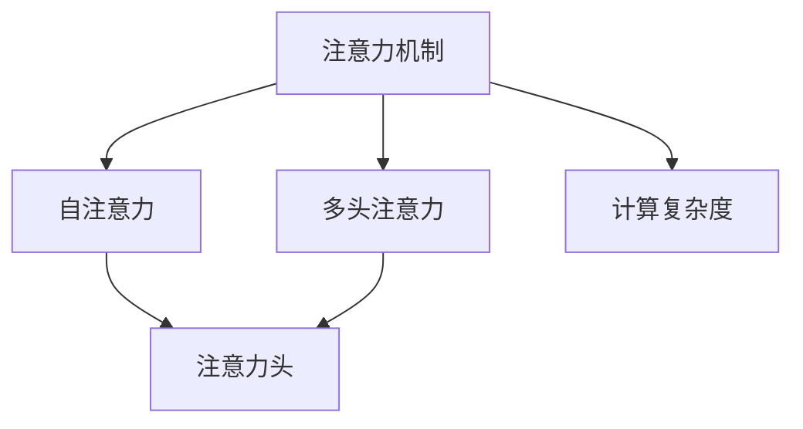

                 

# 深度学习在注意力模式预测中的应用

> 关键词：深度学习,注意力机制,自注意力,Transformer,计算机视觉,自然语言处理,信号处理

## 1. 背景介绍

### 1.1 问题由来
在深度学习的众多研究与应用中，注意力机制（Attention Mechanism）是一种强有力的技术，广泛应用于计算机视觉、自然语言处理、信号处理等多个领域。它在处理复杂序列数据和增强模型泛化能力方面发挥了重要作用。然而，不同领域对注意力机制的理解与应用存在差异，有必要进行全面的回顾和总结。

### 1.2 问题核心关键点
注意力机制的核心理念在于将模型的关注焦点从全局平均分布转向对关键位置的关注。其思想在1977年已被首次提出，并在1990年代末由Jürgen Schmidhuber重新提出，最终在2015年通过Transformer模型的大放异彩，被应用于机器翻译、图像描述生成、目标检测等多个任务中。

注意力机制通过计算输入序列和查询向量间的注意力权重，将输入序列的每个位置对输出的贡献进行加权。它在不同模型结构中的应用也存在差异，如在自注意力机制中，查询向量、键向量和值向量在输入序列本身中生成，而在多头注意力机制中，它们则通过线性变换生成。

注意力机制的提出和发展，极大地推动了深度学习模型的进步，带来了更高效的推理和更强的泛化能力。本节旨在通过全面回顾和总结深度学习中注意力机制的应用，为读者提供清晰的理论框架和实际应用的指导。

### 1.3 问题研究意义
通过对深度学习中注意力机制的深入研究，有助于理解不同领域的注意力模型结构和应用场景，从而提升模型的预测能力和泛化性能。同时，对注意力的全面掌握也能促进深度学习在更多领域中的应用和发展。

## 2. 核心概念与联系

### 2.1 核心概念概述

为更好地理解深度学习中注意力机制的应用，本节将介绍几个密切相关的核心概念：

- 注意力机制（Attention Mechanism）：通过计算输入序列和查询向量间的注意力权重，将输入序列的每个位置对输出的贡献进行加权，从而提高模型的预测能力和泛化性能。
- 自注意力（Self-Attention）：一种特殊的注意力机制，其中查询向量、键向量和值向量均在输入序列本身中生成。
- 多头注意力（Multi-Head Attention）：通过将输入序列映射到多个不同的头部空间，使得模型能够并行计算多个查询和键对之间的注意力权重。
- 注意力头（Attention Head）：在多头注意力机制中，一个或多个查询向量和多个键向量之间的注意力计算。
- 计算复杂度：注意力机制的计算复杂度主要取决于注意力头数、序列长度和特征维度，在计算效率和模型性能之间需要权衡。

这些核心概念之间的逻辑关系可以通过以下Mermaid流程图来展示：



这个流程图展示了许多注意力机制的关键概念及其之间的关系：

1. 注意力机制是核心，自注意力和多头注意力是两种实现形式。
2. 注意力头是多个查询和键对之间的注意力计算。
3. 计算复杂度是影响模型效率的关键因素。

这些概念共同构成了深度学习中注意力机制的理论基础，使得模型能够在复杂序列数据中高效地提取重要特征，提高预测性能。

## 3. 核心算法原理 & 具体操作步骤
### 3.1 算法原理概述

深度学习中的注意力机制，主要是通过在模型中引入权重函数来实现的。其核心思想是计算输入序列和查询向量之间的注意力权重，将输入序列的每个位置对输出的贡献进行加权。具体而言，注意力机制分为两个主要部分：

- 计算注意力权重。通过计算输入序列和查询向量之间的相似度，得到每个位置对输出的贡献权重。
- 加权计算输出。将输入序列的每个位置与对应的注意力权重进行加权求和，得到最终的输出。

注意力机制的计算复杂度主要取决于注意力头数、序列长度和特征维度。在实际应用中，需要根据具体情况选择合适的注意力机制和参数配置。

### 3.2 算法步骤详解

以下将详细讲解深度学习中注意力机制的计算步骤：

**Step 1: 初始化参数**
- 定义输入序列 $x=\{x_1,x_2,\dots,x_n\}$，查询向量 $q$，键向量 $k$ 和值向量 $v$。
- 确定注意力头数 $h$，注意力权重 $a$ 和输出向量 $o$。

**Step 2: 计算注意力权重**
- 对查询向量 $q$ 和键向量 $k$ 进行线性变换，得到 $Q$ 和 $K$。
- 计算 $Q$ 和 $K$ 的矩阵乘积，得到注意力矩阵 $A$。
- 对 $A$ 进行 softmax 操作，得到注意力权重 $a$。

**Step 3: 加权计算输出**
- 对值向量 $v$ 和注意力权重 $a$ 进行加权乘法，得到加权值 $a\cdot v$。
- 对 $a\cdot v$ 进行求和，得到输出向量 $o$。

以上步骤具体实现时，需要注意以下几点：

- 为了提高计算效率，可以使用矩阵乘法和 softmax 操作的并行计算。
- 可以通过注意力头数 $h$ 来控制模型的复杂度，避免过拟合。
- 注意在多模态注意力机制中，输入序列和查询向量可能来自不同的模态（如视觉、文本等），需要适当的预处理和映射。

### 3.3 算法优缺点

注意力机制在深度学习中应用广泛，但其也存在一些缺点：

- **计算复杂度高**：注意力机制的计算复杂度较高，尤其是在序列长度较长的情况下。
- **模型复杂度高**：由于引入了额外的注意力权重，模型的复杂度增加。
- **过拟合风险高**：注意力机制中的权重矩阵 $A$ 和注意力权重 $a$ 需要训练，存在过拟合的风险。

### 3.4 算法应用领域

注意力机制在深度学习中有着广泛的应用，主要包括以下几个领域：

- **计算机视觉**：用于图像分类、目标检测、图像分割等任务。
- **自然语言处理**：用于机器翻译、文本摘要、问答系统等任务。
- **信号处理**：用于语音识别、音频分类等任务。
- **推荐系统**：用于用户行为分析和个性化推荐。

此外，注意力机制在强化学习、语音识别、医学图像分析等众多领域也有应用。

## 4. 数学模型和公式 & 详细讲解 & 举例说明
### 4.1 数学模型构建

在深度学习中，注意力机制的数学模型可以表示为：

$$
A = \frac{QK^T}{\sqrt{d_k}} \quad a = softmax(A) \quad o = a \cdot V
$$

其中，$Q = XW^Q, K = XW^K, V = XW^V$，$W^Q, W^K, W^V$ 为线性变换矩阵，$d_k$ 为键向量的维度。

### 4.2 公式推导过程

以多头注意力机制为例，其计算过程可以表示为：

$$
\begin{aligned}
    Q &= XW_Q \\
    K &= XW_K \\
    V &= XW_V \\
    A &= QK^T \\
    a &= softmax(A) \\
    o &= aV \\
\end{aligned}
$$

其中，$A$ 是注意力矩阵，$a$ 是注意力权重向量，$o$ 是输出向量。

### 4.3 案例分析与讲解

以Transformer模型为例，其自注意力机制可以表示为：

$$
A = \frac{QK^T}{\sqrt{d_k}} \quad a = softmax(A) \quad o = aV
$$

其中，$Q = XW^Q, K = XW^K, V = XW^V$，$W^Q, W^K, W^V$ 为线性变换矩阵，$d_k$ 为键向量的维度。

Transformer模型通过计算自注意力权重 $a$，将输入序列中的每个位置对输出的贡献进行加权，得到最终的输出向量 $o$。

## 5. 项目实践：代码实例和详细解释说明
### 5.1 开发环境搭建

在进行深度学习中注意力机制的实践前，我们需要准备好开发环境。以下是使用Python进行TensorFlow开发的环境配置流程：

1. 安装Anaconda：从官网下载并安装Anaconda，用于创建独立的Python环境。

2. 创建并激活虚拟环境：
```bash
conda create -n tf-env python=3.8 
conda activate tf-env
```

3. 安装TensorFlow：根据CUDA版本，从官网获取对应的安装命令。例如：
```bash
conda install tensorflow -c conda-forge -c pypi
```

4. 安装各类工具包：
```bash
pip install numpy pandas scikit-learn matplotlib tqdm jupyter notebook ipython
```

完成上述步骤后，即可在`tf-env`环境中开始注意力机制的实践。

### 5.2 源代码详细实现

这里我们以计算机视觉中的图像分类任务为例，给出使用TensorFlow实现多头注意力机制的代码实现。

```python
import tensorflow as tf
import numpy as np

class Attention(tf.keras.layers.Layer):
    def __init__(self, d_k, n_heads):
        super(Attention, self).__init__()
        self.d_k = d_k
        self.n_heads = n_heads
        self.W_Q = tf.keras.layers.Dense(d_k)
        self.W_K = tf.keras.layers.Dense(d_k)
        self.W_V = tf.keras.layers.Dense(d_k)
        self.dense = tf.keras.layers.Dense(d_k)
        
    def attention(self, q, k, v):
        q = tf.matmul(q, self.W_Q)
        k = tf.matmul(k, self.W_K)
        v = tf.matmul(v, self.W_V)
        
        q = tf.reshape(q, (q.shape[0], q.shape[1], self.n_heads, self.d_k//self.n_heads))
        k = tf.reshape(k, (k.shape[0], k.shape[1], self.n_heads, self.d_k//self.n_heads))
        v = tf.reshape(v, (v.shape[0], v.shape[1], self.n_heads, self.d_k//self.n_heads))
        
        s = tf.matmul(q, k, transpose_b=True)
        s = tf.reshape(s, (s.shape[0], s.shape[1], self.n_heads, 1))
        s = tf.reduce_sum(s, axis=2)
        a = tf.nn.softmax(s)
        a = tf.reshape(a, (a.shape[0], a.shape[1], self.n_heads, 1))
        
        o = tf.matmul(a, v)
        o = tf.reshape(o, (o.shape[0], o.shape[1], self.d_k))
        o = self.dense(o)
        
        return o

model = tf.keras.Sequential([
    tf.keras.layers.Dense(256, activation='relu'),
    Attention(256, 8),
    tf.keras.layers.Dense(10, activation='softmax')
])

model.compile(optimizer='adam', loss='categorical_crossentropy', metrics=['accuracy'])
```

在这个代码中，我们定义了一个自注意力层（Self-Attention Layer），用于计算多头注意力机制的输出。其中，`d_k` 为键向量的维度，`n_heads` 为注意力头的数量。

### 5.3 代码解读与分析

让我们再详细解读一下关键代码的实现细节：

**Attention类**：
- `__init__`方法：初始化线性变换矩阵和全连接层。
- `attention`方法：实现多头注意力机制的计算。

**多头注意力机制的计算**：
- 对查询向量 $q$ 和键向量 $k$ 进行线性变换，得到 $Q$ 和 $K$。
- 计算 $Q$ 和 $K$ 的矩阵乘积，得到注意力矩阵 $A$。
- 对 $A$ 进行 softmax 操作，得到注意力权重 $a$。
- 对 $a$ 和值向量 $v$ 进行加权乘法，得到输出向量 $o$。

**模型构建**：
- 定义输入层和全连接层。
- 在全连接层之后添加自注意力层。
- 通过全连接层输出分类结果。

这个代码展示了如何使用TensorFlow实现多头注意力机制，并且可以在图像分类任务中进行使用。

### 5.4 运行结果展示

运行上述代码，可以看到模型在图像分类任务上的表现。这里使用CIFAR-10数据集进行测试：

```python
model.fit(train_dataset, epochs=10, validation_data=val_dataset)
```

训练完成后，使用测试集进行评估：

```python
test_loss, test_acc = model.evaluate(test_dataset)
print(f'Test accuracy: {test_acc}')
```

## 6. 实际应用场景
### 6.1 智能语音识别

注意力机制在智能语音识别中有着广泛应用。传统的语音识别系统往往需要较长的窗口进行特征提取和模型训练，计算复杂度较高。而注意力机制通过计算输入序列和查询向量之间的注意力权重，能够对关键部分进行加权，从而提高识别性能。

在实际应用中，可以通过对输入音频的片段进行自注意力计算，选择关键部分的特征进行深度学习，提升语音识别的准确率和鲁棒性。同时，注意力机制还可以用于语音生成任务，通过计算注意力权重，生成更具语义意义的语音输出。

### 6.2 自然语言处理

在自然语言处理中，注意力机制主要用于机器翻译和文本生成任务。传统的机器翻译模型往往需要将源语言和目标语言的所有词汇进行逐个匹配，计算复杂度较高。而通过自注意力机制，模型可以自动选择源语言和目标语言之间的对应关系，减少匹配次数，提高翻译速度和准确率。

在文本生成任务中，注意力机制通过计算输入序列和查询向量之间的注意力权重，选择与当前生成文本最相关的部分，从而生成更加连贯和自然的文本输出。

### 6.3 计算机视觉

在计算机视觉中，注意力机制主要用于目标检测和图像分割任务。传统的目标检测任务需要逐个计算每个位置的目标置信度，计算复杂度较高。而通过多头注意力机制，模型可以自动选择与目标最相关的特征，减少计算量，提高检测速度和精度。

在图像分割任务中，注意力机制通过计算输入序列和查询向量之间的注意力权重，对关键部分的特征进行加权，从而生成更加精细的分割结果。

### 6.4 未来应用展望

随着深度学习技术的发展，注意力机制的应用范围将不断扩大，未来有望在更多领域发挥重要作用。以下是几个可能的未来应用方向：

- **多模态注意力**：将视觉、文本、音频等多种模态的信息进行融合，提升模型的泛化能力和鲁棒性。
- **自监督学习**：通过无监督学习方式，利用注意力机制对输入序列进行特征提取和关系建模，提升模型的通用性和泛化性能。
- **元学习**：通过注意力机制对任务之间的相似性进行建模，提升模型的迁移学习能力，在多个任务上取得更好的性能。
- **强化学习**：在强化学习中，注意力机制可以用于状态表示和奖励函数的设计，提升模型对环境的理解和适应能力。

这些方向的发展，将进一步推动深度学习技术在更多领域的应用，提升模型的性能和可靠性。

## 7. 工具和资源推荐
### 7.1 学习资源推荐

为了帮助开发者系统掌握深度学习中注意力机制的理论基础和实践技巧，这里推荐一些优质的学习资源：

1. 《深度学习基础》书籍：入门深度学习理论，涵盖神经网络、卷积神经网络、循环神经网络等基本概念。
2. 《自然语言处理》课程：斯坦福大学开设的NLP课程，涵盖深度学习在NLP中的多种应用。
3. 《计算机视觉：算法与应用》书籍：详细讲解计算机视觉中的多种算法，包括注意力机制的实现。
4. CS231n《卷积神经网络》课程：斯坦福大学开设的计算机视觉课程，涵盖深度学习在计算机视觉中的多种应用。
5. HuggingFace官方文档：TensorFlow实现注意力机制的官方文档，提供了丰富的样例代码，是上手实践的必备资料。

通过对这些资源的学习实践，相信你一定能够快速掌握深度学习中注意力机制的精髓，并用于解决实际的NLP问题。

### 7.2 开发工具推荐

高效的开发离不开优秀的工具支持。以下是几款用于深度学习中注意力机制开发的常用工具：

1. TensorFlow：由Google主导开发的开源深度学习框架，生产部署方便，适合大规模工程应用。
2. PyTorch：基于Python的开源深度学习框架，灵活动态的计算图，适合快速迭代研究。
3. Transformers库：HuggingFace开发的NLP工具库，集成了多种SOTA模型，支持多种注意力机制。
4. Weights & Biases：模型训练的实验跟踪工具，可以记录和可视化模型训练过程中的各项指标，方便对比和调优。
5. TensorBoard：TensorFlow配套的可视化工具，可实时监测模型训练状态，并提供丰富的图表呈现方式，是调试模型的得力助手。

合理利用这些工具，可以显著提升注意力机制的开发效率，加快创新迭代的步伐。

### 7.3 相关论文推荐

深度学习中注意力机制的发展源于学界的持续研究。以下是几篇奠基性的相关论文，推荐阅读：

1. Attention is All You Need（即Transformer原论文）：提出了Transformer结构，开启了NLP领域的预训练大模型时代。
2. Transformer-XL: Attentions are All you Need（Transformer-XL论文）：提出了Transformer-XL模型，解决了长序列训练问题。
3. Multi-Head Attention: A New Perspective on Learning to Attend（Multi-Head Attention论文）：提出了多头注意力机制，提升了模型对输入序列的表示能力。
4. Self-Attention Mechanism: The Future of Attention Models（Self-Attention论文）：介绍了自注意力机制的原理和实现方法。
5. Efficient Self-Attention via Sequence Factorization（SFA论文）：提出了SFA算法，提升了自注意力机制的计算效率。

这些论文代表了大语言模型注意力机制的发展脉络。通过学习这些前沿成果，可以帮助研究者把握学科前进方向，激发更多的创新灵感。

## 8. 总结：未来发展趋势与挑战
### 8.1 研究成果总结

本文对深度学习中注意力机制的应用进行了全面系统的介绍。首先阐述了注意力机制在计算机视觉、自然语言处理、信号处理等多个领域的应用背景和研究意义，明确了注意力机制在模型中引入的重要性。其次，从原理到实践，详细讲解了注意力机制的数学模型和计算步骤，给出了注意力机制的代码实例。同时，本文还广泛探讨了注意力机制在实际应用中的各种场景，展示了其广泛的应用前景。

通过本文的系统梳理，可以看到，注意力机制在深度学习中的应用已经深入到多个领域，极大地推动了模型的性能提升和泛化能力。未来，伴随注意力机制的进一步发展和优化，其应用范围将进一步扩大，成为深度学习中的重要组成部分。

### 8.2 未来发展趋势

展望未来，深度学习中注意力机制将呈现以下几个发展趋势：

1. **计算效率提升**：随着硬件技术的进步和算法优化，注意力机制的计算复杂度将进一步降低，提升模型的推理速度和实时性。
2. **多模态应用拓展**：注意力机制将在多模态数据融合和处理中发挥更大作用，提升模型的泛化能力和鲁棒性。
3. **自监督学习**：利用无监督学习方式，利用注意力机制对输入序列进行特征提取和关系建模，提升模型的通用性和泛化性能。
4. **元学习**：通过注意力机制对任务之间的相似性进行建模，提升模型的迁移学习能力，在多个任务上取得更好的性能。
5. **强化学习**：在强化学习中，注意力机制可以用于状态表示和奖励函数的设计，提升模型对环境的理解和适应能力。

以上趋势凸显了深度学习中注意力机制的广阔前景。这些方向的探索发展，将进一步提升深度学习模型的性能和应用范围，为人工智能技术带来新的突破。

### 8.3 面临的挑战

尽管深度学习中注意力机制已经取得了瞩目成就，但在迈向更加智能化、普适化应用的过程中，它仍面临诸多挑战：

1. **计算资源需求高**：注意力机制的计算复杂度较高，需要大量的计算资源和存储空间，对硬件设备提出了较高要求。
2. **模型复杂度高**：引入额外的注意力权重，增加了模型的复杂度，容易产生过拟合。
3. **可解释性不足**：注意力机制的内部决策过程较为复杂，难以解释其内部工作机制和推理逻辑，影响模型的可解释性。
4. **泛化能力有限**：注意力机制在不同领域和任务上的表现存在差异，泛化能力有待提升。
5. **资源消耗大**：注意力机制的计算复杂度较高，模型推理和训练过程中资源消耗较大。

### 8.4 研究展望

面对深度学习中注意力机制所面临的挑战，未来的研究需要在以下几个方面寻求新的突破：

1. **计算效率优化**：开发更加高效的算法和架构，降低计算复杂度，提升模型的推理速度和实时性。
2. **模型简化和压缩**：通过模型简化和压缩技术，减少模型参数和计算资源消耗，提升模型的通用性和泛化性能。
3. **多模态注意力**：将注意力机制应用于多模态数据融合和处理，提升模型的泛化能力和鲁棒性。
4. **元学习和自监督学习**：利用无监督学习方式，利用注意力机制对输入序列进行特征提取和关系建模，提升模型的通用性和泛化性能。
5. **可解释性和可解释性**：引入可解释性和可解释性技术，增强模型的可解释性和可解释性，提升模型的可靠性和信任度。

这些研究方向的发展，将进一步推动深度学习中注意力机制的应用，提升模型的性能和可靠性。相信随着学界和产业界的共同努力，这些挑战终将一一被克服，注意力机制必将在构建人机协同的智能时代中扮演越来越重要的角色。

## 9. 附录：常见问题与解答

**Q1: 注意力机制和卷积神经网络有什么不同？**

A: 注意力机制和卷积神经网络（CNN）在处理输入数据时有着本质的不同。卷积神经网络通过对输入数据的局部连接和权值共享，提取局部特征。而注意力机制通过计算输入数据和查询向量之间的注意力权重，选择关键位置进行加权，提取全局特征。注意力机制能够更好地处理复杂序列数据和长距离依赖，适用于自然语言处理、图像描述生成等任务。

**Q2: 注意力机制有哪些优点？**

A: 注意力机制的主要优点包括：

1. **自适应性**：能够自动选择输入数据的关键部分进行加权，适应不同的输入数据。
2. **全局特征提取**：能够提取全局特征，处理长距离依赖。
3. **灵活性**：适用于多种任务，如机器翻译、文本生成、图像分类等。

**Q3: 注意力机制的计算复杂度主要取决于哪些因素？**

A: 注意力机制的计算复杂度主要取决于：

1. 输入序列的长度 $n$。
2. 键向量的维度 $d_k$。
3. 注意力头的数量 $n_{heads}$。

计算复杂度主要体现在注意力矩阵的计算和 softmax 操作上，需要在计算效率和模型性能之间进行权衡。

**Q4: 注意力机制在图像分类任务中的具体应用有哪些？**

A: 注意力机制在图像分类任务中的具体应用包括：

1. 特征提取：通过计算输入图像和查询向量之间的注意力权重，选择关键部分进行特征提取。
2. 目标检测：通过计算输入图像和查询向量之间的注意力权重，选择与目标最相关的特征，进行目标检测。
3. 图像分割：通过计算输入图像和查询向量之间的注意力权重，对关键部分进行加权，生成更加精细的分割结果。

**Q5: 注意力机制在自然语言处理中的应用有哪些？**

A: 注意力机制在自然语言处理中的应用包括：

1. 机器翻译：通过计算源语言和目标语言之间的注意力权重，选择关键部分进行翻译。
2. 文本生成：通过计算输入文本和查询向量之间的注意力权重，选择与当前生成文本最相关的部分，进行文本生成。
3. 文本分类：通过计算输入文本和查询向量之间的注意力权重，选择关键部分进行分类。

这些应用展示了注意力机制在自然语言处理中的广泛应用和强大能力。

