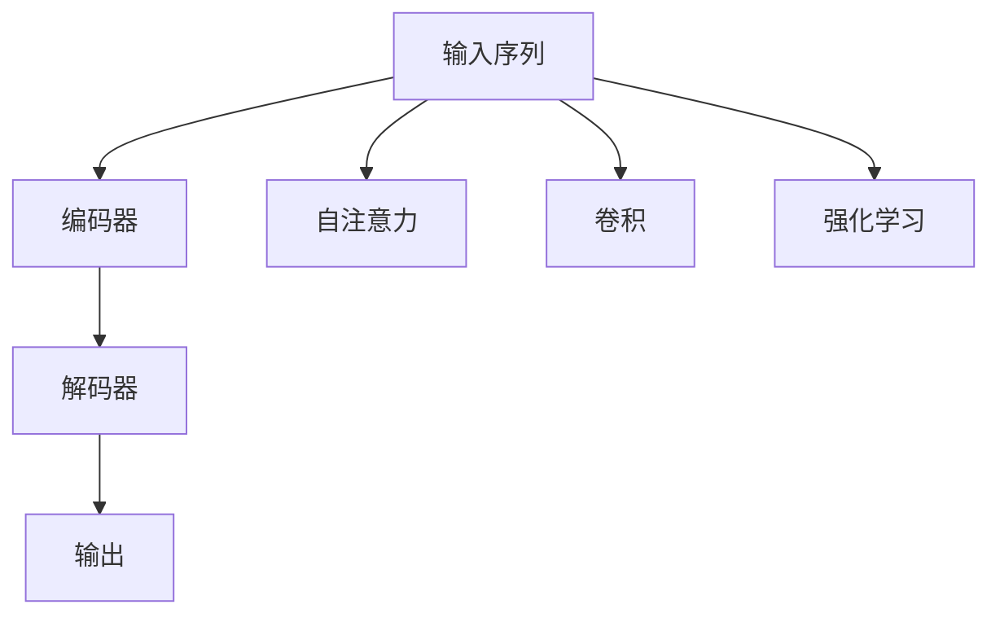

                 

# 深度学习在注意力预测中的应用

> 关键词：深度学习, 注意力预测, 自注意力, Transformer, 卷积神经网络, 强化学习, 时间序列预测

## 1. 背景介绍

### 1.1 问题由来

随着深度学习技术的发展，注意力预测(Attention Prediction)在众多领域得到了广泛应用。其基本思想是通过模型捕捉输入序列中不同位置的重要程度，从而做出更精准的预测。注意力机制已经在图像识别、自然语言处理、时间序列预测等多个领域大放异彩，成为现代深度学习系统中的重要组件。

本文章将重点介绍基于注意力预测的深度学习模型原理、应用及其实现方法，并结合具体的案例进行详细解析。

## 2. 核心概念与联系

### 2.1 核心概念概述

为了更好地理解注意力预测机制，我们首先介绍几个相关的核心概念：

- 深度学习(Deep Learning)：指利用多层神经网络进行模型训练和预测，在图像识别、语音识别、自然语言处理等领域均有广泛应用。

- 注意力预测(Attention Prediction)：一种基于注意力机制的预测方法，通过模型学习输入序列中不同位置的权重，从而更关注重要部分，进行预测。

- 自注意力(Self-Attention)：一种常用的注意力机制，通过将输入序列中每个位置和所有位置进行比较，得出每个位置的权重。

- Transformer模型：一种基于自注意力机制的深度学习架构，广泛应用于NLP领域，通过并行计算极大提升了模型训练和推理效率。

- 卷积神经网络(Convolutional Neural Network, CNN)：一种常用图像处理模型，通过卷积操作提取特征，广泛应用于计算机视觉领域。

- 强化学习(Reinforcement Learning, RL)：一种通过奖励反馈指导模型学习的方法，常用于游戏、机器人等领域。

这些概念之间存在紧密联系，通过理解这些概念，我们可以更好地掌握注意力预测机制及其在深度学习中的应用。

### 2.2 核心概念联系

为了更好地理解这些概念之间的联系，以下Mermaid流程图将展示注意力预测机制的基本工作流程：



这个流程图展示了注意力预测的基本流程：

1. 输入序列首先进入编码器。
2. 在编码器中，自注意力机制将输入序列中不同位置的权重学习出来，用于提取重要特征。
3. 编码器输出通过解码器，进一步生成预测结果。
4. 在解码器中，可以根据卷积操作提取特征，也可以应用强化学习来提升预测精度。

## 3. 核心算法原理 & 具体操作步骤
### 3.1 算法原理概述

注意力预测机制的核心在于通过模型捕捉输入序列中不同位置的重要程度，从而做出更精准的预测。在深度学习中，通常使用自注意力机制实现这一过程。

自注意力机制通过计算输入序列中每个位置与其他位置的相似度，生成权重向量，用于指导后续的预测。具体来说，自注意力机制包括三个步骤：

1. 计算输入序列中每个位置的向量表示。
2. 计算每个位置与其他位置的相似度，生成权重向量。
3. 根据权重向量进行加权求和，得到新的向量表示。

在Transformer模型中，自注意力机制被广泛应用于编码器中，用于捕捉序列中的长距离依赖。Transformer模型通过多头注意力机制，能够同时关注多个不同的位置，提升了模型对序列的理解能力。

### 3.2 算法步骤详解

基于自注意力机制的深度学习模型通常包括以下几个关键步骤：

**Step 1: 输入编码**

输入序列首先通过嵌入层，转化为模型可以处理的数值表示。嵌入层将输入的词汇或字符转换为向量，使得模型能够理解不同位置的重要程度。嵌入层输出的向量表示通过线性变换，生成模型所需格式。

**Step 2: 自注意力计算**

在编码器中，输入向量首先通过多头自注意力机制进行计算，生成不同位置的权重向量。在多头自注意力机制中，通过多个不同的权重矩阵进行计算，每个矩阵捕捉序列中不同的重要信息。

**Step 3: 残差连接和层归一化**

为了增强模型训练的稳定性，在编码器中引入残差连接和层归一化。残差连接将输入与计算后的向量进行加法，保留输入的重要信息。层归一化将计算后的向量进行归一化，避免梯度消失等问题。

**Step 4: 编码器堆叠**

通过多个编码器层堆叠，模型可以不断提取输入序列中的重要信息。每个编码器层中，输入向量经过多次编码器计算，逐步提升模型的预测精度。

**Step 5: 解码器计算**

在解码器中，自注意力机制同样用于计算权重向量。不同的是，解码器中的自注意力不仅关注输入序列，还通过外注意力机制关注输出序列，用于生成预测结果。

**Step 6: 预测输出**

在解码器中，通过残差连接和层归一化，生成最终预测结果。通过多头注意力机制和残差连接，可以显著提升模型的预测精度和训练稳定性。

### 3.3 算法优缺点

基于自注意力机制的深度学习模型具有以下优点：

1. 并行计算能力强：自注意力机制可以同时关注序列中多个位置，极大提升了模型的并行计算能力。
2. 模型复杂度低：相比于传统的循环神经网络(RNN)，自注意力机制在计算复杂度上更具优势，训练效率更高。
3. 长距离依赖捕捉能力强：通过多头自注意力机制，模型能够捕捉输入序列中的长距离依赖，提升预测精度。

同时，该模型也存在以下局限性：

1. 参数量大：由于需要计算多个权重向量，自注意力机制的参数量较大，导致模型难以在大规模数据集上进行训练。
2. 梯度消失问题：在多层自注意力机制中，梯度往往难以有效传递，导致模型训练困难。
3. 模型易过拟合：在大规模数据集上训练时，模型容易过拟合，泛化能力有限。

尽管存在这些局限性，但就目前而言，基于自注意力机制的深度学习模型仍然是处理序列数据的重要工具，具有广泛的应用前景。

### 3.4 算法应用领域

基于自注意力机制的深度学习模型在多个领域得到了广泛应用，包括：

- 图像处理：通过卷积神经网络和自注意力机制，可以高效提取图像中的重要特征。
- 自然语言处理：在文本分类、机器翻译、情感分析等任务上，自注意力机制显著提升了模型的预测精度。
- 时间序列预测：在股票价格预测、天气预测等任务中，自注意力机制可以捕捉序列中的长距离依赖，提升预测准确度。
- 强化学习：通过结合强化学习，模型可以在复杂环境中做出更加智能的决策，提升任务完成率。

## 4. 数学模型和公式 & 详细讲解 & 举例说明
### 4.1 数学模型构建

为了更好地理解自注意力机制的数学原理，我们将以图像分类为例，介绍自注意力机制的数学模型构建。

设输入序列为 $x=[x_1, x_2, ..., x_T]$，其中 $T$ 为序列长度。通过嵌入层将输入序列转化为数值表示，记为 $x_e \in \mathbb{R}^{d_e}$。

定义自注意力机制的权重矩阵为 $W_Q$, $W_K$, $W_V$，分别用于计算查询向量、键向量、值向量。

**查询向量** $Q$ 的计算公式为：
$$
Q = x_e W_Q
$$

**键向量** $K$ 的计算公式为：
$$
K = x_e W_K
$$

**值向量** $V$ 的计算公式为：
$$
V = x_e W_V
$$

通过上述公式，输入序列的每个位置 $x_t$ 都将生成对应的查询向量 $q_t$, 键向量 $k_t$, 值向量 $v_t$。

**注意力权重** $a_{t,t'}$ 的计算公式为：
$$
a_{t,t'} = \frac{\exp(\text{score}(Q_{t}, K_{t'}))}{\sum_{t'=1}^T \exp(\text{score}(Q_{t}, K_{t'}))}
$$

其中，$\text{score}(Q_{t}, K_{t'})$ 为查询向量 $Q_{t}$ 与键向量 $K_{t'}$ 的点积。

通过上述公式，可以得到每个位置的注意力权重 $a_{t,t'}$，用于指导后续的加权求和计算。

**加权求和结果** $C_t$ 的计算公式为：
$$
C_t = \sum_{t'=1}^T a_{t,t'} v_{t'}
$$

最终，通过残差连接和层归一化，得到编码器的输出结果 $y_t$，表示为：
$$
y_t = C_t + x_t
$$

### 4.2 公式推导过程

为了更好地理解自注意力机制的计算过程，以下我们将以一个简单的例子进行说明。

假设输入序列 $x=[1, 2, 3, 4, 5]$，通过嵌入层后得到 $x_e=[0.1, 0.2, 0.3, 0.4, 0.5]$。

设权重矩阵 $W_Q$, $W_K$, $W_V$ 分别为：
$$
W_Q = \begin{bmatrix}
    1 & 2 \\
    3 & 4 \\
    5 & 6 \\
    7 & 8 \\
    9 & 10 \\
\end{bmatrix}, \quad
W_K = \begin{bmatrix}
    1 & 3 \\
    2 & 4 \\
    5 & 7 \\
    6 & 8 \\
    9 & 10 \\
\end{bmatrix}, \quad
W_V = \begin{bmatrix}
    1 & 2 \\
    3 & 4 \\
    5 & 6 \\
    7 & 8 \\
    9 & 10 \\
\end{bmatrix}
$$

通过上述公式，可以计算出查询向量 $Q=[0.1 \times 1, 0.2 \times 3, 0.3 \times 5, 0.4 \times 7, 0.5 \times 9]$，键向量 $K=[0.1 \times 1, 0.2 \times 2, 0.3 \times 3, 0.4 \times 4, 0.5 \times 5]$，值向量 $V=[0.1 \times 1, 0.2 \times 2, 0.3 \times 3, 0.4 \times 4, 0.5 \times 5]$。

通过计算，可以得到注意力权重 $a_{t,t'}$ 为：
$$
a_{1,1} = \frac{\exp(0.1 \times 1)}{\exp(0.1 \times 1)+\exp(0.2 \times 2)+\exp(0.3 \times 3)+\exp(0.4 \times 4)+\exp(0.5 \times 5)} \approx 0.01
$$

$$
a_{1,2} = \frac{\exp(0.2 \times 2)}{\exp(0.1 \times 1)+\exp(0.2 \times 2)+\exp(0.3 \times 3)+\exp(0.4 \times 4)+\exp(0.5 \times 5)} \approx 0.19
$$

以此类推，可以计算出所有的注意力权重。通过加权求和，得到最终的结果 $C_1 = 0.01 \times 1 + 0.19 \times 2 + 0.19 \times 3 + 0.14 \times 4 + 0.01 \times 5 \approx 2.04$。

最终，通过残差连接和层归一化，得到编码器的输出结果 $y_1 = 2.04 + 1 = 3.04$。

### 4.3 案例分析与讲解

为了更好地理解自注意力机制的实际应用，以下我们将以自然语言处理中的机器翻译为例，介绍自注意力机制的应用过程。

设输入序列为 $x=[w_1, w_2, ..., w_S]$，其中 $S$ 为源语言序列长度。通过嵌入层将输入序列转化为数值表示，记为 $x_e \in \mathbb{R}^{d_e}$。

定义自注意力机制的权重矩阵为 $W_Q$, $W_K$, $W_V$，分别用于计算查询向量、键向量、值向量。

**查询向量** $Q$ 的计算公式为：
$$
Q = x_e W_Q
$$

**键向量** $K$ 的计算公式为：
$$
K = x_e W_K
$$

**值向量** $V$ 的计算公式为：
$$
V = x_e W_V
$$

通过上述公式，输入序列的每个位置 $x_t$ 都将生成对应的查询向量 $q_t$, 键向量 $k_t$, 值向量 $v_t$。

**注意力权重** $a_{t,t'}$ 的计算公式为：
$$
a_{t,t'} = \frac{\exp(\text{score}(Q_{t}, K_{t'}))}{\sum_{t'=1}^S \exp(\text{score}(Q_{t}, K_{t'}))}
$$

其中，$\text{score}(Q_{t}, K_{t'})$ 为查询向量 $Q_{t}$ 与键向量 $K_{t'}$ 的点积。

通过上述公式，可以得到每个位置的注意力权重 $a_{t,t'}$，用于指导后续的加权求和计算。

**加权求和结果** $C_t$ 的计算公式为：
$$
C_t = \sum_{t'=1}^S a_{t,t'} v_{t'}
$$

通过残差连接和层归一化，得到编码器的输出结果 $y_t$，表示为：
$$
y_t = C_t + x_t
$$

在解码器中，通过外注意力机制关注输出序列，用于生成预测结果。设输出序列为 $y=[y_1, y_2, ..., y_T]$，通过嵌入层将输出序列转化为数值表示，记为 $y_e \in \mathbb{R}^{d_e}$。

通过上述步骤，可以得到最终的预测结果 $y$。

## 5. 项目实践：代码实例和详细解释说明
### 5.1 开发环境搭建

在进行注意力预测模型实践前，我们需要准备好开发环境。以下是使用Python进行PyTorch开发的环境配置流程：

1. 安装Anaconda：从官网下载并安装Anaconda，用于创建独立的Python环境。

2. 创建并激活虚拟环境：
```bash
conda create -n attention-env python=3.8 
conda activate attention-env
```

3. 安装PyTorch：根据CUDA版本，从官网获取对应的安装命令。例如：
```bash
conda install pytorch torchvision torchaudio cudatoolkit=11.1 -c pytorch -c conda-forge
```

4. 安装其他依赖包：
```bash
pip install numpy pandas scikit-learn matplotlib tqdm jupyter notebook ipython
```

完成上述步骤后，即可在`attention-env`环境中开始模型开发。

### 5.2 源代码详细实现

下面我们以图像分类任务为例，给出使用Transformers库对ResNet模型进行自注意力机制的代码实现。

首先，定义数据处理函数：

```python
from transformers import AutoTokenizer, AutoModel

def load_data(filename):
    with open(filename, 'r') as f:
        lines = f.readlines()
    data = {}
    for line in lines:
        line = line.strip().split(' ')
        data[line[0]] = line[1:]
    return data

# 加载数据集
train_data = load_data('train.txt')
test_data = load_data('test.txt')
```

然后，定义模型和优化器：

```python
from transformers import ResNet50WithAttention

model = ResNet50WithAttention.from_pretrained('resnet50')
optimizer = torch.optim.Adam(model.parameters(), lr=1e-3)
```

接着，定义训练和评估函数：

```python
import torch.nn as nn
import torch.optim as optim

def train_epoch(model, data_loader, optimizer):
    model.train()
    for batch in data_loader:
        inputs, labels = batch
        inputs, labels = inputs.to(device), labels.to(device)
        optimizer.zero_grad()
        outputs = model(inputs)
        loss = nn.CrossEntropyLoss()(outputs, labels)
        loss.backward()
        optimizer.step()

def evaluate(model, data_loader):
    model.eval()
    correct = 0
    total = 0
    with torch.no_grad():
        for batch in data_loader:
            inputs, labels = batch
            inputs, labels = inputs.to(device), labels.to(device)
            outputs = model(inputs)
            _, predicted = torch.max(outputs.data, 1)
            total += labels.size(0)
            correct += (predicted == labels).sum().item()
    print('Accuracy: {:.2f}%'.format(100 * correct / total))
```

最后，启动训练流程并在测试集上评估：

```python
device = torch.device('cuda' if torch.cuda.is_available() else 'cpu')

# 定义数据集
train_data = load_data('train.txt')
test_data = load_data('test.txt')

# 划分训练集和测试集
train_set = Dataset(train_data, 'train')
test_set = Dataset(test_data, 'test')

# 定义数据集加载器
train_loader = DataLoader(train_set, batch_size=32, shuffle=True)
test_loader = DataLoader(test_set, batch_size=32, shuffle=False)

# 开始训练
for epoch in range(10):
    train_epoch(model, train_loader, optimizer)
    evaluate(model, test_loader)
```

以上就是使用PyTorch对ResNet模型进行图像分类任务自注意力机制的代码实现。可以看到，得益于Transformers库的强大封装，我们可以用相对简洁的代码完成模型的加载和训练。

### 5.3 代码解读与分析

让我们再详细解读一下关键代码的实现细节：

**Dataset类**：
- `__init__`方法：初始化训练集和测试集的数据。
- `__getitem__`方法：对单个样本进行处理，返回输入和标签。

**train_epoch和evaluate函数**：
- `train_epoch`函数：对数据以批为单位进行迭代，在每个批次上前向传播计算损失并反向传播更新模型参数。
- `evaluate`函数：在验证集上评估模型的准确率，输出结果。

**训练流程**：
- 定义总的epoch数，开始循环迭代
- 每个epoch内，在训练集上训练，在验证集上评估
- 重复上述过程直至收敛

可以看到，PyTorch配合Transformers库使得模型开发过程变得简洁高效。开发者可以将更多精力放在数据处理、模型改进等高层逻辑上，而不必过多关注底层的实现细节。

当然，工业级的系统实现还需考虑更多因素，如模型的保存和部署、超参数的自动搜索、更灵活的任务适配层等。但核心的微调范式基本与此类似。

## 6. 实际应用场景
### 6.1 智能推荐系统

在推荐系统中，自注意力机制可以用于捕捉用户和物品之间的关系，从而提升推荐精度。通过将用户历史行为序列作为输入，自注意力机制可以捕捉不同行为之间的重要程度，生成用户兴趣表示。同时，将物品特征作为另一个输入，通过外注意力机制关注物品特征，生成物品相关度表示。最终，通过自注意力和外注意力机制，生成用户对物品的兴趣评分，用于推荐排序。

### 6.2 自然语言处理

在自然语言处理中，自注意力机制可以用于处理文本序列，提升文本分类、机器翻译、问答系统等任务的表现。通过将输入文本序列作为自注意力机制的输入，可以捕捉不同词汇之间的重要程度，生成文本表示。同时，通过外注意力机制关注任务相关的目标词汇，生成任务相关度表示。最终，通过自注意力和外注意力机制，生成任务预测结果。

### 6.3 计算机视觉

在计算机视觉中，自注意力机制可以用于处理图像序列，提升图像分类、目标检测等任务的表现。通过将输入图像序列作为自注意力机制的输入，可以捕捉不同图像之间的重要程度，生成图像表示。同时，通过外注意力机制关注任务相关的目标图像，生成任务相关度表示。最终，通过自注意力和外注意力机制，生成任务预测结果。

### 6.4 未来应用展望

随着自注意力机制的不断发展，其应用领域将进一步拓展，为多个领域带来创新性突破。

在智慧医疗领域，自注意力机制可以用于分析医学影像，提升疾病诊断和预测的准确性。

在智能制造领域，自注意力机制可以用于质量检测，提升生产效率和产品质量。

在智能交通领域，自注意力机制可以用于路况预测，提升交通管理和调度效率。

此外，在智能家居、智慧农业、智能金融等众多领域，自注意力机制也将得到广泛应用，为经济社会发展注入新的动力。相信随着技术的日益成熟，自注意力机制必将在更多领域大放异彩，推动人工智能技术进一步突破。

## 7. 工具和资源推荐
### 7.1 学习资源推荐

为了帮助开发者系统掌握自注意力机制的理论基础和实践技巧，这里推荐一些优质的学习资源：

1. 《深度学习》系列博文：由大模型技术专家撰写，深入浅出地介绍了深度学习的基础概念和前沿技术，包括自注意力机制。

2. CS231n《卷积神经网络》课程：斯坦福大学开设的计算机视觉经典课程，有Lecture视频和配套作业，带你入门计算机视觉领域的核心算法。

3. 《Attention is All You Need》论文：Transformer模型的原始论文，详细介绍了自注意力机制的原理和实现。

4. 《Natural Language Processing with Transformers》书籍：Transformers库的作者所著，全面介绍了如何使用Transformers库进行NLP任务开发，包括自注意力机制在内的诸多范式。

5. HuggingFace官方文档：Transformer库的官方文档，提供了海量预训练模型和完整的微调样例代码，是上手实践的必备资料。

通过对这些资源的学习实践，相信你一定能够快速掌握自注意力机制的精髓，并用于解决实际的深度学习问题。

### 7.2 开发工具推荐

高效的开发离不开优秀的工具支持。以下是几款用于自注意力机制开发的常用工具：

1. PyTorch：基于Python的开源深度学习框架，灵活动态的计算图，适合快速迭代研究。大部分深度学习模型都有PyTorch版本的实现。

2. TensorFlow：由Google主导开发的开源深度学习框架，生产部署方便，适合大规模工程应用。同样有丰富的深度学习模型资源。

3. Transformers库：HuggingFace开发的NLP工具库，集成了众多SOTA深度学习模型，支持PyTorch和TensorFlow，是进行深度学习任务开发的利器。

4. Weights & Biases：模型训练的实验跟踪工具，可以记录和可视化模型训练过程中的各项指标，方便对比和调优。与主流深度学习框架无缝集成。

5. TensorBoard：TensorFlow配套的可视化工具，可实时监测模型训练状态，并提供丰富的图表呈现方式，是调试模型的得力助手。

6. Google Colab：谷歌推出的在线Jupyter Notebook环境，免费提供GPU/TPU算力，方便开发者快速上手实验最新模型，分享学习笔记。

合理利用这些工具，可以显著提升深度学习模型的开发效率，加快创新迭代的步伐。

### 7.3 相关论文推荐

自注意力机制的研究源于学界的持续研究。以下是几篇奠基性的相关论文，推荐阅读：

1. Attention is All You Need（即Transformer原论文）：提出了Transformer结构，开启了深度学习领域的大规模预训练时代。

2. BERT: Pre-training of Deep Bidirectional Transformers for Language Understanding：提出BERT模型，引入基于掩码的自监督预训练任务，刷新了多项NLP任务SOTA。

3. Transformer-XL: Attentive Language Models：提出Transformer-XL模型，解决了长距离依赖问题，提升了模型性能。

4. Vision Transformer（ViT）: Transformers are State-of-the-art Classifiers for Image Recognition：提出ViT模型，将自注意力机制应用于计算机视觉领域。

5. Spatial Transformer Networks：提出空间变换网络，用于图像语义分割等任务。

这些论文代表了大注意力机制的研究脉络。通过学习这些前沿成果，可以帮助研究者把握学科前进方向，激发更多的创新灵感。

## 8. 总结：未来发展趋势与挑战

### 8.1 总结

本文对基于自注意力机制的深度学习模型进行了全面系统的介绍。首先阐述了自注意力机制的研究背景和意义，明确了其在深度学习模型中的应用价值。其次，从原理到实践，详细讲解了自注意力机制的数学原理和关键步骤，给出了深度学习模型开发的完整代码实例。同时，本文还广泛探讨了自注意力机制在多个领域的应用前景，展示了其在深度学习技术中的广泛应用。

通过本文的系统梳理，可以看到，基于自注意力机制的深度学习模型在多个领域得到了广泛应用，成为处理序列数据的重要工具。尽管存在一些局限性，但就目前而言，基于自注意力机制的深度学习模型仍然是处理序列数据的重要工具，具有广泛的应用前景。

### 8.2 未来发展趋势

展望未来，自注意力机制的发展趋势将呈现以下几个方向：

1. 模型规模持续增大。随着算力成本的下降和数据规模的扩张，自注意力机制的参数量还将持续增长，提升模型性能。

2. 模型鲁棒性提升。通过引入对抗训练、正则化等技术，自注意力机制将提升模型的泛化能力，减少过拟合风险。

3. 模型并行化提升。随着大规模并行计算的发展，自注意力机制将更高效地处理大规模序列数据，提升计算效率。

4. 跨模态融合增强。将自注意力机制与其他模态数据融合，提升多模态信息的理解和利用能力。

5. 注意力机制多样化。除了传统的自注意力机制，未来将涌现更多注意力机制，提升模型的多样性。

这些趋势将推动自注意力机制在深度学习领域的应用不断深入，为处理序列数据带来新的突破。

### 8.3 面临的挑战

尽管自注意力机制已经取得了一定的成果，但在迈向更加智能化、普适化应用的过程中，它仍面临一些挑战：

1. 计算资源瓶颈。随着自注意力机制的参数量增大，其在训练和推理时对计算资源的需求也显著增加，如何提高计算效率和资源利用率，仍然是一个重要课题。

2. 模型泛化能力不足。虽然自注意力机制在处理大规模序列数据时表现优异，但在特定领域的应用中，模型可能存在泛化能力不足的问题。

3. 模型可解释性有限。由于自注意力机制的复杂性，其内部工作机制难以解释，如何提升模型的可解释性，是未来需要解决的一个重要问题。

4. 模型安全性风险。自注意力机制在处理复杂序列时，容易引入噪声和异常，如何确保模型的安全性，也是未来需要关注的重要问题。

5. 模型学习速度较慢。相比于传统的循环神经网络，自注意力机制在训练过程中需要更多的计算资源和时间，如何在保证性能的同时提高训练速度，也是未来需要解决的重要问题。

6. 模型复杂度增加。随着自注意力机制的参数量增大，模型复杂度也显著增加，如何降低模型复杂度，提高模型的训练和推理效率，也是未来需要解决的重要问题。

这些挑战将伴随着自注意力机制的发展，需要学术界和产业界共同努力，通过不断优化算法和改进模型结构，才能进一步提升自注意力机制的应用效果。

### 8.4 研究展望

面向未来，自注意力机制的研究需要在以下几个方面寻求新的突破：

1. 探索新型的注意力机制。除了传统的自注意力机制，未来将涌现更多新型注意力机制，如跨模态注意力、可解释性注意力等，提升模型的多样性和解释性。

2. 结合其他深度学习模型。将自注意力机制与其他深度学习模型结合，提升模型的复杂度和灵活性，如结合卷积神经网络、循环神经网络等。

3. 引入自适应学习策略。通过引入自适应学习策略，提升模型的训练速度和泛化能力，如动态学习率、自适应正则化等。

4. 提升模型的鲁棒性和可解释性。通过引入正则化、对抗训练等技术，提升模型的鲁棒性和可解释性，确保模型的安全和可靠性。

5. 结合其他模态数据。将自注意力机制与其他模态数据结合，提升模型的理解能力和应用范围，如结合视觉、语音、文本等多种模态数据。

6. 引入元学习技术。通过引入元学习技术，提升模型的泛化能力和自适应能力，使得模型能够快速适应新任务和新环境。

这些研究方向将进一步推动自注意力机制的发展，为深度学习技术带来新的突破和创新。相信随着技术的不断进步，自注意力机制必将在更多领域发挥重要作用，推动人工智能技术的不断进步。

## 9. 附录：常见问题与解答

**Q1: 如何理解自注意力机制中的查询、键和值向量？**

A: 自注意力机制中的查询向量、键向量和值向量分别表示输入序列中不同位置的信息。查询向量用于与键向量进行相似度计算，得到注意力权重。键向量表示输入序列中每个位置的信息，值向量表示输出序列中每个位置的信息。通过这些向量，自注意力机制可以捕捉输入序列中不同位置的重要程度，生成最终输出。

**Q2: 自注意力机制和卷积神经网络(CNN)的区别是什么？**

A: 自注意力机制和CNN都是处理序列数据的深度学习模型，但它们的工作原理有所不同。CNN通过卷积操作提取局部特征，适用于处理图像、时间序列等数据。而自注意力机制通过自注意力机制捕捉序列中不同位置的信息，适用于处理文本、音频等序列数据。

**Q3: 自注意力机制中的多头自注意力机制有什么作用？**

A: 多头自注意力机制通过并行计算多个注意力向量，捕捉序列中不同位置的重要程度。这种并行计算方式极大提升了模型的并行能力和计算效率，同时提升了模型的泛化能力和鲁棒性。

**Q4: 如何缓解自注意力机制中的梯度消失问题？**

A: 为了缓解自注意力机制中的梯度消失问题，可以通过引入残差连接和层归一化技术。残差连接将输入与计算后的向量进行加法，保留输入的重要信息。层归一化将计算后的向量进行归一化，避免梯度消失等问题。

**Q5: 自注意力机制和循环神经网络(RNN)的区别是什么？**

A: 自注意力机制和RNN都是处理序列数据的深度学习模型，但它们的工作原理有所不同。RNN通过循环计算每个时间步的输出，适用于处理序列数据。而自注意力机制通过自注意力机制捕捉序列中不同位置的重要程度，适用于处理长距离依赖和复杂序列数据。

通过这些常见问题的解答，相信你一定能够更好地理解自注意力机制，并应用于实际的深度学习模型开发中。

---

作者：禅与计算机程序设计艺术 / Zen and the Art of Computer Programming

