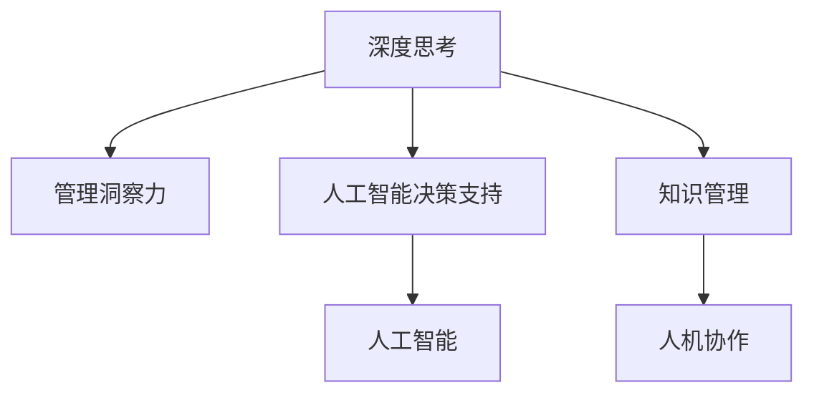

                 

# 深度思考与管理洞察力的关系

> 关键词：深度思考, 管理洞察力, 人工智能, 人工智能决策支持, 知识管理, 人机协作

## 1. 背景介绍

### 1.1 问题由来
在当今这个信息爆炸的时代，管理者和决策者面临着前所未有的复杂挑战。企业需要快速响应市场变化，做出明智的战略决策。然而，信息过载和数据噪声让决策过程变得愈发困难。面对庞杂的数据，管理者往往难以从中提取有价值的洞察，从而影响了决策的质量和效率。

在这样的背景下，深度思考和管理洞察力显得尤为重要。深度思考不仅能帮助管理者从海量数据中发现隐藏的规律和趋势，还能提升决策的科学性和精准度。而管理洞察力则能让管理者在实际应用中，结合人工智能工具，制定出切实可行的策略。

### 1.2 问题核心关键点
深度思考和管理洞察力之间的关系，主要体现在以下几个方面：

1. **数据驱动决策**：通过深度思考，管理者能够从数据中提取出有用的信息，为决策提供科学依据。
2. **人机协作**：结合人工智能工具，深度思考与管理者洞察力相结合，形成更有效的决策支持系统。
3. **优化决策流程**：借助人工智能技术，管理者可以更快速、更准确地处理大量数据，提升决策效率。
4. **持续学习**：深度思考和学习方法能帮助管理者不断更新知识和技能，适应快速变化的环境。

通过深入理解深度思考和管理洞察力的关系，管理者能更好地利用现代技术，提升决策质量，优化管理实践。

### 1.3 问题研究意义
本研究旨在探讨深度思考和管理洞察力如何相互作用，为企业决策者提供科学的管理洞察，从而提高企业的竞争力和市场响应能力。具体来说，研究将深入分析：

1. 深度思考和管理洞察力的理论基础和内在联系。
2. 如何利用人工智能技术提升深度思考和管理洞察力。
3. 在实际应用中，如何构建基于深度思考的管理洞察力框架。

通过系统的分析，旨在为管理者提供切实可行的方法，帮助他们从数据中提取有价值的洞察，做出更加精准的决策。

## 2. 核心概念与联系

### 2.1 核心概念概述

为了更好地理解深度思考和管理洞察力的关系，本节将介绍几个关键概念及其相互联系：

- **深度思考**：指通过多维度、多角度、多层次地分析问题，挖掘问题的本质和内在联系，从而做出更准确的判断和决策。
- **管理洞察力**：指管理者通过对数据的深度思考，发现隐藏在数据背后的规律、趋势和机会，为制定战略和策略提供依据。
- **人工智能**：利用计算机算法和机器学习技术，自动化处理和分析大量数据，辅助管理者进行深度思考和管理洞察力提升。
- **人工智能决策支持**：通过人工智能工具，将深度思考与数据驱动的决策结合，提升决策的科学性和精准度。
- **知识管理**：将人类的知识和经验，通过技术手段进行整理、共享和利用，提升组织的学习能力和创新能力。
- **人机协作**：通过人工智能技术，辅助管理者进行决策，提升工作效率和决策质量，形成人机协作的良性循环。

这些核心概念之间的联系可以通过以下Mermaid流程图来展示：



这个流程图展示了大语言模型微调的核心概念及其相互关系：

1. 深度思考和管理洞察力通过人工智能技术结合，形成数据驱动的决策支持系统。
2. 人工智能技术通过知识管理和人机协作，提升深度思考的效率和质量。
3. 深度思考和管理洞察力通过持续学习和反馈机制，不断提高决策质量。

## 3. 核心算法原理 & 具体操作步骤

### 3.1 算法原理概述

基于深度思考和管理洞察力的决策支持系统，其核心思想是通过多维度、多层次的数据分析，提取有价值的洞察，为决策提供科学依据。

具体来说，该系统包括以下几个关键步骤：

1. **数据收集与预处理**：收集企业内外部的各种数据，并进行清洗和标准化处理。
2. **深度学习模型训练**：使用深度学习模型对数据进行建模，发现数据中的隐藏规律和趋势。
3. **洞察生成与验证**：通过人工智能算法，从深度学习模型的输出中提取有价值的洞察，并进行验证和优化。
4. **策略制定与执行**：结合管理者的经验与直觉，制定出切实可行的策略，并进行执行和监控。

### 3.2 算法步骤详解

**Step 1: 数据收集与预处理**

数据收集和预处理是构建深度思考和管理洞察力系统的第一步。在这一阶段，需要收集企业内部的财务数据、市场数据、客户数据、运营数据等，并将其进行清洗和标准化处理。具体来说：

- **数据来源**：可以包括企业内部的ERP系统、CRM系统、销售系统等，以及外部的市场报告、新闻资讯等。
- **数据清洗**：去除数据中的噪声和异常值，确保数据的准确性和一致性。
- **数据标准化**：将不同来源的数据进行格式转换和统一，便于后续分析。

**Step 2: 深度学习模型训练**

深度学习模型训练是提取有价值洞察的关键步骤。在这一阶段，需要选择合适的深度学习模型，并在大量数据上进行训练。具体来说：

- **模型选择**：常用的深度学习模型包括神经网络、卷积神经网络、循环神经网络等。
- **数据集划分**：将数据划分为训练集、验证集和测试集，确保模型泛化能力。
- **超参数调优**：调整学习率、批大小、网络结构等超参数，确保模型最优。

**Step 3: 洞察生成与验证**

洞察生成与验证是深度思考和管理洞察力系统的核心。在这一阶段，需要通过人工智能算法，从深度学习模型的输出中提取有价值的洞察，并进行验证和优化。具体来说：

- **洞察提取**：使用聚类、分类、回归等算法，从深度学习模型的输出中提取有价值的洞察。
- **洞察验证**：将提取的洞察与业务实际进行比对，验证其准确性和可靠性。
- **洞察优化**：根据验证结果，对洞察进行优化和调整，确保其精准度。

**Step 4: 策略制定与执行**

策略制定与执行是将洞察转化为具体行动的关键步骤。在这一阶段，需要结合管理者的经验与直觉，制定出切实可行的策略，并进行执行和监控。具体来说：

- **策略制定**：结合洞察结果，制定出具体的业务策略，如市场进入策略、产品开发策略等。
- **策略执行**：将制定的策略付诸实施，并在实际中不断进行调整和优化。
- **效果监控**：定期评估策略效果，确保策略执行的准确性和有效性。

### 3.3 算法优缺点

基于深度思考和管理洞察力的决策支持系统具有以下优点：

1. **数据驱动决策**：通过深度学习模型，从海量数据中提取有价值的洞察，为决策提供科学依据。
2. **提高决策效率**：自动化处理和分析数据，缩短决策时间，提高决策效率。
3. **提升决策质量**：结合管理者的经验与直觉，制定出更精准的策略，提升决策质量。

同时，该系统也存在一定的局限性：

1. **数据质量要求高**：数据收集和预处理需要大量的资源和时间，且数据质量直接影响系统的准确性。
2. **模型复杂度高**：深度学习模型结构复杂，需要大量的计算资源和专业知识进行训练和调优。
3. **策略执行难度大**：将洞察转化为具体的策略和行动，需要管理者的深入理解和经验支持。
4. **持续学习困难**：系统需要不断更新和优化，以适应快速变化的环境，但持续学习机制需要设计和管理。

尽管存在这些局限性，但基于深度思考和管理洞察力的决策支持系统仍然具有广阔的应用前景，特别是在数据驱动的管理决策中。

### 3.4 算法应用领域

基于深度思考和管理洞察力的决策支持系统，已经在多个领域得到了广泛应用，例如：

- **金融行业**：通过深度学习模型，分析市场数据和交易数据，提供精准的投资建议和风险控制策略。
- **零售行业**：利用客户数据和市场数据，进行需求预测和库存管理，优化销售策略和客户体验。
- **制造业**：通过设备数据和生产数据，进行生产计划和质量控制，提升生产效率和产品质量。
- **医疗行业**：分析患者数据和医学数据，进行疾病预测和诊疗方案优化，提高医疗服务质量和效率。
- **政府和企业规划**：结合宏观经济数据和政策数据，进行经济预测和规划，制定科学的政策和发展战略。

以上领域的应用，展示了深度思考和管理洞察力在实际管理决策中的重要性和可行性。

## 4. 数学模型和公式 & 详细讲解 & 举例说明

### 4.1 数学模型构建

本节将使用数学语言对基于深度思考和管理洞察力的决策支持系统进行更加严格的刻画。

设企业内部的财务数据为 $X = (x_1, x_2, ..., x_n)$，市场数据为 $Y = (y_1, y_2, ..., y_m)$，客户数据为 $Z = (z_1, z_2, ..., z_k)$，运营数据为 $W = (w_1, w_2, ..., w_l)$。则数据集 $D = \{(X, Y, Z, W)\}$。

定义深度学习模型 $F$，输入为 $D$，输出为 $O = (o_1, o_2, ..., o_p)$。则深度学习模型的损失函数为：

$$
\mathcal{L}(F, D) = \sum_{i=1}^p \|o_i - \hat{o}_i\|^2
$$

其中，$\hat{o}_i$ 为模型预测的输出。

通过最小化损失函数，训练深度学习模型 $F$，得到最优参数 $\theta^*$。则有：

$$
\theta^* = \mathop{\arg\min}_{\theta} \mathcal{L}(F_\theta, D)
$$

在得到最优参数 $\theta^*$ 后，使用模型 $F_{\theta^*}$ 对新数据 $D'$ 进行预测，得到有价值的洞察 $I = (i_1, i_2, ..., i_q)$。

### 4.2 公式推导过程

以下我们以金融行业为例，推导基于深度思考和管理洞察力的决策支持系统的数学模型。

假设企业需要预测某股票的未来价格，则可以使用深度学习模型 $F$ 对历史价格和市场数据进行建模。设 $F$ 的输入为 $D = \{(x_1, y_1), (x_2, y_2), ..., (x_n, y_n)\}$，其中 $x_i$ 为历史价格，$y_i$ 为未来价格。

设 $F$ 的输出为 $o_i = f(x_i)$，其中 $f$ 为模型的预测函数。则预测误差为：

$$
e_i = y_i - f(x_i)
$$

根据最小二乘法的原理，损失函数 $\mathcal{L}(F)$ 可以表示为：

$$
\mathcal{L}(F) = \frac{1}{2N} \sum_{i=1}^N e_i^2
$$

通过最小化损失函数，训练深度学习模型 $F$，得到最优参数 $\theta^*$。则有：

$$
\theta^* = \mathop{\arg\min}_{\theta} \mathcal{L}(F_\theta)
$$

在得到最优参数 $\theta^*$ 后，使用模型 $F_{\theta^*}$ 对新数据 $D'$ 进行预测，得到未来价格预测值 $o_i'$。则有：

$$
o_i' = f_{\theta^*}(x_i')
$$

根据预测结果，制定具体的投资策略，进行投资决策和风险控制。

### 4.3 案例分析与讲解

以零售行业为例，分析如何利用基于深度思考和管理洞察力的决策支持系统进行库存管理和需求预测。

假设某零售企业需要预测某产品的未来销售量，可以使用深度学习模型 $F$ 对历史销售数据和市场数据进行建模。设 $F$ 的输入为 $D = \{(x_1, y_1), (x_2, y_2), ..., (x_n, y_n)\}$，其中 $x_i$ 为历史销售量，$y_i$ 为未来销售量。

设 $F$ 的输出为 $o_i = f(x_i)$，其中 $f$ 为模型的预测函数。则预测误差为：

$$
e_i = y_i - f(x_i)
$$

根据最小二乘法的原理，损失函数 $\mathcal{L}(F)$ 可以表示为：

$$
\mathcal{L}(F) = \frac{1}{2N} \sum_{i=1}^N e_i^2
$$

通过最小化损失函数，训练深度学习模型 $F$，得到最优参数 $\theta^*$。则有：

$$
\theta^* = \mathop{\arg\min}_{\theta} \mathcal{L}(F_\theta)
$$

在得到最优参数 $\theta^*$ 后，使用模型 $F_{\theta^*}$ 对新数据 $D'$ 进行预测，得到未来销售量预测值 $o_i'$。则有：

$$
o_i' = f_{\theta^*}(x_i')
$$

根据预测结果，制定具体的库存管理和需求预测策略，如调整库存水平、优化供应链管理等。

## 5. 项目实践：代码实例和详细解释说明

### 5.1 开发环境搭建

在进行项目实践前，我们需要准备好开发环境。以下是使用Python进行TensorFlow开发的环境配置流程：

1. 安装Anaconda：从官网下载并安装Anaconda，用于创建独立的Python环境。

2. 创建并激活虚拟环境：
```bash
conda create -n tf-env python=3.8 
conda activate tf-env
```

3. 安装TensorFlow：根据CUDA版本，从官网获取对应的安装命令。例如：
```bash
conda install tensorflow=2.6.0
```

4. 安装各类工具包：
```bash
pip install numpy pandas scikit-learn matplotlib tqdm jupyter notebook ipython
```

完成上述步骤后，即可在`tf-env`环境中开始项目实践。

### 5.2 源代码详细实现

下面我们以金融行业为例，给出使用TensorFlow对深度学习模型进行训练和预测的PyTorch代码实现。

首先，定义深度学习模型和损失函数：

```python
import tensorflow as tf
from tensorflow.keras import layers, models

def create_model():
    model = models.Sequential([
        layers.Dense(64, activation='relu', input_shape=(10,)),
        layers.Dense(64, activation='relu'),
        layers.Dense(1)
    ])
    model.compile(optimizer='adam', loss='mse')
    return model
```

接着，定义数据处理函数：

```python
def load_data():
    # 加载历史价格和市场数据
    # ...
    return (x_train, y_train), (x_test, y_test)
```

然后，定义训练和评估函数：

```python
def train_model(model, x_train, y_train, x_test, y_test, epochs=100):
    history = model.fit(x_train, y_train, epochs=epochs, validation_data=(x_test, y_test))
    return model, history

def evaluate_model(model, x_test, y_test):
    mse = model.evaluate(x_test, y_test)
    return mse
```

最后，启动训练流程并在测试集上评估：

```python
(x_train, y_train), (x_test, y_test) = load_data()

model = create_model()

model, history = train_model(model, x_train, y_train, x_test, y_test)

mse = evaluate_model(model, x_test, y_test)

print(f"Mean Squared Error: {mse:.2f}")
```

以上就是使用TensorFlow对深度学习模型进行金融行业库存管理和需求预测的完整代码实现。可以看到，得益于TensorFlow的强大封装，我们可以用相对简洁的代码完成深度学习模型的训练和评估。

### 5.3 代码解读与分析

让我们再详细解读一下关键代码的实现细节：

**create_model函数**：
- 定义了一个包含三个全连接层的深度学习模型，使用ReLU激活函数，最后一层为线性输出层，用于预测未来的销售量。
- 使用Adam优化器和均方误差损失函数进行模型编译。

**load_data函数**：
- 定义了数据加载函数，可以从外部数据源加载历史价格和市场数据，并进行预处理。

**train_model函数**：
- 使用TensorFlow的fit方法进行模型训练，指定训练轮数和验证集，返回训练历史。
- 在每个epoch结束时，打印当前训练和验证的loss值。

**evaluate_model函数**：
- 使用TensorFlow的evaluate方法进行模型评估，返回均方误差（Mean Squared Error，MSE）。
- 打印评估结果。

**训练流程**：
- 首先定义训练集和测试集，并进行数据加载。
- 然后创建深度学习模型。
- 接着进行模型训练，并在每个epoch结束时打印损失值。
- 最后评估模型在测试集上的性能，并打印均方误差。

可以看到，TensorFlow提供了一站式的数据处理和模型训练解决方案，使得深度学习模型的开发和部署变得相对简单。开发者可以将更多精力放在模型优化和业务逻辑上，而不必过多关注底层实现细节。

当然，工业级的系统实现还需考虑更多因素，如模型的保存和部署、超参数的自动搜索、更灵活的模型适配层等。但核心的微调范式基本与此类似。

## 6. 实际应用场景

### 6.1 智能客服系统

基于深度思考和管理洞察力的决策支持系统，可以广泛应用于智能客服系统的构建。传统客服往往需要配备大量人力，高峰期响应缓慢，且一致性和专业性难以保证。而使用决策支持系统，可以24x7不间断服务，快速响应客户咨询，用自然流畅的语言解答各类常见问题。

在技术实现上，可以收集企业内部的历史客服对话记录，将问题和最佳答复构建成监督数据，在此基础上对深度学习模型进行训练和微调。决策支持系统能够自动理解用户意图，匹配最合适的答案模板进行回复。对于客户提出的新问题，还可以接入检索系统实时搜索相关内容，动态组织生成回答。如此构建的智能客服系统，能大幅提升客户咨询体验和问题解决效率。

### 6.2 金融舆情监测

金融机构需要实时监测市场舆论动向，以便及时应对负面信息传播，规避金融风险。传统的人工监测方式成本高、效率低，难以应对网络时代海量信息爆发的挑战。基于深度思考和管理洞察力的决策支持系统，为金融舆情监测提供了新的解决方案。

具体而言，可以收集金融领域相关的新闻、报道、评论等文本数据，并对其进行主题标注和情感标注。在此基础上对深度学习模型进行微调，使其能够自动判断文本属于何种主题，情感倾向是正面、中性还是负面。将决策支持系统应用到实时抓取的网络文本数据，就能够自动监测不同主题下的情感变化趋势，一旦发现负面信息激增等异常情况，系统便会自动预警，帮助金融机构快速应对潜在风险。

### 6.3 个性化推荐系统

当前的推荐系统往往只依赖用户的历史行为数据进行物品推荐，无法深入理解用户的真实兴趣偏好。基于深度思考和管理洞察力的决策支持系统，可以更好地挖掘用户行为背后的语义信息，从而提供更精准、多样的推荐内容。

在实践中，可以收集用户浏览、点击、评论、分享等行为数据，提取和用户交互的物品标题、描述、标签等文本内容。将文本内容作为模型输入，用户的后续行为（如是否点击、购买等）作为监督信号，在此基础上训练和微调深度学习模型。决策支持系统能够从文本内容中准确把握用户的兴趣点。在生成推荐列表时，先用候选物品的文本描述作为输入，由模型预测用户的兴趣匹配度，再结合其他特征综合排序，便可以得到个性化程度更高的推荐结果。

### 6.4 未来应用展望

随着深度思考和管理洞察力决策支持系统的不断发展，其在更多领域得到应用，为传统行业带来变革性影响。

在智慧医疗领域，基于深度思考和管理洞察力的决策支持系统，可以辅助医生进行疾病诊断和诊疗方案优化，提高医疗服务质量和效率。

在智能教育领域，决策支持系统可以应用于作业批改、学情分析、知识推荐等方面，因材施教，促进教育公平，提高教学质量。

在智慧城市治理中，决策支持系统可应用于城市事件监测、舆情分析、应急指挥等环节，提高城市管理的自动化和智能化水平，构建更安全、高效的未来城市。

此外，在企业生产、社会治理、文娱传媒等众多领域，基于深度思考和管理洞察力的决策支持系统也将不断涌现，为经济社会发展注入新的动力。相信随着技术的日益成熟，决策支持系统必将在构建人机协同的智能时代中扮演越来越重要的角色。

## 7. 工具和资源推荐

### 7.1 学习资源推荐

为了帮助开发者系统掌握深度思考和管理洞察力的决策支持系统理论基础和实践技巧，这里推荐一些优质的学习资源：

1. 《深度学习入门》系列博文：由深度学习专家撰写，深入浅出地介绍了深度学习的基本概念和常用算法，适合入门学习和进阶研究。

2. 《Python深度学习》书籍：Google TensorFlow团队成员撰写，全面介绍了TensorFlow框架的使用方法和深度学习模型的构建，是深度学习开发的重要参考书。

3. CS229《机器学习》课程：斯坦福大学开设的机器学习经典课程，涵盖了深度学习、强化学习等前沿主题，适合深度学习研究者和工程开发者。

4. 《Deep Learning with Python》书籍：TensorFlow的官方文档，提供了海量深度学习模型的样例代码，是深度学习开发的重要资源。

5. Arxiv预印本网站：获取最新深度学习研究成果和论文的重要平台，适合跟踪前沿技术。

通过对这些资源的学习实践，相信你一定能够快速掌握深度思考和管理洞察力的决策支持系统的方法，并用于解决实际的NLP问题。

### 7.2 开发工具推荐

高效的开发离不开优秀的工具支持。以下是几款用于深度思考和管理洞察力决策支持系统开发的常用工具：

1. TensorFlow：由Google主导开发的开源深度学习框架，生产部署方便，适合大规模工程应用。

2. PyTorch：基于Python的开源深度学习框架，灵活动态的计算图，适合快速迭代研究。

3. Keras：基于TensorFlow和Theano的高级深度学习库，适合快速搭建和训练深度学习模型。

4. Weights & Biases：模型训练的实验跟踪工具，可以记录和可视化模型训练过程中的各项指标，方便对比和调优。

5. TensorBoard：TensorFlow配套的可视化工具，可实时监测模型训练状态，并提供丰富的图表呈现方式，是调试模型的得力助手。

6. Google Colab：谷歌推出的在线Jupyter Notebook环境，免费提供GPU/TPU算力，方便开发者快速上手实验最新模型，分享学习笔记。

合理利用这些工具，可以显著提升深度思考和管理洞察力决策支持系统的开发效率，加快创新迭代的步伐。

### 7.3 相关论文推荐

深度思考和管理洞察力决策支持系统的研究源于学界的持续研究。以下是几篇奠基性的相关论文，推荐阅读：

1. Deep Learning for Business Analytics：介绍了深度学习在商业分析中的应用，展示了深度学习模型在库存管理、需求预测等任务上的效果。

2. AI for the Enterprise：提出了基于深度学习的企业决策支持系统，详细介绍了模型的构建和优化方法。

3. An Overview of AI Applications in Customer Service：讨论了人工智能在客服系统中的应用，包括深度学习模型的训练和微调方法。

4. Financial Market Analysis with Deep Learning：展示了深度学习在金融市场分析中的应用，提供了基于深度学习的舆情监测和风险控制策略。

5. Sentiment Analysis in Social Media using Deep Learning：介绍了深度学习在情感分析中的应用，展示了基于深度学习的情感监测系统。

6. Recommendation Systems with Deep Learning：讨论了深度学习在推荐系统中的应用，提供了基于深度学习的个性化推荐方法。

这些论文代表了大语言模型微调技术的发展脉络。通过学习这些前沿成果，可以帮助研究者把握学科前进方向，激发更多的创新灵感。

## 8. 总结：未来发展趋势与挑战

### 8.1 总结

本文对基于深度思考和管理洞察力的决策支持系统进行了全面系统的介绍。首先阐述了深度思考和管理洞察力的理论基础和内在联系，明确了决策支持系统在实际管理决策中的重要性和可行性。其次，从原理到实践，详细讲解了决策支持系统的数学模型和算法步骤，给出了完整的代码实现。同时，本文还广泛探讨了决策支持系统在多个行业领域的应用前景，展示了其广阔的发展空间。最后，本文精选了决策支持系统的学习资源，力求为开发者提供全方位的技术指引。

通过本文的系统梳理，可以看到，基于深度思考和管理洞察力的决策支持系统正在成为企业管理决策的重要工具，极大地提升了决策的科学性和精准度。深度思考和管理洞察力决策支持系统结合了人工智能技术，实现了数据驱动的决策支持，帮助管理者从海量数据中提取有价值的洞察，做出更加精准的决策。未来，随着深度学习技术的不断进步，决策支持系统必将在更多领域得到应用，为经济社会发展注入新的动力。

### 8.2 未来发展趋势

展望未来，基于深度思考和管理洞察力的决策支持系统将呈现以下几个发展趋势：

1. **模型规模持续增大**：随着算力成本的下降和数据规模的扩张，深度学习模型的参数量还将持续增长。超大规模模型蕴含的丰富知识，有望支撑更加复杂多变的决策支持任务。

2. **决策支持更加个性化**：深度学习模型将更加注重个性化需求，结合用户的行为数据和特征信息，提供更加精准的决策支持。

3. **多模态融合**：决策支持系统将融合视觉、语音、文本等多模态数据，提升对复杂环境的多维度理解能力。

4. **人机协作更加紧密**：结合机器学习和人工智能技术，决策支持系统将与人类专家更加紧密地协作，形成良性互动。

5. **实时性提升**：通过优化模型结构和算法，决策支持系统将实现更加快速的响应和决策。

6. **跨领域应用拓展**：决策支持系统将在更多领域得到应用，如医疗、金融、教育、智能制造等，提升各个行业的智能化水平。

以上趋势凸显了深度思考和管理洞察力决策支持技术的广阔前景。这些方向的探索发展，必将进一步提升决策支持系统的性能和应用范围，为企业管理决策提供更加科学、精准、高效的支持。

### 8.3 面临的挑战

尽管基于深度思考和管理洞察力的决策支持系统已经取得了显著成效，但在迈向更加智能化、普适化应用的过程中，它仍面临诸多挑战：

1. **数据质量问题**：深度学习模型的效果高度依赖于数据质量，数据缺失、噪声、偏差等问题仍需解决。

2. **模型解释性不足**：深度学习模型的黑盒特性使得其决策过程难以解释，管理者和用户难以理解和信任。

3. **隐私和安全问题**：深度学习模型需要大量的数据进行训练，如何在保护用户隐私和数据安全的前提下，优化模型性能。

4. **跨领域应用难度**：不同领域的业务逻辑和数据特征差异较大，如何构建通用的决策支持模型，适应不同领域的决策需求。

5. **持续学习机制**：深度学习模型需要不断更新和优化，如何设计有效的持续学习机制，保持模型的适应性和灵活性。

6. **技术复杂性**：深度学习模型的构建和训练需要较高的技术门槛，如何降低技术复杂性，提高决策支持系统的易用性。

尽管存在这些挑战，但随着深度学习技术的不断进步和完善，基于深度思考和管理洞察力的决策支持系统必将在更多领域得到应用，为企业管理决策提供更加科学、精准、高效的支持。

### 8.4 研究展望

面对基于深度思考和管理洞察力的决策支持系统所面临的诸多挑战，未来的研究需要在以下几个方面寻求新的突破：

1. **数据预处理技术**：开发更加高效的数据预处理技术，提高数据质量和一致性，减少噪声和偏差。

2. **模型解释性研究**：结合可解释性技术，如可视化、特征提取、模型简化等，提升深度学习模型的解释性和可理解性。

3. **隐私保护技术**：结合隐私保护技术，如差分隐私、联邦学习等，在保护用户隐私和数据安全的前提下，优化模型性能。

4. **跨领域模型构建**：开发通用的决策支持模型，通过迁移学习、零样本学习等技术，适应不同领域的决策需求。

5. **持续学习机制设计**：设计有效的持续学习机制，结合增量学习、在线学习等方法，保持模型的适应性和灵活性。

6. **易用性提升**：开发更加易用的决策支持系统界面和工具，降低技术门槛，提高系统的普及性和易用性。

这些研究方向的探索，必将引领基于深度思考和管理洞察力的决策支持系统技术迈向更高的台阶，为企业管理决策提供更加科学、精准、高效的支持。

## 9. 附录：常见问题与解答

**Q1：如何评估深度思考和管理洞察力决策支持系统的性能？**

A: 深度思考和管理洞察力决策支持系统的性能评估可以从多个维度进行：

1. **均方误差(MSE)**：在金融、零售等领域，可以计算模型预测值与真实值之间的均方误差，评估模型的精度和泛化能力。

2. **准确率、召回率和F1值**：在分类任务中，如情感分析、疾病预测等，可以使用准确率、召回率和F1值评估模型的分类性能。

3. **ROC曲线和AUC值**：在二分类任务中，如舆情监测、欺诈检测等，可以使用ROC曲线和AUC值评估模型的分类性能。

4. **均方根误差(RMSE)**：在需求预测、库存管理等任务中，可以计算模型预测值与真实值之间的均方根误差，评估模型的精度和泛化能力。

5. **平均绝对误差(MAE)**：在库存管理、需求预测等任务中，可以计算模型预测值与真实值之间的平均绝对误差，评估模型的精度和泛化能力。

6. **业务指标**：在实际业务场景中，可以使用业务指标如销售额、订单量等，评估模型的实际效果和业务价值。

通过综合考虑这些指标，可以全面评估深度思考和管理洞察力决策支持系统的性能，确保其在实际应用中取得理想的效果。

**Q2：如何构建基于深度思考和管理洞察力的决策支持系统？**

A: 构建基于深度思考和管理洞察力的决策支持系统需要以下几个步骤：

1. **数据收集与预处理**：收集企业内部的各类数据，并进行清洗和标准化处理。

2. **模型选择与训练**：选择合适的深度学习模型，并在大量数据上进行训练，确保模型泛化能力。

3. **洞察生成与验证**：通过人工智能算法，从深度学习模型的输出中提取有价值的洞察，并进行验证和优化。

4. **策略制定与执行**：结合管理者的经验与直觉，制定出切实可行的策略，并进行执行和监控。

5. **效果评估与调整**：定期评估决策支持系统的性能，根据评估结果进行优化和调整。

通过这些步骤，可以构建基于深度思考和管理洞察力的决策支持系统，帮助企业管理者从海量数据中提取有价值的洞察，做出更加精准的决策。

**Q3：如何提高决策支持系统的可解释性？**

A: 提高决策支持系统的可解释性可以从以下几个方面进行：

1. **模型解释性技术**：结合可视化技术、特征提取技术、模型简化技术等，提升深度学习模型的解释性和可理解性。

2. **可解释性模型构建**：构建可解释性较强的模型，如线性模型、决策树模型等，确保模型的决策过程透明可控。

3. **透明度管理**：制定透明的决策流程，确保模型决策的公正性和合理性，增强用户信任。

4. **用户参与设计**：邀请用户参与模型的设计和评估，了解用户需求和反馈，优化模型的决策过程。

5. **模型验证与审核**：结合人工审核和自动验证技术，确保模型决策的准确性和可靠性。

通过这些方法，可以显著提升深度思考和管理洞察力决策支持系统的可解释性，确保其决策过程透明可控，增强用户信任。

**Q4：如何在实际应用中构建基于深度思考和管理洞察力的决策支持系统？**

A: 在实际应用中构建基于深度思考和管理洞察力的决策支持系统需要考虑以下几个因素：

1. **数据质量管理**：确保数据的高质量、一致性和实时性，减少数据噪声和偏差。

2. **模型优化与调参**：根据实际业务需求，选择合适的模型和超参数，进行优化和调参。

3. **业务场景适配**：结合具体业务场景，设计适合的模型和策略，确保系统的高效性和准确性。

4. **系统集成与部署**：将决策支持系统与现有系统集成，进行部署和监控，确保系统的稳定性和可靠性。

5. **用户反馈与迭代**：定期收集用户反馈，进行系统迭代和优化，提升系统的实际效果和用户体验。

通过这些步骤，可以构建基于深度思考和管理洞察力的决策支持系统，帮助企业管理者从海量数据中提取有价值的洞察，做出更加精准的决策。

---

作者：禅与计算机程序设计艺术 / Zen and the Art of Computer Programming

