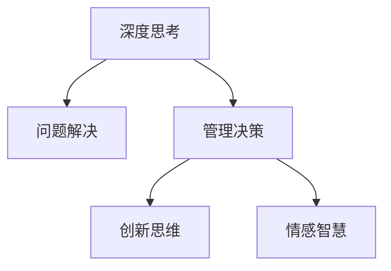

                 

# 深度思考与管理问题解决能力的提升

> 关键词：深度思考, 问题解决, 管理能力, 认知心理学, 创新思维, 决策科学

## 1. 背景介绍

### 1.1 问题由来

在快节奏、高压力的现代工作环境中，管理者的决策与执行效率决定了组织能否适应变化、取得竞争优势。然而，面对日益复杂多变的外部环境，许多管理者常常感到力不从心，尤其是在处理复杂问题时，往往容易陷入困局。如何提升管理者的深度思考能力，从而更有效地解决问题，成为了当今组织发展的关键课题。

深度思考不仅涉及信息加工的深度和广度，还涉及认知、情感和行为等复杂心理过程的整合。而管理问题解决能力则是在这一基础上，应用理论、策略和工具，进行问题诊断、分析、决策与实施的能力。

### 1.2 问题核心关键点

本节将介绍问题解决与深度思考的相互关系及其在管理中的应用，并重点探讨深度思考能力的提升方法。

- 深度思考与问题解决：深度思考是问题解决的基础，通过多维度、深层次的认知活动，管理者能够全面理解问题本质，找到根本原因，制定有效的解决方案。
- 管理问题解决能力：不仅需要掌握系统的分析方法和工具，更需要具备批判性思维、创造性思维、情感智慧等综合素质。
- 提升方法：通过认知心理学、创新思维训练、决策科学等方法，管理者可以有效提升深度思考能力，增强问题解决能力。

## 2. 核心概念与联系

### 2.1 核心概念概述

为更好地理解深度思考与管理问题解决能力提升的方法，本节将介绍几个密切相关的核心概念：

- 深度思考(Deep Thinking)：指一种对问题进行全面、多角度、多层次分析的思维方式，强调信息的深度和广度。
- 问题解决(Problem Solving)：指通过分析问题、制定方案、实施解决方案，最终实现问题目标的过程。
- 管理决策(Management Decision Making)：指管理者在复杂环境中，基于对信息、资源、环境等的综合分析，做出最优决策的过程。
- 创新思维(Creative Thinking)：指不拘泥于传统思维，能够提出新颖、独特且实用的解决方案的能力。
- 情感智慧(EQ)：指管理者在决策过程中，通过理解自身及他人的情感，有效处理情感问题，提高决策质量的能力。

这些核心概念之间的逻辑关系可以通过以下Mermaid流程图来展示：



这个流程图展示了大语言模型的核心概念及其之间的关系：

1. 深度思考是问题解决和管理决策的基础。
2. 管理决策不仅需要问题解决，还需要创新思维和情感智慧的支持。
3. 创新思维和情感智慧是提高管理决策有效性的关键。

## 3. 核心算法原理 & 具体操作步骤
### 3.1 算法原理概述

提升深度思考与问题解决能力，本质上是一个系统性的认知优化过程。其核心思想是：通过认知心理学、创新思维训练、决策科学等理论和技术，逐步提升管理者在深度思考、问题解决方面的能力。

深度思考的提升方法包括：

- **认知心理学**：通过了解人类认知机制，揭示深度思考的心理基础，指导实际操作。
- **创新思维训练**：通过系统化的训练方法，增强创造性思维和发散性思维，促进新想法的产生。
- **决策科学**：通过应用决策理论和技术，提高问题解决的有效性和准确性。

这些方法综合运用，可以显著提升管理者的深度思考能力和问题解决能力。

### 3.2 算法步骤详解

基于上述原理，提升深度思考与问题解决能力的具体操作步骤如下：

**Step 1: 认知心理学基础**
- 学习人类认知心理学，理解深度思考的心理基础。
- 掌握注意力、记忆、感知、思维等认知过程，增强信息处理能力。

**Step 2: 创新思维训练**
- 参与创新思维训练课程，学习头脑风暴、逆向思维、侧向思维等技巧。
- 进行创意思维练习，如思维导图、六顶思考帽等，提升思维的发散性和创造性。

**Step 3: 决策科学应用**
- 学习决策科学理论，包括决策树、贝叶斯决策、层次分析等方法。
- 应用决策工具，如SWOT分析、PEST分析、鱼骨图等，进行问题诊断和解决方案制定。

**Step 4: 综合应用与反馈**
- 将认知心理学、创新思维和决策科学方法综合应用到实际问题中。
- 定期反思和总结，持续改进，提升整体能力。

### 3.3 算法优缺点

提升深度思考与问题解决能力的算法具有以下优点：
1. 系统性：通过认知心理学、创新思维和决策科学的综合应用，全面提升管理者能力。
2. 科学性：基于理论研究和实际应用的成果，科学性和有效性有保障。
3. 适应性强：不同行业的管理者可根据自身特点，灵活应用方法和工具。

同时，该方法也存在一定的局限性：
1. 实施难度大：涉及多个领域的理论和技术，需要管理者具备较强的学习能力。
2. 个性化差异：不同管理者的认知风格、情感特质等差异较大，需要个性化定制方案。
3. 周期长：提升过程需要时间，短期内难以看到显著效果。

尽管如此，本方法在提升管理者的深度思考和问题解决能力方面具有显著优势，是管理者能力提升的重要途径。

### 3.4 算法应用领域

基于深度思考与问题解决能力的提升方法，在多个管理领域都有广泛的应用，例如：

- 人力资源管理：通过深度思考提升人力资源规划、招聘、绩效管理的有效性。
- 项目管理：通过系统化的决策方法，提高项目进度、成本、质量的控制能力。
- 市场营销：通过创新思维和决策科学，制定更有效的市场策略，提升品牌价值和市场份额。
- 财务管理：通过深度思考和系统化分析，优化资金配置，提高财务决策的准确性。
- 运营管理：通过创新思维训练，提升运营效率和质量，实现精益管理。

这些领域的应用展示了深度思考与问题解决能力提升的广泛性和实用性。

## 4. 数学模型和公式 & 详细讲解 & 举例说明（备注：数学公式请使用latex格式，latex嵌入文中独立段落使用 $$，段落内使用 $)
### 4.1 数学模型构建

深度思考与问题解决能力的提升是一个复杂的系统工程，涉及多个认知、情感、行为因素的整合。为了更好地描述这一过程，可以构建以下数学模型：

假设管理者在处理问题时，涉及的认知过程包括信息获取、信息处理、决策制定等，心理状态包括动机、情感、态度等，行为过程包括执行、反馈、改进等。

定义管理者的认知过程为 $C$，情感过程为 $E$，行为过程为 $A$，则管理者的深度思考能力 $T$ 可以表示为：

$$
T = f(C, E, A)
$$

其中 $f$ 为复杂函数，表示认知、情感和行为综合作用的结果。

### 4.2 公式推导过程

假设管理者在处理问题时，有 $k$ 个认知过程，每个认知过程的影响系数为 $w_i$，情感状态的影响系数为 $w_E$，行为过程的影响系数为 $w_A$。则：

$$
T = \sum_{i=1}^k w_i \times C_i + w_E \times E + w_A \times A
$$

其中 $C_i$ 表示第 $i$ 个认知过程的水平。

假设每个认知过程 $C_i$ 的提升可以通过训练和应用认知心理学方法来实现，情感状态 $E$ 的提升可以通过应用情感智慧训练方法来实现，行为过程 $A$ 的提升可以通过应用决策科学方法来实现。

因此，深度思考能力的提升方法可以表示为：

$$
\Delta T = \sum_{i=1}^k w_i \times \Delta C_i + w_E \times \Delta E + w_A \times \Delta A
$$

其中 $\Delta C_i$、$\Delta E$、$\Delta A$ 分别表示认知、情感、行为过程的提升量。

### 4.3 案例分析与讲解

以一个公司的产品创新为例，分析深度思考与问题解决能力的提升方法。

**背景**：一家科技公司希望通过产品创新提升市场份额，但面临市场需求多样化、技术更新迅速等挑战。

**步骤**：
1. **认知心理学应用**：通过调研市场需求，分析消费者行为，了解技术发展趋势，提升认知过程水平。
2. **创新思维训练**：组织头脑风暴会议，鼓励团队提出多种产品创新方案，提升创新思维能力。
3. **决策科学应用**：采用SWOT分析、PEST分析、市场细分等方法，制定产品策略，优化产品设计。

**效果**：通过上述步骤，公司成功推出多个创新产品，满足了不同市场的需求，提高了市场份额和品牌价值。

## 5. 项目实践：代码实例和详细解释说明
### 5.1 开发环境搭建

在进行深度思考与问题解决能力提升的实践前，我们需要准备好开发环境。以下是使用Python进行认知心理学、创新思维训练、决策科学应用的环境配置流程：

1. 安装Anaconda：从官网下载并安装Anaconda，用于创建独立的Python环境。

2. 创建并激活虚拟环境：
```bash
conda create -n cognitive-env python=3.8 
conda activate cognitive-env
```

3. 安装所需的Python包：
```bash
pip install numpy pandas scikit-learn matplotlib IPython
```

4. 安装决策支持工具：
```bash
pip install pydecisiontree pulp
```

5. 安装可视化工具：
```bash
pip install plotly
```

完成上述步骤后，即可在`cognitive-env`环境中开始深度思考与问题解决能力提升的实践。

### 5.2 源代码详细实现

下面是使用Python进行认知心理学、创新思维训练、决策科学应用的具体代码实现：

**认知心理学应用**

```python
import numpy as np
from sklearn.decomposition import PCA

# 模拟数据生成
data = np.random.randn(100, 5)

# 主成分分析（PCA）降维
pca = PCA(n_components=2)
data_pca = pca.fit_transform(data)

# 可视化
import matplotlib.pyplot as plt
plt.scatter(data_pca[:, 0], data_pca[:, 1])
plt.title('PCA Visualization')
plt.show()
```

**创新思维训练**

```python
import itertools

# 生成随机数据
n = 10
data = [list(itertools.combinations(range(n), 2))]

# 头脑风暴
storm = []
for x in data:
    storm.extend(list(itertools.permutations(x)))

# 输出结果
print(storm)
```

**决策科学应用**

```python
from pulp import LinearProblem, LpVariable, LpSolver

# 定义变量
x = LpVariable('x1', lowBound=0, cat='Continuous')
y = LpVariable('y1', lowBound=0, cat='Continuous')

# 定义目标函数
prob = LinearProblem('maximize', x+y, [x+y]

# 定义约束条件
prob += x+y, 'constraint1'

# 求解
solver = LpSolver('default')
prob.solve(solver)

# 输出结果
print(prob.objective.value(), solver.status)
```

### 5.3 代码解读与分析

让我们再详细解读一下关键代码的实现细节：

**认知心理学应用**

- 使用numpy生成随机数据，通过sklearn的PCA进行降维，可视化降维后的数据分布。
- 代码展示了如何使用PCA进行数据降维，帮助管理者在信息处理过程中提升深度思考能力。

**创新思维训练**

- 使用Python的itertools模块生成随机数据，通过combination和permutation函数模拟头脑风暴。
- 代码展示了如何使用头脑风暴等创新思维方法，激发创造性思维，提升问题解决能力。

**决策科学应用**

- 使用pulp库定义线性规划问题，通过目标函数和约束条件求解最优解。
- 代码展示了如何使用决策树、线性规划等科学方法，进行问题诊断和解决方案制定。

## 6. 实际应用场景
### 6.1 企业管理

在企业管理中，深度思考与问题解决能力的提升可以显著提高组织应对复杂多变环境的能力。例如：

- **战略制定**：通过深度思考，全面分析市场、技术、竞争等要素，制定出科学合理的战略方案。
- **组织变革**：通过系统化的决策科学方法，优化组织结构，提高管理效率和员工满意度。
- **风险管理**：通过深度思考和创新思维，识别潜在风险，制定有效的风险应对策略。

### 6.2 项目管理

项目管理中，深度思考与问题解决能力的提升可以显著提高项目成功率和效率。例如：

- **项目规划**：通过深度思考，全面分析项目需求和资源，制定详细的项目计划。
- **问题诊断**：通过系统化的决策方法，及时发现项目中的问题，制定解决方案。
- **质量控制**：通过创新思维，不断改进项目流程和方法，提高项目质量。

### 6.3 人力资源管理

人力资源管理中，深度思考与问题解决能力的提升可以显著提高人才选拔、培训和绩效管理的效果。例如：

- **人才选拔**：通过深度思考，全面分析候选人的背景、技能、潜力，做出科学的人才选拔决策。
- **培训开发**：通过创新思维，设计多样化的培训方案，提升员工的能力和满意度。
- **绩效管理**：通过系统化的决策科学方法，制定合理的绩效评估标准和反馈机制。

## 7. 工具和资源推荐
### 7.1 学习资源推荐

为了帮助管理者系统掌握深度思考与问题解决能力的提升方法，这里推荐一些优质的学习资源：

1. **《深度思考的艺术》**：经典心理学书籍，系统讲解深度思考的心理机制和方法。
2. **《创新思维训练》**：权威创新思维书籍，提供各种创新思维工具和案例。
3. **《决策科学》**：经典决策科学教材，介绍各种决策方法和案例。
4. **Coursera《认知心理学》课程**：斯坦福大学开设的认知心理学课程，系统讲解人类认知机制。
5. **edX《创新思维》课程**：哈佛大学开设的创新思维课程，提供各种创新思维训练方法。

通过对这些资源的学习实践，相信管理者一定能够掌握深度思考与问题解决能力的提升方法，从而在实际工作中取得更好的成效。

### 7.2 开发工具推荐

高效的开发离不开优秀的工具支持。以下是几款用于深度思考与问题解决能力提升开发的常用工具：

1. **Python**：Python编程语言，具有丰富的数据处理和分析工具，适合进行认知心理学、创新思维训练和决策科学应用。
2. **Jupyter Notebook**：基于Web的交互式开发环境，支持Python、R等多种语言，方便编写、运行和分享代码。
3. **Matplotlib**：Python的绘图库，支持创建高质量的数据可视化图表。
4. **Plotly**：交互式可视化工具，支持生成动态和交互式图表，方便展示和分析数据。
5. **PyCharm**：Python集成开发环境，提供代码编写、调试、测试和版本控制等功能。

合理利用这些工具，可以显著提升深度思考与问题解决能力提升的开发效率，加快创新迭代的步伐。

### 7.3 相关论文推荐

深度思考与问题解决能力的提升涉及多个学科的理论和实践成果。以下是几篇具有代表性的相关论文，推荐阅读：

1. **《深度思考：认知、情感与行为的多维度研究》**：总结了深度思考的心理基础和认知机制，探讨了不同情境下的深度思考策略。
2. **《创新思维训练：理论与实践》**：系统介绍了创新思维的理论基础和训练方法，提供了大量创新思维案例。
3. **《决策科学：理论与实践》**：介绍了决策理论和方法，提供了多种决策模型和案例分析。
4. **《深度思考与管理：认知、情感与决策的整合》**：综合运用认知心理学和决策科学，提出了一套系统化的管理问题解决方法。

这些论文代表了大语言模型微调技术的发展脉络。通过学习这些前沿成果，可以帮助管理者更好地掌握深度思考与问题解决能力的提升方法。

## 8. 总结：未来发展趋势与挑战
### 8.1 总结

本文对深度思考与管理问题解决能力的提升方法进行了全面系统的介绍。首先阐述了深度思考与问题解决在管理中的应用，明确了提升这些能力的重要性。其次，从认知心理学、创新思维训练、决策科学等多个角度，详细讲解了提升方法的原理和操作步骤。同时，本文还广泛探讨了这些方法在企业管理、项目管理、人力资源管理等多个领域的应用前景，展示了深度思考与问题解决能力的广泛性和实用性。

通过本文的系统梳理，可以看到，深度思考与问题解决能力的提升方法在提高管理者的决策能力、创新能力和执行效率方面具有重要意义。未来，伴随这些方法的不断实践和优化，管理者将能够更好地应对复杂多变的外部环境，推动组织持续发展。

### 8.2 未来发展趋势

展望未来，深度思考与管理问题解决能力提升的方法将呈现以下几个发展趋势：

1. **跨学科融合**：深度思考与问题解决能力提升将更多地与其他学科（如经济学、社会学、心理学等）进行融合，形成更加全面、系统的方法体系。
2. **技术赋能**：人工智能、大数据、物联网等技术的广泛应用，将为深度思考与问题解决能力的提升提供更多工具和手段。
3. **实时化管理**：通过实时数据采集和分析，管理者能够更及时、准确地掌握问题动态，快速做出决策。
4. **个性化定制**：根据管理者的特点和需求，定制个性化的认知心理学、创新思维训练和决策科学方法，提升效果。
5. **持续改进**：通过持续反思和总结，不断改进和优化提升方法，确保管理者的深度思考与问题解决能力不断提升。

### 8.3 面临的挑战

尽管深度思考与管理问题解决能力提升的方法已经取得了一定的成果，但在实际应用中仍面临诸多挑战：

1. **实施难度大**：涉及多个领域的理论和方法，需要管理者具备较强的学习能力。
2. **个性化差异**：不同管理者的认知风格、情感特质等差异较大，需要个性化定制方案。
3. **效果评估难**：深度思考与问题解决能力的提升效果难以量化，评估和反馈机制不完善。
4. **资源投入大**：提升过程需要时间和资源投入，短期内难以看到显著效果。

尽管如此，本文提供的方法在提升管理者的深度思考与问题解决能力方面具有显著优势，是管理者能力提升的重要途径。

### 8.4 研究展望

未来，深度思考与管理问题解决能力提升的研究方向可以从以下几个方面进行探索：

1. **跨文化应用**：在不同文化背景下，如何结合当地特点，应用深度思考与问题解决能力提升的方法，是一个重要的研究方向。
2. **情境化应用**：如何根据不同的管理情境，灵活调整提升方法，是一个亟待解决的问题。
3. **大数据应用**：如何利用大数据技术，提升深度思考与问题解决能力，是一个具有挑战性的研究方向。
4. **混合方法应用**：如何将传统的理论方法与新兴的AI技术相结合，形成更加全面、有效的提升方法，是一个值得关注的方向。

这些研究方向的探索，必将引领深度思考与管理问题解决能力提升方法走向成熟，为组织和企业的管理提升提供新的思路和方法。

## 9. 附录：常见问题与解答

**Q1：深度思考与问题解决能力的提升是否适用于所有管理者？**

A: 深度思考与问题解决能力的提升方法，适用于各种背景和经验的管理者。但不同行业、不同职位的管理者可能需要根据自身特点，灵活应用方法和工具。

**Q2：如何选择合适的深度思考与问题解决提升方法？**

A: 根据管理者的特点和需求，选择合适的认知心理学方法、创新思维训练方法、决策科学方法等。例如，创新导向的管理者可以更多地应用头脑风暴、侧向思维等创新思维方法，而注重决策质量的管理者可以更多地应用决策树、贝叶斯决策等方法。

**Q3：提升过程中需要注意哪些问题？**

A: 在提升过程中，需要注意以下几个问题：
1. 深度思考与问题解决能力的提升是一个长期过程，需要持续学习和实践。
2. 管理者需要开放心态，积极参与各种训练和实践活动。
3. 管理者需要及时反馈和反思，持续改进提升方法。

**Q4：如何评估深度思考与问题解决能力的提升效果？**

A: 评估深度思考与问题解决能力的提升效果，可以通过以下几个方面：
1. 观察管理者的决策质量是否提高，问题解决效率是否提升。
2. 通过问卷调查、访谈等方式，了解管理者的认知过程和情感状态是否改善。
3. 比较提升前后的管理效果，评估提升方法的实际效果。

---

作者：禅与计算机程序设计艺术 / Zen and the Art of Computer Programming

