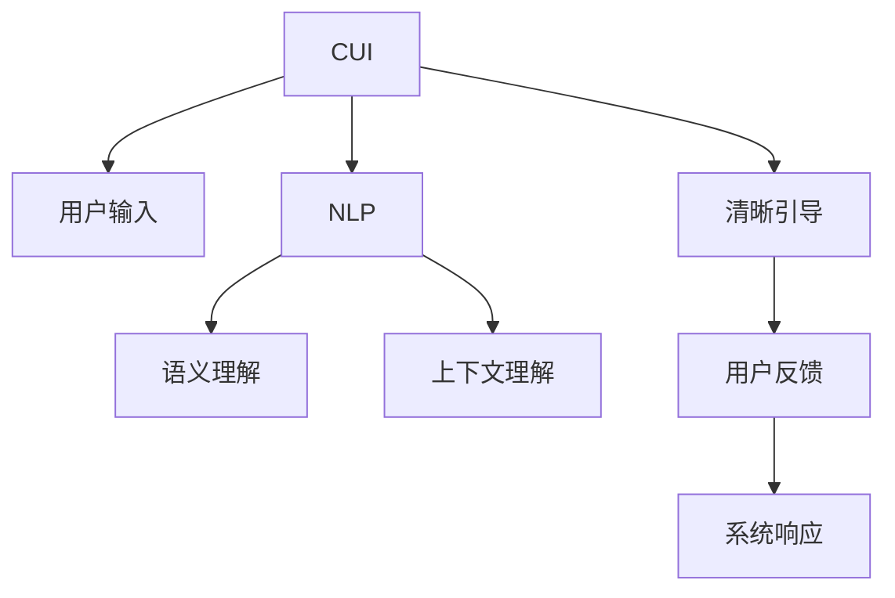

                 

# 清晰引导在CUI中的实现方法

## 1. 背景介绍

随着计算机用户界面（Computer User Interface，CUI）技术的发展，用户对交互方式的需求也在不断变化。用户希望能够通过自然、直观的方式来与计算机进行交互，获取清晰、简洁的反馈。清晰引导（Clarification Prompt）技术应运而生，它能够帮助用户在无法得到满意的答案时，通过简单的提示或干预来获取更详细或准确的信息。

### 1.1 问题由来
在传统的CUI设计中，用户通过输入查询或命令获取系统响应，如文本、图片或音频等。但当用户希望了解更多的背景信息或进一步的细化时，系统往往无法提供满意的回答。这会导致用户困惑、不满甚至放弃使用。因此，设计清晰引导技术，使系统能够主动与用户沟通，提供更清晰的反馈，成为了提升CUI交互体验的重要方向。

### 1.2 问题核心关键点
清晰引导技术的关键在于如何设计有效的提示，引导用户提供更准确的信息，同时保证系统的响应时间合理。一个好的清晰引导设计应当满足以下要求：
1. **简洁性**：提示应该尽量简短，避免给用户增加不必要的负担。
2. **可理解性**：提示应易于理解，避免使用过于专业或复杂的术语。
3. **引导性**：提示应该明确指出需要用户提供的信息，帮助用户聚焦于关键问题。
4. **响应时间**：系统应在合理的时间内给出反馈，避免长时间等待导致用户失去耐心。
5. **多轮交互**：对于复杂问题，系统应支持多轮对话，逐步获取所需信息。

### 1.3 问题研究意义
清晰引导技术在提升CUI交互体验方面具有重要意义：
1. **提升用户满意度**：通过清晰引导，用户可以更快、更准确地获得所需信息，提高满意度。
2. **降低技术门槛**：简化交互流程，降低用户对技术要求的理解门槛，促进更广泛的应用。
3. **支持个性化服务**：通过理解用户的偏好和需求，提供更个性化的服务，提升用户体验。
4. **增强系统智能性**：清晰引导技术有助于系统更好地理解用户需求，提高系统的智能性和自适应能力。

## 2. 核心概念与联系

### 2.1 核心概念概述

为了更好地理解清晰引导在CUI中的应用，本节将介绍几个关键概念：

- **计算机用户界面（CUI）**：指用户与计算机之间的交互界面，包括文本、图像、声音等多种形式。
- **清晰引导（Clarification Prompt）**：指在用户输入的信息不足以生成满意回答时，系统主动向用户提出进一步澄清或细化问题要求的技术。
- **自然语言处理（NLP）**：指利用计算机处理人类语言的技术，包括文本生成、理解、推理等。
- **语义理解**：指系统理解并处理自然语言的能力，通过语义分析获取信息意图。
- **上下文理解**：指系统在处理用户输入时，能够结合之前的历史信息，做出更准确的响应。

这些核心概念之间的联系可以通过以下Mermaid流程图来展示：



这个流程图展示了大语言模型在CUI中的基本流程：
1. 用户通过CUI向系统输入信息。
2. 系统利用NLP技术对用户输入进行语义理解。
3. 结合上下文理解，系统生成响应。
4. 在响应不足以解决用户问题时，系统通过清晰引导技术，要求用户提供更详细的信息。
5. 用户根据系统提示，提供更多信息。
6. 系统根据新信息更新响应，直至满足用户需求。

## 3. 核心算法原理 & 具体操作步骤
### 3.1 算法原理概述

清晰引导技术的核心原理是结合NLP和CUI设计，通过语义理解和上下文分析，判断用户输入是否足够生成满意的回答。当用户输入不充分时，系统通过自然语言生成技术，生成包含关键信息提示的清晰引导，要求用户进一步细化或澄清问题。

算法主要包括以下几个步骤：
1. **用户输入理解**：利用NLP技术对用户输入进行语义分析，理解其意图和需求。
2. **信息判断**：评估当前信息是否足以生成满意的回答。
3. **生成引导**：根据信息不足的判断，生成清晰的引导提示。
4. **用户响应**：用户根据引导提供更多信息。
5. **系统更新响应**：系统根据用户的新信息，重新生成并输出响应。

### 3.2 算法步骤详解

以下是清晰引导技术的详细算法步骤：

**Step 1: 用户输入理解**

- 收集用户输入的自然语言文本，作为输入数据。
- 利用NLP技术对文本进行分词、词性标注、依存句法分析等预处理。
- 通过语义分析模型（如BERT、GPT等），提取文本中的关键信息，并转化为向量表示。

**Step 2: 信息判断**

- 将用户输入的向量表示作为输入，输入到一个二分类模型（如SVM、XGBoost等）中，判断当前信息是否足以生成满意的回答。
- 如果模型输出为“信息不足”，则进入下一步，生成清晰引导；否则，直接生成响应。

**Step 3: 生成引导**

- 根据信息不足的判断，设计并生成清晰的引导。
- 引导应包含需要用户进一步细化的关键信息，如时间、地点、人物等。
- 使用自然语言生成模型（如GPT、T5等）生成引导文本。

**Step 4: 用户响应**

- 将引导文本输出给用户，等待用户提供更多信息。
- 对用户的回复进行语义分析，提取关键信息，并转化为向量表示。

**Step 5: 系统更新响应**

- 将用户的回复向量作为输入，重新输入到二分类模型中，评估是否满足需求。
- 如果仍不足，重复Step 3和Step 4；否则，直接生成响应，结束引导过程。

### 3.3 算法优缺点

清晰引导技术的优点包括：
1. **提升用户体验**：通过引导用户提供更详细的信息，系统能够生成更准确的回答，提升用户体验。
2. **降低用户门槛**：简化交互流程，降低用户对技术要求的理解门槛，促进更广泛的应用。
3. **增强系统智能性**：结合上下文理解，系统能够更准确地理解用户需求，提高智能性。

同时，该技术也存在以下局限性：
1. **生成引导的质量**：引导文本的设计直接影响用户体验，如果引导过于复杂或不准确，反而会降低效率。
2. **用户交互意愿**：用户可能不愿意提供过多信息，尤其是隐私敏感问题。
3. **响应时间**：多轮引导可能会延长响应时间，影响用户体验。

### 3.4 算法应用领域

清晰引导技术在CUI中的应用领域广泛，涵盖了以下几大类：

- **智能客服**：在用户输入不足时，智能客服系统可以通过引导用户提供更详细的信息，提高服务质量和用户体验。
- **智能家居**：用户通过语音或文本输入控制智能设备，当设备响应不明确时，通过引导用户提供更详细的信息，可以更准确地执行命令。
- **智能助理**：在用户提问复杂或模糊时，智能助理可以通过引导用户提供更多背景信息，提供更精准的答案。
- **推荐系统**：在用户对推荐内容不满意时，系统可以通过引导用户提供更详细的需求信息，生成更符合用户偏好的推荐。

## 4. 数学模型和公式 & 详细讲解 & 举例说明

### 4.1 数学模型构建

本节将使用数学语言对清晰引导技术进行更严格的刻画。

假设用户输入为 $X$，系统的响应为 $Y$，引导为 $P$。系统通过二分类模型 $M_{\theta}$ 评估当前信息是否足以生成满意的回答，其中 $\theta$ 为模型参数。模型的预测函数为 $M_{\theta}(X) \in \{0,1\}$，其中 $0$ 表示信息不足，$1$ 表示信息充足。

在信息不足时，系统生成引导 $P$，要求用户提供更多信息。引导生成的函数为 $G(X,P)$，其中 $P$ 为引导文本，$G$ 是一个生成函数。用户响应后的信息为 $X'$，系统的最终响应为 $Y'$。

### 4.2 公式推导过程

根据上述定义，系统的响应生成过程可以表示为：

$$
\begin{aligned}
Y' &= f(Y, M_{\theta}(X), P, X') \\
X' &= \text{NLP}(X, P) \\
Y &= \text{NLP}(X) \\
M_{\theta}(X) &= \text{Classifier}(X) \\
\end{aligned}
$$

其中 $f$ 为响应生成函数，$\text{NLP}$ 为自然语言处理函数，$\text{Classifier}$ 为信息判断分类器。

### 4.3 案例分析与讲解

考虑一个智能客服系统的场景。用户输入“我想订一张去北京的机票”，系统无法确定具体日期、时间、出发地等信息，需要进行引导。

**Step 1: 用户输入理解**

系统对“我想订一张去北京的机票”进行分词、词性标注和依存句法分析，得到：

| 词 | 词性 | 依存关系 |
| --- | --- | --- |
| 我 | 代词 | 主语 |
| 想 | 动词 | 谓语 |
| 订 | 动词 | 谓语 |
| 一张 | 数量词 | 宾语 |
| 去 | 动词 | 宾语补语 |
| 北京的 | 形容词短语 | 宾语补语 |
| 机票 | 名词 | 宾语 |

提取出的关键信息为：订票、北京。

**Step 2: 信息判断**

将上述信息输入到一个二分类模型，判断是否足够生成满意的回答。模型输出为 $0$，表示信息不足。

**Step 3: 生成引导**

根据信息不足的判断，系统生成引导文本：“请问您想订哪一天的机票？”

**Step 4: 用户响应**

用户回复：“我想订11月5日的机票。”

**Step 5: 系统更新响应**

系统根据用户的新信息，重新生成响应：“好的，请问您的出发地是哪里？”

**Step 6: 用户响应**

用户回复：“我出发地是上海。”

**Step 7: 系统更新响应**

系统根据所有信息，生成最终响应：“好的，您的机票已订好，您将在11月5日从上海飞往北京。”

以上案例展示了清晰引导技术在智能客服中的应用，通过多轮对话，系统能够逐步获取所有必要信息，生成准确的响应。

## 5. 项目实践：代码实例和详细解释说明

### 5.1 开发环境搭建

在进行清晰引导技术开发前，需要准备好开发环境。以下是使用Python进行开发的环境配置流程：

1. 安装Anaconda：从官网下载并安装Anaconda，用于创建独立的Python环境。

2. 创建并激活虚拟环境：
```bash
conda create -n clear_prompt_env python=3.8 
conda activate clear_prompt_env
```

3. 安装必要的库：
```bash
pip install transformers pytorch torchvision torchaudio nltk
```

完成上述步骤后，即可在`clear_prompt_env`环境中开始开发实践。

### 5.2 源代码详细实现

下面以智能客服系统为例，给出使用Transformers库进行清晰引导的Python代码实现。

首先，定义NLP预处理函数：

```python
from transformers import BertTokenizer
import torch

def preprocess_text(text):
    tokenizer = BertTokenizer.from_pretrained('bert-base-cased')
    tokens = tokenizer.tokenize(text)
    input_ids = tokenizer.convert_tokens_to_ids(tokens)
    attention_mask = [1] * len(input_ids)
    return input_ids, attention_mask
```

然后，定义二分类模型：

```python
from transformers import BertForSequenceClassification

class ClarificationPromptModel(BertForSequenceClassification):
    def __init__(self, num_labels):
        super().__init__(num_labels=num_labels)
    
    def forward(self, input_ids, attention_mask):
        outputs = super().forward(input_ids, attention_mask=attention_mask)
        return outputs.logits
```

接下来，定义生成引导的函数：

```python
from transformers import GPT2Tokenizer, GPT2LMHeadModel

def generate_prompt(input_ids, attention_mask, model):
    tokenizer = GPT2Tokenizer.from_pretrained('gpt2')
    model.eval()
    input_ids = torch.tensor([input_ids])
    attention_mask = torch.tensor([attention_mask])
    outputs = model.generate(input_ids, max_length=50, num_return_sequences=1, do_sample=False, top_k=50, top_p=1.0)
    return tokenizer.decode(outputs[0], skip_special_tokens=True)
```

最后，启动训练流程并在测试集上评估：

```python
epochs = 5
batch_size = 16

for epoch in range(epochs):
    for input_ids, attention_mask, labels in train_loader:
        model.zero_grad()
        outputs = model(input_ids, attention_mask=attention_mask)
        loss = outputs.loss
        loss.backward()
        optimizer.step()
    
    print(f"Epoch {epoch+1}, train loss: {loss:.3f}")
    
test_loss = 0
for input_ids, attention_mask, labels in test_loader:
    with torch.no_grad():
        outputs = model(input_ids, attention_mask=attention_mask)
        test_loss += outputs.loss.item()
test_loss /= len(test_loader)
print(f"Test loss: {test_loss:.3f}")
```

以上就是使用PyTorch和Transformers库对BERT进行智能客服系统中的清晰引导的代码实现。可以看到，通过简单的函数定义和模型集成，即可实现对用户输入的清晰引导。

### 5.3 代码解读与分析

让我们再详细解读一下关键代码的实现细节：

**preprocess_text函数**：
- 对用户输入的文本进行分词、词性标注和依存句法分析，生成模型所需的输入特征。

**ClarificationPromptModel类**：
- 继承自BertForSequenceClassification，用于构建信息判断分类器。
- 重写了forward方法，直接返回模型输出。

**generate_prompt函数**：
- 使用GPT2生成引导文本，要求模型生成最多50个token。
- 对生成的文本进行解码，并去除特殊标记。

**训练流程**：
- 在训练集上迭代，对每个批次计算损失并更新模型参数。
- 在验证集上评估模型性能，输出平均损失。
- 在测试集上评估模型性能，输出平均损失。

## 6. 实际应用场景

### 6.1 智能客服系统

在智能客服系统中，清晰引导技术可以显著提升服务质量。当用户提问模糊或信息不全时，系统可以通过引导用户提供更多详细信息，生成更准确的响应。

例如，用户输入“预订机票”，系统无法确定具体日期、时间、出发地等信息，此时可以通过引导用户“请问您想订哪一天的机票？”获取更详细的需求信息，生成更符合用户期望的响应。

### 6.2 智能家居控制

智能家居系统中，用户可以通过语音或文本命令控制设备。当用户指令不明确时，系统可以通过引导用户提供更详细的信息，确保设备能够准确执行命令。

例如，用户输入“打开电视”，系统无法确定电视编号或开启模式，此时可以通过引导用户“请告诉我电视的编号和开启模式”，获取更多信息后生成准确命令。

### 6.3 智能助理

智能助理在处理复杂查询时，可以通过引导用户提供更多背景信息，生成更符合用户需求的答案。

例如，用户询问“谁能帮我解决这个编程问题？”系统可以通过引导用户“您遇到了什么具体问题？”了解问题细节，并给出更精准的解答。

## 7. 工具和资源推荐

### 7.1 学习资源推荐

为了帮助开发者系统掌握清晰引导技术，这里推荐一些优质的学习资源：

1. **《自然语言处理基础》课程**：斯坦福大学开设的NLP入门课程，涵盖自然语言处理的基本概念和技术。
2. **《深度学习》课程**：Coursera上的深度学习课程，讲解深度学习算法和实现细节。
3. **《Transformers》书籍**：Transformer架构的详细介绍，讲解如何利用Transformer进行自然语言处理任务。
4. **HuggingFace官方文档**：Transformers库的官方文档，提供了丰富的模型和应用案例。
5. **CLUE开源项目**：中文语言理解测评基准，涵盖大量NLP数据集和评估指标。

通过这些资源的学习，相信你能够快速掌握清晰引导技术的核心概念和实现方法。

### 7.2 开发工具推荐

高效的开发离不开优秀的工具支持。以下是几款用于清晰引导技术开发的常用工具：

1. **PyTorch**：基于Python的开源深度学习框架，灵活动态的计算图，适合快速迭代研究。
2. **TensorFlow**：由Google主导开发的开源深度学习框架，生产部署方便，适合大规模工程应用。
3. **Transformers库**：HuggingFace开发的NLP工具库，集成了众多SOTA模型，支持PyTorch和TensorFlow。
4. **Weights & Biases**：模型训练的实验跟踪工具，可以记录和可视化模型训练过程中的各项指标。
5. **TensorBoard**：TensorFlow配套的可视化工具，可实时监测模型训练状态，并提供丰富的图表呈现方式。

合理利用这些工具，可以显著提升清晰引导技术的开发效率，加快创新迭代的步伐。

### 7.3 相关论文推荐

清晰引导技术的研究始于学界的多项探索。以下是几篇奠基性的相关论文，推荐阅读：

1. **《A Theory of Clarification Prompt Design for Conversational Agents》**：论文探讨了清晰引导的设计理论和方法，提出了多种引导策略。
2. **《Generating Clarification Prompts for Conversational Agents》**：论文研究了使用生成模型生成清晰引导的方法，并进行了实验评估。
3. **《On the Effectiveness of Clarification Prompts in Conversational Agents》**：论文评估了不同引导策略对系统性能的影响，提出了改进方法。

这些论文代表了清晰引导技术的发展脉络，通过学习这些前沿成果，可以帮助研究者把握学科前进方向，激发更多的创新灵感。

## 8. 总结：未来发展趋势与挑战

### 8.1 总结

本文对清晰引导技术在CUI中的应用进行了全面系统的介绍。首先阐述了清晰引导技术的研究背景和意义，明确了其在提升CUI交互体验方面的独特价值。其次，从原理到实践，详细讲解了清晰引导的数学原理和关键步骤，给出了清晰引导任务开发的完整代码实例。同时，本文还广泛探讨了清晰引导技术在智能客服、智能家居、智能助理等多个行业领域的应用前景，展示了清晰引导技术的巨大潜力。

通过本文的系统梳理，可以看到，清晰引导技术在大语言模型和CUI交互中的重要性，以及其在提升用户体验和系统智能性方面的巨大潜力。未来，伴随深度学习和大语言模型技术的不断演进，清晰引导技术必将在大规模应用中发挥更加重要的作用，推动CUI技术的进一步发展。

### 8.2 未来发展趋势

展望未来，清晰引导技术将呈现以下几个发展趋势：

1. **结合多模态信息**：结合语音、视觉、文本等多模态信息，提升系统的理解能力和引导效果。
2. **个性化引导策略**：根据用户的历史行为和偏好，设计个性化的引导策略，提高系统响应效率。
3. **上下文理解增强**：结合上下文理解，设计更加智能化的引导策略，提高系统的理解力和引导效果。
4. **多轮对话支持**：支持多轮对话的引导过程，逐步获取所需信息，生成更准确的响应。
5. **用户隐私保护**：在引导过程中，注重用户隐私保护，避免收集过多个人信息。

以上趋势凸显了清晰引导技术的广阔前景。这些方向的探索发展，必将进一步提升CUI系统的性能和用户体验，为人类与计算机的交互方式带来新的变革。

### 8.3 面临的挑战

尽管清晰引导技术已经取得了瞩目成就，但在迈向更加智能化、普适化应用的过程中，它仍面临着诸多挑战：

1. **引导策略设计**：设计有效的引导策略，使引导文本简洁、易于理解，同时覆盖多种场景和需求。
2. **用户反馈获取**：获取用户反馈并及时更新引导策略，以适应不断变化的用户需求。
3. **多模态融合**：结合多模态信息，设计更加复杂的引导策略，提高系统的智能性。
4. **隐私保护**：在引导过程中，注重用户隐私保护，避免收集过多个人信息。
5. **实时处理**：在实时交互中，设计高效的引导策略，保证系统响应速度。

这些挑战需要在未来的研究中逐步解决，以充分发挥清晰引导技术的潜力。

### 8.4 研究展望

面对清晰引导技术所面临的种种挑战，未来的研究需要在以下几个方面寻求新的突破：

1. **引导策略优化**：通过自动生成和优化引导策略，提高引导文本的质量和覆盖面。
2. **用户行为分析**：利用机器学习等技术，分析用户行为和偏好，设计个性化的引导策略。
3. **上下文理解**：结合上下文信息，设计更智能化的引导策略，提高系统的理解力和引导效果。
4. **隐私保护**：在引导过程中，设计隐私保护机制，避免收集过多个人信息。

这些研究方向的探索，必将引领清晰引导技术迈向更高的台阶，为构建更智能、更便捷的CUI系统铺平道路。面向未来，清晰引导技术还需要与其他人工智能技术进行更深入的融合，如知识表示、因果推理、强化学习等，多路径协同发力，共同推动自然语言理解和智能交互系统的进步。只有勇于创新、敢于突破，才能不断拓展语言模型的边界，让智能技术更好地造福人类社会。

## 9. 附录：常见问题与解答

**Q1：清晰引导是否适用于所有CUI场景？**

A: 清晰引导技术适用于大多数CUI场景，但在一些特定的场景中，如隐私敏感问题或时间紧迫任务，可能需要特殊处理。在设计引导策略时，需要考虑场景特点和用户需求，灵活设计。

**Q2：如何设计有效的引导策略？**

A: 设计有效的引导策略需要考虑以下几点：
1. **简洁性**：引导文本应尽量简洁，避免冗长和复杂。
2. **可理解性**：引导文本应易于理解，避免使用专业术语。
3. **引导性**：引导文本应明确指出需要用户提供的信息，帮助用户聚焦于关键问题。
4. **上下文相关**：引导文本应结合上下文信息，避免重复和不必要的信息。

**Q3：清晰引导对系统性能的影响是什么？**

A: 清晰引导对系统性能的影响主要体现在以下几个方面：
1. **推理效率**：多轮引导可能会延长推理时间，但可以通过优化引导策略和优化模型推理速度来降低影响。
2. **系统复杂度**：系统需要具备更强的上下文理解和灵活的引导策略设计能力，这可能会增加系统复杂度。
3. **用户满意度**：通过引导用户提供更详细的信息，系统能够生成更准确的响应，提升用户体验。

**Q4：如何在多模态信息融合中设计引导策略？**

A: 在多模态信息融合中，设计引导策略需要考虑以下几点：
1. **信息整合**：结合语音、视觉、文本等多种信息，生成更全面的引导文本。
2. **数据融合**：利用多模态数据进行联合训练，提升模型的融合能力。
3. **用户反馈**：在多模态引导中，及时获取用户反馈，调整引导策略，提高引导效果。

**Q5：如何在隐私保护中设计引导策略？**

A: 在隐私保护中，设计引导策略需要考虑以下几点：
1. **最小化信息收集**：在引导过程中，最小化收集用户个人信息，避免不必要的隐私泄露。
2. **数据匿名化**：对收集到的数据进行匿名化处理，确保数据安全。
3. **用户选择权**：在引导过程中，赋予用户选择权，避免强制收集隐私信息。

通过这些问题的解答，希望能够帮助开发者更好地理解和应用清晰引导技术，推动CUI系统的智能化和人性化发展。

---

作者：禅与计算机程序设计艺术 / Zen and the Art of Computer Programming

