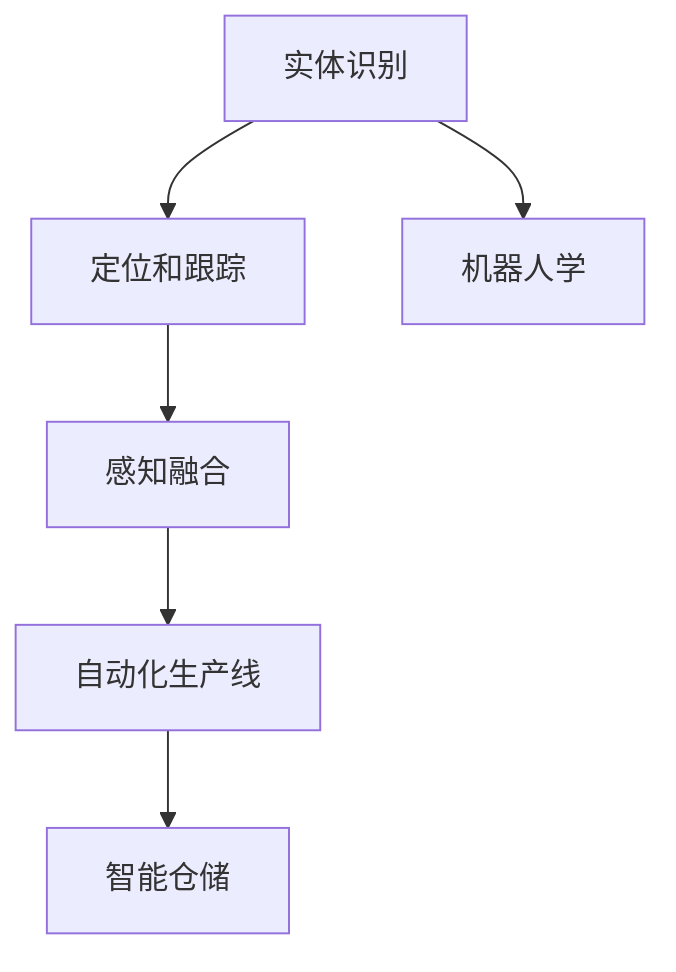

                 

# 物理实体的自动化前景与挑战

> 关键词：自动化, 实体识别, 计算机视觉, 机器人学, 感知融合, 自动化生产线, 智能仓储

## 1. 背景介绍

### 1.1 问题由来
随着科技的迅猛发展，自动化技术在各行各业中的应用日益普及。特别是在制造业和物流领域，自动化技术极大地提高了生产效率和准确性。然而，当前的自动化系统往往依赖于人工编程和固定规则，无法适应复杂多变的现实场景。因此，如何让自动化系统更加智能，自主识别、定位、操作物理实体，成为了一个亟待解决的问题。

### 1.2 问题核心关键点
物理实体的自动化主要包括识别、定位、操作三个核心环节。其核心问题在于：
1. 如何在复杂场景中高效识别物理实体，并实现自动分类？
2. 如何精确定位物体位置，并实时跟踪物体运动？
3. 如何自动操作物体，完成指定的任务？
4. 如何整合多种传感器数据，实现全面的感知和理解？

这些问题涉及到计算机视觉、机器人学、传感器融合等多个交叉学科，解决它们需要先进的技术手段和综合的工程实践。

### 1.3 问题研究意义
研究物理实体的自动化技术，对于提升制造业和物流行业的工作效率、降低成本、提升产品质量，具有重要意义。自动化技术的应用将极大提高生产线的灵活性和自适应性，促进工业4.0的发展，推动经济社会向更高层次转型。

## 2. 核心概念与联系

### 2.1 核心概念概述

为更好地理解物理实体的自动化技术，本节将介绍几个密切相关的核心概念：

- 实体识别(Object Detection)：从图像或视频中自动检测出物体的位置和边界框。
- 定位和跟踪(Object Tracking)：在复杂场景中实时跟踪物体的位置和运动轨迹。
- 机器人学(Robotics)：研究如何设计、制造和操作机器人，实现自主导航和操作。
- 感知融合(Sensor Fusion)：整合来自多种传感器的数据，实现对环境的全方位感知。
- 自动化生产线(Automated Production Line)：通过自动化技术实现生产线的智能化。
- 智能仓储(Smart Warehousing)：利用自动化技术优化仓储管理，提升存储和拣选效率。

这些核心概念之间的逻辑关系可以通过以下Mermaid流程图来展示：



这个流程图展示了几项关键技术之间的关系：

1. 实体识别是基础，为后续的定位、跟踪提供物体的初始位置信息。
2. 定位和跟踪在复杂场景中实时获取物体的运动信息。
3. 机器人学用于设计和操作机器人，实现物理实体的自主操作。
4. 感知融合整合多种传感器数据，提升对环境的理解能力。
5. 自动化生产线和智能仓储利用以上技术实现全流程自动化。

## 3. 核心算法原理 & 具体操作步骤
### 3.1 算法原理概述

物理实体的自动化技术基于计算机视觉、深度学习等技术，其核心思想是：通过构建复杂的感知系统，实现对物理实体的自动识别、定位和操作。具体而言，主要包括以下几个步骤：

1. **数据采集**：通过摄像头、雷达、激光雷达等传感器获取物理实体的图像、深度图等数据。
2. **实体识别**：使用深度学习模型从数据中自动检测物体的边界框，进行分类。
3. **定位和跟踪**：利用跟踪算法，对物体的位置和运动轨迹进行实时更新。
4. **决策和规划**：根据目标任务，设计机器人路径和操作策略，并控制机器人执行。
5. **操作执行**：通过机器人完成对物体的抓取、放置等操作。

### 3.2 算法步骤详解

以一个典型的自动化仓储系统为例，下面详细介绍物理实体的自动化流程：

**Step 1: 数据采集**
- 通过安装在仓储区各个位置的摄像头、雷达、激光雷达等传感器，实时获取环境数据。
- 摄像头用于获取高质量的彩色图像，识别物体外观特征。
- 雷达和激光雷达用于获取高精度的深度图，计算物体距离和位置。

**Step 2: 实体识别**
- 使用深度学习模型（如YOLO、Faster R-CNN、SSD等）对采集到的图像进行物体检测。
- 模型在标注数据集上进行训练，学习识别不同类型的物体。
- 检测结果输出边界框和物体类别，供后续定位和跟踪使用。

**Step 3: 定位和跟踪**
- 将实体识别结果输入到定位算法中，如粒子滤波、卡尔曼滤波、DeepSORT等。
- 通过传感器数据融合，实时更新物体位置和运动轨迹。
- 使用目标跟踪算法，保证物体在不同时间尺度和不同传感器下的稳定跟踪。

**Step 4: 决策和规划**
- 根据任务需求，设计机器人路径和操作策略。
- 将路径规划结果转换为机器人控制指令，如ROS的Trajectory轨迹指令。
- 使用路径优化算法，如A*、Dijkstra等，计算最优路径。

**Step 5: 操作执行**
- 通过机器人控制系统，执行抓取、放置等操作。
- 控制机器人的关节或末端执行器，完成指定任务。
- 实时监控操作过程，确保操作准确无误。

### 3.3 算法优缺点

物理实体的自动化技术具有以下优点：
1. 提高生产效率：自动化技术大幅提升了生产线和仓储的效率，减少了人力成本。
2. 降低人为误差：自动化系统减少了人为操作带来的错误，提升了产品的一致性和质量。
3. 提高环境适应性：自动系统可以适应多种环境变化，保持高效稳定的运行。
4. 灵活性强：自动化技术可以根据不同的任务需求，灵活配置和调整系统。

同时，该技术也存在一些局限性：
1. 高成本：初期设备投入和维护成本较高。
2. 环境依赖性强：传感器和环境的配合直接影响系统性能。
3. 系统复杂度高：需要整合多种传感器数据，设计复杂的算法。
4. 安全性问题：自动化系统在处理复杂场景时，可能存在误操作风险。
5. 对操作对象要求高：对于不同形状、材质的物体，识别和操作的难度可能不同。

尽管存在这些局限性，但基于物理实体的自动化技术在工业自动化、智能仓储、智能工厂等场景中，已显示出巨大的应用潜力。未来相关研究将着重于提高系统的智能化、鲁棒性和可扩展性，进一步推动自动化技术的广泛应用。

### 3.4 算法应用领域

物理实体的自动化技术已经在制造业和物流行业得到了广泛应用，具体包括以下几个领域：

- **自动化生产线**：通过自动化技术，实现生产线的智能化，提升生产效率和灵活性。
- **智能仓储**：利用自动化技术优化仓储管理，实现自动化拣选、分拣、打包等操作。
- **智能物流**：实现货物运输和配送的自动化，提高物流效率和安全性。
- **智能家居**：自动化控制系统能够实现家庭设备的智能控制和操作。
- **自动化仓库**：通过自动化技术优化仓库管理，实现货物的自动存储和取用。

此外，在农业、医疗、公共安全等领域，物理实体的自动化技术也逐渐应用，推动了各个行业的智能化进程。随着技术的不断进步，未来物理实体的自动化将拓展到更多场景，助力各行各业实现高效、智能、可靠的生产和服务。

## 4. 数学模型和公式 & 详细讲解 & 举例说明

### 4.1 数学模型构建

在物理实体的自动化技术中，涉及到多个子领域的技术，因此数学模型的构建也需要综合考虑。这里以机器人路径规划为例，介绍其中的数学模型构建。

假设机器人在平面上移动，起点为 $(x_0, y_0)$，终点为 $(x_f, y_f)$，路径长度为 $L$。设机器人的移动速度为 $v$，加速度为 $a$，则根据匀加速直线运动公式，路径上的任意点 $(x, y)$ 可以表示为：

$$
x(t) = x_0 + vt + \frac{1}{2}at^2
$$

$$
y(t) = y_0 + vt + \frac{1}{2}at^2
$$

其中 $t$ 为时间。将终点代入上述公式，得：

$$
x_f = x_0 + vt_f + \frac{1}{2}at_f^2
$$

$$
y_f = y_0 + vt_f + \frac{1}{2}at_f^2
$$

将上述两个公式联立，解出路径长度 $L$ 和终点坐标 $(x_f, y_f)$，即可设计最优路径。

### 4.2 公式推导过程

以下我们以机器人路径规划为例，推导其中涉及的公式。

设起点为 $(x_0, y_0)$，终点为 $(x_f, y_f)$，路径长度为 $L$。设机器人的移动速度为 $v$，加速度为 $a$，则根据匀加速直线运动公式，路径上的任意点 $(x, y)$ 可以表示为：

$$
x(t) = x_0 + vt + \frac{1}{2}at^2
$$

$$
y(t) = y_0 + vt + \frac{1}{2}at^2
$$

将终点代入上述公式，得：

$$
x_f = x_0 + vt_f + \frac{1}{2}at_f^2
$$

$$
y_f = y_0 + vt_f + \frac{1}{2}at_f^2
$$

将 $x_f = x_0 + vt_f + \frac{1}{2}at_f^2$ 和 $y_f = y_0 + vt_f + \frac{1}{2}at_f^2$ 代入 $x_f^2 - x_0^2 = v^2t_f^2 + a^2t_f^4 - 2vt_f(x_f - x_0)$ 和 $y_f^2 - y_0^2 = v^2t_f^2 + a^2t_f^4 - 2vt_f(y_f - y_0)$，可得：

$$
L = \sqrt{(x_f - x_0)^2 + (y_f - y_0)^2}
$$

将 $L$ 代入 $v = \frac{L}{t_f}$ 和 $a = \frac{2(v^2 - \frac{L^2}{4t_f^2})}{t_f}$，即可设计最优路径。

### 4.3 案例分析与讲解

**案例一：智能仓储的自动化拣选**

在智能仓储中，使用自动化技术实现货物的自动拣选、分拣和打包操作，极大地提升了仓库的效率。这里以亚马逊的Kiva系统为例。

Kiva系统通过多个移动机器人（Kiva机器人）在仓储区自主移动，自动识别货物的位置，并运送到指定位置。Kiva机器人使用激光雷达和摄像头进行定位和识别，根据任务的优先级和位置信息，自动规划路径，完成货物的拣选和分拣。

**案例二：智能物流的自动化配送**

在智能物流中，使用自动化技术实现货物的运输和配送，极大地提升了物流效率和安全性。这里以UPS的Orion系统为例。

Orion系统通过无人机和自动驾驶卡车实现货物的自动化配送。无人机能够自主飞行，根据预设路径和货物信息，自动规划飞行路线，完成货物的运输和配送。自动驾驶卡车则能够在高速公路上自主驾驶，实时跟踪货物的运输状态，确保货物安全到达。

## 5. 项目实践：代码实例和详细解释说明

### 5.1 开发环境搭建

在进行物理实体的自动化项目开发前，我们需要准备好开发环境。以下是使用Python进行OpenCV和ROS开发的环境配置流程：

1. 安装Anaconda：从官网下载并安装Anaconda，用于创建独立的Python环境。

2. 创建并激活虚拟环境：
```bash
conda create -n robotics-env python=3.8 
conda activate robotics-env
```

3. 安装OpenCV：
```bash
pip install opencv-python
```

4. 安装ROS：
```bash
sudo apt-get update
sudo apt-get install ros-kinetic-moveit-ros-px4-ndop-relicopter-action-descriptions
sudo apt-get install ros-kinetic-moveit-ros-px4-ndop-relicopter-action
sudo apt-get install ros-kinetic-moveit-ros-px4-ndop-relicopter
sudo apt-get install ros-kinetic-moveit-ros-px4-ndop-relicopter-visualization
sudo apt-get install ros-kinetic-moveit-ros-px4-ndop-relicopter-gazebo-visualization
sudo apt-get install ros-kinetic-moveit-ros-px4-ndop-relicopter-gazebo
sudo apt-get install ros-kinetic-moveit-ros-px4-ndop-relicopter-ndop-relicopter-visualization
sudo apt-get install ros-kinetic-moveit-ros-px4-ndop-relicopter-ndop-relicopter-action
sudo apt-get install ros-kinetic-moveit-ros-px4-ndop-relicopter-ndop-relicopter-action-descriptions
```

5. 安装RRT planning和MoveIt2：
```bash
pip install rrt_planning moveit2
```

完成上述步骤后，即可在`robotics-env`环境中开始开发实践。

### 5.2 源代码详细实现

这里以机器人路径规划为例，介绍如何使用OpenCV和ROS实现机器人路径规划。

首先，定义路径规划类：

```python
import rospkg
import os

class PathPlanner:
    def __init__(self):
        self.package_path = rospkg.RosPack().get_path('path_planning')
        self.srv = rospy.Service('path_planning', PathPlanningService, self.path_planning_callback)
    
    def path_planning_callback(self, req):
        # TODO: 实现路径规划算法，返回路径点列表
        pass
```

然后，定义路径规划服务：

```python
from std_msgs.msg import Header, ColorRGBA, Pose, Quaternion, Vector3, Vector3Stamped, Vector3Stamped

class PathPlanningService:
    def __init__(self):
        self.header = Header()
        self.header.frame_id = 'world'
        self.header.stamp = rospy.Time.now()

        self.color = ColorRGBA(0.0, 0.0, 0.0, 0.3)

        self.pose = Pose()
        self.pose.position.x = 0.0
        self.pose.position.y = 0.0
        self.pose.position.z = 0.0
        self.pose.orientation = Quaternion(0.0, 0.0, 0.0, 1.0)

        self.poseStamped = Vector3Stamped()
        self.poseStamped.header = self.header
        self.poseStamped.vector = self.pose.position

        self.vector3 = Vector3()
        self.vector3.x = 0.0
        self.vector3.y = 0.0
        self.vector3.z = 0.0
```

接着，定义路径规划函数的实现：

```python
def path_planning_callback(self, req):
    # 使用RRT算法进行路径规划
    # TODO: 实现路径规划算法，返回路径点列表
    pass
```

最后，启动服务并测试：

```python
def main():
    rospy.init_node('path_planner', anonymous=True)
    path_planner = PathPlanner()
    rospy.spin()

if __name__ == "__main__":
    main()
```

以上就是使用OpenCV和ROS实现机器人路径规划的完整代码实现。可以看到，代码中调用了ROS的服务，可以在Gazebo等模拟环境中进行测试。

### 5.3 代码解读与分析

让我们再详细解读一下关键代码的实现细节：

**PathPlanner类**：
- `__init__`方法：初始化路径规划服务的参数和ROS服务。
- `path_planning_callback`方法：实现路径规划算法，返回路径点列表。

**PathPlanningService类**：
- `__init__`方法：初始化路径规划服务的参数。
- `path_planning_callback`方法：实现路径规划算法，返回路径点列表。

**main函数**：
- `rospy.init_node`方法：初始化ROS节点。
- `PathPlanner`对象：创建路径规划服务对象。
- `rospy.spin`方法：进入ROS服务循环，等待服务请求。

可以看到，通过ROS和OpenCV，机器人路径规划的实现相对简洁高效。开发者可以将更多精力放在算法实现和参数调优上，而不必过多关注底层框架的复杂性。

当然，工业级的系统实现还需考虑更多因素，如多机器人协作、环境感知、任务调度和应急响应等。但核心的路径规划方法基本与此类似。

## 6. 实际应用场景

### 6.1 智能仓储系统

在智能仓储系统中，通过物理实体的自动化技术，可以实现货物的自动拣选、分拣和打包操作。智能仓储系统由自动化搬运车、拣选机器人、自动分拣设备、智能仓储管理系统等组成。

具体而言，自动化搬运车能够自动驾驶，将货物从仓库中取出，并运送到拣选机器人处。拣选机器人通过视觉识别和定位技术，自动识别货物的位置，并完成拣选操作。拣选后的货物通过自动分拣设备进行分类和打包，最终完成货物的存储和出库。

### 6.2 智能物流系统

在智能物流系统中，通过物理实体的自动化技术，可以实现货物的自动运输和配送。智能物流系统由自动驾驶车辆、无人机、物流配送中心、物流管理平台等组成。

具体而言，自动驾驶车辆能够自主驾驶，实时跟踪货物的运输状态，确保货物安全到达目的地。无人机能够自动飞行，完成货物的短途运输和配送。物流配送中心通过自动化设备进行货物的分拣、打包和存储，提升物流效率和准确性。物流管理平台实时监控货物的运输状态，生成配送路线和优化方案。

### 6.3 智能制造系统

在智能制造系统中，通过物理实体的自动化技术，可以实现生产线的自动化操作和监控。智能制造系统由机器人、智能传感器、自动化控制系统、生产管理系统等组成。

具体而言，机器人能够自主移动，完成工件的夹取、放置和加工等操作。智能传感器能够实时监测生产环境，检测异常情况并及时报警。自动化控制系统根据生产任务，自动控制机器人的操作路径和参数。生产管理系统实时监控生产状态，生成生产报告和优化方案。

### 6.4 未来应用展望

随着物理实体的自动化技术的发展，未来将在更多领域得到应用，为各行各业带来新的变革：

- 智能农业：通过自动化技术，实现农作物的智能化种植和收割，提高农业生产效率和质量。
- 智能交通：通过自动化技术，实现交通信号灯、车辆、行人等的智能化管理，提升交通安全和效率。
- 智能城市：通过自动化技术，实现城市基础设施的智能化管理，提升城市运行效率和服务水平。
- 智能医疗：通过自动化技术，实现医疗设备的智能化操作和监控，提高医疗服务的质量和效率。
- 智能家居：通过自动化技术，实现家庭设备的智能化控制和操作，提升生活质量和便利性。

未来，物理实体的自动化技术将进一步拓展应用场景，助力各行各业实现智能化、自动化、高效化的发展目标。

## 7. 工具和资源推荐
### 7.1 学习资源推荐

为了帮助开发者系统掌握物理实体的自动化技术的理论基础和实践技巧，这里推荐一些优质的学习资源：

1. 《机器人学导论》：经典教材，详细介绍了机器人学的基础理论和实际应用。
2. 《计算机视觉：算法与应用》：介绍计算机视觉的基本概念和算法。
3. 《感知融合与定位》：讲解传感器融合和物体定位的算法。
4. ROS官方文档：ROS的官方文档，提供了大量ROS开发和应用的指导。
5. Gazebo官方文档：Gazebo的官方文档，提供了机器人仿真和测试的指导。

通过对这些资源的学习实践，相信你一定能够快速掌握物理实体的自动化技术的精髓，并用于解决实际的工程问题。

### 7.2 开发工具推荐

高效的开发离不开优秀的工具支持。以下是几款用于物理实体的自动化开发的常用工具：

1. OpenCV：开源计算机视觉库，提供了丰富的图像处理和计算机视觉算法。
2. ROS：机器人操作系统，提供了机器人的感知、决策、控制等功能。
3. Gazebo：机器人仿真平台，支持多种机器人的建模和仿真。
4. RViz：ROS的可视化工具，支持机器人的可视化调试和监控。
5. MoveIt2：机器人路径规划和控制工具，支持多种机器人的路径规划和运动控制。

合理利用这些工具，可以显著提升物理实体的自动化开发的效率，加快创新迭代的步伐。

### 7.3 相关论文推荐

物理实体的自动化技术的发展源于学界的持续研究。以下是几篇奠基性的相关论文，推荐阅读：

1. MoveIt2: Autonomous Operation of Robotic Manipulators in Cluttered Environments：介绍MoveIt2的算法和应用。
2. RRTStar: An Optimal Path Planning Algorithm Based on RRT and A*：介绍RRTStar路径规划算法。
3. A Comparative Study of Object Detection Algorithms in Robotics：对比不同物体检测算法的性能。
4. A Survey of Robot Path Planning Approaches：回顾机器人路径规划的多种算法。
5. Path Planning of Mobile Robots Based on Hierarchical Decomposition Algorithm：介绍基于分层分解的路径规划算法。

这些论文代表了大规模语言模型微调技术的发展脉络。通过学习这些前沿成果，可以帮助研究者把握学科前进方向，激发更多的创新灵感。

## 8. 总结：未来发展趋势与挑战

### 8.1 总结

本文对物理实体的自动化技术进行了全面系统的介绍。首先阐述了物理实体的自动化技术的背景和意义，明确了其在制造业、物流行业等领域的重要价值。其次，从原理到实践，详细讲解了物理实体的自动化的核心算法和操作步骤，给出了项目实践的完整代码实现。同时，本文还广泛探讨了物理实体的自动化技术在智能仓储、智能物流、智能制造等多个行业领域的应用前景，展示了该技术的巨大潜力。此外，本文精选了物理实体的自动化技术的各类学习资源，力求为读者提供全方位的技术指引。

通过本文的系统梳理，可以看到，物理实体的自动化技术正在成为各行各业智能化、自动化发展的重要支撑，极大地提升了生产效率和质量，推动了经济社会的转型升级。未来，随着技术的不断进步，物理实体的自动化技术将在更多领域得到应用，带来更深远的社会变革。

### 8.2 未来发展趋势

展望未来，物理实体的自动化技术将呈现以下几个发展趋势：

1. 自动化系统更加智能。随着深度学习、强化学习等技术的发展，自动化系统将具备更强的自主决策和适应能力，能够应对更加复杂和动态的环境。
2. 多机器人协作更加高效。未来的自动化系统将实现多机器人协作，通过协调和优化，实现更高效的生产和物流操作。
3. 环境感知更加全面。未来的自动化系统将整合更多的传感器数据，实现对环境的全面感知，提升系统的鲁棒性和可靠性。
4. 路径规划更加高效。未来的路径规划算法将更加高效，能够在复杂环境中快速生成最优路径，提升系统的响应速度和稳定性。
5. 应用场景更加广泛。物理实体的自动化技术将在更多领域得到应用，如智能农业、智能交通、智能城市等，推动各行各业向智能化、自动化方向发展。

以上趋势凸显了物理实体的自动化技术的应用前景和潜力。这些方向的探索发展，必将进一步推动自动化技术的广泛应用，为经济社会发展注入新的动力。

### 8.3 面临的挑战

尽管物理实体的自动化技术已经取得了显著进展，但在迈向更加智能化、普适化应用的过程中，它仍面临着诸多挑战：

1. 高成本问题：初期的设备投入和维护成本较高，限制了自动化技术的普及。
2. 环境适应性不足：当前自动化系统在面对复杂多变的环境时，适应性有限。
3. 安全性问题：自动化系统在处理复杂场景时，可能存在误操作风险，需要进一步提高系统的鲁棒性和可靠性。
4. 对操作对象要求高：对于不同形状、材质的物体，识别和操作的难度较大，需要进一步提升系统的泛化能力。
5. 系统复杂度高：自动化系统的设计和实现涉及多个领域的技术，需要跨学科的综合协作。

尽管存在这些挑战，但随着技术的不断进步和应用场景的不断拓展，物理实体的自动化技术必将在各行各业中发挥更大的作用，推动社会的智能化转型。

### 8.4 研究展望

面对物理实体的自动化技术所面临的种种挑战，未来的研究需要在以下几个方面寻求新的突破：

1. 降低设备成本：通过技术创新和规模化生产，降低设备成本，提高自动化技术的普及率。
2. 提升环境适应性：开发更加智能化的感知和决策算法，提升自动化系统的环境适应能力。
3. 增强系统安全性：设计鲁棒性更高的算法和系统，避免误操作和系统故障。
4. 提高系统泛化能力：开发更具有泛化能力的模型和算法，实现对不同形状、材质的物体的自动化识别和操作。
5. 融合多学科知识：将感知融合、机器学习、决策优化等学科的知识进行整合，实现全面的智能化系统。

这些研究方向的探索，必将引领物理实体的自动化技术迈向更高的台阶，为构建智能、可靠、高效的自动化系统提供坚实的技术支撑。面向未来，物理实体的自动化技术还需要与其他人工智能技术进行更深入的融合，如知识表示、因果推理、强化学习等，多路径协同发力，共同推动自动化技术的进步。只有勇于创新、敢于突破，才能不断拓展物理实体的自动化的边界，让智能化技术更好地造福人类社会。

## 9. 附录：常见问题与解答

**Q1：物理实体的自动化技术是否适用于所有行业？**

A: 物理实体的自动化技术在制造业、物流、智能仓储等领域已经得到了广泛应用，展现出巨大的潜力。但并非所有行业都适合使用自动化技术，如个性化服务和创意产业，自动化技术的优势可能有限。此外，自动化技术的普及需要考虑设备成本、技术复杂度和行业特点等因素。

**Q2：物理实体的自动化技术在面对复杂环境时如何提升鲁棒性？**

A: 提升物理实体的自动化技术的鲁棒性，需要综合考虑以下几个方面：
1. 传感器冗余：增加传感器的数量和多样性，提高环境感知的准确性和可靠性。
2. 融合算法：使用更先进的融合算法，如深度融合、卡尔曼滤波等，提升融合结果的鲁棒性。
3. 鲁棒感知：使用鲁棒性更高的感知算法，如RANSAC、鲁棒核等，提高环境感知的能力。
4. 学习适应：通过在线学习或转移学习等技术，使系统能够适应环境的变化。

**Q3：物理实体的自动化技术在实际应用中如何优化成本？**

A: 优化物理实体的自动化技术的成本，可以从以下几个方面入手：
1. 模块化设计：将系统分解为多个模块，提高模块的复用性和可维护性。
2. 预制化生产：通过规模化生产，降低设备的成本和生产周期。
3. 开放标准：采用开放标准和接口，降低设备间的互操作成本。
4. 软件优化：通过软件优化，提高设备的运行效率和资源利用率。
5. 用户培训：通过培训用户，提高设备的利用率和维护效率。

**Q4：物理实体的自动化技术在实际应用中如何确保安全性？**

A: 确保物理实体的自动化技术的安全性，需要从以下几个方面进行：
1. 安全性设计：在设计系统时，考虑安全性因素，进行安全性和鲁棒性测试。
2. 安全监控：在系统中加入安全监控机制，实时监测系统的运行状态，及时发现和处理异常情况。
3. 安全防护：采用加密、认证等技术，保障数据和系统的安全。
4. 安全培训：对用户进行安全培训，提高其对系统的使用能力和安全意识。

这些措施将有助于提高物理实体的自动化技术的安全性和可靠性，减少误操作和系统故障的风险。

**Q5：物理实体的自动化技术在实际应用中如何提高系统的灵活性？**

A: 提高物理实体的自动化技术的灵活性，可以从以下几个方面进行：
1. 模块化设计：将系统分解为多个模块，提高模块的复用性和可维护性。
2. 插件化开发：通过插件化的开发方式，提高系统的灵活性和扩展性。
3. 配置化调整：通过配置文件和参数调整，实现系统的快速配置和调整。
4. 智能决策：通过智能决策算法，提高系统的适应性和灵活性。

这些措施将有助于提高物理实体的自动化技术的灵活性和适应性，使其能够更好地应对复杂多变的环境和任务需求。

---

作者：禅与计算机程序设计艺术 / Zen and the Art of Computer Programming

