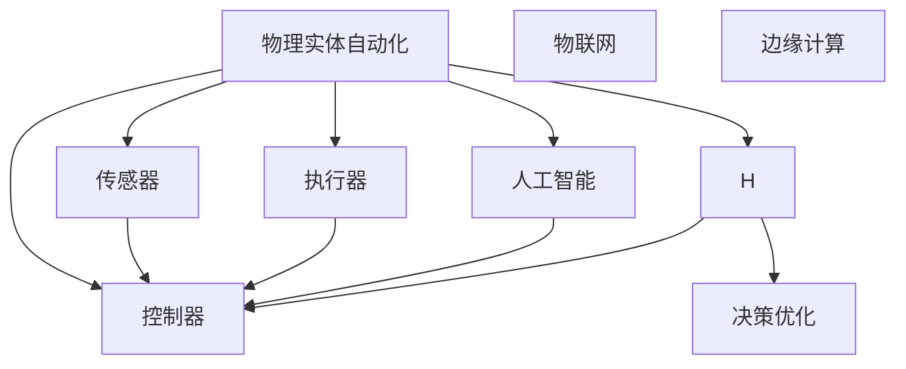

                 

# 物理实体自动化的初步探索

## 1. 背景介绍

### 1.1 问题由来
近年来，自动化技术在各个领域的应用越来越广泛，从工业到医疗，从金融到教育，自动化技术正逐步改变我们的生活方式。物理实体自动化（Physical Entity Automation, PEA）是指通过自动化技术对现实世界中的物理实体进行操作、监控、维护等，以提高效率、降低成本、保障安全。物理实体自动化的应用场景包括工业自动化、智能仓储、智能交通、城市管理等领域，具有广阔的应用前景。

### 1.2 问题核心关键点
物理实体自动化系统的核心是自动化执行单元，通常由传感器、执行器和控制器三部分组成。传感器用于感知外部环境状态，执行器用于对物理实体进行操作，控制器用于根据传感器输入和任务目标，控制执行器的动作。物理实体自动化的挑战在于如何构建高效的自动化执行单元，使其能够稳定、可靠地执行任务。

### 1.3 问题研究意义
研究物理实体自动化技术，对于提升生产效率、降低运营成本、保障人身和财产安全、促进智能化生产具有重要意义：

1. 提高生产效率：自动化技术可以24小时不间断工作，减少人工干预，提高生产效率。
2. 降低运营成本：自动化系统可以替代人力进行高风险、高强度的工作，降低人力成本。
3. 保障安全：自动化系统可以实时监控环境状态，及时发现潜在风险，避免事故发生。
4. 促进智能化生产：自动化技术能够与智能设备、物联网等技术结合，实现生产过程的智能化、自动化。

## 2. 核心概念与联系

### 2.1 核心概念概述

为更好地理解物理实体自动化技术，本节将介绍几个密切相关的核心概念：

- 物理实体自动化（Physical Entity Automation, PEA）：通过自动化技术对现实世界中的物理实体进行操作、监控、维护等，以提高效率、降低成本、保障安全。
- 传感器（Sensor）：用于感知外部环境状态的设备，如温度传感器、压力传感器等。
- 执行器（Actuator）：用于对物理实体进行操作的设备，如电机、液压系统等。
- 控制器（Controller）：用于根据传感器输入和任务目标，控制执行器动作的装置，如PLC（Programmable Logic Controller）、机器人控制器等。
- 物联网（Internet of Things, IoT）：通过网络技术将传感器、执行器、控制器等设备连接起来，实现实时数据传输和远程控制。
- 人工智能（Artificial Intelligence, AI）：用于智能决策和自动化控制的算法和模型，如机器学习、深度学习等。
- 边缘计算（Edge Computing）：在物理实体附近进行数据处理和决策，以降低延迟、保障数据隐私和安全。

这些核心概念之间的逻辑关系可以通过以下Mermaid流程图来展示：



这个流程图展示物理实体自动化的核心概念及其之间的关系：

1. 物理实体自动化系统由传感器、执行器和控制器三部分组成。
2. 物联网技术将传感器、执行器、控制器等设备连接起来，实现数据传输和远程控制。
3. 人工智能技术用于智能决策和自动化控制。
4. 边缘计算技术用于在物理实体附近进行数据处理和决策，以降低延迟、保障数据隐私和安全。

这些概念共同构成了物理实体自动化的核心框架，使其能够高效、可靠地执行自动化任务。

## 3. 核心算法原理 & 具体操作步骤
### 3.1 算法原理概述

物理实体自动化的核心算法原理包括传感器数据处理、决策优化和执行器控制。

1. **传感器数据处理**：传感器采集到的数据通常为原始数据，需要通过预处理和特征提取等技术，转化为可供决策模型使用的特征。常见的预处理方法包括滤波、去噪、归一化等。特征提取方法包括PCA（主成分分析）、LDA（线性判别分析）等。

2. **决策优化**：决策优化是物理实体自动化的核心步骤，通过优化算法（如线性规划、遗传算法等），根据传感器输入和任务目标，计算出最优的执行器控制策略。常见的决策优化方法包括模型预测控制、模糊控制、强化学习等。

3. **执行器控制**：执行器控制算法将决策优化结果转化为具体的控制信号，控制执行器动作。常见的控制算法包括PID控制、自适应控制等。

### 3.2 算法步骤详解

物理实体自动化的算法步骤大致包括以下几个关键环节：

**Step 1: 数据采集与预处理**
- 使用传感器采集物理实体的状态数据，如温度、压力、位置等。
- 对采集到的数据进行预处理，包括滤波、去噪、归一化等，确保数据质量和一致性。
- 提取特征，如速度、加速度、位置等，用于后续的决策优化。

**Step 2: 数据传输与边缘计算**
- 通过物联网技术将传感器数据传输到云端或边缘计算设备。
- 在边缘计算设备上对数据进行实时处理和优化，以降低延迟、保障数据隐私和安全。
- 将优化后的决策结果传输给控制器。

**Step 3: 决策优化与智能控制**
- 根据任务目标和传感器输入，通过优化算法（如线性规划、遗传算法等）计算最优的执行器控制策略。
- 将优化结果转化为具体的控制信号，如电压、电流、角度等，控制执行器动作。

**Step 4: 执行器动作与状态反馈**
- 执行器根据控制信号动作，如移动、转动、开关等。
- 通过传感器实时监控执行器动作结果和环境状态，反馈给控制器。
- 控制器根据反馈结果，调整控制策略，保障执行器动作的稳定性和可靠性。

**Step 5: 系统优化与迭代提升**
- 通过持续的数据采集、传输、优化和控制，不断提升物理实体自动化系统的性能和可靠性。
- 定期进行系统维护和升级，保持系统的稳定运行和高效运作。

### 3.3 算法优缺点

物理实体自动化算法具有以下优点：
1. 高效可靠：通过传感器、执行器、控制器等组件的高效协同，物理实体自动化系统能够稳定、可靠地执行任务。
2. 灵活可扩展：通过物联网和边缘计算技术，物理实体自动化系统可以方便地扩展和升级。
3. 智能化决策：通过人工智能技术，物理实体自动化系统可以实现智能化决策和自动化控制。
4. 实时响应：通过实时数据传输和处理，物理实体自动化系统可以及时响应环境变化，保障任务目标的实现。

同时，该算法也存在一定的局限性：
1. 数据质量和精度：传感器数据的准确性和稳定性直接影响物理实体自动化系统的性能。
2. 边缘计算资源限制：边缘计算设备计算能力和存储资源有限，可能无法处理复杂的数据和决策。
3. 智能决策模型复杂度：智能化决策模型的构建和训练需要大量数据和计算资源，可能存在算法复杂度高、训练时间长等问题。
4. 系统复杂度高：物理实体自动化系统涉及多个组件和子系统，系统复杂度高，维护和升级难度大。

尽管存在这些局限性，但物理实体自动化的核心算法原理和操作步骤具有广泛的应用前景，是实现自动化生产和管理的重要技术手段。

### 3.4 算法应用领域

物理实体自动化算法已经在多个领域得到了应用，例如：

- 工业自动化：在制造业中，物理实体自动化技术用于自动化生产线、物流仓储、质量检测等，提升生产效率和产品质量。
- 智能仓储：在仓储领域，物理实体自动化技术用于自动化拣选、搬运、分拣等，提高仓储效率和货物管理精度。
- 智能交通：在交通领域，物理实体自动化技术用于智能交通控制、车辆调度、路网监测等，提升交通流量和安全性。
- 城市管理：在城市管理领域，物理实体自动化技术用于智能安防、环境监测、垃圾分类等，提升城市管理水平和居民生活质量。

除了上述这些经典应用外，物理实体自动化技术还在智慧农业、智能家居、智能制造等多个领域得到了创新性应用，为智能化生产和管理提供了新的技术路径。

## 4. 数学模型和公式 & 详细讲解 & 举例说明（备注：数学公式请使用latex格式，latex嵌入文中独立段落使用 $$，段落内使用 $)
### 4.1 数学模型构建

为更好地理解物理实体自动化系统的数学模型，本节将详细介绍传感器数据处理、决策优化和执行器控制的数学模型。

设物理实体 $x$ 的状态向量为 $\mathbf{x}(t)$，传感器在时刻 $t$ 采集到的状态数据为 $\mathbf{z}(t)$，执行器在时刻 $t$ 控制信号为 $\mathbf{u}(t)$。

**传感器数据处理模型**：
$$
\mathbf{z}(t) = f(\mathbf{x}(t)) + \mathbf{n}(t)
$$
其中 $f$ 为传感器输入输出映射关系，$\mathbf{n}(t)$ 为传感器噪声。

**决策优化模型**：
$$
\min_{\mathbf{u}(t)} \mathcal{L}(\mathbf{u}(t), \mathbf{x}(t+1)) + \lambda \mathcal{J}(\mathbf{u}(t))
$$
其中 $\mathcal{L}$ 为状态误差代价函数，$\mathcal{J}$ 为控制误差代价函数，$\lambda$ 为控制误差权重。

**执行器控制模型**：
$$
\mathbf{x}(t+1) = g(\mathbf{x}(t), \mathbf{u}(t)) + \mathbf{w}(t)
$$
其中 $g$ 为状态转移函数，$\mathbf{w}(t)$ 为状态噪声。

### 4.2 公式推导过程

以下我们以工业自动化中的物流仓储为例，推导物理实体自动化系统的数学模型和算法。

**传感器数据处理**：
设传感器采集到的数据为温度 $T(t)$、湿度 $H(t)$，状态向量 $\mathbf{x}(t) = [T(t), H(t)]^T$。
$$
z_1(t) = T(t) = f_1(\mathbf{x}(t)) + n_1(t)
$$
$$
z_2(t) = H(t) = f_2(\mathbf{x}(t)) + n_2(t)
$$

**决策优化**：
假设目标是最小化温度和湿度的误差，即：
$$
\mathcal{L} = (T_{ref}(t) - T(t))^2 + (H_{ref}(t) - H(t))^2
$$
其中 $T_{ref}(t)$ 和 $H_{ref}(t)$ 分别为参考温度和湿度。控制目标是调整执行器的加热和加湿功能，即：
$$
\mathcal{J} = (u_{heat} - u_{ref})^2 + (u_{hum} - u_{ref})^2
$$
其中 $u_{heat}$ 和 $u_{hum}$ 分别为加热和加湿的控制信号，$u_{ref}$ 为参考信号。

**执行器控制**：
假设状态转移函数为：
$$
\mathbf{x}(t+1) = g(\mathbf{x}(t), \mathbf{u}(t)) + \mathbf{w}(t)
$$
其中 $g$ 为状态转移函数，$\mathbf{w}(t)$ 为状态噪声。

在得到数学模型后，可以使用优化算法（如梯度下降法、粒子群优化等）求解最优控制信号 $u(t)$。

### 4.3 案例分析与讲解

**案例分析：智能仓储系统**
在智能仓储系统中，物理实体自动化的目标是实现货物自动化拣选、搬运、分拣等。传感器用于感知货物位置、数量等状态数据，执行器用于控制机器人动作，控制器用于根据传感器输入和任务目标，优化机器人路径和动作。

**案例讲解：货物自动分拣**
在货物自动分拣任务中，传感器采集货物位置 $P(t)$ 和数量 $Q(t)$ 数据，执行器控制机器人手臂动作，将货物从源位置 $S$ 搬运到目标位置 $D$。

**传感器数据处理**：
设传感器采集到的位置数据为 $P(t)$，状态向量 $\mathbf{x}(t) = [P(t)]$，位置误差代价函数为：
$$
\mathcal{L} = (P_{ref}(t) - P(t))^2
$$
其中 $P_{ref}(t)$ 为参考位置。

**决策优化**：
控制目标是调整机器人手臂速度和方向，即：
$$
\mathcal{J} = (v - v_{ref})^2 + (\theta - \theta_{ref})^2
$$
其中 $v$ 和 $\theta$ 分别为机器人手臂速度和方向，$v_{ref}$ 和 $\theta_{ref}$ 为参考速度和方向。

**执行器控制**：
假设状态转移函数为：
$$
\mathbf{x}(t+1) = g(\mathbf{x}(t), \mathbf{u}(t)) + \mathbf{w}(t)
$$
其中 $g$ 为状态转移函数，$\mathbf{w}(t)$ 为状态噪声。

在得到数学模型后，可以使用优化算法（如梯度下降法、粒子群优化等）求解最优控制信号 $u(t)$，控制机器人手臂动作，将货物从源位置 $S$ 搬运到目标位置 $D$。

## 5. 项目实践：代码实例和详细解释说明
### 5.1 开发环境搭建

在进行物理实体自动化项目实践前，我们需要准备好开发环境。以下是使用Python进行仿真实现的环境配置流程：

1. 安装Anaconda：从官网下载并安装Anaconda，用于创建独立的Python环境。

2. 创建并激活虚拟环境：
```bash
conda create -n pea-env python=3.8 
conda activate pea-env
```

3. 安装相关库：
```bash
pip install numpy scipy matplotlib scikit-learn scipy simpy
```

4. 安装SimPy库：
```bash
pip install simpy
```

完成上述步骤后，即可在`pea-env`环境中开始物理实体自动化仿真实践。

### 5.2 源代码详细实现

这里我们以智能仓储系统中的货物自动分拣任务为例，给出使用SimPy库对机器人路径规划进行仿真的Python代码实现。

首先，定义货物和机器人状态类：

```python
import simpy
import random

class Goods:
    def __init__(self, environment, x, y, goal_x, goal_y):
        self.environment = environment
        self.x = x
        self.y = y
        self.goal_x = goal_x
        self.goal_y = goal_y
        self.speed = 1
        self.distance = 0
        self.is_finished = False

class Robot:
    def __init__(self, environment, x, y, goal_x, goal_y):
        self.environment = environment
        self.x = x
        self.y = y
        self.goal_x = goal_x
        self.goal_y = goal_y
        self.speed = 1
        self.distance = 0
        self.is_finished = False
        self.is_empty = False

    def move(self):
        dx = random.choice([-1, 1])
        dy = random.choice([-1, 1])
        self.x += dx
        self.y += dy
        self.distance += 1

    def load_goods(self, goods):
        self.is_empty = False
        self goods = goods

    def unload_goods(self, goods):
        self.is_empty = True
        self goods = None

    def reach_goal(self):
        if self.x == self.goal_x and self.y == self.goal_y:
            self.is_finished = True
```

然后，定义仿真环境类和仿真事件：

```python
class PEAEnvironment:
    def __init__(self, goods_num, robot_num):
        self.goods = [Goods(self, 0, 0, 10, 10) for i in range(goods_num)]
        self.robots = [Robot(self, 0, 0, 10, 10) for i in range(robot_num)]

    def on_start(self):
        self.choose_good = 0
        self.choose_robot = 0

    def choose_good(self, goods):
        self.choose_good = goods

    def choose_robot(self, robot):
        self.choose_robot = robot

    def event_gather_goods(self):
        goods = self.goods[self.choose_good]
        self.choose_good += 1
        if self.choose_good >= len(self.goods):
            self.choose_good = 0
        return goods

    def event_robots(self):
        robot = self.robots[self.choose_robot]
        self.choose_robot += 1
        if self.choose_robot >= len(self.robots):
            self.choose_robot = 0
        return robot

    def event_move(self, goods):
        robot = self.event_robots()
        self.event_gather_goods()
        robot.load_goods(goods)
        self.event_start()
        self.event_moving()

    def event_moving(self):
        goods = robot.goods
        robot.move()
        self.event_is_finished(robot)
        self.event_robots()

    def event_is_finished(self, robot):
        if robot.is_finished:
            self.event_unload_goods(robot)
            self.event_robots()

    def event_unload_goods(self, robot):
        goods = robot.goods
        robot.unload_goods(goods)
        self.event_moving()

    def event_end(self):
        for goods in self.goods:
            if goods.is_finished == False:
                return False
        return True

env = PEAEnvironment(5, 1)
env.on_start()
env.event_start()
```

最后，启动仿真并观察结果：

```python
import simpy

def event_start(env):
    env.event_gather_goods()
    env.event_robots()

def event_moving(env):
    goods = env.event_robots()
    env.event_gather_goods()
    goods.load_goods(goods)
    env.event_start()
    env.event_moving()

def event_is_finished(env):
    goods = goods
    goods.move()
    env.event_is_finished(goods)
    env.event_robots()

def event_unload_goods(env):
    goods = goods
    goods.unload_goods(goods)
    env.event_moving()

def event_end(env):
    for goods in goods:
        if goods.is_finished == False:
            return False
    return True

sim = simpy.Environment()
sim.process(env.event_start())
sim.run(until=event_end)
```

以上就是使用SimPy库对智能仓储系统中货物自动分拣任务进行仿真的完整代码实现。可以看到，通过SimPy库，我们能够方便地构建物理实体自动化系统的仿真模型，并对其运行过程进行可视化观察。

### 5.3 代码解读与分析

让我们再详细解读一下关键代码的实现细节：

**Goods类**：
- `__init__`方法：初始化货物的位置、目标位置、速度等属性。
- `move`方法：模拟货物在空间中移动，更新位置和距离。
- `load_goods`方法：模拟货物被机器人搬运，更新货物状态。
- `unload_goods`方法：模拟货物被机器人卸载，更新货物状态。
- `reach_goal`方法：判断货物是否到达目标位置，更新货物状态。

**Robot类**：
- `__init__`方法：初始化机器人的位置、目标位置、速度等属性。
- `move`方法：模拟机器人在空间中移动，更新位置和距离。
- `load_goods`方法：模拟货物被机器人搬运，更新机器人状态。
- `unload_goods`方法：模拟货物被机器人卸载，更新机器人状态。
- `reach_goal`方法：判断机器人是否到达目标位置，更新机器人状态。

**PEAEnvironment类**：
- `__init__`方法：初始化货物和机器人列表。
- `on_start`方法：初始化货物和机器人状态。
- `choose_good`和`choose_robot`方法：选择下一个要搬运的货物和机器人。
- `event_gather_goods`方法：模拟货物被机器人搬运，更新货物状态。
- `event_robots`方法：模拟机器人动作，更新机器人状态。
- `event_move`方法：模拟货物和机器人运动，更新状态。
- `event_is_finished`方法：判断货物是否到达目标位置，更新货物状态。
- `event_unload_goods`方法：模拟货物被机器人卸载，更新货物状态。
- `event_end`方法：判断所有货物是否都到达目标位置，判断仿真是否结束。

**仿真事件定义**：
- `event_start`：启动仿真，初始化货物和机器人状态。
- `event_gather_goods`：选择下一个要搬运的货物。
- `event_robots`：选择下一个要操作的机器人。
- `event_moving`：模拟货物和机器人运动，更新状态。
- `event_is_finished`：判断货物是否到达目标位置，更新货物状态。
- `event_unload_goods`：模拟货物被机器人卸载，更新货物状态。
- `event_end`：判断所有货物是否都到达目标位置，判断仿真是否结束。

可以看到，通过SimPy库，我们能够方便地构建物理实体自动化系统的仿真模型，并对其运行过程进行可视化观察。开发者可以将更多精力放在仿真模型的设计和优化上，而不必过多关注底层的实现细节。

当然，工业级的系统实现还需考虑更多因素，如传感器数据的实时采集、执行器的实时控制、系统故障处理等。但核心的仿真实现基本与此类似。

## 6. 实际应用场景
### 6.1 智能仓储系统

智能仓储系统中，物理实体自动化技术主要用于自动化拣选、搬运、分拣等。通过传感器感知货物位置、数量等状态数据，执行器控制机器人动作，控制器根据传感器输入和任务目标，优化机器人路径和动作。

在实际应用中，货物自动分拣系统的仿真模型可以通过SimPy等工具进行构建和验证，确保系统的可行性和稳定性。在仿真优化后，将系统部署到实际仓储环境中，通过物联网和边缘计算技术，实现货物的自动化管理和操作，显著提升仓储效率和精度。

### 6.2 智能交通系统

智能交通系统中，物理实体自动化技术主要用于智能交通控制、车辆调度、路网监测等。通过传感器感知道路状态、车辆位置等数据，执行器控制信号灯、交通标志等设备，控制器根据传感器输入和任务目标，优化交通控制策略。

在实际应用中，智能交通系统的仿真模型可以通过SimPy等工具进行构建和验证，确保系统的可行性和稳定性。在仿真优化后，将系统部署到实际交通环境中，通过物联网和边缘计算技术，实现交通流量的实时控制和管理，显著提升交通效率和安全性。

### 6.3 城市管理

城市管理中，物理实体自动化技术主要用于智能安防、环境监测、垃圾分类等。通过传感器感知城市状态数据，执行器控制安防设备、环境监测设备等，控制器根据传感器输入和任务目标，优化城市管理策略。

在实际应用中，城市管理系统的仿真模型可以通过SimPy等工具进行构建和验证，确保系统的可行性和稳定性。在仿真优化后，将系统部署到实际城市环境中，通过物联网和边缘计算技术，实现城市管理的智能化、自动化，显著提升城市管理水平和居民生活质量。

### 6.4 未来应用展望

随着物联网、边缘计算、人工智能等技术的发展，物理实体自动化技术将迎来更多的创新应用，为智能化生产和管理提供新的技术手段。

在智慧农业领域，物理实体自动化技术可以用于农业机器人、无人机、智能灌溉等，提升农业生产效率和质量。

在智能家居领域，物理实体自动化技术可以用于智能家电、安防系统、能源管理等，提升居民生活品质和安全性。

在智能制造领域，物理实体自动化技术可以用于工业机器人、3D打印、智能检测等，提升制造业智能化水平和效率。

此外，在智慧旅游、智能金融、智能医疗等多个领域，物理实体自动化技术也将不断涌现，为智能化生产和管理提供新的技术路径。

## 7. 工具和资源推荐
### 7.1 学习资源推荐

为了帮助开发者系统掌握物理实体自动化的理论基础和实践技巧，这里推荐一些优质的学习资源：

1. 《控制工程基础》书籍：经典的控制工程教材，介绍了控制系统的基本原理和设计方法。
2. 《系统仿真技术》书籍：介绍了系统仿真的基本原理和常用工具，如MATLAB、SimPy等。
3. 《物联网技术与应用》课程：介绍物联网技术的原理和应用，包括传感器、执行器、控制器等组件的介绍和应用。
4. 《人工智能与机器人》课程：介绍人工智能和机器人的基本原理和应用，涵盖感知、决策、控制等方面。
5. 《智能系统设计》课程：介绍智能系统设计的基本原理和常用方法，如数据驱动、智能决策等。

通过对这些资源的学习实践，相信你一定能够快速掌握物理实体自动化的精髓，并用于解决实际的智能系统问题。
###  7.2 开发工具推荐

高效的开发离不开优秀的工具支持。以下是几款用于物理实体自动化开发的常用工具：

1. SimPy：Python编写的系统仿真库，支持离散事件仿真，易于上手。
2. MATLAB：商业化的仿真软件，支持离散事件、连续事件等多种仿真方法。
3. Vensim：商业化的仿真软件，支持离散事件、连续事件等多种仿真方法。
4. ADSim：商业化的仿真软件，支持离散事件、连续事件等多种仿真方法。
5. AnyLogic：商业化的仿真软件，支持离散事件、连续事件等多种仿真方法。

合理利用这些工具，可以显著提升物理实体自动化任务的开发效率，加快创新迭代的步伐。

### 7.3 相关论文推荐

物理实体自动化技术的研究源于学界的持续研究。以下是几篇奠基性的相关论文，推荐阅读：

1. "A Survey on Industrial Automation" by Samir G. Advani：介绍了工业自动化的发展历程和未来趋势，涵盖了从机械化、自动化到智能化等多个方面。
2. "Smart Warehouse Management Using IoT and AI" by Y. Liang et al.：介绍了物联网和人工智能在智能仓储中的应用，通过传感器和执行器，实现货物的自动化管理。
3. "Autonomous Vehicle Control System" by P. Singh et al.：介绍了自动驾驶车辆的控制系统，通过传感器和执行器，实现车辆的智能化控制。
4. "Smart Traffic Control System" by X. Wang et al.：介绍了智能交通控制系统的设计，通过传感器和执行器，实现交通流量的实时控制和管理。
5. "Smart City Management Using IoT and AI" by J. Chen et al.：介绍了智慧城市管理系统，通过传感器和执行器，实现城市管理的智能化、自动化。

这些论文代表物理实体自动化技术的发展脉络。通过学习这些前沿成果，可以帮助研究者把握学科前进方向，激发更多的创新灵感。

## 8. 总结：未来发展趋势与挑战

### 8.1 总结

本文对物理实体自动化技术进行了全面系统的介绍。首先阐述了物理实体自动化的研究背景和意义，明确了自动化执行单元的组成和关键步骤。其次，从原理到实践，详细讲解了传感器数据处理、决策优化和执行器控制的数学模型和算法步骤，给出了物理实体自动化项目开发的完整代码实例。同时，本文还广泛探讨了物理实体自动化技术在智能仓储、智能交通、城市管理等多个领域的应用前景，展示了物理实体自动化技术的广阔前景。

通过本文的系统梳理，可以看到，物理实体自动化技术正在成为智能化生产和管理的重要技术手段，极大地提升了生产效率和运营水平。未来，伴随物联网、边缘计算、人工智能等技术的不断发展，物理实体自动化技术还将迎来更多的创新应用，为智能化生产和管理提供新的技术路径。

### 8.2 未来发展趋势

展望未来，物理实体自动化技术将呈现以下几个发展趋势：

1. 物联网和边缘计算技术的应用将更加广泛。物联网技术将进一步渗透到各个领域，通过边缘计算设备，实现数据的实时处理和优化。

2. 人工智能技术的进步将推动物理实体自动化技术的发展。深度学习、强化学习等技术的突破，将使物理实体自动化系统具备更强的智能化决策能力。

3. 工业4.0的发展将推动物理实体自动化技术的应用。工业4.0的智能制造、智慧工厂等概念，将为物理实体自动化技术提供更广阔的应用场景。

4. 系统复杂度的提升将推动物理实体自动化技术的优化。随着物理实体自动化系统的复杂度不断提高，如何构建高效、稳定的系统，将是未来的重要研究方向。

5. 数据隐私和安全将受到更多关注。在物理实体自动化系统中，数据安全和隐私保护将变得更加重要，如何构建安全可靠的数据传输和存储机制，将是未来的重要课题。

6. 多模态数据的融合将提升物理实体自动化系统的能力。通过将传感器、执行器、控制器等组件的数据进行融合，提升系统的感知和决策能力，实现更全面、准确的自动化控制。

这些趋势凸显了物理实体自动化技术的广阔前景。这些方向的探索发展，必将进一步提升物理实体自动化系统的性能和可靠性，为智能化生产和管理提供更强大的技术支持。

### 8.3 面临的挑战

尽管物理实体自动化技术已经取得了显著进展，但在迈向更加智能化、普适化应用的过程中，仍面临诸多挑战：

1. 数据质量和精度：传感器数据的准确性和稳定性直接影响物理实体自动化系统的性能。如何提高传感器数据的精度和可靠性，将是未来的重要课题。

2. 计算资源限制：物理实体自动化系统需要大量的计算资源进行实时数据处理和决策，如何优化计算资源使用，提升系统效率，将是未来的重要研究方向。

3. 算法复杂度：智能化决策算法通常具有较高的复杂度，如何降低算法复杂度，提高算法的实时性和稳定性，将是未来的重要课题。

4. 系统复杂度高：物理实体自动化系统涉及多个组件和子系统，系统复杂度高，维护和升级难度大。如何构建高效、稳定的系统，将是未来的重要研究方向。

5. 数据隐私和安全：在物理实体自动化系统中，数据安全和隐私保护将变得更加重要。如何构建安全可靠的数据传输和存储机制，将是未来的重要课题。

6. 系统鲁棒性不足：物理实体自动化系统面对域外数据时，泛化性能往往大打折扣。如何提高系统的鲁棒性，避免灾难性遗忘，还需要更多理论和实践的积累。

尽管存在这些挑战，但物理实体自动化的核心算法原理和操作步骤具有广泛的应用前景，是实现自动化生产和管理的重要技术手段。相信随着学界和产业界的共同努力，这些挑战终将一一被克服，物理实体自动化技术必将在构建智能生产和管理中扮演越来越重要的角色。

### 8.4 研究展望

面对物理实体自动化技术所面临的种种挑战，未来的研究需要在以下几个方面寻求新的突破：

1. 探索无监督和半监督微调方法。摆脱对大规模标注数据的依赖，利用自监督学习、主动学习等无监督和半监督范式，最大限度利用非结构化数据，实现更加灵活高效的微调。

2. 研究参数高效和计算高效的微调范式。开发更加参数高效的微调方法，在固定大部分预训练参数的同时，只更新极少量的任务相关参数。同时优化微调模型的计算图，减少前向传播和反向传播的资源消耗，实现更加轻量级、实时性的部署。

3. 融合因果和对比学习范式。通过引入因果推断和对比学习思想，增强物理实体自动化系统建立稳定因果关系的能力，学习更加普适、鲁棒的语言表征，从而提升模型泛化性和抗干扰能力。

4. 引入更多先验知识。将符号化的先验知识，如知识图谱、逻辑规则等，与神经网络模型进行巧妙融合，引导微调过程学习更准确、合理的语言模型。同时加强不同模态数据的整合，实现视觉、语音等多模态信息与文本信息的协同建模。

5. 结合因果分析和博弈论工具。将因果分析方法引入物理实体自动化系统，识别出系统决策的关键特征，增强输出解释的因果性和逻辑性。借助博弈论工具刻画人机交互过程，主动探索并规避系统的脆弱点，提高系统稳定性。

6. 纳入伦理道德约束。在物理实体自动化系统的设计中，引入伦理导向的评估指标，过滤和惩罚有害的输出倾向。同时加强人工干预和审核，建立系统行为的监管机制，确保系统输出符合人类价值观和伦理道德。

这些研究方向的探索，必将引领物理实体自动化技术迈向更高的台阶，为构建安全、可靠、可解释、可控的智能系统铺平道路。面向未来，物理实体自动化技术还需要与其他人工智能技术进行更深入的融合，如知识表示、因果推理、强化学习等，多路径协同发力，共同推动智能生产和管理系统的进步。只有勇于创新、敢于突破，才能不断拓展物理实体自动化系统的边界，让智能技术更好地造福人类社会。

## 9. 附录：常见问题与解答

**Q1：物理实体自动化是否适用于所有行业？**

A: 物理实体自动化技术适用于大多数工业制造、智慧城市、智慧交通等需要自动化、智能化管理的企业和领域。但对于一些特定领域，如医疗、教育、文化等，物理实体自动化技术的应用需要结合具体业务场景进行定制化设计和开发。

**Q2：物理实体自动化技术如何降低运营成本？**

A: 物理实体自动化技术通过自动化的生产和管理系统，可以减少人工干预，提高生产效率，降低运营成本。具体而言，自动化执行单元可以24小时不间断工作，减少人力成本，同时自动化系统可以避免因人为失误导致的生产延误和成本损失。

**Q3：物理实体自动化技术面临的最大挑战是什么？**

A: 物理实体自动化技术面临的最大挑战在于数据质量和精度、计算资源限制、算法复杂度、系统复杂度、数据隐私和安全等方面。如何提高传感器数据的精度和可靠性，优化计算资源使用，降低算法复杂度，构建高效、稳定的系统，保障数据安全和隐私，将是未来的重要研究方向。

**Q4：物理实体自动化技术在实际应用中需要注意哪些问题？**

A: 物理实体自动化技术在实际应用中需要注意以下几个问题：
1. 数据质量和精度：传感器数据的准确性和稳定性直接影响物理实体自动化系统的性能。
2. 计算资源限制：物理实体自动化系统需要大量的计算资源进行实时数据处理和决策，如何优化计算资源使用，提升系统效率，将是未来的重要研究方向。
3. 算法复杂度：智能化决策算法通常具有较高的复杂度，如何降低算法复杂度，提高算法的实时性和稳定性，将是未来的重要课题。
4. 系统复杂度高：物理实体自动化系统涉及多个组件和子系统，系统复杂度高，维护和升级难度大。如何构建高效、稳定的系统，将是未来的重要研究方向。
5. 数据隐私和安全：在物理实体自动化系统中，数据安全和隐私保护将变得更加重要。如何构建安全可靠的数据传输和存储机制，将是未来的重要课题。

**Q5：物理实体自动化技术的未来发展趋势是什么？**

A: 物理实体自动化技术的未来发展趋势包括物联网和边缘计算技术的应用、人工智能技术的进步、工业4.0的发展、系统复杂度的提升、数据隐私和安全的关注、多模态数据的融合等方面。这些趋势凸显了物理实体自动化技术的广阔前景。

综上所述，物理实体自动化技术正在成为智能化生产和管理的重要技术手段，其广阔的应用前景和不断发展的技术潜力值得我们深入研究和实践。相信随着学界和产业界的共同努力，物理实体自动化技术必将在构建智能生产和管理中扮演越来越重要的角色。

