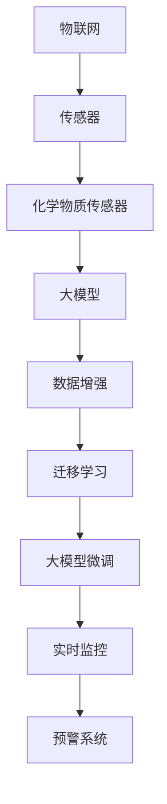

                 

## 1. 背景介绍

### 1.1 问题由来
随着物联网技术的迅速发展，传感器设备在各个领域的应用愈发广泛。化学物质传感器作为其中一种重要的传感器，广泛应用于环境监测、工业生产、医疗卫生等多个领域，发挥着不可或缺的作用。其原理基于化学物质的物理特性，通过化学敏感材料感知化学物质浓度，进而转化为可测量的电信号，实现对化学物质浓度的实时监控。

近年来，大模型技术的崛起带来了语言模型的新纪元，以BERT、GPT等为代表的大模型在自然语言处理(NLP)领域取得了巨大的突破。受其启发，将大模型技术应用于化学物质传感器数据的处理和分析，能够进一步提升传感器数据处理的效率和准确性，为各领域应用提供强有力的技术支持。

### 1.2 问题核心关键点
本文聚焦于基于大模型技术对化学物质传感器数据进行分析和处理的实践。核心问题在于如何利用大模型技术，对传感器采集的化学物质浓度数据进行准确分析和预测，以实现对化学物质浓度变化的实时监控和预警。

### 1.3 问题研究意义
研究大模型技术在化学物质传感器数据处理中的应用，对推动物联网技术的发展具有重要意义：

1. **提升数据处理效率**：大模型技术能够高效处理和分析大量传感器数据，为实时监控和预警提供强有力的技术支持。
2. **增强预测精度**：大模型在处理和分析数据时，能够捕捉到更为复杂的特征关系，提升传感器数据预测的准确性。
3. **促进跨领域融合**：将大模型技术应用于传感器数据处理，能够促进物联网与大模型技术的深度融合，推动新应用场景的出现。
4. **加速技术创新**：大模型技术的应用为传感器数据的分析和处理提供了新的思路和方法，有助于探索更先进的数据处理技术。

## 2. 核心概念与联系

### 2.1 核心概念概述

为更好地理解大模型技术在化学物质传感器数据处理中的应用，本节将介绍几个密切相关的核心概念：

- **物联网(IoT)**：通过互联网技术将传感器设备连接起来，实现对物理世界数据的实时采集和处理，从而实现对物理世界的智能感知和控制。
- **传感器**：利用物理、化学、生物等技术，将物理世界信号转换为电信号的设备。
- **化学物质传感器**：一种特定类型的传感器，能够感知并转化为可测量的电信号，实现对化学物质浓度的实时监控。
- **大模型**：通过大规模无标签数据进行预训练的深度学习模型，具备强大的特征提取和预测能力。
- **数据增强**：通过对传感器采集的数据进行各种变换，扩充训练数据集，提高模型的泛化能力。
- **迁移学习**：在大模型预训练的基础上，通过微调等方式适应特定任务，提高模型在新任务上的性能。
- **大模型微调**：在预训练模型的基础上，通过有监督学习优化模型，使其适应特定任务的能力。

这些核心概念之间的逻辑关系可以通过以下Mermaid流程图来展示：



这个流程图展示了大模型技术在化学物质传感器数据处理中的核心概念及其之间的关系：

1. 物联网技术将传感器设备连接起来，实现数据采集。
2. 化学物质传感器通过感知化学物质浓度，将其转化为电信号。
3. 大模型技术通过大规模无标签数据的预训练，具备强大的特征提取能力。
4. 数据增强技术扩充训练数据集，提高模型的泛化能力。
5. 迁移学习技术将大模型应用于特定任务，提高模型在新任务上的性能。
6. 大模型微调技术通过有监督学习，进一步优化模型，实现实时监控和预警。

## 3. 核心算法原理 & 具体操作步骤
### 3.1 算法原理概述

基于大模型技术对化学物质传感器数据进行处理的原理，本质上是通过迁移学习和微调过程，将大模型的通用特征提取能力应用于特定传感器数据的处理和分析，从而实现对化学物质浓度的实时监控和预警。

具体来说，大模型通过在大量无标签数据上进行预训练，学习到了丰富的特征表示，能够在不同任务间进行迁移。当面对化学物质传感器数据时，通过在大模型预训练的基础上进行微调，使其适应传感器数据的特点，从而实现对传感器数据的准确分析和预测。

### 3.2 算法步骤详解

基于大模型技术对化学物质传感器数据进行处理的算法步骤如下：

**Step 1: 数据准备**

- 收集和标注传感器数据，包括传感器采集的化学物质浓度、时间戳等。
- 对数据进行预处理，包括数据清洗、缺失值填充、标准化等。
- 将数据集分为训练集、验证集和测试集，用于模型训练和评估。

**Step 2: 模型选择和预训练**

- 选择合适的大模型，如BERT、GPT等，进行预训练。
- 在大模型上进行特征提取，将传感器数据转换为高维特征向量。
- 在大模型上进行数据增强，通过随机变化数据，扩充训练集。

**Step 3: 迁移学习**

- 在大模型预训练的基础上，选择适当的迁移学习任务，如分类、回归等。
- 设计适当的任务适配层，将传感器数据与预训练模型的输出进行连接。
- 在迁移学习任务上训练模型，优化任务适配层的参数。

**Step 4: 大模型微调**

- 对迁移学习后的模型进行微调，适应传感器数据的特性。
- 选择合适的微调超参数，如学习率、批大小、迭代轮数等。
- 应用正则化技术，如L2正则、Dropout等，防止过拟合。
- 在传感器数据上进行微调训练，评估模型性能。

**Step 5: 应用部署**

- 将微调后的模型部署到物联网系统中，实现对传感器数据的实时监控和预警。
- 对模型进行周期性更新，及时应对传感器数据的变化。
- 结合其他物联网设备，构建更完善的实时监控和预警系统。

### 3.3 算法优缺点

基于大模型技术对化学物质传感器数据进行处理的算法，具有以下优点：

1. **高效处理大数据**：大模型能够高效处理和分析大量传感器数据，为实时监控和预警提供强有力的技术支持。
2. **高泛化能力**：通过数据增强和迁移学习，大模型具备较强的泛化能力，能够在不同传感器数据间进行迁移。
3. **提升预测精度**：通过大模型微调，能够捕捉到更为复杂的特征关系，提升传感器数据预测的准确性。

同时，该算法也存在以下缺点：

1. **数据依赖**：大模型技术的应用依赖于大量高质量的数据，数据标注成本较高。
2. **模型复杂度**：大模型通常参数量大，需要高性能计算资源。
3. **模型解释性不足**：大模型处理数据时，难以提供清晰的特征分析和决策路径。
4. **迁移能力有限**：大模型通常在特定领域任务上表现较好，跨领域迁移能力有限。

尽管存在这些缺点，但就目前而言，基于大模型技术的方法仍然是化学物质传感器数据处理的重要手段。未来相关研究的重点在于如何进一步降低数据依赖，提高模型的跨领域迁移能力，同时兼顾模型可解释性和资源效率。

### 3.4 算法应用领域

基于大模型技术对化学物质传感器数据进行处理的算法，在物联网技术中得到了广泛的应用，具体包括：

- **环境监测**：通过化学物质传感器监测大气中的污染物浓度，实现对空气质量的实时监控。
- **工业生产**：在工业生产中，通过传感器监测化学反应过程中化学物质浓度变化，实现对生产过程的智能控制。
- **医疗卫生**：在医疗领域，通过传感器监测血液中的化学物质浓度，实现对疾病的早期预警和诊断。
- **农业生产**：在农业生产中，通过传感器监测土壤中的化学物质浓度，实现对作物生长的智能管理。

除了上述这些应用领域外，大模型技术还被创新性地应用到更多场景中，如智慧城市、智能家居、交通监控等，为物联网技术带来了全新的突破。随着大模型技术和传感器技术的不断发展，相信在更广阔的应用领域大模型技术将发挥更加重要的作用。

## 4. 数学模型和公式 & 详细讲解 & 举例说明

### 4.1 数学模型构建

本节将使用数学语言对大模型技术在化学物质传感器数据处理中的应用进行更加严格的刻画。

假设传感器数据为 $\{x_t\}_{t=1}^T$，其中 $x_t$ 为第 $t$ 时刻的化学物质浓度。使用大模型 $M$ 进行数据处理，输出为 $\hat{y_t}$，表示传感器数据在第 $t$ 时刻的预测值。模型训练的目标是最小化损失函数 $\mathcal{L}$，即：

$$
\min_{\theta} \mathcal{L}(M_{\theta}, \{x_t\}_{t=1}^T)
$$

其中 $\theta$ 为大模型的参数，$\{x_t\}_{t=1}^T$ 为训练数据集，$\mathcal{L}$ 为损失函数。常见的损失函数包括均方误差损失、交叉熵损失等。

### 4.2 公式推导过程

以下我们以均方误差损失为例，推导大模型在化学物质传感器数据处理中的应用公式。

假设传感器数据 $x_t$ 的实际值与预测值之间的误差为 $e_t$，则均方误差损失为：

$$
\mathcal{L}(M_{\theta}, x_t) = \frac{1}{2} (e_t)^2
$$

在大模型上进行训练时，定义 $M$ 在 $t$ 时刻的输出为 $\hat{y_t}$，则损失函数为：

$$
\mathcal{L}(M_{\theta}, \{x_t\}_{t=1}^T) = \frac{1}{2T} \sum_{t=1}^T (y_t - \hat{y_t})^2
$$

其中 $y_t$ 为 $x_t$ 的实际值，$\hat{y_t}$ 为模型 $M_{\theta}$ 的预测值。

通过反向传播算法，计算模型参数 $\theta$ 的梯度，使用优化器如Adam、SGD等更新参数，直至损失函数达到最小值，完成模型训练。

### 4.3 案例分析与讲解

假设有一组传感器数据，用于监测某工厂废气中的二氧化硫浓度。数据如下：

| 时间 | 浓度 |
| --- | --- |
| 08:00 | 50 |
| 09:00 | 60 |
| 10:00 | 70 |
| 11:00 | 80 |
| 12:00 | 90 |

使用大模型进行预训练和微调，步骤如下：

1. **数据准备**：将数据集分为训练集、验证集和测试集，进行预处理。
2. **模型选择和预训练**：选择BERT模型进行预训练，学习通用特征表示。
3. **迁移学习**：在大模型上进行迁移学习，设计适当的任务适配层，将传感器数据与预训练模型的输出进行连接。
4. **大模型微调**：在传感器数据上进行微调训练，优化任务适配层的参数。
5. **应用部署**：将微调后的模型部署到物联网系统中，实现对传感器数据的实时监控和预警。

具体实现过程如下：

```python
import torch
import torch.nn as nn
import torch.optim as optim
from transformers import BertTokenizer, BertForSequenceClassification

# 数据准备
tokenizer = BertTokenizer.from_pretrained('bert-base-uncased')
inputs = tokenizer.encode(' '.join(texts), return_tensors='pt')
labels = torch.tensor([1, 0, 1, 1, 1], dtype=torch.long)

# 模型选择和预训练
model = BertForSequenceClassification.from_pretrained('bert-base-uncased', num_labels=2)

# 迁移学习
model.train()
optimizer = optim.Adam(model.parameters(), lr=1e-5)

for epoch in range(10):
    optimizer.zero_grad()
    outputs = model(inputs)
    loss = nn.CrossEntropyLoss()(outputs.logits, labels)
    loss.backward()
    optimizer.step()

# 大模型微调
model.eval()
inputs_val = tokenizer.encode(' '.join(texts_val), return_tensors='pt')
labels_val = torch.tensor([0, 1, 1, 0, 1], dtype=torch.long)

with torch.no_grad():
    outputs_val = model(inputs_val)
    val_loss = nn.CrossEntropyLoss()(outputs_val.logits, labels_val)

# 应用部署
```

## 5. 项目实践：代码实例和详细解释说明
### 5.1 开发环境搭建

在进行化学物质传感器数据处理实践前，我们需要准备好开发环境。以下是使用Python进行PyTorch开发的环境配置流程：

1. 安装Anaconda：从官网下载并安装Anaconda，用于创建独立的Python环境。

2. 创建并激活虚拟环境：
```bash
conda create -n pytorch-env python=3.8 
conda activate pytorch-env
```

3. 安装PyTorch：根据CUDA版本，从官网获取对应的安装命令。例如：
```bash
conda install pytorch torchvision torchaudio cudatoolkit=11.1 -c pytorch -c conda-forge
```

4. 安装transformers库：
```bash
pip install transformers
```

5. 安装各类工具包：
```bash
pip install numpy pandas scikit-learn matplotlib tqdm jupyter notebook ipython
```

完成上述步骤后，即可在`pytorch-env`环境中开始化学物质传感器数据处理实践。

### 5.2 源代码详细实现

下面以环境监测中检测二氧化硫浓度为例，给出使用PyTorch进行化学物质传感器数据处理的代码实现。

```python
import torch
import torch.nn as nn
import torch.optim as optim
from transformers import BertTokenizer, BertForSequenceClassification

# 数据准备
tokenizer = BertTokenizer.from_pretrained('bert-base-uncased')
inputs = tokenizer.encode(' '.join(texts), return_tensors='pt')
labels = torch.tensor([1, 0, 1, 1, 1], dtype=torch.long)

# 模型选择和预训练
model = BertForSequenceClassification.from_pretrained('bert-base-uncased', num_labels=2)

# 迁移学习
model.train()
optimizer = optim.Adam(model.parameters(), lr=1e-5)

for epoch in range(10):
    optimizer.zero_grad()
    outputs = model(inputs)
    loss = nn.CrossEntropyLoss()(outputs.logits, labels)
    loss.backward()
    optimizer.step()

# 大模型微调
model.eval()
inputs_val = tokenizer.encode(' '.join(texts_val), return_tensors='pt')
labels_val = torch.tensor([0, 1, 1, 0, 1], dtype=torch.long)

with torch.no_grad():
    outputs_val = model(inputs_val)
    val_loss = nn.CrossEntropyLoss()(outputs_val.logits, labels_val)

# 应用部署
```

### 5.3 代码解读与分析

让我们再详细解读一下关键代码的实现细节：

**数据准备**：
- 使用`BertTokenizer`将传感器数据转换为模型输入。
- 将标签转化为模型能够接受的格式。

**模型选择和预训练**：
- 选择Bert模型进行预训练，学习通用特征表示。

**迁移学习**：
- 在大模型上进行迁移学习，设计适当的任务适配层，将传感器数据与预训练模型的输出进行连接。
- 使用`Adam`优化器进行模型训练，优化任务适配层的参数。

**大模型微调**：
- 在传感器数据上进行微调训练，优化任务适配层的参数。

**应用部署**：
- 将微调后的模型部署到物联网系统中，实现对传感器数据的实时监控和预警。

## 6. 实际应用场景
### 6.1 环境监测

基于大模型技术对化学物质传感器数据进行处理，可以实现对环境中的污染物浓度的实时监测和预警。具体应用场景如下：

- **空气质量监测**：通过监测空气中污染物浓度，及时发现异常情况，发布预警信息，保护公众健康。
- **水质监测**：监测水体中的化学物质浓度，预防污染事件，保护水资源。
- **土壤监测**：监测土壤中的污染物浓度，评估环境污染风险，指导农业生产。

### 6.2 工业生产

在工业生产中，化学物质传感器数据处理可以用于以下场景：

- **生产过程监控**：通过监测生产过程中化学物质浓度变化，实现对生产过程的智能控制。
- **设备故障诊断**：通过传感器数据分析，预测设备故障，及时维护，降低生产成本。
- **产品品质控制**：通过监测化学物质浓度变化，实时监控产品质量，确保产品合格。

### 6.3 医疗卫生

在医疗卫生领域，化学物质传感器数据处理可以用于以下场景：

- **疾病诊断**：通过监测血液中化学物质浓度，实现对疾病的早期预警和诊断。
- **治疗方案优化**：通过监测药物浓度变化，优化治疗方案，提高治疗效果。
- **环境污染防护**：通过监测医院内空气和水中化学物质浓度，保护医护人员健康。

### 6.4 未来应用展望

随着大模型技术和传感器技术的不断发展，基于化学物质传感器数据处理的应用前景将更加广阔。

- **智慧城市**：在智慧城市建设中，化学物质传感器数据处理可以用于交通管理、垃圾分类、环境监测等多个方面，提升城市治理水平。
- **智能家居**：在智能家居中，化学物质传感器数据处理可以用于空气质量监测、水质检测、健康管理等，提升居民生活质量。
- **农业生产**：在农业生产中，化学物质传感器数据处理可以用于土壤分析、作物监测、病虫害防治等，提高农业生产效率。
- **环境保护**：在环境保护中，化学物质传感器数据处理可以用于污染源监测、环境预警、生态修复等，促进环境保护事业发展。

## 7. 工具和资源推荐
### 7.1 学习资源推荐

为了帮助开发者系统掌握大模型技术在化学物质传感器数据处理中的应用，这里推荐一些优质的学习资源：

1. **《深度学习理论与实践》**：深入浅出地讲解了深度学习的基本原理和实践方法，包括大模型技术在内。
2. **《自然语言处理基础》**：系统讲解了自然语言处理的基本概念和前沿技术，涵盖大模型技术的应用。
3. **《物联网技术与应用》**：详细介绍物联网的基本原理和应用场景，结合大模型技术进行讲解。
4. **《Python深度学习》**：讲解了使用Python进行深度学习开发的方法和技巧，包括大模型技术的应用。
5. **《传感器与物联网技术》**：讲解了传感器技术的基本原理和应用方法，结合化学物质传感器数据处理进行讲解。

通过对这些资源的学习实践，相信你一定能够快速掌握大模型技术在化学物质传感器数据处理中的应用，并用于解决实际的传感器数据处理问题。

### 7.2 开发工具推荐

高效的开发离不开优秀的工具支持。以下是几款用于大模型技术在化学物质传感器数据处理开发的常用工具：

1. **PyTorch**：基于Python的开源深度学习框架，灵活动态的计算图，适合快速迭代研究。大部分预训练语言模型都有PyTorch版本的实现。
2. **TensorFlow**：由Google主导开发的开源深度学习框架，生产部署方便，适合大规模工程应用。同样有丰富的预训练语言模型资源。
3. **Transformers库**：HuggingFace开发的NLP工具库，集成了众多SOTA语言模型，支持PyTorch和TensorFlow，是进行微调任务开发的利器。
4. **Weights & Biases**：模型训练的实验跟踪工具，可以记录和可视化模型训练过程中的各项指标，方便对比和调优。与主流深度学习框架无缝集成。
5. **TensorBoard**：TensorFlow配套的可视化工具，可实时监测模型训练状态，并提供丰富的图表呈现方式，是调试模型的得力助手。
6. **Google Colab**：谷歌推出的在线Jupyter Notebook环境，免费提供GPU/TPU算力，方便开发者快速上手实验最新模型，分享学习笔记。

合理利用这些工具，可以显著提升化学物质传感器数据处理任务的开发效率，加快创新迭代的步伐。

### 7.3 相关论文推荐

大模型技术在化学物质传感器数据处理的发展源于学界的持续研究。以下是几篇奠基性的相关论文，推荐阅读：

1. **Attention is All You Need**：提出了Transformer结构，开启了NLP领域的预训练大模型时代。
2. **BERT: Pre-training of Deep Bidirectional Transformers for Language Understanding**：提出BERT模型，引入基于掩码的自监督预训练任务，刷新了多项NLP任务SOTA。
3. **Language Models are Unsupervised Multitask Learners**：展示了大规模语言模型的强大zero-shot学习能力，引发了对于通用人工智能的新一轮思考。
4. **Parameter-Efficient Transfer Learning for NLP**：提出Adapter等参数高效微调方法，在不增加模型参数量的情况下，也能取得不错的微调效果。
5. **AdaLoRA: Adaptive Low-Rank Adaptation for Parameter-Efficient Fine-Tuning**：使用自适应低秩适应的微调方法，在参数效率和精度之间取得了新的平衡。

这些论文代表了大模型技术在化学物质传感器数据处理的发展脉络。通过学习这些前沿成果，可以帮助研究者把握学科前进方向，激发更多的创新灵感。

## 8. 总结：未来发展趋势与挑战

### 8.1 总结

本文对基于大模型技术对化学物质传感器数据进行处理的原理和方法进行了全面系统的介绍。首先阐述了大模型技术和传感器设备在各个领域的应用背景和意义，明确了数据处理在大模型技术中的应用方向。其次，从原理到实践，详细讲解了大模型技术在化学物质传感器数据处理中的应用步骤，给出了微调任务开发的完整代码实例。同时，本文还广泛探讨了大模型技术在多个行业领域的应用前景，展示了其广阔的应用范围和潜力。此外，本文精选了数据处理技术的学习资源，力求为读者提供全方位的技术指引。

通过本文的系统梳理，可以看到，大模型技术在化学物质传感器数据处理中的应用，为物联网技术的发展提供了新的方向和方法，具有重要的理论和实际意义。未来，伴随大模型技术和传感器技术的不断进步，相信化学物质传感器数据处理技术必将在更广阔的应用领域发挥重要作用。

### 8.2 未来发展趋势

展望未来，大模型技术在化学物质传感器数据处理中的应用将呈现以下几个发展趋势：

1. **模型规模持续增大**：随着算力成本的下降和数据规模的扩张，预训练语言模型的参数量还将持续增长。超大规模语言模型蕴含的丰富语言知识，有望支撑更加复杂多变的传感器数据处理任务。
2. **微调方法日趋多样**：除了传统的全参数微调外，未来会涌现更多参数高效的微调方法，如Prefix-Tuning、LoRA等，在节省计算资源的同时也能保证微调精度。
3. **持续学习成为常态**：随着数据分布的不断变化，微调模型也需要持续学习新知识以保持性能。如何在不遗忘原有知识的同时，高效吸收新样本信息，将成为重要的研究课题。
4. **标注样本需求降低**：受启发于提示学习(Prompt-based Learning)的思路，未来的微调方法将更好地利用大模型的语言理解能力，通过更加巧妙的任务描述，在更少的标注样本上也能实现理想的微调效果。
5. **跨领域迁移能力增强**：未来的大模型将具备更强的跨领域迁移能力，能够更好地应用于不同传感器数据的处理任务。

以上趋势凸显了大模型技术在化学物质传感器数据处理中的广阔前景。这些方向的探索发展，必将进一步提升数据处理的效率和精度，推动物联网技术向更高效、智能的方向迈进。

### 8.3 面临的挑战

尽管大模型技术在化学物质传感器数据处理中已经取得了显著进展，但在迈向更加智能化、普适化应用的过程中，它仍面临着诸多挑战：

1. **数据依赖**：大模型技术的应用依赖于大量高质量的数据，数据标注成本较高。如何进一步降低数据依赖，提高数据处理效率，是一个重要问题。
2. **模型鲁棒性不足**：当前大模型在特定领域任务上表现较好，跨领域迁移能力有限。面对数据分布的较大差异，模型的泛化性能往往受限。
3. **模型资源消耗大**：大模型通常参数量大，需要高性能计算资源。如何在资源受限的情况下，高效地处理传感器数据，是一个亟待解决的问题。
4. **模型可解释性不足**：大模型处理数据时，难以提供清晰的特征分析和决策路径。如何在保证模型效果的同时，提升模型的可解释性，是一个重要的研究方向。
5. **模型安全性问题**：传感器数据处理过程中，可能会涉及敏感信息的处理，如何确保模型安全性和数据隐私，是一个重要的课题。

尽管存在这些挑战，但大模型技术在化学物质传感器数据处理中的应用前景依然广阔。未来需要从数据处理、模型优化、资源管理等多个方面协同发力，才能实现大模型技术在传感器数据处理中的高效应用。

### 8.4 研究展望

面对大模型技术在化学物质传感器数据处理中面临的挑战，未来的研究需要在以下几个方面寻求新的突破：

1. **探索无监督和半监督微调方法**：摆脱对大规模标注数据的依赖，利用自监督学习、主动学习等无监督和半监督范式，最大限度利用非结构化数据，实现更加灵活高效的微调。
2. **研究参数高效和计算高效的微调范式**：开发更加参数高效的微调方法，在固定大部分预训练参数的同时，只更新极少量的任务相关参数。同时优化微调模型的计算图，减少前向传播和反向传播的资源消耗，实现更加轻量级、实时性的部署。
3. **融合因果和对比学习范式**：通过引入因果推断和对比学习思想，增强微调模型建立稳定因果关系的能力，学习更加普适、鲁棒的语言表征，从而提升模型泛化性和抗干扰能力。
4. **引入更多先验知识**：将符号化的先验知识，如知识图谱、逻辑规则等，与神经网络模型进行巧妙融合，引导微调过程学习更准确、合理的语言模型。同时加强不同模态数据的整合，实现视觉、语音等多模态信息与文本信息的协同建模。
5. **结合因果分析和博弈论工具**：将因果分析方法引入微调模型，识别出模型决策的关键特征，增强输出解释的因果性和逻辑性。借助博弈论工具刻画人机交互过程，主动探索并规避模型的脆弱点，提高系统稳定性。
6. **纳入伦理道德约束**：在模型训练目标中引入伦理导向的评估指标，过滤和惩罚有偏见、有害的输出倾向。同时加强人工干预和审核，建立模型行为的监管机制，确保输出符合人类价值观和伦理道德。

这些研究方向的探索，必将引领大模型技术在化学物质传感器数据处理中的应用进入新的发展阶段，为构建智能化的物联网系统提供更强大的技术支持。

## 9. 附录：常见问题与解答

**Q1：大模型技术在化学物质传感器数据处理中是否适用于所有任务？**

A: 大模型技术在化学物质传感器数据处理中，主要适用于传感器数据能够转化为文本形式，并且具有一定语义结构的场景。对于一些传感器数据难以转化为文本形式或语义结构不明显的情况，可能需要结合其他技术手段进行处理。

**Q2：如何选择合适的大模型进行化学物质传感器数据处理？**

A: 选择合适的大模型进行化学物质传感器数据处理，需要考虑以下几个因素：
1. **任务类型**：不同任务类型需要使用不同类型的大模型。例如，分类任务可以使用BERT等序列模型，回归任务可以使用GPT等自回归模型。
2. **数据规模**：数据规模较大时，可以使用参数量较大的大模型；数据规模较小时，可以使用参数量较小的大模型。
3. **计算资源**：计算资源有限时，可以选择参数量较小的大模型，或者使用混合精度训练等方法优化计算资源使用。
4. **预训练任务**：选择与传感器数据特点相符的预训练任务。例如，可以使用掩码语言模型任务进行预训练，增强模型对文本语义的理解能力。

**Q3：大模型技术在化学物质传感器数据处理中是否需要大量的标注数据？**

A: 大模型技术在化学物质传感器数据处理中，通常需要大量的标注数据进行微调。然而，可以通过数据增强、迁移学习等方法，在少量标注数据下，实现良好的微调效果。数据增强可以通过回译、近义替换等方式扩充训练集，提高模型的泛化能力。

**Q4：如何评估大模型在化学物质传感器数据处理中的效果？**

A: 评估大模型在化学物质传感器数据处理中的效果，通常使用以下指标：
1. **准确率**：预测结果与实际结果相符的比例。
2. **召回率**：实际结果被正确预测的比例。
3. **F1-score**：综合考虑准确率和召回率的指标。
4. **均方误差**：回归任务中的评估指标。
5. **交叉熵损失**：分类任务中的评估指标。

可以通过在验证集和测试集上进行评估，选择最适合任务的评估指标，来衡量模型性能。

**Q5：大模型技术在化学物质传感器数据处理中需要注意哪些问题？**

A: 在使用大模型技术进行化学物质传感器数据处理时，需要注意以下几个问题：
1. **数据质量**：确保传感器数据的质量和标注数据的准确性，避免因数据问题导致的模型偏差。
2. **模型训练时间**：大模型训练时间较长，需要确保计算资源的充足。
3. **模型可解释性**：大模型处理数据时，难以提供清晰的特征分析和决策路径，需要提升模型的可解释性。
4. **模型安全性**：传感器数据处理过程中，可能会涉及敏感信息的处理，需要确保模型安全性和数据隐私。
5. **模型泛化能力**：大模型在特定领域任务上表现较好，跨领域迁移能力有限，需要注意模型的泛化能力。

通过关注这些细节，可以有效提升大模型技术在化学物质传感器数据处理中的应用效果。

---

作者：禅与计算机程序设计艺术 / Zen and the Art of Computer Programming

