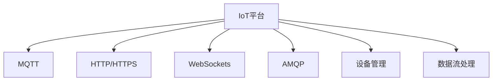
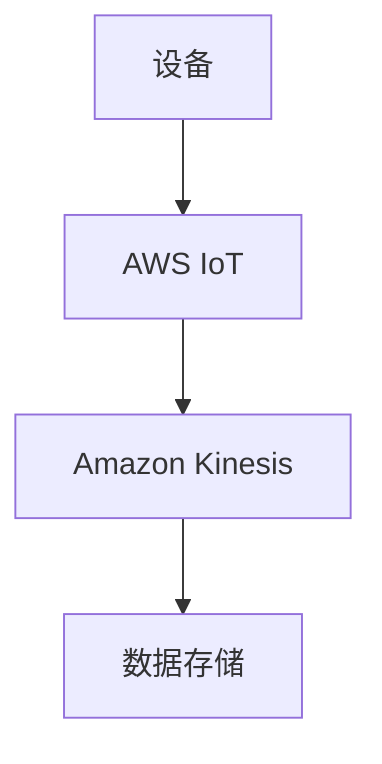

                 

# 物联网平台：AWS IoT 和 Azure IoT Hub

## 1. 背景介绍

### 1.1 问题由来
随着物联网（IoT）技术的快速发展，企业对物联网平台的需求日益增长。物联网平台是连接各种设备、收集和处理数据的中心枢纽，在智能制造、智慧城市、工业物联网等领域具有广泛的应用前景。但传统的物联网平台往往缺乏灵活性、可扩展性和易用性，无法满足实际业务需求。为了应对这一挑战，AWS（Amazon Web Services）和Azure（Microsoft Azure）推出了各自先进的物联网平台AWS IoT和Azure IoT Hub。

### 1.2 问题核心关键点
AWS IoT和Azure IoT Hub作为两大主流的物联网平台，具有以下几个核心优势：

1. **全面支持多种通信协议**：AWS IoT支持MQTT、HTTP、WebSocket等多种通信协议，Azure IoT Hub支持MQTT、AMQP、HTTP、WebSockets等多种通信协议。
2. **强大的设备管理功能**：AWS IoT和Azure IoT Hub提供了设备注册、连接、管理、升级等全面功能。
3. **高可用性和可靠性**：AWS IoT和Azure IoT Hub均提供了全球分布的冗余部署，保障了平台的高可用性和可靠性。
4. **强大的数据分析功能**：AWS IoT和Azure IoT Hub提供了丰富的数据分析工具，支持数据流处理、数据存储、机器学习等高级功能。
5. **完善的生态系统**：AWS IoT和Azure IoT Hub均拥有丰富的第三方插件和集成，支持与各种应用场景的深度集成。

## 2. 核心概念与联系

### 2.1 核心概念概述

为更好地理解AWS IoT和Azure IoT Hub的原理和架构，本节将介绍几个密切相关的核心概念：

- **IoT平台（Internet of Things Platform）**：用于连接和管理大量物联网设备的平台，提供设备注册、连接、数据采集、分析等功能。
- **MQTT（Message Queuing Telemetry Transport）**：轻量级、低开销的发布/订阅通信协议，广泛应用于物联网设备的数据传输。
- **HTTP/HTTPS（Hypertext Transfer Protocol/Secure）**：通用、灵活的协议，支持数据传输、设备管理等操作。
- **WebSockets（WebSocket）**：基于TCP协议的全双工通信协议，支持实时数据传输和设备管理。
- **AMQP（Advanced Message Queuing Protocol）**：基于消息队列的通信协议，支持高可靠性、低延迟的数据传输。
- **设备管理（Device Management）**：包括设备注册、连接、升级、监控等功能的模块，确保设备的安全可靠。
- **数据流处理（Data Streaming）**：实时数据处理模块，支持数据的实时传输、存储、分析和可视化。

这些核心概念之间的逻辑关系可以通过以下Mermaid流程图来展示：



这个流程图展示了大语言模型的核心概念及其之间的关系：

1. IoT平台是整个系统的核心，通过支持MQTT、HTTP/HTTPS、WebSockets和AMQP等协议，实现数据的可靠传输。
2. 设备管理模块确保了设备的安全和可靠性，通过设备注册、连接、升级等操作，管理大量物联网设备。
3. 数据流处理模块实现了数据的实时处理和分析，支持数据的存储、可视化和高级分析功能。

## 3. 核心算法原理 & 具体操作步骤

### 3.1 算法原理概述

AWS IoT和Azure IoT Hub的核心算法原理主要基于发布/订阅（Pub/Sub）模型和事件驱动架构，支持物联网设备的实时数据传输和处理。其核心算法包括以下几个方面：

1. **消息队列**：AWS IoT和Azure IoT Hub均使用消息队列来存储和管理设备上传的数据，确保数据的可靠传输和处理。
2. **分布式锁**：AWS IoT和Azure IoT Hub使用分布式锁机制，确保在高并发环境下的数据一致性和可靠性。
3. **心跳检测**：AWS IoT和Azure IoT Hub通过定期发送心跳消息，检测设备是否在线，保证设备管理的实时性和可靠性。
4. **事件驱动架构**：AWS IoT和Azure IoT Hub支持事件驱动架构，通过事件触发器来处理设备上传的数据，实现实时数据处理和分析。

### 3.2 算法步骤详解

AWS IoT和Azure IoT Hub的核心算法步骤主要包括以下几个方面：

1. **设备注册和认证**：
   - AWS IoT：设备通过AWS IoT Device SDK注册，并使用IAM角色进行认证。
   - Azure IoT Hub：设备通过Azure IoT Hub SDK注册，并使用Azure Active Directory进行认证。

2. **数据采集和传输**：
   - AWS IoT：设备使用MQTT、HTTP、WebSocket协议将数据上传到AWS IoT平台。
   - Azure IoT Hub：设备使用MQTT、HTTP、WebSocket、AMQP协议将数据上传到Azure IoT Hub平台。

3. **数据存储和处理**：
   - AWS IoT：数据通过Amazon S3、Amazon DynamoDB等存储服务进行存储和处理。
   - Azure IoT Hub：数据通过Azure Blob Storage、Azure SQL Database等存储服务进行存储和处理。

4. **数据分析和可视化**：
   - AWS IoT：使用Amazon Kinesis、Amazon CloudWatch等服务进行数据分析和可视化。
   - Azure IoT Hub：使用Azure Stream Analytics、Azure Power BI等服务进行数据分析和可视化。

5. **设备管理和监控**：
   - AWS IoT：使用Amazon IoT Device Defender进行设备管理和监控。
   - Azure IoT Hub：使用Azure IoT Hub Device Provisioning Service进行设备管理和监控。

### 3.3 算法优缺点

AWS IoT和Azure IoT Hub的算法具有以下优点：

1. **灵活性**：支持多种通信协议，能够满足不同物联网设备的连接需求。
2. **可扩展性**：支持大规模设备的连接和管理，能够应对海量数据流的处理需求。
3. **可靠性**：分布式部署和冗余机制确保了平台的高可用性和可靠性。
4. **易用性**：提供了丰富的开发工具和API，易于集成和开发。

同时，这些算法也存在以下局限性：

1. **复杂性**：系统架构复杂，对于初学者来说，需要一定的时间来理解和掌握。
2. **资源消耗**：大规模数据处理和存储需要较高的计算和存储资源。
3. **安全性**：需要严格的安全措施来保护数据和设备的安全性。
4. **费用**：云计算平台的使用费用较高，需要根据实际使用情况进行合理预算。

### 3.4 算法应用领域

AWS IoT和Azure IoT Hub的应用领域非常广泛，主要包括以下几个方面：

1. **智能制造**：通过连接生产线上的各种设备，实时监控和优化生产过程。
2. **智慧城市**：连接各种公共设施和交通工具，实现城市管理的智能化和高效化。
3. **工业物联网**：连接各种传感器和设备，实时监测生产环境和管理设备。
4. **农业物联网**：连接各种农业设备和传感器，实现农作物的智能监控和管理。
5. **能源物联网**：连接各种能源设备和传感器，实现能源的智能监测和管理。

## 4. 数学模型和公式 & 详细讲解 & 举例说明

### 4.1 数学模型构建

AWS IoT和Azure IoT Hub的数学模型主要基于数据流处理和事件驱动架构，支持实时数据处理和分析。其核心模型包括数据流处理模型和事件驱动模型。

数据流处理模型用于处理和分析物联网设备上传的数据流，支持数据的实时存储、分析和可视化。事件驱动模型用于处理设备上传的事件数据，支持实时的事件触发和处理。

### 4.2 公式推导过程

以下是对AWS IoT和Azure IoT Hub数据流处理模型的数学推导过程：

设设备上传的数据流为 $D=\{d_1, d_2, ..., d_n\}$，其中 $d_i$ 为第 $i$ 个数据点。数据流处理模型的目标是对数据流进行处理，输出处理结果 $R$。

数据流处理模型基于事件驱动架构，支持实时数据处理和分析。设事件触发器为 $T$，事件处理器为 $P$。事件触发器 $T$ 用于判断数据流中的事件，事件处理器 $P$ 用于处理事件并输出结果。

事件驱动模型的数学表达式为：

$$
R = P(T(D))
$$

其中 $T$ 表示事件触发器，$D$ 表示数据流，$P$ 表示事件处理器。事件触发器和事件处理器可以根据具体需求进行设计和实现。

### 4.3 案例分析与讲解

以智能制造为例，分析AWS IoT和Azure IoT Hub的实际应用场景。

假设一个智能制造工厂连接了多台设备，这些设备实时采集生产数据并上传至AWS IoT或Azure IoT Hub平台。AWS IoT或Azure IoT Hub平台使用Amazon Kinesis或Azure Stream Analytics进行数据流处理，实时监控和优化生产过程。

具体而言，AWS IoT或Azure IoT Hub平台使用事件驱动模型，将设备上传的数据流作为输入，通过事件触发器判断数据流的变化，触发相应的事件处理器进行处理。例如，当设备上传的数据异常时，触发报警事件，发送告警通知并记录日志。

## 5. 项目实践：代码实例和详细解释说明

### 5.1 开发环境搭建

在进行AWS IoT和Azure IoT Hub的开发实践前，需要先搭建开发环境。以下是使用Python进行AWS IoT开发的环境配置流程：

1. 安装AWS CLI：从官网下载并安装AWS CLI，配置AWS账户和地区。
2. 安装Boto3：通过pip安装Boto3，用于访问AWS IoT服务。
3. 安装AWS IoT SDK：根据设备类型安装对应的AWS IoT SDK，支持MQTT、HTTP、WebSocket协议。
4. 安装Amazon Kinesis SDK：通过pip安装Amazon Kinesis SDK，用于数据流处理。

### 5.2 源代码详细实现

以下是使用Boto3访问AWS IoT并实现数据流处理的Python代码实现：

```python
import boto3
import kinesis

def create_iot_client(region_name, access_key_id, secret_access_key):
    client = boto3.client('iot',
                         region_name=region_name,
                         aws_access_key_id=access_key_id,
                         aws_secret_access_key=secret_access_key)
    return client

def create_kinesis_client(region_name, access_key_id, secret_access_key):
    client = boto3.client('kinesis',
                         region_name=region_name,
                         aws_access_key_id=access_key_id,
                         aws_secret_access_key=secret_access_key)
    return client

def register_device(client, device_id, certificate_path):
    response = client.create_thing(thingName=device_id)
    thing_name = response['thingName']
    return thing_name

def connect_device(client, thing_name, certificate_path):
    response = client.attach_thing_principal(
        thingName=thing_name,
        principal=certificate_path,
        permissionArn='iot:device:*:*:*:*'
    )
    return response['thingPrincipalArn']

def publish_message(client, topic_name, message):
    response = client.publish(topicArn=topic_name, Message=message)
    return response['MessageId']

def process_data(client, stream_name):
    shard_iterator = client.get_shard_iterator(
        StreamName=stream_name,
        ShardId='shardId-000000000000',
        ShardIteratorType='TRIM_HORIZON'
    )
    for event in client.get_records(ShardIterator=shard_iterator):
        message = event['kinesis']['Data']
        # 在此处进行数据处理和分析
        print(message)

if __name__ == '__main__':
    region_name = 'us-east-1'
    access_key_id = 'your_access_key_id'
    secret_access_key = 'your_secret_access_key'
    
    iot_client = create_iot_client(region_name, access_key_id, secret_access_key)
    device_id = 'my_device'
    certificate_path = '/path/to/certificate.pem'
    
    thing_name = register_device(iot_client, device_id, certificate_path)
    thing_principal = connect_device(iot_client, thing_name, certificate_path)
    
    topic_name = 'my_topic'
    message = '{"data": "Hello World"}'
    
    message_id = publish_message(iot_client, topic_name, message)
    
    kinesis_client = create_kinesis_client(region_name, access_key_id, secret_access_key)
    stream_name = 'my_stream'
    
    process_data(kinesis_client, stream_name)
```

在上述代码中，我们首先创建了AWS IoT客户端和AWS Kinesis客户端，然后进行了设备注册、连接和消息发布。最后，使用Kinesis客户端对数据流进行处理和分析。

### 5.3 代码解读与分析

让我们再详细解读一下关键代码的实现细节：

**create_iot_client函数**：
- 根据AWS账户和地区创建AWS IoT客户端。

**register_device函数**：
- 使用AWS IoT客户端进行设备注册，返回注册后的设备ID。

**connect_device函数**：
- 使用AWS IoT客户端将设备连接到预定义的主题。

**publish_message函数**：
- 使用AWS IoT客户端发布消息到预定义的主题。

**process_data函数**：
- 使用AWS Kinesis客户端获取数据流记录，并进行数据处理和分析。

这些函数展示了AWS IoT和Kinesis的Python接口，可以用于实现设备的连接、数据发布和数据处理。通过这些函数，可以方便地构建完整的物联网应用系统。

### 5.4 运行结果展示

以下是AWS IoT和Kinesis数据流处理的应用场景示例：

假设一个智能工厂设备将实时采集的数据发布到AWS IoT主题，然后通过Amazon Kinesis进行数据流处理。数据流处理的流程图如下：



在这个示例中，设备采集的数据通过AWS IoT发布到主题，然后由Amazon Kinesis进行数据流处理，最终存储在数据仓库中。

## 6. 实际应用场景

### 6.1 智能制造

AWS IoT和Azure IoT Hub在智能制造中的应用非常广泛，通过连接各种生产设备和传感器，实时监测和优化生产过程。例如，可以连接生产线上的温度传感器、压力传感器、振动传感器等，实时采集生产环境数据并上传到AWS IoT或Azure IoT Hub平台，然后使用Amazon Kinesis或Azure Stream Analytics进行数据流处理和分析，优化生产过程，提高生产效率。

### 6.2 智慧城市

AWS IoT和Azure IoT Hub在智慧城市中的应用也非常广泛，通过连接各种公共设施和交通工具，实现城市管理的智能化和高效化。例如，可以连接各种路灯、监控摄像头、交通信号灯等，实时采集城市数据并上传到AWS IoT或Azure IoT Hub平台，然后使用Amazon Kinesis或Azure Stream Analytics进行数据流处理和分析，优化城市管理，提升城市生活质量。

### 6.3 工业物联网

AWS IoT和Azure IoT Hub在工业物联网中的应用也非常广泛，通过连接各种传感器和设备，实时监测生产环境和管理设备。例如，可以连接各种传感器采集设备运行数据，实时上传至AWS IoT或Azure IoT Hub平台，然后使用Amazon Kinesis或Azure Stream Analytics进行数据流处理和分析，优化生产设备，提高生产效率。

## 7. 工具和资源推荐

### 7.1 学习资源推荐

为了帮助开发者系统掌握AWS IoT和Azure IoT Hub的理论基础和实践技巧，这里推荐一些优质的学习资源：

1. AWS IoT官方文档：Amazon Web Services提供的官方文档，包含AWS IoT的详细介绍、API接口、最佳实践等，是学习和使用的必备资源。
2. Azure IoT Hub官方文档：Microsoft Azure提供的官方文档，包含Azure IoT Hub的详细介绍、API接口、最佳实践等，是学习和使用的必备资源。
3. AWS IoT Developer Guide：Amazon Web Services提供的开发者指南，包含AWS IoT的开发环境搭建、API接口、数据流处理等详细说明。
4. Azure IoT Hub Developer Guide：Microsoft Azure提供的开发者指南，包含Azure IoT Hub的开发环境搭建、API接口、数据流处理等详细说明。
5. AWS IoT Deep Dive：Amazon Web Services提供的深度介绍，涵盖AWS IoT的架构、API接口、最佳实践等。

通过这些资源的学习实践，相信你一定能够快速掌握AWS IoT和Azure IoT Hub的精髓，并用于解决实际的物联网问题。

### 7.2 开发工具推荐

AWS IoT和Azure IoT Hub的开发工具非常丰富，以下是几款常用的开发工具：

1. AWS IoT SDK：Amazon Web Services提供的SDK，支持Python、Java、C++等多种语言。
2. Azure IoT Hub SDK：Microsoft Azure提供的SDK，支持C#、Python、Node.js等多种语言。
3. AWS CLI：Amazon Web Services提供的命令行工具，支持设备注册、设备连接等操作。
4. Azure CLI：Microsoft Azure提供的命令行工具，支持设备注册、设备连接等操作。
5. Amazon Kinesis SDK：Amazon Web Services提供的SDK，支持Python、Java、C++等多种语言。
6. Azure Stream Analytics SDK：Microsoft Azure提供的SDK，支持C#、Python、Node.js等多种语言。

合理利用这些工具，可以显著提升AWS IoT和Azure IoT Hub的开发效率，加快创新迭代的步伐。

### 7.3 相关论文推荐

AWS IoT和Azure IoT Hub的发展得益于学界的持续研究。以下是几篇奠基性的相关论文，推荐阅读：

1. IoT Platform Architecture: A Survey of Cloud-Based IoT Architecture and Its Application：该论文详细介绍了物联网平台的架构和应用，提供了大量有价值的参考信息。
2. Towards a Consistent Approach to IoT Architecture Design：该论文提出了物联网架构设计的统一方法，具有很高的理论价值和实际应用意义。
3. IoT Data Ingestion and Analysis Using AWS IoT and Kinesis：该论文详细介绍了AWS IoT和Amazon Kinesis在物联网数据流处理中的应用，提供了大量实用示例。
4. Real-Time IoT Data Processing and Analysis Using Azure IoT Hub and Stream Analytics：该论文详细介绍了Azure IoT Hub和Azure Stream Analytics在物联网数据流处理中的应用，提供了大量实用示例。

这些论文代表了大语言模型微调技术的发展脉络。通过学习这些前沿成果，可以帮助研究者把握学科前进方向，激发更多的创新灵感。

## 8. 总结：未来发展趋势与挑战

### 8.1 总结

本文对AWS IoT和Azure IoT Hub进行了全面系统的介绍。首先阐述了AWS IoT和Azure IoT Hub的研究背景和应用场景，明确了其在物联网平台中的核心优势。其次，从原理到实践，详细讲解了AWS IoT和Azure IoT Hub的核心算法原理和具体操作步骤，给出了开发实践的完整代码实例。同时，本文还广泛探讨了AWS IoT和Azure IoT Hub在智能制造、智慧城市、工业物联网等多个行业领域的应用前景，展示了其在物联网平台中的巨大潜力。最后，本文精选了AWS IoT和Azure IoT Hub的学习资源、开发工具和相关论文，力求为读者提供全方位的技术指引。

通过本文的系统梳理，可以看到，AWS IoT和Azure IoT Hub作为两大主流的物联网平台，已经广泛应用于各个行业，为物联网的发展提供了强大的技术支持。AWS IoT和Azure IoT Hub不仅提供了强大的设备管理、数据流处理等功能，还拥有丰富的生态系统和强大的社区支持，成为了物联网应用开发的首选平台。

### 8.2 未来发展趋势

展望未来，AWS IoT和Azure IoT Hub将呈现以下几个发展趋势：

1. **人工智能与物联网的融合**：将人工智能技术与物联网平台深度融合，通过智能算法优化设备管理、数据分析和决策支持，实现智能化物联网应用。
2. **边缘计算与物联网的融合**：将边缘计算技术引入物联网平台，通过在设备端进行数据处理和分析，降低云端负载，提升系统性能。
3. **区块链与物联网的融合**：将区块链技术引入物联网平台，通过分布式账本确保数据安全和可靠性，提升系统的透明度和可追溯性。
4. **跨平台集成**：实现AWS IoT和Azure IoT Hub的跨平台集成，支持多云、混合云环境下的数据互通和协同管理。
5. **自动化运维**：通过自动化运维工具，优化设备管理和数据流处理，降低运维成本，提升系统稳定性。

以上趋势凸显了AWS IoT和Azure IoT Hub的广阔前景。这些方向的探索发展，必将进一步提升物联网平台的性能和应用范围，为物联网的应用带来新的突破。

### 8.3 面临的挑战

尽管AWS IoT和Azure IoT Hub已经取得了显著成就，但在迈向更加智能化、普适化应用的过程中，它仍面临着诸多挑战：

1. **安全性**：随着物联网设备数量的增加，设备的安全性问题日益突出，需要严格的安全措施来保护数据和设备的安全性。
2. **扩展性**：大规模设备的连接和管理需要高可扩展性的平台支持，以应对海量数据流的处理需求。
3. **成本**：云计算平台的使用费用较高，需要根据实际使用情况进行合理预算。
4. **复杂性**：系统架构复杂，对于初学者来说，需要一定的时间来理解和掌握。
5. **互操作性**：不同平台之间的数据互通和协同管理需要统一的协议和标准。

这些挑战需要学界和产业界的共同努力，通过不断的技术创新和优化，才能进一步提升AWS IoT和Azure IoT Hub的性能和可靠性，推动物联网技术的发展。

### 8.4 研究展望

面对AWS IoT和Azure IoT Hub所面临的挑战，未来的研究需要在以下几个方面寻求新的突破：

1. **安全增强技术**：开发更加安全可靠的设备管理机制，确保物联网设备的安全性和数据的安全性。
2. **高效处理技术**：开发高效的数据流处理和存储技术，降低云端负载，提升系统性能。
3. **跨平台集成技术**：实现跨平台、跨云环境的数据互通和协同管理，推动物联网的广泛应用。
4. **自动化运维技术**：开发自动化运维工具，优化设备管理和数据流处理，降低运维成本。
5. **标准化协议**：制定统一的物联网协议和标准，推动不同平台之间的数据互通和协同管理。

这些研究方向的探索，必将引领AWS IoT和Azure IoT Hub走向更高的台阶，为物联网技术的发展提供新的动力。面向未来，AWS IoT和Azure IoT Hub需要与其他人工智能技术进行更深入的融合，如知识表示、因果推理、强化学习等，多路径协同发力，共同推动物联网平台的进步。

## 9. 附录：常见问题与解答

**Q1：AWS IoT和Azure IoT Hub的使用是否需要付费？**

A: AWS IoT和Azure IoT Hub的使用需要根据具体的使用情况进行付费，费用包括设备注册、数据存储、数据传输等费用。AWS IoT提供了详细的使用成本计算器，帮助用户了解不同使用情况下的费用。Azure IoT Hub也提供了详细的使用成本计算器，帮助用户进行成本评估和预算。

**Q2：AWS IoT和Azure IoT Hub支持哪些通信协议？**

A: AWS IoT支持MQTT、HTTP、WebSocket协议，Azure IoT Hub支持MQTT、AMQP、HTTP、WebSockets协议。这些协议可以根据实际需求进行选择，支持设备之间的灵活连接和数据传输。

**Q3：AWS IoT和Azure IoT Hub如何进行设备注册和管理？**

A: AWS IoT和Azure IoT Hub提供了完整的设备管理功能，包括设备注册、连接、升级、监控等。AWS IoT使用IAM角色进行认证和授权，Azure IoT Hub使用Azure Active Directory进行认证和授权。这些功能可以帮助管理员轻松管理大量物联网设备。

**Q4：AWS IoT和Azure IoT Hub如何进行数据流处理和分析？**

A: AWS IoT和Azure IoT Hub提供了强大的数据流处理和分析功能，支持实时数据处理和分析。AWS IoT使用Amazon Kinesis进行数据流处理，Azure IoT Hub使用Azure Stream Analytics进行数据流处理。这些功能可以帮助用户进行实时数据分析和可视化。

**Q5：AWS IoT和Azure IoT Hub如何保障数据安全？**

A: AWS IoT和Azure IoT Hub提供了全面的数据安全保障措施，包括数据加密、访问控制、审计日志等。AWS IoT使用IAM角色进行认证和授权，Azure IoT Hub使用Azure Active Directory进行认证和授权。这些功能可以帮助用户保障数据的安全性和可靠性。

---

作者：禅与计算机程序设计艺术 / Zen and the Art of Computer Programming

