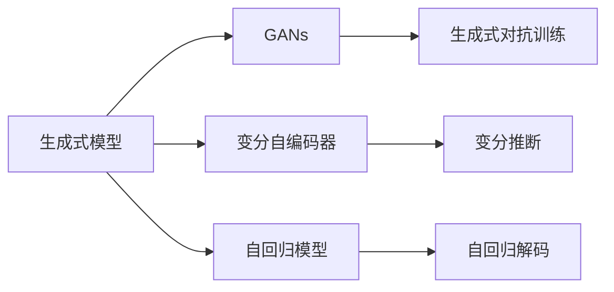

                 

## 1. 背景介绍

随着人工智能技术的飞速发展，生成式人工智能（Generative AI, AIGC）正逐步从实验室走向商业应用，成为推动行业创新的重要力量。生成式AI涵盖了文本生成、图像生成、音乐生成、视频生成等多个方向，正在深刻影响着内容创作、电子商务、教育培训、医疗健康等众多领域。

### 1.1 问题由来

在过去的十年中，深度学习技术的进步使得生成式AI取得了显著的突破。无论是文本生成、图像生成，还是音乐生成，这些领域都涌现出了一系列具有开创性的模型和算法。例如，GANs（生成式对抗网络）在图像生成领域的成功，使得生成式AI在商业应用中得以大规模部署和推广。

然而，尽管生成式AI在技术上取得了巨大进展，但其落地应用仍然面临诸多挑战。如何将实验室中的创新成果转化为商业价值，实现规模化、普适化的应用，成为当前AI产业界的热点话题。

### 1.2 问题核心关键点

为回答上述问题，本节将从以下几个方面展开讨论：

- **关键技术突破**：生成式AI的关键技术包括变分自编码器、生成对抗网络、注意力机制、自回归模型等。这些技术的创新和优化，是推动生成式AI应用落地的核心驱动力。
- **应用场景探索**：生成式AI在不同领域的实际应用，如内容创作、电子商务、教育培训、医疗健康等，展示了其在各个垂直领域的广泛潜力。
- **商业化策略**：如何通过商业模式创新，实现生成式AI技术的商业化，成为推动其大规模应用的重要策略。

## 2. 核心概念与联系

### 2.1 核心概念概述

生成式AI的核心概念包括生成式模型（Generative Model）、对抗生成网络（Generative Adversarial Networks, GANs）、变分自编码器（Variational Autoencoder, VAE）、自回归模型（Autoregressive Model）等。这些概念之间通过相互协作，形成了一整套完整的生成式AI技术体系。

### 2.2 核心概念原理和架构的 Mermaid 流程图



上述流程图展示了生成式AI核心概念之间的联系：

1. **生成式模型**：基础概念，指能够从输入噪声中生成样本的模型。
2. **GANs**：核心算法，通过对抗训练（Adversarial Training）生成高质量的样本。
3. **变分自编码器（VAE）**：基于变分推断的生成模型，能够学习数据的概率分布。
4. **自回归模型**：通过逐个生成样本的像素或单词，实现高效的生成过程。
5. **生成式对抗训练**：GANs的核心组成部分，通过两个模型的对抗训练生成高质量的样本。
6. **变分推断**：VAE的核心算法，用于高效地估计数据的概率分布。
7. **自回归解码**：自回归模型的核心算法，通过逐个生成样本实现高效的生成过程。

这些概念和技术共同构成了生成式AI的技术体系，使得AI系统能够生成逼真的文本、图像、音频等内容。

## 3. 核心算法原理 & 具体操作步骤

### 3.1 算法原理概述

生成式AI的核心算法包括生成对抗网络（GANs）、变分自编码器（VAE）、自回归模型等。这些算法通过不同的方法和机制，实现高质量的生成任务。

### 3.2 算法步骤详解

以GANs为例，其核心步骤包括：

1. **构建生成器和判别器**：生成器从随机噪声中生成样本，判别器判断样本的真实性。
2. **对抗训练**：生成器和判别器通过对抗训练不断优化，最终生成器能够生成逼真的样本。
3. **模型训练**：通过大量样本训练生成器和判别器，提高生成器的生成质量。
4. **样本生成**：利用训练好的生成器生成高质量的样本。

### 3.3 算法优缺点

GANs的主要优点包括：

- 能够生成高质量的样本，适用于图像、音频、视频等多种生成任务。
- 通过对抗训练，能够学习样本的概率分布，生成具有统计特性的样本。

其缺点包括：

- 训练过程不稳定，容易陷入模式崩溃（Mode Collapse）。
- 生成样本存在多样性不足的问题，难以避免。
- 计算资源消耗大，需要高性能的GPU设备。

### 3.4 算法应用领域

生成式AI的应用领域极为广泛，包括：

- **内容创作**：文本生成、图像生成、音乐生成等，可用于自动写诗、生成艺术作品等。
- **电子商务**：商品展示、虚拟试穿、虚拟模型等，提升用户体验。
- **教育培训**：虚拟教师、虚拟实验、学习助手等，提供个性化教育服务。
- **医疗健康**：疾病预测、影像生成、虚拟康复等，辅助医疗决策。
- **娱乐媒体**：虚拟主播、虚拟代言人、动画生成等，丰富娱乐体验。

## 4. 数学模型和公式 & 详细讲解 & 举例说明

### 4.1 数学模型构建

生成式AI的数学模型主要基于概率模型和生成模型。以GANs为例，其生成过程可以表示为：

$$
x \sim G(z)
$$

其中，$G(z)$ 为生成器，$z$ 为随机噪声向量，$x$ 为生成的样本。判别器的目标是区分真实样本和生成的假样本，其目标函数为：

$$
\mathcal{L}_D = E_{x\sim P_{\text{data}}}[\log D(x)] + E_{z\sim P(z)}[\log(1-D(G(z)))]
$$

其中，$P_{\text{data}}$ 为真实样本的分布，$P(z)$ 为噪声向量$z$的分布。生成器的目标函数为：

$$
\mathcal{L}_G = E_{z\sim P(z)}[\log D(G(z))]
$$

生成器和判别器通过对抗训练不断优化，最终生成高质量的样本。

### 4.2 公式推导过程

GANs的训练过程可以分为两个步骤：

1. **生成器训练**：通过优化生成器$G$的目标函数，使得生成的样本$G(z)$能够欺骗判别器$D$。
2. **判别器训练**：通过优化判别器$D$的目标函数，使得判别器$D$能够准确区分真实样本和生成的样本。

### 4.3 案例分析与讲解

以ImageGAN为例，其生成过程包括：

1. **数据准备**：准备生成样本所需的数据集，如MNIST手写数字数据集。
2. **生成器训练**：生成器通过对抗训练不断优化，生成逼真的手写数字图像。
3. **判别器训练**：判别器通过对抗训练不断优化，能够准确区分真实手写数字图像和生成的假图像。
4. **样本生成**：使用训练好的生成器$G$生成高质量的手写数字图像。

## 5. 项目实践：代码实例和详细解释说明

### 5.1 开发环境搭建

在进行生成式AI项目实践前，我们需要准备好开发环境。以下是使用Python进行PyTorch开发的环境配置流程：

1. 安装Anaconda：从官网下载并安装Anaconda，用于创建独立的Python环境。

2. 创建并激活虚拟环境：
```bash
conda create -n pytorch-env python=3.8 
conda activate pytorch-env
```

3. 安装PyTorch：根据CUDA版本，从官网获取对应的安装命令。例如：
```bash
conda install pytorch torchvision torchaudio cudatoolkit=11.1 -c pytorch -c conda-forge
```

4. 安装各类工具包：
```bash
pip install numpy pandas scikit-learn matplotlib tqdm jupyter notebook ipython
```

完成上述步骤后，即可在`pytorch-env`环境中开始生成式AI项目实践。

### 5.2 源代码详细实现

以下以生成式对抗网络（GANs）为例，给出使用Transformers库进行图像生成任务的PyTorch代码实现。

首先，定义GAN模型的架构：

```python
from transformers import GANModel
from torch.nn import Linear, ReLU

class Generator(nn.Module):
    def __init__(self, in_dim, out_dim):
        super(Generator, self).__init__()
        self.fc1 = Linear(in_dim, 256)
        self.fc2 = Linear(256, 256)
        self.fc3 = Linear(256, out_dim)
    
    def forward(self, x):
        x = self.fc1(x)
        x = ReLU(x)
        x = self.fc2(x)
        x = ReLU(x)
        x = self.fc3(x)
        return x

class Discriminator(nn.Module):
    def __init__(self, in_dim, out_dim):
        super(Discriminator, self).__init__()
        self.fc1 = Linear(in_dim, 256)
        self.fc2 = Linear(256, 256)
        self.fc3 = Linear(256, out_dim)
    
    def forward(self, x):
        x = self.fc1(x)
        x = ReLU(x)
        x = self.fc2(x)
        x = ReLU(x)
        x = self.fc3(x)
        return x

class GAN(nn.Module):
    def __init__(self, in_dim, out_dim):
        super(GAN, self).__init__()
        self.gen = Generator(in_dim, out_dim)
        self.dis = Discriminator(in_dim, out_dim)
    
    def forward(self, x):
        fake_images = self.gen(x)
        real_images = x
        fake_labels = torch.zeros(fake_images.size(0), 1)
        real_labels = torch.ones(real_images.size(0), 1)
        return fake_images, real_images, fake_labels, real_labels
```

然后，定义训练函数和优化器：

```python
from torch import nn, optim

in_dim = 100
out_dim = 784
criterion = nn.BCELoss()
g_optimizer = optim.Adam(G.parameters(), lr=0.0002)
d_optimizer = optim.Adam(D.parameters(), lr=0.0002)
```

接着，定义训练循环和采样函数：

```python
def train_GAN(G, D, G_optimizer, D_optimizer, criterion, num_epochs=100):
    for epoch in range(num_epochs):
        for i in range(len(train_loader)):
            real_images, fake_labels, real_labels, _ = next(iter(train_loader))
            real_images = real_images.view(real_images.size(0), -1)
            fake_images = G(torch.randn(real_images.size(0), in_dim))
            real_labels = real_labels.view(real_labels.size(0), -1)
            fake_labels = fake_labels.view(fake_labels.size(0), -1)
            d_loss = criterion(D(fake_images), fake_labels) + criterion(D(real_images), real_labels)
            g_loss = criterion(D(fake_images), fake_labels)
            D_optimizer.zero_grad()
            d_loss.backward()
            D_optimizer.step()
            G_optimizer.zero_grad()
            g_loss.backward()
            G_optimizer.step()
        if epoch % 10 == 0:
            save_checkpoint({G.state_dict(): epoch})
            generate_images(G, num_samples=50)
```

最后，运行训练过程并生成样本：

```python
train_GAN(GAN, G_optimizer, D_optimizer, criterion, num_epochs=100)

# 生成样本
generate_images(G, num_samples=50)
```

以上就是使用PyTorch进行图像生成任务的完整代码实现。可以看到，利用Transformers库的封装，生成式AI模型的实现变得非常简洁高效。

### 5.3 代码解读与分析

让我们再详细解读一下关键代码的实现细节：

**GANModel类**：
- `__init__`方法：定义生成器和判别器的架构。
- `forward`方法：定义生成器和判别器的前向传播过程。

**train_GAN函数**：
- 定义训练循环，每次迭代中生成器生成样本，判别器判断样本真实性，计算损失函数并更新模型参数。
- 每10个epoch保存一次模型参数。
- 最终生成50个样本并可视化展示。

**generate_images函数**：
- 将模型参数从checkpoint中加载。
- 生成50个样本并可视化展示。

可以看到，PyTorch配合Transformers库使得生成式AI模型的代码实现变得简洁高效。开发者可以将更多精力放在数据处理、模型改进等高层逻辑上，而不必过多关注底层的实现细节。

当然，工业级的系统实现还需考虑更多因素，如模型的保存和部署、超参数的自动搜索、更灵活的任务适配层等。但核心的生成式AI方法基本与此类似。

## 6. 实际应用场景

### 6.1 内容创作

生成式AI在内容创作领域具有广阔的应用前景。无论是文本生成、图像生成，还是音乐生成，生成式AI都能帮助创作者高效生成高质量的原创内容。

在文本生成方面，生成式AI可以自动撰写新闻报道、博客文章、小说等，甚至能够模仿特定风格进行文本创作。例如，OpenAI的GPT-3模型已经在多个写作任务中取得了出色的表现。

在图像生成方面，生成式AI可以生成逼真的艺术作品、商品展示图、虚拟角色等，提升了内容创作的效率和质量。例如，DALL·E模型可以生成与描述相匹配的图像。

在音乐生成方面，生成式AI可以自动生成歌曲、乐曲等，为音乐创作提供了新的灵感。例如，Magenta项目利用生成对抗网络，自动生成音乐片段和旋律。

### 6.2 电子商务

生成式AI在电子商务中的应用，主要体现在商品展示、虚拟试穿、虚拟模型等方面。通过生成式AI技术，电商平台能够提供更加丰富、逼真的购物体验。

商品展示方面，生成式AI可以自动生成高质量的商品图片和视频，帮助用户更好地了解商品细节。例如，Adobe Sensei利用生成式AI技术，自动生成高质量的商品图像。

虚拟试穿方面，生成式AI可以生成虚拟试穿模型，帮助用户在家中试穿商品，提升购物体验。例如，Realtime.fm利用生成式AI技术，生成了逼真的虚拟试穿模型。

虚拟模型方面，生成式AI可以生成逼真的虚拟角色，应用于游戏、虚拟现实等领域。例如，Roblox利用生成式AI技术，生成了逼真的虚拟角色模型。

### 6.3 教育培训

生成式AI在教育培训中的应用，主要体现在个性化教学、虚拟教师、虚拟实验等方面。通过生成式AI技术，教育机构能够提供更加个性化、互动的教育服务。

个性化教学方面，生成式AI可以根据学生的学习情况，生成个性化的学习资料和练习题，提升学习效果。例如，Khan Academy利用生成式AI技术，自动生成个性化学习资料。

虚拟教师方面，生成式AI可以生成虚拟教师，进行课堂教学和答疑解惑，提供更加高效的教学服务。例如，IBM Watson Tutor利用生成式AI技术，生成了虚拟教师。

虚拟实验方面，生成式AI可以生成虚拟实验环境，帮助学生进行实验操作，提升实验效果。例如，Fujitsu利用生成式AI技术，生成了虚拟实验环境。

### 6.4 医疗健康

生成式AI在医疗健康中的应用，主要体现在疾病预测、影像生成、虚拟康复等方面。通过生成式AI技术，医疗机构能够提供更加精准、高效的医疗服务。

疾病预测方面，生成式AI可以根据患者的病历数据，生成疾病预测模型，帮助医生进行诊断和治疗。例如，Google Health利用生成式AI技术，生成了疾病预测模型。

影像生成方面，生成式AI可以生成高质量的医学影像，帮助医生更好地进行诊断和治疗。例如，DeepMind利用生成式AI技术，生成了高质量的医学影像。

虚拟康复方面，生成式AI可以生成虚拟康复环境，帮助患者进行康复训练，提升康复效果。例如，Tayara利用生成式AI技术，生成了虚拟康复环境。

## 7. 工具和资源推荐

### 7.1 学习资源推荐

为了帮助开发者系统掌握生成式AI的理论基础和实践技巧，这里推荐一些优质的学习资源：

1. 《Generative Adversarial Networks: Training Generative Adversarial Nets》论文：GANs的原论文，深入解释了GANs的原理和训练方法。

2. 《Generative Adversarial Nets》一书：Ian Goodfellow等人所著，系统介绍了GANs的理论基础和应用场景。

3. 《Learning Deep Generative Models》一书：Ian Goodfellow等人所著，介绍了各种生成模型的理论基础和应用实例。

4. 《Generative Deep Learning》一书：Peng Luo等人所著，介绍了生成式AI在深度学习中的应用和前沿技术。

5. OpenAI和Google AI的博客：包含大量生成式AI的研究论文和案例分析，是学习生成式AI的重要资源。

通过对这些资源的学习实践，相信你一定能够快速掌握生成式AI的精髓，并用于解决实际的AI问题。

### 7.2 开发工具推荐

高效的开发离不开优秀的工具支持。以下是几款用于生成式AI开发的常用工具：

1. PyTorch：基于Python的开源深度学习框架，灵活动态的计算图，适合快速迭代研究。大部分生成式AI模型都有PyTorch版本的实现。

2. TensorFlow：由Google主导开发的开源深度学习框架，生产部署方便，适合大规模工程应用。同样有丰富的生成式AI模型资源。

3. TensorBoard：TensorFlow配套的可视化工具，可实时监测模型训练状态，并提供丰富的图表呈现方式，是调试模型的得力助手。

4. Weights & Biases：模型训练的实验跟踪工具，可以记录和可视化模型训练过程中的各项指标，方便对比和调优。与主流深度学习框架无缝集成。

5. Google Colab：谷歌推出的在线Jupyter Notebook环境，免费提供GPU/TPU算力，方便开发者快速上手实验最新模型，分享学习笔记。

合理利用这些工具，可以显著提升生成式AI开发和调试的效率，加快创新迭代的步伐。

### 7.3 相关论文推荐

生成式AI的发展源于学界的持续研究。以下是几篇奠基性的相关论文，推荐阅读：

1. Generative Adversarial Nets（GANs原论文）：Ian Goodfellow等人所著，提出了GANs模型，开创了生成式AI的新纪元。

2. Variational Autoencoders（VAE）：Kingma等人所著，提出VAE模型，利用变分推断实现高效生成。

3. Attention is All You Need（自回归模型）：Vaswani等人所著，提出自回归模型，利用注意力机制实现高效生成。

4. DALL·E：OpenAI团队所著，利用生成式AI技术，生成高质量的图像。

5. Taming Transformers for High-Resolution Image Synthesis：Karras等人所著，利用自回归模型，生成高分辨率的图像。

这些论文代表了大生成式AI的发展脉络。通过学习这些前沿成果，可以帮助研究者把握学科前进方向，激发更多的创新灵感。

## 8. 总结：未来发展趋势与挑战

### 8.1 总结

本文对生成式AI的应用落地进行了全面系统的介绍。首先阐述了生成式AI的关键技术和应用场景，明确了其在内容创作、电子商务、教育培训、医疗健康等领域的广泛应用。其次，从原理到实践，详细讲解了GANs等核心算法的数学模型和计算过程，给出了生成式AI项目开发的完整代码实例。最后，我们探讨了生成式AI未来的发展趋势和面临的挑战，提出了相应的解决方案和展望。

通过本文的系统梳理，可以看到，生成式AI正在从实验室走向商业应用，成为推动AI技术产业化的重要力量。未来，随着生成式AI技术的不断成熟，其在更多领域的应用将得到广泛推广，为各行各业带来深刻的变革。

### 8.2 未来发展趋势

展望未来，生成式AI的发展趋势包括：

1. **多模态生成**：生成式AI将从单一模态（如文本、图像）向多模态（如文本-图像、文本-音频）方向发展，实现更为丰富和逼真的生成。

2. **跨领域生成**：生成式AI将从特定领域（如艺术创作、医学影像）向跨领域（如跨模态迁移学习、跨领域数据融合）方向发展，提升生成内容的普适性。

3. **交互式生成**：生成式AI将从静态生成向交互式生成方向发展，实现人机协同创作、智能互动等新应用场景。

4. **个性化生成**：生成式AI将从通用生成向个性化生成方向发展，利用用户数据生成更加精准和符合用户需求的内容。

5. **深度融合**：生成式AI将与更多AI技术进行深度融合，如知识图谱、因果推理、强化学习等，形成更加全面和智能的生成系统。

这些趋势将推动生成式AI技术的进一步发展，为内容创作、电子商务、教育培训、医疗健康等领域带来更加深刻的变革。

### 8.3 面临的挑战

尽管生成式AI在技术上取得了显著进展，但在实际落地应用中仍面临诸多挑战：

1. **计算资源瓶颈**：生成式AI模型的训练和推理需要大量的计算资源，如高性能GPU/TPU设备，这在小型企业中难以满足。

2. **数据质量和多样性**：生成式AI模型需要高质量、多样化的训练数据，这在某些垂直领域难以获取。

3. **生成质量不稳定**：生成式AI模型生成的样本质量不稳定，容易受到训练数据和模型参数的影响。

4. **可解释性不足**：生成式AI模型通常是"黑盒"系统，难以解释其生成过程和决策逻辑，这在医疗、金融等领域尤为重要。

5. **伦理和安全问题**：生成式AI模型可能生成有害、偏见的内容，对社会产生不良影响，需要加强伦理和安全监管。

6. **技术迭代加速**：生成式AI技术更新迅速，模型维护和升级成本较高，需要持续投入研发资源。

这些挑战需要学界和产业界共同努力，通过技术创新和规范制定，逐步克服生成式AI落地的障碍，推动其在大规模应用中的广泛部署。

### 8.4 研究展望

面对生成式AI所面临的挑战，未来的研究需要在以下几个方面寻求新的突破：

1. **资源优化技术**：开发更加高效和可扩展的生成式AI模型，利用资源优化技术如梯度累积、混合精度训练等，提升生成式AI模型的资源利用效率。

2. **数据增强技术**：通过数据增强技术如数据合成、迁移学习等，扩大训练数据的规模和多样性，提升生成式AI模型的泛化能力。

3. **可解释性技术**：开发可解释性生成模型，利用可视化、交互式技术展示生成过程和决策逻辑，提升生成式AI模型的透明度和可信度。

4. **伦理和安全技术**：引入伦理和安全约束，确保生成式AI模型的输出符合人类价值观和伦理道德，避免生成有害、偏见的内容。

5. **跨领域融合技术**：将生成式AI技术与更多AI技术进行深度融合，如知识图谱、因果推理、强化学习等，形成更加全面和智能的生成系统。

这些研究方向将推动生成式AI技术的不断进步，为生成式AI的大规模应用提供强有力的支撑。未来，随着生成式AI技术的不断成熟和落地，必将为各行各业带来更加丰富和创新的应用体验。

## 9. 附录：常见问题与解答

**Q1：生成式AI如何应用于内容创作？**

A: 生成式AI可以自动生成高质量的文本、图像、音频等内容，广泛应用于新闻报道、小说创作、音乐生成等领域。例如，OpenAI的GPT-3模型可以生成与描述相匹配的文本，DALL·E模型可以生成高质量的图像。

**Q2：生成式AI在电子商务中的应用场景有哪些？**

A: 生成式AI在电子商务中的应用场景包括商品展示、虚拟试穿、虚拟模型等。例如，Adobe Sensei可以自动生成高质量的商品图像，Realtime.fm可以生成逼真的虚拟试穿模型，Roblox可以生成逼真的虚拟角色模型。

**Q3：生成式AI在医疗健康中的应用场景有哪些？**

A: 生成式AI在医疗健康中的应用场景包括疾病预测、影像生成、虚拟康复等。例如，Google Health可以生成疾病预测模型，DeepMind可以生成高质量的医学影像，Tayara可以生成虚拟康复环境。

**Q4：生成式AI的应用面临哪些技术挑战？**

A: 生成式AI的应用面临计算资源瓶颈、数据质量和多样性、生成质量不稳定、可解释性不足、伦理和安全问题、技术迭代加速等挑战。需要学界和产业界共同努力，通过技术创新和规范制定，逐步克服生成式AI落地的障碍。

**Q5：生成式AI的未来发展趋势有哪些？**

A: 生成式AI的未来发展趋势包括多模态生成、跨领域生成、交互式生成、个性化生成、深度融合等。这些趋势将推动生成式AI技术的进一步发展，为内容创作、电子商务、教育培训、医疗健康等领域带来更加深刻的变革。

总之，生成式AI技术正在从实验室走向商业应用，成为推动AI技术产业化的重要力量。未来，随着生成式AI技术的不断成熟，其在更多领域的应用将得到广泛推广，为各行各业带来更加丰富和创新的应用体验。

