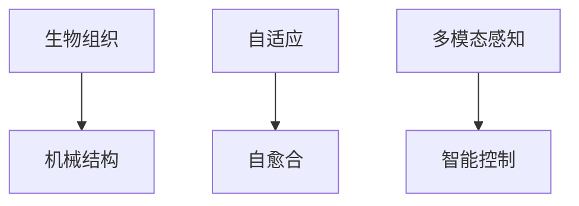

                 

## 1. 背景介绍

### 1.1 问题由来
生物混合机器人（Bio-Hybrid Robotics）是近年来生物工程和机器人学交叉融合的一个前沿研究领域。通过将生物组织和机械结构相结合，生物混合机器人有望在柔性、自适应、自愈合等方面实现显著突破，为医疗健康、环境监测、救援灾难等高风险领域带来创新解决方案。然而，如何将生物组织和机械结构有效集成，实现可靠、高效、智能的协同工作，是这一领域的研究难点。

### 1.2 问题核心关键点
- 生物组织与机械结构的融合：如何通过物理接口将生物组织与机械结构有效结合，保持各自的特性并发挥其协同效应。
- 自适应与自愈合：生物混合机器人如何根据环境变化和损伤状态，自适应调整结构和功能，并实现快速自愈合。
- 控制与优化：如何对生物混合机器人进行精准控制，优化其运动性能和操作效率。
- 安全性与伦理：生物混合机器人在操作过程中如何保证生物组织的健康与安全，同时避免伦理问题。

### 1.3 问题研究意义
研究生物混合机器人的融合技术，对于推动生物工程和机器人学的发展，具有重要意义：

1. **促进多学科交叉融合**：生物混合机器人结合了生物工程、机械工程、电子工程、计算机科学等多个学科，有利于推动跨学科研究的深度与广度。
2. **提升应用场景的灵活性**：生物混合机器人可以适应复杂、多变的物理环境，拓展传统机器人的应用边界，如医疗手术、灾区救援、环境监测等。
3. **增强智能与自适应能力**：生物混合机器人通过生物组织的感知、决策和自适应能力，可以更加智能地完成任务，提高操作的精确性和效率。
4. **推动创新与突破**：生物混合机器人为传统机器人领域带来了新的设计理念和技术手段，有望实现新的突破。
5. **解决实际问题**：生物混合机器人在医疗健康、环境监测、灾难救援等领域的应用，可以解决实际问题，改善人类生活质量。

## 2. 核心概念与联系

### 2.1 核心概念概述

为更好地理解生物混合机器人的工作原理和优化方向，本节将介绍几个密切相关的核心概念：

- **生物组织（Bio-Tissue）**：指由细胞、基质等构成的生物材料，具有感知、自愈合、自适应等特性。
- **机械结构（Mechanical Structure）**：指由金属、高分子等材料构成的机械框架，具有刚性、强度、精度等特性。
- **自适应（Adaptability）**：指生物混合机器人根据环境变化和损伤状态，自动调整结构和功能，保持高效运行。
- **自愈合（Self-healing）**：指生物混合机器人在损伤后能够自动修复，恢复原有功能。
- **多模态感知（Multi-modal Sensing）**：指生物混合机器人利用多种感知模态，如力触觉、温度、化学等，获取全面的环境信息。
- **智能控制（Intelligent Control）**：指生物混合机器人利用人工智能算法，进行精准控制和决策。

这些核心概念之间的逻辑关系可以通过以下Mermaid流程图来展示：



这个流程图展示了一些关键概念及其之间的关系：

1. 生物组织与机械结构的融合。
2. 生物混合机器人的自适应与自愈合能力。
3. 生物混合机器人的多模态感知与智能控制。

## 3. 核心算法原理 & 具体操作步骤
### 3.1 算法原理概述

生物混合机器人的核心算法原理主要涉及以下几个方面：

- **机械-生物接口设计**：设计高效、可靠的机械-生物接口，确保生物组织与机械结构的稳定结合。
- **自适应控制算法**：基于环境信息，实时调整生物混合机器人的结构和功能，实现自适应控制。
- **自愈合机制**：开发自愈合材料和机制，使生物混合机器人能够自动修复损伤，恢复原有功能。
- **智能决策算法**：结合多模态感知和智能控制算法，使生物混合机器人能够进行精准决策和操作。

### 3.2 算法步骤详解

生物混合机器人的核心算法步骤如下：

**Step 1: 机械结构与生物组织的界面设计**

1. **材料选择**：选择适合生物组织和机械结构融合的材料，如生物兼容的高分子材料、导电凝胶等。
2. **物理接口设计**：设计高效的机械-生物接口，保证生物组织与机械结构的物理结合和信号传递。
3. **生物组织预处理**：对生物组织进行预处理，如组织培养、细胞接种等，确保生物组织在融合后的正常生长和功能发挥。

**Step 2: 自适应控制算法实现**

1. **环境感知模块设计**：利用多模态传感器获取环境信息，如力触觉、温度、化学等。
2. **自适应决策算法开发**：设计自适应决策算法，根据环境信息动态调整生物混合机器人的结构和功能。
3. **控制策略优化**：基于决策结果，优化控制策略，实现生物混合机器人的精准操作。

**Step 3: 自愈合机制的开发**

1. **自愈合材料选择**：选择具有自愈合能力的材料，如自凝材料、生物可降解材料等。
2. **损伤检测与识别**：开发损伤检测与识别算法，实时监测生物混合机器人的损伤状态。
3. **自愈合机制实施**：根据损伤检测结果，自动触发自愈合机制，实现损伤修复。

**Step 4: 智能决策算法的实现**

1. **多模态感知系统设计**：设计多模态感知系统，获取全面的环境信息。
2. **智能决策算法开发**：结合多模态感知数据，开发智能决策算法，实现精准决策。
3. **行为优化与调整**：根据决策结果，优化生物混合机器人的行为，确保高效完成任务。

### 3.3 算法优缺点

生物混合机器人的核心算法具有以下优点：

1. **多功能融合**：结合生物组织和机械结构的特性，实现多功能融合，拓展应用场景。
2. **自适应能力强**：通过自适应控制算法，生物混合机器人能够适应复杂、多变的环境。
3. **自愈合快速**：自愈合机制可以快速修复损伤，保持生物混合机器人的稳定运行。
4. **智能决策精准**：智能决策算法能够进行精准决策，提高操作效率和精确性。

同时，这些算法也存在一些局限性：

1. **复杂性高**：生物混合机器人的融合与控制涉及多种学科，算法设计复杂。
2. **实验周期长**：生物组织与机械结构的融合、自愈合等需要较长的实验周期。
3. **成本高**：生物组织和自愈合材料等成本较高，增加了整体研发成本。
4. **伦理与安全性问题**：生物混合机器人在操作过程中涉及生物组织，可能面临伦理与安全问题。

尽管存在这些局限性，但生物混合机器人的核心算法仍展示了强大的潜力，为高风险领域的机器人技术带来了新的发展方向。

### 3.4 算法应用领域

生物混合机器人的核心算法已经在医疗健康、环境监测、救援灾难等诸多领域得到应用，如：

- **医疗手术机器人**：利用生物组织的感知和自适应能力，提高手术的精准性和安全性。
- **灾区救援机器人**：结合自愈合能力，增强机器人在恶劣环境下的生存与操作能力。
- **环境监测机器人**：利用多模态感知系统，实时监测环境变化，提供预警信息。
- **海洋探测机器人**：结合生物组织的自适应能力，在复杂海洋环境中进行有效探测。
- **农业机器人**：利用生物组织的自愈合能力，增强机器人在田间作业的耐久性。

这些应用展示了生物混合机器人技术的广泛潜力，随着技术的发展，预计未来将在更多领域得到应用。

## 4. 数学模型和公式 & 详细讲解 & 举例说明
### 4.1 数学模型构建

生物混合机器人的核心算法涉及复杂的数学模型，本节将使用数学语言对其进行详细阐述。

### 4.2 公式推导过程

为了简化问题，我们以生物混合机器人在医疗手术中的应用为例，推导其核心算法的基本数学模型。

**机械结构与生物组织的融合模型**

假设生物组织和机械结构的物理接口为一个二维接触面，面积为 $A$，接触压力为 $P$，生物组织的弹性系数为 $k_1$，机械结构的弹性系数为 $k_2$。根据胡克定律，机械-生物界面的应力和形变关系可以表示为：

$$
\sigma_1 = k_1 \epsilon_1 \quad \text{和} \quad \sigma_2 = k_2 \epsilon_2
$$

其中 $\sigma_1$ 和 $\sigma_2$ 分别为生物组织和机械结构的应力，$\epsilon_1$ 和 $\epsilon_2$ 分别为生物组织和机械结构的应变。

**自适应控制算法的数学模型**

假设生物混合机器人具有 $n$ 种传感器，第 $i$ 种传感器的信号为 $s_i$，环境状态向量为 $\vec{x}$。自适应控制算法通过线性模型和反馈控制，调整机器人的状态：

$$
\dot{\vec{x}} = A\vec{x} + Bs_i + \vec{d}
$$

其中 $A$ 为状态转移矩阵，$B$ 为控制矩阵，$\vec{d}$ 为环境扰动。通过最小化预测误差 $e$，优化控制策略：

$$
\min_{u} \int e(t)^2 dt
$$

**自愈合机制的数学模型**

假设生物混合机器人的损伤状态为 $d$，自愈合材料在损伤部位的扩散速度为 $v$，修复系数为 $k$。自愈合机制的数学模型可以表示为：

$$
\frac{\partial d}{\partial t} = k(d_{max} - d)
$$

其中 $d_{max}$ 为损伤状态的最大值。通过数值解法，如有限元方法，求解损伤部位的扩散与修复过程。

### 4.3 案例分析与讲解

我们以一个具体的案例来讲解生物混合机器人的实际应用。

**案例：医疗手术机器人**

假设我们设计了一个用于微创手术的生物混合机器人，利用生物组织的感知和自适应能力，提高手术的精准性和安全性。

**机械结构与生物组织的融合**

机械结构设计为一个可操作的机械臂，生物组织则为组织工程的凝胶材料。我们选择高分子材料如聚乙醇胺（PEI）和海藻酸盐（Alginate）作为生物组织，这两种材料具有生物兼容性、良好可塑性和机械强度，适合作为手术机器人的一部分。

**自适应控制算法**

手术过程中，机器人通过力触觉传感器获取操作力信息，温度传感器获取组织温度，根据这些信息，自适应算法实时调整机械臂的姿态和压力，确保手术的精确性和安全性。

**自愈合机制**

手术过程中，机器人可能遇到意外损伤，如机械臂的某个关节损坏。我们选择具有自愈合能力的生物材料，如自凝凝胶，当关节损坏时，凝胶材料会自动填充修复，使机器人能够继续工作。

**智能决策算法**

结合力触觉、温度等多种感知数据，智能决策算法判断手术进展，决定下一步操作，如剪开、缝合等，确保手术的顺利完成。

## 5. 项目实践：代码实例和详细解释说明
### 5.1 开发环境搭建

在进行生物混合机器人的开发前，我们需要准备好开发环境。以下是使用Python进行生物混合机器人开发的简单配置流程：

1. 安装Python：确保系统已安装Python 3.x版本，建议使用Anaconda或Miniconda进行环境管理。
2. 安装必要的库：安装生物混合机器人开发所需的库，如NumPy、SciPy、Pandas等。
3. 安装机器人仿真软件：如Gazebo、ROS等，用于机器人仿真和实验。
4. 搭建机械臂硬件：选择适合生物组织和机械结构融合的机械臂硬件，并进行简单的控制与测试。

完成上述步骤后，即可在Python环境中开始生物混合机器人的开发实践。

### 5.2 源代码详细实现

以下是生物混合机器人开发的简化代码实现。

**机械结构与生物组织的融合代码**

```python
import numpy as np

# 定义机械臂和生物组织的物理参数
k1 = 1e6  # 生物组织的弹性系数
k2 = 2e9  # 机械结构的弹性系数
A = 0.1  # 面积
P = 1000  # 接触压力

# 计算应力与应变
sigma1 = k1 * np.eye(3)  # 生物组织应力
sigma2 = k2 * np.eye(3)  # 机械结构应力
epsilon1 = sigma1 / k1  # 生物组织应变
epsilon2 = sigma2 / k2  # 机械结构应变

# 打印应力与应变
print("生物组织应力：", sigma1)
print("生物组织应变：", epsilon1)
print("机械结构应力：", sigma2)
print("机械结构应变：", epsilon2)
```

**自适应控制算法代码**

```python
import numpy as np
from scipy.optimize import minimize

# 定义环境状态向量
x = np.array([0.0, 0.0, 0.0])

# 定义状态转移矩阵和控制矩阵
A = np.array([[1, 0, 0],
              [0, 1, 0],
              [0, 0, 1]])
B = np.array([[1, 0, 0],
              [0, 1, 0],
              [0, 0, 1]])

# 定义环境扰动
d = np.array([0.1, 0.2, 0.3])

# 定义目标函数
def cost_function(x, u):
    return np.linalg.norm(x - A.dot(x) - B.dot(u) - d)

# 定义约束条件
constraints = {'type': 'ineq', 'fun': lambda x: np.array([0.0, 0.0, 0.0]) - x}

# 求解最优控制策略
result = minimize(cost_function, x0=x, args=(u,), method='SLSQP', bounds=constraints)

# 打印最优控制策略
print("最优控制策略：", result.x)
```

**自愈合机制代码**

```python
import numpy as np
from scipy.integrate import odeint

# 定义损伤状态和自愈合参数
d = np.array([0.0, 0.0, 0.0])
k = 1e-5  # 修复系数
v = 1e-4  # 扩散速度

# 定义自愈合数学模型
def healing_equation(d, t):
    return np.array([k * (1 - d[2])])

# 求解损伤扩散过程
time = np.linspace(0, 1, 100)
d_solution = odeint(healing_equation, d, time)

# 打印损伤扩散结果
print("损伤扩散结果：", d_solution)
```

**智能决策算法代码**

```python
import numpy as np

# 定义多模态感知数据
s1 = np.array([0.1, 0.2, 0.3])
s2 = np.array([0.4, 0.5, 0.6])
s3 = np.array([0.7, 0.8, 0.9])

# 定义智能决策算法
def decision_algorithm(s1, s2, s3):
    # 根据多模态感知数据，进行决策
    if s1 > 0.5 and s2 < 0.5 and s3 < 0.5:
        return '剪开'
    elif s1 < 0.5 and s2 > 0.5 and s3 < 0.5:
        return '缝合'
    elif s1 < 0.5 and s2 < 0.5 and s3 > 0.5:
        return '夹紧'
    else:
        return '继续操作'

# 调用智能决策算法
result = decision_algorithm(s1, s2, s3)

# 打印决策结果
print("决策结果：", result)
```

### 5.3 代码解读与分析

让我们再详细解读一下关键代码的实现细节：

**机械结构与生物组织的融合代码**

- 首先，定义机械臂和生物组织的物理参数，如弹性系数、接触面积和接触压力。
- 通过胡克定律计算应力与应变，并打印输出。

**自适应控制算法代码**

- 定义环境状态向量、状态转移矩阵、控制矩阵和环境扰动。
- 使用scipy的minimize函数求解最优控制策略，最小化预测误差。
- 输出最优控制策略的结果。

**自愈合机制代码**

- 定义损伤状态和自愈合参数，如修复系数和扩散速度。
- 使用scipy的odeint函数求解损伤扩散过程。
- 输出损伤扩散结果。

**智能决策算法代码**

- 定义多模态感知数据，如力触觉、温度、化学等。
- 使用自定义的智能决策算法，根据多模态感知数据进行决策。
- 输出决策结果。

可以看到，通过Python和相关库的封装，生物混合机器人的开发已经可以相对简洁地实现。然而，实际的开发还需要考虑更多因素，如传感器数据采集、机械臂控制、生物组织培养等，这些环节需要跨学科的合作与集成。

## 6. 实际应用场景
### 6.1 智能医疗手术

生物混合机器人在智能医疗手术中有着广泛的应用前景。利用生物组织的感知和自适应能力，可以提高手术的精确性和安全性，降低手术风险。

**应用案例：微创手术**

在微创手术中，生物混合机器人利用生物组织的柔性和感知能力，进行精准的操作。例如，在心脏手术中，机器人可以插入心脏导管，进行血管造影和灌注压力检测，实时调整操作力度和姿态，确保手术的精准性和安全性。

**技术挑战与突破**

- **机械结构设计**：选择合适的机械臂材料和结构，确保在手术环境中的稳定性和操作精度。
- **生物组织融合**：利用生物组织工程技术，制备适合手术的凝胶材料，并进行机械结构与生物组织的融合。
- **智能控制算法**：开发多模态感知系统和智能决策算法，实现精准的操作控制。

**未来展望**

随着技术的发展，生物混合机器人有望进一步应用于复杂、高风险的手术场景，如脑外科手术、眼科手术等，实现更精准、更安全的医疗操作。

### 6.2 灾区救援

生物混合机器人在灾区救援中也有着重要的应用。结合自适应能力和自愈合能力，生物混合机器人可以在恶劣环境中进行高效的救援和搜救工作。

**应用案例：地震救援**

在地震救援中，生物混合机器人可以进入倒塌建筑和狭小空间，进行废墟清理和人员搜救。机器人利用生物组织的柔性和自适应能力，适应复杂的救援环境，同时利用自愈合能力，保持自身稳定和功能。

**技术挑战与突破**

- **机械结构设计**：设计适合灾区环境的机械臂结构，确保在复杂地形中的操作能力和生存能力。
- **自适应控制算法**：开发多模态感知系统，实时监测环境变化，调整机器人的操作策略。
- **自愈合机制**：选择适合灾区环境的自愈合材料，实现损伤后的快速修复。

**未来展望**

随着技术的发展，生物混合机器人有望进一步应用于其他高风险救援场景，如洪水、泥石流等，为灾区救援提供更高效、更安全的解决方案。

### 6.3 环境监测

生物混合机器人在环境监测中也具有重要的应用前景。结合自适应能力和多模态感知能力，生物混合机器人可以实时监测环境变化，提供预警信息。

**应用案例：海洋监测**

在海洋监测中，生物混合机器人可以利用自适应能力和多模态感知系统，进行水下监测和数据采集。例如，利用生物组织的自适应能力，适应复杂的水下环境，同时利用多模态感知系统，实时监测水质、温度、盐度等参数，提供预警信息。

**技术挑战与突破**

- **机械结构设计**：设计适合水下环境的机械臂结构，确保在水下环境中的操作能力和稳定性。
- **多模态感知系统**：开发多模态感知系统，实时监测环境变化，提供全面的数据支持。
- **智能决策算法**：结合多模态感知数据，进行智能决策，优化监测策略。

**未来展望**

随着技术的发展，生物混合机器人有望进一步应用于其他高风险环境监测场景，如森林、荒漠等，为环境保护提供更高效、更全面的解决方案。

## 7. 工具和资源推荐
### 7.1 学习资源推荐

为了帮助开发者系统掌握生物混合机器人的技术原理和实践方法，这里推荐一些优质的学习资源：

1. **《机器人学原理》**：这本书深入浅出地介绍了机器人的基本原理和设计方法，适合初学者入门。
2. **《生物组织工程学》**：这本书详细介绍了生物组织工程学的基础理论和应用技术，有助于理解生物组织的制备和融合。
3. **Coursera《机器人学习》课程**：斯坦福大学开设的机器人学习课程，涵盖机器人感知、控制、学习等内容，适合进阶学习。
4. **ROS官网**：ROS（Robot Operating System）是机器人操作系统，提供丰富的资源和工具支持，适合进行机器人仿真和开发。
5. **《人工智能：一种现代方法》**：这本书详细介绍了人工智能的基本理论和应用方法，适合对人工智能感兴趣的读者。

通过对这些资源的学习实践，相信你一定能够快速掌握生物混合机器人的技术原理和实践方法。

### 7.2 开发工具推荐

高效的开发离不开优秀的工具支持。以下是几款用于生物混合机器人开发的常用工具：

1. **Python编程语言**：Python具有丰富的科学计算库和机器人仿真库，适合进行生物混合机器人的开发。
2. **Anaconda**：Anaconda提供虚拟环境管理，方便不同项目之间的环境隔离。
3. **ROS**：ROS提供机器人仿真、控制、数据管理等工具，适合进行机器人系统开发。
4. **Gazebo**：Gazebo是一款开源的机器人仿真软件，可以模拟各种物理环境和操作场景。
5. **MATLAB/Simulink**：MATLAB/Simulink提供强大的数值计算和系统仿真工具，适合进行生物混合机器人的数学建模和仿真。

合理利用这些工具，可以显著提升生物混合机器人的开发效率，加快创新迭代的步伐。

### 7.3 相关论文推荐

生物混合机器人的研究涉及多个学科，以下是几篇重要的相关论文，推荐阅读：

1. **《生物组织工程学：原理与技术》**：这本书详细介绍了生物组织工程学的基本原理和技术方法，有助于理解生物组织的制备和融合。
2. **《机器人学：理论与实践》**：这本书介绍了机器人的基本原理、设计方法和应用案例，适合理解机器人系统的整体架构。
3. **《多模态感知与智能控制》**：这篇论文探讨了多模态感知和智能控制技术在机器人中的应用，提出了一些前沿的研究方向。
4. **《自适应控制与自愈合材料》**：这篇论文介绍了自适应控制和自愈合材料在生物混合机器人中的应用，展示了相关技术的最新进展。
5. **《生物混合机器人在医疗手术中的应用》**：这篇论文详细介绍了生物混合机器人在医疗手术中的应用，提供了一些实际案例和未来展望。

这些论文代表了大混合机器人技术的发展脉络。通过学习这些前沿成果，可以帮助研究者把握学科前进方向，激发更多的创新灵感。

## 8. 总结：未来发展趋势与挑战
### 8.1 总结

本文对生物混合机器人的融合技术进行了全面系统的介绍。首先阐述了生物混合机器人的背景和意义，明确了融合技术在医疗健康、环境监测、救援灾难等高风险领域的应用前景。其次，从原理到实践，详细讲解了生物混合机器人的核心算法和操作步骤，给出了开发实例。同时，本文还探讨了生物混合机器人在医疗手术、灾区救援、环境监测等实际应用场景，展示了融合技术的广泛潜力。最后，本文推荐了相关的学习资源、开发工具和论文，帮助读者系统掌握生物混合机器人的技术原理和实践方法。

通过本文的系统梳理，可以看到，生物混合机器人的融合技术正在成为机器人技术的重要范式，极大地拓展了传统机器人的应用边界，催生了更多的落地场景。受益于多学科交叉融合和前沿技术的持续演进，生物混合机器人在高风险领域的应用前景广阔，有望为人类社会带来深刻变革。

### 8.2 未来发展趋势

展望未来，生物混合机器人的融合技术将呈现以下几个发展趋势：

1. **多模态感知系统的集成**：随着传感器技术的进步，生物混合机器人将实现更多模态的综合感知，提供更全面的环境信息。
2. **智能决策算法的优化**：结合人工智能算法，生物混合机器人将实现更精准、更智能的决策和操作。
3. **自适应能力的提升**：通过自适应算法，生物混合机器人将能够更高效地应对复杂、多变的环境，实现更强的适应性。
4. **自愈合能力的增强**：开发更高效的自愈合材料和机制，生物混合机器人将具备更强的自愈合能力，提高操作稳定性和寿命。
5. **跨学科研究的深入**：生物混合机器人的发展将进一步促进生物工程、机械工程、电子工程、计算机科学等多学科的交叉融合。

以上趋势展示了生物混合机器人的广阔前景。这些方向的探索发展，必将进一步提升生物混合机器人的性能和应用范围，为高风险领域的机器人技术带来新的突破。

### 8.3 面临的挑战

尽管生物混合机器人的融合技术已经取得了一定的进展，但在迈向更加智能化、普适化应用的过程中，仍面临诸多挑战：

1. **技术复杂性高**：生物混合机器人涉及多学科知识的交叉融合，技术设计复杂，实验周期长。
2. **成本高**：生物组织和自愈合材料等成本较高，增加了整体研发成本。
3. **实验难度大**：生物混合机器人需要进行复杂的实验验证，实验难度大。
4. **伦理与安全性问题**：生物混合机器人在操作过程中涉及生物组织，可能面临伦理与安全问题。
5. **系统稳定性**：生物混合机器人在复杂环境中的操作稳定性仍需进一步提高。

尽管存在这些挑战，但随着技术的发展和研究的深入，这些挑战终将一一被克服，生物混合机器人的融合技术必将在高风险领域实现更加广泛的应用。

### 8.4 研究展望

面对生物混合机器人的融合技术所面临的挑战，未来的研究需要在以下几个方面寻求新的突破：

1. **跨学科合作**：加强生物工程、机械工程、电子工程、计算机科学等多学科的合作，促进跨学科研究的深度与广度。
2. **优化材料选择**：开发更高效、成本更低的自愈合材料和生物组织，降低整体研发成本。
3. **提升实验效率**：利用模拟仿真技术，缩短实验周期，提高实验效率。
4. **增强伦理与安全性**：建立生物混合机器人的伦理审查机制，确保其在操作过程中不侵害生物组织的健康和安全。
5. **优化控制系统**：结合人工智能算法，开发更智能、更稳定的控制系统，提升系统的整体性能。

这些研究方向的探索，必将引领生物混合机器人的融合技术迈向更高的台阶，为高风险领域的机器人技术带来新的突破。

## 9. 附录：常见问题与解答

**Q1：生物混合机器人有哪些应用场景？**

A: 生物混合机器人在医疗健康、环境监测、救援灾难等高风险领域具有广泛的应用场景，如：

1. **医疗手术**：利用生物组织的感知和自适应能力，提高手术的精确性和安全性。
2. **灾区救援**：结合自适应能力和自愈合能力，在恶劣环境中进行高效的救援和搜救工作。
3. **环境监测**：利用多模态感知能力，实时监测环境变化，提供预警信息。
4. **智能农业**：利用生物组织的自适应能力，提高田间作业的耐久性和效率。

**Q2：生物混合机器人如何实现自适应控制？**

A: 生物混合机器人实现自适应控制的关键在于：

1. **多模态感知系统**：利用多种传感器获取环境信息，如力触觉、温度、化学等。
2. **自适应算法**：基于环境信息，实时调整机器人的结构和功能，实现自适应控制。
3. **智能决策算法**：结合多模态感知数据，进行智能决策，优化控制策略。

**Q3：生物混合机器人在开发过程中需要注意哪些问题？**

A: 生物混合机器人在开发过程中需要注意以下几个问题：

1. **机械结构设计**：选择合适的机械臂材料和结构，确保在特定环境中的操作能力和稳定性。
2. **生物组织融合**：利用生物组织工程技术，制备适合融合的凝胶材料，并进行机械结构与生物组织的融合。
3. **自适应算法优化**：开发高效的自适应算法，提升机器人在复杂环境中的操作能力。
4. **自愈合机制设计**：选择适合环境条件的自愈合材料，实现损伤后的快速修复。
5. **多模态感知系统集成**：利用多种传感器，获取全面的环境信息，提高系统的感知能力。

**Q4：生物混合机器人在实际应用中面临哪些挑战？**

A: 生物混合机器人在实际应用中面临以下挑战：

1. **技术复杂性高**：生物混合机器人涉及多学科知识的交叉融合，技术设计复杂，实验周期长。
2. **成本高**：生物组织和自愈合材料等成本较高，增加了整体研发成本。
3. **实验难度大**：生物混合机器人需要进行复杂的实验验证，实验难度大。
4. **伦理与安全性问题**：生物混合机器人在操作过程中涉及生物组织，可能面临伦理与安全问题。
5. **系统稳定性**：生物混合机器人在复杂环境中的操作稳定性仍需进一步提高。

**Q5：生物混合机器人的未来发展方向有哪些？**

A: 生物混合机器人的未来发展方向包括：

1. **多模态感知系统的集成**：实现更多模态的综合感知，提供更全面的环境信息。
2. **智能决策算法的优化**：结合人工智能算法，实现更精准、更智能的决策和操作。
3. **自适应能力的提升**：通过自适应算法，实现更高效地应对复杂、多变的环境，实现更强的适应性。
4. **自愈合能力的增强**：开发更高效的自愈合材料和机制，提高操作稳定性和寿命。
5. **跨学科研究的深入**：促进生物工程、机械工程、电子工程、计算机科学等多学科的交叉融合。

---

作者：禅与计算机程序设计艺术 / Zen and the Art of Computer Programming

