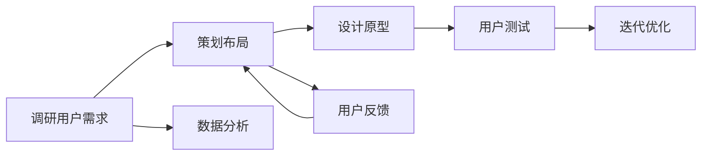
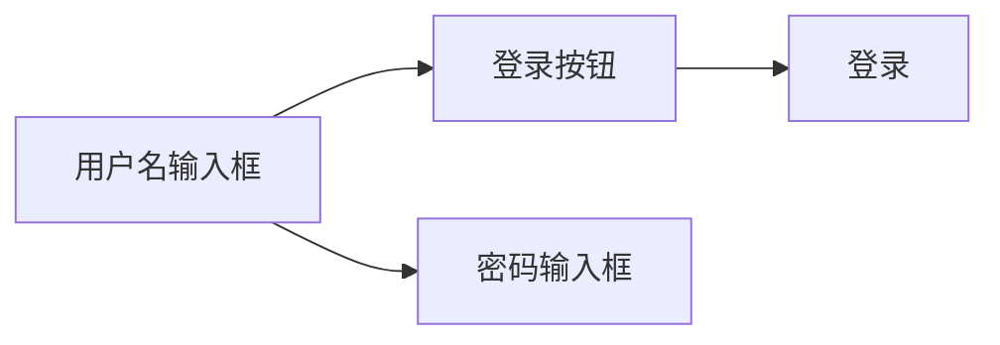
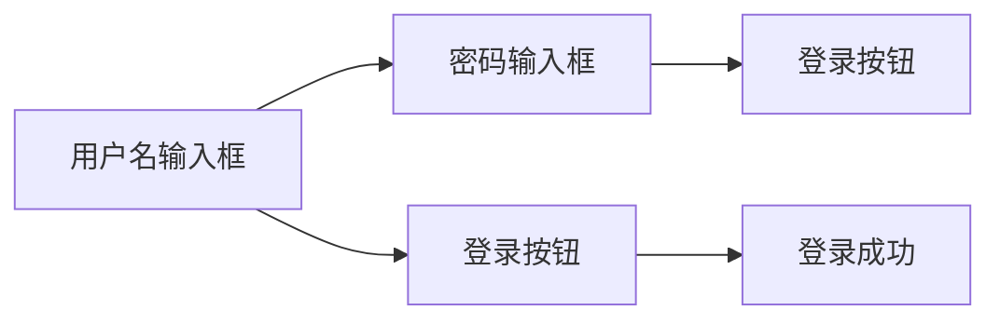

                 

# 用户界面设计：打造友好易用的人机交互体验

## 1. 背景介绍

用户界面(UI)设计是软件设计的重要组成部分，直接影响了用户的使用体验。良好的用户界面设计不仅能够提升用户的满意度，还能促进产品竞争力的提升。本文将从用户界面设计的核心概念入手，通过详细的技术讲解和案例分析，帮助读者了解如何打造高效易用的用户界面，提升用户体验。

## 2. 核心概念与联系

### 2.1 核心概念概述

为更好地理解用户界面设计，本节将介绍几个核心概念：

- 用户界面(UI)：指软件系统与用户交互的界面部分，包括图形、按钮、菜单、对话框等。

- 用户界面设计(UI Design)：指设计用户界面的过程，通过调研用户需求、策划布局、设计原型等方式，构建友好、易用的用户交互界面。

- 可用性(Usability)：指用户使用产品的容易程度，包括易学性、效率、容错性、满意度等方面。

- 交互设计(Interaction Design)：关注用户与系统交互的方式，通过设计用户操作流程、界面反馈、视觉设计等方式，提升用户使用体验。

- 用户体验(User Experience, UX)：指用户与产品交互的整体感受，包括视觉、功能、情感等多维度因素的综合考量。

这些概念之间存在着密切的联系，通过精心设计用户界面，能够提高可用性和用户体验，最终实现用户满意的目标。以下是一个Mermaid流程图，展示了这些概念之间的联系：

```mermaid
graph TB
    A[用户界面(UI)] --> B[可用性(Usability)]
    A --> C[交互设计(Interaction Design)]
    A --> D[用户体验(User Experience, UX)]
    C --> B
    C --> D
    B --> E[易学性(Learnability)]
    B --> F[效率(Efficiency)]
    B --> G[容错性(Tolerance for Error)]
    B --> H[满意度(Satisfaction)]
    F --> H
    G --> H
    E --> D
    F --> D
    G --> D
```

### 2.2 核心概念原理和架构的 Mermaid 流程图

以下是一个简单的用户界面设计架构图，展示了用户界面设计的主要组件和它们之间的关系：

```mermaid
graph TB
    A[用户界面(UI)] --> B[布局(Layout)]
    A --> C[交互元素(Interaction Elements)]
    A --> D[视觉设计(Visual Design)]
    B --> C
    B --> D
    C --> E[按钮(Buttons)]
    C --> F[输入框(Text Fields)]
    C --> G[菜单(Menu)]
    C --> H[对话框(Dialogs)]
    D --> E
    D --> F
    D --> G
    D --> H
```

## 3. 核心算法原理 & 具体操作步骤

### 3.1 算法原理概述

用户界面设计的核心目标是提升用户体验。通过合理布局、交互设计、视觉设计等手段，将用户需求与产品功能完美结合，让用户能够轻松完成其操作目标。以下是一个基本的设计算法原理图：



### 3.2 算法步骤详解

#### 3.2.1 调研用户需求

调研用户需求是设计用户界面的第一步。通过问卷调查、用户访谈、使用数据分析等方式，了解用户的背景、习惯、痛点等，帮助设计团队了解用户真实需求。

#### 3.2.2 策划布局

根据调研结果，策划出合理的布局方案。常用的布局方式包括栅格布局、响应式布局、自适应布局等。布局要考虑可用性、视觉美观等因素，确保用户能够高效、直观地使用产品。

#### 3.2.3 设计原型

基于策划的布局，设计出产品的原型图。原型图是界面设计的初步展示，包括界面元素、颜色、字体、布局等。常用的设计工具包括Sketch、Figma、Adobe XD等。

#### 3.2.4 用户测试

通过用户测试，验证设计方案的可用性。测试方式包括可用性测试、A/B测试等。测试结果将为设计团队提供有价值的反馈，帮助优化设计。

#### 3.2.5 迭代优化

根据测试结果，不断优化设计方案。这一过程是迭代进行的，直到最终设计方案得到用户认可。

### 3.3 算法优缺点

#### 3.3.1 优点

- 提升用户体验：通过合理的布局、交互设计、视觉设计等手段，提升用户使用产品的效率和满意度。
- 提高产品竞争力：良好的用户界面设计能够吸引用户，提升产品的市场竞争力。
- 可复用性高：设计好的界面元素和布局，可以应用于多种产品场景，提高设计效率。

#### 3.3.2 缺点

- 设计周期长：用户界面设计需要大量的调研和测试，周期较长。
- 需要专业知识：用户界面设计需要具备视觉设计、交互设计、用户研究等专业知识。
- 易出现分歧：不同的设计师可能有不同的设计思路，容易产生分歧，影响设计效率。

### 3.4 算法应用领域

用户界面设计广泛应用于各类软件和移动应用中，包括但不限于：

- 网站设计：网页的界面设计和布局，用户导航，搜索优化等。
- 移动应用：APP的界面设计，交互元素的设计，图标的设计等。
- 桌面应用：软件的用户界面设计，图标设计，主界面设计等。

## 4. 数学模型和公式 & 详细讲解 & 举例说明

### 4.1 数学模型构建

用户界面设计的数学模型可以基于可用性模型构建。可用性模型由不同的可用性指标组成，如易学性、效率、容错性、满意度等。这些指标可以通过量化方式来评估用户界面的可用性。

假设用户界面包含$n$个元素，每个元素$e_i$对可用性指标$u_j$的影响系数为$a_{ij}$。可用性$U$可以表示为：

$$U = \sum_{i=1}^n \sum_{j=1}^m a_{ij} x_{ij}$$

其中，$x_{ij}$为元素$e_i$在指标$u_j$上的评分。

### 4.2 公式推导过程

以易学性为例，假设用户界面包含$n$个元素，每个元素$e_i$的易学性评分$x_i$为$1$到$5$之间的整数。易学性$L$的计算公式为：

$$L = \frac{\sum_{i=1}^n \frac{5-x_i}{5}}{n}$$

其中，$\frac{5-x_i}{5}$表示元素$e_i$的易学性评分相对困难的占比，$n$为元素总数。

### 4.3 案例分析与讲解

假设我们设计了一个电商网站的登录页面，包括用户名、密码输入框、登录按钮等。通过用户测试，我们收集到以下数据：

| 元素 | 易学性 | 效率 | 容错性 | 满意度 |
| --- | --- | --- | --- | --- |
| 用户名输入框 | 3 | 4 | 5 | 5 |
| 密码输入框 | 2 | 3 | 4 | 4 |
| 登录按钮 | 5 | 4 | 5 | 5 |

根据上述数据，计算易学性$L$：

$$L = \frac{(5-3)+(5-2)}{3} = 4$$

这表明，整体易学性较好，但仍有改进空间，尤其是在密码输入框方面。

## 5. 项目实践：代码实例和详细解释说明

### 5.1 开发环境搭建

#### 5.1.1 安装开发工具

- Sketch
- Figma
- Adobe XD
- 设计原型工具（如Axure、Balsamiq等）

#### 5.1.2 安装设计原型工具

- Adobe XD：安装步骤略，可在官网下载安装包进行安装。

### 5.2 源代码详细实现

#### 5.2.1 设计原型图

以电商网站的登录页面为例，设计原型图如下：



#### 5.2.2 实现界面元素

在Sketch中，创建登录页面的原型图，并添加以下元素：

1. 用户名输入框：占位符、边框、圆角等。
2. 密码输入框：占位符、边框、圆角等。
3. 登录按钮：按钮、颜色、文本等。

### 5.3 代码解读与分析

#### 5.3.1 设计元素

在Figma中，创建登录页面的原型图，并添加以下元素：

1. 用户名输入框：文本输入框、边框、圆角等。
2. 密码输入框：文本输入框、边框、圆角等。
3. 登录按钮：按钮、颜色、文本等。

### 5.4 运行结果展示

在原型图中，用户可以方便地进行登录操作。用户输入用户名和密码后，点击登录按钮，即可进入系统。以下是一个简单的原型图展示：



## 6. 实际应用场景

### 6.1 电商平台

电商平台的用户界面设计需要考虑商品展示、搜索优化、用户交互等方面。通过合理的布局和交互设计，用户能够高效地浏览商品、完成购物流程。

### 6.2 医疗应用

医疗应用的用户界面设计需要考虑患者的隐私保护、数据安全等方面。通过合理的颜色、图标等视觉设计，提升用户的使用体验和满意度。

### 6.3 社交应用

社交应用的用户界面设计需要考虑用户的互动体验、信息展示等方面。通过合理的界面布局和交互设计，提升用户的活跃度和粘性。

## 7. 工具和资源推荐

### 7.1 学习资源推荐

1. 《用户体验设计基础》：阮一峰著，深入浅出地介绍了用户体验设计的核心概念和实践方法。

2. 《交互设计导论》：Butterworth著，涵盖交互设计的基础知识和设计原则。

3. 《用户界面设计》：Kathleen L. McLean著，系统介绍了用户界面设计的理论和方法。

4. 《设计心理学》：Don Norman著，从心理学的角度探讨了用户界面设计的关键因素。

### 7.2 开发工具推荐

1. Sketch：专业的设计工具，支持创建高质量的原型图。

2. Figma：在线协作工具，支持实时编辑和共享设计原型。

3. Adobe XD：强大的设计工具，支持设计原型和动画效果。

### 7.3 相关论文推荐

1. "Human-Computer Interaction Design Principles" by Antonio J. Mireles, Carl Rosstal：探讨了人机交互设计的原则和实践方法。

2. "User Interface Design Elements" by John Shaw：介绍了用户界面设计的基本元素和设计原则。

3. "Designing Interactive Applications" by Kevin Munster, Lenore Epstein：介绍了交互应用设计的基础和实践方法。

## 8. 总结：未来发展趋势与挑战

### 8.1 研究成果总结

用户界面设计是提升用户体验的重要手段。通过合理的设计和优化，用户能够高效、直观地使用产品。设计过程中需要考虑可用性、交互设计、视觉设计等多个方面。

### 8.2 未来发展趋势

1. 可定制化设计：未来的用户界面设计将更加注重个性化和可定制化，满足不同用户的需求。

2. 动态调整：未来的用户界面设计将更加智能化，能够根据用户行为和环境动态调整布局和交互方式。

3. 跨平台设计：未来的用户界面设计将更加注重跨平台一致性，提升用户的跨设备体验。

4. 人工智能辅助：未来的用户界面设计将更多地采用人工智能技术，优化用户交互和界面设计。

5. 全渠道设计：未来的用户界面设计将更多地考虑全渠道的用户体验，如PC、移动、平板等设备。

### 8.3 面临的挑战

1. 设计复杂度：随着产品功能的增加，用户界面设计的复杂度也随之增加，设计团队需要不断提升设计能力和效率。

2. 用户体验一致性：不同设备、平台之间的用户体验需要保持一致，这对设计提出了更高的要求。

3. 技术迭代：用户界面设计需要不断跟进新技术，如人工智能、虚拟现实等，这对设计师的技术水平提出了更高的要求。

### 8.4 研究展望

未来的用户界面设计将更加注重用户需求和体验的深度挖掘，通过技术和设计方法的创新，提升用户的使用体验和满意度。

## 9. 附录：常见问题与解答

### 9.1 常见问题解答

**Q1：用户界面设计的流程是什么？**

A：用户界面设计的流程包括调研用户需求、策划布局、设计原型、用户测试、迭代优化等步骤。

**Q2：如何提高用户界面的可用性？**

A：通过合理布局、交互设计、视觉设计等方式，提升用户界面的可用性。

**Q3：如何设计用户界面的原型图？**

A：使用Sketch、Figma、Adobe XD等设计工具，创建高质量的原型图。

**Q4：如何优化用户界面的效率？**

A：通过合理的布局和交互设计，减少用户的操作步骤，提升用户体验。

**Q5：如何评估用户界面的可用性？**

A：使用可用性模型和量化评分方法，评估用户界面的可用性。

---

作者：禅与计算机程序设计艺术 / Zen and the Art of Computer Programming

