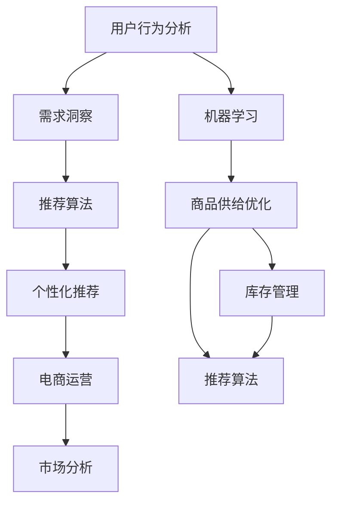

                 

# 用户行为分析：AI如何洞察用户需求，优化商品供给

> 关键词：用户行为分析, 人工智能, 需求洞察, 商品供给优化, 推荐算法, 个性化推荐, 电商运营, 市场分析

## 1. 背景介绍

在电商、零售、金融、营销等商业领域，了解和预测用户行为对于制定有效策略、优化商品供给至关重要。随着大数据、机器学习、人工智能技术的迅猛发展，用户行为分析逐渐成为各大企业竞争的关键因素。通过精确分析用户行为数据，企业可以洞察用户需求，实现更精准的市场预测，优化商品供给，从而在激烈的市场竞争中占据优势。

### 1.1 问题由来

电商平台的运营过程中，商家面临的主要问题包括：

1. **用户流失**：由于市场竞争激烈，用户频繁更换电商平台，商家难以留住老用户。
2. **库存积压**：缺乏精确的用户需求预测，导致部分商品库存过多，部分商品缺货。
3. **推荐系统问题**：推荐算法不够精准，无法有效提升用户满意度和转化率。
4. **个性化需求难以满足**：无法实现对个性化需求的精确响应，影响用户体验和平台吸引力。

这些问题的解决需要依靠用户行为分析技术，深入挖掘用户数据，实现需求洞察，并基于这些洞察进行商品供给优化。

## 2. 核心概念与联系

### 2.1 核心概念概述

为更好地理解用户行为分析及其在商品供给优化中的应用，本节将介绍几个关键概念：

- **用户行为分析**：通过数据收集、存储、处理、分析和可视化，了解用户行为特征，从而揭示用户需求和行为规律。
- **机器学习与人工智能**：利用数据驱动的算法模型，自动分析用户行为数据，识别潜在模式和关联关系。
- **需求洞察**：通过深度学习、自然语言处理等技术，对用户行为数据进行更深入的挖掘，揭示用户潜在的购买意向、兴趣偏好等。
- **商品供给优化**：利用数据分析结果，优化商品库存管理、推荐算法、营销策略，实现资源的最优配置。
- **推荐算法**：通过个性化推荐，提升用户满意度和转化率，增强平台粘性。
- **个性化推荐**：根据用户行为数据，精准匹配用户需求，提供定制化的商品和服务。
- **电商运营**：包括商品管理、库存管理、订单管理、物流配送、售后服务等环节，涉及用户行为分析和商品供给优化的方方面面。
- **市场分析**：通过分析市场数据，识别市场趋势，优化商品组合，满足用户需求，提升市场竞争力。

这些核心概念之间的逻辑关系可以通过以下Mermaid流程图来展示：



这个流程图展示了几组概念之间的联系：

1. 用户行为分析通过机器学习模型获取用户需求洞察，进而指导推荐算法的优化。
2. 推荐算法和个性化推荐基于需求洞察，提升电商运营效果。
3. 市场分析与用户行为分析、商品供给优化紧密关联，通过市场趋势指导电商运营策略的制定。
4. 商品供给优化涉及库存管理和推荐算法，确保商品供需平衡和个性化推荐的准确性。

## 3. 核心算法原理 & 具体操作步骤

### 3.1 算法原理概述

用户行为分析的算法原理主要基于以下三个步骤：

1. **数据收集与预处理**：从电商平台、社交网络、应用软件等渠道收集用户行为数据，包括浏览记录、点击行为、购买行为、评价反馈等，并进行清洗和标准化处理。
2. **特征工程**：根据用户行为数据，提取有意义的特征，如用户的兴趣标签、购买频率、消费能力、行为时间等。
3. **模型训练与预测**：基于机器学习模型，对用户行为数据进行建模，训练预测模型，用于预测用户需求、行为趋势等。

### 3.2 算法步骤详解

#### 3.2.1 数据收集与预处理

1. **数据源选择**：确定需要收集的数据源，包括电商平台的用户行为数据、社交媒体的用户互动数据、移动应用的用户活动数据等。

2. **数据采集**：使用API接口、爬虫技术、数据集成工具等方法，自动采集数据源中的行为数据。

3. **数据清洗**：去除缺失值、异常值，进行数据规范化处理，确保数据质量。

4. **特征提取**：从行为数据中提取有意义的特征，如用户ID、行为时间、浏览次数、购买金额等。

#### 3.2.2 特征工程

1. **用户特征提取**：从行为数据中提取用户的基本特征，如年龄、性别、地域、兴趣标签等。

2. **行为特征提取**：根据用户行为数据，提取行为特征，如购买频率、浏览时长、点击率等。

3. **上下文特征提取**：考虑行为发生的上下文环境，提取更多维度特征，如季节、时间段、天气等。

#### 3.2.3 模型训练与预测

1. **选择合适的模型**：根据任务需求，选择合适的机器学习模型，如随机森林、支持向量机、神经网络等。

2. **模型训练**：使用训练集数据，训练模型，调整模型参数，确保模型能够准确预测用户行为。

3. **模型评估**：使用测试集数据，评估模型的预测准确率、召回率等性能指标。

4. **模型优化**：根据评估结果，优化模型结构、调整参数，提升模型性能。

### 3.3 算法优缺点

#### 3.3.1 优点

1. **高效性**：通过机器学习模型，可以自动化处理大量用户行为数据，快速生成分析结果。
2. **准确性**：模型能够学习数据中的复杂关系，提供高精度的预测和推荐。
3. **灵活性**：支持多种特征类型，能够适应不同的应用场景。

#### 3.3.2 缺点

1. **数据依赖**：模型的准确性高度依赖于数据的质量和完整性。
2. **模型复杂**：复杂的机器学习模型需要较高的计算资源和时间成本。
3. **可解释性**：部分模型（如深度学习）的决策过程较为复杂，难以解释。

### 3.4 算法应用领域

用户行为分析技术在电商、金融、营销、社交等多个领域得到了广泛应用：

- **电商运营**：用于提升用户转化率、优化商品推荐、控制库存水平、改进客户服务。
- **金融服务**：用于风险管理、客户分群、投资策略优化、欺诈检测。
- **市场分析**：用于市场趋势预测、产品组合优化、营销活动效果评估。
- **社交网络**：用于用户兴趣识别、内容推荐、广告投放优化、用户行为预测。

## 4. 数学模型和公式 & 详细讲解 & 举例说明

### 4.1 数学模型构建

假设用户行为数据集为 $D=\{(x_i, y_i)\}_{i=1}^N$，其中 $x_i$ 为行为特征向量，$y_i$ 为行为标签（如购买、浏览、评价等）。

定义用户行为分类模型 $M$，使用逻辑回归作为分类器，则模型的预测函数为：

$$
\hat{y} = M(x) = \frac{1}{1+\exp(-\beta^T x)} \text{, where } \beta \text{ is the vector of parameters.}
$$

目标是最小化预测误差：

$$
L(M) = -\frac{1}{N} \sum_{i=1}^N y_i \log \hat{y}_i + (1-y_i) \log (1-\hat{y}_i)
$$

使用梯度下降法更新模型参数 $\beta$：

$$
\beta \leftarrow \beta - \eta \nabla_{\beta} L(M)
$$

其中 $\eta$ 为学习率。

### 4.2 公式推导过程

#### 4.2.1 逻辑回归模型

逻辑回归是用户行为分析中最常用的分类模型之一。其核心思想是将数据映射到一个概率空间中，通过计算概率分布来预测用户行为。

假设输入特征向量 $x$，目标行为标签 $y$，定义模型参数 $\beta$，则逻辑回归模型的预测概率为：

$$
\hat{y} = \frac{1}{1+\exp(-\beta^T x)}
$$

其中，$\beta^T x$ 为模型对输入特征的线性组合，表示用户行为的概率。

模型的损失函数为交叉熵损失函数，表示模型预测与真实标签之间的差异：

$$
L(M) = -\frac{1}{N} \sum_{i=1}^N [y_i \log \hat{y}_i + (1-y_i) \log (1-\hat{y}_i)]
$$

通过梯度下降法更新模型参数 $\beta$：

$$
\beta \leftarrow \beta - \eta \nabla_{\beta} L(M)
$$

其中，$\nabla_{\beta} L(M)$ 为损失函数对模型参数的梯度。

#### 4.2.2 梯度下降算法

梯度下降是机器学习中常用的优化算法，通过迭代调整模型参数，使模型误差最小化。其更新公式为：

$$
\theta \leftarrow \theta - \eta \nabla_{\theta} L(\theta)
$$

其中，$\theta$ 为模型参数，$L(\theta)$ 为损失函数，$\eta$ 为学习率，$\nabla_{\theta} L(\theta)$ 为损失函数对模型参数的梯度。

### 4.3 案例分析与讲解

以电商平台的推荐系统为例，说明如何通过用户行为分析进行个性化推荐：

1. **数据收集**：从电商平台的数据库中收集用户的历史浏览、购买、评价等行为数据。

2. **特征提取**：提取用户的基本信息（如年龄、性别、地域）、行为特征（如浏览次数、购买金额、评价评分）、上下文特征（如时间段、天气）等。

3. **模型训练**：使用逻辑回归模型，对用户行为数据进行训练，学习用户行为模式和偏好。

4. **推荐生成**：根据用户的行为特征和模型预测结果，生成个性化的推荐列表，提升用户体验和转化率。

## 5. 项目实践：代码实例和详细解释说明

### 5.1 开发环境搭建

以下是使用Python和Scikit-learn进行用户行为分析的开发环境搭建步骤：

1. 安装Python：从官网下载并安装最新版本的Python，确保支持所需的库版本。

2. 安装Scikit-learn：使用pip安装Scikit-learn库，用于实现机器学习模型。

```bash
pip install scikit-learn
```

3. 安装Numpy、Pandas等库：使用pip安装Numpy、Pandas、Matplotlib等库，用于数据处理和可视化。

```bash
pip install numpy pandas matplotlib
```

4. 准备数据集：从电商平台或其他数据源获取用户行为数据，并进行清洗和标准化处理。

5. 编写代码：使用Python编写代码，实现数据处理、特征工程、模型训练和推荐算法。

### 5.2 源代码详细实现

以下是一个简单的用户行为分析示例代码，包括数据收集、预处理、特征提取、模型训练和推荐生成：

```python
import pandas as pd
from sklearn.linear_model import LogisticRegression
from sklearn.model_selection import train_test_split
import numpy as np

# 数据加载与预处理
data = pd.read_csv('user_behavior_data.csv')
data.fillna(0, inplace=True)

# 特征提取
features = data[['age', 'gender', 'region', 'browsing_count', 'purchase_amount', 'rating']]
labels = data['purchase']
X_train, X_test, y_train, y_test = train_test_split(features, labels, test_size=0.2)

# 模型训练
model = LogisticRegression()
model.fit(X_train, y_train)

# 预测生成
predictions = model.predict_proba(X_test)

# 推荐生成
recommendations = np.where(predictions > 0.5, 1, 0)
```

### 5.3 代码解读与分析

#### 5.3.1 数据加载与预处理

1. **数据加载**：使用Pandas的`read_csv`方法，从本地或远程数据源加载用户行为数据，确保数据格式正确。

2. **数据预处理**：使用`fillna`方法填充缺失值，使用标准化技术对数据进行预处理，确保数据质量。

#### 5.3.2 特征提取

1. **特征选择**：根据用户行为数据，提取有意义的特征，如用户的年龄、性别、地域、浏览次数、购买金额等。

2. **数据拆分**：使用Scikit-learn的`train_test_split`方法，将数据集拆分为训练集和测试集，确保模型评估的准确性。

#### 5.3.3 模型训练

1. **模型选择**：使用Scikit-learn的`LogisticRegression`类，选择逻辑回归模型作为用户行为分类模型。

2. **模型训练**：使用训练集数据，调用`fit`方法训练模型，调整模型参数。

#### 5.3.4 预测生成

1. **预测概率**：使用`predict_proba`方法，计算模型对每个样本的预测概率。

2. **预测生成**：将预测概率转化为0或1的二元输出，生成推荐结果。

### 5.4 运行结果展示

运行代码后，可以获取用户行为分析的结果，包括模型的准确率、召回率等性能指标，以及生成的推荐列表。这些结果可以用于电商平台的商品推荐、库存管理、营销策略优化等应用场景。

## 6. 实际应用场景

### 6.1 电商平台

电商平台是用户行为分析的主要应用场景之一。通过分析用户浏览、购买、评价等行为数据，电商平台可以实现以下目标：

1. **个性化推荐**：根据用户行为数据，生成个性化推荐列表，提升用户体验和转化率。
2. **库存管理**：分析用户购买行为，优化商品库存，避免库存积压或缺货。
3. **客户服务**：根据用户行为数据，提供精准的客户服务，提升客户满意度。

### 6.2 金融服务

金融服务行业通过用户行为分析，可以实现以下目标：

1. **风险管理**：分析用户的投资行为和信用历史，预测风险，优化信贷决策。
2. **客户分群**：根据用户的消费行为和偏好，进行客户分群，实现差异化的营销策略。
3. **欺诈检测**：分析异常行为，识别欺诈行为，提升安全防范能力。

### 6.3 社交网络

社交网络平台通过用户行为分析，可以实现以下目标：

1. **内容推荐**：根据用户行为数据，推荐用户感兴趣的内容，提升平台粘性。
2. **广告投放优化**：分析用户互动数据，优化广告投放策略，提升广告效果。
3. **用户行为预测**：分析用户行为，预测未来的行为趋势，优化平台策略。

### 6.4 未来应用展望

用户行为分析技术在未来将有更广阔的应用前景，随着技术的不断进步，新的应用场景和应用方法将不断涌现：

1. **实时行为分析**：通过实时数据流处理技术，实现实时行为分析，提升决策的及时性和准确性。
2. **跨平台行为分析**：将用户在不同平台的行为数据进行整合，实现更全面的用户行为分析。
3. **多模态行为分析**：结合用户的多模态数据（如语音、图像、位置等），进行更全面的用户行为分析。
4. **联邦学习**：通过分布式数据处理技术，在保护用户隐私的前提下，实现跨平台、跨组织的用户行为分析。

## 7. 工具和资源推荐

### 7.1 学习资源推荐

1. **《Python机器学习》**：介绍Python在机器学习中的应用，适合入门和进阶。
2. **Coursera的机器学习课程**：由斯坦福大学教授Andrew Ng主讲，全面讲解机器学习的基本概念和算法。
3. **Kaggle竞赛**：通过参与Kaggle数据竞赛，实践机器学习和数据分析技能，提升实战经验。
4. **Scikit-learn官方文档**：详细介绍了Scikit-learn库的使用方法和算法实现。
5. **机器学习实战网站**：提供大量实战案例和代码示例，适合学习者参考和实践。

### 7.2 开发工具推荐

1. **Jupyter Notebook**：免费的交互式编程环境，支持Python、R等语言，适合开发数据分析和机器学习应用。
2. **TensorFlow**：由Google开发的开源深度学习框架，支持分布式计算和高效训练。
3. **PyTorch**：由Facebook开发的开源深度学习框架，易于使用和部署。
4. **Scikit-learn**：Python机器学习库，提供多种机器学习算法和工具。
5. **Apache Spark**：大数据处理框架，支持分布式数据处理和分析。

### 7.3 相关论文推荐

1. **《个性化推荐系统：构建模型、评估方法与技术挑战》**：介绍个性化推荐系统的构建方法、评估指标和技术挑战。
2. **《用户行为分析与推荐系统》**：探讨用户行为分析的基本概念、方法和应用场景。
3. **《深度学习在用户行为分析中的应用》**：介绍深度学习在用户行为分析中的应用案例和技术方法。
4. **《用户行为分析与数据挖掘》**：讲解用户行为分析的基本理论和数据挖掘技术。
5. **《基于用户行为分析的电商推荐系统》**：探讨基于用户行为分析的电商推荐系统构建方法和技术。

## 8. 总结：未来发展趋势与挑战

### 8.1 研究成果总结

本文详细介绍了用户行为分析的算法原理、操作步骤、优缺点和应用领域，通过实例代码展示了用户行为分析的实际应用，并通过实际应用场景和未来展望，展示了用户行为分析技术的广泛应用前景。

### 8.2 未来发展趋势

未来，用户行为分析技术将呈现以下发展趋势：

1. **实时化**：通过实时数据处理技术，实现实时用户行为分析，提升决策效率和响应速度。
2. **多模态化**：结合多模态数据，实现更全面、深入的用户行为分析。
3. **联邦学习**：在保护用户隐私的前提下，实现跨平台、跨组织的数据共享和分析。
4. **自动化**：通过自动化技术，提升用户行为分析的效率和准确性。
5. **模型可解释性**：提高模型的可解释性，提升用户信任度和应用效果。

### 8.3 面临的挑战

虽然用户行为分析技术具有广泛的应用前景，但在实际应用中仍面临以下挑战：

1. **数据隐私与安全**：用户行为数据涉及个人隐私，如何保护数据安全是关键问题。
2. **数据质量与完整性**：用户行为数据的完整性和质量直接影响分析结果的准确性。
3. **算法复杂度**：复杂的机器学习模型需要较高的计算资源和时间成本。
4. **跨平台数据整合**：不同平台的数据格式和来源不同，如何实现跨平台数据整合是技术难点。
5. **模型可解释性**：部分机器学习模型的决策过程较为复杂，难以解释。

### 8.4 研究展望

为了应对这些挑战，未来需要在以下几个方面进行研究：

1. **数据隐私保护技术**：研究数据匿名化、差分隐私等技术，保护用户隐私。
2. **数据质量提升**：采用数据清洗、标准化技术，提升数据质量。
3. **自动化与可解释性**：研究自动化机器学习技术，提升算法效率和可解释性。
4. **多模态数据融合**：研究多模态数据的融合与分析方法，提升用户行为分析的全面性。

总之，用户行为分析技术在电商、金融、社交等多个领域具有广泛的应用前景，但需要在数据隐私、数据质量、算法复杂度等方面进行深入研究，才能实现更好的应用效果。未来，随着技术的不断进步，用户行为分析技术将进一步推动人工智能在商业应用中的发展。

## 9. 附录：常见问题与解答

### 9.1 用户行为分析的常见问题及解答

**Q1：用户行为分析的主要步骤是什么？**

A1: 用户行为分析的主要步骤包括数据收集与预处理、特征工程、模型训练与预测等。

**Q2：用户行为分析的主要算法有哪些？**

A2: 用户行为分析的主要算法包括逻辑回归、决策树、随机森林、支持向量机、神经网络等。

**Q3：如何选择合适的机器学习模型？**

A3: 根据任务需求和数据特点，选择合适的机器学习模型。例如，对于分类任务，可以选择逻辑回归、支持向量机等模型；对于回归任务，可以选择线性回归、随机森林等模型。

**Q4：用户行为分析的应用场景有哪些？**

A4: 用户行为分析的应用场景包括电商平台的个性化推荐、金融服务的风险管理、社交网络的内容推荐等。

**Q5：如何进行实时用户行为分析？**

A5: 实时用户行为分析需要采用实时数据处理技术，如Apache Kafka、Apache Flink等，确保数据实时采集和处理。

**Q6：用户行为分析需要注意哪些问题？**

A6: 用户行为分析需要注意数据隐私、数据质量、算法复杂度等问题。同时，需要结合具体应用场景，选择适合的机器学习模型和算法。

以上回答总结了用户行为分析的主要步骤、算法、应用场景以及需要注意的问题，希望对您有所帮助。

---

作者：禅与计算机程序设计艺术 / Zen and the Art of Computer Programming

