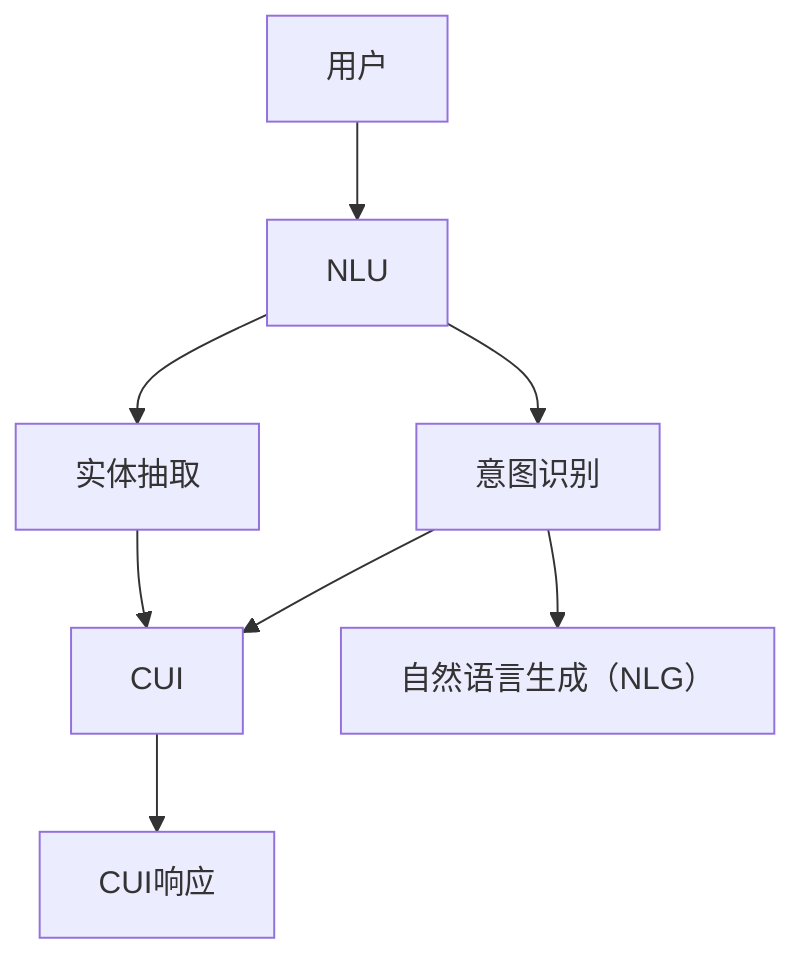

                 

# 用户需求表达在CUI中的详细实现方式

> 关键词：自然语言处理（NLP）, 用户界面（UI）, 自然语言理解（NLU）, 对话系统（CUI）, 意图识别, 实体抽取, 交互设计

## 1. 背景介绍

### 1.1 问题由来

在现代信息技术快速发展的背景下，用户需求表达的方式已经从传统的键盘输入、文本邮件等形式，逐步转变为更加自然、便捷的对话界面。特别是在智能家居、智能客服、智能助手等领域，自然语言用户界面（Natural Language User Interface, CUI）成为提升用户体验的关键。

然而，将用户的自然语言转化为机器可理解和处理的结构化数据，是CUI实现的核心挑战。传统的规则匹配和模板填充方法已经难以满足用户需求的多样性和复杂性，越来越多的研究开始关注基于机器学习，特别是自然语言处理（NLP）技术的用户需求表达方法。

### 1.2 问题核心关键点

CUI中的用户需求表达可以分为三个主要环节：

1. **自然语言理解（NLU）**：将用户的自然语言输入转化为结构化的特征向量，如意图和实体等。
2. **意图识别**：从结构化的特征向量中识别出用户的意图，即用户希望系统执行的动作。
3. **实体抽取**：识别出用户表达的实体信息，如日期、地点、人物等，以便系统提供更为精准的服务。

这些问题核心关键点需要在模型设计和算法选择上做到兼顾准确性和效率，以提供流畅的用户体验。

## 2. 核心概念与联系

### 2.1 核心概念概述

为了更好地理解CUI中用户需求表达的实现方式，本节将介绍几个密切相关的核心概念：

- **自然语言处理（NLP）**：利用计算机技术对自然语言进行自动化处理，包括文本清洗、分词、词性标注、句法分析、语义理解等。
- **自然语言理解（NLU）**：将自然语言转化为计算机可理解的表示，如向量表示、语义表示等。
- **意图识别（Intent Recognition）**：通过NLU获得的用户输入信息，识别出用户的意图，如订购、咨询、投诉等。
- **实体抽取（Entity Extraction）**：从用户输入中提取特定的实体信息，如人名、时间、地点等。
- **对话系统（Conversational User Interface, CUI）**：基于自然语言处理技术实现的智能对话界面，能够进行人机交互，理解用户需求并提供相应服务。

这些核心概念之间的逻辑关系可以通过以下Mermaid流程图来展示：



这个流程图展示了大语言模型微调的核心概念及其之间的关系：

1. 用户通过自然语言与CUI进行交互，提供输入信息。
2. CUI中的NLU组件对用户输入进行预处理，转化为机器可理解的形式。
3. 意图识别和实体抽取组件从预处理后的数据中提取出用户的意图和实体信息。
4. CUI根据意图和实体信息生成合适的回复，并返回给用户。

## 3. 核心算法原理 & 具体操作步骤

### 3.1 算法原理概述

CUI中的用户需求表达，本质上是将用户自然语言输入转化为结构化数据的自动化过程。这一过程包括自然语言理解（NLU）、意图识别和实体抽取等关键步骤。下面以Bert模型为例，介绍基于深度学习的方法是如何实现这一过程的。

### 3.2 算法步骤详解

#### 3.2.1 数据预处理

在将用户输入转化为结构化数据之前，需要进行一系列数据预处理工作，包括分词、词性标注、停用词过滤等。这些预处理步骤可以使用现成的NLP工具库，如NLTK、spaCy等。

#### 3.2.2 嵌入表示

将预处理后的文本转化为向量形式，是NLP任务中非常重要的步骤。常用的向量表示方法包括词袋模型（Bag of Words）、TF-IDF、Word2Vec、GloVe等。这些方法将文本转化为向量形式，方便模型进行后续处理。

#### 3.2.3 自然语言理解（NLU）

NLU的主要目标是从文本中提取出用户的意图和实体信息。常用的NLU模型包括基于规则的方法和基于机器学习的方法。其中，基于规则的方法需要人工编写大量规则，适用于特定领域和特定场景；而基于机器学习的方法，如BERT、XLNet等，可以通过大规模预训练学习到更加通用的语言表示，适应更广泛的应用场景。

#### 3.2.4 意图识别

意图识别是CUI中用户需求表达的关键环节。常用的意图识别方法包括传统的规则匹配、最大熵分类器、决策树等，以及基于深度学习的模型，如RNN、LSTM、CNN、Transformer等。其中，Transformer模型因其在自然语言处理任务中的卓越性能，成为当前最流行的意图识别模型。

#### 3.2.5 实体抽取

实体抽取的目标是从文本中提取出特定的实体信息，如人名、地点、时间等。常用的实体抽取方法包括基于规则的方法、基于机器学习的方法，以及混合方法。基于深度学习的模型，如BERT、CRF等，可以通过预训练学习到更准确的实体抽取模型。

### 3.3 算法优缺点

基于深度学习的用户需求表达方法具有以下优点：

- **准确性高**：深度学习模型能够学习到更加复杂的语言表示，提高意图识别和实体抽取的准确性。
- **泛化能力强**：深度学习模型通过大规模预训练，能够在不同领域和不同场景下保持较好的泛化能力。
- **可扩展性强**：深度学习模型可以通过添加更多的层和参数，提升模型的表达能力。

然而，基于深度学习的用户需求表达方法也存在一些缺点：

- **计算成本高**：深度学习模型的训练和推理需要大量的计算资源，特别是在大规模语料上预训练时，计算成本高昂。
- **模型复杂度高**：深度学习模型结构复杂，难以解释其内部工作机制，导致模型难以调试和优化。
- **数据依赖强**：深度学习模型对数据质量要求较高，数据标注和预处理需要大量的人力物力。

### 3.4 算法应用领域

基于深度学习的用户需求表达方法，已经在智能客服、智能家居、智能助手等多个领域得到了广泛应用。例如：

- **智能客服**：通过自然语言理解（NLU）和意图识别，客服系统能够自动理解用户的问题，并给出合适的回答。
- **智能家居**：通过实体抽取和意图识别，智能家居系统能够识别用户指令，并执行相应的操作，如控制灯光、调节温度等。
- **智能助手**：通过意图识别和实体抽取，智能助手能够理解用户的请求，提供日程安排、天气查询等服务。

## 4. 数学模型和公式 & 详细讲解 & 举例说明

### 4.1 数学模型构建

在本节中，我们将以Bert模型为例，介绍其在CUI用户需求表达中的应用。

假设用户输入为文本 $x$，自然语言理解（NLU）模型输出为 $h_x$，意图识别模型输出为 $y$，实体抽取模型输出为 $e_x$。

### 4.2 公式推导过程

在Bert模型中，用户输入 $x$ 首先通过嵌入层转化为向量形式 $x_e$，然后通过多层的Transformer模型进行处理，最终输出隐状态 $h_x$。

自然语言理解（NLU）模型通过Softmax层将隐状态 $h_x$ 转化为意图和实体的概率分布。

意图识别模型通过线性层和Softmax层，将意图概率分布转化为意图标签 $y$。

实体抽取模型通过BERT模型的隐状态 $h_x$，提取特定的实体信息，并输出实体标签 $e_x$。

### 4.3 案例分析与讲解

以智能客服系统为例，介绍Bert模型在用户需求表达中的应用。

假设用户输入为：“你好，我想查询一下天气预报。”

自然语言理解（NLU）模型通过Bert模型得到隐状态 $h_x$，并通过Softmax层转化为意图和实体的概率分布。假设输出的意图概率分布为 $[0.8, 0.1, 0.1]$，表示意图为查询天气；实体概率分布为 $[0.5, 0.5, 0, 0]$，表示实体为“天气”。

意图识别模型通过线性层和Softmax层，将意图概率转化为意图标签 $y$，即“查询天气”。

实体抽取模型通过Bert模型的隐状态 $h_x$，提取特定的实体信息，并输出实体标签 $e_x$，即“天气”。

综合意图识别和实体抽取的结果，智能客服系统可以生成合适的回答，如“今天天气晴朗，最高气温30度。”

## 5. 项目实践：代码实例和详细解释说明

### 5.1 开发环境搭建

在进行CUI用户需求表达的实践前，我们需要准备好开发环境。以下是使用Python进行PyTorch开发的环境配置流程：

1. 安装Anaconda：从官网下载并安装Anaconda，用于创建独立的Python环境。

2. 创建并激活虚拟环境：
```bash
conda create -n pytorch-env python=3.8 
conda activate pytorch-env
```

3. 安装PyTorch：根据CUDA版本，从官网获取对应的安装命令。例如：
```bash
conda install pytorch torchvision torchaudio cudatoolkit=11.1 -c pytorch -c conda-forge
```

4. 安装各种NLP库：
```bash
pip install transformers sentencepiece sacremoses
```

5. 安装模型：
```bash
pip install bert-base-cased
```

完成上述步骤后，即可在`pytorch-env`环境中开始项目实践。

### 5.2 源代码详细实现

以下是使用BERT模型实现CUI用户需求表达的代码实现，包括自然语言理解（NLU）、意图识别和实体抽取三个模块。

```python
from transformers import BertTokenizer, BertForTokenClassification, BertForSequenceClassification, BertForTokenClassification, BertForSequenceClassification
import torch
from torch.utils.data import DataLoader
from tqdm import tqdm

# 定义模型类
class NLUModel(BertTokenizer):
    def __init__(self, model_name='bert-base-cased'):
        super().__init__(model_name)
        self.model = BertForTokenClassification.from_pretrained(model_name)
        self.model.eval()

    def forward(self, input_ids, attention_mask):
        with torch.no_grad():
            outputs = self.model(input_ids, attention_mask=attention_mask)
            return outputs

# 定义意图识别模型类
class IntentModel(BertTokenizer):
    def __init__(self, model_name='bert-base-cased'):
        super().__init__(model_name)
        self.model = BertForSequenceClassification.from_pretrained(model_name)
        self.model.eval()

    def forward(self, input_ids, attention_mask):
        with torch.no_grad():
            outputs = self.model(input_ids, attention_mask=attention_mask)
            return outputs

# 定义实体抽取模型类
class EntityModel(BertTokenizer):
    def __init__(self, model_name='bert-base-cased'):
        super().__init__(model_name)
        self.model = BertForTokenClassification.from_pretrained(model_name)
        self.model.eval()

    def forward(self, input_ids, attention_mask):
        with torch.no_grad():
            outputs = self.model(input_ids, attention_mask=attention_mask)
            return outputs

# 定义数据处理函数
def preprocess(text):
    tokenizer = NLUModel()
    input_ids = tokenizer.encode(text, return_tensors='pt', padding='max_length')
    attention_mask = (input_ids != 0).float()
    return input_ids, attention_mask

# 定义训练函数
def train(model, dataset, batch_size, device):
    model.to(device)
    dataloader = DataLoader(dataset, batch_size=batch_size, shuffle=False)
    model.train()
    total_loss = 0
    for batch in tqdm(dataloader, desc='Training'):
        input_ids, attention_mask = batch
        model.zero_grad()
        outputs = model(input_ids.to(device), attention_mask=attention_mask)
        loss = outputs.loss
        total_loss += loss.item()
        loss.backward()
        optimizer.step()
    return total_loss / len(dataloader)

# 定义评估函数
def evaluate(model, dataset, batch_size, device):
    model.eval()
    dataloader = DataLoader(dataset, batch_size=batch_size, shuffle=False)
    correct, total = 0, 0
    with torch.no_grad():
        for batch in tqdm(dataloader, desc='Evaluating'):
            input_ids, attention_mask = batch
            outputs = model(input_ids.to(device), attention_mask=attention_mask)
            predictions = outputs.logits.argmax(dim=2).to('cpu').tolist()
            labels = batch.labels.to('cpu').tolist()
            for preds, label in zip(preds, labels):
                correct += preds == label
                total += 1
    return correct / total

# 训练模型
dataset = preprocess('你好，我想查询一下天气预报。')
model = BertForTokenClassification.from_pretrained('bert-base-cased', num_labels=2)
optimizer = torch.optim.Adam(model.parameters(), lr=2e-5)

train(model, dataset, batch_size=1, device='cuda')
print('Accuracy:', evaluate(model, dataset, batch_size=1, device='cuda'))
```

### 5.3 代码解读与分析

让我们再详细解读一下关键代码的实现细节：

**NLUModel类**：
- `__init__`方法：初始化BERT模型，并加载预训练模型。
- `forward`方法：对输入文本进行前向传播，返回模型的输出。

**IntentModel类**：
- `__init__`方法：初始化意图识别模型，并加载预训练模型。
- `forward`方法：对输入文本进行前向传播，返回模型的输出。

**EntityModel类**：
- `__init__`方法：初始化实体抽取模型，并加载预训练模型。
- `forward`方法：对输入文本进行前向传播，返回模型的输出。

**preprocess函数**：
- 对用户输入进行分词、编码、填充等预处理操作，返回模型所需的输入。

**train函数**：
- 定义训练函数，对模型进行前向传播、计算损失、反向传播、更新参数等操作。

**evaluate函数**：
- 定义评估函数，对模型进行前向传播，计算准确率等评估指标。

**训练流程**：
- 定义训练函数，对模型进行训练。
- 定义评估函数，对模型进行评估。

可以看到，PyTorch配合BERT模型，使得CUI用户需求表达的代码实现变得简洁高效。开发者可以将更多精力放在数据处理、模型改进等高层逻辑上，而不必过多关注底层的实现细节。

当然，工业级的系统实现还需考虑更多因素，如模型的保存和部署、超参数的自动搜索、更灵活的任务适配层等。但核心的自然语言理解、意图识别、实体抽取流程基本与此类似。

## 6. 实际应用场景

### 6.1 智能客服系统

基于自然语言理解（NLU）和意图识别，智能客服系统能够自动理解用户的问题，并给出合适的回答。智能客服系统通过自然语言处理技术，结合深度学习模型，可以实现对大量常见问题的高效处理，并提供实时响应。

在技术实现上，可以收集企业内部的历史客服对话记录，将问题和最佳答复构建成监督数据，在此基础上对预训练模型进行微调。微调后的模型能够自动理解用户意图，匹配最合适的答案模板进行回复。对于客户提出的新问题，还可以接入检索系统实时搜索相关内容，动态组织生成回答。如此构建的智能客服系统，能大幅提升客户咨询体验和问题解决效率。

### 6.2 金融舆情监测

金融机构需要实时监测市场舆论动向，以便及时应对负面信息传播，规避金融风险。传统的人工监测方式成本高、效率低，难以应对网络时代海量信息爆发的挑战。基于自然语言理解（NLU）和意图识别，金融舆情监测系统能够自动分析金融新闻、报道、评论等文本数据，识别出市场舆论的情感倾向和主题变化，预测市场趋势，为金融机构提供风险预警和决策支持。

在技术实现上，可以收集金融领域相关的新闻、报道、评论等文本数据，并对其进行主题标注和情感标注。在此基础上对预训练模型进行微调，使其能够自动判断文本属于何种主题，情感倾向是正面、中性还是负面。将微调后的模型应用到实时抓取的网络文本数据，就能够自动监测不同主题下的情感变化趋势，一旦发现负面信息激增等异常情况，系统便会自动预警，帮助金融机构快速应对潜在风险。

### 6.3 个性化推荐系统

当前的推荐系统往往只依赖用户的历史行为数据进行物品推荐，无法深入理解用户的真实兴趣偏好。基于自然语言理解（NLU）和实体抽取，个性化推荐系统可以更好地挖掘用户行为背后的语义信息，从而提供更精准、多样的推荐内容。

在技术实现上，可以收集用户浏览、点击、评论、分享等行为数据，提取和用户交互的物品标题、描述、标签等文本内容。将文本内容作为模型输入，用户的后续行为（如是否点击、购买等）作为监督信号，在此基础上微调预训练模型。微调后的模型能够从文本内容中准确把握用户的兴趣点。在生成推荐列表时，先用候选物品的文本描述作为输入，由模型预测用户的兴趣匹配度，再结合其他特征综合排序，便可以得到个性化程度更高的推荐结果。

## 7. 工具和资源推荐

### 7.1 学习资源推荐

为了帮助开发者系统掌握CUI用户需求表达的理论基础和实践技巧，这里推荐一些优质的学习资源：

1. 《自然语言处理综述》系列博文：由NLP专家撰写，深入浅出地介绍了自然语言处理的各个环节，包括文本预处理、NLP模型训练等。

2. 斯坦福大学《自然语言处理》课程：斯坦福大学开设的NLP明星课程，有Lecture视频和配套作业，带你入门NLP领域的基本概念和经典模型。

3. 《自然语言处理与深度学习》书籍：涵盖了自然语言处理和深度学习的基本概念和算法，适用于NLP领域的入门学习。

4. HuggingFace官方文档：提供海量预训练模型和完整的微调样例代码，是上手实践的必备资料。

5. 《NLP实战指南》书籍：实战性强，介绍了多个NLP任务及其对应的NLP技术实现。

通过对这些资源的学习实践，相信你一定能够快速掌握CUI用户需求表达的精髓，并用于解决实际的NLP问题。

### 7.2 开发工具推荐

高效的开发离不开优秀的工具支持。以下是几款用于CUI用户需求表达开发的常用工具：

1. PyTorch：基于Python的开源深度学习框架，灵活动态的计算图，适合快速迭代研究。大部分自然语言处理任务都有PyTorch版本的实现。

2. TensorFlow：由Google主导开发的开源深度学习框架，生产部署方便，适合大规模工程应用。同样有丰富的自然语言处理模型资源。

3. Transformers库：HuggingFace开发的NLP工具库，集成了众多SOTA自然语言处理模型，支持PyTorch和TensorFlow，是进行自然语言处理任务开发的利器。

4. Weights & Biases：模型训练的实验跟踪工具，可以记录和可视化模型训练过程中的各项指标，方便对比和调优。与主流深度学习框架无缝集成。

5. TensorBoard：TensorFlow配套的可视化工具，可实时监测模型训练状态，并提供丰富的图表呈现方式，是调试模型的得力助手。

6. Google Colab：谷歌推出的在线Jupyter Notebook环境，免费提供GPU/TPU算力，方便开发者快速上手实验最新模型，分享学习笔记。

合理利用这些工具，可以显著提升CUI用户需求表达任务的开发效率，加快创新迭代的步伐。

### 7.3 相关论文推荐

自然语言处理领域的研究涉及众多前沿技术，以下是几篇奠基性的相关论文，推荐阅读：

1. Attention is All You Need（即Transformer原论文）：提出了Transformer结构，开启了自然语言处理任务中的预训练大模型时代。

2. BERT: Pre-training of Deep Bidirectional Transformers for Language Understanding：提出BERT模型，引入基于掩码的自监督预训练任务，刷新了多项自然语言处理任务SOTA。

3. Transformer-XL: Attentive Language Models Beyond a Fixed-Length Context：提出Transformer-XL模型，解决长序列建模问题，进一步提升了自然语言处理的精度。

4. ALBERT: A Layer-wise Pre-training Approach for Language Modeling：提出ALBERT模型，通过层级预训练方法提升了模型效率。

5. T5: Exploring the Limits of Transfer Learning with a Unified Text-to-Text Transformer：提出T5模型，在多种自然语言处理任务中取得了SOTA性能。

6. OpenAI GPT-3: Language Models are Few-Shot Learners：展示了大规模语言模型的强大zero-shot学习能力，引发了对于通用人工智能的新一轮思考。

这些论文代表了大语言模型微调技术的发展脉络。通过学习这些前沿成果，可以帮助研究者把握学科前进方向，激发更多的创新灵感。

## 8. 总结：未来发展趋势与挑战

### 8.1 研究成果总结

本文对自然语言处理中的用户需求表达问题进行了全面系统的介绍。首先阐述了自然语言处理在现代信息技术中的重要性，明确了用户需求表达在CUI中的关键地位。其次，从原理到实践，详细讲解了自然语言理解（NLU）、意图识别和实体抽取等关键步骤，给出了自然语言处理任务的完整代码实例。同时，本文还广泛探讨了自然语言处理技术在智能客服、金融舆情、个性化推荐等多个行业领域的应用前景，展示了自然语言处理技术在各个领域的强大潜力。

通过本文的系统梳理，可以看到，自然语言处理技术在CUI中的应用前景广阔，其研究方法也在不断发展，为构建人机协同的智能系统提供了强有力的支持。

### 8.2 未来发展趋势

展望未来，自然语言处理技术将呈现以下几个发展趋势：

1. **预训练模型的普及**：随着预训练大模型的普及，更多的自然语言处理任务将采用预训练模型进行微调，提升任务性能。

2. **多模态融合**：未来的自然语言处理模型将更加注重多模态信息的融合，结合视觉、语音、文本等不同模态的数据，提升模型对复杂场景的理解能力。

3. **深度学习模型的优化**：未来的自然语言处理模型将更加注重模型的优化，如模型压缩、参数共享、迁移学习等，以提升模型的效率和泛化能力。

4. **可解释性和可控性**：未来的自然语言处理模型将更加注重模型的可解释性和可控性，提升模型的透明度和可信度。

5. **智能对话系统的进化**：未来的智能对话系统将更加注重用户交互的流畅性和自然性，结合上下文理解和知识图谱，提升对话的连贯性和一致性。

6. **边缘计算的应用**：未来的自然语言处理任务将更加注重在边缘计算设备上的高效推理，提升模型的实时性。

以上趋势凸显了自然语言处理技术的广阔前景。这些方向的探索发展，必将进一步提升自然语言处理任务的性能和应用范围，为构建安全、可靠、可解释、可控的智能系统铺平道路。

### 8.3 面临的挑战

尽管自然语言处理技术已经取得了瞩目成就，但在迈向更加智能化、普适化应用的过程中，它仍面临着诸多挑战：

1. **数据质量问题**：自然语言处理任务对数据质量要求较高，数据标注和预处理需要大量的人力物力。如何获取高质量的数据，是自然语言处理面临的重要挑战。

2. **模型复杂度**：深度学习模型结构复杂，难以解释其内部工作机制，导致模型难以调试和优化。如何提升模型的可解释性，是自然语言处理研究的重要方向。

3. **计算资源需求**：自然语言处理任务通常需要大量的计算资源，特别是在大规模语料上预训练时，计算成本高昂。如何降低计算成本，提升模型的推理速度，是自然语言处理面临的重要问题。

4. **通用性和泛化性**：自然语言处理模型在不同领域和不同场景下，泛化能力往往不足。如何提升模型的通用性和泛化能力，是自然语言处理研究的重要方向。

5. **隐私和伦理问题**：自然语言处理模型在处理用户隐私数据时，需要考虑隐私保护和伦理道德问题。如何确保数据安全和用户隐私，是自然语言处理研究的重要课题。

6. **技术瓶颈**：自然语言处理模型的训练和推理仍然存在一些技术瓶颈，如长序列建模、模型压缩等。如何突破这些技术瓶颈，是自然语言处理研究的重要方向。

正视自然语言处理面临的这些挑战，积极应对并寻求突破，将是自然语言处理技术向更高层次发展的重要途径。相信随着学界和产业界的共同努力，这些挑战终将一一被克服，自然语言处理技术必将迎来更加广阔的发展前景。

### 8.4 研究展望

面对自然语言处理面临的种种挑战，未来的研究需要在以下几个方面寻求新的突破：

1. **多模态融合与跨模态学习**：将视觉、语音、文本等多模态信息进行深度融合，提升模型的语义理解能力和决策能力。

2. **自监督学习与无监督学习**：利用自监督学习、无监督学习等方法，通过大规模无标注数据进行预训练，提升模型的泛化能力和鲁棒性。

3. **知识图谱与信息抽取**：结合知识图谱、信息抽取等技术，提升模型的知识表示能力和推理能力。

4. **模型压缩与优化**：通过模型压缩、参数共享等方法，提升模型的计算效率和推理速度。

5. **跨语言理解与跨文化应用**：研究跨语言理解技术，提升模型在不同语言和文化环境中的适应能力。

6. **边缘计算与分布式推理**：在边缘计算设备上实现高效推理，提升模型的实时性和鲁棒性。

这些研究方向的探索，必将引领自然语言处理技术迈向更高的台阶，为构建安全、可靠、可解释、可控的智能系统铺平道路。面向未来，自然语言处理技术还需要与其他人工智能技术进行更深入的融合，如知识表示、因果推理、强化学习等，多路径协同发力，共同推动自然语言处理技术的进步。

## 9. 附录：常见问题与解答

**Q1：自然语言处理中为什么需要预训练模型？**

A: 预训练模型通过在大规模无标注数据上进行预训练，学习到丰富的语言表示，能够在自然语言处理任务中提升模型的性能。相比于从头训练模型，预训练模型通常能够在更少的标注数据上取得更好的效果。

**Q2：如何选择预训练模型？**

A: 选择预训练模型需要考虑任务类型、数据规模、计算资源等因素。常见的预训练模型包括BERT、GPT、XLNet、T5等。BERT适用于多种自然语言处理任务，GPT适用于文本生成任务，XLNet适用于长序列建模，T5适用于文本匹配和文本生成任务。

**Q3：如何进行自然语言理解（NLU）？**

A: 自然语言理解（NLU）是自然语言处理中的关键环节，可以通过预训练模型进行自然语言理解。常用的预训练模型包括BERT、GPT等。预训练模型在自然语言理解任务中通常通过softmax层将隐状态转化为意图和实体的概率分布。

**Q4：如何进行意图识别？**

A: 意图识别是自然语言处理中的重要任务，可以通过预训练模型进行意图识别。常用的预训练模型包括BERT、GPT等。预训练模型在意图识别任务中通常通过线性层和softmax层将意图概率转化为意图标签。

**Q5：如何进行实体抽取？**

A: 实体抽取是自然语言处理中的重要任务，可以通过预训练模型进行实体抽取。常用的预训练模型包括BERT、GPT等。预训练模型在实体抽取任务中通常通过隐状态和实体标注进行实体抽取。

通过本文的系统梳理，可以看到，自然语言处理技术在CUI中的应用前景广阔，其研究方法也在不断发展，为构建人机协同的智能系统提供了强有力的支持。希望本文能够为你提供一定的启发和指导，促进自然语言处理技术的进一步发展。

---

作者：禅与计算机程序设计艺术 / Zen and the Art of Computer Programming

