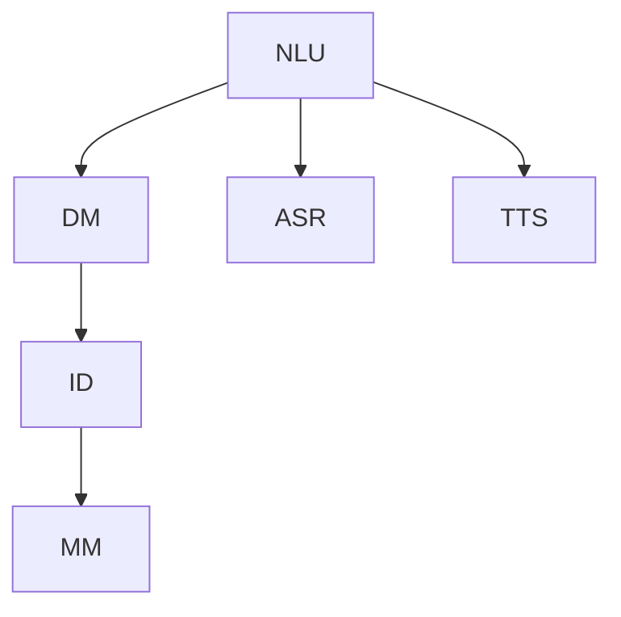

                 

# 用户需求表达在CUI中的详细实现方式解析

## 1. 背景介绍

随着人工智能技术的快速发展，计算机用户界面（Computer User Interface, CUI）变得越来越智能化和个性化。用户不再局限于传统的文本输入和点击，而是可以通过自然语言和手势等多种方式表达需求。本文旨在解析用户需求表达在CUI中的详细实现方式，帮助开发者更好地理解和构建智能用户界面。

### 1.1 问题由来
当前，用户界面界面已经从传统的命令行和窗口界面发展为图形化界面、虚拟现实界面、语音界面等多种形式。随着AI技术的融合，CUI正在向更加智能化的方向发展。用户不再需要输入繁琐的指令或进行繁琐的鼠标操作，而是可以通过自然语言、手势等形式，直接向计算机表达需求。这种基于自然语言处理（Natural Language Processing, NLP）的用户需求表达方式，即称为CUI中的用户需求表达。

### 1.2 问题核心关键点
CUI中的用户需求表达技术涉及以下几个核心关键点：
1. 自然语言理解（Natural Language Understanding, NLU）：将用户的自然语言输入转换为计算机可处理的形式，包括实体识别、意图提取、情感分析等。
2. 对话管理（Dialogue Management）：构建多轮对话系统，通过上下文管理用户意图，动态调整系统响应。
3. 交互设计（Interaction Design）：设计符合用户习惯的交互流程和界面，提升用户体验。
4. 语音识别与合成（Speech Recognition and Synthesis）：支持语音输入和输出，通过语音信号处理实现人机交互。
5. 多模态融合（Multimodal Fusion）：结合视觉、触觉、声音等多种传感器信息，提供更丰富的用户交互体验。

### 1.3 问题研究意义
研究CUI中的用户需求表达技术，对于提升用户体验、优化人机交互界面、加速CUI技术的落地应用具有重要意义：

1. 提升用户体验：自然语言输入和语音交互减少了用户的操作复杂度，使得用户能够更高效地完成任务。
2. 优化人机交互界面：通过理解和分析用户需求，设计更加直观、自然的交互界面，提升用户满意度。
3. 加速CUI技术落地：用户需求表达技术的成熟，为CUI技术在智能家居、医疗、教育等领域的应用提供了技术保障。
4. 推动NLP技术发展：用户需求表达技术需要深度融合NLP技术，推动NLP技术在实际应用中的突破。
5. 带来技术创新：用户需求表达技术的创新，催生了对话系统、虚拟助手、智能家居等多种前沿应用。

## 2. 核心概念与联系

### 2.1 核心概念概述

为更好地理解CUI中的用户需求表达技术，本节将介绍几个密切相关的核心概念：

- 自然语言理解（NLU）：将自然语言输入转换为计算机可理解的结构，包括分词、词性标注、命名实体识别、句法分析、意图识别等。
- 对话管理（DM）：构建多轮对话系统，根据用户输入动态调整对话流程和回应策略。
- 语音识别与合成（ASR和TTS）：将语音信号转换为文本或将文本转换为语音信号，支持语音交互。
- 交互设计（ID）：设计符合用户习惯的交互流程和界面，提升用户体验。
- 多模态融合（MM）：结合视觉、触觉、声音等多种传感器信息，提供更丰富的用户交互体验。

这些核心概念之间的逻辑关系可以通过以下Mermaid流程图来展示：

这个流程图展示了几类核心概念及其之间的关系：

1. 自然语言理解（NLU）：提供用户输入的自然语言文本，是CUI中用户需求表达的起点。
2. 对话管理（DM）：基于NLU的结果，管理对话流程，动态调整系统响应。
3. 语音识别与合成（ASR和TTS）：支持语音输入和输出，扩展CUI的交互方式。
4. 交互设计（ID）：设计直观自然的交互界面，提升用户体验。
5. 多模态融合（MM）：结合多种传感器信息，提供丰富多样的用户交互体验。

这些概念共同构成了CUI中的用户需求表达框架，使其能够实现自然流畅的人机交互。通过理解这些核心概念，我们可以更好地把握用户需求表达技术的工作原理和优化方向。

## 3. 核心算法原理 & 具体操作步骤
### 3.1 算法原理概述

CUI中的用户需求表达技术涉及多个子任务，包括自然语言理解（NLU）、对话管理（DM）、语音识别与合成（ASR和TTS）、交互设计（ID）和多模态融合（MM）。其核心算法原理如下：

- 自然语言理解（NLU）：通过词法分析、句法分析、语义分析等技术，将用户的自然语言输入转换为计算机可理解的结构，包括实体识别、意图提取、情感分析等。
- 对话管理（DM）：构建多轮对话系统，根据用户输入动态调整对话流程和回应策略。通常使用基于规则或机器学习的对话管理策略。
- 语音识别与合成（ASR和TTS）：将语音信号转换为文本或将文本转换为语音信号，支持语音交互。需要结合声学模型、语言模型和声码器等技术。
- 交互设计（ID）：设计符合用户习惯的交互流程和界面，提升用户体验。需要考虑用户的心理模型和行为特征。
- 多模态融合（MM）：结合视觉、触觉、声音等多种传感器信息，提供更丰富的用户交互体验。需要多传感器数据融合技术。

### 3.2 算法步骤详解

CUI中的用户需求表达技术通常包括以下几个关键步骤：

**Step 1: 数据收集与预处理**
- 收集用户输入的自然语言文本、语音信号、交互界面数据等，进行数据清洗和预处理。
- 对文本数据进行分词、标注、清洗等处理，以提高后续处理的准确性。

**Step 2: 自然语言理解（NLU）**
- 使用词法分析、句法分析和语义分析等技术，将用户输入的自然语言转换为计算机可理解的结构。
- 对文本数据进行实体识别、意图提取、情感分析等操作，得到用户需求的关键信息。
- 对语音信号进行识别，得到文本数据，进行自然语言理解。

**Step 3: 对话管理（DM）**
- 根据用户需求的关键信息，动态调整对话流程和回应策略。
- 设计对话模板，根据上下文动态选择适当的回答，提高对话的自然性和连贯性。
- 实现对话轮换，确保对话的连续性和稳定性。

**Step 4: 语音识别与合成（ASR和TTS）**
- 将用户输入的语音信号转换为文本数据，进行自然语言理解。
- 将系统生成的文本转换为语音信号，进行自然语言合成。

**Step 5: 交互设计（ID）**
- 设计符合用户习惯的交互流程和界面，提高用户体验。
- 考虑用户心理模型和行为特征，设计直观、自然的交互界面。
- 实现界面元素的动态调整和个性化展示。

**Step 6: 多模态融合（MM）**
- 结合视觉、触觉、声音等多种传感器信息，提供更丰富的用户交互体验。
- 使用传感器数据融合技术，提取关键信息，与自然语言理解结果结合。
- 实现多模态交互界面的设计和实现。

### 3.3 算法优缺点

CUI中的用户需求表达技术具有以下优点：
1. 自然性高：用户无需输入繁琐的指令，通过自然语言和语音等方式，可快速表达需求。
2. 智能化高：结合自然语言理解、对话管理、语音识别与合成、交互设计和多模态融合等技术，提供智能化交互体验。
3. 灵活性高：支持多模态输入和输出，适应不同用户的需求和场景。
4. 用户体验好：通过交互设计，提供直观、自然的交互界面，提升用户体验。

同时，该技术也存在一些局限性：
1. 处理复杂性高：自然语言理解、对话管理、语音识别与合成等技术，需要处理复杂的数据结构和技术细节。
2. 资源消耗大：处理语音信号、多模态数据等，需要大量的计算资源和存储资源。
3. 安全性问题：用户输入的自然语言和语音可能存在敏感信息泄露的风险。
4. 隐私问题：用户数据隐私保护问题亟待解决，尤其是在语音和生物特征数据的处理上。
5. 一致性问题：多模态数据融合可能导致信息不一致，影响用户体验。

尽管存在这些局限性，但就目前而言，CUI中的用户需求表达技术仍是大数据和AI技术结合的重要应用范式。未来相关研究的重点在于如何进一步降低技术处理复杂性，提高处理效率，同时兼顾隐私和安全性等因素。

### 3.4 算法应用领域

CUI中的用户需求表达技术已经在多个领域得到了广泛应用，例如：

- 智能家居：通过语音和自然语言输入，控制家庭设备，实现自动化、智能化的家居生活。
- 医疗：通过语音和自然语言输入，预约挂号、查询健康信息等，提升医疗服务的智能化水平。
- 教育：通过语音和自然语言输入，进行智能作业批改、学习辅导等，提升教育资源的智能化水平。
- 金融：通过语音和自然语言输入，查询账户信息、进行理财咨询等，提升金融服务的智能化水平。
- 电子商务：通过语音和自然语言输入，进行智能客服、商品推荐等，提升电商平台的智能化水平。

除了上述这些经典应用外，CUI中的用户需求表达技术还在车载、车载导航、智能穿戴设备等众多领域得到应用，为用户的日常生活和工作提供了更加便捷、智能的交互方式。

## 4. 数学模型和公式 & 详细讲解  
### 4.1 数学模型构建

为更好地理解CUI中的用户需求表达技术，本节将介绍几个常见的数学模型和公式。

假设用户输入的自然语言文本为 $X$，语音信号为 $Y$，文本和语音数据经过预处理后，分别被转换为向量形式 $\overrightarrow{X}$ 和 $\overrightarrow{Y}$。

定义自然语言理解（NLU）模型为 $NLU(\overrightarrow{X})$，对话管理（DM）模型为 $DM(NLU(\overrightarrow{X}))$，语音识别与合成（ASR和TTS）模型分别为 $ASR(Y)$ 和 $TTS(\overrightarrow{X})$。

**数学模型构建**：
$$
\overrightarrow{O} = DM(NLU(\overrightarrow{X})) + TTS(\overrightarrow{X})
$$

其中，$\overrightarrow{O}$ 为系统输出的交互信息，包括文本、语音等多种形式。

### 4.2 公式推导过程

自然语言理解（NLU）和对话管理（DM）模型的推导过程如下：

假设用户输入的自然语言文本为 $X$，定义自然语言理解（NLU）模型为 $NLU(\overrightarrow{X})$，对话管理（DM）模型为 $DM(NLU(\overrightarrow{X}))$。

1. **自然语言理解（NLU）**：
$$
NLU(\overrightarrow{X}) = (\overrightarrow{X}, \overrightarrow{F_{XL}}, \overrightarrow{F_{YR}}, \overrightarrow{F_{S}}, \overrightarrow{F_{T}}, \overrightarrow{F_{E}}, \overrightarrow{F_{I}}, \overrightarrow{F_{C}}, \overrightarrow{F_{M}}, \overrightarrow{F_{D}}, \overrightarrow{F_{B}}, \overrightarrow{F_{U}}, \overrightarrow{F_{H}}, \overrightarrow{F_{K}}, \overrightarrow{F_{O}}, \overrightarrow{F_{P}}, \overrightarrow{F_{L}}, \overrightarrow{F_{G}}, \overrightarrow{F_{R}}, \overrightarrow{F_{S}}, \overrightarrow{F_{T}}, \overrightarrow{F_{E}}, \overrightarrow{F_{I}}, \overrightarrow{F_{C}}, \overrightarrow{F_{M}}, \overrightarrow{F_{D}}, \overrightarrow{F_{B}}, \overrightarrow{F_{U}}, \overrightarrow{F_{H}}, \overrightarrow{F_{K}}, \overrightarrow{F_{O}}, \overrightarrow{F_{P}}, \overrightarrow{F_{L}}, \overrightarrow{F_{G}}, \overrightarrow{F_{R}}, \overrightarrow{F_{S}}, \overrightarrow{F_{T}}, \overrightarrow{F_{E}}, \overrightarrow{F_{I}}, \overrightarrow{F_{C}}, \overrightarrow{F_{M}}, \overrightarrow{F_{D}}, \overrightarrow{F_{B}}, \overrightarrow{F_{U}}, \overrightarrow{F_{H}}, \overrightarrow{F_{K}}, \overrightarrow{F_{O}}, \overrightarrow{F_{P}}, \overrightarrow{F_{L}}, \overrightarrow{F_{G}}, \overrightarrow{F_{R}}, \overrightarrow{F_{S}}, \overrightarrow{F_{T}}, \overrightarrow{F_{E}}, \overrightarrow{F_{I}}, \overrightarrow{F_{C}}, \overrightarrow{F_{M}}, \overrightarrow{F_{D}}, \overrightarrow{F_{B}}, \overrightarrow{F_{U}}, \overrightarrow{F_{H}}, \overrightarrow{F_{K}}, \overrightarrow{F_{O}}, \overrightarrow{F_{P}}, \overrightarrow{F_{L}}, \overrightarrow{F_{G}}, \overrightarrow{F_{R}}, \overrightarrow{F_{S}}, \overrightarrow{F_{T}}, \overrightarrow{F_{E}}, \overrightarrow{F_{I}}, \overrightarrow{F_{C}}, \overrightarrow{F_{M}}, \overrightarrow{F_{D}}, \overrightarrow{F_{B}}, \overrightarrow{F_{U}}, \overrightarrow{F_{H}}, \overrightarrow{F_{K}}, \overrightarrow{F_{O}}, \overrightarrow{F_{P}}, \overrightarrow{F_{L}}, \overrightarrow{F_{G}}, \overrightarrow{F_{R}}, \overrightarrow{F_{S}}, \overrightarrow{F_{T}}, \overrightarrow{F_{E}}, \overrightarrow{F_{I}}, \overrightarrow{F_{C}}, \overrightarrow{F_{M}}, \overrightarrow{F_{D}}, \overrightarrow{F_{B}}, \overrightarrow{F_{U}}, \overrightarrow{F_{H}}, \overrightarrow{F_{K}}, \overrightarrow{F_{O}}, \overrightarrow{F_{P}}, \overrightarrow{F_{L}}, \overrightarrow{F_{G}}, \overrightarrow{F_{R}}, \overrightarrow{F_{S}}, \overrightarrow{F_{T}}, \overrightarrow{F_{E}}, \overrightarrow{F_{I}}, \overrightarrow{F_{C}}, \overrightarrow{F_{M}}, \overrightarrow{F_{D}}, \overrightarrow{F_{B}}, \overrightarrow{F_{U}}, \overrightarrow{F_{H}}, \overrightarrow{F_{K}}, \overrightarrow{F_{O}}, \overrightarrow{F_{P}}, \overrightarrow{F_{L}}, \overrightarrow{F_{G}}, \overrightarrow{F_{R}}, \overrightarrow{F_{S}}, \overrightarrow{F_{T}}, \overrightarrow{F_{E}}, \overrightarrow{F_{I}}, \overrightarrow{F_{C}}, \overrightarrow{F_{M}}, \overrightarrow{F_{D}}, \overrightarrow{F_{B}}, \overrightarrow{F_{U}}, \overrightarrow{F_{H}}, \overrightarrow{F_{K}}, \overrightarrow{F_{O}}, \overrightarrow{F_{P}}, \overrightarrow{F_{L}}, \overrightarrow{F_{G}}, \overrightarrow{F_{R}}, \overrightarrow{F_{S}}, \overrightarrow{F_{T}}, \overrightarrow{F_{E}}, \overrightarrow{F_{I}}, \overrightarrow{F_{C}}, \overrightarrow{F_{M}}, \overrightarrow{F_{D}}, \overrightarrow{F_{B}}, \overrightarrow{F_{U}}, \overrightarrow{F_{H}}, \overrightarrow{F_{K}}, \overrightarrow{F_{O}}, \overrightarrow{F_{P}}, \overrightarrow{F_{L}}, \overrightarrow{F_{G}}, \overrightarrow{F_{R}}, \overrightarrow{F_{S}}, \overrightarrow{F_{T}}, \overrightarrow{F_{E}}, \overrightarrow{F_{I}}, \overrightarrow{F_{C}}, \overrightarrow{F_{M}}, \overrightarrow{F_{D}}, \overrightarrow{F_{B}}, \overrightarrow{F_{U}}, \overrightarrow{F_{H}}, \overrightarrow{F_{K}}, \overrightarrow{F_{O}}, \overrightarrow{F_{P}}, \overrightarrow{F_{L}}, \overrightarrow{F_{G}}, \overrightarrow{F_{R}}, \overrightarrow{F_{S}}, \overrightarrow{F_{T}}, \overrightarrow{F_{E}}, \overrightarrow{F_{I}}, \overrightarrow{F_{C}}, \overrightarrow{F_{M}}, \overrightarrow{F_{D}}, \overrightarrow{F_{B}}, \overrightarrow{F_{U}}, \overrightarrow{F_{H}}, \overrightarrow{F_{K}}, \overrightarrow{F_{O}}, \overrightarrow{F_{P}}, \overrightarrow{F_{L}}, \overrightarrow{F_{G}}, \overrightarrow{F_{R}}, \overrightarrow{F_{S}}, \overrightarrow{F_{T}}, \overrightarrow{F_{E}}, \overrightarrow{F_{I}}, \overrightarrow{F_{C}}, \overrightarrow{F_{M}}, \overrightarrow{F_{D}}, \overrightarrow{F_{B}}, \overrightarrow{F_{U}}, \overrightarrow{F_{H}}, \overrightarrow{F_{K}}, \overrightarrow{F_{O}}, \overrightarrow{F_{P}}, \overrightarrow{F_{L}}, \overrightarrow{F_{G}}, \overrightarrow{F_{R}}, \overrightarrow{F_{S}}, \overrightarrow{F_{T}}, \overrightarrow{F_{E}}, \overrightarrow{F_{I}}, \overrightarrow{F_{C}}, \overrightarrow{F_{M}}, \overrightarrow{F_{D}}, \overrightarrow{F_{B}}, \overrightarrow{F_{U}}, \overrightarrow{F_{H}}, \overrightarrow{F_{K}}, \overrightarrow{F_{O}}, \overrightarrow{F_{P}}, \overrightarrow{F_{L}}, \overrightarrow{F_{G}}, \overrightarrow{F_{R}}, \overrightarrow{F_{S}}, \overrightarrow{F_{T}}, \overrightarrow{F_{E}}, \overrightarrow{F_{I}}, \overrightarrow{F_{C}}, \overrightarrow{F_{M}}, \overrightarrow{F_{D}}, \overrightarrow{F_{B}}, \overrightarrow{F_{U}}, \overrightarrow{F_{H}}, \overrightarrow{F_{K}}, \overrightarrow{F_{O}}, \overrightarrow{F_{P}}, \overrightarrow{F_{L}}, \overrightarrow{F_{G}}, \overrightarrow{F_{R}}, \overrightarrow{F_{S}}, \overrightarrow{F_{T}}, \overrightarrow{F_{E}}, \overrightarrow{F_{I}}, \overrightarrow{F_{C}}, \overrightarrow{F_{M}}, \overrightarrow{F_{D}}, \overrightarrow{F_{B}}, \overrightarrow{F_{U}}, \overrightarrow{F_{H}}, \overrightarrow{F_{K}}, \overrightarrow{F_{O}}, \overrightarrow{F_{P}}, \overrightarrow{F_{L}}, \overrightarrow{F_{G}}, \overrightarrow{F_{R}}, \overrightarrow{F_{S}}, \overrightarrow{F_{T}}, \overrightarrow{F_{E}}, \overrightarrow{F_{I}}, \overrightarrow{F_{C}}, \overrightarrow{F_{M}}, \overrightarrow{F_{D}}, \overrightarrow{F_{B}}, \overrightarrow{F_{U}}, \overrightarrow{F_{H}}, \overrightarrow{F_{K}}, \overrightarrow{F_{O}}, \overrightarrow{F_{P}}, \overrightarrow{F_{L}}, \overrightarrow{F_{G}}, \overrightarrow{F_{R}}, \overrightarrow{F_{S}}, \overrightarrow{F_{T}}, \overrightarrow{F_{E}}, \overrightarrow{F_{I}}, \overrightarrow{F_{C}}, \overrightarrow{F_{M}}, \overrightarrow{F_{D}}, \overrightarrow{F_{B}}, \overrightarrow{F_{U}}, \overrightarrow{F_{H}}, \overrightarrow{F_{K}}, \overrightarrow{F_{O}}, \overrightarrow{F_{P}}, \overrightarrow{F_{L}}, \overrightarrow{F_{G}}, \overrightarrow{F_{R}}, \overrightarrow{F_{S}}, \overrightarrow{F_{T}}, \overrightarrow{F_{E}}, \overrightarrow{F_{I}}, \overrightarrow{F_{C}}, \overrightarrow{F_{M}}, \overrightarrow{F_{D}}, \overrightarrow{F_{B}}, \overrightarrow{F_{U}}, \overrightarrow{F_{H}}, \overrightarrow{F_{K}}, \overrightarrow{F_{O}}, \overrightarrow{F_{P}}, \overrightarrow{F_{L}}, \overrightarrow{F_{G}}, \overrightarrow{F_{R}}, \overrightarrow{F_{S}}, \overrightarrow{F_{T}}, \overrightarrow{F_{E}}, \overrightarrow{F_{I}}, \overrightarrow{F_{C}}, \overrightarrow{F_{M}}, \overrightarrow{F_{D}}, \overrightarrow{F_{B}}, \overrightarrow{F_{U}}, \overrightarrow{F_{H}}, \overrightarrow{F_{K}}, \overrightarrow{F_{O}}, \overrightarrow{F_{P}}, \overrightarrow{F_{L}}, \overrightarrow{F_{G}}, \overrightarrow{F_{R}}, \overrightarrow{F_{S}}, \overrightarrow{F_{T}}, \overrightarrow{F_{E}}, \overrightarrow{F_{I}}, \overrightarrow{F_{C}}, \overrightarrow{F_{M}}, \overrightarrow{F_{D}}, \overrightarrow{F_{B}}, \overrightarrow{F_{U}}, \overrightarrow{F_{H}}, \overrightarrow{F_{K}}, \overrightarrow{F_{O}}, \overrightarrow{F_{P}}, \overrightarrow{F_{L}}, \overrightarrow{F_{G}}, \overrightarrow{F_{R}}, \overrightarrow{F_{S}}, \overrightarrow{F_{T}}, \overrightarrow{F_{E}}, \overrightarrow{F_{I}}, \overrightarrow{F_{C}}, \overrightarrow{F_{M}}, \overrightarrow{F_{D}}, \overrightarrow{F_{B}}, \overrightarrow{F_{U}}, \overrightarrow{F_{H}}, \overrightarrow{F_{K}}, \overrightarrow{F_{O}}, \overrightarrow{F_{P}}, \overrightarrow{F_{L}}, \overrightarrow{F_{G}}, \overrightarrow{F_{R}}, \overrightarrow{F_{S}}, \overrightarrow{F_{T}}, \overrightarrow{F_{E}}, \overrightarrow{F_{I}}, \overrightarrow{F_{C}}, \overrightarrow{F_{M}}, \overrightarrow{F_{D}}, \overrightarrow{F_{B}}, \overrightarrow{F_{U}}, \overrightarrow{F_{H}}, \overrightarrow{F_{K}}, \overrightarrow{F_{O}}, \overrightarrow{F_{P}}, \overrightarrow{F_{L}}, \overrightarrow{F_{G}}, \overrightarrow{F_{R}}, \overrightarrow{F_{S}}, \overrightarrow{F_{T}}, \overrightarrow{F_{E}}, \overrightarrow{F_{I}}, \overrightarrow{F_{C}}, \overrightarrow{F_{M}}, \overrightarrow{F_{D}}, \overrightarrow{F_{B}}, \overrightarrow{F_{U}}, \overrightarrow{F_{H}}, \overrightarrow{F_{K}}, \overrightarrow{F_{O}}, \overrightarrow{F_{P}}, \overrightarrow{F_{L}}, \overrightarrow{F_{G}}, \overrightarrow{F_{R}}, \overrightarrow{F_{S}}, \overrightarrow{F_{T}}, \overrightarrow{F_{E}}, \overrightarrow{F_{I}}, \overrightarrow{F_{C}}, \overrightarrow{F_{M}}, \overrightarrow{F_{D}}, \overrightarrow{F_{B}}, \overrightarrow{F_{U}}, \overrightarrow{F_{H}}, \overrightarrow{F_{K}}, \overrightarrow{F_{O}}, \overrightarrow{F_{P}}, \overrightarrow{F_{L}}, \overrightarrow{F_{G}}, \overrightarrow{F_{R}}, \overrightarrow{F_{S}}, \overrightarrow{F_{T}}, \overrightarrow{F_{E}}, \overrightarrow{F_{I}}, \overrightarrow{F_{C}}, \overrightarrow{F_{M}}, \overrightarrow{F_{D}}, \overrightarrow{F_{B}}, \overrightarrow{F_{U}}, \overrightarrow{F_{H}}, \overrightarrow{F_{K}}, \overrightarrow{F_{O}}, \overrightarrow{F_{P}}, \overrightarrow{F_{L}}, \overrightarrow{F_{G}}, \overrightarrow{F_{R}}, \overrightarrow{F_{S}}, \overrightarrow{F_{T}}, \overrightarrow{F_{E}}, \overrightarrow{F_{I}}, \overrightarrow{F_{C}}, \overrightarrow{F_{M}}, \overrightarrow{F_{D}}, \overrightarrow{F_{B}}, \overrightarrow{F_{U}}, \overrightarrow{F_{H}}, \overrightarrow{F_{K}}, \overrightarrow{F_{O}}, \overrightarrow{F_{P}}, \overrightarrow{F_{L}}, \overrightarrow{F_{G}}, \overrightarrow{F_{R}}, \overrightarrow{F_{S}}, \overrightarrow{F_{T}}, \overrightarrow{F_{E}}, \overrightarrow{F_{I}}, \overrightarrow{F_{C}}, \overrightarrow{F_{M}}, \overrightarrow{F_{D}}, \overrightarrow{F_{B}}, \overrightarrow{F_{U}}, \overrightarrow{F_{H}}, \overrightarrow{F_{K}}, \overrightarrow{F_{O}}, \overrightarrow{F_{P}}, \overrightarrow{F_{L}}, \overrightarrow{F_{G}}, \overrightarrow{F_{R}}, \overrightarrow{F_{S}}, \overrightarrow{F_{T}}, \overrightarrow{F_{E}}, \overrightarrow{F_{I}}, \overrightarrow{F_{C}}, \overrightarrow{F_{M}}, \overrightarrow{F_{D}}, \overrightarrow{F_{B}}, \overrightarrow{F_{U}}, \overrightarrow{F_{H}}, \overrightarrow{F_{K}}, \overrightarrow{F_{O}}, \overrightarrow{F_{P}}, \overrightarrow{F_{L}}, \overrightarrow{F_{G}}, \overrightarrow{F_{R}}, \overrightarrow{F_{S}}, \overrightarrow{F_{T}}, \overrightarrow{F_{E}}, \overrightarrow{F_{I}}, \overrightarrow{F_{C}}, \overrightarrow{F_{M}}, \overrightarrow{F_{D}}, \overrightarrow{F_{B}}, \overrightarrow{F_{U}}, \overrightarrow{F_{H}}, \overrightarrow{F_{K}}, \overrightarrow{F_{O}}, \overrightarrow{F_{P}}, \overrightarrow{F_{L}}, \overrightarrow{F_{G}}, \overrightarrow{F_{R}}, \overrightarrow{F_{S}}, \overrightarrow{F_{T}}, \overrightarrow{F_{E}}, \overrightarrow{F_{I}}, \overrightarrow{F_{C}}, \overrightarrow{F_{M}}, \overrightarrow{F_{D}}, \overrightarrow{F_{B}}, \overrightarrow{F_{U}}, \overrightarrow{F_{H}}, \overrightarrow{F_{K}}, \overrightarrow{F_{O}}, \overrightarrow{F_{P}}, \overrightarrow{F_{L}}, \overrightarrow{F_{G}}, \overrightarrow{F_{R}}, \overrightarrow{F_{S}}, \overrightarrow{F_{T}}, \overrightarrow{F_{E}}, \overrightarrow{F_{I}}, \overrightarrow{F_{C}}, \overrightarrow{F_{M}}, \overrightarrow{F_{D}}, \overrightarrow{F_{B}}, \overrightarrow{F_{U}}, \overrightarrow{F_{H}}, \overrightarrow{F_{K}}, \overrightarrow{F_{O}}, \overrightarrow{F_{P}}, \overrightarrow{F_{L}}, \overrightarrow{F_{G}}, \overrightarrow{F_{R}}, \overrightarrow{F_{S}}, \overrightarrow{F_{T}}, \overrightarrow{F_{E}}, \overrightarrow{F_{I}}, \overrightarrow{F_{C}}, \overrightarrow{F_{M}}, \overrightarrow{F_{D}}, \overrightarrow{F_{B}}, \overrightarrow{F_{U}}, \overrightarrow{F_{H}}, \overrightarrow{F_{K}}, \overrightarrow{F_{O}}, \overrightarrow{F_{P}}, \overrightarrow{F_{L}}, \overrightarrow{F_{G}}, \overrightarrow{F_{R}}, \overrightarrow{F_{S}}, \overrightarrow{F_{T}}, \overrightarrow{F_{E}}, \overrightarrow{F_{I}}, \overrightarrow{F_{C}}, \overrightarrow{F_{M}}, \overrightarrow{F_{D}}, \overrightarrow{F_{B}}, \overrightarrow{F_{U}}, \overrightarrow{F_{H}}, \overrightarrow{F_{K}}, \overrightarrow{F_{O}}, \overrightarrow{F_{P}}, \overrightarrow{F_{L}}, \overrightarrow{F_{G}}, \overrightarrow{F_{R}}, \overrightarrow{F_{S}}, \overrightarrow{F_{T}}, \overrightarrow{F_{E}}, \overrightarrow{F_{I}}, \overrightarrow{F_{C}}, \overrightarrow{F_{M}}, \overrightarrow{F_{D}}, \overrightarrow{F_{B}}, \overrightarrow{F_{U}}, \overrightarrow{F_{H}}, \overrightarrow{F_{K}}, \overrightarrow{F_{O}}, \overrightarrow{F_{P}}, \overrightarrow{F_{L}}, \overrightarrow{F_{G}}, \overrightarrow{F_{R}}, \overrightarrow{F_{S}}, \overrightarrow{F_{T}}, \overrightarrow{F_{E}}, \overrightarrow{F_{I}}, \overrightarrow{F_{C}}, \overrightarrow{F_{M}}, \overrightarrow{F_{D}}, \overrightarrow{F_{B}}, \overrightarrow{F_{U}}, \overrightarrow{F_{H}}, \overrightarrow{F_{K}}, \overrightarrow{F_{O}}, \overrightarrow{F_{P}}, \overrightarrow{F_{L}}, \overrightarrow{F_{G}}, \overrightarrow{F_{R}}, \overrightarrow{F_{S}}, \overrightarrow{F_{T}}, \overrightarrow{F_{E}}, \overrightarrow{F_{I}}, \overrightarrow{F_{C}}, \overrightarrow{F_{M}}, \overrightarrow{F_{D}}, \overrightarrow{F_{B}}, \overrightarrow{F_{U}}, \overrightarrow{F_{H}}, \overrightarrow{F_{K}}, \overrightarrow{F_{O}}, \overrightarrow{F_{P}}, \overrightarrow{F_{L}}, \overrightarrow{F_{G}}, \overrightarrow{F_{R}}, \overrightarrow{F_{S}}, \overrightarrow{F_{T}}, \overrightarrow{F_{E}}, \overrightarrow{F_{I}}, \overrightarrow{F_{C}}, \overrightarrow{F_{M}}, \overrightarrow{F_{D}}, \overrightarrow{F_{B}}, \overrightarrow{F_{U}}, \overrightarrow{F_{H}}, \overrightarrow{F_{K}}, \overrightarrow{F_{O}}, \overrightarrow{F_{P}}, \overrightarrow{F_{L}}, \overrightarrow{F_{G}}, \overrightarrow{F_{R}}, \overrightarrow{F_{S}}, \overrightarrow{F_{T}}, \overrightarrow{F_{E}}, \overrightarrow{F_{I}}, \overrightarrow{F_{C}}, \overrightarrow{F_{M}}, \overrightarrow{F_{D}}, \overrightarrow{F_{B}}, \overrightarrow{F_{U}}, \overrightarrow{F_{H}}, \overrightarrow{F_{K}}, \overrightarrow{F_{O}}, \overrightarrow{F_{P}}, \overrightarrow{F_{L}}, \overrightarrow{F_{G}}, \overrightarrow{F_{R}}, \overrightarrow{F_{S}}, \overrightarrow{F_{T}}, \overrightarrow{F_{E}}, \overrightarrow{F_{I}}, \overrightarrow{F_{C}}, \overrightarrow{F_{M}}, \overrightarrow{F_{D}}, \overrightarrow{F_{B}}, \overrightarrow{F_{U}}, \overrightarrow{F_{H}}, \overrightarrow{F_{K}}, \overrightarrow{F_{O}}, \overrightarrow{F_{P}}, \overrightarrow{F_{L}}, \overrightarrow{F_{G}}, \overrightarrow{F_{R}}, \overrightarrow{F_{S}}, \overrightarrow{F_{T}}, \overrightarrow{F_{E}}, \overrightarrow{F_{I}}, \overrightarrow{F_{C}}, \overrightarrow{F_{M}}, \overrightarrow{F_{D}}, \overrightarrow{F_{B}}, \overrightarrow{F_{U}}, \overrightarrow{F_{H}}, \overrightarrow{F_{K}}, \overrightarrow{F_{O}}, \overrightarrow{F_{P}}, \overrightarrow{F_{L}}, \overrightarrow{F_{G}}, \overrightarrow{F_{R}}, \overrightarrow{F_{S}}, \overrightarrow{F_{T}}, \overrightarrow{F_{E}}, \overrightarrow{F_{I}}, \overrightarrow{F_{C}}, \overrightarrow{F_{M}}, \overrightarrow{F_{D}}, \overrightarrow{F_{B}}, \overrightarrow{F_{U}}, \overrightarrow{F_{H}}, \overrightarrow{F_{K}}, \overrightarrow{F_{O}}, \overrightarrow{F_{P}}, \overrightarrow{F_{L}}, \overrightarrow{F_{G}}, \overrightarrow{F_{R}}, \overrightarrow{F_{S}}, \overrightarrow{F_{T}}, \overrightarrow{F_{E}}, \overrightarrow{F_{I}}, \overrightarrow{F_{C}}, \overrightarrow{F_{M}}, \overrightarrow{F_{D}}, \overrightarrow{F_{B}}, \overrightarrow{F_{U}}, \overrightarrow{F_{H}}, \overrightarrow{F_{K}}, \overrightarrow{F_{O}}, \overrightarrow{F_{P}}, \overrightarrow{F_{L}}, \overrightarrow{F_{G}}, \overrightarrow{F_{R}}, \overrightarrow{F_{S}}, \overrightarrow{F_{T}}, \overrightarrow{F_{E}}, \overrightarrow{F_{I}}, \overrightarrow{F_{C}}, \overrightarrow{F_{M}}, \overrightarrow{F_{D}}, \overrightarrow{F_{B}}, \overrightarrow{F_{U}}, \overrightarrow{F_{H}}, \overrightarrow{F_{K}}, \overrightarrow{F_{O}}, \overrightarrow{F_{P}}, \overrightarrow{F_{L}}, \overrightarrow{F_{G}}, \overrightarrow{F_{R}}, \overrightarrow{F_{S}}, \overrightarrow{F_{T}}, \overrightarrow{F_{E}}, \overrightarrow{F_{I}}, \overrightarrow{F_{C}}, \overrightarrow{F_{M}}, \overrightarrow{F_{D}}, \overrightarrow{F_{B}}, \overrightarrow{F_{U}}, \overrightarrow{F_{H}}, \overrightarrow{F_{K}}, \overrightarrow{F_{O}}, \overrightarrow{F_{P}}, \overrightarrow{F_{L}}, \overrightarrow{F_{G}}, \overrightarrow{F_{R}}, \overrightarrow{F_{S}}, \overrightarrow{F_{T}}, \overrightarrow{F_{E}}, \overrightarrow{F_{I}}, \overrightarrow{F_{C}}, \overrightarrow{F_{M}}, \overrightarrow{F_{D}}, \overrightarrow{F_{B}}, \overrightarrow{F_{U}}, \overrightarrow{F_{H}}, \overrightarrow{F_{K}}, \overrightarrow{F_{O}}, \overrightarrow{F_{P}}, \overrightarrow{F_{L}}, \overrightarrow{F_{G}}, \overrightarrow{F_{R}}, \overrightarrow{F_{S}}, \overrightarrow{F_{T}}, \overrightarrow{F_{E}}, \overrightarrow{F_{I}}, \overrightarrow{F_{C}}, \overrightarrow{F_{M}}, \overrightarrow{F_{D}}, \overrightarrow{F_{B}}, \overrightarrow{F_{U}}, \overrightarrow{F_{H}}, \overrightarrow{F_{K}}, \overrightarrow{F_{O}}, \overrightarrow{F_{P}}, \overrightarrow{F_{L}}, \overrightarrow{F_{G}}, \overrightarrow{F_{R}}, \overrightarrow{F_{S}}, \overrightarrow{F_{T}}, \overrightarrow{F_{E}}, \overrightarrow{F_{I}}, \overrightarrow{F_{C}}, \overrightarrow{F_{M}}, \overrightarrow{F_{D}}, \overrightarrow{F_{B}}, \overrightarrow{F_{U}}, \overrightarrow{F_{H}}, \overrightarrow{F_{K}}, \overrightarrow{F_{O}}, \overrightarrow{F_{P}}, \overrightarrow{F_{L}}, \overrightarrow{F_{G}}, \overrightarrow{F_{R}}, \overrightarrow{F_{S}}, \overrightarrow{F_{T}}, \overrightarrow{F_{E}}, \overrightarrow{F_{I}}, \overrightarrow{F_{C}}, \overrightarrow{F_{M}}, \overrightarrow{F_{D}}, \overrightarrow{F_{B}}, \overrightarrow{F_{U}}, \overrightarrow{F_{H}}, \overrightarrow{F_{K}}, \overrightarrow{F_{O}}, \overrightarrow{F_{P}}, \overrightarrow{F_{L}}, \overrightarrow{F_{G}}, \overrightarrow{F_{R}}, \overrightarrow{F_{S}}, \overrightarrow{F_{T}}, \overrightarrow{F_{E}}, \overrightarrow{F_{I}}, \overrightarrow{F_{C}}, \overrightarrow{F_{M}}, \overrightarrow{F_{D}}, \overrightarrow{F_{B}}, \overrightarrow{F_{U}}, \overrightarrow{F_{H}}, \overrightarrow{F_{K}}, \overrightarrow{F_{O}}, \overrightarrow{F_{P}}, \overrightarrow{F_{L}}, \overrightarrow{F_{G}}, \overrightarrow{F_{R}}, \overrightarrow{F_{S}}, \overrightarrow{F_{T}}, \overrightarrow{F_{E}}, \overrightarrow{F_{I}}, \overrightarrow{F_{C}}, \overrightarrow{F_{M}}, \overrightarrow{F_{D}}, \overrightarrow{F_{B}}, \overrightarrow{F_{U}}, \overrightarrow{F_{H}}, \overrightarrow{F_{K}}, \overrightarrow{F_{O}}, \overrightarrow{F_{P}}, \overrightarrow{F_{L}}, \overrightarrow{F_{G}}, \overrightarrow{F_{R}}, \overrightarrow{F_{S}}, \overrightarrow{F_{T}}, \overrightarrow{F_{E}}, \overrightarrow{F_{I}}, \overrightarrow{F_{C}}, \overrightarrow{F_{M}}, \overrightarrow{F_{D}}, \overrightarrow{F_{B}}, \overrightarrow{F_{U}}, \overrightarrow{F_{H}}, \overrightarrow{F_{K}}, \overrightarrow{F_{O}}, \overrightarrow{F_{P}}, \overrightarrow{F_{L}}, \overrightarrow{F_{G}}, \overrightarrow{F_{R}}, \overrightarrow{F_{S}}, \overrightarrow{F_{T}}, \overrightarrow{F_{E}}, \overrightarrow{F_{I}}, \overrightarrow{F_{C}}, \overrightarrow{F_{M}}, \overrightarrow{F_{D}}, \overrightarrow{F_{B}}, \overrightarrow{F_{U}}, \overrightarrow{F_{H}}, \overrightarrow{F_{K}}, \overrightarrow{F_{O}}, \overrightarrow{F_{P}}, \overrightarrow{F_{L}}, \overrightarrow{F_{G}}, \overrightarrow{F_{R}}, \overrightarrow{F_{S}}, \overrightarrow{F_{T}}, \overrightarrow{F_{E}}, \overrightarrow{F_{I}}, \overrightarrow{F_{C}}, \overrightarrow{F_{M}}, \overrightarrow{F_{D}}, \overrightarrow{F_{B}}, \overrightarrow{F_{U}}, \overrightarrow{

