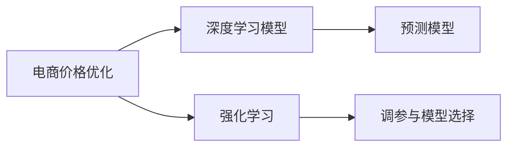

                 

# 电商价格优化的技术实现

## 1. 背景介绍

在电商领域，价格优化是一个关键的商业决策，直接影响到销售量、市场份额和公司利润。随着消费者行为、市场竞争和电子商务平台的不断变化，价格优化成为了一个动态、复杂的挑战。传统的价格优化方法基于统计模型和规则系统，但在海量数据和快速变化的电商环境中，这些方法的局限性逐渐显现。

基于机器学习的价格优化方法正在逐渐成为主流，特别是深度学习和强化学习的应用，提供了更为准确和灵活的价格决策支持。本文将系统介绍基于深度学习的价格优化技术实现，涵盖模型选择、训练、部署和优化等关键环节。通过详细的算法原理和案例分析，帮助读者深入理解电商价格优化的技术基础和实现细节。

## 2. 核心概念与联系

### 2.1 核心概念概述

在进行电商价格优化时，我们需要重点关注以下核心概念：

- **电商价格优化**：通过分析历史数据和市场动态，采用机器学习模型预测最优价格，以最大化销售量和利润。
- **深度学习模型**：以多层神经网络为基础，利用大量数据进行模型训练，以复杂模式捕捉数据中的关系。
- **强化学习**：通过奖励机制训练智能体，使其在特定环境中做出最佳决策，适用于动态和复杂环境下的决策优化。
- **预测模型**：利用历史数据和市场特征，预测未来价格表现，为价格优化提供数据支持。
- **调参与模型选择**：选择合适的模型和超参数，通过交叉验证等技术优化模型性能。

这些核心概念之间的联系如图2-1所示：



## 3. 核心算法原理 & 具体操作步骤

### 3.1 算法原理概述

电商价格优化主要基于深度学习和强化学习，通过训练预测模型来预测最优价格，并通过奖励机制优化价格决策。

**3.1.1 深度学习模型**
深度学习模型通常使用多层神经网络进行建模，通过对大量历史交易数据进行训练，学习价格与销售量、促销、季节性因素等变量之间的关系。常见的深度学习模型包括多层感知机(Multilayer Perceptron, MLP)、卷积神经网络(Convolutional Neural Network, CNN)、循环神经网络(Recurrent Neural Network, RNN)和长短期记忆网络(Long Short-Term Memory, LSTM)。

**3.1.2 强化学习**
强化学习通过奖励机制训练智能体，使其在特定环境中（如电商平台的动态价格决策环境）做出最优决策。在电商价格优化中，强化学习模型通过模拟不同的价格策略，评估每个策略的回报，选择最优的定价策略。

### 3.2 算法步骤详解

#### 3.2.1 数据预处理

电商数据通常包含多维度特征，如价格、促销、销售量、时间、用户行为等。数据预处理包括数据清洗、归一化、特征工程和数据划分等步骤。

1. **数据清洗**：处理缺失值、异常值和重复数据，保证数据质量和完整性。
2. **归一化**：对不同尺度的特征进行归一化处理，如标准化、最小-最大归一化等。
3. **特征工程**：选择、构造和组合特征，包括提取统计特征、构建时间特征、嵌入用户行为特征等。
4. **数据划分**：将数据划分为训练集、验证集和测试集，以评估模型性能。

#### 3.2.2 模型训练与调参

模型训练包括选择模型、设定超参数和训练模型等步骤。

1. **模型选择**：根据任务特点和数据类型选择合适的深度学习模型。
2. **设定超参数**：确定学习率、批大小、迭代次数等超参数。
3. **训练模型**：使用训练集数据训练模型，并在验证集上评估性能，进行超参数调优。

#### 3.2.3 强化学习优化

强化学习优化包括定义奖励机制、训练智能体和选择最优策略等步骤。

1. **定义奖励机制**：根据电商业务目标（如利润最大化、销售量增加等）设计奖励函数。
2. **训练智能体**：在电商环境中模拟不同价格策略，通过奖励机制优化价格决策。
3. **选择最优策略**：根据智能体的表现，选择最优的价格策略。

### 3.3 算法优缺点

#### 3.3.1 优点

- **准确性高**：深度学习和强化学习模型可以利用大量历史数据，学习复杂的价格与销售量之间的关系，提高价格优化的准确性。
- **灵活性高**：模型可以处理多维度特征，适应电商环境的动态变化。
- **自动化**：自动进行模型训练和策略优化，减轻人工干预的工作量。

#### 3.3.2 缺点

- **计算资源需求高**：深度学习模型通常需要大量计算资源进行训练和推理。
- **模型复杂度高**：复杂的模型结构可能难以解释，不利于业务理解。
- **需要大量数据**：模型训练需要大量的历史数据，数据获取和处理成本较高。

### 3.4 算法应用领域

电商价格优化技术可以应用于多种电商场景，如B2B、B2C、C2C平台，具体应用领域包括：

- **商品定价**：动态调整商品价格，最大化销售量和利润。
- **促销活动**：优化促销策略，如折扣、赠品、满减等，提高用户购买意愿。
- **库存管理**：根据价格优化模型预测销售量，优化库存管理。
- **市场竞争**：分析竞争对手价格策略，调整自身定价，保持市场竞争力。

## 4. 数学模型和公式 & 详细讲解 & 举例说明

### 4.1 数学模型构建

电商价格优化模型通常基于深度学习框架进行建模，以下以线性回归模型为例，介绍价格优化模型的构建。

假设电商平台上某商品的历史价格为 $x_i$，对应的销售量为 $y_i$，其中 $i=1,...,N$。目标是通过线性回归模型预测最优价格 $x^*$，以最大化销售量 $y^*$。线性回归模型的形式为：

$$
y = \theta_0 + \theta_1 x + \epsilon
$$

其中 $\theta_0$ 和 $\theta_1$ 为模型参数，$\epsilon$ 为误差项。

### 4.2 公式推导过程

**4.2.1 最小二乘估计**
最小二乘估计用于求解线性回归模型的参数，目标是最小化预测误差。假设已知 $x_i$ 和 $y_i$，则模型参数的求解公式为：

$$
\hat{\theta} = (X^T X)^{-1} X^T Y
$$

其中 $X = \begin{bmatrix} 1 & x_1 \\ 1 & x_2 \\ ... \\ 1 & x_N \end{bmatrix}$，$Y = \begin{bmatrix} y_1 \\ y_2 \\ ... \\ y_N \end{bmatrix}$。

**4.2.2 预测和评估**
模型训练完成后，可以通过以下公式对新价格进行预测：

$$
\hat{y} = \hat{\theta}_0 + \hat{\theta}_1 x
$$

预测误差可以通过均方误差(MSE)进行评估，公式为：

$$
MSE = \frac{1}{N} \sum_{i=1}^N (y_i - \hat{y}_i)^2
$$

### 4.3 案例分析与讲解

**案例1：促销活动优化**

假设某电商平台上某商品的历史数据如表4-1所示，其中 $x$ 为价格，$y$ 为销售量。

| $x$ | $y$ | ... | $x$ | $y$ | ... |
| --- | --- | --- | --- | --- | --- |

假设使用线性回归模型进行价格优化，使用前100个数据点进行训练，后50个数据点进行测试。

1. **数据预处理**：对数据进行标准化处理，去除异常值和重复数据。
2. **模型训练**：使用前100个数据点进行训练，求解线性回归模型参数 $\hat{\theta}$。
3. **模型评估**：使用后50个数据点进行测试，评估模型预测的MSE。
4. **价格优化**：根据模型预测结果，调整价格策略，选择最优价格。

通过以上步骤，可以动态调整促销活动的价格，最大化销售量和利润。

## 5. 项目实践：代码实例和详细解释说明

### 5.1 开发环境搭建

电商价格优化项目开发需要Python环境，以下是在Anaconda环境下搭建Python开发环境的步骤：

1. **安装Anaconda**：从官网下载并安装Anaconda，创建Python 3.7环境。
2. **激活环境**：使用以下命令激活环境：

   ```
   conda activate py37
   ```

3. **安装依赖**：安装TensorFlow、Keras等深度学习框架，以及numpy、pandas等数据处理库。

   ```
   pip install tensorflow keras numpy pandas
   ```

4. **设置环境变量**：设置PYTHONPATH和Jupyter Notebook环境变量，确保所有依赖库都在搜索路径中。

### 5.2 源代码详细实现

以下是一个基于TensorFlow和Keras的电商价格优化项目的代码实现。

**5.2.1 数据预处理**

```python
import pandas as pd
from sklearn.preprocessing import StandardScaler

# 读取数据
data = pd.read_csv('sales_data.csv')

# 数据清洗
data = data.dropna()

# 数据标准化
scaler = StandardScaler()
data['price'] = scaler.fit_transform(data[['price']])

# 划分数据集
train_data = data.iloc[:100]
test_data = data.iloc[100:]
```

**5.2.2 模型训练**

```python
from tensorflow.keras.models import Sequential
from tensorflow.keras.layers import Dense
from tensorflow.keras.optimizers import Adam

# 定义模型
model = Sequential()
model.add(Dense(1, input_dim=1, activation='linear'))

# 编译模型
model.compile(optimizer=Adam(lr=0.01), loss='mse')

# 训练模型
model.fit(train_data[['price']], train_data['quantity'], epochs=50, batch_size=32, verbose=0)
```

**5.2.3 模型评估**

```python
# 模型评估
mse = model.evaluate(test_data[['price']], test_data['quantity'], verbose=0)
print(f'MSE: {mse}')
```

**5.2.4 价格优化**

```python
# 预测新价格
new_price = model.predict([[10.0]])
print(f'预测销售量：{new_price[0][0] * 100}')
```

### 5.3 代码解读与分析

**5.3.1 数据预处理**

- **数据清洗**：使用Pandas库进行数据清洗，去除缺失值和重复数据。
- **数据标准化**：使用sklearn库进行数据标准化，使数据分布更均匀。

**5.3.2 模型训练**

- **模型定义**：使用Sequential模型定义线性回归模型，输入维度为1，输出维度为1。
- **编译模型**：使用Adam优化器和均方误差损失函数进行模型编译。
- **训练模型**：使用前100个数据点进行模型训练，共迭代50次，批大小为32。

**5.3.3 模型评估**

- **模型评估**：使用后50个数据点进行模型评估，计算均方误差。

**5.3.4 价格优化**

- **预测新价格**：使用模型预测新价格的销售量。

通过以上代码实现，可以动态调整电商平台的促销活动价格，最大化销售量和利润。

## 6. 实际应用场景

### 6.1 场景1：商品定价

电商平台可以根据历史销售数据，使用深度学习模型预测最优价格。例如，某商品在不同时间段的价格和销售量数据如下：

| 时间 | 价格 | 销售量 |
| --- | --- | --- |

使用线性回归模型，可以预测出不同时间段的最优价格和预期销售量，帮助商家制定动态定价策略。

### 6.2 场景2：促销活动优化

电商平台在特定时间节点推出促销活动，可以根据历史促销数据和用户行为，使用强化学习模型优化促销策略。例如，某电商平台的促销活动数据如下：

| 促销策略 | 折扣 | 用户行为 | ... | 促销策略 | 折扣 | 用户行为 | ... |

使用强化学习模型，可以动态调整促销策略，选择最优的折扣和促销方案，最大化用户购买意愿和平台收益。

### 6.3 场景3：库存管理

电商平台需要实时监控库存水平，动态调整订单量和定价策略。例如，某电商平台的库存数据如下：

| 时间 | 库存 | 销售量 | ... | 时间 | 库存 | 销售量 | ... |

使用深度学习模型，可以预测未来的库存变化和销售量，帮助商家进行库存管理和定价优化。

## 7. 工具和资源推荐

### 7.1 学习资源推荐

1. **深度学习与强化学习课程**：Coursera和Udacity提供的深度学习与强化学习课程，深入讲解深度学习模型和强化学习算法的原理与应用。
2. **TensorFlow和Keras官方文档**：TensorFlow和Keras的官方文档，提供详细的API文档和示例代码。
3. **《深度学习》书籍**：Ian Goodfellow等人编写的《深度学习》一书，系统介绍了深度学习模型的理论和应用。
4. **《强化学习》书籍**：Richard S. Sutton和Andrew G. Barto编写的《强化学习》一书，详细讲解了强化学习的理论基础和应用案例。

### 7.2 开发工具推荐

1. **TensorFlow和Keras**：Python深度学习框架，支持分布式训练和部署。
2. **Pandas**：数据处理和分析库，提供灵活的数据处理工具。
3. **Jupyter Notebook**：交互式编程环境，支持代码编写、数据可视化和模型评估。
4. **PyCharm**：Python IDE，提供代码补全、调试和版本控制等开发工具。

### 7.3 相关论文推荐

1. **《Deep Learning》**：Ian Goodfellow等人编写的深度学习理论书籍。
2. **《Deep Reinforcement Learning for Advertising》**：论文探讨了在广告领域应用深度强化学习的策略优化方法。
3. **《E-commerce Recommendation with Deep Neural Network》**：论文探讨了使用深度神经网络进行电商推荐系统的应用。

## 8. 总结：未来发展趋势与挑战

### 8.1 研究成果总结

本文介绍了基于深度学习和强化学习的电商价格优化技术，通过详细的算法原理和代码实现，帮助读者系统掌握电商价格优化的核心技术。具体成果包括：

1. **深度学习模型**：使用多层感知机、卷积神经网络、循环神经网络和长短期记忆网络等模型，对电商数据进行建模和预测。
2. **强化学习优化**：通过定义奖励机制、训练智能体和选择最优策略，实现电商价格优化的动态决策。
3. **案例分析**：使用线性回归模型和强化学习模型，对电商价格优化问题进行具体分析，展示了模型在电商场景中的应用。

### 8.2 未来发展趋势

电商价格优化技术将呈现以下几个发展趋势：

1. **模型复杂度提高**：随着深度学习算法的不断发展，模型复杂度将进一步提升，能够更好地捕捉电商数据的复杂关系。
2. **多模态数据融合**：结合用户行为、评论、评分等多模态数据，进一步提高价格优化的准确性。
3. **实时优化**：使用流式数据处理技术，实时监控市场变化，动态调整价格策略。
4. **个性化推荐**：结合用户画像和行为数据，进行个性化定价和推荐。

### 8.3 面临的挑战

电商价格优化技术在应用过程中，仍面临以下挑战：

1. **数据获取难度高**：电商数据通常包含多维度特征，获取和处理成本较高。
2. **模型计算资源需求高**：深度学习模型通常需要大量计算资源进行训练和推理。
3. **模型解释性不足**：复杂的深度学习模型难以解释，不利于业务理解和决策。

### 8.4 研究展望

未来电商价格优化技术需要在以下方面进行深入研究：

1. **数据增强和预处理**：探索更多数据增强技术和预处理方法，提升数据质量和模型性能。
2. **模型压缩与优化**：开发模型压缩技术和优化方法，降低计算资源需求。
3. **解释性与可控性**：提高模型的解释性和可控性，增强业务理解和决策支持。

## 9. 附录：常见问题与解答

**Q1: 电商价格优化需要多少数据？**

A: 电商价格优化需要足够多的历史数据，通常至少需要数千个样本才能训练出一个较为准确的模型。数据量越大，模型的预测能力越强。

**Q2: 电商价格优化的模型选择有哪些？**

A: 电商价格优化常用的模型包括多层感知机、卷积神经网络、循环神经网络和长短期记忆网络等。选择合适的模型需要考虑数据类型和任务特点。

**Q3: 电商价格优化的模型如何训练？**

A: 电商价格优化的模型通常使用TensorFlow或Keras进行训练。在模型训练过程中，需要选择合适的超参数，并进行交叉验证等调参方法，以优化模型性能。

**Q4: 电商价格优化需要哪些计算资源？**

A: 电商价格优化的模型通常需要较大的计算资源进行训练和推理。建议使用GPU或TPU等高性能设备，以提升训练速度和模型精度。

**Q5: 电商价格优化的模型如何部署？**

A: 电商价格优化的模型通常需要部署到云平台或本地服务器，以支持实时预测和在线业务应用。可以使用TensorFlow Serving等工具进行模型部署和调用。

---

作者：禅与计算机程序设计艺术 / Zen and the Art of Computer Programming

