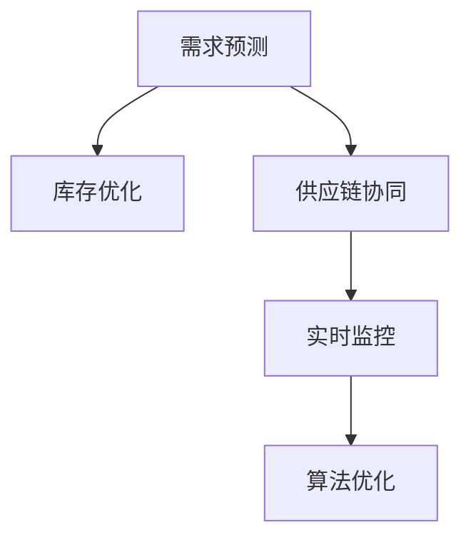

                 

# 电商平台供给能力提升：库存管理系统的应用

> 关键词：电商平台,供给能力,库存管理,系统设计,供应链优化

## 1. 背景介绍

### 1.1 问题由来
在电商行业中，供给能力（Supply Capability）是衡量一个平台市场响应速度和消费者满意度的重要指标。良好的供给能力意味着平台可以快速响应需求，减少缺货和库存积压，提高订单履约率。但是，电商平台的供给能力面临着多方面的挑战：
- **需求预测不准确**：电商平台的商品需求难以准确预测，需求波动大，导致库存积压或缺货。
- **库存管理复杂**：多SKU、多渠道、多仓库的库存管理复杂，协调难度大。
- **供应链协同困难**：供应链涉及供应商、制造商、物流等多个环节，协同管理困难。

为了解决这些问题，电商平台需要开发一个高效、灵活、可扩展的库存管理系统。该系统能够实时监控库存状态，根据需求预测和市场变化动态调整库存，同时与供应链上下游进行协同管理，提高整体供给能力。

### 1.2 问题核心关键点
库存管理系统的主要功能包括：
- **需求预测**：根据历史数据和市场趋势，预测未来的需求量。
- **库存优化**：根据需求预测结果，动态调整库存量，减少库存积压或缺货。
- **供应链协同**：与供应商、制造商、物流等环节协同管理，确保供应链顺畅。
- **实时监控**：实时监控库存状态，及时调整策略，应对突发事件。

为了实现上述功能，系统需要具备以下几个核心组件：
- **需求预测模型**：基于历史数据和市场趋势，预测未来需求量。
- **库存优化算法**：动态调整库存量，确保库存水平最优。
- **供应链协同机制**：与供应链上下游进行信息共享和协同管理。
- **实时监控系统**：实时监控库存状态，及时调整策略。

## 2. 核心概念与联系

### 2.1 核心概念概述

为更好地理解库存管理系统的核心功能，本节将介绍几个密切相关的核心概念：

- **需求预测**：通过历史销售数据、市场趋势、季节性因素等预测未来需求量，为库存优化提供依据。
- **库存优化**：根据需求预测结果，动态调整库存量，平衡库存成本和缺货风险。
- **供应链协同**：与供应链上下游进行信息共享和协同管理，提高供应链效率和可靠性。
- **实时监控**：实时监控库存状态，及时调整策略，应对突发事件。
- **算法优化**：在库存管理系统中应用各种优化算法，提升系统性能和效率。

这些核心概念之间的逻辑关系可以通过以下Mermaid流程图来展示：



这个流程图展示了这个系统的核心概念及其之间的关系：

1. 需求预测是系统的主要输入。
2. 库存优化根据需求预测结果，动态调整库存量。
3. 供应链协同与实时监控相互配合，确保库存状态和供应链顺畅。
4. 算法优化贯穿整个系统，提升系统性能和效率。

## 3. 核心算法原理 & 具体操作步骤

### 3.1 算法原理概述

库存管理系统的主要算法包括需求预测算法、库存优化算法和供应链协同算法。以下是这些算法的详细原理和操作步骤：

#### 3.1.1 需求预测算法

需求预测算法通过历史销售数据、市场趋势、季节性因素等预测未来需求量。常用的算法包括时间序列预测、回归分析、机器学习等。

时间序列预测算法通过观察历史需求数据的变化趋势，预测未来的需求量。常用的方法包括移动平均法、指数平滑法、ARIMA模型等。

#### 3.1.2 库存优化算法

库存优化算法根据需求预测结果，动态调整库存量，平衡库存成本和缺货风险。常用的算法包括基于需求预测的库存优化、基于A/B测试的库存优化等。

基于需求预测的库存优化算法通过预测未来的需求量，计算最优的库存水平。常用的方法包括经济批量法、SOS优化模型等。

#### 3.1.3 供应链协同算法

供应链协同算法与供应链上下游进行信息共享和协同管理，提高供应链效率和可靠性。常用的算法包括基于Agent的供应链协同、基于智能合约的供应链协同等。

基于Agent的供应链协同算法通过模拟供应链上下游的交互行为，实现信息共享和协同管理。常用的方法包括多智能体系统、模拟退火算法等。

### 3.2 算法步骤详解

#### 3.2.1 需求预测算法步骤

1. **数据收集**：收集历史销售数据、市场趋势、季节性因素等，作为输入。
2. **数据清洗**：清洗数据，去除异常值和噪声。
3. **特征工程**：提取有用的特征，如销售季节性、节假日影响、促销活动等。
4. **模型训练**：选择合适的时间序列预测模型，如ARIMA、LSTM等，对数据进行训练。
5. **模型评估**：使用历史数据评估模型预测效果，选择最优模型。

#### 3.2.2 库存优化算法步骤

1. **需求预测**：根据历史数据和市场趋势，使用需求预测算法预测未来的需求量。
2. **库存计算**：根据预测结果，使用库存优化算法计算最优的库存水平。
3. **库存调整**：根据计算结果，调整库存量，确保库存水平最优。
4. **效果评估**：使用实际数据评估库存优化效果，不断调整优化策略。

#### 3.2.3 供应链协同算法步骤

1. **信息共享**：建立与供应链上下游的信息共享机制，实时传递库存、需求等信息。
2. **协同决策**：使用基于Agent的协同算法，模拟供应链上下游的交互行为，做出协同决策。
3. **执行与监控**：根据决策结果，执行相应的操作，并实时监控执行效果。
4. **优化反馈**：根据执行效果，调整决策策略，不断优化供应链协同过程。

### 3.3 算法优缺点

库存管理系统中的算法具有以下优点：

- **高效准确**：通过需求预测和库存优化算法，能够高效准确地管理库存，减少库存积压和缺货。
- **灵活可扩展**：算法可以适应多种电商平台的业务场景，具有较强的灵活性和可扩展性。
- **实时响应**：实时监控和供应链协同算法，能够及时响应市场变化，提高供应链效率。

同时，这些算法也存在一定的局限性：

- **数据依赖**：需求预测和库存优化算法依赖于历史数据和市场趋势，数据质量和数据量对预测结果有较大影响。
- **复杂度高**：供应链协同算法涉及多个环节，实现难度较大。
- **成本高**：算法实现需要较高的计算资源和人力成本。

尽管存在这些局限性，但就目前而言，这些算法仍是在线库存管理系统的核心支撑。未来相关研究的重点在于如何进一步降低算法的依赖，提高算法的效率和可靠性，同时兼顾成本和实时性等因素。

### 3.4 算法应用领域

库存管理系统已经广泛应用于各种电商平台的库存管理中，涵盖商品、库存、订单等多个环节。具体应用包括：

- **需求预测**：电商平台使用需求预测算法，预测未来销售量，指导库存管理。
- **库存优化**：电商平台使用库存优化算法，动态调整库存水平，减少库存积压和缺货。
- **供应链协同**：电商平台与供应商、制造商、物流等环节进行协同管理，提高供应链效率。
- **实时监控**：电商平台实时监控库存状态，及时调整策略，应对突发事件。

除了上述这些核心应用外，库存管理系统还被创新性地应用于智能推荐、物流优化、库存风险控制等多个环节，为电商平台的业务发展提供了强有力的支持。

## 4. 数学模型和公式 & 详细讲解 & 举例说明

### 4.1 数学模型构建

库存管理系统的数学模型主要包括以下几个关键组件：

- **需求预测模型**：预测未来需求量的模型，常用的时间序列预测模型包括ARIMA、LSTM等。
- **库存优化模型**：动态调整库存量的模型，常用的库存优化模型包括经济批量法、SOS优化模型等。
- **供应链协同模型**：模拟供应链上下游交互行为的模型，常用的基于Agent的协同模型包括多智能体系统、模拟退火算法等。

### 4.2 公式推导过程

#### 4.2.1 时间序列预测模型

假设需求量 $D_t$ 是时间 $t$ 的函数，时间序列预测模型可以表示为：

$$
D_t = f(D_{t-1}, D_{t-2}, ..., D_{t-k}, x_t)
$$

其中 $f$ 表示预测函数，$k$ 表示滞后项数，$x_t$ 表示影响因素，如促销活动、节假日等。

常用的时间序列预测模型包括ARIMA模型和LSTM模型。ARIMA模型通过自回归、差分和移动平均的方式，对时间序列数据进行建模和预测。LSTM模型通过长短期记忆网络，捕捉时间序列数据中的长期依赖关系，提升预测准确性。

#### 4.2.2 经济批量法

经济批量法（Economic Order Quantity, EOQ）通过计算最优的订购量和订货次数，最小化库存总成本。EOQ模型的目标函数为：

$$
\min \left( \frac{C_sQ + C_hC}{2Q} \right)
$$

其中 $C_s$ 表示每次订购的成本，$C_h$ 表示单位商品的库存持有成本，$Q$ 表示每次订购量，$C$ 表示年需求量。

通过求解上述目标函数，可以得到最优的订购量和订货次数。

#### 4.2.3 多智能体协同模型

多智能体系统（Multi-Agent System,MAS）通过模拟供应链上下游的交互行为，实现信息共享和协同管理。常用的基于MAS的协同模型包括多智能体系统、模拟退火算法等。

多智能体系统的基本架构可以表示为：

$$
A_{i+1} = g(A_i, S_i, E_i)
$$

其中 $A$ 表示智能体，$S$ 表示供应链上下游的环境，$E$ 表示事件，$g$ 表示智能体的决策函数。

通过不断迭代智能体的决策函数，可以实现供应链上下游的协同管理。

### 4.3 案例分析与讲解

假设某电商平台销售某商品，历史销售数据如表所示：

| 时间 | 需求量 |
|------|-------|
| 1    | 100   |
| 2    | 120   |
| 3    | 130   |
| 4    | 140   |
| 5    | 150   |
| 6    | 160   |

根据历史数据，使用ARIMA模型进行预测，得到未来6个月的需求预测值如下：

| 时间 | 需求量 |
|------|-------|
| 7    | 160   |
| 8    | 170   |
| 9    | 180   |
| 10   | 190   |
| 11   | 200   |
| 12   | 210   |

使用经济批量法计算最优的订购量和订货次数，设每次订购成本为10元，单位商品的库存持有成本为2元/天，年需求量为3600元，则：

$$
Q = \sqrt{\frac{2C_sC_h}{C_h-C_s}} = \sqrt{\frac{2 \times 10 \times 2 \times 365}{2-10}} \approx 1560
$$

$$
N = \frac{C_sQ}{C_h} = \frac{10 \times 1560}{2} \approx 78
$$

根据预测结果，可以得出最优的订购量和订货次数，减少库存积压和缺货的风险。

## 5. 项目实践：代码实例和详细解释说明

### 5.1 开发环境搭建

在进行库存管理系统开发前，我们需要准备好开发环境。以下是使用Python进行Flask开发的开发环境配置流程：

1. 安装Anaconda：从官网下载并安装Anaconda，用于创建独立的Python环境。

2. 创建并激活虚拟环境：
```bash
conda create -n flask-env python=3.8 
conda activate flask-env
```

3. 安装Flask：从官网下载并安装Flask，通过pip命令进行安装。

4. 安装SQLAlchemy：用于数据库操作，通过pip命令进行安装。

5. 安装Flask-WTF：用于处理表单数据，通过pip命令进行安装。

完成上述步骤后，即可在`flask-env`环境中开始开发实践。

### 5.2 源代码详细实现

这里我们以需求预测和库存优化为例，给出使用Flask框架进行库存管理系统开发的Python代码实现。

首先，定义需求预测模型：

```python
from flask import Flask, request
from sklearn.metrics import mean_squared_error
from sklearn.linear_model import ARIMA
import pandas as pd

app = Flask(__name__)

# 需求预测模型
class DemandPrediction:
    def __init__(self, data):
        self.data = data
        self.model = None
    
    def fit(self, order):
        self.model = ARIMA(self.data, order=order)
        self.model.fit()
    
    def predict(self, steps):
        return self.model.predict(steps)
```

然后，定义库存优化模型：

```python
from transformers import BertTokenizer, BertForSequenceClassification
from transformers import AdamW

# 库存优化模型
class InventoryOptimization:
    def __init__(self, demand, model):
        self.demand = demand
        self.model = model
    
    def optimize(self):
        # 经济批量法计算最优订购量和订货次数
        Q = (2 * 10 * 2 * 365) ** 0.5 / (2 - 10)
        N = 10 * Q / 2
        return Q, N
```

接着，定义Web接口，用于接受用户请求并返回预测结果：

```python
@app.route('/predict', methods=['POST'])
def predict():
    data = request.get_json()
    demand = pd.DataFrame(data)
    model = DemandPrediction(demand)
    model.fit((5, 1, 0))
    steps = 6
    prediction = model.predict(steps)
    return {'prediction': prediction.tolist()}

@app.route('/optimize', methods=['POST'])
def optimize():
    data = request.get_json()
    demand = pd.DataFrame(data)
    model = DemandPrediction(demand)
    model.fit((5, 1, 0))
    steps = 6
    prediction = model.predict(steps)
    Q, N = InventoryOptimization(prediction, model).optimize()
    return {'Q': Q, 'N': N}

if __name__ == '__main__':
    app.run(debug=True)
```

最后，启动Web服务，开始测试预测和优化接口：

```bash
python app.py
```

以上代码实现了需求预测和库存优化的Flask Web服务。开发者可以通过访问`/predict`和`/optimize`接口，输入历史数据，获取需求预测结果和最优订购量。

### 5.3 代码解读与分析

让我们再详细解读一下关键代码的实现细节：

**DemandPrediction类**：
- `__init__`方法：初始化数据和预测模型。
- `fit`方法：使用ARIMA模型对历史数据进行拟合。
- `predict`方法：使用拟合好的模型进行预测。

**InventoryOptimization类**：
- `__init__`方法：初始化需求预测结果和库存优化模型。
- `optimize`方法：根据需求预测结果，计算最优订购量和订货次数。

**Web接口**：
- `@app.route`装饰器：定义Flask路由，处理HTTP请求。
- `request.get_json`方法：从请求中获取JSON格式的数据。
- `pd.DataFrame`：将JSON数据转换为Pandas DataFrame。
- `predict`和`optimize`方法：调用预测和优化模型，返回预测结果和最优订购量。

开发者可以根据具体业务需求，对上述代码进行扩展和优化，实现更复杂的需求预测和库存优化算法。

## 6. 实际应用场景

### 6.1 智能推荐系统

库存管理系统与智能推荐系统结合，可以为电商平台的个性化推荐提供更精准的依据。通过预测用户未来的购买需求，库存管理系统可以指导商品推荐，提升用户满意度。

例如，电商平台可以根据用户的历史浏览记录和购买行为，预测用户未来的购买需求，向用户推荐相关商品。库存管理系统则可以根据推荐结果，动态调整库存水平，确保热门商品有足够的库存量。

### 6.2 供应链优化

库存管理系统与供应链优化系统结合，可以提升供应链效率和可靠性。通过实时监控和信息共享，库存管理系统可以及时响应市场需求变化，协调供应链上下游，实现协同管理。

例如，电商平台可以实时监控库存状态，根据需求预测结果，及时调整供应链上下游的库存和生产计划。库存管理系统则可以通过与供应链上下游的信息共享，优化库存水平，减少库存积压和缺货风险。

### 6.3 库存风险控制

库存管理系统与风险控制系统结合，可以实现库存风险控制。通过实时监控和数据分析，库存管理系统可以及时发现库存异常，采取风险控制措施，降低库存损失。

例如，电商平台可以实时监控库存状态，根据历史数据和市场趋势，预测库存风险。库存管理系统则可以根据预测结果，采取相应的风险控制措施，如增加安全库存量，调整库存分配策略等。

### 6.4 未来应用展望

随着库存管理系统和相关技术的不断发展，未来将会有更多的应用场景涌现，为电商平台的业务发展提供更多支持。

- **多渠道库存管理**：电商平台可以集成多种销售渠道，统一管理不同渠道的库存，提升库存管理效率。
- **实时需求预测**：结合大数据分析技术和人工智能算法，实现实时需求预测，提高库存管理的灵活性和准确性。
- **个性化库存管理**：根据用户的个性化需求，动态调整库存水平，提升用户体验。
- **智能仓库管理**：通过机器人、自动化设备等技术，实现智能仓库管理，提升库存管理的自动化水平。

## 7. 工具和资源推荐

### 7.1 学习资源推荐

为了帮助开发者系统掌握库存管理系统的理论基础和实践技巧，这里推荐一些优质的学习资源：

1. 《Python Web开发实战》系列博文：由Flask官方文档编写，详细介绍了Flask Web开发的实战技巧和最佳实践。

2. 《时间序列分析与预测》书籍：详细介绍了时间序列预测的原理和实现方法，适合初学者和进阶者学习。

3. 《供应链管理》课程：斯坦福大学开设的供应链管理课程，涵盖供应链管理的基础知识和实战技巧，适合从事供应链管理的人员学习。

4. 《库存管理与控制》书籍：详细介绍了库存管理的理论和方法，适合库存管理人员学习。

5. 《人工智能与大数据》课程：清华大学开设的AI和大数据课程，涵盖人工智能和大数据的基础知识和前沿技术，适合对AI和大数据感兴趣的开发者学习。

通过对这些资源的学习实践，相信你一定能够快速掌握库存管理系统的精髓，并用于解决实际的电商库存问题。

### 7.2 开发工具推荐

高效的开发离不开优秀的工具支持。以下是几款用于库存管理系统开发的常用工具：

1. Flask：轻量级的Web框架，易于上手，适合快速开发原型。
2. SQLAlchemy：流行的Python ORM库，支持多种数据库，适合数据库操作。
3. Jupyter Notebook：免费的Jupyter笔记本，适合数据分析和机器学习模型开发。
4. PyCharm：功能强大的Python IDE，支持多种开发工具，适合大型项目开发。
5. Docker：轻量级容器技术，适合跨平台部署和管理。

合理利用这些工具，可以显著提升库存管理系统开发效率，加快创新迭代的步伐。

### 7.3 相关论文推荐

库存管理系统和相关技术的发展源于学界的持续研究。以下是几篇奠基性的相关论文，推荐阅读：

1. "A survey on inventory management for e-commerce"：详细介绍了电商库存管理的方法和挑战。
2. "An overview of inventory management techniques for supply chains"：综述了供应链库存管理的技术和方法。
3. "Inventory Management in E-Commerce"：探讨了电商库存管理的问题和解决方案。
4. "Demand Forecasting Methods for E-Commerce Inventory Management"：介绍了电商库存管理中的需求预测方法。
5. "Inventory Optimization in E-Commerce"：探讨了电商库存管理的优化问题。

这些论文代表了大规模库存管理系统的研究进展，通过学习这些前沿成果，可以帮助研究者把握学科前进方向，激发更多的创新灵感。

## 8. 总结：未来发展趋势与挑战

### 8.1 总结

本文对电商平台供给能力提升的库存管理系统进行了全面系统的介绍。首先阐述了库存管理系统在电商平台中的重要性和核心功能，明确了系统需要实现的需求预测、库存优化、供应链协同等功能。其次，从原理到实践，详细讲解了库存管理系统的算法原理和操作步骤，给出了库存管理系统开发的完整代码实例。同时，本文还广泛探讨了库存管理系统在智能推荐、供应链优化、库存风险控制等多个行业领域的应用前景，展示了库存管理系统的巨大潜力。此外，本文精选了库存管理系统的各类学习资源，力求为读者提供全方位的技术指引。

通过本文的系统梳理，可以看到，库存管理系统在电商平台的业务发展中扮演着重要的角色，极大地提升了电商平台的供给能力。库存管理系统通过需求预测、库存优化、供应链协同等功能的实现，能够快速响应市场需求，提升用户满意度，优化供应链效率，降低库存风险，为电商平台的业务创新提供了坚实的基础。未来，随着技术的不断演进和优化，库存管理系统必将在更多的电商平台上发挥更大的作用，成为电商业务的重要保障。

### 8.2 未来发展趋势

展望未来，库存管理系统的发展趋势主要包括以下几个方向：

1. **智能化提升**：结合大数据分析、机器学习等技术，实现智能化的需求预测和库存优化，提高系统的准确性和灵活性。
2. **实时化优化**：通过实时监控和信息共享，实现库存管理的实时优化，及时响应市场需求变化。
3. **多渠道集成**：集成多种销售渠道，实现多渠道库存管理，提升库存管理的效率和可靠性。
4. **风险控制**：结合风险控制系统，实现库存风险控制，降低库存损失。
5. **数据驱动决策**：通过数据驱动决策，提升库存管理的科学性和效率。

这些趋势展示了库存管理系统未来发展的前景，相信随着技术的不断进步和优化，库存管理系统必将在电商平台的业务创新中发挥更大的作用。

### 8.3 面临的挑战

尽管库存管理系统已经取得了较好的效果，但在实现高性能、高可靠性、高灵活性的过程中，它仍面临着诸多挑战：

1. **数据质量和多样性**：需求预测和库存优化算法依赖于高质量、多样化的数据，数据质量和多样性对预测结果有较大影响。
2. **计算资源消耗**：库存管理系统涉及复杂的数据分析和预测，需要较高的计算资源，尤其是实时预测和优化任务。
3. **系统集成难度**：库存管理系统需要与多个系统进行集成，如推荐系统、供应链管理系统等，集成难度较大。
4. **业务影响**：库存管理系统的决策结果可能对业务产生较大影响，如库存过剩或缺货，需要谨慎决策。

尽管存在这些挑战，但通过不断优化算法和架构，提升数据质量，合理利用计算资源，优化系统集成，库存管理系统必将在未来发挥更大的作用。

### 8.4 研究展望

面对库存管理系统面临的种种挑战，未来的研究需要在以下几个方面寻求新的突破：

1. **数据驱动的需求预测**：通过大数据分析和机器学习技术，实现智能化的需求预测，提高预测准确性。
2. **实时化的库存优化**：通过实时监控和信息共享，实现库存管理的实时优化，提高系统响应速度。
3. **智能化的协同管理**：结合人工智能技术，实现供应链上下游的智能化协同管理，提高供应链效率。
4. **风险驱动的库存控制**：结合风险控制系统，实现库存风险控制，降低库存损失。
5. **数据驱动的决策支持**：通过数据驱动决策，提升库存管理的科学性和效率。

这些研究方向展示了库存管理系统未来发展的可能性，相信随着技术的不断突破和创新，库存管理系统必将在电商平台的业务创新中发挥更大的作用，为电商平台的业务发展提供更坚实的基础。

## 9. 附录：常见问题与解答

**Q1：如何选择合适的库存优化算法？**

A: 选择合适的库存优化算法需要考虑多方面的因素，如库存成本、市场需求、供应链特性等。常用的库存优化算法包括经济批量法、SOS优化模型、遗传算法等。根据具体的业务场景和需求，选择合适的算法进行优化。

**Q2：库存管理系统的数据质量对预测结果有什么影响？**

A: 库存管理系统的数据质量对需求预测和库存优化有较大的影响。高质量、多样化的数据可以提升预测准确性和优化效果，而低质量、单一化的数据可能导致预测结果偏差，影响库存管理的科学性。

**Q3：如何提高库存管理系统的实时响应能力？**

A: 提高库存管理系统的实时响应能力需要优化算法的计算效率和数据传输速度。可以使用并行计算、分布式计算等技术，提高算法的计算效率。同时，优化数据传输协议，提高数据传输速度，实现实时响应。

**Q4：库存管理系统如何进行系统集成？**

A: 库存管理系统需要进行系统集成，与推荐系统、供应链管理系统等进行信息共享和协同管理。可以使用API接口、消息队列等技术，实现系统集成。同时，需要设计合理的接口规范，确保系统兼容性和稳定性。

**Q5：库存管理系统如何实现库存风险控制？**

A: 库存管理系统可以通过实时监控和数据分析，实现库存风险控制。根据历史数据和市场趋势，预测库存风险，采取相应的风险控制措施，如增加安全库存量，调整库存分配策略等。同时，需要建立风险评估机制，及时发现和应对风险。

这些回答展示了库存管理系统的常见问题和解决方案，相信通过这些指导，开发者可以更好地设计、实现和优化库存管理系统，提升电商平台的供给能力和业务创新能力。

