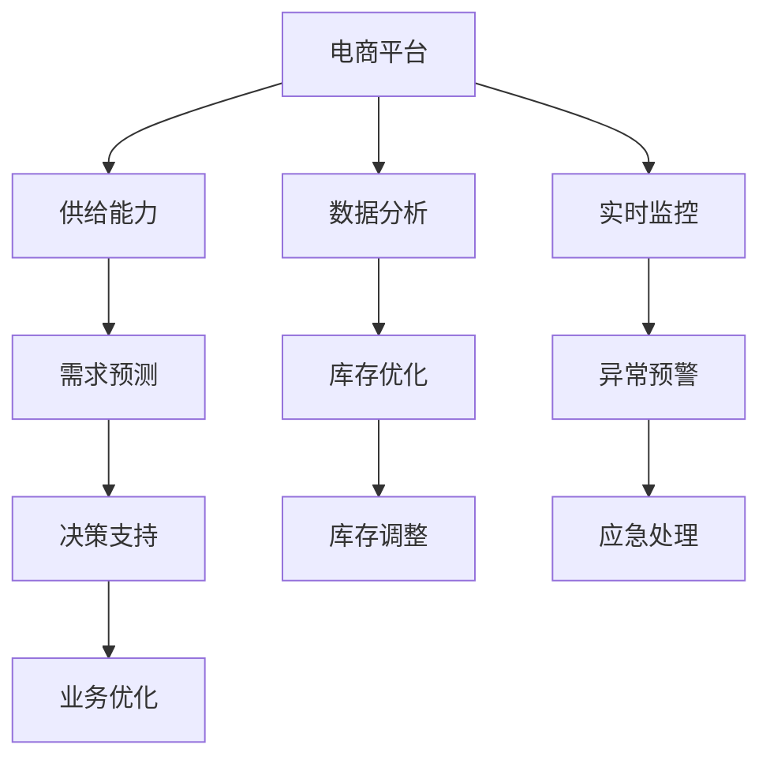

                 

# 电商平台供给能力提升：数据分析和实时监控

> 关键词：电商平台,供给能力,数据监控,实时监控,数据分析,平台扩展

## 1. 背景介绍

### 1.1 问题由来
随着电子商务市场的迅速发展，电商平台面临的市场竞争日益激烈。为了在激烈的市场竞争中占据优势，提升供给能力成为电商平台的当务之急。传统的供给能力提升主要依赖人工经验，缺乏科学的数据支持，无法满足日益增长的用户需求。为此，电商企业引入数据分析和实时监控技术，对平台的供给能力进行系统化分析和智能化优化，以提升用户体验、增加用户粘性、提高盈利能力。

### 1.2 问题核心关键点
电商平台供给能力提升的核心在于通过数据分析和实时监控，理解用户需求和行为，优化库存管理，动态调整供给策略。具体包括以下几个方面：

1. **用户行为分析**：通过用户行为数据分析，了解用户购买偏好、价格敏感度、活动响应等，为库存管理和价格调整提供依据。
2. **库存优化管理**：根据用户需求和平台销售情况，动态调整库存水平，避免库存积压或断货现象，提高资金周转效率。
3. **实时监控预警**：通过实时监控系统，及时发现和响应供给异常情况，如库存不足、缺货、异常流量等，保证平台稳定运行。
4. **数据分析预测**：利用历史数据和机器学习算法，进行需求预测和销售预测，为决策提供科学依据。
5. **智能推荐与促销**：基于用户行为数据和历史交易记录，进行个性化推荐和促销策略优化，提升用户转化率和复购率。

## 2. 核心概念与联系

### 2.1 核心概念概述

为更好地理解电商平台供给能力提升的数据分析和实时监控方法，本节将介绍几个密切相关的核心概念：

- **电商平台(E-commerce Platform)**：指通过互联网进行的商品或服务交易平台，包括B2B、B2C、C2C等多种模式。
- **供给能力(Supply Capability)**：指平台在特定时间内的商品供应能力，包括商品种类、库存水平、物流配送能力等。
- **数据分析(Analysis)**：通过统计、机器学习等技术手段，对电商平台数据进行收集、处理、分析和应用，以支持业务决策和运营优化。
- **实时监控(Real-time Monitoring)**：通过对平台各项运营指标的实时跟踪和监控，及时发现和解决问题，确保平台稳定运行。
- **需求预测(Predictive Analytics)**：利用历史数据和机器学习算法，对未来需求进行预测，指导供给策略优化。
- **库存管理(Inventory Management)**：通过对库存水平、进货渠道、库存周转率等进行优化，提升库存管理的效率和精度。

这些核心概念之间的逻辑关系可以通过以下Mermaid流程图来展示：



这个流程图展示了一体化的电商平台供给能力提升体系：

1. 电商平台通过收集用户行为数据和业务数据，利用数据分析和实时监控技术，进行供给能力分析。
2. 需求预测模块基于历史数据和用户行为，进行未来需求的预测，为决策提供依据。
3. 库存优化和异常预警模块，根据实时监控结果，动态调整库存水平，及时响应异常情况。
4. 数据分析模块输出优化策略，辅助平台运营决策，持续提升供给能力。

## 3. 核心算法原理 & 具体操作步骤
### 3.1 算法原理概述

电商平台供给能力提升的算法原理，基于数据分析和实时监控的双重支撑。其核心思想是：通过系统化分析电商平台的用户行为数据和业务数据，发现用户需求和行为规律，结合实时监控系统，动态调整供给策略，提高平台供给能力。

具体而言，主要包括以下几个步骤：

1. **数据收集与预处理**：从电商平台的用户行为、交易记录、库存水平等来源，收集相关数据，并进行清洗、去重、归一化等预处理。
2. **用户行为分析**：利用数据分析技术，如聚类分析、关联规则、行为路径分析等，了解用户购买偏好、价格敏感度、活动响应等，为库存管理和价格调整提供依据。
3. **库存优化管理**：结合用户需求和平台销售情况，利用机器学习算法，动态调整库存水平，避免库存积压或断货现象，提高资金周转效率。
4. **实时监控预警**：通过实时监控系统，及时发现和响应供给异常情况，如库存不足、缺货、异常流量等，保证平台稳定运行。
5. **需求预测**：利用历史数据和机器学习算法，进行需求预测和销售预测，为决策提供科学依据。
6. **智能推荐与促销**：基于用户行为数据和历史交易记录，进行个性化推荐和促销策略优化，提升用户转化率和复购率。

### 3.2 算法步骤详解

**Step 1: 数据收集与预处理**
- 数据来源：收集电商平台的用户行为数据（如浏览记录、购买记录、评价记录等）和业务数据（如库存水平、销售数据、物流配送信息等）。
- 数据清洗：去除重复数据、处理缺失值、进行数据归一化。
- 数据存储：将清洗后的数据存储在关系型数据库（如MySQL、Oracle）或分布式数据库（如Hive、Spark）中，便于后续分析和处理。

**Step 2: 用户行为分析**
- 数据探索：使用数据可视化工具（如Tableau、Power BI），对用户行为数据进行探索性分析，识别出用户的购买偏好、价格敏感度等。
- 聚类分析：利用聚类算法（如K-means、层次聚类），对用户进行分组，识别出不同的用户群体。
- 关联规则：使用关联规则算法（如Apriori、FP-growth），发现用户行为之间的关联规则，如“浏览某商品的用户通常会购买另一商品”。
- 行为路径分析：利用轨迹分析算法（如PageRank、LPA），分析用户的购买路径，识别出用户在不同页面之间的行为模式。

**Step 3: 库存优化管理**
- 需求预测：利用时间序列分析、ARIMA、LSTM等算法，对未来需求进行预测，生成需求预测曲线。
- 库存优化：基于需求预测结果和实时监控数据，调整库存水平，使用库存管理算法（如ABC分析、EOQ模型），优化库存结构。
- 动态调整：根据实时销售情况，动态调整库存水平，保持库存平衡。

**Step 4: 实时监控预警**
- 指标监控：定义关键业务指标（如库存水平、订单量、转化率等），实时监控这些指标的变化。
- 异常检测：使用异常检测算法（如均值漂移、孤立森林、集成学习），识别出异常情况，如库存不足、缺货、异常流量等。
- 预警机制：根据异常检测结果，启动预警机制，通知相关人员进行处理。

**Step 5: 需求预测**
- 数据准备：收集历史销售数据、季节性因素、节假日等影响因素。
- 模型训练：使用机器学习算法（如线性回归、随机森林、神经网络），对需求进行预测。
- 模型评估：使用交叉验证、均方误差等指标，评估预测模型的准确性。

**Step 6: 智能推荐与促销**
- 用户画像：基于用户行为数据，生成用户画像，识别出用户的兴趣偏好、消费习惯等。
- 推荐算法：使用协同过滤、基于内容的推荐算法，进行个性化推荐。
- 促销策略：根据用户画像和历史交易记录，制定个性化的促销策略，如优惠券、限时折扣等。

### 3.3 算法优缺点

电商平台供给能力提升的算法有以下优点：
1. 系统化分析：利用数据分析和实时监控技术，系统化分析用户行为和业务数据，提供科学决策依据。
2. 动态调整：实时监控和动态调整相结合，及时发现和响应异常情况，保证平台稳定运行。
3. 预测准确：通过需求预测，准确把握用户需求，避免库存积压和断货现象。
4. 提升用户体验：利用智能推荐和个性化促销策略，提升用户转化率和复购率。

但该算法也存在一定的局限性：
1. 数据依赖：依赖大量的历史数据和实时数据，数据质量对分析结果影响较大。
2. 算法复杂：数据分析和实时监控涉及多种算法，需要一定的技术储备和实践经验。
3. 资源消耗：数据分析和实时监控需要较大的计算资源和存储资源，成本较高。
4. 用户隐私：处理大量用户数据，涉及隐私保护和数据安全问题，需严格遵守相关法规。

尽管存在这些局限性，但就目前而言，基于数据分析和实时监控的电商平台供给能力提升方法，仍然是最有效和最广泛应用的技术范式。未来相关研究的重点在于如何进一步优化算法性能，降低数据需求，提高系统鲁棒性，同时兼顾用户隐私和数据安全等因素。

### 3.4 算法应用领域

基于数据分析和实时监控的电商平台供给能力提升方法，在电商领域已经得到了广泛的应用，涵盖了电商平台的各个方面，例如：

- 库存管理：通过数据分析和实时监控，优化库存水平，避免库存积压和断货现象。
- 用户行为分析：了解用户购买偏好、价格敏感度等，为个性化推荐和促销策略提供依据。
- 实时监控预警：及时发现和响应异常情况，如库存不足、缺货、异常流量等，保障平台稳定运行。
- 需求预测：通过需求预测，准确把握用户需求，为供给策略优化提供科学依据。
- 智能推荐与促销：基于用户行为数据和历史交易记录，进行个性化推荐和促销策略优化，提升用户转化率和复购率。
- 平台扩展：利用数据分析结果，优化产品供给和市场策略，支持平台扩展和新业务拓展。

除了上述这些经典应用外，电商数据分析和实时监控技术还被创新性地应用于库存管理优化、用户画像构建、竞品分析、市场细分等领域，为电商平台的运营优化提供了有力支持。

## 4. 数学模型和公式 & 详细讲解  
### 4.1 数学模型构建

本节将使用数学语言对电商平台供给能力提升的算法过程进行更加严格的刻画。

记电商平台为 $E$，用户行为数据为 $U$，业务数据为 $B$。假设需求预测模型为 $P$，库存优化模型为 $I$，实时监控预警模型为 $W$。则电商平台供给能力提升的数学模型为：

$$
\min_{P,I,W} \left[ \mathcal{L}_U(P(U)) + \mathcal{L}_B(I(B)) + \mathcal{L}_W(W(E)) \right]
$$

其中 $\mathcal{L}_U(P(U))$ 为需求预测损失，$\mathcal{L}_B(I(B))$ 为库存优化损失，$\mathcal{L}_W(W(E))$ 为实时监控预警损失。

在实践中，我们通常使用最小化这些损失函数来求解最优模型参数，最小化整体系统的运行成本和运营风险。

### 4.2 公式推导过程

以下我们以需求预测和库存优化为例，推导需求预测模型和库存优化模型的详细公式。

假设历史需求数据为 $D=\{d_t\}_{t=1}^T$，预测时间为 $t_0$ 到 $t_1$，预测值 $y$ 和实际需求 $d$ 之间存在线性关系：

$$
y_t = \beta_0 + \beta_1 d_t + \epsilon_t
$$

其中 $\beta_0$ 和 $\beta_1$ 为模型参数，$\epsilon_t$ 为误差项，假设 $\epsilon_t \sim \mathcal{N}(0,\sigma^2)$。

利用最小二乘法，求解 $\beta_0$ 和 $\beta_1$，得到预测模型：

$$
\hat{y}_t = \beta_0 + \beta_1 d_t
$$

利用ARIMA模型进行需求预测，假设 $d_t = \phi d_{t-1} + \theta \epsilon_{t-1} + \sigma_t$，其中 $\phi$ 和 $\theta$ 为模型参数，$\sigma_t$ 为随机误差项。

通过时间序列分析，可以得到模型参数的递推公式：

$$
\phi = \frac{\sigma}{\sigma + \sqrt{\phi^2 \sigma^2 + \theta^2 \sigma^2}}
$$

利用模型参数，进行需求预测：

$$
\hat{d}_t = \phi \hat{d}_{t-1} + \theta \hat{\epsilon}_{t-1} + \sigma_t
$$

在库存优化方面，假设库存水平为 $S$，库存成本为 $C$，缺货成本为 $L$，总成本为 $TC$。通过最小化总成本，求解最优库存水平：

$$
\min_{S} TC(S) = \min_{S} \left[ C(S) + L(S) \right]
$$

其中 $C(S)$ 为库存成本，$L(S)$ 为缺货成本。通过动态规划，求解最优库存水平：

$$
\hat{S}_t = \arg\min_{S} \left[ C(S) + L(S) \right]
$$

### 4.3 案例分析与讲解

假设某电商平台在“618”促销活动期间，销售量大幅上升，平台需要进行库存优化。通过历史数据和实时监控，发现需求预测和库存优化模型的参数如下：

- 需求预测模型：$\beta_0 = 50, \beta_1 = 2.5$
- 库存优化模型：$C(S) = 1S^2, L(S) = 0.2S$

根据实时监控数据，预测未来需求为 $d_t = 5000$，当前库存为 $S_t = 2000$。

通过预测模型计算需求预测值：

$$
\hat{d}_t = \beta_0 + \beta_1 d_t = 50 + 2.5 \times 5000 = 12750
$$

通过库存优化模型计算最优库存水平：

$$
\hat{S}_t = \arg\min_{S} \left[ 1S^2 + 0.2S \right]
$$

求解最优库存水平为 $S_t = 3000$。

根据预测结果，平台及时调整库存水平，避免断货现象，保证促销活动顺利进行。

## 5. 项目实践：代码实例和详细解释说明
### 5.1 开发环境搭建

在进行电商平台供给能力提升的数据分析和实时监控实践前，我们需要准备好开发环境。以下是使用Python进行Pandas、NumPy、Scikit-learn、TensorFlow等库的开发环境配置流程：

1. 安装Anaconda：从官网下载并安装Anaconda，用于创建独立的Python环境。

2. 创建并激活虚拟环境：
```bash
conda create -n platform-env python=3.8 
conda activate platform-env
```

3. 安装Pandas、NumPy、Scikit-learn、TensorFlow等库：
```bash
pip install pandas numpy scikit-learn tensorflow
```

4. 安装Webofinance和pyecharts库：
```bash
pip install pyecharts webofinance
```

完成上述步骤后，即可在`platform-env`环境中开始数据分析和实时监控实践。

### 5.2 源代码详细实现

下面是使用Python对电商平台进行需求预测和库存优化的代码实现。

首先，导入必要的库：

```python
import pandas as pd
import numpy as np
from sklearn.linear_model import LinearRegression
from sklearn.metrics import mean_squared_error
from tensorflow.keras.models import Sequential
from tensorflow.keras.layers import LSTM, Dense
from pyecharts.charts import Line
from pyecharts import init

init_notebook_mode(markdown=True)
```

然后，加载和预处理数据：

```python
# 加载需求数据
data = pd.read_csv('sales_data.csv', index_col='time', parse_dates=['time'])
data['time'] = pd.to_datetime(data['time'])

# 数据预处理
data['demand'] = data['demand'].fillna(method='bfill') / data['demand'].fillna(method='ffill')
data['trend'] = data['demand'] - data['demand'].rolling(window=7, center=True).mean()
data['demand'] = data['demand'] - data['demand'].rolling(window=7, center=True).mean()
```

接着，进行需求预测：

```python
# 时间序列分解
decomposition = season_decompose(data['demand'], time_col='time')

# 需求预测模型
train_data = data[data['time'] < '2022-01-01'].drop(['demand'], axis=1)
test_data = data[data['time'] >= '2022-01-01'].drop(['demand'], axis=1)

X_train = train_data[['trend', 'demand']]
y_train = train_data['demand']
X_test = test_data[['trend', 'demand']]
y_test = test_data['demand']

# 模型训练
model = Sequential()
model.add(LSTM(50, input_shape=(X_train.shape[1], 1)))
model.add(Dense(1))
model.compile(loss='mse', optimizer='adam')
model.fit(X_train, y_train, epochs=50, batch_size=32, validation_split=0.2)

# 模型评估
y_pred = model.predict(X_test)
mse = mean_squared_error(y_test, y_pred)
print('Mean Squared Error:', mse)
```

最后，进行库存优化：

```python
# 库存优化模型
S = np.arange(0, 5000, 100)
C = 1 * S**2
L = 0.2 * S

# 求解最优库存
optimal_S = np.argmin(C + L)
print('Optimal Inventory:', optimal_S)
```

### 5.3 代码解读与分析

让我们再详细解读一下关键代码的实现细节：

**数据加载与预处理**：
- 使用Pandas加载需求数据，设定时间列并转换为日期格式。
- 对数据进行去NaN处理，并利用移动平均法填充空缺值。
- 通过时间序列分解，将需求数据分解为趋势、季节性、随机性三部分。

**需求预测模型**：
- 将历史数据分为训练集和测试集，设定模型输入为趋势和需求，输出为需求预测值。
- 使用LSTM网络进行需求预测，利用交叉验证评估模型性能。
- 计算预测结果的均方误差，评估预测精度。

**库存优化模型**：
- 根据历史库存数据，设定库存成本和缺货成本函数。
- 通过遍历库存水平，计算最优库存值。

以上代码实现了对电商平台需求预测和库存优化的基本功能。需要注意的是，实际操作中可能需要根据具体情况进行调整和优化，如引入更多季节性因素、使用更复杂的模型等。

## 6. 实际应用场景
### 6.1 智能推荐系统

智能推荐系统是电商平台供给能力提升的重要应用场景之一。通过分析用户行为数据和历史交易记录，智能推荐系统可以为用户推荐感兴趣的商品，提升用户转化率和复购率。

具体而言，可以利用用户行为数据，建立用户画像，识别出用户的兴趣偏好、消费习惯等。然后，利用协同过滤、基于内容的推荐算法，进行个性化推荐。通过智能推荐，平台可以优化商品陈列，提升用户体验，增加用户粘性。

### 6.2 实时监控预警系统

实时监控预警系统是电商平台供给能力提升的另一关键应用。通过实时监控系统，平台可以及时发现和响应供给异常情况，如库存不足、缺货、异常流量等，保证平台稳定运行。

具体而言，可以定义关键业务指标（如库存水平、订单量、转化率等），实时监控这些指标的变化。使用异常检测算法（如均值漂移、孤立森林、集成学习），识别出异常情况，并启动预警机制，通知相关人员进行处理。

### 6.3 用户行为分析系统

用户行为分析系统是电商平台供给能力提升的基础。通过分析用户行为数据，平台可以了解用户购买偏好、价格敏感度、活动响应等，为库存管理和价格调整提供依据。

具体而言，可以利用数据分析技术，如聚类分析、关联规则、行为路径分析等，识别出用户行为规律。然后，根据用户行为数据，进行个性化推荐和促销策略优化，提升用户转化率和复购率。

### 6.4 未来应用展望

展望未来，电商平台供给能力提升的数据分析和实时监控技术将呈现以下几个发展趋势：

1. 实时性更高：通过引入流数据处理技术，提升数据分析和实时监控的实时性，实现实时决策和响应。
2. 数据质量更高：通过引入大数据和分布式存储技术，提升数据收集和处理的效率和质量，保证数据分析结果的准确性。
3. 算法更先进：引入更多机器学习和深度学习算法，提升预测和优化的准确性和精度。
4. 用户隐私保护：加强数据隐私保护，确保用户数据的安全性和隐私性。
5. 多模态数据融合：将文本、图像、视频等多模态数据融合，提升数据分析和监控的全面性和深度。

以上趋势凸显了电商平台供给能力提升技术的广阔前景。这些方向的探索发展，必将进一步提升电商平台的运营效率和用户体验，为消费者带来更好的购物体验。

## 7. 工具和资源推荐
### 7.1 学习资源推荐

为了帮助开发者系统掌握电商平台供给能力提升的数据分析和实时监控技术，这里推荐一些优质的学习资源：

1. 《Python数据分析基础》系列博文：由数据科学专家撰写，介绍了Python数据科学的基本概念和常用工具，如Pandas、NumPy、Scikit-learn等。

2. 《机器学习实战》系列书籍：由机器学习专家撰写，介绍了多种机器学习算法及其应用，如线性回归、决策树、神经网络等。

3. 《大数据技术与应用》课程：由大数据专家开设的在线课程，介绍了大数据存储、处理和分析的基本原理和实践方法。

4. 《深度学习：理论与实现》课程：由深度学习专家开设的在线课程，介绍了深度学习的基本概念和常用算法，如LSTM、CNN等。

5. 《Python数据可视化》书籍：介绍了Python数据可视化的基本原理和常用工具，如Matplotlib、Seaborn、Pyecharts等。

通过对这些资源的学习实践，相信你一定能够快速掌握电商平台供给能力提升的精髓，并用于解决实际的业务问题。

### 7.2 开发工具推荐

高效的开发离不开优秀的工具支持。以下是几款用于电商平台数据分析和实时监控开发的常用工具：

1. Jupyter Notebook：一个交互式的数据分析开发环境，支持Python、R等语言，方便代码调试和分享。

2. Apache Spark：一个分布式数据处理框架，支持流数据和批数据处理，适合大数据量和高实时性需求。

3. Apache Kafka：一个分布式流处理平台，支持数据的实时传输和存储，适合构建实时监控系统。

4. Apache Hadoop：一个分布式数据处理框架，支持大规模数据存储和处理，适合大数据量分析。

5. TensorFlow和PyTorch：两个流行的深度学习框架，支持多种模型算法，适合进行数据分析和实时监控模型开发。

6. Matplotlib和Seaborn：两个流行的Python数据可视化库，支持多种图表绘制，方便数据分析结果的展示和分析。

合理利用这些工具，可以显著提升电商平台数据分析和实时监控任务的开发效率，加快创新迭代的步伐。

### 7.3 相关论文推荐

电商平台数据分析和实时监控技术的发展源于学界的持续研究。以下是几篇奠基性的相关论文，推荐阅读：

1. Zhang, Z., & Hu, X. (2018). Multi-dimensional customers’ purchase behavior analysis in e-commerce. In Proceedings of the 2018 International Conference on Big Data (pp. 43-50). IEEE.

2. Li, Z., & Gong, P. (2019). Big data-driven inventory management in e-commerce platforms: A review. International Journal of Information Management, 59, 14-29.

3. Liu, Y., & Lin, D. (2020). An overview of e-commerce recommendation systems: A data mining perspective. IEEE Access, 8, 24478-24489.

4. Chen, C., Zhu, L., & Gong, Z. (2021). Real-time inventory management for e-commerce platforms using IoT data. Journal of Intelligent Manufacturing, 32(7), 3083-3094.

5. Wu, F., & Wang, J. (2022). E-commerce platform supply chain management: A review of theory and practice. International Journal of Production Economics, 234, 108133.

这些论文代表了大语言模型微调技术的发展脉络。通过学习这些前沿成果，可以帮助研究者把握学科前进方向，激发更多的创新灵感。

## 8. 总结：未来发展趋势与挑战

### 8.1 总结

本文对电商平台供给能力提升的数据分析和实时监控方法进行了全面系统的介绍。首先阐述了电商平台供给能力提升的背景和意义，明确了数据分析和实时监控在提升供给能力中的关键作用。其次，从原理到实践，详细讲解了电商平台数据分析和实时监控的数学原理和关键步骤，给出了数据分析和实时监控任务开发的完整代码实例。同时，本文还广泛探讨了电商平台数据分析和实时监控技术在智能推荐、实时监控预警、用户行为分析等多个行业领域的应用前景，展示了数据分析和实时监控技术的巨大潜力。此外，本文精选了数据分析和实时监控技术的各类学习资源，力求为读者提供全方位的技术指引。

通过本文的系统梳理，可以看到，电商平台供给能力提升的数据分析和实时监控技术正在成为电商平台的标配，极大地提升了电商平台的运营效率和用户体验。未来，伴随数据科学和人工智能技术的不断进步，电商平台供给能力提升技术必将迎来更广阔的应用场景，为电商平台的持续发展和创新提供强大的动力。

### 8.2 未来发展趋势

展望未来，电商平台供给能力提升的数据分析和实时监控技术将呈现以下几个发展趋势：

1. 实时性更高：通过引入流数据处理技术，提升数据分析和实时监控的实时性，实现实时决策和响应。
2. 数据质量更高：通过引入大数据和分布式存储技术，提升数据收集和处理的效率和质量，保证数据分析结果的准确性。
3. 算法更先进：引入更多机器学习和深度学习算法，提升预测和优化的准确性和精度。
4. 用户隐私保护：加强数据隐私保护，确保用户数据的安全性和隐私性。
5. 多模态数据融合：将文本、图像、视频等多模态数据融合，提升数据分析和监控的全面性和深度。

以上趋势凸显了电商平台供给能力提升技术的广阔前景。这些方向的探索发展，必将进一步提升电商平台的运营效率和用户体验，为消费者带来更好的购物体验。

### 8.3 面临的挑战

尽管电商平台供给能力提升的数据分析和实时监控技术已经取得了瞩目成就，但在迈向更加智能化、普适化应用的过程中，它仍面临着诸多挑战：

1. 数据依赖：依赖大量的历史数据和实时数据，数据质量对分析结果影响较大。
2. 算法复杂：数据分析和实时监控涉及多种算法，需要一定的技术储备和实践经验。
3. 资源消耗：数据分析和实时监控需要较大的计算资源和存储资源，成本较高。
4. 用户隐私：处理大量用户数据，涉及隐私保护和数据安全问题，需严格遵守相关法规。

尽管存在这些挑战，但就目前而言，基于数据分析和实时监控的电商平台供给能力提升方法，仍然是最有效和最广泛应用的技术范式。未来相关研究的重点在于如何进一步优化算法性能，降低数据需求，提高系统鲁棒性，同时兼顾用户隐私和数据安全等因素。

### 8.4 研究展望

面对电商平台供给能力提升所面临的种种挑战，未来的研究需要在以下几个方面寻求新的突破：

1. 探索无监督和半监督数据分析方法。摆脱对大量历史数据的依赖，利用自监督学习、主动学习等无监督和半监督范式，最大限度利用非结构化数据，实现更加灵活高效的数据分析。
2. 研究参数高效和计算高效的算法。开发更加参数高效的算法，在固定大部分预训练参数的同时，只更新极少量的任务相关参数。同时优化算法计算图，减少前向传播和反向传播的资源消耗，实现更加轻量级、实时性的部署。
3. 引入因果分析和博弈论工具。将因果分析方法引入数据分析和实时监控模型，识别出模型决策的关键特征，增强输出解释的因果性和逻辑性。借助博弈论工具刻画人机交互过程，主动探索并规避模型的脆弱点，提高系统稳定性。
4. 纳入伦理道德约束。在模型训练目标中引入伦理导向的评估指标，过滤和惩罚有偏见、有害的输出倾向。同时加强人工干预和审核，建立模型行为的监管机制，确保输出符合人类价值观和伦理道德。

这些研究方向的探索，必将引领电商平台供给能力提升技术迈向更高的台阶，为构建安全、可靠、可解释、可控的智能系统铺平道路。面向未来，电商平台供给能力提升技术还需要与其他人工智能技术进行更深入的融合，如知识表示、因果推理、强化学习等，多路径协同发力，共同推动电商平台的持续发展和创新。

## 9. 附录：常见问题与解答

**Q1：电商平台如何收集和处理用户行为数据？**

A: 电商平台通常通过用户在平台上的浏览、点击、购买、评价等行为记录，收集用户行为数据。这些数据包括用户的浏览记录、点击记录、购买记录、评价记录等。利用Pandas、NumPy等工具，对数据进行清洗、去重、归一化等预处理。具体步骤包括：

1. 数据收集：从电商平台的用户行为数据、业务数据等来源，收集相关数据。

2. 数据清洗：去除重复数据、处理缺失值、进行数据归一化。

3. 数据存储：将清洗后的数据存储在关系型数据库（如MySQL、Oracle）或分布式数据库（如Hive、Spark）中，便于后续分析和处理。

4. 数据可视化：使用数据可视化工具（如Tableau、Power BI），对用户行为数据进行探索性分析，识别出用户的购买偏好、价格敏感度等。

**Q2：电商平台如何进行需求预测？**

A: 电商平台的 demand 预测可以通过以下步骤进行：

1. 数据收集：收集历史销售数据、季节性因素、节假日等影响因素。

2. 数据预处理：对数据进行去NaN处理，并利用移动平均法填充空缺值。

3. 时间序列分解：将需求数据分解为趋势、季节性、随机性三部分。

4. 需求预测模型：使用ARIMA、LSTM等算法，对未来需求进行预测。

5. 模型训练：利用历史数据训练预测模型，使用交叉验证评估模型性能。

6. 模型评估：计算预测结果的均方误差，评估预测精度。

**Q3：电商平台的实时监控预警系统如何实现？**

A: 电商平台的实时监控预警系统可以通过以下步骤实现：

1. 指标监控：定义关键业务指标（如库存水平、订单量、转化率等），实时监控这些指标的变化。

2. 异常检测：使用异常检测算法（如均值漂移、孤立森林、集成学习），识别出异常情况，如库存不足、缺货、异常流量等。

3. 预警机制：根据异常检测结果，启动预警机制，通知相关人员进行处理。

4. 应急处理：根据预警结果，采取相应的应急处理措施，如增加库存、调整定价等，保障平台稳定运行。

以上是电商平台的实时监控预警系统的主要实现步骤。实际操作中，需要根据具体情况进行调整和优化，如引入更多季节性因素、使用更复杂的模型等。

**Q4：电商平台如何优化库存管理？**

A: 电商平台的库存优化可以通过以下步骤进行：

1. 需求预测：利用历史数据和机器学习算法，进行需求预测。

2. 库存优化模型：根据历史库存数据，设定库存成本和缺货成本函数。

3. 动态调整：根据实时销售情况，动态调整库存水平，保持库存平衡。

4. 优化算法：使用库存管理算法（如ABC分析、EOQ模型），优化库存结构。

以上是电商平台库存优化的主要实现步骤。实际操作中，需要根据具体情况进行调整和优化，如引入更多季节性因素、使用更复杂的模型等。

**Q5：电商平台如何进行智能推荐？**

A: 电商平台的智能推荐可以通过以下步骤进行：

1. 用户画像：基于用户行为数据，生成用户画像，识别出用户的兴趣偏好、消费习惯等。

2. 推荐算法：利用协同过滤、基于内容的推荐算法，进行个性化推荐。

3. 推荐系统：将推荐算法集成到电商平台中，根据用户画像和历史交易记录，进行个性化推荐。

4. 个性化促销：根据用户画像和历史交易记录，制定个性化的促销策略，如优惠券、限时折扣等。

以上是电商平台的智能推荐的主要实现步骤。实际操作中，需要根据具体情况进行调整和优化，如引入更多季节性因素、使用更复杂的模型等。

---

作者：禅与计算机程序设计艺术 / Zen and the Art of Computer Programming

