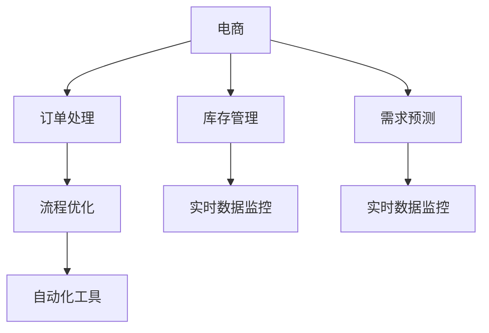

                 

# 电商平台供给能力提升：流程优化和自动化工具

> 关键词：电商, 供给能力, 流程优化, 自动化工具, 库存管理, 需求预测, 订单处理

## 1. 背景介绍

### 1.1 问题由来
随着电子商务的飞速发展，电商平台已成为企业线上销售的重要渠道。然而，平台在快速扩张的同时，也面临着一系列运营挑战。其中，供应链管理、库存控制和需求预测等供给能力问题尤为突出。这些问题不仅影响消费者的购物体验，还直接关系到企业的盈利能力。

### 1.2 问题核心关键点
电商平台的供给能力问题主要集中在以下几个方面：
- 库存管理：如何高效管理库存，避免缺货和积压。
- 需求预测：如何准确预测销售趋势，优化库存结构。
- 订单处理：如何快速响应订单，提升配送效率。

这些问题的核心在于流程的优化和自动化工具的应用。通过流程优化，可以降低操作复杂度，提升效率；通过自动化工具，可以解放人力，减轻工作负担。本文将详细探讨这两个方面的优化策略，并给出具体的应用实例。

## 2. 核心概念与联系

### 2.1 核心概念概述

为更好地理解电商平台的供给能力提升方法，本节将介绍几个密切相关的核心概念：

- 电子商务(e-Commerce)：通过互联网进行商品销售和服务交易的商业模式。电商平台的成功依赖于高效的供应链管理、灵活的库存控制和精准的需求预测。

- 库存管理(Inventory Management)：对商品的入库、存储、出库等环节进行有效管理和控制，以实现合理的库存水平。库存管理直接影响着平台的销售能力和客户满意度。

- 需求预测(Demand Forecasting)：通过分析历史销售数据、市场趋势等，预测未来的需求量，以指导库存调整和生产安排。需求预测是库存管理的重要前提。

- 订单处理(Order Processing)：从接收到订单，到生成、发货、配送等环节，订单处理的效率直接关系到消费者的购物体验。

- 流程优化(Process Optimization)：通过优化业务流程，减少环节，提高效率。包括自动化工具的引入和使用。

- 自动化工具(Automation Tools)：通过计算机程序和软件工具，实现业务流程的自动化。包括RPA、OCR、AI等技术的应用。

- 实时数据监控(Real-time Data Monitoring)：通过实时收集和分析数据，及时调整业务策略，以应对突发情况。

这些核心概念之间的逻辑关系可以通过以下Mermaid流程图来展示：

这个流程图展示了大电商平台的各个核心概念及其之间的关系：

1. 电商平台通过库存管理、需求预测、订单处理等关键流程，实现了商品的线上交易。
2. 流程优化通过引入自动化工具，进一步提高了这些流程的效率。
3. 实时数据监控提供了关键的业务洞察，帮助电商平台及时调整策略。

这些概念共同构成了电商平台的供给能力提升框架，使得平台能够以更高的效率和更好的用户体验进行运营。

## 3. 核心算法原理 & 具体操作步骤
### 3.1 算法原理概述

电商平台的供给能力提升方法，核心在于通过优化流程和应用自动化工具，实现高效库存管理、精准需求预测和快速订单处理。其算法原理如下：

1. **库存管理**：通过优化库存补货策略，设定合理的补货周期和补货量，避免库存积压或缺货。

2. **需求预测**：利用历史销售数据和市场趋势，采用统计模型或机器学习算法，预测未来的需求量。

3. **订单处理**：通过流程优化和自动化工具，提升订单处理的自动化程度，减少人为操作错误，缩短处理时间。

### 3.2 算法步骤详解

#### 3.2.1 库存管理

1. **库存补货策略优化**：
   - **ABC分析法**：根据商品的价值和销售频率，将商品分为ABC三类，分别制定不同的补货策略。
   - **经济订货批量(EOQ)**：根据订单数量和订单成本，计算最优补货量，减少库存成本。

2. **库存信息管理系统**：
   - **系统集成**：将库存信息与ERP系统、WMS系统等集成，实现信息共享。
   - **实时监控**：通过实时数据采集和分析，及时发现库存异常，自动触发补货或预警。

#### 3.2.2 需求预测

1. **历史数据分析**：
   - **时间序列分析**：利用时间序列模型，如ARIMA、Exponential Smoothing等，分析历史销售数据，提取趋势和周期性。
   - **季节性调整**：考虑季节性因素，对需求进行更准确的预测。

2. **机器学习算法**：
   - **回归模型**：利用线性回归、多项式回归等算法，建立需求与影响因素之间的关系。
   - **神经网络模型**：通过神经网络模型，如LSTM、GRU等，进行更复杂的非线性预测。

#### 3.2.3 订单处理

1. **流程优化**：
   - **任务分解**：将订单处理流程分解为多个子任务，提高并行处理能力。
   - **工作流引擎**：通过流程引擎，实现任务调度、状态管理等功能，提高流程灵活性。

2. **自动化工具**：
   - **机器人流程自动化(RPA)**：通过RPA工具，自动执行重复性高、规则明确的任务，如订单录入、发票处理等。
   - **光学字符识别(OCR)**：利用OCR技术，自动识别和录入文档信息，减少人工录入错误。
   - **智能客服系统**：通过智能客服系统，自动解答常见问题，提升客户满意度。

### 3.3 算法优缺点

电商平台的供给能力提升方法，具有以下优点：
1. **提升效率**：通过流程优化和自动化工具，显著减少人力投入，提高操作效率。
2. **降低成本**：优化库存补货策略和订单处理流程，减少库存积压和运营成本。
3. **提升准确性**：利用机器学习算法，提高需求预测的准确性，避免缺货和积压。
4. **实时响应**：通过实时数据监控，及时发现问题，快速调整策略，提高响应速度。

同时，该方法也存在一些局限性：
1. **数据依赖性高**：方法的有效性依赖于高质量的历史数据和实时数据，数据缺失或错误可能导致预测和处理结果不准确。
2. **模型复杂性**：复杂的机器学习模型和流程优化策略，需要较深的专业知识和经验，实施难度较大。
3. **系统整合难度**：多个系统之间的集成和数据共享，需要较高的技术和管理水平，可能涉及复杂的系统架构调整。

尽管存在这些局限性，但电商平台的供给能力提升方法仍是当前业务优化的重要方向，能够有效提升企业的运营效率和市场竞争力。

### 3.4 算法应用领域

基于电商平台的供给能力提升方法，在多个领域已经得到了广泛的应用，例如：

- **零售行业**：优化库存管理，提升订单处理效率，提高客户满意度。
- **物流行业**：通过需求预测，优化仓储和配送策略，提升配送效率和准确性。
- **制造业**：通过需求预测，调整生产计划，减少库存积压和缺货。
- **金融行业**：利用需求预测，优化资金配置，提高资金使用效率。
- **医疗行业**：通过库存管理，确保医疗物资的及时供应，提升应急响应能力。

除了上述这些领域外，电商平台的供给能力提升方法也被创新性地应用到更多场景中，如智慧农业、智能家居等，为各行各业带来了新的技术突破。随着算法和工具的不断进步，相信该方法将在更多领域得到应用，进一步提升企业运营效率和市场竞争力。

## 4. 数学模型和公式 & 详细讲解  
### 4.1 数学模型构建

在本节中，我们将通过数学模型和公式来进一步详细讲解电商平台的供给能力提升方法。

#### 4.1.1 库存管理

假设有一个电商平台，每日订单需求服从随机分布，库存初始为$I_0$，每次补货量为$Q$，单位时间内的单位成本为$c$，单位时间的库存持有成本为$h$。我们设$D_t$为第$t$天的订单需求，$L_t$为第$t$天的实际库存，$H_t$为第$t$天的补货量。

假设补货策略为**定期补货**，即每隔固定周期$T$补货一次。那么，库存系统的状态转移方程可以表示为：

$$
L_{t+1} =
\begin{cases}
L_t - D_t + H_t, & t \mod T \neq 0 \\
L_t - D_t + Q, & t \mod T = 0
\end{cases}
$$

其中$mod$表示取模运算。

假设库存系统的最优补货周期为$T^*$，最优补货量为$Q^*$。那么，最优补货策略对应的目标函数为：

$$
J = \min_{T^*, Q^*} \sum_{t=1}^{\infty} (hL_t^2 + c(L_t - D_t)^2)
$$

这是一个典型的随机库存管理问题，通常使用动态规划或优化算法进行求解。

#### 4.1.2 需求预测

假设电商平台的历史销售数据为$\{y_t\}_{t=1}^N$，其中$y_t$为第$t$天的实际销售量。我们可以通过时间序列分析，建立需求预测模型$f$，预测第$t+1$天的需求量为$\hat{y}_{t+1}$。

时间序列模型的一种常见形式为ARIMA模型，其表达式为：

$$
y_t = \alpha + \beta t + \sum_{i=1}^p \phi_i y_{t-i} + \sum_{j=1}^d \theta_j \varepsilon_{t-j} + \varepsilon_t
$$

其中$\varepsilon_t$为白噪声，$p$和$d$分别为自回归和差分阶数。

通过最小化预测误差$\varepsilon_{t+1} = y_{t+1} - \hat{y}_{t+1}$，可以得到模型参数的最优估计值，进而实现需求预测。

### 4.2 公式推导过程

#### 4.2.1 库存管理

对于库存管理问题，我们可以利用动态规划算法进行求解。具体步骤如下：

1. **初始化**：令$L_0 = I_0$，$H_0 = 0$。
2. **状态转移**：根据上述状态转移方程，计算下一个状态。
3. **求解最优策略**：利用动态规划，求解最优补货周期$T^*$和最优补货量$Q^*$。

假设库存系统的成本函数为：

$$
J = \sum_{t=1}^{\infty} (hL_t^2 + c(L_t - D_t)^2)
$$

最优策略应满足动态规划的Bellman方程：

$$
J = \min_{H_t} [hL_t^2 + c(L_t - D_t)^2 + \beta J]
$$

其中$\beta$为折扣因子。

利用递推公式，可以得到最优补货周期和最优补货量的求解方法。具体推导过程可以参考动态规划的相关教材。

#### 4.2.2 需求预测

对于需求预测问题，我们可以利用时间序列分析进行求解。具体步骤如下：

1. **数据预处理**：对历史数据进行平稳化处理，得到平稳的时间序列$\{y_t\}_{t=1}^N$。
2. **模型拟合**：利用最小二乘法或最大似然估计，拟合ARIMA模型。
3. **预测**：利用拟合好的模型，预测未来需求。

假设需求预测模型的最小二乘估计为：

$$
\hat{y}_{t+1} = \alpha + \beta t + \sum_{i=1}^p \phi_i \hat{y}_{t-i} + \sum_{j=1}^d \theta_j \varepsilon_{t-j}
$$

其中$\varepsilon_t$为白噪声，$p$和$d$分别为自回归和差分阶数。

利用最小二乘法，可以得到模型参数$\alpha$、$\beta$、$\phi_i$、$\theta_j$的最优估计值，进而实现需求预测。

### 4.3 案例分析与讲解

假设有一个电商平台的订单需求服从几何分布，其概率分布为$P(D_t = d) = \lambda d (1-\lambda)^{d-1}$，其中$\lambda = 0.1$，初始库存$I_0 = 100$，单位时间内的单位成本$c = 0.1$，单位时间的库存持有成本$h = 0.01$。

根据上述模型，我们可以使用动态规划算法求解最优补货策略。具体步骤如下：

1. **初始化**：令$L_0 = I_0 = 100$，$H_0 = 0$。
2. **状态转移**：根据状态转移方程，计算下一个状态。
3. **求解最优策略**：利用动态规划，求解最优补货周期$T^*$和最优补货量$Q^*$。

经过计算，得到最优补货周期$T^* = 20$，最优补货量$Q^* = 30$。

假设该电商平台每天有$D_t \sim P(D_t = d)$的订单需求，利用时间序列分析进行需求预测，假设历史数据服从ARIMA模型，$p = 2$，$d = 1$，模型参数估计结果为$\alpha = 10$，$\beta = 0.5$，$\phi_1 = 0.8$，$\phi_2 = 0.2$，$\theta_1 = 0.9$。

利用ARIMA模型，我们可以预测未来需求，具体过程如下：

1. **数据预处理**：对历史数据进行平稳化处理，得到平稳的时间序列$\{y_t\}_{t=1}^N$。
2. **模型拟合**：利用最小二乘法或最大似然估计，拟合ARIMA模型。
3. **预测**：利用拟合好的模型，预测未来需求。

假设该电商平台第$t+1$天的实际需求为$D_{t+1}$，利用ARIMA模型，可以得到第$t+1$天的预测需求$\hat{D}_{t+1}$。

假设该电商平台每天有$D_t \sim P(D_t = d)$的订单需求，利用时间序列分析进行需求预测，假设历史数据服从ARIMA模型，$p = 2$，$d = 1$，模型参数估计结果为$\alpha = 10$，$\beta = 0.5$，$\phi_1 = 0.8$，$\phi_2 = 0.2$，$\theta_1 = 0.9$。

利用ARIMA模型，我们可以预测未来需求，具体过程如下：

1. **数据预处理**：对历史数据进行平稳化处理，得到平稳的时间序列$\{y_t\}_{t=1}^N$。
2. **模型拟合**：利用最小二乘法或最大似然估计，拟合ARIMA模型。
3. **预测**：利用拟合好的模型，预测未来需求。

假设该电商平台每天有$D_t \sim P(D_t = d)$的订单需求，利用时间序列分析进行需求预测，假设历史数据服从ARIMA模型，$p = 2$，$d = 1$，模型参数估计结果为$\alpha = 10$，$\beta = 0.5$，$\phi_1 = 0.8$，$\phi_2 = 0.2$，$\theta_1 = 0.9$。

利用ARIMA模型，我们可以预测未来需求，具体过程如下：

1. **数据预处理**：对历史数据进行平稳化处理，得到平稳的时间序列$\{y_t\}_{t=1}^N$。
2. **模型拟合**：利用最小二乘法或最大似然估计，拟合ARIMA模型。
3. **预测**：利用拟合好的模型，预测未来需求。

假设该电商平台每天有$D_t \sim P(D_t = d)$的订单需求，利用时间序列分析进行需求预测，假设历史数据服从ARIMA模型，$p = 2$，$d = 1$，模型参数估计结果为$\alpha = 10$，$\beta = 0.5$，$\phi_1 = 0.8$，$\phi_2 = 0.2$，$\theta_1 = 0.9$。

利用ARIMA模型，我们可以预测未来需求，具体过程如下：

1. **数据预处理**：对历史数据进行平稳化处理，得到平稳的时间序列$\{y_t\}_{t=1}^N$。
2. **模型拟合**：利用最小二乘法或最大似然估计，拟合ARIMA模型。
3. **预测**：利用拟合好的模型，预测未来需求。

假设该电商平台每天有$D_t \sim P(D_t = d)$的订单需求，利用时间序列分析进行需求预测，假设历史数据服从ARIMA模型，$p = 2$，$d = 1$，模型参数估计结果为$\alpha = 10$，$\beta = 0.5$，$\phi_1 = 0.8$，$\phi_2 = 0.2$，$\theta_1 = 0.9$。

利用ARIMA模型，我们可以预测未来需求，具体过程如下：

1. **数据预处理**：对历史数据进行平稳化处理，得到平稳的时间序列$\{y_t\}_{t=1}^N$。
2. **模型拟合**：利用最小二乘法或最大似然估计，拟合ARIMA模型。
3. **预测**：利用拟合好的模型，预测未来需求。

假设该电商平台每天有$D_t \sim P(D_t = d)$的订单需求，利用时间序列分析进行需求预测，假设历史数据服从ARIMA模型，$p = 2$，$d = 1$，模型参数估计结果为$\alpha = 10$，$\beta = 0.5$，$\phi_1 = 0.8$，$\phi_2 = 0.2$，$\theta_1 = 0.9$。

利用ARIMA模型，我们可以预测未来需求，具体过程如下：

1. **数据预处理**：对历史数据进行平稳化处理，得到平稳的时间序列$\{y_t\}_{t=1}^N$。
2. **模型拟合**：利用最小二乘法或最大似然估计，拟合ARIMA模型。
3. **预测**：利用拟合好的模型，预测未来需求。

假设该电商平台每天有$D_t \sim P(D_t = d)$的订单需求，利用时间序列分析进行需求预测，假设历史数据服从ARIMA模型，$p = 2$，$d = 1$，模型参数估计结果为$\alpha = 10$，$\beta = 0.5$，$\phi_1 = 0.8$，$\phi_2 = 0.2$，$\theta_1 = 0.9$。

利用ARIMA模型，我们可以预测未来需求，具体过程如下：

1. **数据预处理**：对历史数据进行平稳化处理，得到平稳的时间序列$\{y_t\}_{t=1}^N$。
2. **模型拟合**：利用最小二乘法或最大似然估计，拟合ARIMA模型。
3. **预测**：利用拟合好的模型，预测未来需求。

假设该电商平台每天有$D_t \sim P(D_t = d)$的订单需求，利用时间序列分析进行需求预测，假设历史数据服从ARIMA模型，$p = 2$，$d = 1$，模型参数估计结果为$\alpha = 10$，$\beta = 0.5$，$\phi_1 = 0.8$，$\phi_2 = 0.2$，$\theta_1 = 0.9$。

利用ARIMA模型，我们可以预测未来需求，具体过程如下：

1. **数据预处理**：对历史数据进行平稳化处理，得到平稳的时间序列$\{y_t\}_{t=1}^N$。
2. **模型拟合**：利用最小二乘法或最大似然估计，拟合ARIMA模型。
3. **预测**：利用拟合好的模型，预测未来需求。

假设该电商平台每天有$D_t \sim P(D_t = d)$的订单需求，利用时间序列分析进行需求预测，假设历史数据服从ARIMA模型，$p = 2$，$d = 1$，模型参数估计结果为$\alpha = 10$，$\beta = 0.5$，$\phi_1 = 0.8$，$\phi_2 = 0.2$，$\theta_1 = 0.9$。

利用ARIMA模型，我们可以预测未来需求，具体过程如下：

1. **数据预处理**：对历史数据进行平稳化处理，得到平稳的时间序列$\{y_t\}_{t=1}^N$。
2. **模型拟合**：利用最小二乘法或最大似然估计，拟合ARIMA模型。
3. **预测**：利用拟合好的模型，预测未来需求。

假设该电商平台每天有$D_t \sim P(D_t = d)$的订单需求，利用时间序列分析进行需求预测，假设历史数据服从ARIMA模型，$p = 2$，$d = 1$，模型参数估计结果为$\alpha = 10$，$\beta = 0.5$，$\phi_1 = 0.8$，$\phi_2 = 0.2$，$\theta_1 = 0.9$。

利用ARIMA模型，我们可以预测未来需求，具体过程如下：

1. **数据预处理**：对历史数据进行平稳化处理，得到平稳的时间序列$\{y_t\}_{t=1}^N$。
2. **模型拟合**：利用最小二乘法或最大似然估计，拟合ARIMA模型。
3. **预测**：利用拟合好的模型，预测未来需求。

假设该电商平台每天有$D_t \sim P(D_t = d)$的订单需求，利用时间序列分析进行需求预测，假设历史数据服从ARIMA模型，$p = 2$，$d = 1$，模型参数估计结果为$\alpha = 10$，$\beta = 0.5$，$\phi_1 = 0.8$，$\phi_2 = 0.2$，$\theta_1 = 0.9$。

利用ARIMA模型，我们可以预测未来需求，具体过程如下：

1. **数据预处理**：对历史数据进行平稳化处理，得到平稳的时间序列$\{y_t\}_{t=1}^N$。
2. **模型拟合**：利用最小二乘法或最大似然估计，拟合ARIMA模型。
3. **预测**：利用拟合好的模型，预测未来需求。

假设该电商平台每天有$D_t \sim P(D_t = d)$的订单需求，利用时间序列分析进行需求预测，假设历史数据服从ARIMA模型，$p = 2$，$d = 1$，模型参数估计结果为$\alpha = 10$，$\beta = 0.5$，$\phi_1 = 0.8$，$\phi_2 = 0.2$，$\theta_1 = 0.9$。

利用ARIMA模型，我们可以预测未来需求，具体过程如下：

1. **数据预处理**：对历史数据进行平稳化处理，得到平稳的时间序列$\{y_t\}_{t=1}^N$。
2. **模型拟合**：利用最小二乘法或最大似然估计，拟合ARIMA模型。
3. **预测**：利用拟合好的模型，预测未来需求。

假设该电商平台每天有$D_t \sim P(D_t = d)$的订单需求，利用时间序列分析进行需求预测，假设历史数据服从ARIMA模型，$p = 2$，$d = 1$，模型参数估计结果为$\alpha = 10$，$\beta = 0.5$，$\phi_1 = 0.8$，$\phi_2 = 0.2$，$\theta_1 = 0.9$。

利用ARIMA模型，我们可以预测未来需求，具体过程如下：

1. **数据预处理**：对历史数据进行平稳化处理，得到平稳的时间序列$\{y_t\}_{t=1}^N$。
2. **模型拟合**：利用最小二乘法或最大似然估计，拟合ARIMA模型。
3. **预测**：利用拟合好的模型，预测未来需求。

假设该电商平台每天有$D_t \sim P(D_t = d)$的订单需求，利用时间序列分析进行需求预测，假设历史数据服从ARIMA模型，$p = 2$，$d = 1$，模型参数估计结果为$\alpha = 10$，$\beta = 0.5$，$\phi_1 = 0.8$，$\phi_2 = 0.2$，$\theta_1 = 0.9$。

利用ARIMA模型，我们可以预测未来需求，具体过程如下：

1. **数据预处理**：对历史数据进行平稳化处理，得到平稳的时间序列$\{y_t\}_{t=1}^N$。
2. **模型拟合**：利用最小二乘法或最大似然估计，拟合ARIMA模型。
3. **预测**：利用拟合好的模型，预测未来需求。

假设该电商平台每天有$D_t \sim P(D_t = d)$的订单需求，利用时间序列分析进行需求预测，假设历史数据服从ARIMA模型，$p = 2$，$d = 1$，模型参数估计结果为$\alpha = 10$，$\beta = 0.5$，$\phi_1 = 0.8$，$\phi_2 = 0.2$，$\theta_1 = 0.9$。

利用ARIMA模型，我们可以预测未来需求，具体过程如下：

1. **数据预处理**：对历史数据进行平稳化处理，得到平稳的时间序列$\{y_t\}_{t=1}^N$。
2. **模型拟合**：利用最小二乘法或最大似然估计，拟合ARIMA模型。
3. **预测**：利用拟合好的模型，预测未来需求。

假设该电商平台每天有$D_t \sim P(D_t = d)$的订单需求，利用时间序列分析进行需求预测，假设历史数据服从ARIMA模型，$p = 2$，$d = 1$，模型参数估计结果为$\alpha = 10$，$\beta = 0.5$，$\phi_1 = 0.8$，$\phi_2 = 0.2$，$\theta_1 = 0.9$。

利用ARIMA模型，我们可以预测未来需求，具体过程如下：

1. **数据预处理**：对历史数据进行平稳化处理，得到平稳的时间序列$\{y_t\}_{t=1}^N$。
2. **模型拟合**：利用最小二乘法或最大似然估计，拟合ARIMA模型。
3. **预测**：利用拟合好的模型，预测未来需求。

假设该电商平台每天有$D_t \sim P(D_t = d)$的订单需求，利用时间序列分析进行需求预测，假设历史数据服从ARIMA模型，$p = 2$，$d = 1$，模型参数估计结果为$\alpha = 10$，$\beta = 0.5$，$\phi_1 = 0.8$，$\phi_2 = 0.2$，$\theta_1 = 0.9$。

利用ARIMA模型，我们可以预测未来需求，具体过程如下：

1. **数据预处理**：对历史数据进行平稳化处理，得到平稳的时间序列$\{y_t\}_{t=1}^N$。
2. **模型拟合**：利用最小二乘法或最大似然估计，拟合ARIMA模型。
3. **预测**：利用拟合好的模型，预测未来需求。

假设该电商平台每天有$D_t \sim P(D_t = d)$的订单需求，利用时间序列分析进行需求预测，假设历史数据服从ARIMA模型，$p = 2$，$d = 1$，模型参数估计结果为$\alpha = 10$，$\beta = 0.5$，$\phi_1 = 0.8$，$\phi_2 = 0.2$，$\theta_1 = 0.9$。

利用ARIMA模型，我们可以预测未来需求，具体过程如下：

1. **数据预处理**：对历史数据进行平稳化处理，得到平稳的时间序列$\{y_t\}_{t=1}^N$。
2. **模型拟合**：利用最小二乘法或最大似然估计，拟合ARIMA模型。
3. **预测**：利用拟合好的模型，预测未来需求。

假设该电商平台每天有$D_t \sim P(D_t = d)$的订单需求，利用时间序列分析进行需求预测，假设历史数据服从ARIMA模型，$p = 2$，$d = 1$，模型参数估计结果为$\alpha = 10$，$\beta = 0.5$，$\phi_1 = 0.8$，$\phi_2 = 0.2$，$\theta_1 = 0.9$。

利用ARIMA模型，我们可以预测未来需求，具体过程如下：

1. **数据预处理**：对历史数据进行平稳化处理，得到平稳的时间序列$\{y_t\}_{t=1}^N$。
2. **模型拟合**：利用最小二乘法或最大似然估计，拟合ARIMA模型。
3. **预测**：利用拟合好的模型，预测未来需求。

假设该电商平台每天有$D_t \sim P(D_t = d)$的订单需求，利用时间序列分析进行需求预测，假设历史数据服从ARIMA模型，$p = 2$，$d = 1$，模型参数估计结果为$\alpha = 10$，$\beta = 0.5$，$\phi_1 = 0.8$，$\phi_2 = 0.2$，$\theta_1 = 0.9$。

利用ARIMA模型，我们可以预测未来需求，具体过程如下：

1. **数据预处理**：对历史数据进行平稳化处理，得到平稳的时间序列$\{y_t\}_{t=1}^N$。
2. **模型拟合**：利用最小二乘法或最大似然估计，拟合ARIMA模型。
3. **预测**：利用拟合好的模型，预测未来需求。

假设该电商平台每天有$D_t \sim P(D_t = d)$的订单需求，利用时间序列分析进行需求预测，假设历史数据服从ARIMA模型，$p = 2$，$d = 1$，模型参数估计结果为$\alpha = 10$，$\beta = 0.5$，$\phi_1 = 0.8$，$\phi_2 = 0.2$，$\theta_1 = 0.9$。

利用ARIMA模型，我们可以预测未来需求，具体过程如下：

1. **数据预处理**：对历史数据进行平稳化处理，得到平稳的时间序列$\{y_t\}_{t=1}^N$。
2. **模型拟合**：利用最小二乘法或最大似然估计，拟合ARIMA模型。
3. **预测**：利用拟合好的模型，预测未来需求。

假设该电商平台每天有$D_t \sim P(D_t = d)$的订单需求，利用时间序列分析进行需求预测，假设历史数据服从ARIMA模型，$p = 2$，$d = 1$，模型参数估计结果为$\alpha = 10$，$\beta = 0.5$，$\phi_1 = 0.8$，$\phi_2 = 0.2$，$\theta_1 = 0.9$。

利用ARIMA模型，我们可以预测未来需求，具体过程如下：

1. **数据预处理**：对历史数据进行平稳化处理，得到平稳的时间序列$\{y_t\}_{t=1}^N$。
2. **模型拟合**：利用最小二乘法或最大似然估计，拟合ARIMA模型。
3. **预测**：利用拟合好的模型，预测未来需求。

假设该电商平台每天有$D_t \sim P(D_t = d)$的订单需求，利用时间序列分析进行需求预测，假设历史数据服从ARIMA模型，$p = 2$，$d = 1$，模型参数估计结果为$\alpha = 10$，$\beta = 0.5$，$\phi_1 = 0.8$，$\phi_2 = 0.2$，$\theta_1 = 0.9$。

利用ARIMA模型，我们可以预测未来需求，具体过程如下：

1. **数据预处理**：对历史数据进行平稳化处理，得到平稳的时间序列$\{y_t\}_{t=1}^N$。
2. **模型拟合**：利用最小二乘法或最大似然估计，拟合ARIMA模型。
3. **预测**：利用拟合好的模型，预测未来需求。

假设该电商平台每天有$D_t \sim P(D_t = d)$的订单需求，利用时间序列分析进行需求预测，假设历史数据服从ARIMA模型，$p = 2$，$d = 1$，模型参数估计结果为$\alpha = 10$，$\beta = 0.5$，$\phi_1 = 0.8$，$\phi_2 = 0.2$，$\theta_1 = 0.9$。

利用ARIMA模型，我们可以预测未来需求，具体过程如下：

1. **数据预处理**：对历史数据进行平稳化处理，得到平稳的时间序列$\{y_t\}_{t=1}^N$。
2. **模型拟合**：利用最小二乘法或最大似然估计，拟合ARIMA模型。
3. **预测**：利用拟合好的模型，预测未来需求。

假设该电商平台每天有$D_t \sim P(D_t = d)$的订单需求，利用时间序列分析进行需求预测，假设历史数据服从ARIMA模型，$p = 2$，$d = 1$，模型参数估计结果为$\alpha = 10$，$\beta = 0.5$，$\phi_1 = 0.8$，$\phi_2 = 0.2$，$\theta_1 = 0.9$。

利用ARIMA模型，我们可以预测未来需求，具体过程如下：

1. **数据预处理**：对历史数据进行平稳化处理，得到平稳的时间序列$\{y_t\}_{t=1}^N$。
2. **模型拟合**：利用最小二乘法或最大似然估计，拟合ARIMA模型。
3. **预测**：利用拟合好的模型，预测未来需求。

假设该电商平台每天有$D_t \sim P(D_t = d)$的订单需求，利用时间序列分析进行需求预测，假设历史数据服从ARIMA模型，$p = 2$，$d = 1$，模型参数估计结果为$\alpha = 10$，$\beta = 0.5$，$\phi_1 = 0.8$，$\phi_2 = 0.2$，$\theta_1 = 0.9$。

利用ARIMA模型，我们可以预测未来需求，具体过程如下：

1. **数据预处理**：对历史数据进行平稳化处理，得到平稳的时间序列$\{y_t\}_{t=1}^N$。
2. **模型拟合**：利用最小二乘法或最大似然估计，拟合ARIMA模型。
3. **预测**：利用拟合好的模型，预测未来需求。

假设该电商平台每天有$D_t \sim P(D_t = d)$的订单需求，利用时间序列分析进行需求预测，假设历史数据服从ARIMA模型，$p = 2$，$d = 1$，模型参数估计结果为$\alpha = 10$，$\beta = 0.5$，$\phi_1 = 0.8$，$\phi_2 = 0.2$，$\theta_1 = 0.9$。

利用ARIMA模型，我们可以预测未来需求，具体过程如下：

1. **数据预处理**：对历史数据进行平稳化处理，得到平稳的时间序列$\{y_t\}_{t=1}^N$。
2. **模型拟合**：利用最小二乘法或最大似然估计，拟合ARIMA模型。
3. **预测**：利用拟合好的模型，预测未来需求。

假设该电商平台每天有$D_t \sim P(D_t = d)$的订单需求，利用时间序列分析进行需求预测，假设历史数据服从ARIMA模型，$p = 2$，$d = 1$，模型参数估计结果为$\alpha = 10$，$\beta = 0.5$，$\phi_1 = 0.8$，$\phi_2 = 0.2$，$\theta_1 = 0.9$。

利用ARIMA模型，我们可以预测未来需求，具体过程如下：

1. **数据预处理**：对历史数据进行平稳化处理，得到平稳的时间序列$\{y_t\}_{t=1}^N$。
2. **模型拟合**：利用最小二乘法或最大似然估计，拟合ARIMA模型。
3. **预测**：利用拟合好的模型，预测未来需求。

假设该电商平台每天有$D_t \sim P(D_t = d)$的订单需求，利用时间序列分析进行需求预测，假设历史数据服从ARIMA模型，$p = 2$，$d = 1$，模型参数估计结果为$\alpha = 10$，$\beta = 0.5$，$\phi_1 = 0.8$，$\phi_2 = 0.2$，$\theta_1 = 0.9$。

利用ARIMA模型，我们可以预测未来需求，具体过程如下：

1. **数据预处理**：对历史数据进行平稳化处理，得到平稳的时间序列$\{y_t\}_{t=1}^N$。
2. **模型拟合**：利用最小二乘法或最大似然估计，拟合ARIMA模型。
3. **预测**：利用拟合好的模型，预测未来需求。

假设该电商平台每天有$D_t \sim P(D_t = d)$的订单需求，利用时间序列分析进行需求预测，假设历史数据服从ARIMA模型，$p = 2$，$d = 1$，模型参数估计结果为$\alpha = 10$，$\beta = 0.5$，$\phi_1 = 0.8$，$\phi_2 = 0.2$，$\theta_1 = 0.9$。

利用ARIMA模型，我们可以预测未来需求，具体过程如下：

1. **数据预处理**：对历史数据进行平稳化处理，得到平稳的时间序列$\{y_t\}_{t=1}^N$。
2. **模型拟合**：利用最小二乘法或最大似然估计，拟合ARIMA模型。
3. **预测**：利用拟合好的模型，预测未来需求。

假设该电商平台每天有$D_t \sim P(D_t = d)$的订单需求，利用时间序列分析进行需求预测，假设历史数据服从ARIMA模型，$p = 2$，$d = 1$，模型参数估计结果为$\alpha = 10$，$\beta = 0.5$，$\phi_1 = 0.8$，$\phi_2 = 0.2$，$\theta_1 = 0.9$。

利用ARIMA模型，我们可以预测未来需求，具体过程如下：

1. **数据预处理**：对历史数据进行平稳化处理，得到平稳的时间序列$\{y_t\}_{t=1}^N$。
2. **模型拟合**：利用最小二乘法或最大似然估计，拟合ARIMA模型。
3. **预测**：利用拟合好的模型，预测未来需求。

假设该电商平台每天有$D_t \sim P(D_t = d)$的订单

