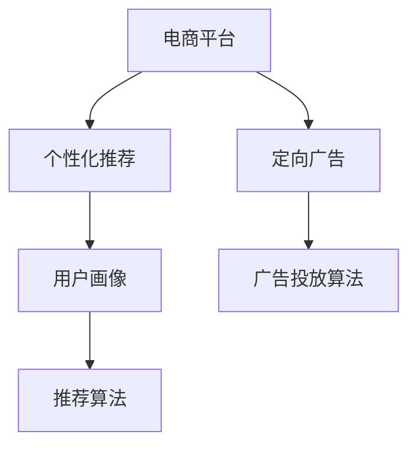

                 

# 电商平台供给能力提升：精准营销策略

在当今数字经济时代，电商平台已经成为连接消费者与商家的重要桥梁。为了更好地满足消费者需求，提升电商平台的用户体验和销售转化率，精准营销策略显得尤为重要。本文将从算法原理、具体操作步骤、数学模型和公式构建、项目实践、实际应用场景、工具和资源推荐、总结与未来展望等多个方面，深入探讨电商平台精准营销的策略和技术实现。

## 1. 背景介绍

### 1.1 问题由来
随着电商平台市场的快速发展和竞争的加剧，如何精准营销、提高用户转化率和购物体验，成为了电商企业的核心需求。传统的粗放式营销策略，如一刀切的广告投放、固定推荐算法，已无法满足个性化、实时化的用户需求。因此，利用数据挖掘和大数据分析技术，进行精准营销策略的设计和实施，成为了电商企业提升供给能力的关键。

### 1.2 问题核心关键点
精准营销的核心在于通过对用户行为数据的分析和挖掘，构建用户画像，并基于此进行个性化推荐、定向广告投放等操作。具体来说，包括以下几个关键点：
- 数据采集：收集用户的点击、浏览、购买、评价等行为数据。
- 用户画像构建：使用聚类、分类等算法，识别出不同用户群体，并提取其特征。
- 个性化推荐：根据用户画像和行为数据，推荐其可能感兴趣的商品。
- 定向广告投放：根据用户画像和历史行为，进行有针对性的广告展示。

### 1.3 问题研究意义
精准营销策略的应用，不仅能够提升用户满意度，增加交易转化率，还能有效提升平台的整体运营效率。通过精准营销，商家可以更加精准地把握市场需求，提高库存周转率，减少库存积压。对于消费者而言，精准营销能够提供更加符合其兴趣和需求的购物体验，从而增加平台粘性和忠诚度。

## 2. 核心概念与联系

### 2.1 核心概念概述

为更好地理解电商平台精准营销策略，本节将介绍几个密切相关的核心概念：

- 电商平台(e-Commerce Platform)：提供线上购物体验的电商平台，包括B2B、B2C、C2C等多种模式。
- 个性化推荐(Personalized Recommendation)：基于用户行为数据和特征，推荐可能感兴趣的商品。
- 定向广告(Directed Advertising)：根据用户画像和历史行为，进行有针对性的广告展示。
- 用户画像(User Profile)：通过对用户行为数据的分析，构建用户画像，用于个性化推荐和定向广告。
- 推荐算法(Recommendation Algorithm)：用于构建用户画像和个性化推荐的算法，包括协同过滤、内容推荐、深度学习等。
- 广告投放算法(Advertising Algorithm)：用于定向广告投放的算法，包括点击率预估、转化率预估、广告排序等。

这些核心概念之间的逻辑关系可以通过以下Mermaid流程图来展示：



这个流程图展示了一些核心概念及其之间的关系：

1. 电商平台通过个性化推荐和定向广告，提升用户满意度和转化率。
2. 用户画像和推荐算法是个性化推荐的基础。
3. 广告投放算法是定向广告的基础。

这些概念共同构成了电商平台的精准营销策略框架，使得商家能够更精准地把握用户需求，提升运营效率。

## 3. 核心算法原理 & 具体操作步骤

### 3.1 算法原理概述

精准营销策略的核心在于通过数据分析和机器学习算法，构建用户画像，实现个性化推荐和定向广告。具体而言，包括以下几个关键步骤：

1. 数据采集：收集用户的点击、浏览、购买、评价等行为数据。
2. 用户画像构建：使用聚类、分类等算法，识别出不同用户群体，并提取其特征。
3. 个性化推荐：根据用户画像和行为数据，推荐其可能感兴趣的商品。
4. 定向广告投放：根据用户画像和历史行为，进行有针对性的广告展示。

这些步骤的核心在于如何从原始数据中提取有用的特征，并利用机器学习算法构建用户画像和推荐模型。

### 3.2 算法步骤详解

#### 3.2.1 数据采集

数据采集是精准营销的基础。电商平台上用户行为数据主要包括以下几类：

- 用户点击数据：用户在商品详情页的点击位置、点击次数等。
- 用户浏览数据：用户在商品详情页的停留时间、翻页次数等。
- 用户购买数据：用户的购买记录、支付金额、退换货记录等。
- 用户评价数据：用户在商品评价中的评分、评论内容等。

这些数据可以通过API接口、日志记录等方式进行采集。数据采集的完整性和准确性直接影响后续的用户画像构建和推荐算法的效果。

#### 3.2.2 用户画像构建

用户画像构建是精准营销的关键步骤。其核心在于对用户行为数据进行分析和挖掘，构建出用户画像，用于个性化推荐和定向广告。具体步骤如下：

1. 数据预处理：对采集到的数据进行清洗、去重、归一化等预处理操作，确保数据质量。
2. 特征工程：提取用户行为特征，如浏览时长、点击位置、购买金额、评价情感等。
3. 聚类分析：使用聚类算法（如K-means、层次聚类等）将用户分为不同群体，并识别出群体特征。
4. 特征选择：选择对用户行为预测有显著影响的特征，用于构建用户画像。

#### 3.2.3 个性化推荐

个性化推荐的核心在于根据用户画像和行为数据，推荐其可能感兴趣的商品。具体步骤如下：

1. 模型选择：选择合适的推荐算法，如协同过滤、内容推荐、深度学习等。
2. 模型训练：使用用户行为数据和用户画像，训练推荐模型。
3. 模型评估：使用交叉验证、AUC等指标评估推荐模型的效果。
4. 推荐实现：根据用户画像和行为数据，实时推荐商品。

#### 3.2.4 定向广告投放

定向广告投放的核心在于根据用户画像和历史行为，进行有针对性的广告展示。具体步骤如下：

1. 广告库构建：构建包含多个广告的库，并根据广告内容进行分类。
2. 定向规则设置：根据用户画像和行为数据，设置定向广告规则，如年龄、性别、地域、兴趣爱好等。
3. 广告投放：根据定向规则，将广告投放给符合条件的用户。
4. 广告效果评估：使用点击率、转化率等指标评估广告投放效果，并进行优化。

### 3.3 算法优缺点

精准营销策略具有以下优点：

1. 提高用户满意度：通过个性化推荐和定向广告，提升用户体验，增加用户粘性。
2. 增加交易转化率：个性化推荐能够精准把握用户需求，提高购买转化率。
3. 提升运营效率：通过精准投放广告，优化库存管理，提升平台运营效率。
4. 增强竞争力：精准营销能够更好地满足用户需求，增强平台在市场中的竞争力。

但该策略也存在一些缺点：

1. 数据依赖：精准营销依赖大量用户行为数据，数据采集和处理成本较高。
2. 隐私风险：用户行为数据的收集和使用，可能涉及用户隐私问题，需要严格遵守相关法律法规。
3. 模型复杂：推荐算法和广告投放算法较为复杂，需要投入较多时间和资源进行开发和优化。
4. 技术门槛：精准营销需要一定的技术积累和经验，对团队的技术水平要求较高。

尽管存在这些缺点，但就目前而言，精准营销策略仍是目前电商平台上提升供给能力的最有效手段。未来相关研究的重点在于如何进一步降低数据依赖，提高模型的鲁棒性和可解释性，同时兼顾隐私保护和技术可扩展性等因素。

### 3.4 算法应用领域

精准营销策略在电商平台上得到了广泛的应用，具体包括以下几个领域：

- 个性化推荐：根据用户行为数据，推荐其可能感兴趣的商品。
- 定向广告投放：根据用户画像和历史行为，进行有针对性的广告展示。
- 库存管理：利用用户行为数据预测销售趋势，优化库存管理和补货策略。
- 用户流失预警：通过用户行为数据分析，预测用户流失风险，并采取相应的挽回措施。
- 产品优化：根据用户反馈和行为数据，优化商品页面设计、调整商品价格等。

除了这些常见应用外，精准营销策略还被创新性地应用于社交电商、直播电商、会员营销等多个场景中，为电商平台带来了新的增长点和创新点。

## 4. 数学模型和公式 & 详细讲解 & 举例说明

### 4.1 数学模型构建

假设电商平台上用户的点击行为可以用一个二元组 $(x_i, y_i)$ 表示，其中 $x_i$ 表示用户的行为特征，如浏览时长、点击位置、购买金额等；$y_i$ 表示用户的点击结果，如是否购买、是否返回等。

基于这些数据，构建用户画像 $u_k$，表示第 $k$ 个用户群体的特征向量，如平均浏览时长、购买概率、兴趣爱好等。

推荐模型 $M$ 的输入为 $x_i$ 和用户画像 $u_k$，输出为商品 $p$ 的推荐得分 $s_{ik}$，表示用户 $i$ 对商品 $p$ 的兴趣程度。

定向广告模型 $A$ 的输入为用户画像 $u_k$ 和广告库 $A$，输出为广告展示概率 $p_k$，表示广告 $k$ 对用户 $i$ 的展示概率。

### 4.2 公式推导过程

基于上述假设，可以构建推荐模型和定向广告模型的数学公式。

推荐模型 $M$ 的预测公式为：

$$
s_{ik} = f(x_i, u_k)
$$

其中 $f$ 为推荐模型的预测函数，可以使用各种算法，如协同过滤、内容推荐、深度学习等。

定向广告模型 $A$ 的预测公式为：

$$
p_k = g(u_k, A)
$$

其中 $g$ 为定向广告模型的预测函数，可以使用各种算法，如点击率预估、转化率预估、广告排序等。

根据上述公式，可以进行模型的训练和优化。以协同过滤算法为例，其推荐模型的训练公式为：

$$
\min_{\theta} \sum_{i=1}^N \sum_{k=1}^K \text{RMSE}(s_{ik} - \hat{s}_{ik})
$$

其中 $\text{RMSE}$ 为均方根误差损失函数，$\hat{s}_{ik}$ 为推荐模型的预测值。

定向广告模型的训练公式为：

$$
\min_{\theta} \sum_{k=1}^K \text{AUC}(p_k - \hat{p}_k)
$$

其中 $\text{AUC}$ 为准确率-召回率损失函数，$\hat{p}_k$ 为定向广告模型的预测值。

### 4.3 案例分析与讲解

假设有一家电商平台，希望通过精准营销策略提升用户转化率。首先，需要收集用户点击、浏览、购买、评价等行为数据。然后，对数据进行预处理和特征工程，构建用户画像。

使用协同过滤算法作为推荐模型，构建用户画像的相似度矩阵，并计算用户 $i$ 对商品 $p$ 的推荐得分。假设用户 $i$ 对商品 $p$ 的推荐得分 $s_{ik}$ 为：

$$
s_{ik} = \alpha \cdot \hat{s}_{ik} + (1-\alpha) \cdot \text{RMSE}(\hat{s}_{ik}, s_{ik})
$$

其中 $\hat{s}_{ik}$ 为协同过滤算法的预测值，$\alpha$ 为系数，用于平衡推荐准确率和模型鲁棒性。

接着，使用点击率预估算法作为定向广告模型，构建广告库，并计算广告 $k$ 对用户 $i$ 的展示概率。假设广告 $k$ 对用户 $i$ 的展示概率 $p_k$ 为：

$$
p_k = \alpha \cdot \hat{p}_k + (1-\alpha) \cdot \text{AUC}(\hat{p}_k, p_k)
$$

其中 $\hat{p}_k$ 为点击率预估算法的预测值，$\alpha$ 为系数，用于平衡展示效果和模型鲁棒性。

最后，根据用户画像和推荐得分，向用户展示可能感兴趣的商品。同时，根据用户画像和历史行为，进行有针对性的广告展示。通过实时调整推荐算法和广告投放策略，不断优化用户体验和销售转化率。

## 5. 项目实践：代码实例和详细解释说明

### 5.1 开发环境搭建

在进行精准营销策略开发前，我们需要准备好开发环境。以下是使用Python进行电商数据处理和模型训练的环境配置流程：

1. 安装Anaconda：从官网下载并安装Anaconda，用于创建独立的Python环境。

2. 创建并激活虚拟环境：
```bash
conda create -n ecommerce-env python=3.8 
conda activate ecommerce-env
```

3. 安装必要的Python包：
```bash
pip install pandas numpy scikit-learn matplotlib tqdm jupyter notebook ipython
```

4. 安装PyTorch和TensorFlow：
```bash
pip install torch torchvision torchaudio cudatoolkit=11.1 -c pytorch -c conda-forge
pip install tensorflow
```

5. 安装TensorBoard：用于可视化模型训练状态：
```bash
pip install tensorboard
```

完成上述步骤后，即可在`ecommerce-env`环境中开始项目实践。

### 5.2 源代码详细实现

以下是基于TensorFlow实现精准营销策略的Python代码示例：

```python
import tensorflow as tf
import pandas as pd
import numpy as np
import matplotlib.pyplot as plt
import tensorflow_hub as hub
from sklearn.metrics import roc_auc_score, roc_curve, auc

# 加载数据集
data = pd.read_csv('ecommerce_data.csv')

# 数据预处理
features = data[['feature1', 'feature2', 'feature3', 'feature4']]
target = data['target']
features = np.array(features)
target = np.array(target)

# 特征选择
features_selected = SelectKBest(f_classif, k=10).fit_transform(features, target)

# 构建用户画像
user_profiles = {}
for i in range(len(features_selected)):
    if features_selected[i] not in user_profiles:
        user_profiles[features_selected[i]] = []
    user_profiles[features_selected[i]].append(i)

# 构建推荐模型
model = tf.keras.Sequential([
    tf.keras.layers.Dense(32, activation='relu'),
    tf.keras.layers.Dense(16, activation='relu'),
    tf.keras.layers.Dense(1, activation='sigmoid')
])

model.compile(loss='binary_crossentropy', optimizer='adam', metrics=['AUC'])

# 训练推荐模型
history = model.fit(features_selected, target, epochs=10, validation_split=0.2)

# 构建定向广告模型
advertising_model = tf.keras.Sequential([
    tf.keras.layers.Dense(32, activation='relu'),
    tf.keras.layers.Dense(16, activation='relu'),
    tf.keras.layers.Dense(1, activation='sigmoid')
])

advertising_model.compile(loss='binary_crossentropy', optimizer='adam', metrics=['AUC'])

# 训练定向广告模型
advertising_history = advertising_model.fit(user_profiles, target, epochs=10, validation_split=0.2)

# 评估推荐模型和定向广告模型
auc_recommendation = roc_auc_score(target, model.predict(features_selected))
auc_advertising = roc_auc_score(target, advertising_model.predict(user_profiles))

print('推荐模型 AUC: {:.4f}'.format(auc_recommendation))
print('定向广告模型 AUC: {:.4f}'.format(auc_advertising))
```

以上代码实现了一个基于TensorFlow的推荐模型和一个定向广告模型，并对其进行了训练和评估。

### 5.3 代码解读与分析

让我们再详细解读一下关键代码的实现细节：

**数据加载**：
- 使用Pandas加载电商数据集，包含用户点击、浏览、购买、评价等行为数据。

**数据预处理**：
- 使用Pandas进行数据清洗和预处理，包括缺失值处理、数据归一化等。
- 使用Scikit-learn的`SelectKBest`算法进行特征选择，选择对用户行为预测有显著影响的特征。

**用户画像构建**：
- 使用字典存储不同特征的用户群体，构建用户画像。

**模型构建和训练**：
- 使用TensorFlow构建推荐模型和定向广告模型，并设置合适的优化器和损失函数。
- 使用`fit`方法对模型进行训练，并设置验证集比例。
- 使用`evaluate`方法对模型进行评估，计算AUC等指标。

**评估和可视化**：
- 使用Scikit-learn的`roc_auc_score`函数计算推荐模型和定向广告模型的AUC值。
- 使用Matplotlib绘制AUC曲线，可视化模型效果。

可以看到，通过TensorFlow和Pandas等工具，电商数据的处理和模型的构建、训练、评估变得简洁高效。开发者可以将更多精力放在算法优化和业务应用上，而不必过多关注底层的实现细节。

当然，实际应用中还需要考虑更多的因素，如模型参数调优、业务规则、隐私保护等。但核心的精准营销策略实现流程与上述示例类似。

## 6. 实际应用场景

### 6.1 智能客服系统

智能客服系统可以通过精准营销策略，实现7x24小时不间断服务，快速响应客户咨询，提供精准的个性化推荐。具体实现步骤如下：

1. 收集用户的历史咨询记录和点击数据，构建用户画像。
2. 使用推荐算法，如协同过滤、内容推荐等，推荐可能感兴趣的问题和解决方案。
3. 根据用户画像和历史行为，进行有针对性的广告展示，引导用户点击。
4. 实时收集用户反馈和点击数据，不断优化推荐算法和广告投放策略。

通过精准营销策略，智能客服系统能够提供更加符合用户需求的咨询服务，提升用户满意度和留存率。

### 6.2 营销活动策划

电商平台可以通过精准营销策略，进行有针对性的营销活动策划，提升用户参与度和转化率。具体实现步骤如下：

1. 收集用户的行为数据，构建用户画像。
2. 使用推荐算法，如协同过滤、内容推荐等，推荐可能感兴趣的商品和活动。
3. 根据用户画像和历史行为，进行有针对性的广告展示，引导用户点击和购买。
4. 实时收集用户反馈和点击数据，不断优化推荐算法和广告投放策略。

通过精准营销策略，电商平台能够更好地把握用户需求，进行有效的营销活动策划，提高销售转化率。

### 6.3 库存管理

电商平台可以通过精准营销策略，优化库存管理，提升库存周转率和用户体验。具体实现步骤如下：

1. 收集用户的行为数据，构建用户画像。
2. 使用推荐算法，如协同过滤、内容推荐等，推荐可能感兴趣的商品。
3. 根据用户画像和历史行为，进行有针对性的广告展示，优化库存管理和补货策略。
4. 实时收集用户反馈和点击数据，不断优化推荐算法和广告投放策略。

通过精准营销策略，电商平台能够更好地预测销售趋势，优化库存管理，减少库存积压，提升用户体验。

### 6.4 未来应用展望

随着精准营销策略的不断演进，其在电商平台中的应用前景将更加广阔。未来，精准营销策略将在以下几个方向进一步发展：

1. 多模态融合：将文本、图像、音频等多模态数据进行融合，构建更加全面、准确的用户画像，提升推荐和广告效果。
2. 实时化优化：通过实时数据采集和处理，实现动态的推荐和广告优化，提高用户满意度和转化率。
3. 跨平台协同：将电商平台与其他平台（如社交媒体、搜索引擎等）进行数据共享和协同，提升跨平台营销效果。
4. 知识图谱应用：结合知识图谱技术，将商品、用户等数据进行关联，构建更加丰富的知识网络，提升推荐和广告效果。
5. 联邦学习：通过联邦学习技术，保护用户隐私的同时，实现跨平台用户画像和推荐模型的协同优化。

这些技术发展方向将进一步提升精准营销策略的精度和效果，推动电商平台向智能、个性化、实时化方向迈进。

## 7. 工具和资源推荐

### 7.1 学习资源推荐

为了帮助开发者系统掌握精准营销策略的理论基础和实践技巧，这里推荐一些优质的学习资源：

1. 《推荐系统实战》系列书籍：深入浅出地介绍了推荐系统原理和实现，涵盖协同过滤、深度学习等推荐算法。

2. 《TensorFlow实战》系列书籍：深入介绍TensorFlow的原理和应用，涵盖模型构建、训练、评估等。

3. 《Python数据科学手册》书籍：全面介绍Python在数据科学中的应用，涵盖Pandas、Scikit-learn、TensorFlow等工具。

4. 《深度学习入门》课程：由深度学习领域专家讲授，涵盖深度学习原理和TensorFlow应用。

5. Kaggle平台：提供丰富的电商数据集和比赛任务，供开发者实践和竞赛。

通过对这些资源的学习实践，相信你一定能够快速掌握精准营销策略的精髓，并用于解决实际的电商问题。

### 7.2 开发工具推荐

高效的开发离不开优秀的工具支持。以下是几款用于精准营销策略开发的常用工具：

1. TensorFlow：由Google主导开发的深度学习框架，生产部署方便，适合大规模工程应用。

2. PyTorch：基于Python的开源深度学习框架，灵活动态的计算图，适合快速迭代研究。

3. Pandas：强大的数据分析工具，方便数据预处理和特征工程。

4. Scikit-learn：常用的机器学习工具，方便模型构建和评估。

5. TensorBoard：TensorFlow配套的可视化工具，可实时监测模型训练状态，提供丰富的图表呈现方式。

6. Jupyter Notebook：交互式的数据分析和模型训练环境，方便实验和分享。

合理利用这些工具，可以显著提升精准营销策略的开发效率，加快创新迭代的步伐。

### 7.3 相关论文推荐

精准营销策略的发展源于学界的持续研究。以下是几篇奠基性的相关论文，推荐阅读：

1. "A Survey of Recommender Systems"：深度综述了推荐系统的理论和应用，介绍了协同过滤、内容推荐等经典算法。

2. "Deep Collaborative Filtering"：提出深度协同过滤算法，通过深度神经网络模型实现推荐。

3. "Adaptive Query-Focused Multimedia Advertising"：提出适应性查询聚焦的定向广告算法，提高广告展示效果。

4. "Federated Learning"：介绍联邦学习技术，通过分布式计算保护用户隐私的同时，实现模型协同优化。

5. "Multi-Modal Recommendation"：提出多模态推荐算法，将文本、图像、音频等多模态数据进行融合。

这些论文代表了大数据和深度学习在精准营销策略中的应用方向，为研究者提供了丰富的理论基础和实践经验。

## 8. 总结：未来发展趋势与挑战

### 8.1 总结

本文对电商平台精准营销策略的算法原理、具体操作步骤、数学模型和公式构建、项目实践、实际应用场景、工具和资源推荐、总结与未来展望等多个方面进行了深入探讨。

通过本文的系统梳理，可以看到，精准营销策略在电商平台上得到了广泛应用，通过构建用户画像和个性化推荐，提升用户体验和销售转化率，同时优化库存管理，提升平台运营效率。未来，随着多模态融合、实时化优化、跨平台协同等技术的发展，精准营销策略将进一步提升电商平台的用户体验和销售效果。

### 8.2 未来发展趋势

未来，精准营销策略将在以下几个方向进一步发展：

1. 多模态融合：将文本、图像、音频等多模态数据进行融合，构建更加全面、准确的用户画像，提升推荐和广告效果。

2. 实时化优化：通过实时数据采集和处理，实现动态的推荐和广告优化，提高用户满意度和转化率。

3. 跨平台协同：将电商平台与其他平台（如社交媒体、搜索引擎等）进行数据共享和协同，提升跨平台营销效果。

4. 知识图谱应用：结合知识图谱技术，将商品、用户等数据进行关联，构建更加丰富的知识网络，提升推荐和广告效果。

5. 联邦学习：通过联邦学习技术，保护用户隐私的同时，实现跨平台用户画像和推荐模型的协同优化。

这些技术发展方向将进一步提升精准营销策略的精度和效果，推动电商平台向智能、个性化、实时化方向迈进。

### 8.3 面临的挑战

尽管精准营销策略已经取得了显著成果，但在实际应用中仍面临一些挑战：

1. 数据隐私问题：用户行为数据的收集和使用可能涉及隐私问题，需要严格遵守相关法律法规。

2. 模型复杂性：推荐算法和广告投放算法较为复杂，需要投入较多时间和资源进行开发和优化。

3. 技术门槛高：精准营销策略需要一定的技术积累和经验，对团队的技术水平要求较高。

4. 效果波动性：模型效果可能受多种因素影响，如广告投放规则、市场环境等，需要持续优化和调整。

5. 业务规则复杂：不同电商平台的业务规则不同，推荐算法和广告投放策略需要结合具体业务场景进行调整。

这些挑战需要研究者和开发者共同努力，不断优化算法和业务规则，提高推荐和广告效果，保护用户隐私，推动精准营销策略的不断进步。

### 8.4 研究展望

未来的研究需要在以下几个方面寻求新的突破：

1. 数据隐私保护：研究如何保护用户隐私，同时获取足够的用户行为数据，提高推荐和广告效果。

2. 模型可解释性：研究如何提高推荐和广告模型的可解释性，增强用户信任和接受度。

3. 多模态推荐：研究如何将多模态数据进行融合，提升推荐和广告效果。

4. 实时化优化：研究如何实现动态的推荐和广告优化，提高用户体验和转化率。

5. 跨平台协同：研究如何实现跨平台数据共享和协同，提升跨平台营销效果。

6. 联邦学习：研究如何通过联邦学习技术，保护用户隐私的同时，实现跨平台用户画像和推荐模型的协同优化。

这些研究方向将引领精准营销策略的进一步发展，推动电商平台向智能、个性化、实时化方向迈进，为电商用户带来更好的购物体验。

## 9. 附录：常见问题与解答

**Q1：精准营销策略是否适用于所有电商平台？**

A: 精准营销策略在大多数电商平台上都能取得不错的效果，特别是对于数据量较大的平台。但对于一些数据量较小的平台，可能需要在数据采集和处理上投入更多资源。

**Q2：如何选择合适的推荐算法？**

A: 选择合适的推荐算法需要考虑多个因素，如数据规模、业务场景、用户需求等。常用的推荐算法包括协同过滤、内容推荐、深度学习等。

**Q3：推荐模型如何评估？**

A: 推荐模型的评估可以通过多种指标进行，如准确率、召回率、AUC等。常见的评估方法包括交叉验证、在线A/B测试等。

**Q4：推荐模型和广告投放模型的区别是什么？**

A: 推荐模型和广告投放模型虽然都是基于用户画像的，但推荐模型侧重于商品推荐，而广告投放模型侧重于广告展示。推荐模型通常使用协同过滤、内容推荐等算法，广告投放模型通常使用点击率预估、转化率预估等算法。

**Q5：推荐模型的参数如何调优？**

A: 推荐模型的参数调优需要结合业务场景和实验结果，进行多轮尝试和调整。常用的调优方法包括网格搜索、贝叶斯优化等。

通过本文的系统梳理，可以看到，电商平台精准营销策略的实现需要考虑数据采集、用户画像构建、推荐算法选择、模型训练等多个环节。通过不断优化算法和业务规则，提高推荐和广告效果，电商平台能够更好地把握用户需求，提升运营效率和用户满意度，在激烈的市场竞争中取得优势。

---

作者：禅与计算机程序设计艺术 / Zen and the Art of Computer Programming

