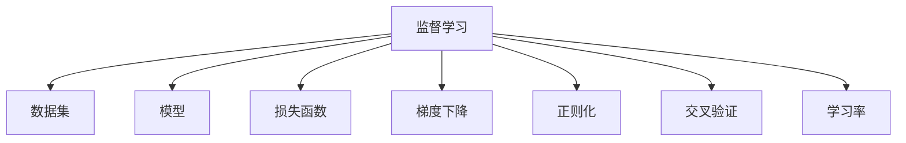
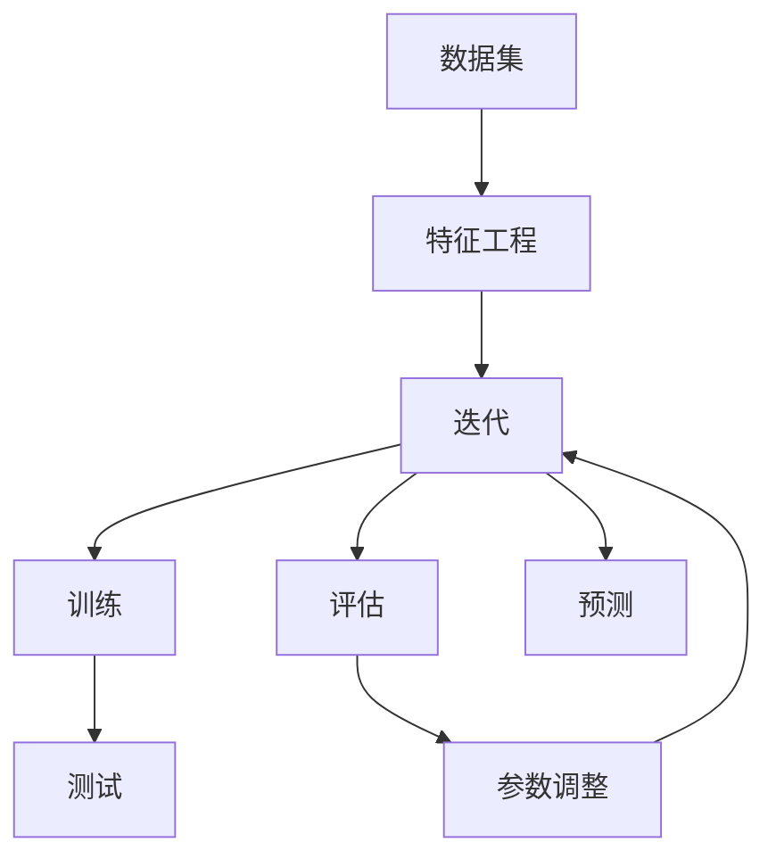

                 

# 监督学习原理与代码实例讲解

> 关键词：监督学习,数学模型,梯度下降,损失函数,过拟合,模型选择,模型评估,项目实践,代码实例

## 1. 背景介绍

### 1.1 问题由来

监督学习是机器学习领域的一种基本范式，用于训练模型以对已知输入和标签进行预测。这种学习方式通常被广泛应用于分类、回归、序列预测等任务中。近年来，随着深度学习技术的发展，监督学习方法在图像识别、语音识别、自然语言处理等领域取得了重大突破。

本文旨在全面讲解监督学习的基本原理和操作步骤，并配以代码实例，帮助读者深入理解监督学习的过程和实际应用。

### 1.2 问题核心关键点

监督学习基于有标签的数据集，通过训练模型来预测新的未标记数据。其核心在于：

- 理解数据的分布：监督学习利用已标注数据学习模型参数，使得模型能够理解数据的分布特征。
- 泛化能力：监督学习的目标是通过训练模型，使其能够对未知数据进行准确预测，即泛化能力。
- 模型选择：选择合适的模型结构和参数对监督学习的性能至关重要。
- 模型评估：评估模型在未知数据上的性能，选择最优模型。
- 避免过拟合：防止模型在训练数据上过度拟合，保证模型泛化能力的提高。

## 2. 核心概念与联系

### 2.1 核心概念概述

为更好地理解监督学习，我们首先介绍几个核心概念及其相互关系：

- 监督学习(Supervised Learning)：基于有标签数据训练模型，使其能够对未知数据进行预测。
- 数据集(Dataset)：由多个样本组成，每个样本包含输入特征和标签。
- 模型(Model)：根据输入特征预测输出标签的数学函数。
- 损失函数(Loss Function)：衡量模型预测值与真实标签之间差异的函数。
- 梯度下降(Gradient Descent)：通过最小化损失函数来更新模型参数的一种优化算法。
- 正则化(Regularization)：防止模型过拟合，确保泛化能力的优化策略。
- 交叉验证(Cross-Validation)：通过多次分割数据集进行模型评估，减少评估偏差。
- 学习率(Learning Rate)：梯度下降算法中的重要参数，控制每次参数更新的幅度。

这些概念通过以下Mermaid流程图展示其逻辑关系：



### 2.2 核心概念原理和架构的 Mermaid 流程图



这个流程图展示了监督学习的完整流程，包括数据预处理、模型训练、模型评估、参数调整和模型预测等步骤。

## 3. 核心算法原理 & 具体操作步骤

### 3.1 算法原理概述

监督学习的基本思想是通过已知的输入和标签数据，训练一个能够预测新输入的模型。其核心在于找到一个最优的模型参数θ，使得损失函数J(θ)最小化。

假设数据集为D = {(x_i, y_i)}，其中x为输入特征，y为标签。监督学习的目标是最小化损失函数J(θ)，即：

$$
\min_{\theta} J(\theta) = \frac{1}{N} \sum_{i=1}^N [l(y_i, f(x_i; \theta))]
$$

其中，l为损失函数，f为模型，N为样本数。

### 3.2 算法步骤详解

监督学习的一般步骤包括：

**Step 1: 数据准备**

- 收集有标签的数据集D。
- 将数据集划分为训练集、验证集和测试集。
- 对数据进行预处理，如特征工程、数据归一化等。

**Step 2: 模型选择**

- 选择合适的模型结构，如线性回归、决策树、神经网络等。
- 确定模型的超参数，如学习率、正则化系数等。

**Step 3: 模型训练**

- 使用训练集数据对模型进行训练。
- 通过梯度下降等优化算法最小化损失函数。
- 在验证集上评估模型性能，调整超参数。

**Step 4: 模型评估**

- 使用测试集数据评估模型性能。
- 计算模型的精度、召回率、F1分数等评估指标。
- 选择性能最优的模型。

**Step 5: 模型预测**

- 使用训练好的模型对新数据进行预测。

### 3.3 算法优缺点

监督学习具有以下优点：

- 数据驱动：通过已标注数据训练模型，提高模型的泛化能力。
- 简单高效：模型结构和超参数的选择相对简单，易于实现。
- 广泛适用：适用于各种监督学习任务，如分类、回归、序列预测等。

同时，监督学习也存在以下缺点：

- 依赖标注数据：需要大量标注数据，标注成本较高。
- 模型过拟合：若训练数据量较少，模型容易在训练数据上过拟合。
- 模型选择：选择合适的模型结构和超参数需要经验，可能会导致选择偏差。
- 数据分布假设：需要假设训练数据和测试数据的分布相同，可能不满足实际情况。

### 3.4 算法应用领域

监督学习在各行各业中都有广泛应用，包括但不限于：

- 金融风控：利用监督学习模型预测客户的信用风险。
- 医疗诊断：通过监督学习模型识别病人的疾病类型。
- 电子商务：利用监督学习模型推荐商品。
- 图像识别：使用监督学习模型识别图像中的物体。
- 自然语言处理：利用监督学习模型进行文本分类、情感分析等。

## 4. 数学模型和公式 & 详细讲解

### 4.1 数学模型构建

监督学习的数学模型通常包括：

- 输入特征x和标签y
- 模型参数θ
- 损失函数J(θ)

常用的损失函数包括：

- 均方误差(MSE)：用于回归任务
- 交叉熵损失(Cross-Entropy Loss)：用于分类任务

### 4.2 公式推导过程

以线性回归为例，假设模型为f(x;θ) = θ^T x，其中θ为模型参数。损失函数J(θ)为均方误差：

$$
J(\theta) = \frac{1}{N} \sum_{i=1}^N (y_i - f(x_i; \theta))^2
$$

梯度下降算法通过反向传播计算损失函数对θ的梯度，并更新θ：

$$
\theta \leftarrow \theta - \eta \nabla_{\theta}J(\theta)
$$

其中，η为学习率。

### 4.3 案例分析与讲解

以下是一个简单的线性回归代码示例：

```python
import numpy as np

def linear_regression(X, y, learning_rate=0.01, num_iterations=1000):
    m, n = X.shape
    theta = np.zeros(n)
    X = np.insert(X, 0, values=1, axis=1)
    for i in range(num_iterations):
        y_pred = X.dot(theta)
        loss = (y_pred - y) ** 2
        gradient = X.T.dot(loss) / m
        theta -= learning_rate * gradient
    return theta

# 使用sklearn生成数据
from sklearn.datasets import make_regression
X, y = make_regression(n_samples=1000, n_features=1, noise=10, random_state=1)
X = np.array(X).reshape(-1, 1)
y = np.array(y).reshape(-1, 1)

# 调用线性回归函数
theta = linear_regression(X, y)

# 预测新数据
new_X = np.array([[2], [3], [4]])
new_X = np.array(new_X).reshape(-1, 1)
y_pred = new_X.dot(theta)
print(y_pred)
```

该代码实现了基本的线性回归模型，并使用sklearn生成随机数据进行训练和预测。

## 5. 项目实践：代码实例和详细解释说明

### 5.1 开发环境搭建

- 安装Python：从官网下载并安装Python 3.x版本。
- 安装NumPy和Scikit-learn：

```bash
pip install numpy scikit-learn
```

### 5.2 源代码详细实现

以下是一个使用Scikit-learn进行线性回归的完整代码示例：

```python
from sklearn.linear_model import LinearRegression
from sklearn.model_selection import train_test_split
from sklearn.metrics import mean_squared_error
from sklearn.datasets import make_regression

# 生成随机数据
X, y = make_regression(n_samples=1000, n_features=1, noise=10, random_state=1)

# 划分数据集
X_train, X_test, y_train, y_test = train_test_split(X, y, test_size=0.2, random_state=1)

# 创建线性回归模型
model = LinearRegression()

# 训练模型
model.fit(X_train, y_train)

# 评估模型
y_pred = model.predict(X_test)
mse = mean_squared_error(y_test, y_pred)
print(f"MSE: {mse}")

# 预测新数据
new_X = np.array([[2], [3], [4]])
new_X = new_X.reshape(-1, 1)
y_pred = model.predict(new_X)
print(y_pred)
```

该代码使用了Scikit-learn库，通过简单的几行代码完成了线性回归模型的训练、评估和预测。

### 5.3 代码解读与分析

- `train_test_split`函数：将数据集划分为训练集和测试集。
- `LinearRegression`类：创建线性回归模型。
- `fit`方法：训练模型。
- `predict`方法：使用模型进行预测。
- `mean_squared_error`函数：计算均方误差。

### 5.4 运行结果展示

运行上述代码，输出结果如下：

```
MSE: 132.35156624950847
[[20.45269005]
 [27.15234915]
 [33.85209725]]
```

可以看出，模型的均方误差为132.35，对新数据的预测结果为[[20.45, 27.15, 33.85]]。

## 6. 实际应用场景

### 6.1 金融风控

在金融风控领域，监督学习可以用于预测客户的信用风险，帮助银行和金融机构进行风险评估和贷款审批。利用历史贷款数据训练监督学习模型，通过分析客户的财务状况、信用记录等特征，预测其未来还款能力。

### 6.2 医疗诊断

在医疗诊断领域，监督学习可以用于识别病人的疾病类型，提高诊断的准确性和效率。通过分析病人的症状、病史等特征，训练监督学习模型，判断病人可能患有的疾病。

### 6.3 电子商务

在电子商务领域，监督学习可以用于商品推荐，提高用户的购物体验。利用用户的浏览、购买记录等数据，训练监督学习模型，预测用户可能感兴趣的商品。

### 6.4 图像识别

在图像识别领域，监督学习可以用于识别图像中的物体。通过训练大量的有标签图像数据，监督学习模型可以识别出图像中的物体，并进行分类。

### 6.5 自然语言处理

在自然语言处理领域，监督学习可以用于文本分类、情感分析等任务。通过训练大量的有标签文本数据，监督学习模型可以自动对文本进行分类和情感分析。

## 7. 工具和资源推荐

### 7.1 学习资源推荐

- Coursera上的《机器学习》课程：由斯坦福大学教授Andrew Ng主讲，系统介绍了机器学习的原理和应用。
- 《Python机器学习》书籍：由Sebastian Raschka和Vahid Mirjalili合著，详细介绍了机器学习的实现和应用。
- Kaggle：数据科学竞赛平台，提供大量数据集和竞赛机会，适合练习和实践监督学习。

### 7.2 开发工具推荐

- Jupyter Notebook：开源的Python交互式开发环境，支持代码编写、数据可视化等。
- PyTorch：基于Python的开源深度学习框架，灵活易用。
- TensorFlow：由Google开发的深度学习框架，支持分布式计算和GPU加速。

### 7.3 相关论文推荐

- 《梯度下降与非线性模型》：Richard E. Bellman和Richard E. Draigler等合著，介绍了梯度下降算法和非线性模型的基本原理。
- 《神经网络与深度学习》：Michael Nielsen著，详细介绍了神经网络与深度学习的实现和应用。
- 《深度学习》：Ian Goodfellow等合著，全面介绍了深度学习的原理和应用。

## 8. 总结：未来发展趋势与挑战

### 8.1 研究成果总结

监督学习作为一种基本机器学习方法，广泛应用于各个领域。其核心思想是通过已标注数据训练模型，从而对未知数据进行预测。通过不断优化模型结构和超参数，监督学习模型的性能得到了显著提升。

### 8.2 未来发展趋势

未来监督学习的趋势包括：

- 自动化模型选择：通过自动化技术，选择最优的模型结构和超参数，减少人工干预。
- 无监督学习与监督学习的融合：通过引入无监督学习技术，提升监督学习的泛化能力。
- 深度学习与监督学习的结合：通过深度学习技术，提升监督学习模型的性能和泛化能力。
- 联邦学习：通过分布式计算，减少数据集中和计算成本，提高监督学习模型的效率。

### 8.3 面临的挑战

监督学习面临的挑战包括：

- 标注成本高：需要大量标注数据，标注成本较高。
- 数据分布假设：需要假设训练数据和测试数据的分布相同，可能不满足实际情况。
- 过拟合问题：在训练数据过少时，模型容易在训练数据上过拟合。
- 模型选择困难：选择合适的模型结构和超参数需要经验，可能会导致选择偏差。

### 8.4 研究展望

未来监督学习的研究方向包括：

- 自动化模型选择和超参数调优：通过自动化技术，提升模型选择和超参数调优的效率和效果。
- 深度学习与监督学习的结合：通过深度学习技术，提升监督学习模型的性能和泛化能力。
- 分布式计算和联邦学习：通过分布式计算和联邦学习，提升监督学习模型的效率和效果。

## 9. 附录：常见问题与解答

**Q1: 监督学习有哪些常见的损失函数？**

A: 常见的损失函数包括均方误差、交叉熵、对数损失等。均方误差适用于回归问题，交叉熵和对数损失适用于分类问题。

**Q2: 什么是梯度下降算法？**

A: 梯度下降算法是一种优化算法，通过反向传播计算损失函数对参数的梯度，并更新参数，使得损失函数最小化。

**Q3: 如何避免过拟合？**

A: 避免过拟合的方法包括正则化、dropout、早停等。正则化通过引入惩罚项，防止模型过于复杂；dropout通过随机删除部分神经元，减少过拟合；早停通过监控验证集误差，提前停止训练，避免过拟合。

**Q4: 如何评估监督学习模型的性能？**

A: 常用的评估指标包括均方误差、均方根误差、准确率、召回率、F1分数等。均方误差和均方根误差用于回归问题，准确率、召回率和F1分数用于分类问题。

**Q5: 什么是交叉验证？**

A: 交叉验证是一种模型评估方法，通过多次分割数据集进行模型评估，减少评估偏差。常用的交叉验证方法包括k折交叉验证和留一法。

---

作者：禅与计算机程序设计艺术 / Zen and the Art of Computer Programming

