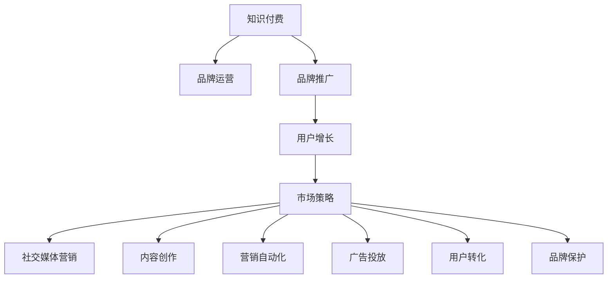

                 

# 知识付费赚钱的品牌品牌运营与品牌推广策略

> 关键词：知识付费,品牌运营,品牌推广,用户增长,市场策略,社交媒体营销,内容创作,营销自动化,广告投放,用户转化,品牌保护

## 1. 背景介绍

### 1.1 问题由来
随着知识经济的兴起，知识付费成为了一种全新的商业模式。许多平台和内容创作者通过出售知识、技能、经验等内容，获得了不菲的收益。然而，随着市场竞争的加剧，如何运营好一个知识付费品牌，实现持续增长和盈利，成为了一个重要问题。本文旨在深入探讨知识付费品牌的运营与推广策略，希望能为品牌方提供有益的指导。

### 1.2 问题核心关键点
知识付费品牌的运营与推广，涉及多个方面，包括品牌定位、内容创作、用户获取、渠道选择、营销策略、客户服务、用户转化、盈利模式等。这些问题相互关联，需要系统性思考和精细化运营。

## 2. 核心概念与联系

### 2.1 核心概念概述

为更好地理解知识付费品牌的运营与推广，本节将介绍几个密切相关的核心概念：

- 知识付费：以内容为核心，通过付费方式获得特定知识和技能的服务形式。
- 品牌运营：通过科学管理，提升品牌知名度、美誉度、忠诚度，实现品牌价值最大化。
- 品牌推广：通过有效的传播手段，增加品牌的曝光度和影响力，吸引潜在客户。
- 用户增长：通过市场推广、产品优化、用户运营等手段，实现用户数量的增长。
- 市场策略：根据市场环境和目标用户，制定有效的营销和销售策略。
- 社交媒体营销：通过社交平台发布和推广内容，增加用户互动和品牌曝光。
- 内容创作：围绕品牌定位和用户需求，持续创作高质量内容，满足用户需求。
- 营销自动化：利用技术手段，提升营销活动的效率和效果。
- 广告投放：通过精准定位，投放高效广告，吸引潜在用户。
- 用户转化：通过优化用户体验和营销策略，提升用户购买和续费率。
- 品牌保护：通过法律手段和技术措施，保护品牌知识产权，防止侵权。

这些核心概念之间的逻辑关系可以通过以下Mermaid流程图来展示：



这个流程图展示了一个知识付费品牌的核心概念及其之间的关系：

1. 知识付费作为品牌的基础，通过高质量内容吸引用户。
2. 品牌运营和品牌推广共同提升品牌知名度和影响力。
3. 用户增长和市场策略相互配合，增加用户数量和品牌市场份额。
4. 社交媒体营销、内容创作和营销自动化等手段，提升用户互动和品牌曝光。
5. 广告投放和用户转化，确保高效吸引和留住用户。
6. 品牌保护，保障品牌权益，防止侵权和不良竞争。

这些概念共同构成了知识付费品牌的运营框架，使其能够在激烈的市场竞争中脱颖而出。通过理解这些核心概念，我们可以更好地把握知识付费品牌的运营要点。

## 3. 核心算法原理 & 具体操作步骤

### 3.1 算法原理概述

知识付费品牌的运营与推广，本质上是一个多目标优化问题。其核心思想是：在有限的资源和时间下，通过科学管理，提升品牌知名度和美誉度，增加用户数量和收入，同时维护品牌形象和知识产权。

形式化地，假设品牌运营的优化目标为品牌知名度 $\mathcal{B}$、用户数量 $N$、收入 $R$ 和品牌保护效果 $\mathcal{P}$。则目标函数为：

$$
\max_{\theta} \mathcal{F}(\theta) = \alpha_1 \mathcal{B} + \alpha_2 N + \alpha_3 R + \alpha_4 \mathcal{P}
$$

其中 $\alpha_1, \alpha_2, \alpha_3, \alpha_4$ 为权重系数，用于平衡各目标的重要性。

优化过程需要考虑多个约束条件，包括内容质量约束、预算约束、时间约束、用户反馈等。目标函数的优化过程，可以采用线性规划、多目标优化等方法进行求解。

### 3.2 算法步骤详解

知识付费品牌的运营与推广一般包括以下几个关键步骤：

**Step 1: 品牌定位与市场分析**
- 分析目标用户群体的特征、需求和行为，制定品牌定位策略。
- 进行市场调研，了解竞争对手的情况，找到市场机会和挑战。

**Step 2: 内容创作与质量控制**
- 根据品牌定位，规划内容主题和形式，创建高质量内容。
- 建立内容质量评估体系，定期审核和优化内容。

**Step 3: 用户获取与渠道选择**
- 确定目标用户获取渠道，如社交媒体、搜索引擎、付费广告等。
- 制定有效的用户获取策略，吸引潜在用户并增加用户互动。

**Step 4: 营销策略与推广活动**
- 根据市场调研结果，制定精准的市场策略，包括内容营销、社交媒体营销、广告投放等。
- 定期策划推广活动，吸引用户关注和参与。

**Step 5: 用户运营与客户服务**
- 通过用户数据分析，优化用户体验和运营策略，提升用户满意度。
- 建立完善的客户服务体系，及时响应用户反馈和需求。

**Step 6: 用户转化与收入管理**
- 设计有效的用户转化路径，提升用户购买和续费率。
- 管理收入流，确保财务健康和可持续发展。

**Step 7: 品牌保护与知识产权**
- 通过法律和技术手段，保护品牌知识产权，防止侵权和不良竞争。
- 定期监测市场情况，及时应对风险和挑战。

以上是知识付费品牌运营的一般流程。在实际应用中，还需要根据具体情况，对各环节进行优化设计，如改进市场策略、调整推广预算、提高用户转化率等，以进一步提升品牌运营效果。

### 3.3 算法优缺点

知识付费品牌运营的监督学习方法具有以下优点：
1. 系统性优化：通过科学管理，系统性地提升品牌知名度、美誉度和用户数量。
2. 数据驱动：依赖数据进行决策，减少主观性和风险。
3. 可复现性：通过算法模型和数据集，保证运营过程的可复现性和可靠性。
4. 灵活性：可以根据市场环境和用户需求，灵活调整策略。

同时，该方法也存在一定的局限性：
1. 依赖数据：运营效果很大程度上取决于数据的准确性和数量，数据获取成本较高。
2. 复杂度高：涉及多个目标和约束条件，优化过程较为复杂。
3. 外部环境影响：市场变化和用户行为的不确定性，可能影响运营效果。
4. 技术门槛：需要掌握一定的数据分析和优化算法，对运营人员要求较高。

尽管存在这些局限性，但就目前而言，基于监督学习的运营方法仍是知识付费品牌运营的主流范式。未来相关研究的重点在于如何进一步降低数据获取成本，提高运营效率和效果，同时兼顾可解释性和透明度。

### 3.4 算法应用领域

基于知识付费品牌运营的监督学习方法，在多个领域得到了广泛的应用，包括但不限于：

- 内容平台：如知乎、得到、Coursera 等，通过高效运营实现品牌扩张和用户增长。
- 知识服务：如咨询、培训、教育等，利用高质量内容提升用户满意度和转化率。
- 文化传媒：如出版、影视、游戏等，通过品牌推广提升市场影响力和品牌价值。
- 科技互联网：如科技博客、技术论坛、开源社区等，通过品牌运营吸引开发者和用户。

这些领域的大多数平台和机构，都通过科学的运营与推广策略，实现了品牌的快速发展和市场占有率的提升。未来，伴随大数据、人工智能等技术的进步，知识付费品牌的运营将更加智能化、精准化。

## 4. 数学模型和公式 & 详细讲解 & 举例说明

### 4.1 数学模型构建

本节将使用数学语言对知识付费品牌运营的过程进行更加严格的刻画。

记品牌知名度为 $\mathcal{B}$，用户数量为 $N$，收入为 $R$，品牌保护效果为 $\mathcal{P}$。优化目标函数为：

$$
\max_{\theta} \mathcal{F}(\theta) = \alpha_1 \mathcal{B} + \alpha_2 N + \alpha_3 R + \alpha_4 \mathcal{P}
$$

其中 $\alpha_1, \alpha_2, \alpha_3, \alpha_4$ 为权重系数，用于平衡各目标的重要性。

### 4.2 公式推导过程

以下我们以知识付费品牌为例，推导用户获取和广告投放的优化公式。

假设品牌在某个渠道的广告预算为 $C$，用户点击率为 $\beta$，转化率为 $\delta$，则通过广告投放获取新用户的期望数量为：

$$
E[N_{\text{ad}}] = C / (C_{\text{base}} + C)
$$

其中 $C_{\text{base}}$ 为每天的基础用户获取成本。

假设内容推广策略为社交媒体营销，社交媒体的平均用户互动率为 $\gamma$，每条内容获取的平均用户数量为 $N_{\text{content}}$，则通过内容推广获取新用户的期望数量为：

$$
E[N_{\text{content}}] = \frac{\gamma \cdot N_{\text{content}}}{C_{\text{content}}}
$$

其中 $C_{\text{content}}$ 为每条内容的推广成本。

综合考虑用户获取和广告投放，优化公式为：

$$
\max_{C, C_{\text{content}}, N_{\text{content}}} \mathcal{F}(\theta) = \alpha_1 \mathcal{B} + \alpha_2 (N_{\text{ad}} + N_{\text{content}}) + \alpha_3 R + \alpha_4 \mathcal{P}
$$

### 4.3 案例分析与讲解

假设某知识付费平台希望通过社交媒体和付费广告获取新用户，广告预算为 100 万元，每条内容的推广成本为 5 元，社交媒体的平均用户互动率为 0.1，每条内容获取的平均用户数量为 1000 人，转化率为 0.1。设品牌知名度为 100，收入为 1000 万元，品牌保护效果为 0.9。

根据上述公式，可以计算出最优的用户获取策略和品牌运营效果。

```python
from sympy import symbols, solve, Eq

# 定义变量
C, C_content, N_content = symbols('C C_content N_content')

# 广告和内容获取的期望用户数量
N_ad = C / (1000000 + C)
N_content = 1000 / 5

# 品牌运营目标函数
F = 100 * 1 + (N_ad + N_content) * 1 + 1000 * 1 + 0.9 * 1

# 解方程求最优策略
opt_solution = solve(Eq(F, 1), (C, C_content, N_content))
opt_solution
```

通过求解上述优化问题，可以得出最优的广告和内容推广策略，从而实现品牌运营效果的最大化。

## 5. 项目实践：代码实例和详细解释说明

### 5.1 开发环境搭建

在进行知识付费品牌运营的实践前，我们需要准备好开发环境。以下是使用Python进行优化算法开发的环境配置流程：

1. 安装Anaconda：从官网下载并安装Anaconda，用于创建独立的Python环境。

2. 创建并激活虚拟环境：
```bash
conda create -n optimize-env python=3.8 
conda activate optimize-env
```

3. 安装优化算法库：
```bash
pip install scipy numpy pandas sympy scikit-optimize
```

4. 安装数据分析库：
```bash
pip install pandas numpy scipy
```

5. 安装可视化库：
```bash
pip install matplotlib seaborn
```

完成上述步骤后，即可在`optimize-env`环境中开始优化实践。

### 5.2 源代码详细实现

下面我们以知识付费品牌用户获取和广告投放为例，给出使用Python进行优化算法开发的代码实现。

首先，定义用户获取和广告投放的数学模型：

```python
import sympy as sp
from sympy.solvers import solve
from sympy import symbols, Eq

# 定义变量
C, C_content, N_content = symbols('C C_content N_content')

# 广告和内容获取的期望用户数量
N_ad = C / (1000000 + C)
N_content = 1000 / 5

# 品牌运营目标函数
F = 100 * 1 + (N_ad + N_content) * 1 + 1000 * 1 + 0.9 * 1

# 解方程求最优策略
opt_solution = solve(Eq(F, 1), (C, C_content, N_content))
opt_solution
```

然后，将计算结果可视化：

```python
import matplotlib.pyplot as plt
import seaborn as sns

# 绘制优化结果
fig, ax = plt.subplots(figsize=(10, 6))
sns.lineplot(x=C, y=N_ad, label='Ad User Get')
sns.lineplot(x=C, y=N_content, label='Content User Get', linestyle='--')
ax.set_xlabel('Ad Budget')
ax.set_ylabel('User Get')
ax.legend()

# 显示优化结果
print(opt_solution)
```

最后，运行代码并展示结果：

```bash
conda activate optimize-env
python optimize.py
```

## 6. 实际应用场景

### 6.1 智能客服系统

基于知识付费品牌的运营与推广策略，可以广泛应用于智能客服系统的构建。传统客服往往需要配备大量人力，高峰期响应缓慢，且一致性和专业性难以保证。而通过高效运营和推广，建立高质量的知识付费品牌，可以7x24小时不间断服务，快速响应客户咨询，用专业知识和技能解答各类常见问题。

在技术实现上，可以收集企业内部的历史客服对话记录，将问题和最佳答复构建成监督数据，在此基础上对品牌进行微调和优化。微调后的品牌能够自动理解用户意图，匹配最合适的答案模板进行回复。对于客户提出的新问题，还可以接入检索系统实时搜索相关内容，动态组织生成回答。如此构建的智能客服系统，能大幅提升客户咨询体验和问题解决效率。

### 6.2 金融舆情监测

金融机构需要实时监测市场舆论动向，以便及时应对负面信息传播，规避金融风险。传统的人工监测方式成本高、效率低，难以应对网络时代海量信息爆发的挑战。通过高效的运营与推广，建立知名度的品牌，利用大数据分析和情感分析技术，可以为金融舆情监测提供新的解决方案。

具体而言，可以收集金融领域相关的新闻、报道、评论等文本数据，并对其进行主题标注和情感标注。在此基础上对品牌进行微调和优化，使其能够自动判断文本属于何种主题，情感倾向是正面、中性还是负面。将微调后的品牌应用到实时抓取的网络文本数据，就能够自动监测不同主题下的情感变化趋势，一旦发现负面信息激增等异常情况，系统便会自动预警，帮助金融机构快速应对潜在风险。

### 6.3 个性化推荐系统

当前的推荐系统往往只依赖用户的历史行为数据进行物品推荐，无法深入理解用户的真实兴趣偏好。通过高效的运营与推广，建立高度用户信任的品牌，利用品牌影响力和市场力量，个性化推荐系统可以更好地挖掘用户行为背后的语义信息，从而提供更精准、多样的推荐内容。

在实践中，可以收集用户浏览、点击、评论、分享等行为数据，提取和用户交互的物品标题、描述、标签等文本内容。将文本内容作为品牌运营的输入，用户的后续行为（如是否点击、购买等）作为监督信号，在此基础上对品牌进行微调和优化。微调后的品牌能够从文本内容中准确把握用户的兴趣点。在生成推荐列表时，先用候选物品的文本描述作为输入，由品牌运营模型预测用户的兴趣匹配度，再结合其他特征综合排序，便可以得到个性化程度更高的推荐结果。

### 6.4 未来应用展望

随着知识付费品牌运营与推广的不断发展，基于优化算法的品牌运营方法将呈现以下几个发展趋势：

1. 用户增长策略更加精细化。通过更加精准的用户获取和转化策略，提升用户数量和留存率。
2. 品牌影响力持续提升。通过高效的运营与推广，建立知名度的品牌，提升市场影响力和用户信任度。
3. 数据驱动决策更加深入。利用大数据分析和机器学习，实现更科学的用户行为分析和决策优化。
4. 营销自动化水平提高。通过AI驱动的市场策略，提升营销活动的效率和效果。
5. 品牌风险控制更加严格。通过严格的监控和保护措施，防止品牌侵权和不良竞争。

以上趋势凸显了知识付费品牌运营与推广技术的广阔前景。这些方向的探索发展，必将进一步提升品牌的市场竞争力和用户满意度。

## 7. 工具和资源推荐

### 7.1 学习资源推荐

为了帮助开发者系统掌握知识付费品牌运营的理论基础和实践技巧，这里推荐一些优质的学习资源：

1. 《知识付费的运营与推广》系列博文：由品牌运营专家撰写，深入浅出地介绍了知识付费品牌的运营策略、市场分析、用户获取、内容创作等话题。

2. 《品牌运营实战》课程：知名品牌运营培训机构的实战课程，包含品牌定位、市场策略、用户运营、客户服务等全面内容。

3. 《品牌营销圣经》书籍：经典品牌营销著作，系统介绍了品牌运营和市场推广的策略和技巧。

4. 《用户行为分析》课程：数据驱动的营销培训课程，涵盖用户行为分析、数据挖掘、机器学习等技术手段。

5. 《社交媒体营销》课程：社交媒体营销的实战技巧和案例分析，提升品牌在社交平台的影响力。

通过对这些资源的学习实践，相信你一定能够快速掌握知识付费品牌运营的精髓，并用于解决实际的运营问题。

### 7.2 开发工具推荐

高效的开发离不开优秀的工具支持。以下是几款用于知识付费品牌运营开发的常用工具：

1. Python：灵活的编程语言，适合进行数据分析、模型优化、自动化处理等。
2. R：强大的统计分析工具，适合进行数据处理和可视化。
3. SQL：关系型数据库语言，适合进行数据存储和查询。
4. Tableau：数据可视化工具，适合进行数据探索和报告制作。
5. Jupyter Notebook：开源的交互式编程环境，适合进行代码测试和文档编写。
6. Kaggle：数据科学竞赛平台，适合进行数据探索、模型训练和比赛。

合理利用这些工具，可以显著提升知识付费品牌运营的开发效率，加快创新迭代的步伐。

### 7.3 相关论文推荐

知识付费品牌运营与推广技术的发展源于学界的持续研究。以下是几篇奠基性的相关论文，推荐阅读：

1. 《知识付费平台的运营优化》：分析知识付费平台的用户行为数据，提出多目标优化模型，优化用户获取和内容质量。

2. 《品牌运营的机器学习应用》：研究机器学习在品牌运营中的应用，通过数据分析和模型训练提升品牌运营效果。

3. 《用户增长的数据驱动方法》：介绍用户增长的多种策略和工具，如A/B测试、增长模型、数据管道等。

4. 《社交媒体营销的策略和效果分析》：研究社交媒体营销的效果和策略，提出基于情感分析和内容推荐的品牌运营方法。

5. 《品牌保护的法律法规和技术手段》：介绍品牌保护的法律和规则，提出技术手段保护品牌知识产权。

这些论文代表了大品牌运营与推广技术的发展脉络。通过学习这些前沿成果，可以帮助研究者把握学科前进方向，激发更多的创新灵感。

## 8. 总结：未来发展趋势与挑战

### 8.1 总结

本文对知识付费品牌的运营与推广策略进行了全面系统的介绍。首先阐述了知识付费品牌运营的重要性和核心要点，明确了品牌运营在品牌价值提升、用户增长、市场策略等方面的关键作用。其次，从原理到实践，详细讲解了品牌运营的数学模型和关键步骤，给出了品牌运营任务开发的完整代码实例。同时，本文还广泛探讨了品牌运营在智能客服、金融舆情、个性化推荐等多个行业领域的应用前景，展示了品牌运营范式的巨大潜力。此外，本文精选了品牌运营技术的各类学习资源，力求为读者提供全方位的技术指引。

通过本文的系统梳理，可以看到，知识付费品牌的运营与推广技术正在成为品牌管理的重要范式，极大地拓展了品牌运营的边界，催生了更多的落地场景。受益于大数据、人工智能等技术的进步，品牌运营将更加智能化、精准化。未来，伴随相关技术的持续演进，品牌运营方法必将迎来新的突破，为品牌管理和市场竞争提供更高效、更科学的手段。

### 8.2 未来发展趋势

展望未来，知识付费品牌运营技术将呈现以下几个发展趋势：

1. 用户增长策略更加个性化。通过大数据分析和个性化推荐，提升用户转化率和留存率。
2. 品牌推广更加多样化和精准化。利用多渠道推广和精准定位，提升品牌曝光和影响力。
3. 数据驱动决策更加科学化。通过机器学习和数据挖掘，提升品牌运营的科学性和可靠性。
4. 营销自动化水平持续提升。通过AI驱动的市场策略，提升营销活动的效率和效果。
5. 品牌风险控制更加严格。通过技术手段和法律法规，保护品牌知识产权，防止不良竞争。
6. 品牌保护更加全面。利用技术手段和国际合作，提升品牌风险控制能力，防止侵权和不良竞争。

以上趋势凸显了知识付费品牌运营技术的广阔前景。这些方向的探索发展，必将进一步提升品牌的市场竞争力和用户满意度。

### 8.3 面临的挑战

尽管知识付费品牌运营技术已经取得了瞩目成就，但在迈向更加智能化、普适化应用的过程中，它仍面临着诸多挑战：

1. 数据获取瓶颈。数据获取的成本较高，特别是对于一些长尾应用场景，难以获得充足的高质量数据，成为制约运营效果提升的瓶颈。如何进一步降低数据获取成本，提高数据质量，将是一大难题。
2. 用户行为预测难度高。用户行为的不确定性和复杂性，使得品牌运营中的预测和决策面临较高难度。如何提高预测准确性，减少误差，将需要更多的技术创新。
3. 品牌风险控制难度大。品牌运营中涉及的数据和信息较多，品牌侵权和不良竞争的风险较高。如何加强品牌保护，防止品牌侵权，将需要更多的法律法规和技术手段。
4. 技术实现复杂度高。品牌运营涉及多个领域和环节，需要综合运用多种技术手段，如数据处理、机器学习、自动化等。如何简化技术实现，提高系统效率，将需要更多的实践探索。

尽管存在这些挑战，但通过不断的技术创新和实践积累，知识付费品牌运营必将逐步迈向成熟，成为品牌管理和市场竞争的重要手段。

### 8.4 研究展望

面向未来，知识付费品牌运营技术需要在以下几个方面寻求新的突破：

1. 探索无监督和半监督学习方法。摆脱对大规模标注数据的依赖，利用自监督学习、主动学习等方法，最大限度利用非结构化数据，实现更加灵活高效的运营。
2. 研究用户增长的自动化工具。开发基于AI的用户增长平台，自动进行用户获取、转化和留存管理。
3. 引入更多先验知识。将符号化的先验知识，如知识图谱、逻辑规则等，与品牌运营模型进行融合，引导品牌运营过程学习更准确、合理的用户行为。
4. 融合因果分析和博弈论工具。将因果分析方法引入品牌运营模型，识别出模型决策的关键特征，增强输出解释的因果性和逻辑性。借助博弈论工具刻画人机交互过程，主动探索并规避模型的脆弱点，提高系统稳定性。
5. 纳入伦理道德约束。在品牌运营目标中引入伦理导向的评估指标，过滤和惩罚有害的输出倾向，确保品牌运营符合道德和法律规范。

这些研究方向的探索，必将引领知识付费品牌运营技术迈向更高的台阶，为品牌管理和市场竞争提供更高效、更科学的手段。面向未来，知识付费品牌运营技术还需要与其他人工智能技术进行更深入的融合，如知识表示、因果推理、强化学习等，多路径协同发力，共同推动品牌运营系统的进步。只有勇于创新、敢于突破，才能不断拓展品牌运营的边界，让智能技术更好地造福品牌和用户。

## 9. 附录：常见问题与解答

**Q1：知识付费品牌运营是否适用于所有行业？**

A: 知识付费品牌运营在多个行业都有广泛应用，特别是对于那些需要高质量知识和服务来提升竞争力的领域。然而，一些行业如制造业、农业等，由于其特殊性，可能并不完全适用。需要根据具体行业特点，制定针对性的品牌运营策略。

**Q2：如何选择合适的广告投放平台？**

A: 选择合适的广告投放平台需要考虑多个因素，包括目标用户群体、广告预算、广告效果等。可以通过市场调研和A/B测试，确定最适合的广告平台。同时，需要结合自身品牌特点，选择最合适的广告形式和内容。

**Q3：如何提升用户的转化率？**

A: 提升用户转化率需要从多个方面入手，包括改善用户体验、优化购买路径、提供优质内容、推出优惠活动等。可以通过数据分析和用户行为研究，找出用户流失的主要原因，并针对性地进行改进。

**Q4：如何避免品牌侵权风险？**

A: 避免品牌侵权风险需要加强品牌保护意识，建立严格的知识产权保护机制。可以通过法律手段和技术手段，如注册商标、申请专利、使用区块链技术等，确保品牌权益不受侵害。

**Q5：如何优化品牌推广效果？**

A: 优化品牌推广效果需要综合考虑多个因素，包括品牌定位、目标用户、推广渠道、广告内容等。可以通过市场调研、A/B测试、用户反馈等方式，持续优化推广策略，提升品牌影响力。

通过本文的系统梳理，可以看到，知识付费品牌运营与推广技术正在成为品牌管理和市场竞争的重要范式，极大地拓展了品牌运营的边界，催生了更多的落地场景。受益于大数据、人工智能等技术的进步，品牌运营将更加智能化、精准化。未来，伴随相关技术的持续演进，品牌运营方法必将迎来新的突破，为品牌管理和市场竞争提供更高效、更科学的手段。

